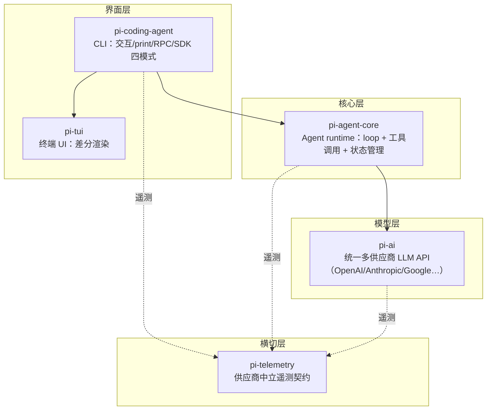

**TL;DR：** Agent 做完一件事，表现差异主要来自 harness 而不是模型——Databricks 用同一模型、同一思考档位跑两个 harness，每任务成本差出 2 倍以上，Pi 每轮喂给模型的上下文比 Claude Code 少约 3 倍。这个"少"不是省钱的技巧，而是架构的结果：Pi 把 Agent 拆成五个职责清晰的包（telemetry / ai / agent-core / coding-agent / tui），并用一份「刻意不做」清单——不接 MCP、不做子 Agent、不做权限弹窗、不做 plan mode、不做 to-do、不做后台 bash——把核心维持在一个工程师一周能读完的体积。本文是一张地图：每一层回答什么问题、边界画在哪、删掉的功能由什么替代。

## 一、同一个模型，两个 harness，2 倍价差

2026 年 7 月 8 日，Databricks 发布了对自家百万行代码库的编码 Agent 基准[^databricks]。它没有用 SWE-Bench 这类公开题集，而是把工程师真实合入的 PR 改写成任务、手工评审每一条、测试集全部执行。结论最扎眼的一条是：**模型的 token 单价预测不了任务成本**。

同一模型、同一思考档位，跑在 Claude Code 和 Pi 两个 harness 上，成本差异超过 2 倍，通过率持平——差异来自"每个 turn 喂给模型多少上下文"：Pi 平均每轮约少 3 倍。GLM 5.2 跑在 Pi 上（$1.25/任务）和 Opus 4.8 high 跑在 Claude Code 上（$2/任务）通过率都是约 87.5%；全场最高通过率 90% 则是 Opus 4.8 xhigh 跑在 Pi 上拿到的。

这不是广告。Databricks 的目的恰恰是论证"harness 与模型可以解耦"（他们为此做了 Omnigent 元 harness），Pi 只是被测试的对象之一。但对我们要理解的问题，这个实验是完美的入口：**一个只卖 4 个工具、提示词以千级 token 计的极简 harness，在同一模型上赢了功能最全的竞品。** 为什么？答案要从它的分层开始。

## 二、五层地图：每层回答一个问题

Pi 是 earendil-works 的开源项目（MIT，2026-08-20 实测 94,260 stars，最新版 v0.84.2 发布于 2026-08-14）。仓库 monorepo 里正式发布五个包，职责分界非常干净：



*图注：四条竖线是"谁调用谁"；虚线是横切依赖。注意整张图里没有"模型"这个实体——模型是 pi-ai 之上可替换的供货源，这正是 harness 与框架的分水岭。*

五层各自回答一个问题（LOC 为 2026-08-23 复测，@commit b23741269；括号内为 08-20 首测 @5cd93f6）：

| 层 | 包 | 回答的问题 | 规模（实测 TS LOC，不含测试） |
| --- | --- | --- | --- |
| 界面 | `pi-tui` | 终端怎么把状态画出来 | 19,841（16,772） |
| 入口 | `pi-coding-agent` | 用户/脚本/进程怎么进到这个系统 | 87,470（59,900） |
| 核心 | `pi-agent-core` | Agent 怎么循环、怎么调工具、状态放哪 | 15,280（12,635） |
| 模型 | `pi-ai` | 15+ 供应商的 API 差异怎么抹平 | 30,870（23,555） |
| 横切 | `pi-telemetry` | 遥测怎么跨供应商中立 | 935（935） |

（README 声称"agent-core 3-4k、pi-ai 5-7k LOC"，实测分别是 15.3k 与 30.9k——README 的口径大约只说了核心循环文件，此处以实测为据。另外 monorepo 在两次测量之间长出了 client / evals / protocol / server / session-backends / storage 六个目录（合计约 2.7 万行），五层叙事不变，但"核心一周读完"的承诺需要盯着这些新邻居。）

这只是一个规模的骨架。五个包让"Agent 的工程问题"第一次有了坐标：loop 的问题去 `pi-agent-core` 找，供应商的差异去 `pi-ai` 找，上下文装配去 `pi-coding-agent` 找。接下来的系列每一篇对应一层深挖；本文先把四道分界线讲清楚。

## 三、分界线一：模型层的存在，是为了让核心层不认识任何供应商

`pi-ai` 是唯一认识 OpenAI/Anthropic/Google/Mistral/Bedrock/Groq 等 15+ 供应商的包。它对外暴露统一的流式消息 API、把各家模型清单折进一份 catalog、把重试/退避/限流/多供应商路由做成 pi-ai 内部的事（`retry.ts`、`backoff.ts`、`rate-limit.ts`、`multi-vendor.ts` 都在它的 src 里）。

这条分界线的代价是 30.9k 行（2026-08-23 复测）——比整个核心层还大。而这恰恰是买点：**核心层（以及所有 extension 作者）永远只对着 pi-ai 的接口编程，不需要知道"今天的模型是谁"**。Databricks 的 Omnigent、Pi 的 `/model` 会话中途换模型，依赖的都是这条边界。没有这层抽象，换模型就等于改 harness，我们开头说的"2 倍价差实验"根本做不出来——因为实验的前提就是同一模型能跑在两个 harness 上。

## 四、分界线二：核心层只有 loop、工具与状态

`pi-agent-core`（15.3k 行）只做三件事：[`agent-loop.ts`](https://github.com/earendil-works/pi/blob/main/packages/agent/src/agent-loop.ts)（805 行）是主循环，`工具执行`是它的内循环，`状态管理`（Session v4 API，0.84.0 起）决定消息树如何落盘。三个包里的其他职责都不属于它。

主循环的结构极其直白——外层 `while (true)` 处理每个 turn 与排队消息，内层 `while (hasMoreToolCalls || pendingMessages.length > 0)` 一直执行直到模型不再要求调工具（`hasMoreToolCalls = !executedToolBatch.terminate`）：

```ts
// agent-loop.ts 骨架（节选，行 170-216）
while (true) {
  while (hasMoreToolCalls || pendingMessages.length > 0) {
    // 处理排队消息 → 调模型 → 拿到 toolCalls
    // 并行执行工具批次 → 工具结果回填 → 若 terminate 则退出内循环
    hasMoreToolCalls = !executedToolBatch.terminate;
  }
}
```

一个 coding agent 的生死问题——"模型喋喋不休地要求调工具怎么办、什么时候才能停"——在这 805 行里有一个显式答案：每轮由模型自己决定，`terminate` 是停止信号，收敛由外层 turn 结束接管。第二篇会完整走一遍这段代码。

## 五、分界线三：CLI 与 TUI 是壳，语义在 README 与扩展协议上

`pi-coding-agent` 是最大的包（87.5k 行），但它承担的都不是"思考"而是"入口"：四种运行模式（interactive、`pi -p` 打印模式、`--mode json` 事件流、RPC、SDK 嵌入）、AGENTS.md/SYSTEM.md 装配、skills 加载、扩展系统与包管理。TUI 层（19.8k 行）只做差分渲染——状态变了才重画对应行，不重建整屏。

这条边界的含义：**界面的职责是"把核心层的事件流翻译给人或脚本"，任何 UI 逻辑都不能渗进核心层**。反过来，`pi-coding-agent` 的文档（README、docs/ 下的 extensions.md、skills.md、compaction.md……）本身就是它的一部分——Pi 让模型去读自己的文档来理解自己，这一招在上下文装配篇展开。

## 六、分界线四：遥测是横切层，不是某个包的功能

`pi-telemetry` 只有 935 行，却是整套系统的"记账本"：定义供应商中立的遥测契约（token、成本、延迟、事件类型）和参考适配器，`pi-ai` 与 `pi-agent-core` 都在外面挂它。0.84.0 起 Agent 侧有了 typed AI-request 与 harness schema，工具调用/compaction/分支摘要的用量都计入会话总额。

为什么单独成层而不是塞进 pi-ai？因为**用量数据必须跨供应商可比**——如果记账格式由 OpenAI 的 usage 对象决定，换供应商时账就对不齐了。这也直接支撑第九篇的 token 经济性核算。

## 七、「刻意不做」清单：六项功能与替代路径

Pi 官网有一节叫 What we didn't build[^piwhat]。六个刻意不做的功能，每个都给了替代路径：

| 不做 | 官方替代路径 | 取舍逻辑 |
| --- | --- | --- |
| MCP | CLI 工具 + README 的 Skills；或写扩展自己实现 MCP | MCP 是把"工具发现"标准化，Pi 认为 Skills 已覆盖 80% 场景 |
| 子 Agent | tmux 里再起一个 Pi；或扩展自建 | 不加调度器进核心，进程隔离更干净 |
| 权限弹窗 | 三种容器化（Gondolin 微 VM / Docker / OpenShell 策略沙箱） | 权限应在边界上做，不在每个操作上问 |
| plan mode | 把计划写进文件；或扩展自建 | 计划是内容不是模式，文件比模式可传递 |
| 内建 to-do | TODO.md 文件 | 同上：状态属于工作区 |
| 后台 bash | tmux 会话 | 任务可见性优先，"看不见的进程"是隐患 |

这条清单读起来像"极简主义宣言"，但更准确的读法是**算账**：每个内建功能都意味着核心层多一套状态机、多一份必须向后兼容的 API、多一个测试面。Pi 的取舍是让"可以后期嫁接"的功能全部外置，核心只保留不可再减的循环与上下文装配。这也是它能保持"个人一周读完"规模的原因。

代价同样要写清楚：上手默认没有任何护栏（Pi 以启动它的用户权限运行，误操作就在真实文件系统上发生），需要权限边界的人要自己去搭容器；需要多 Agent 协作的人要自己组装 tmux/扩展。这不是"免费午餐"，是把成本移到了更合适的位置。

## 八、结论：分层清晰，才有资格「刻意不做」

把这四道分界线放回开头的 Databricks 实验：Pi 之所以每轮少喂 3 倍上下文，是因为上下文装配被收敛在 coding-agent 一层、由确定性规则控制（03 篇细讲）；它之所以能拿最高通过率，是因为 loop 只做两件事、每轮给模型的信息都经过了裁剪。**先分层，才能删功能；先删功能，才能小；小，才看得透上下文每一 token 的去向。** 这三个结论构成整个系列的骨架。

下一步你可以亲手做两件事：一是 `git clone https://github.com/earendil-works/pi` 后按本文表格重算一遍各包 LOC（口径：`find packages/<p>/src -name '*.ts' | xargs wc -l`，排除测试）；二是翻一遍 `docs/extensions.md` 里的 50+ 示例，选一个你熟悉的场景（比如 plan-mode）看它如何只用扩展协议补上"刻意不做"的功能——这会是你理解 07 篇的钥匙。

[^databricks]: Databricks 官方博客，2026-07-08，《Benchmarking Coding Agents on Databricks' Multi-Million Line Codebase》，https://www.databricks.com/blog/benchmarking-coding-agents-databricks-multi-million-line-codebase
[^piwhat]: Pi 官网 "What we didn't build" 一节，https://pi.dev ，附 Mario Zechner 博客（2025-11-30）与六项功能的替代路径链接

## 参考资料

- earendil-works/pi 仓库 README（五包表、权限与容器化、供应链加固节）：https://github.com/earendil-works/pi
- Pi 五包源码 @ commit 5cd93f6（2026-08-20 浅克隆实测）：packages/{telemetry,ai,agent,coding-agent,tui}
- `packages/agent/src/agent-loop.ts`（805 行 @ b23741269；796 行 @ 5cd93f6 基线）
- `packages/coding-agent/src/core/system-prompt.ts`（162 行，默认模板主体 1288 字符 ≈ 322 tokens）
- Databricks 基准：https://www.databricks.com/blog/benchmarking-coding-agents-databricks-multi-million-line-codebase
- Shopify Engineering《Autoresearch isn't just for training models》(2026-04-15)：https://shopify.engineering/autoresearch
- Pi package 边界与版本：v0.84.2（2026-08-14），94,260 stars / 11,665 forks（2026-08-20 实测）