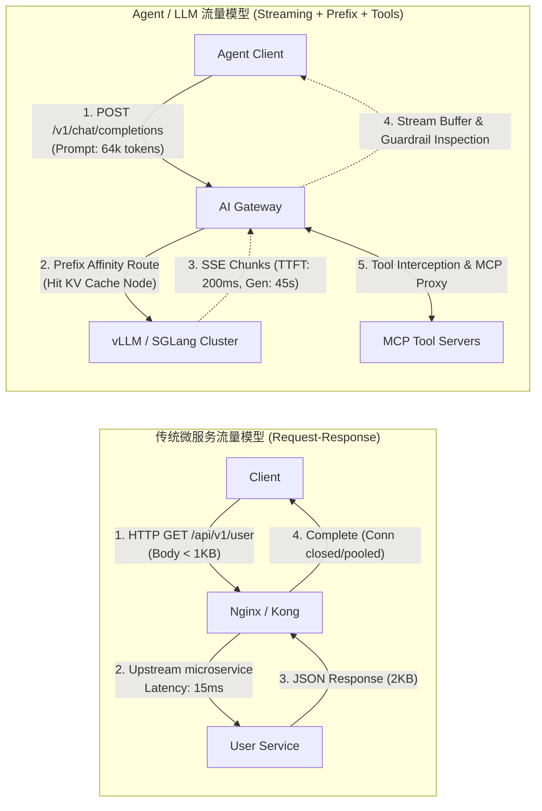
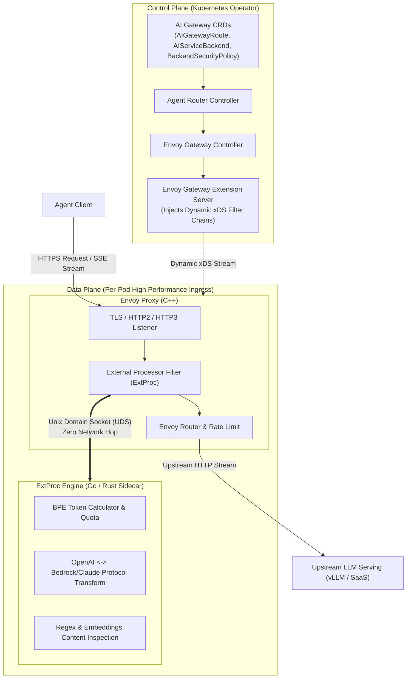
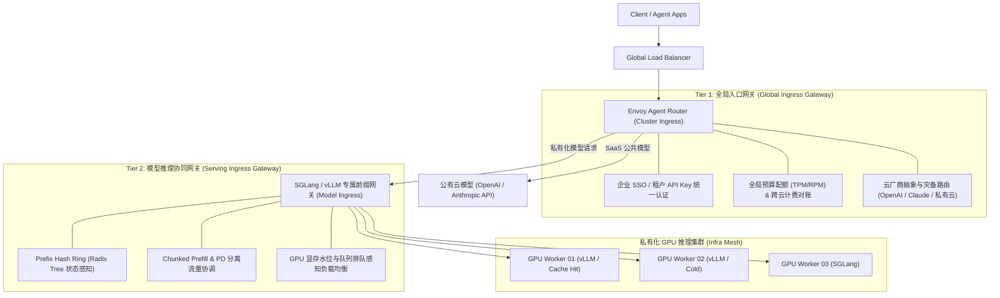
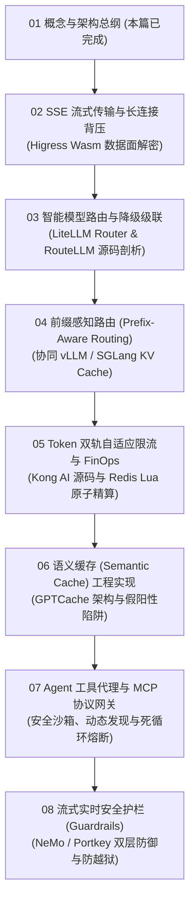

**TL;DR：** 过去十余年间，以 Nginx、Kong、APISIX 和经典 Envoy 为代表的传统 API 网关构筑了微服务时代坚不可摧的流量底座。它们的底层架构完全建立在 **“短生命周期、确定性 URL 路由、无状态 Request-Response、以 QPS 为容量衡量标尺”** 的公理之上。然而，当流量的另一端从经典 REST/gRPC 服务切换为大模型推理与自主智能体（Agent）系统时，传统网关在第一线就会全线溃败：**动辄数十秒的 SSE 流式长连接击穿并发池，未适配流控窗口导致网关内存被 Buffer 撑爆；按 QPS 限流在 100k 上下文面前形同虚设；传统的随机与轮询调度彻底打碎了 vLLM / SGLang 的 KV Cache 与 Prompt Caching，导致首字延迟（TTFT）与计费暴增 10 倍；Agent 陷入工具自愈死循环在网络层无声烧穿数千美元账单。**

AI 网关（AI Gateway）绝不是在传统网关上加一个 `OpenAI API Key` 轮询插件那么简单。它是大模型时代面向**长连接非确定性数据流、多维显存/Token 算力资源、会话级前缀亲和以及动态工具协议治理**的全新流量治理基础设施。本文作为《面向大模型与 Agent 的 AI 网关实战》系列的开篇总纲，从第一性原理出发，剖析五大本质分水岭，深度拆解开源 CNCF 顶级项目 **Envoy Agent Router**（原 Envoy AI Gateway）与 **Higress** 的核心架构，并给出生产级两层网关落地蓝图。

---

## 一、动笔前任务卡与核心矛盾

| 任务字段 | 本篇架构推导与回答 |
| :--- | :--- |
| **目标读者** | 资深后端工程师、基础架构/平台架构师、LLM Infra 与智能体系统落地团队。熟悉传统 API 网关与反向代理，但在高并发接入大模型或搭建生产 Agent 时遭遇延迟抖动、内存溢出或账单失控。 |
| **核心问题** | 传统 API 网关面对大模型与 Agent 时究竟在哪些物理与逻辑维度彻底失效？现代 AI 网关的数据面与控制面该如何设计？ |
| **知识主角** | 面向 LLM / Agent 的 AI 网关架构演进、五大本质分水岭、Envoy Agent Router（ExtProc UDS 架构）与两层网关部署模式。 |
| **熟悉入口** | Nginx `proxy_pass` 与 Kong 插件配置、OpenAI `/v1/chat/completions` 流式调用。 |
| **因果主线** | 经典 HTTP 交互假设打破 $\to$ 五大物理维度因果崩溃 $\to$ AI 网关的核心职责与合同契约 $\to$ 开源 Envoy Agent Router 架构解密 $\to$ 生产两层网关拓扑落地。 |

---

## 二、为什么传统 API 网关接不住 Agent？五大本质分水岭

为了看清 AI 网关的必要性，我们必须首先把传统网关建立在经典微服务之上的底层假设，与大模型 / Agent 工作负载做一个彻底的对比剖析：

```text
┌────────────────────────────────────────────────────────────────────────┐
│                        传统 API 网关 vs AI 网关                        │
├──────────────────┬──────────────────────┬──────────────────────────────┤
│ 维度             │ 传统微服务网关 (Kong/Nginx) │ AI / Agent 网关             │
├──────────────────┼──────────────────────┼──────────────────────────────┤
│ 1. 连接与传输    │ 毫秒级 (5~50ms), 短连接│ 数十秒至数分钟, SSE 长连接流式 │
│ 2. 内存与背压    │ 固定 Content-Length 缓冲 │ Chunked 无穷尽流，需零拷贝背压 │
│ 3. 资源计量标尺  │ 请求数 (QPS / RPS)     │ Token (Prompt + Completion)  │
│ 4. 负载均衡拓扑  │ 无状态轮询 / 最小连接数 │ 前缀亲和 (Prefix-Aware / KV) │
│ 5. 失败与异常    │ HTTP 状态码明确 (4xx/5xx)│ 200 OK 内部截断/幻觉/死循环   │
│ 6. 治理对象      │ REST / gRPC API 接口 │ 模型 + Prompt + MCP 工具代理 │
└──────────────────┴──────────────────────┴──────────────────────────────┘
```



### 2.1 维度一：连接寿命与流式传输背压（Streaming & Backpressure）

- **传统网关假设**：一个典型的 RPC 或 HTTP 请求，上游微服务在 10~50 毫秒内计算完毕，通过 `Content-Length` 一次性返回响应体。网关的线程/协程在微秒级完成转发并归还连接池。
- **Agent 的破坏性现实**：
  大模型推理采用自回归生成（Auto-regressive Generation），必须使用 Server-Sent Events (SSE) 或 HTTP/2 Chunked Transfer 逐字吐出。一个 2,000 Token 的复杂 Agent 推理任务，连接持续时间往往在 **30 秒到 120 秒**：
  1. **连接数爆炸（Connection Starvation）**：原本支持 10,000 QPS 的网关，在毫秒级场景下只需复用几百个长连接；但在大模型 60 秒长流式场景下，同时并发 10,000 个推理就意味着要维系 10,000 个高负载的长连接，下游与上游的 File Descriptor (fd) 瞬间吃光。
  2. **内存缓冲区膨胀与 OOM**：传统网关如 Nginx 默认开启 `proxy_buffering on`。在 SSE 模式下，如果网关尝试在内存中拼装完整响应再向下转发，不仅彻底杀死了流式交互的首字低延迟体验（TTFT），而且面对几百个并发的长文本响应时，网关工作进程会迅速发生内存溢出（OOM）。
  3. **慢客户端引发的背压灾难（Slow Client Backpressure）**：当客户端网络较差（如移动端丢包、TCP 拥塞窗口收缩），下游写入阻塞；而上游 GPU 推理卡正在以每秒 50 Token 的极高速度狂吐数据。网关如果缺乏跨连接的流控背压协同机制，内核 Socket Send Buffer 将迅速填满，最终反向打满网关虚拟内存。

### 2.2 维度二：资源计量维度的彻底失效（QPS vs Tokens）

在传统微服务中，API 限流的标准范式是基于 **请求数/每秒（QPS / RPS）** 的令牌桶算法：
```text
Limit: 100 requests / minute / tenant
```
但在大模型与 Agent 场景下，**“请求”是一个彻底失真的伪度量衡**：
- 请求 A：用户发送 `Hello`，输入 2 Token，输出 10 Token，耗费 GPU 计算时间 20ms，成本 $0.00001；
- 请求 B：Agent 读取了一个代码仓库的 5 个源文件进行静态分析，输入 128,000 Token，输出 4,096 Token，耗费 GPU 算力 40,000ms，显存占用数 GB，成本高达 $0.50。

如果继续使用传统网关的 QPS 限流，租户只需并发发起 5 个请求 B，就能瞬间耗尽整套集群的显存带宽与推理显存，引发 GPU OOM 崩溃；而正常发 100 个请求 A 的合规用户反而被无情 429 拦截。

**AI 网关必须从 QPS 跃迁为多维 Token 计量（TPM: Tokens Per Minute）**。然而，Token 计量面临一个更严苛的分布式工程难题：**两阶段非对称记账**：
- 当请求到达网关时，只有 `Prompt Tokens` 是已知的（可以通过分词器预估），而 `Completion Tokens` 具有不可预测性（完全由模型在几十秒内动态生成）；
- 网关不能在请求结束才记账，否则恶意并发会在 1 秒内超卖击穿配额；也不能按最大 `max_tokens` 静态锁死，否则用户的配额利用率会被严重虚耗。网关必须实现 **“输入预扣、流式监控、完结结算”** 的两阶段分布式状态机。

### 2.3 维度三：负载均衡策略与底层 KV Cache 的物理冲突

这是传统网关切入 AI 基础设施时最隐蔽、也是造成损失最大的盲区。

传统网关对于后端无状态微服务，最经典的负载均衡算法是 **加权轮询（Round Robin）** 或 **最少连接数（Least Connections）**。这种调度假设上游节点是“同质且无状态”的——请求落在哪台机器上，计算成本完全一致。

但在私有化部署的大模型推理服务（如 vLLM、SGLang、TGI）中，这个假设是彻底错误的：
```text
大模型推理的 Prefill 成本模型:
Time(Prefill) = f(Prompt_Tokens)
若上游 GPU 节点的显存中已缓存了该 Prompt 的 KV Cache:
  -> Prefill 计算完全跳过 (Chunked/Radix Hit)!
  -> 延迟降低 85% ~ 95%, GPU 算力节省 90%!
若请求被随机轮询到了另一台没有该 KV Cache 的 GPU 节点:
  -> 必须全量重新计算全部 Attention Key/Value!
  -> 首字延迟 (TTFT) 从 100ms 暴涨到 4000ms!
```

对于 Agent 场景，这种影响尤其致命。Agent 的工作流是在一个长会话中不断往历史记录追加信息：
```text
Round 1: [System Prompt (4k)] + [User Input (1k)]
Round 2: [System Prompt (4k)] + [User Input (1k)] + [Tool Call 1 (2k)]
Round 3: [System Prompt (4k)] + [User Input (1k)] + [Tool Call 1 (2k)] + [Tool Call 2 (3k)]
```
每一轮对话的前 80%~90% 内容是与上一轮完全相同的。
如果网关采用传统的随机或轮询算法，Agent 的多轮请求将在集群 8 台推理节点之间来回“跳跃”，导致每一台节点的 KV Cache 命中率跌至冰点，集群整体吞吐直接暴跌数倍。

**AI 网关必须实现前缀感知路由（Prefix-Aware Routing / Session Affinity）**：网关必须解析 Prompt 的前缀指纹，通过基数树（Radix Tree）或哈希环将具有相同上下文前缀的请求精准钉死在同一台物理推理节点上。

### 2.4 维度四：非确定性失败与动态降级级联（Fallback Cascades）

传统微服务的失败边界由标准 HTTP 语义界定：
- `500 Internal Server Error`：服务崩溃；
- `504 Gateway Timeout`：网络超时；
- `429 Too Many Requests`：触发限流。

网关只需针对状态码做简单的指数退避重试即可。但在大模型场景下，**HTTP 200 并不代表请求成功**：
1. **内容合规拦截与截断（Finish Reason）**：上游模型因为触发安全护栏或达到 `max_tokens`，返回了 `finish_reason: "length"`，输出一段未闭合的 JSON，导致下游 Agent 解析器挂死；
2. **模型过载与抖动降级**：云厂商 API（如 OpenAI、Claude）经常出现瞬时 TPM 溢出或 TP99 延迟飙升至 30 秒；
3. **上下文长度溢出（Context Window Overflow）**：Agent 在多轮追问后，上下文突破了当前模型的 8k 限制。

传统网关无法理解响应体内的业务语义。AI 网关必须内置 **智能模型路由器（Model Router）与故障级联状态机**：
- 当主路由模型（如 `claude-3-5-sonnet`）返回 429 或延迟超过 3000ms 时，网关层自动捕获错误，无缝将请求转写并重路由至后备模型（如 `gpt-4o` 或本地私有化 `deepseek-v3`）；
- 当上下文超出小模型窗口时，网关自动升配到超长上下文模型；整个重试与降级过程对前端客户端保持透明流式交付。

### 2.5 维度五：Agent 专属的状态化与工具协议治理（MCP & Dead-Loops）

当调用的发起者从“人”变成“自主 Agent”时，网关的治理职责再次发生了质的跃迁：
1. **工具执行与 MCP 协议代理（Model Context Protocol）**：
   Agent 在推理过程中会发出结构化工具调用（Tool Calls）。在现代架构中，工具不仅在客户端本地执行，更广泛分布在远端企业微服务或标准的 MCP Server 中。AI 网关必须充当 **MCP Host / Proxy**，负责工具 Schema 的统一注册、参数动态校验、鉴权与转发。
2. **SSRF 与沙箱网络隔离**：
   Agent 生成的工具参数（如请求某个 URL、写入某个数据库）具有概率不可控性。AI 网关必须是防范服务端请求伪造（SSRF）与私网逃逸的第一道防线，阻止 Agent 探索内网元数据接口（如 `169.254.169.254`）。
3. **死循环与预算失控熔断（Runaway Spend Breakers）**：
   Agent 经常因为工具报错或指令歧义陷入 ReAct 死循环（`Tool A 失败 -> 尝试重试 -> Tool A 再次失败`）。如果不加干预，Agent 会在几分钟内循环数十次，烧光巨额 Token。AI 网关必须在网络层对会话的调用拓扑进行指纹提取，一旦识别出震荡死循环（A $\to$ B $\to$ A $\to$ B），网关直接主动熔断并返回特定提示。

---

## 三、AI 网关的系统合同定义（Contract Specification）

在深入架构实现前，我们必须按照严格的工程规范，清晰界定现代 AI 网关的**三层系统合同**：

### 1. 系统保证什么（Guarantees）
- **协议标准化**：对外提供统一的 OpenAI 兼容标准输入输出，无论后端挂载的是 Anthropic、Google Vertex AI、私有 vLLM 还是自研推理引擎，网关屏蔽下层异构细节；
- **流式背压安全**：保证在千级高并发长连接下，网关自身内存开销与活跃并发连接数呈线性稳定关系，流式数据分片经过零拷贝管线，不产生无界 Buffer 积压；
- **配额绝对不超卖**：基于分布式两阶段预扣算法，保证租户的 TPM / RPM 限额在跨网关节点集群环境下误差控制在极小时间窗口（<100ms）之内；
- **故障透明自愈**：当下游某可用区模型推理节点离线或触发 5xx/429 时，网关在流式输出第一帧到达前具备毫秒级无感热倒换能力。

### 2. 系统不保证什么（Non-Guarantees）
- **不保证大模型输出的语义确定性**：网关只负责数据流的传输、转换与过滤，不保证两次相同请求得到相同的 Token 序列（除非启用了严格的精确语义缓存且模型 temperature=0）；
- **不保证离线/超时工具的无限保活**：对于 Agent 发起的长耗时工具调用，网关设定硬性超时阈值，不承诺无期限阻塞等待下游慢服务；
- **不承担全量 Agent 运行时状态机存储**：网关只负责网络层会话亲和与流式检查，具体的 Agent 长期记忆（Memory Store）仍归属于专业的数据服务。

### 3. 调用者必须遵守什么（Caller Responsibilities）
- **客户端必须具备流式优雅重连与断连感知能力**：当用户主动关闭前端页面时，客户端必须通过 HTTP/2 `RST_STREAM` 或关闭 TCP 连接通知网关，以便网关能即时向后端推理引擎发送取消信号，斩断无谓的 GPU 算力消耗；
- **正确消费流式元数据 Header**：客户端必须监听网关返回的 `x-ratelimit-remaining-tokens`、`x-cache-status` 与 `Retry-After` 等响应头，配合自适应退避；
- **多轮会话显式携带 Session 标识**：若希望享受网关提供的 Prompt Caching 亲和加速，调用方应在 Header 或请求体显式传递稳定会话标识或前缀特征。

---

## 四、开源顶级架构解密：Envoy Agent Router 与 Higress

目前在开源工业界，AI 网关形成了两大主流技术流派：
1. **基础设施优先派（Infrastructure-First）**：以 CNCF 基金会的 **Agent Router**（原 Envoy AI Gateway）和阿里巴巴开源的 **Higress** 为代表。基于 C++ 编写的 Envoy Proxy 高性能数据面，通过外置处理器或 Wasm 扩展注入 AI 治理逻辑。
2. **业务代理优先派（LLM-First Proxy）**：以 **LiteLLM**、**Portkey**、**Bifrost** 为代表。采用 Python、TypeScript 或 Go 开发独立代理进程，胜在配置极度灵活、开箱即用支持 100+ 模型厂商。

对于追求极限性能、企业级多租户隔离与 Kubernetes 云原生集成的生产场景，**Envoy 体系是业界绝对的基石**。我们重点解密 Agent Router 与 Higress 的核心架构。

### 4.1 Envoy Agent Router 架构哲学：“Agent Router controls, Envoy carries”

Agent Router 的设计哲学非常纯粹：**将高并发、高吞吐的流量搬运交给 Envoy Proxy，将所有大模型专属的复杂业务逻辑卸载到专门的控制器与外置处理器。**



#### 核心解耦机制：ExtProc + Unix Domain Socket
在 Envoy 传统的扩展模式中，通常有三种做法：
- **C++ 内核修改**：性能最高，但维护成本极高，任何崩溃都会导致整个网关进程 Crash；
- **Wasm 插件**：隔离性好，但在复杂的模型协议解析（如把 OpenAI 复杂的 JSON 结构转写成 AWS Bedrock 格式）时，Wasm 的内存复制与垃圾回收可能带来额外开销；
- **External Processing (ExtProc)**：Envoy 官方提供的 gRPC 流量劫持协议。流量到达 Envoy 时，请求头、请求体分片或流式响应数据通过 gRPC 流转给外部处理进程，由处理进程决定放行、修改还是直接阻断。

**Agent Router 的架构神来之笔在于：将 ExtProc 作为同 Pod 的 Sidecar 部署，并通过 Unix Domain Socket (UDS) 通信！**
- 避免了跨节点网络调用的网络跳步与网卡序列化开销；
- 实现了彻底的进程级故障隔离：即便 ExtProc 发生 Panic，Envoy 主进程依然能够执行熔断放行或降级策略，网关网络底盘绝不崩溃；
- ExtProc 可以使用垃圾回收更友好、拥有丰富 LLM 生态 SDK 的 Go 或 Rust 编写，轻松集成分词器与安全规则。

### 4.2 Higress：基于 Envoy Wasm Filter 的高性能单进程流水线

阿里巴巴开源的 **Higress** 则走了一条深度集成 Envoy Wasm 的技术路径：
- Higress 在网关数据面中实现了 `ai-proxy` Wasm 插件，完全基于 C++/Go (`proxy-wasm-go-sdk`) 编译为 WebAssembly 字节码加载至 Envoy 内存；
- **优势**：单进程内直接操作线性内存（Linear Memory），对于高吞吐的小报文流式注入（如在 SSE 流中动态插入水印或敏感词屏蔽），延迟开销被压缩到极致（微秒级）；
- **动态热插拔**：通过 Istio 控制面下发 Wasm OCI 镜像，无需重启网关即可实时更新模型路由策略与工具拦截规则。

---

## 五、AI 网关内部核心机制：请求生命周期的全景穿透

为了彻底搞懂 AI 网关如何处理一个 Agent 请求，我们沿着一条请求的完整生命周期，放大网关内部的状态流动：

```text
[Agent 发起流式推理请求]
       │
       ▼
┌────────────────────────────────────────────────────────┐
│ 步骤 1: 客户端连接握手与协议归一化                      │
│ - 建立 HTTP/2 或 HTTP/3 双向流                         │
│ - 鉴权校验 API Key，提取 Tenant ID 与 Model 请求参数    │
└────────────────────────────────────────────────────────┘
       │
       ▼
┌────────────────────────────────────────────────────────┐
│ 步骤 2: Token 预估与两阶段记账 (Token Pre-accounting)    │
│ - 网关内置轻量 BPE 快速分词 (tiktoken 缓存)            │
│ - 预估 Prompt Tokens = 1,250                           │
│ - Redis 原子扣减 TPM 令牌桶: 预扣 (1250 + max_tokens/4) │
│ - 若超卖: 直接返回 429 与 Retry-After                  │
└────────────────────────────────────────────────────────┘
       │
       ▼
┌────────────────────────────────────────────────────────┐
│ 步骤 3: 语义前缀分析与亲和调度 (Prefix-Aware Routing)  │
│ - 提取 System Prompt + 历史对话哈希前缀               │
│ - 查询一致性哈希环 / Radix 缓存状态表                  │
│ - 选取具有热 KV Cache 的最佳推理实例 (如 GPU-Worker-03) │
└────────────────────────────────────────────────────────┘
       │
       ▼
┌────────────────────────────────────────────────────────┐
│ 步骤 4: 建立上游长连接与流式背压转发                    │
│ - 向 GPU-Worker-03 建立 HTTP/2 Stream                  │
│ - 开启零拷贝分块通道 (Zero-Copy Chunk Pipeline)        │
│ - 监听下游 Socket 可写事件 (Epoll OUT) 动态驱动流控    │
└────────────────────────────────────────────────────────┘
       │
       ▼
┌────────────────────────────────────────────────────────┐
│ 步骤 5: 流式帧实时过滤与工具调用劫持 (Streaming Tap)    │
│ - 逐帧捕获 data: {"choices":[{"delta":...}]}           │
│ - 实时正则流式窗口扫描 (防注入与敏感词审查)             │
│ - 检测 tool_calls 声明: 提取目标工具名称与 JSON 片段    │
│ - 若触发 MCP 工具: 网关旁路发起鉴权与参数校验          │
└────────────────────────────────────────────────────────┘
       │
       ▼
┌────────────────────────────────────────────────────────┐
│ 步骤 6: 终结统计与配额结算 (Reconciliation)            │
│ - 接收 [DONE] 帧，解析 usage 元数据                    │
│   (Prompt: 1,250, Completion: 380)                     │
│ - Redis 异步补齐对账: 释放先前过度预扣的配额 (多退少补) │
│ - 记录会话拓扑，排查是否出现 A->B->A 循环调用特征      │
└────────────────────────────────────────────────────────┘
```

---

## 六、生产落地的两层网关部署架构（Two-Tier Gateway Pattern）

在实际的企业级生产落地中，单个网关往往无法同时兼顾“全局安全管控”与“精细化推理加速”。业内成熟方案普遍采用 **两层网关拓扑（Two-Tier Gateway Pattern）**：



### 1. 第一层（Tier 1）：全局企业级控制层（Global Ingress）
- **部署位置**：位于企业 VPC 入口，面向所有应用与外部客户端；
- **核心职责**：
  - **统一身份与权限**：对接企业 IAM、OAuth2、动态 API Key 生命周期；
  - **FinOps 成本核算与账单治理**：多租户配额分配、部门成本分摊、跨云服务商价格最优路由；
  - **安全护栏第一道防线**：全局敏感词脱敏、基础黑白名单、防暴力破解与 DDoS；
  - **多云抽象**：对外暴露一套 API，底层透明跨多云（Azure OpenAI、AWS Bedrock、Google Cloud Vertex）。

### 2. 第二层（Tier 2）：推理服务协同层（Serving Ingress）
- **部署位置**：紧邻私有 GPU 推理集群（K8s GPU 节点同机房或同专线内）；
- **核心职责**：
  - **极致首字延迟优化**：前缀对齐路由（Prefix-Aware Routing），维系全局 Radix 树，最大化提升底层显存 KV Cache 命中率；
  - **算力自适应排队**：实时感知各 GPU 实例的 `num_running_reqs` 与 `gpu_cache_usage_sys` 指标，做基于显存水位的动态排队调度；
  - **推理流水线协同**：配合最新 Chunked Prefill 细粒度时间片切分，防止大 Prompt 阻塞其他并发小请求。

---

## 七、生产防坑与反例：资深架构师的避坑指南

### 反例 1：反向代理时忘记关闭缓冲，导致首字延迟（TTFT）暴涨 100 倍
- **现场故障**：某团队使用传统 Nginx 作为大模型代理，业务反馈前端“卡死 30 秒后一次性吐出所有内容”，首字延迟高达 30 秒。
- **根因分析**：Nginx 默认配置了 `proxy_buffering on;` 和 `proxy_buffers 8 4k;`。Nginx 会等待后端发满一个 4KB 缓冲区才向客户端 flush 一次。大模型每秒产生的 Token 只有几十字节，导致数据在 Nginx 内存中严重滞留。
- **正解契约**：在所有代理大模型的网关配置中，必须显式配置禁用缓冲并开启长连接流式响应：
  ```nginx
  proxy_buffering off;
  proxy_cache off;
  proxy_set_header Connection '';
  proxy_http_version 1.1;
  chunked_transfer_encoding on;
  ```

### 反例 2：客户端取消请求未向后端透传，造成隐形算力“幽灵消耗”
- **现场故障**：前端用户在发起一个生成长文档的请求后，点击了“停止生成（Stop）”或关闭了网页。但后台 GPU 监控显示显存利用率居高不下，账单依然扣除了 2,000 Token 的费用。
- **根因分析**：客户端通过前端 `AbortController` 断开了与网关的连接，网关虽然检测到了客户端断开，但**并没有主动向后端 vLLM 实例发送 HTTP/2 `RST_STREAM` 帧**。后端推理引擎并不知道下游已断连，依然老老实实地在 GPU 上把后续 2,000 个 Token 迭代计算完毕。
- **正解契约**：AI 网关必须配置双向取消传播。在 Envoy 中确保配置了 `connection_manager` 的流重置级联机制，一旦下游连接断开，立即向 Upstream 发送取消信号释放计算资源。

### 反例 3：全量同步审查导致网关自身沦为性能瓶颈
- **现场故障**：为了合规，团队在网关中配置了安全拦截插件，对每个请求的 Prompt 调用大号语义分类器进行审查。结果网关吞吐量从 5,000 QPS 跌落到 30 QPS，网关 CPU 跑满 100%。
- **根因分析**：将深度学习重型计算同步嵌入到网关的转发主路径上。
- **正解契约**：安全护栏必须采用 **“分层流水线（Tiered Pipeline）”**：
  - 前置主路径（<1ms）：使用 Aho-Corasick 高性能多模自动机执行确定性敏感词与正则特征匹配；
  - 深度审查异步化（<20ms）：采用轻量级小模型（如 100M 参数的 FastText / DistilBERT）或采用流式前置预审，绝不在网关关键链路上挂载耗时数百毫秒的大模型审查。

---

## 八、总结与后续路线图

面向大模型与 Agent 的 AI 网关，正在经历一次从“简单反向代理”到“智能流量枢纽”的历史性蜕变。它不再仅仅处理 IP、端口和 HTTP 头，而是深度理解 **Token 经济学、显存 KV 状态、推理背压与 Agent 工具协作契约**。

本篇作为全系列的开篇总纲，从第一性原理确立了核心架构范式。接下来，我们将按逻辑主线深入开源核心，逐篇彻底拆解关键机制的源码与工程实现：



在下一篇中，我们将聚焦 **网络传输与高并发背压**：深入解密当数十秒的 SSE Chunked Transfer 席卷网关时，Alibaba Higress 如何在 Envoy Wasm 沙箱中实现零拷贝解析、动态 Token 注入与连接耗尽防御。

---

## 参考资料与规范出处

1. **Agentic AI Foundation (AAIF)**: *Agent Router (formerly Envoy AI Gateway) Architectural Specification & Data Plane Design*, CNCF / AAIF, 2025.
2. **IETF RFC 9113**: *HTTP/2 - Section 5.2 Flow Control & Section 8.1 HTTP Message Exchanges*, Internet Engineering Task Force.
3. **IETF RFC 9112**: *HTTP/1.1 - Section 7 Chunked Transfer Coding*, Internet Engineering Task Force.
4. **W3C Recommendation**: *Server-Sent Events (SSE) Interface Specification*, W3C, 2015.
5. **Alibaba Cloud & CNCF**: *Higress AI Gateway Architecture & WebAssembly Plugin Ecosystem*, 2024.
6. **Anthropic**: *Model Context Protocol (MCP) Architecture Specification*, 2024.
7. **Zheng, L., et al. (2024)**: *SGLang: Efficient Execution of Structured Language Model Programs*, arXiv:2312.07104. (RadixAttention 与前缀哈希协同).
8. **Kwon, W., et al. (2023)**: *Efficient Memory Management for Large Language Model Serving with PagedAttention*, ACM SOSP 2023.

