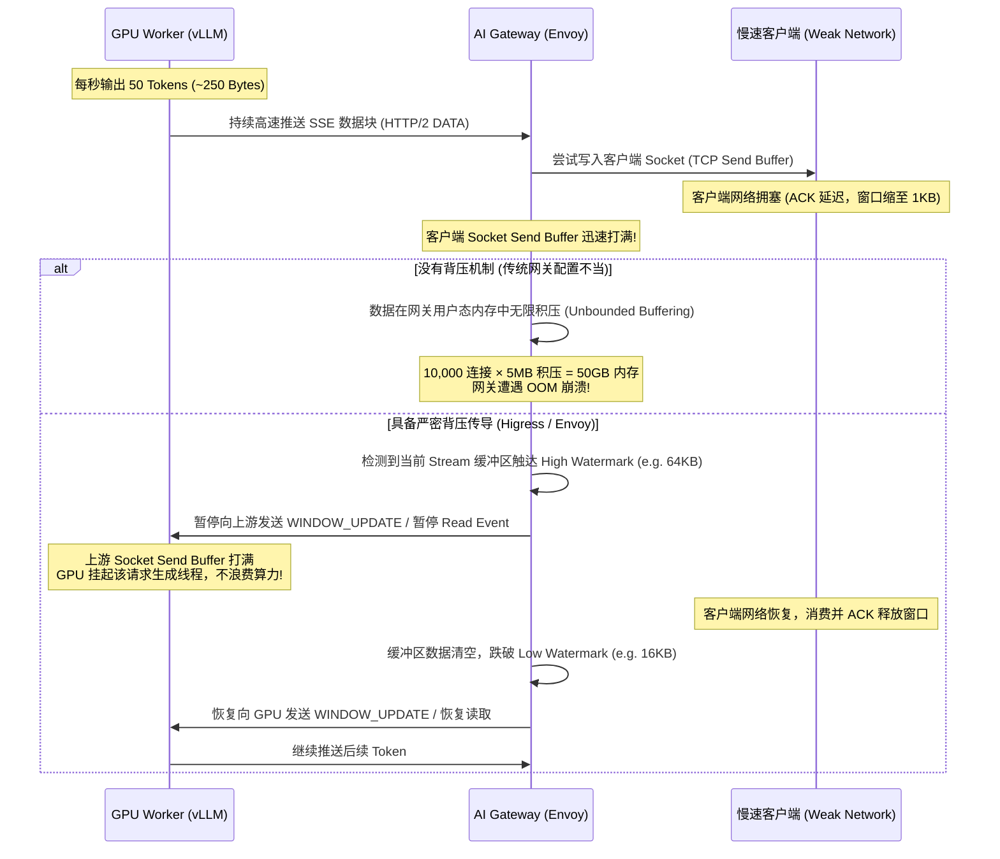
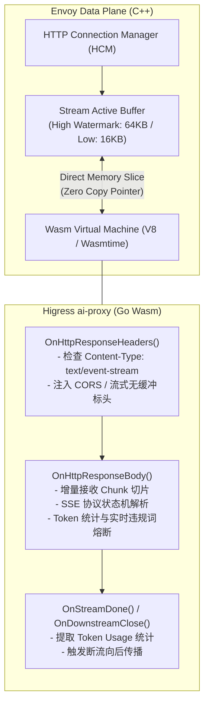
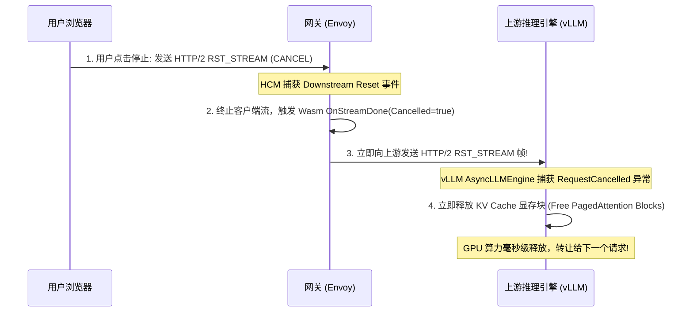

**TL;DR：** 经典微服务网关面对的是耗时 10~50ms 的短请求，数据通过固定 `Content-Length` 一次性刷新；而大模型推理生成是典型的自回归流式输出，必须依赖 Server-Sent Events (SSE) 或 HTTP/2 Chunked Transfer 持续吐出数十秒甚至数分钟。当数千个长达 60 秒的流式长连接涌入网关，且下游客户端由于移动端丢包或 JS 主线程卡顿变为“慢客户端”时，如果网关仍然采用传统的内存全量缓冲或缺乏跨连接的背压（Backpressure）传导，网关的虚拟内存将在几秒内被内核 Socket 发送缓冲区与应用层积压撑爆，引发灾难性 OOM。

阿里巴巴开源的云原生网关 **Higress** 创造性地通过 Envoy WebAssembly (Wasm) 架构，在 C++ 高性能数据面与沙箱化业务插件之间构建了坚固的流式防线。本文深度拆解 Higress `ai-proxy` 插件源码与 Envoy 内部的流控状态机，阐明零拷贝流式解析、动态 `WINDOW_UPDATE` 流量控制、高低水位线内存防爆以及客户端主动取消（`RST_STREAM`）时向后斩断 GPU 幽灵计算的完整工程闭环。

---

## 一、动笔前任务卡与核心矛盾

| 任务字段 | 本篇架构推导与回答 |
| :--- | :--- |
| **目标读者** | 负责高并发 API 网关、大模型推理平台接入层与网络基础架构的资深后端工程师。熟悉 HTTP/2 与反向代理，但在高并发流式场景下遭遇网关内存飙升、协程/线程暴涨或连接挂死的工程师。 |
| **核心问题** | 当每个请求从 20ms 变成 60s 长连接且数据按 Chunk 持续流动时，网关如何做到内存占用恒定、背压精确向上传导，且安全处理各种异常断连？ |
| **知识主角** | SSE / HTTP/2 Chunked 流式背压传导、Envoy 流式缓冲区水位线（Watermark）、Higress `ai-proxy` Wasm 插件源码机制。 |
| **熟悉入口** | 前端 `EventSource` / `fetch` ReadableStream、Nginx `proxy_buffering` 陷阱。 |
| **因果主线** | 慢客户端导致 Socket 发送队列阻塞 $\to$ 网关内存积压突破阈值 $\to$ Envoy 触发 High Watermark 停止读取上游 $\to$ HTTP/2 暂停发送 `WINDOW_UPDATE` 迫使 GPU 推理暂停 $\to$ 内存泄洪触发 Low Watermark 恢复。 |

---

## 二、大模型流式传输的网络协议底座：从 RFC 9112 到 RFC 9113

在分析网关实现之前，我们必须先理清大模型流式输出在 TCP/IP 协议栈上的真实封装形态。目前大模型 API（如 OpenAI `/v1/chat/completions`）事实上的标准协议是基于 HTTP 的 **Server-Sent Events (SSE)**。

```text
客户端发起请求:
POST /v1/chat/completions HTTP/1.1
Host: api.gateway.local
Accept: text/event-stream
Content-Type: application/json

{"model": "deepseek-v3", "messages": [...], "stream": true}
```

```text
网关与模型服务响应:
HTTP/1.1 200 OK
Content-Type: text/event-stream; charset=utf-8
Transfer-Encoding: chunked
Cache-Control: no-cache
Connection: keep-alive

3a\r\n
data: {"choices":[{"delta":{"content":"在"}}]}\n\n\r\n
3c\r\n
data: {"choices":[{"delta":{"content":"复杂"}}]}\n\n\r\n
...
d\r\n
data: [DONE]\n\n\r\n
0\r\n\r\n
```

### 2.1 HTTP/1.1 Chunked vs HTTP/2 Data Frame 差异
在大规模生产环境中，客户端到网关、网关到自建推理引擎（如 vLLM）通常运行在不同的 HTTP 协议版本之上：

1. **HTTP/1.1 Chunked Transfer Coding (RFC 9112 §7.1)**：
   - 因为生成开始前无法预知最终文本长度，无法发送 `Content-Length`，只能通过分块传输编码（Chunked）；
   - 每一个 Chunk 由 16 进制长度指示符 + `\r\n` + 数据负载 + `\r\n` 构成，最终以 `0\r\n\r\n` 作为流结束标记；
   - **痛点**：HTTP/1.1 没有多路复用能力，一条长达 60 秒的 SSE 推理必须死死独占一条物理 TCP 连接。网关若维护 10,000 个流，就需要 10,000 个活跃的 TCP Socket。
2. **HTTP/2 Stream Multiplexing & Flow Control (RFC 9113 §5.2)**：
   - 多个流在同一条 TCP 连接上通过 31-bit Stream ID 进行帧多路复用（`DATA` 帧承载 SSE 内容）；
   - **核心优势**：HTTP/2 具备原生帧级别的流控机制（`WINDOW_UPDATE` 帧），不仅对整条 TCP 连接有限流，而且可以对单个 Stream 独立限流；这是解决大模型背压控制的物理底座。

---

## 三、背压失效的致命链条：慢客户端如何拖垮网关

什么是背压（Backpressure）？简单来说，**就是当下游消费者的处理速度跟不上上游生产者的生产速度时，系统向下游施加阻力、并将阻力逐级反向传导给上游的一种流控机制。**

在传统短连接中，上游产生 5KB 数据，网关在 1ms 内直接通过 TCP 写入下游，背压问题几乎隐形。但在大模型场景中，产销速率呈现极度不对称：



### 3.1 慢客户端的常见成因
1. **无线网络波动与弱网**：移动端遭遇 4G/5G 弱信号或高丢包，TCP 拥塞窗口（`cwnd`）急剧收缩，TCP 重传导致套接字发送缓冲区完全阻塞；
2. **浏览器/客户端渲染阻塞**：前端 JavaScript 单线程在处理 Markdown 渲染、LaTeX 数学公式或复杂 DOM 树时卡死，导致前端消费 `ReadableStream` 停止，Socket 读缓冲区占满，反向告知网关 Receive Window 为 0；
3. **恶意慢速攻击（Slowloris SSE）**：恶意攻击者发起 10,000 个流式请求，但刻意以每 10 秒 1 字节的速度读取数据，企图耗尽网关的物理内存与连接句柄。

---

## 四、Higress Wasm 数据面架构解密：零拷贝与流式沙箱

面对流式长连接，为什么传统的 Lua 插件（如 Kong）或外置 HTTP 代理容易出问题？因为频繁在脚本层（如 Lua VM）与底层 C++ 内存之间进行字符串深拷贝，不仅垃圾回收（GC）开销巨大，而且难以对底层 C++ 的流控事件做出毫秒级响应。

Alibaba Higress 采用 **Envoy Wasm Filter + `proxy-wasm-go-sdk`**，直接在 Envoy 数据面事件循环中挂载 `ai-proxy` 扩展。



### 4.1 Higress ai-proxy 流式处理核心源码剖析

我们深入 Higress `plugins/wasm-go/extensions/ai-proxy` 的流式处理逻辑，看看它是如何在增量状态下解析 SSE 并保证不爆内存的：

```go
// 代码示意：Higress ai-proxy 流式响应核心处理逻辑 (proxy-wasm-go-sdk)
package main

import (
	"bytes"
	"github.com/higress-group/proxy-wasm-go-sdk/proxywasm"
	"github.com/higress-group/proxy-wasm-go-sdk/proxywasm/types"
)

type aiProxyContext struct {
	types.DefaultHttpContext
	isStreaming       bool
	streamBuffer      bytes.Buffer
	promptTokens      int
	completionTokens  int
	isClientCancelled bool
}

func (ctx *aiProxyContext) OnHttpResponseHeaders(numHeaders int, endOfStream bool) types.Action {
	contentType, err := proxywasm.GetHttpResponseHeader("content-type")
	if err == nil && bytes.Contains([]byte(contentType), []byte("text/event-stream")) {
		ctx.isStreaming = true
		// 关键契约：强制下游代理（如 CDN 或客户端）禁止缓冲，保持纯流式穿透
		_ = proxywasm.ReplaceHttpResponseHeader("X-Accel-Buffering", "no")
		_ = proxywasm.ReplaceHttpResponseHeader("Cache-Control", "no-cache, no-transform")
	}
	return types.ActionContinue
}

func (ctx *aiProxyContext) OnHttpResponseBody(bodySize int, endOfStream bool) types.Action {
	if !ctx.isStreaming {
		return types.ActionContinue
	}

	// 零拷贝获取当前收到的分片数据切片 (Chunk Slice)
	chunk, err := proxywasm.GetHttpResponseBody(0, bodySize)
	if err != nil || len(chunk) == 0 {
		return types.ActionContinue
	}

	// 将当前切片追加至增量解析缓冲区，处理可能被 TCP 分包切断的 SSE 帧
	ctx.streamBuffer.Write(chunk)

	for {
		// 寻找 SSE 标准行分隔符 "\n\n"
		data := ctx.streamBuffer.Bytes()
		idx := bytes.Index(data, []byte("\n\n"))
		if idx == -1 {
			// 当前数据不足一个完整 SSE 消息，保留在缓冲区等待下一个网络包
			break
		}

		// 提取一个完整的 SSE 事件包
		frame := data[:idx]
		// 从缓冲区中移出已消费的数据，防止无界内存增长
		ctx.streamBuffer.Next(idx + 2)

		// 极速解析 SSE 内容 (避免全量 JSON 反序列化开销)
		if bytes.HasPrefix(frame, []byte("data: ")) {
			payload := bytes.TrimPrefix(frame, []byte("data: "))
			if bytes.Equal(payload, []byte("[DONE]")) {
				// 流式完结帧
				break
			}
			// 增量累计 Token，并触发流式轻量安全校验
			ctx.completionTokens++
			if ctx.containsIllegalKeyword(payload) {
				// 实时拦截并注入伪造的截断帧，优雅终止流
				injectSSEAbort(ctx)
				return types.ActionPause
			}
		}
	}

	// 放行当前数据块向下游发送
	return types.ActionContinue
}
```

### 4.2 为什么必须处理“TCP 半包问题”（Half-Packet Splitting）
大模型在输出中文等多字节字符（UTF-8 占 3 字节）时，由于 TCP 传输的流式特性，一个完整的 `data: {"choices":[{"delta":{"content":"中"}}]}\n\n` 可能恰好被 TCP 协议栈的 MTU（最大传输单元，如 1500 字节）切断在中间。
如果网关拿到每个 `OnHttpResponseBody` 分片就无脑做 JSON 解析：
- 第一次调用拿到前半截：`data: {"choices":[{"delta":{"content":"\xe4\xb8`，反序列化报错崩掉；
- 第二次调用拿到后半截：`\xad"}}]}\n\n`，再次报错。

**Higress 的工程设计**：
使用轻量 `bytes.Buffer` 维护一个微小的未闭合窗口，**以 `\n\n` 作为流切分的明确边界**。只有当探测到完整的两个换行符时才切割出帧处理；未闭合的残余字节留在缓冲区，等待下一个网络包拼接。这种处理方式保证了内存始终严格受限于当前最大单个 Token 帧的大小（通常几百字节），绝不占用无界内存。

---

## 五、Envoy 高低水位线（Watermark）与内核背压联动

在 Envoy 底层，C++ 数据面是如何配合 Wasm 插件与操作系统网络栈，将背压层层传递的？核心机制就在于 **Envoy 流式缓冲区的高低水位线（High/Low Watermark Buffer）**。

```text
┌────────────────────────────────────────────────────────────────────────┐
│                        Envoy Stream Buffer 水位线模型                  │
├────────────────────────────────────────────────────────────────────────┤
│                                                                        │
│   ▲ 内存积压字节数 (Bytes)                                               │
│   │                                                                    │
│   │ [ 上限阈值: 触发 503 / 强制断开连接 ]                                │
│   │                                                                    │
│   ├──────────────────────────────────────── High Watermark (e.g. 64KB) │
│   │  ▲ 达到高水位线!                                                   │
│   │  │ 1. Envoy 暂停上游读取 (Pause Reading from Upstream)             │
│   │  │ 2. HTTP/2 停止向下游模型发送 WINDOW_UPDATE 帧                   │
│   │  │ 3. 上游 GPU 推理节点的 Socket Send Buffer 打满                   │
│   │  │ 4. 推理引擎检测到不可写，挂起工作协程，暂停产出 Token            │
│   │                                                                    │
│   ├──────────────────────────────────────── Low Watermark  (e.g. 16KB) │
│   │  ▼ 慢客户端网络恢复，数据从 Socket 成功发走，跌破低水位线!         │
│   │  │ 1. Envoy 恢复上游读取 (Resume Reading)                          │
│   │  │ 2. 向模型服务发送 WINDOW_UPDATE 恢复信用额度                    │
│   │  │ 3. 上游推理引擎恢复流式生成                                    │
│   │                                                                    │
│   └──────────────────────────────────────── 0 KB (基线状态)            │
│                                                                        │
└────────────────────────────────────────────────────────────────────────┘
```

### 5.1 生产配置：严禁使用默认无限缓冲
在标准的 Envoy 配置中，默认的流缓冲区可能是 1MB 甚至无限制。面对 10,000 个流式长连接，这意味着单网关节点理论上可能被积压 **10GB** 的数据。

生产级网关必须在 `http_connection_manager` 中显式固化连接缓冲区与流缓冲区上限：

```yaml
# Envoy 生产级大模型流式背压配置范式
static_resources:
  listeners:
  - name: ai_gateway_ingress
    address:
      socket_address: { address: 0.0.0.0, port_value: 443 }
    per_connection_buffer_limit_bytes: 131072 # 单连接硬上限 128KB
    filter_chains:
    - filters:
      - name: envoy.filters.network.http_connection_manager
        typed_config:
          "@type": type.googleapis.com/envoy.extensions.filters.network.http_connection_manager.v3.HttpConnectionManager
          stat_prefix: ai_ingress
          # 针对单个流的初始流控窗口 (HTTP/2 Stream Window: 64KB)
          http2_protocol_options:
            initial_stream_window_size: 65536
            initial_connection_window_size: 1048576
            max_concurrent_streams: 2000
          route_config:
            name: ai_routes
            virtual_hosts:
            - name: model_serving
              domains: ["*"]
              routes:
              - match: { prefix: "/v1/chat/completions" }
                route:
                  cluster: vllm_backend_cluster
                  timeout: 300s # 允许流式生成最长 5 分钟
                  idle_timeout: 15s # 若 15s 内无新 Token 产生，判定卡死切断
```

---

## 六、取消传播（Cancellation Propagation）：向后斩断 GPU 幽灵计算

在大模型调用中，最昂贵的不是成功的请求，而是**被用户取消、却在后台继续狂跑的“幽灵请求（Ghost Requests）”**。

在生产实践中，用户有极高概率在模型吐出前 3 行文字后，发现回答方向不符，立即点击前端界面的“停止（Stop）”按钮，或直接关掉浏览器标签页。
前端代码通常这样写：
```javascript
const controller = new AbortController();
fetch("/v1/chat/completions", { signal: controller.signal, ... });

// 用户点击停止
controller.abort();
```

### 6.1 幽灵计算事故复盘
浏览器会立即向网关发送一个 TCP `FIN` 包，或在 HTTP/2 连接上发送 `RST_STREAM (error_code=CANCEL)` 帧。
如果网关的数据面转发逻辑存在缺陷：
1. 网关收到客户端的 `RST_STREAM`，释放了自己与客户端的会话；
2. **但是网关并没有关闭与后端 vLLM 节点的 HTTP/2 Stream**；
3. 后端的 vLLM / SGLang 实例毫不知情，在 8 张 A100/H100 显卡上，继续调度 30 个 Iteration，老老实实地把后续 1,500 个 Token 计算完毕；
4. 显存被占满，排在后面的正常并发请求发生排队抖动；月底算账，数百万元算力被白白浪费在虚无的输出上。

### 6.2 Higress 与 Envoy 的取消传播闭环机制
在 Higress 与 Envoy 架构中，双向断连级联被作为最严格的生命周期不变量：



在 vLLM 的异步引擎中，对应的 Python 协程通过监听底层的连接断开事件：
```python
# vLLM 内部的流式取消感知机制 (AsyncLLMEngine)
async def generate(self, prompt, ...):
    try:
        async for output in self.engine.generate(prompt, request_id):
            yield output
    except asyncio.CancelledError:
        # 当网关发来 RST_STREAM，底层 HTTP 连接关闭，触发 CancelledError
        logger.info(f"Client disconnected for request {request_id}. Aborting...")
        # 立即将该请求从推理调度队列中抹除，释放 PagedAttention 显存页
        await self.engine.abort(request_id)
        raise
```
**网关的这一声“向后传递的断绝信号”，是大模型时代节约 20%~40% 冗余推理算力的关键胜负手！**

---

## 七、生产防坑总结：高并发流式网关的 4 条军规

1. **绝对禁用全量缓冲（No Proxy Buffering）**：
   在任何代理大模型 SSE 的网关节点（无论是 Nginx、Envoy 还是 Traefik），必须无条件关闭响应缓冲。`X-Accel-Buffering: no` 标头必须作为响应头的金科玉律；
2. **流式传输必须配置空闲超时（Idle Timeout）而非全局短超时**：
   不可配置传统的 `request_timeout = 30s`，因为生成 4,000 Token 可能需要 60 秒；必须配置 `idle_timeout = 10s~15s`（即：只要两个 Token Chunk 之间的时间间隔不超过 15 秒，连接就一直保持活跃）；
3. **HTTP/2 协议参数必须针对大并发微报文做调优**：
   大模型每秒吐出的 chunk 极小（几字节到几十字节），将 `initial_stream_window_size` 设置为 64KB，既能提供充裕的传输缓冲，又能防止异常慢客户端过度积压；
4. **全链路断连级联监控**：
   网关的 Prometheus 监控大盘中，必须加入 `downstream_rq_rx_reset`（客户端取消）与 `upstream_rq_tx_reset`（向后取消）的指标比对。两者的比例应当接近 1:1；如果上游取消数远小于下游断开数，说明网关存在算力泄漏 Bug。

---

## 参考资料与规范出处

1. **IETF RFC 9113**: *HTTP/2 Protocol Specification - Section 5.2 (Flow Control) & Section 8.1 (Message Exchange)*, 2022.
2. **IETF RFC 9112**: *HTTP/1.1 Specification - Section 7.1 (Chunked Transfer Coding)*, 2022.
3. **W3C Candidate Recommendation**: *Server-Sent Events (SSE)*, W3C, 2015.
4. **Alibaba Cloud & CNCF**: *Higress AI Proxy Extension Architecture & Wasm Go SDK Source Code*, 2024. [https://github.com/higress-group/higress](https://github.com/higress-group/higress).
5. **Envoy Project Authors**: *Envoy Proxy Architecture - Flow Control and Buffer Watermarks*, CNCF, 2024.
6. **vLLM Team**: *AsyncLLMEngine Request Abort and Memory Reclaim Design*, 2024.
