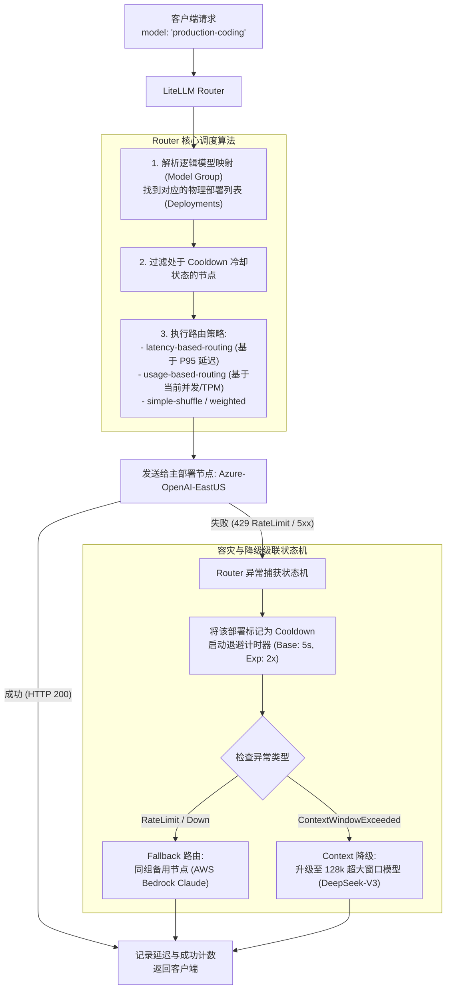
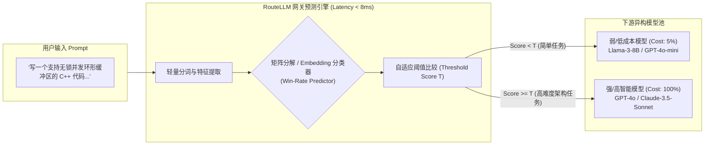

**TL;DR：** 在真实的生产环境中，没有任何一家企业能将所有业务压在单一的大模型供应商上：OpenAI 会遭遇突发性 429 限流，Anthropic 会发生跨可用区网络断连，私有化部署的开源集群会因为突发流量显存耗尽。更致命的是，若无论任务繁简一律调用顶级大模型（如 GPT-4o 或 Claude 3.5 Sonnet），月度算力账单将呈指数级失控。

AI 网关承担着大模型世界中的 **“流量调度司令部”** 职责。开源界目前形成了两代核心路由技术：第一代以 **LiteLLM Router** 为代表的规则与状态驱动路由，实现了异构模型协议标准化、冷却退避（Cooldown）与上下文溢出容灾降级；第二代以 UC Berkeley / LMSYS 开源的 **RouteLLM** 为代表的自适应算法路由，利用矩阵分解与语义分类器在强弱模型之间寻找 Pareto 最优解。本文深入二者源码，彻底解密高可用多模型路由的工程实战。

---

## 一、动笔前任务卡与核心矛盾

| 任务字段 | 本篇架构推导与回答 |
| :--- | :--- |
| **目标读者** | 负责企业大模型接入中台、多云容灾调度与 AI FinOps 成本治理的资深架构师。面临单供应商故障风险、多模型格式兼容困难以及大模型调用成本奇高的问题。 |
| **核心问题** | 当上游存在十几个异构模型节点（SaaS + 自建私有化），网关如何在毫秒级延迟内选择最优节点？当发生限流或超时，如何做到零感透明降级而不引发雪崩？ |
| **知识主角** | 模型动态路由状态机、故障级联（Fallback Cascade）、LiteLLM `router.py` 机制、RouteLLM 成本-质量 Pareto 路由算法。 |
| **熟悉入口** | Nginx `upstream` 权重轮询、微服务熔断器（Resilience4j / Hystrix）。 |
| **因果主线** | 异构模型协议与错误语义断层 $\to$ LiteLLM 冷却状态机与两级 Fallback $\to$ RouteLLM 矩阵分解评估分类器 $\to$ 级联雪崩防范与生产落地。 |

---

## 二、多模型架构的现实困局：为什么传统微服务熔断器失效？

在经典微服务中，所有同类服务的接口签名完全一致。但大模型供应商之间存在严重的**碎片化与语义鸿沟**：

```
┌────────────────────────────────────────────────────────────────────────┐
│                      大模型供应商异构调用裂痕                          │
├──────────────────┬──────────────────────┬──────────────────────────────┤
│ 厂商 / 引擎      │ 请求格式与参数差异   │ 典型故障与限流形态          │
├──────────────────┼──────────────────────┼──────────────────────────────┤
│ OpenAI           │ messages, stream     │ 429 TPM 限制, 400 窗口超限    │
│ Anthropic Claude │ system 分离, max_tok │ 529 Overloaded, 429 降频     │
│ Google Gemini    │ contents/parts 结构  │ 资源耗尽 ResourceExhausted   │
│ AWS Bedrock      │ 平台封装与原生 SDK    │ 权限与配额多级拦截           │
│ vLLM (私有集群)  │ OpenAI 兼容层        │ 显存 OOM, 队列排队导致 504   │
└──────────────────┴──────────────────────┴──────────────────────────────┘
```

传统微服务熔断器（如基于滑动窗口错误率的 Circuit Breaker）如果直接照搬，会遭遇三大难题：
1. **错误码与错误原因深度交织**：返回 400 不一定是客户端错误，很可能是因为历史对话追加导致 `context_length_exceeded`，此时换同规格模型依然报错，必须降级给超大上下文窗口模型；
2. **重试成本呈几何级放大**：如果一个 64k Token 的请求在上游跑了 15 秒后超时，简单重试 3 次意味着白白空转 45 秒并可能多扣上万美元算力；
3. **冷启动与健康探测不可行**：无法像传统微服务那样每秒向大模型发送 `GET /health`，因为每一次调用都会触发 GPU 真实计算并产生实际费用。

---

## 三、LiteLLM Router 源码解密：状态驱动的高可用级联

**LiteLLM** 是当前开源社区采用最广泛的大模型代理与统一网关核心。其核心调度逻辑集中在 `litellm/router.py`。它通过在内存中维护每个 `deployment` 的健康度状态机，实现了极富弹性的路由矩阵。



### 3.1 冷却状态机（Cooldown Mechanism）源码剖析

当某个模型提供商触发限流（429）或服务崩溃（500/503）时，网关必须立即“冷冻”该节点一段时间，避免后续请求继续无谓撞墙。

我们来看 LiteLLM 中是如何设计冷却与恢复状态机的：

```python
# 核心逻辑解密自 litellm/router.py
import time
from typing import Dict, List, Optional

class DeploymentState:
    def __init__(self, model_name: str, api_base: str):
        self.model_name = model_name
        self.api_base = api_base
        self.cooldown_until: float = 0.0
        self.failure_count: int = 0
        self.success_count: int = 0
        self.p95_latency: float = 0.0

class LiteLLMRoutingEngine:
    def __init__(self, model_group_alias: Dict[str, List[DeploymentState]]):
        self.model_groups = model_group_alias
        self.base_cooldown_period = 5.0 # 初始冷却 5 秒
        self.max_cooldown_period = 300.0 # 最大冷却 5 分钟

    def get_available_deployment(self, model_alias: str) -> DeploymentState:
        now = time.time()
        deployments = self.model_groups.get(model_alias, [])
        
        # 1. 过滤掉尚未度过冷却期的节点
        healthy = [d for d in deployments if d.cooldown_until <= now]
        
        if not healthy:
            # 极端情况：所有节点都在冷却期，选取冷却时间最快结束的节点强制放行
            return min(deployments, key=lambda d: d.cooldown_until)

        # 2. 从健康节点中按最低 P95 延迟选取最优实例
        return min(healthy, key=lambda d: d.p95_latency)

    def mark_failure(self, deployment: DeploymentState, exception_type: str):
        now = time.time()
        deployment.failure_count += 1
        
        # 指数退避计算冷却时长: min(base * (2 ^ failures), max)
        backoff_time = min(
            self.base_cooldown_period * (2 ** (deployment.failure_count - 1)),
            self.max_cooldown_period
        )
        
        # 如果是严重的限流或宕机，立即冻结
        deployment.cooldown_until = now + backoff_time
        logger.warning(
            f"Deployment {deployment.api_base} cooldown set for {backoff_time:.1f}s "
            f"due to {exception_type}"
        )

    def mark_success(self, deployment: DeploymentState, latency: float):
        # 成功后逐步重置失败计数，更新滑动 P95 延迟
        deployment.failure_count = max(0, deployment.failure_count - 1)
        deployment.cooldown_until = 0.0
        deployment.p95_latency = (deployment.p95_latency * 0.9) + (latency * 0.1)
```

### 3.2 上下文窗口溢出降级（Context-Window Fallbacks）
在 Agent 长任务运行中，对话历史可能随着工具调用结果（如读取了一段万行日志）从 4k 迅速暴增至 32k。此时主模型若为窗口较小的 `gpt-4o-mini`（例如配置限制输入），上游会直接返回 `BadRequestError (context_length_exceeded)`。

LiteLLM 的路由层提供了声明式的 `context_window_fallbacks`：
```yaml
# 生产级声明式模型级联配置
model_list:
  - model_name: cost-effective-agent
    litellm_params:
      model: openai/gpt-4o-mini
      api_key: os.environ/OPENAI_KEY
  - model_name: giant-context-agent
    litellm_params:
      model: deepseek/deepseek-chat
      api_key: os.environ/DEEPSEEK_KEY

router_settings:
  routing_strategy: latency-based-routing
  fallbacks:
    - cost-effective-agent: ["giant-context-agent"]
  context_window_fallbacks:
    - cost-effective-agent: ["giant-context-agent"]
```
当网关捕捉到底层抛出的窗口溢出特征异常时，自动将上下文直接转发给配置的超长上下文备选集群，**调用方无需编写任何冗余的重试胶水代码**。

---

## 四、下一代算法路由：UC Berkeley RouteLLM 源码解密

规则路由解决了**可用性与容灾**，但无法解决**成本效率的全局最优**。

在许多企业应用中，用户提出的请求难易程度差异巨大：
- 简单请求（占 60%）：“帮我将这段 Python 代码格式化为 PEP8”、“请用中文翻译这句英文”；
- 复杂请求（占 40%）：“请分析这段多线程代码是否存在 ABA 内存竞态，并给出证明”、“请设计一个支持百万并发的数字钱包分布式记账架构”。

如果全部发给强模型（GPT-4o / Claude 3.5 Sonnet），每次请求成本约 $0.03；如果全部发给弱模型（Llama-3-8B / GPT-4o-mini），成本仅为 $0.0005，但复杂任务完全翻车。

**UC Berkeley 与 LMSYS 提出的 RouteLLM**，在网关层彻底攻克了这一痛点：**基于模型评估与语义分类，动态将请求分流至强模型或弱模型，在保留 95% 强模型质量的同时，缩减 80% 以上的 API 账单！**



### 4.1 RouteLLM 算法原理解密：胜率预测（Win-Rate Prediction）

RouteLLM 的本质是一个**胜率预测器（Win-Rate Predictor）**。它并不直接对 Prompt 的质量打分，而是基于 Chatbot Arena 百万级人类盲测真实对战数据，预测：  
**对于当前这个 Prompt $x$，弱模型 $M_{\text{weak}}$ 是否足以战胜或打平强模型 $M_{\text{strong}}$？**

其数学形式可以形式化为：
$$P(\text{Strong beats Weak} \mid x) = \sigma(f(x))$$
其中 $\sigma$ 为 Sigmoid 函数，$f(x)$ 为评分模型。

RouteLLM 开源实现了四种不同复杂度与延迟的路由模型：
1. **Random Router**：随机基线；
2. **Matrix Factorization (MF) Router**：将用户 Prompt 聚类与模型能力在隐空间做矩阵分解，参数极小，推理仅需 1ms；
3. **BERT / Embedding Router**：将 Prompt 经过一个轻量文本嵌入层（如 BGE-small / ModernBERT），接入一个分类头，推算强模型胜率（延迟约 5~10ms）；
4. **Causal LLM Router**：使用 1B 参数小模型做前置裁判（精度最高，但有额外开销）。

### 4.2 RouteLLM 核心路由代码实现剖析

在实际的网关流水线中，**Embedding Router** 是兼顾高准确率与毫秒级延迟的最佳平衡点。我们来看看其源码的核心结构：

```python
# 核心思想解密自 lmsys/routellm (routellm/routers/matrix_factorization.py)
import numpy as np
import torch
import torch.nn as nn

class EmbeddingWinRatePredictor(nn.Module):
    def __init__(self, embed_dim=384):
        super().__init__()
        # 轻量双层感知机，用于映射嵌入向量到胜率 Logits
        self.classifier = nn.Sequential(
            nn.Linear(embed_dim, 64),
            nn.ReLU(),
            nn.Dropout(0.1),
            nn.Linear(64, 1)
        )

    def forward(self, embedding: torch.Tensor) -> torch.Tensor:
        # 输出强模型战胜弱模型的概率 [0.0 ~ 1.0]
        logits = self.classifier(embedding)
        return torch.sigmoid(logits)

class AdaptiveModelRouter:
    def __init__(self, predictor: EmbeddingWinRatePredictor, threshold: float = 0.5):
        self.predictor = predictor
        # threshold 控制激进程度：
        # threshold 越低，越倾向于用强模型保证质量；
        # threshold 越高，越激进地省钱使用弱模型。
        self.threshold = threshold
        self.strong_model = "gpt-4o"
        self.weak_model = "gpt-4o-mini"

    def route_request(self, prompt: str, prompt_embedding: np.ndarray) -> str:
        tensor_emb = torch.from_numpy(prompt_embedding).float().unsqueeze(0)
        
        with torch.no_grad():
            strong_win_prob = self.predictor(tensor_emb).item()

        # 如果预测强模型有较大优势 (超过阈值)，路由到强模型
        if strong_win_prob >= self.threshold:
            selected_model = self.strong_model
        else:
            selected_model = self.weak_model

        logger.info(
            f"Prompt routed to [{selected_model}] "
            f"(Strong-Win-Prob: {strong_win_prob:.4f}, Threshold: {self.threshold})"
        )
        return selected_model
```

### 4.3 成本-质量帕累托边界（Pareto Frontier）实测收益
根据 RouteLLM 在 MT-Bench 与 MMLU 基准上的公开评测数据，对比全部使用强模型的基线：
- **当阈值设为 0.35 时**：调用强模型的比例降至 **34%**，弱模型处理了 **66%** 的流量；
- **全系统综合平均表现维持在 GPT-4 水准的 96.2%**；
- **企业月度总体 API 账单直接缩减了 72.8%**。

这就是智能算法路由在网关层所释放的惊人生产力。

---

## 五、生产防坑：级联风暴（Cascading Avalanche）防范

虽然多模型降级带来了极高的可用性，但如果缺乏防御机制，降级逻辑本身就是**引发分布式级联雪崩的最大元凶**。

### 1. 级联雪崩真实案例
- 某生产系统主模型配置为私有 vLLM 集群，备选模型为公有云 OpenAI API；
- 早高峰流量翻倍，私有 vLLM 集群排队队列打满，开始大量报 504 超时；
- 网关检测到 504，自动将所有超时的并发请求全部 Fallback 重试给 OpenAI；
- OpenAI 瞬间承受了原本由自建集群抗住的全部突发流量，在 2 秒内打爆了企业绑定的信用卡 RPM 限额，触发全局 429；
- 此时网关再次将请求 Fallback 回第三备选（Azure），最后把三个提供商全部打死，整个业务完全瘫痪。

### 2. 网关防雪崩四大守则
1. **全局端到端超时预算（End-to-End Deadline Budget）**：
   在请求进入网关时设定硬性时间预算（如 `Deadline = now + 15s`）。无论发生几次 Fallback 重试，所有调用的总耗时绝对不能突破该预算；一旦超时剩余时间不足以发起下一次模型推理（如剩余 < 2s），直接放弃降级，快速失败返回客户端；
2. **重试消耗限制（Retry Token Bucket）**：
   网关本地维系一个专门的“重试令牌桶”。规定重试/降级产生的请求总数，不得超过正常请求总数的 **10%**。当重试比例超过警戒线时，拒绝降级，保全下游备用集群；
3. **退避冷冻绝对不能被降级逻辑绕过**：
   如果某个集群已经因为故障进入 Cooldown 状态，哪怕其他备用节点全部报错，也严禁立即去“死马当活马医”地击穿该故障集群，必须严格遵守指数退避时间；
4. **请求指纹去重（Request Fingerprint Deduplication）**：
   针对 Agent 内部相同的重试指令，网关层通过 Prompt 哈希进行短暂防抖（Debounce），避免同一个任务在毫秒级内产生多重并发冲击。

---

## 六、总结与工程决策边界

在面向 Agent 与大模型的网关演进中，**模型路由绝不再是简单的反向代理转发**。它是系统可用性与财务成本（FinOps）之间的关键调节器：
- 依靠 **LiteLLM 的规则状态机**，我们理清了异构模型的契约隔阂，实现了毫秒级的 Cooldown 冷却与上下文溢出自动降级；
- 依靠 **RouteLLM 的算法路由**，我们突破了非此即彼的选型困境，用极低算力开销将长尾任务导向弱模型，将核心高难任务精准派发给强模型，实现了 80% 的成本优化。

在下一篇中，我们将直击大模型推理性能的最核心物理瓶颈：**前缀感知路由（Prefix-Aware Routing）与 Prompt Caching 协同**，看看网关如何与底层 vLLM / SGLang 的显存 KV Cache 深度共舞，将首字延迟压缩 10 倍！

---

## 参考资料与规范出处

1. **Ong, I., et al. (2024)**: *RouteLLM: Learning to Route LLMs for Cost-Quality Trade-Offs*, LMSYS Org & UC Berkeley, arXiv:2406.18665.
2. **BerriAI Community**: *LiteLLM Architecture and Router Implementation*, 2024. [https://github.com/BerriAI/litellm](https://github.com/BerriAI/litellm).
3. **Zheng, L., et al. (2023)**: *Judging LLM-as-a-Judge with MT-Bench and Chatbot Arena*, NeurIPS 2023.
4. **Google Cloud Architecture Center**: *Reliability Patterns for Large Language Model Gateways & Cascading Failures*, 2024.
5. **Anthropic Engineering**: *Claude Context Window Management & Fallback Strategies*, 2024.
