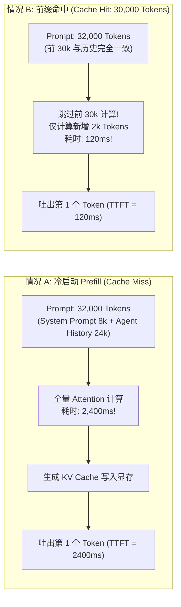
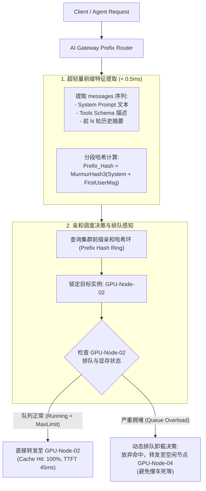

**TL;DR：** 在经典后端架构中，反向代理（如 Nginx、Envoy）最引以为傲的能力是“将流量均匀地泼向每一个无状态的后端实例”。然而，在自建大模型推理集群（如使用 vLLM 或 SGLang）的世界里，**均匀分发的轮询调度反而是毁灭集群性能的头号杀手**。大模型推理的 Prefill 阶段受到计算与显存带宽的双重压制，唯有当请求命中了 GPU 显存中已计算好的 Key-Value (KV) Cache 时，才能跳过昂贵的矩阵乘法，使首字延迟（TTFT）从几秒断崖式下跌至几十毫秒。

如果网关对后端的显存状态一无所知，Agent 的多轮会话或带有数万字通用知识库的 Prompt 将被随机打散在不同的推理节点上，导致底层昂贵的 HBM 显存缓存命中率无限趋近于零。现代生产级 AI 网关必须进化出 **前缀感知路由（Prefix-Aware Routing）** 能力。本文深入 vLLM 块级缓存与 SGLang RadixAttention 底层，彻底拆解网关如何通过前缀哈希环与树状状态机协同，实现算力与延迟的极致榨取。

---

## 一、动笔前任务卡与核心矛盾

| 任务字段 | 本篇架构推导与回答 |
| :--- | :--- |
| **目标读者** | 负责自建大模型推理集群接入、长上下文 Agent 系统以及低延迟 AI 应用的基础架构工程师。已经搭建了多卡多机推理服务，但遭遇集群首字延迟过高、GPU 利用率虚高的技术人员。 |
| **核心问题** | 为什么传统负载均衡会打碎 KV Cache？网关如何在极低开销（<2ms）下感知 Prompt 前缀并精准调度到持有该缓存的 GPU 节点？当缓存热点引发排队倾斜时如何自适应平衡？ |
| **知识主角** | 前缀感知路由（Prefix-Aware Routing）、KV Cache 物理机理、vLLM Chunked Cache、SGLang RadixAttention、自适应排队卸载算法。 |
| **熟悉入口** | 一致性哈希（Consistent Hashing）、分布式缓存（Redis 分片）、Nginx `ip_hash`。 |
| **因果主线** | Prefill 计算墙与 KV Cache 复用价值 $\to$ 轮询调度引发的缓存击穿雪崩 $\to$ 网关层前缀哈希与 Radix Tree 状态建模 $\to$ 缓存亲和与负载均衡冲突时的自适应卸载闭环。 |

---

## 二、大模型推理的底层物理铁律：Prefill 与 KV Cache 的经济学

要理解网关为什么要管前缀缓存，必须先看清大模型推理的两个截然不同的物理阶段：

```text
大模型推理两阶段耗时与显存模型:
1. Prefill (首字计算阶段):
   - 一次性摄入全部 Prompt 输入序列 (Length: N)
   - 计算复杂度: O(N^2) Self-Attention 矩阵运算
   - 物理瓶颈: 极度吃 GPU Tensor Core 浮点算力与显存带宽
   - 产物: 生成所有 Token 对应的 Key 和 Value 张量，存入显存 (KV Cache)
   - 耗时: 32k Token 的 Prefill 耗时往往在 1,000ms ~ 3,000ms!

2. Decode (自回归逐字生成阶段):
   - 每次只输入上一步生成的 1 个 Token
   - 复用之前保存在显存里的 KV Cache，只需计算新 Token 与历史的 Cross Attention
   - 计算复杂度: O(N) 访存密集型
   - 耗时: 每个 Token 仅需 15ms ~ 30ms
```



### 2.1 为什么说轮询调度是“算力自残”？
假设我们有一个由 4 台双卡 H100 节点构成的推理集群，服务一个多轮 Agent 智能体系统。
用户在一个复杂 Coding 任务中进行了 5 轮交互：
- **第 1 轮**：发送初始需求（4k Token）。节点 1 计算，把这 4k Token 的 KV Cache 留在了节点 1 的 HBM 显存中；
- **第 2 轮**：用户确认代码，Agent 携带前一轮历史追加了 2k Token（共 6k Token）。传统网关轮询分发给**节点 2**。
  - 节点 2 的显存一片空白！节点 2 必须把前面的 4k + 2k 全量重新计算一遍；
- **第 3 轮**：再次追加 3k Token（共 9k Token）。网关轮询分发给**节点 3**。节点 3 又重头算一遍……

**结果**：整个集群 4 台昂贵的 GPU，全都在周而复始地重复计算完全一模一样的历史 Prompt！不仅首字延迟始终高达数秒，而且显存被重复且零散的缓存碎片彻底填满。

---

## 三、底层推理引擎的缓存机制：vLLM Chunked vs SGLang RadixAttention

在网关进行调度前，必须清楚底层推理节点是如何管理这些 KV Cache 的：

### 3.1 vLLM 的 PagedAttention 与块级哈希（Chunked Prefix Caching）
vLLM 将连续的 KV Cache 离散化为固定大小的块（Block，默认 16 个 Token）。
- 当开启 `enable_prefix_caching=True` 时，vLLM 会对每 16 个 Token 的内容序列计算哈希值：
  $$\text{Hash}_k = \text{Hash}(\text{Hash}_{k-1} + \text{Tokens}_{16k \dots 16k+15})$$
- 只要前缀连续匹配，就可以在显存页表中直接挂载对应的物理 Block，实现零拷贝复用。

### 3.2 SGLang 的树状基数缓存（RadixAttention）
SGLang 将这一思想推向了极致：它在推理引擎内存中维护了一棵全局 **Radix Tree（基数树）**。
- 每一个节点代表一段 Token 序列，边代表前缀延伸；
- 当新请求到来时，在 Radix Tree 上做前缀匹配（Longest Prefix Match）；
- 匹配到的前缀直接复用显存，未匹配的尾部继续计算，并作为新子分支插入树中；
- 显存不足时，采用标准的 LRU 策略从叶子节点逐级驱逐。

**因果推导**：无论底层是 vLLM 还是 SGLang，**它们都只能在“单节点物理显存”的边界内复用缓存**。跨节点的显存互访受限于网络带宽（即便是 InfiniBand RDMA，跨节点传输几十 GB 的 KV Cache 延迟也极其高昂）。  
**因此，将具备相同前缀特征的流量精准引导至持有该前缀的同一物理节点，是网关层不可推卸的核心使命！**

---

## 四、网关层前缀感知路由架构与核心算法

网关如何在既不全量运行重型 Tokenizer，又不在关键路径引入高延迟的前提下，实现精准的前缀亲和？



### 4.1 前缀特征提取的工程妥协：文本哈希 vs Token 哈希
在网关层，理想状态是对输入做完整的 BPE Tokenize，再按照 Token ID 序列算前缀匹配。
但**生产实践的现实取舍是**：完整分词一个 32k 的文本在网关 CPU 上需要耗费 10~20ms，这个延迟对于网关主路径而言过重。

**最佳工业界实践（如 SGLang Router）**：
1. **结构化锚点哈希（Structural Anchor Hashing）**：
   对于 Agent 请求，JSON 格式天然具有层次结构：
   - 提取 `messages[0]`（通常是 System Prompt，包含大量的 Persona 定义、工作流指南与所有工具 Schema，大小固定且极大，通常 2k~8k）；
   - 对这部分结构化文本直接执行极速哈希（如 `XXHash64` 或 `MurmurHash3`，耗时仅需几微秒）；
2. **长文本分块哈希（Chunked Rolling Hash）**：
   对于单条长 Prompt，以每 512 字符为一个步长计算滚动哈希，生成前缀签名链表。

### 4.2 前缀感知路由器的源码实现（Python / Go 核心骨架）

我们来看一个支持前缀亲和与负载均衡双重约束的生产级路由调度器实现：

```python
import xxhash
import time
from typing import List, Dict, Optional

class GPUNodeState:
    def __init__(self, node_id: str, address: str):
        self.node_id = node_id
        self.address = address
        self.running_requests = 0
        self.max_concurrency = 32
        self.cached_prefix_hashes: set = set()
        self.last_heartbeat = time.time()

class PrefixAwareRouter:
    def __init__(self, nodes: List[GPUNodeState], queue_threshold: int = 16):
        self.nodes = {n.node_id: n for n in nodes}
        self.queue_threshold = queue_threshold # 允许排队的最大深度阈值

    def _compute_prefix_fingerprint(self, messages: List[Dict[str, str]]) -> str:
        """
        提取首个系统消息与首个用户消息的前缀指纹
        """
        if not messages:
            return ""
        
        prefix_content = ""
        # 提取系统 Prompt
        if messages[0].get("role") == "system":
            prefix_content += messages[0].get("content", "")
        
        # 结合第一个用户输入的前 500 个字符
        for msg in messages:
            if msg.get("role") == "user":
                prefix_content += msg.get("content", "")[:500]
                break

        return xxhash.xxh64(prefix_content.encode("utf-8")).hexdigest()

    def select_node(self, messages: List[Dict[str, str]]) -> GPUNodeState:
        prefix_fp = self._compute_prefix_fingerprint(messages)
        
        # 1. 寻找显存中已持有该前缀缓存的候选节点 (Cache Hit Candidate)
        matched_node = None
        for node in self.nodes.values():
            if prefix_fp in node.cached_prefix_hashes:
                matched_node = node
                break

        # 2. 如果命中了缓存持有节点
        if matched_node:
            # 核心权衡: 检查该节点的排队拥塞程度
            if matched_node.running_requests < self.queue_threshold:
                # 负载在容忍范围内，优先享受 KV Cache 带来的 10 倍加速
                return matched_node
            else:
                logger.warning(
                    f"Node {matched_node.node_id} has cache hit, but queue is congested "
                    f"({matched_node.running_requests} reqs). Triggering adaptive offload!"
                )
                # 触发自适应卸载: 节点排队过深，继续等待的排队耗时将超过冷计算耗时!

        # 3. Cache Miss，或者命中但排队过深 -> 选取当前全集群最空闲节点 (Least Loaded)
        idle_node = min(self.nodes.values(), key=lambda n: n.running_requests)
        
        # 乐观更新: 预期该节点在处理完后，将在显存中沉淀下该前缀
        idle_node.cached_prefix_hashes.add(prefix_fp)
        return idle_node
```

---

## 五、权衡与边界：当“缓存亲和”遭遇“负载热点”

在前缀感知的落地中，最容易让架构师翻车的场景是：**极端倾斜的超热点 Prompt 导致的排队泥潭**。

### 5.1 场景推演：全公司共用同一个超级 Agent 模板
假设企业内部上线了一个客服 Agent，所有几千个并发员工的对话，其 System Prompt 完全一模一样（长达 8,000 Token）。
- 如果网关无脑执行“前缀亲和一致性哈希”，这 8,000 Token 的哈希值是固定不变的；
- **结果**：全公司所有成千上万个请求，被网关全数精准投递到了第一台物理节点 `GPU-Worker-01` 上！
- `GPU-Worker-01` 的排队队列堆积了 500 个请求，首字延迟被硬生生排到了 30 秒；而旁边的 `GPU-Worker-02` 到 `04` 却全程空转，显卡功耗只有 60W。

### 5.2 解决方案：基于排队延迟的动态卸载边界（Cost-Aware Offloading Boundary）
网关必须量化一个关键数学不等式：  
**何时代价更小？是“在热节点排队等待命中缓存”，还是“去空闲节点重新冷计算（Cold Prefill）”？**

设：
- $T_{\text{queue}}$：当前热节点的平均排队等待时间；
- $T_{\text{prefill\_cold}}$：在空闲节点从头计算该 Prompt 所需的冷启动时间；
- $T_{\text{prefill\_hit}}$：在热节点命中缓存后的增量计算时间（通常极小，接近 0）。

**网关的动态卸载判决准则**：
$$\text{当且仅当 } T_{\text{queue}} + T_{\text{prefill\_hit}} > T_{\text{prefill\_cold}} \text{ 时，立即执行卸载（Offload）！}$$

网关通过定期拉取或基于当前并发估算排队延迟。一旦热节点排队时间超过了冷算开销，网关果断将流量溢流（Spillover）到其他空闲 GPU 节点。随后，空闲节点的显存也会沉淀出这一份热点前缀，自然形成 **“多节点分布式多级缓存复制”**，热点被优雅平摊。

---

## 六、总结与工程决策边界

在大模型基础设施中，网络层与计算层的界限正在彻底模糊：
- 传统观念认为“网关只管网络转发，推理引擎只管计算”；
- 但现实是：**网关的调度决定了底层 GPU HBM 显存的数据局部性（Data Locality）**。

通过实施前缀感知路由（Prefix-Aware Routing）：
1. **Agent 多轮任务的首字响应延迟从 2~3 秒骤降至 100 毫秒以内**，大幅提升人机交互实时性；
2. **集群整体吞吐量（Throughput）提升 2~3 倍**，避免了大量 Tensor Core 算力被浪费在重复的乘加运算中；
3. 配合**基于排队时延的动态自适应卸载**，彻底规避了单节点热点拥塞陷阱。

在下一篇中，我们将攻关 AI 网关在商业化与多租户场景下的最大死穴：**从 QPS 到 TPM/RPM：高并发 Token 双轨自适应限流与分布式精算**，看看网关如何在输入预估与输出异步补齐的复杂状态下，做到千级并发绝对不超卖！

---

## 参考资料与规范出处

1. **Zheng, L., et al. (2024)**: *SGLang: Efficient Execution of Structured Language Model Programs*, arXiv:2312.07104. (RadixAttention 基数树显存管理论文).
2. **Kwon, W., et al. (2023)**: *Efficient Memory Management for Large Language Model Serving with PagedAttention*, ACM SOSP 2023.
3. **vLLM Project Authors**: *Automatic Prefix Caching Architecture & Block Allocation Specification*, 2024. [https://docs.vllm.ai](https://docs.vllm.ai).
4. **SGLang Project Authors**: *SGLang Router: Cache-Aware Load Balancing for LLM Inference Clusters*, 2024. [https://github.com/sgl-project/sglang](https://github.com/sgl-project/sglang).
5. **Anthropic Engineering**: *Prompt Caching in Claude: Principles and Latency Improvements*, 2024.
