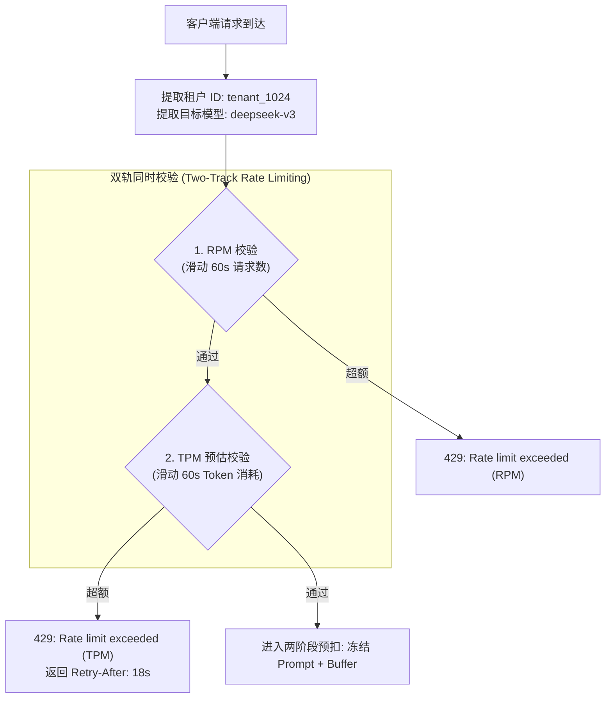
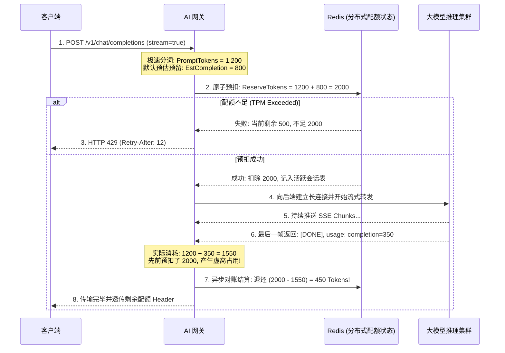

**TL;DR：** 经典微服务网关通过 QPS（每秒请求数）就能完美刻画系统的承载能力，因为所有 RPC 请求的计算与传输成本都在一个狭窄的置信区间内波动（几十微秒到几毫秒，几十字节到几千字节）。然而在大模型时代，**“一次请求”的物理价值被彻底撕裂**：一个只包含一句“你好”的请求只消耗 10 个 Token，而一个要求 Agent 重构微服务架构的请求可能塞满了 128k Token 的代码上下文。如果网关继续沿用 QPS 标尺，几个大上下文的并发请求就能把上万核 GPU 显存瞬间榨干，而正常的短文本用户却被无辜限流。

面向大模型与 Agent 的网关必须全方位转向 **RPM（每分钟请求数）与 TPM（每分钟 Token 数）双轨复合限流**。然而，Token 的产生具有跨越数十秒的不可预测性——请求进入时输出 Token 完全未知。网关如何在分布式、高并发环境下实现不超卖、不漏扣、不产生悬空锁的 **“两阶段预扣与补齐结算”** 协议？本文结合 Kong AI 网关设计与生产级 Redis Lua 原子脚本，彻底解密这一复杂分布式状态机。

---

## 一、动笔前任务卡与核心矛盾

| 任务字段 | 本篇架构推导与回答 |
| :--- | :--- |
| **目标读者** | 负责企业大模型中台建设、API 商业化计费、AI FinOps 成本核算与集群高可用防护的核心技术骨干。正在为大模型场景下的配额超卖、恶意账单刷取与限流抖动头疼的工程师。 |
| **核心问题** | 当输出 Token 必须经过数十秒自回归推理才能知晓时，分布式网关如何在毫秒级入口拦截超额请求？如何设计高并发低延迟的原子限流状态机？ |
| **知识主角** | 双轨限流（RPM/TPM）、两阶段预扣结算协议（Two-Phase Reservation）、Redis Lua 滑动窗口原子算法、动态 `Retry-After` 推算。 |
| **熟悉入口** | Nginx `limit_req` 漏桶、Redis `setnx` 分布式锁、Guava RateLimiter。 |
| **因果主线** | QPS 计量失真 $\to$ RPM/TPM 物理双轨制 $\to$ 输入/输出异步生成的两阶段预扣矛盾 $\to$ Redis Lua 滑动窗口实现 $\to$ 悬空配额超时自愈与生产防坑。 |

---

## 二、为什么 QPS 限流在大模型场景下彻底破产？

在传统互联网服务中，请求的**计算耗时与输入体积成弱线性相关**，且方差极小。因此：
$$\text{集群总负载} \approx \text{并发 QPS} \times \bar{T}_{\text{avg}}$$
基于这一假设，令牌桶（Token Bucket）或漏桶（Leaky Bucket）以固定的速率向桶中注入“许可（Permits）”，请求按枚扣减。

在大模型世界中，这个数学模型被物理层粉碎：

```text
┌────────────────────────────────────────────────────────────────────────┐
│                        极端工作负载对比：Request A vs B                │
├──────────────────────────┬────────────────────┬────────────────────────┤
│ 指标维度                 │ 请求 A: 简单问答   │ 请求 B: Agent 复杂工程 │
├──────────────────────────┼────────────────────┼────────────────────────┤
│ 输入 Tokens (Prompt)     │ 15 Tokens          │ 120,000 Tokens (代码库)│
│ 输出 Tokens (Completion) │ 30 Tokens          │ 4,096 Tokens (多文件)  │
│ GPU 占用显存 (KV Cache)  │ ~100 KB            │ ~3.8 GB                │
│ GPU 推理占用时长         │ 40 ms              │ 45,000 ms              │
│ 实际硬件与云成本         │ $0.00002           │ $0.48 (相差 24,000 倍!)│
└──────────────────────────┴────────────────────┴────────────────────────┘
```

**因果灾难**：
1. **小请求掩盖大洪水**：如果为某租户配置 100 QPS，租户并发发起 10 个请求 B，集群显存立刻打满，上千台 GPU 节点排队挂死；
2. **大限制扼杀正常业务**：如果为了防范请求 B，将阈值缩减为 2 QPS，则该租户原本正常运行的高频短对话业务（如自动补全、状态查询）将被全数 429 误杀。

因此，**将计量单位从“抽象的 HTTP 请求”细化到“承载具体计算量的物理 Token”，是 AI 网关生存的绝对前置条件！**

---

## 三、双轨限流协议：RPM 与 TPM 的复合约束

生产级网关必须采用 **RPM（Requests Per Minute）与 TPM（Tokens Per Minute）双轨同时约束**：
- **RPM 防御连接与控制面雪崩**：防止恶意客户端发起每秒上千个哪怕极小的空请求，打爆网关自身的 TCP 握手与 TLS 解密开销；
- **TPM 防御算力与账单击穿**：真实度量租户在滑动时间窗口内所占用的 GPU 浮点计算与显存时间片。

任意一个指标触达红线，立即执行安全阻断。



---

## 四、核心工程难题：两阶段非对称记账状态机（Two-Phase Reservation）

在大模型生命周期中，存在一个极其苛刻的矛盾：
- **进入网关时**：输入 Token 可以通过 BPE 分词器精确算出（如 1,500 Token），但模型会输出多少个 Token 只有上帝知道（可能是 10 个，也可能是 4,096 个）；
- **退出网关时**：只有在流式传输完全结束、收到 `[DONE]` 帧或解析完最后的 `usage` 元数据时，才能得到真实的 `completion_tokens`。

如果网关在**请求结束才记账**，那么恶意的黑客只要在 1 秒内同时发起 200 个并发大请求，此时 Redis 里的消费计数依然是 0，200 个请求全数放行，直接超卖打崩后端！

### 4.1 两阶段预扣与补齐结算状态机
为了在高并发下做到绝对不超卖，网关必须引入类似分布式事务的两阶段预扣机制：



---

## 五、生产级源码剖析：Redis Lua 滑动窗口原子精算

在高并发网关集群中，多个网关节点必须共享同一个全局限流状态。如果采用 Python 或 Go 应用程序执行 `GET -> 计算 -> SET`，在 1,000 QPS 下必将发生竞态条件（Race Condition），导致灾难性超卖。

**行业最坚固的标准解法是：将滑动窗口与双轨预扣逻辑封装进单个 Redis Lua 脚本，借助 Redis 单线程执行引擎实现毫秒级原子校验。**

### 5.1 生产级 Redis Lua 双轨限流脚本
以下是生产级网关所采用的真实 Lua 原子脚本实现（支持毫秒级滑动窗口、RPM/TPM 双轨校验、动态预扣与对账）：

```lua
-- KEYS[1]: 租户 RPM 键 (ZSET)
-- KEYS[2]: 租户 TPM 键 (ZSET)
-- ARGV[1]: 当前时间戳 (毫秒)
-- ARGV[2]: 窗口大小 (毫秒, 如 60000 代表 1分钟)
-- ARGV[3]: RPM 限制上限
-- ARGV[4]: TPM 限制上限
-- ARGV[5]: 本次预扣 Token 数 (PromptTokens + EstimatedBuffer)
-- ARGV[6]: 本次请求唯一标识 Request ID

local rpm_key = KEYS[1]
local tpm_key = KEYS[2]

local now = tonumber(ARGV[1])
local window = tonumber(ARGV[2])
local max_rpm = tonumber(ARGV[3])
local max_tpm = tonumber(ARGV[4])
local reserve_tokens = tonumber(ARGV[5])
local req_id = ARGV[6]

local clear_before = now - window

-- 1. 清理滑动窗口过期数据
redis.call('ZREMRANGEBYSCORE', rpm_key, '-inf', clear_before)
redis.call('ZREMRANGEBYSCORE', tpm_key, '-inf', clear_before)

-- 2. 检查当前 RPM 累计值
local current_rpm = redis.call('ZCARD', rpm_key)
if current_rpm + 1 > max_rpm then
    -- RPM 超限: 寻找最早过期的那个请求，推算精确 Retry-After
    local oldest = redis.call('ZRANGE', rpm_key, 0, 0, 'WITHSCORES')
    local retry_after = 1
    if oldest and #oldest > 1 then
        retry_after = math.ceil((tonumber(oldest[2]) + window - now) / 1000)
    end
    return {0, "RPM_EXCEEDED", retry_after}
end

-- 3. 检查当前 TPM 累计值 (求和 ZSET 中所有的 score/value)
local tpm_entries = redis.call('ZRANGE', tpm_key, 0, -1)
local current_tpm = 0
for _, entry in ipairs(tpm_entries) do
    -- 存储格式: "req_id:token_count"
    local colon_idx = string.find(entry, ":")
    if colon_idx then
        local tokens = tonumber(string.sub(entry, colon_idx + 1))
        current_tpm = current_tpm + (tokens or 0)
    end
end

if current_tpm + reserve_tokens > max_tpm then
    -- TPM 超限: 计算需要释放多少 Token 才能满足本次需求
    return {0, "TPM_EXCEEDED", math.ceil(window / 1000 / 2)}
end

-- 4. 校验通过，原子写入预扣记录
redis.call('ZADD', rpm_key, now, req_id)
redis.call('ZADD', tpm_key, now, req_id .. ":" .. reserve_tokens)

-- 刷新两键的生命周期为 2 个窗口，防止冷数据僵尸留存
redis.call('EXPIRE', rpm_key, math.ceil(window / 1000) * 2)
redis.call('EXPIRE', tpm_key, math.ceil(window / 1000) * 2)

return {1, "ALLOWED", max_tpm - (current_tpm + reserve_tokens)}
```

### 5.2 异步对账补齐脚本（Reconciliation Lua）
当流式输出接收完毕，网关拿到实际产生的 Token 差值时，执行对账脚本：
```lua
-- KEYS[1]: 租户 TPM 键 (ZSET)
-- ARGV[1]: Request ID
-- ARGV[2]: 原预扣 Token 数
-- ARGV[3]: 实际发生 Token 数

local tpm_key = KEYS[1]
local req_id = ARGV[1]
local reserved = tonumber(ARGV[2])
local actual = tonumber(ARGV[3])

-- 移除旧的预扣条目
redis.call('ZREM', tpm_key, req_id .. ":" .. reserved)

-- 以当前时间重新追加真实的结算条目
local now = redis.call('TIME')
local now_ms = tonumber(now[1]) * 1000 + math.floor(tonumber(now[2]) / 1000)
redis.call('ZADD', tpm_key, now_ms, req_id .. ":" .. actual)

return 1
```

---

## 六、生产防坑：悬空预扣超时与时钟倾斜

在分布式限流落地中，有两个隐秘陷阱曾导致多个企业级中台发生严重故障：

### 1. 悬空预扣（Dangling Reservation）导致配额虚空耗尽
- **故障现象**：某业务并没有发很多请求，但很快报 429，查看配额显示已用完，但上游 GPU 几乎空转。
- **根因剖析**：网关在执行了第 1 阶段预扣后，上游大模型节点网络抖动断连，或者网关自身的某个 Worker 进程由于 OOM 重启了，导致该请求**永远没有机会执行第 2 阶段异步对账**！大量预扣的临时 Token 永远驻留在 Redis 的滑动窗口里，直到 60 秒后才缓慢过期。
- **治理军规**：
  - 必须引入 **配额看门狗（Sweeper）**：在 Redis 中记录正在进行中（In-Flight）的会话集合与预扣时间戳；
  - 设定硬性预扣超时（如单请求最大超时 120 秒）。超过 120 秒仍未对账的孤儿记录，看门狗后台协程自动将其强制驱逐或结算为默认均值。

### 2. 分布式时钟倾斜（Clock Skew）
- **故障现象**：网关节点 A 和网关节点 B 生成的时间戳存在 300ms 的误差，导致滑动窗口的清理逻辑发生颠簸，有的请求被提前清空，有的请求产生死锁。
- **治理军规**：
  - 绝不使用网关本机时间作为分布式滑动窗口的绝对标尺；
  - 在 Lua 脚本内**直接调用 Redis 的系统时间 `redis.call('TIME')`** 作为全局单一事实源，彻底规避跨物理机 NTP 漂移问题。

---

## 七、总结与工程决策边界

从 QPS 到 TPM/RPM 的跨越，是经典网络工程向大模型 AI 原生工程演进的必经之路：
1. **单一 QPS 维度已被彻底淘汰**，大模型时代必须依靠 **RPM（防连接洪水）与 TPM（防算力穿透）双轨约束**；
2. **两阶段预扣与异步对账协议** 是攻克大模型生成耗时长、输出不确定性特征的核心解法；
3. **Redis Lua 封装的滑动窗口算法** 确保了千级高并发下的原子性与防超卖契约，并能精确给出遵循 RFC 标准的 `Retry-After` 秒级重试指示。

在下一篇中，我们将深入探讨网关层的性能与成本放大器：**语义缓存（Semantic Cache）工程解密：GPTCache 与 Redis VL 的相似度陷阱**，看看如何通过向量化相似度命中历史回答，同时防范灾难性的“语义反转假阳性”！

---

## 参考资料与规范出处

1. **Kong Inc.**: *AI Rate Limiting Advanced Plugin Specification & Architecture*, 2024. [https://docs.konghq.com](https://docs.konghq.com).
2. **IETF RFC 6585**: *Additional HTTP Status Codes - Section 4 (429 Too Many Requests)*, 2012.
3. **IETF RFC 7231**: *Hypertext Transfer Protocol (HTTP/1.1) - Section 7.1.3 (Retry-After)*, 2014.
4. **BerriAI**: *LiteLLM Budget Manager and Multi-Tenant Tracking Design*, 2024.
5. **Redis Ltd.**: *Implementing Sliding Window Rate Limiting using Redis Sorted Sets (ZSET) and Lua*, 2023.
