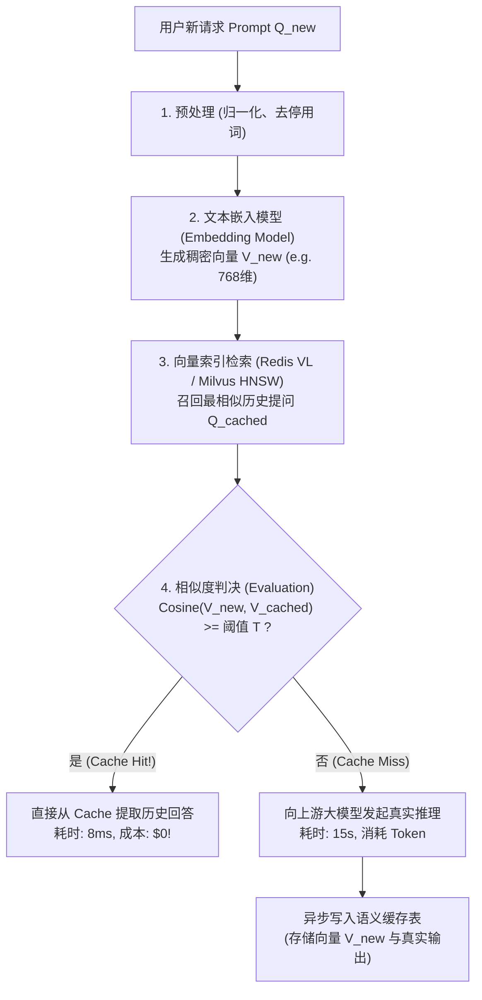
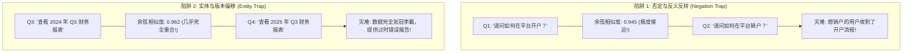
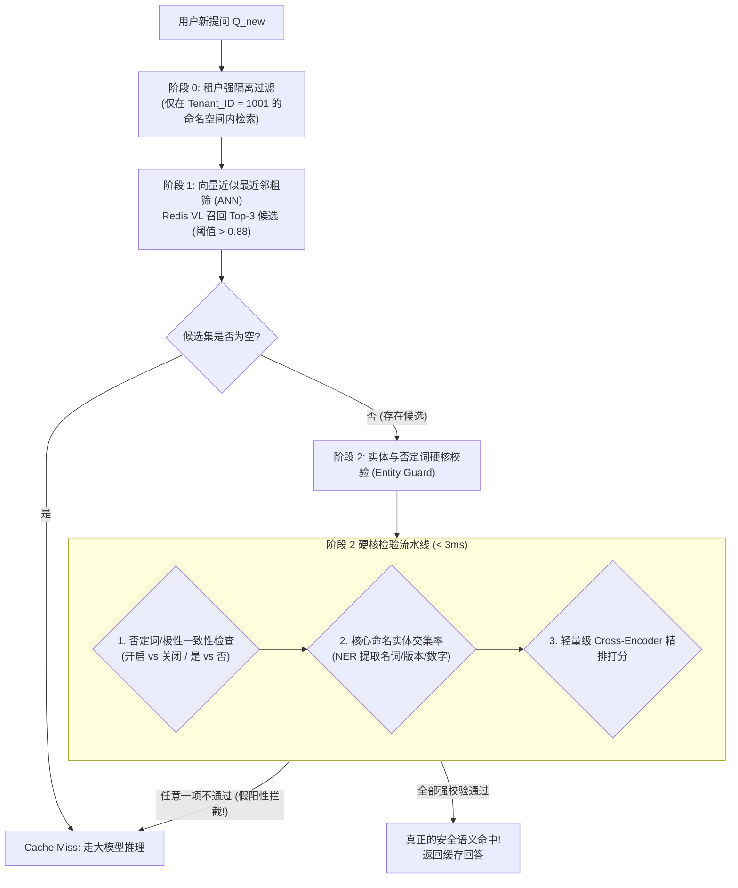

**TL;DR：** 在经典 Web 架构中，HTTP 缓存依赖于确定性的 URL、Headers 和 Body 生成的 MD5/SHA-256 精确哈希键。如果内容有一比特差异，缓存即宣告失效。然而在自然语言主导的大模型世界中，“这台服务器如何重启？”、“怎么重启该服务器？”、“请告诉我重启这台主机的命令”，这三句话在语义上完全等价，但由于字符表达各异，传统精确缓存的命中率几乎为零。

**语义缓存（Semantic Cache）** 试图打破这一壁垒：网关将用户的 Prompt 转化为稠密向量，在向量数据库中检索最近邻历史提问，只要相似度超过特定阈值（如余弦相似度 $\ge 0.90$），便直接复用历史回答，将原本 20 秒的大模型推理压缩至 5 毫秒，并将 Token 成本降为零。然而，**未经严格工程防御的语义缓存是一颗巨大的“假阳性定时炸弹”**——在许多通用向量空间中，“如何申请开户”与“如何申请销户”的相似度高达 0.94，导致用户遭遇灾难性的业务反转事故。本文解密 GPTCache 核心源码，剖析相似度陷阱的第一性原理，并给出两阶段双重过滤的生产级解决方案。

---

## 一、动笔前任务卡与核心矛盾

| 任务字段 | 本篇架构推导与回答 |
| :--- | :--- |
| **目标读者** | 负责企业 AI 网关架构、高并发 LLM 服务性能调优与成本削减的资深工程师。正考虑在网关层引入向量语义缓存，但担忧缓存误命中（假阳性）与多租户安全合规的团队。 |
| **核心问题** | 语义缓存是如何在网关层流式管线中工作的？为什么单纯依赖向量距离阈值必然引发致命业务事故？如何在不损害性能的前提下构建坚不可摧的防反转漏斗？ |
| **知识主角** | 语义缓存流水线、Zilliz GPTCache 架构、Redis VL 向量索引、余弦相似度陷阱（Cosine Traps）、两阶段实体硬校验漏斗。 |
| **熟悉入口** | Nginx `proxy_cache`、Redis 键值缓存、向量检索 HNSW 索引。 |
| **因果主线** | 精确哈希在自然语言面前失效 $\to$ 向量语义缓存工作流水线 $\to$ 否定词与实体漂移三大致命陷阱 $\to$ GPTCache 源码机制拆解 $\to$ 两阶段双重防御漏斗落地。 |

---

## 二、从精确哈希到向量空间：语义缓存的诞生

在传统网关中，缓存键是一个纯粹的离散确定性映射：
$$\text{CacheKey} = \text{SHA256}(\text{TenantID} + \text{Model} + \text{Messages})$$
但在大模型实际应用中，哪怕用户在 Prompt 后面多打了一个句号、换了一个同义词、或者微调了语气，精确哈希就会彻底失效：

```
Prompt 1: "如何排查 Linux 系统的 TCP 丢包问题？"
Prompt 2: "Linux 下网络 TCP 丢包应该怎么排查？"
Prompt 3: "请教一下，排查 Linux 系统 TCP 丢包有哪些步骤？"
```
这三条提问消耗的 GPU 算力完全一样，大模型生成的回答重合度高达 95% 以上。如果只能依赖精确哈希，每一条提问都必须硬生生重新调用一次大模型，不仅浪费数万 Token，还要让用户枯等数十秒。

### 2.1 语义缓存的理想流水线
语义缓存的核心思想是：**将 Prompt 映射到连续的高维语义向量空间，用几何距离度量意图等价性**。



---

## 三、Zilliz GPTCache 源码剖析：五层流水线架构

开源社区中，Zilliz 推出的 **GPTCache** 是最成熟的语义缓存框架之一。GPTCache 将整个缓存流程清晰解耦为五层模块，我们来深入其源码架构：

```
┌────────────────────────────────────────────────────────────────────────┐
│                        GPTCache 五层解耦流水线                         │
├───────────────────┬────────────────────────────────────────────────────┤
│ 1. Pre-process    │ 清洗文本，去除无语义标点、空格、大小写归一化       │
│ 2. Embedding      │ 调用模型（Onnxruntime/OpenAI）将文本转为浮点向量    │
│ 3. Similarity     │ 在向量库（FAISS/Milvus/Redis）中检索 Top-K 候选     │
│ 4. Evaluation     │ 对候选集进行相似度评估、置信度判决与重排（Rerank） │
│ 5. Post-process   │ 结果后处理（拼装多轮、格式化、动态替换占位符）     │
└───────────────────┴────────────────────────────────────────────────────┘
```

### 3.1 核心评估器源码解析
在 GPTCache 中，最核心的判决逻辑位于 `gptcache/similarity_evaluation/`。我们来看其基于余弦距离的距离评估器：

```python
# 核心逻辑解密自 gptcache/similarity_evaluation/distance.py
import numpy as np

class SearchDistanceEvaluation:
    def __init__(self, max_distance=0.15, positive=False):
        # max_distance 为距离上限阈值 (余弦距离 = 1 - 余弦相似度)
        # positive=False 代表距离越小，相似度越高
        self.max_distance = max_distance
        self.positive = positive

    def evaluation(self, src_dict, cache_dict, **kwargs):
        # src_dict 包含当前请求的向量，cache_dict 包含候选命中缓存
        distance = cache_dict.get("search_result", [0.0])[0]
        
        # 判断向量距离是否落在安全阈值内
        if distance <= self.max_distance:
            # 判定为命中缓存!
            return True, 1.0 - distance
        
        # 判定未命中
        return False, 1.0 - distance
```

看似非常直观、优雅，但在真实的工业界生产实践中，**如果只写到这一步，系统上线当天就会引发严重的灾难性故障！**

---

## 四、致命的“相似度陷阱”（The Semantic Similarity Traps）

为什么单纯依赖向量余弦相似度是极端危险的？因为目前的文本嵌入模型（Embedding Models）是基于上下文共现（Co-occurrence）预训练出来的，它们擅长捕捉“主题相似性”，却对**否定词、时间实体、数值对比以及因果关系极其迟钝**！



### 4.1 陷阱一：否定与反义反转（The Negation Trap）
这是语义缓存中最经典的翻车场景：
- 用户 A 提问：“如何开启服务器端口？”；
- 用户 B 提问：“如何关闭服务器端口？”。

在 BERT、OpenAI `text-embedding-3-small` 或 BGE 向量模型中，这两句话除了“开启”与“关闭”互为反义词外，其余所有 Token 完全一致。因为它们探讨的都是“服务器端口操作”这一相同主题，**模型计算出的余弦相似度往往高达 0.92~0.95**！
如果网关将阈值设置为通用的 0.90，用户 B 将立刻命中用户 A 的缓存，收到一份详细的“开启端口教程”，导致严重的操作安全事故。

### 4.2 陷阱二：时态与实体参数偏移（Entity Shift）
- “北京明天天气怎么样？” vs “上海明天天气怎么样？”（相似度 0.93）；
- “iPhone 15 的价格是多少？” vs “iPhone 16 的价格是多少？”（相似度 0.95）。

通用嵌入模型将句子压缩成一个固定维度的向量，细微的命名实体（Named Entity）如地名、人名、版本号、日期，其所占的信息权重在平均池化（Mean Pooling）后被严重稀释。

### 4.3 陷阱三：多租户跨域数据穿透（Multi-Tenant Data Leakage）
如果语义缓存没有严格挂载多租户隔离上下文：
- 租户 A（公司财务部）提问：“上个月我们部门总共报销了多少差旅费？”，大模型读取内部数据库生成了包含真实金额的私密回答并被缓存；
- 租户 B（公司市场部）提问：“上个月我们部门一共花了多少差旅费？”，由于语义极其接近，直接命中了租户 A 的私密缓存！**这构成了严重的合规与安全漏洞。**

---

## 五、工业级破局方案：两阶段双重过滤漏斗（Two-Stage Defense Funnel）

面对上述陷阱，工业级 AI 网关绝对不能采用简单的“单层向量距离阈值”。必须在网关层建立 **“粗筛召回 + 精排实体硬核校验” 的两阶段双重防御漏斗**：



### 5.1 生产级双重校验器的源码实现

我们来看一个结合了 **否定词反转检测** 与 **命名实体 Jaccard 校验** 的双重防御评估器实现：

```python
import re
from typing import Set, Tuple

class HardenedSemanticCacheEvaluator:
    def __init__(self, vector_threshold: float = 0.92):
        self.vector_threshold = vector_threshold
        # 极性互斥词词典 (Antonym Pairs)
        self.antonym_pairs = [
            ("开启", "关闭"), ("打开", "关闭"), ("启动", "停止"),
            ("开户", "销户"), ("启用", "禁用"), ("允许", "拒绝"),
            ("增加", "减少"), ("安装", "卸载"), ("上线", "下线")
        ]

    def _extract_keywords_and_numbers(self, text: str) -> Set[str]:
        # 提取关键实体：数字、版本号、英文字符与特定名词
        tokens = re.findall(r'[a-zA-Z0-9_\.\-]+|[\u4e00-\u9fa5]{2,}', text)
        return set(tokens)

    def _has_antonym_conflict(self, text_a: str, text_b: str) -> bool:
        # 检测是否存在极性互斥反转
        for word1, word2 in self.antonym_pairs:
            if (word1 in text_a and word2 in text_b) or (word2 in text_a and word1 in text_b):
                return True
        return False

    def evaluate_hit(
        self, 
        query: str, 
        cached_query: str, 
        cosine_similarity: float
    ) -> Tuple[bool, str]:
        # 1. 向量相似度基线校验
        if cosine_similarity < self.vector_threshold:
            return False, "COSINE_BELOW_THRESHOLD"

        # 2. 防御陷阱 1: 极性与否定词反转检测
        if self._has_antonym_conflict(query, cached_query):
            logger.warning(
                f"Semantic Cache False-Positive Prevented by Antonym Check! "
                f"Query: [{query}] vs Cached: [{cached_query}]"
            )
            return False, "ANTONYM_CONFLICT_REJECTED"

        # 3. 防御陷阱 2: 实体与数值版本硬校验 (Jaccard Similarity >= 0.7)
        entities_query = self._extract_keywords_and_numbers(query)
        entities_cached = self._extract_keywords_and_numbers(cached_query)
        
        intersection = entities_query.intersection(entities_cached)
        union = entities_query.union(entities_cached)
        jaccard = len(intersection) / len(union) if union else 1.0

        if jaccard < 0.65:
            logger.warning(
                f"Semantic Cache False-Positive Prevented by Entity Check! "
                f"Jaccard: {jaccard:.2f}. Query: [{query}] vs Cached: [{cached_query}]"
            )
            return False, "ENTITY_MISMATCH_REJECTED"

        # 双重防御全数通过，确认命中
        return True, "SAFE_HIT"
```

---

## 六、生产落地的三大禁忌

1. **绝对禁止跨租户共享非公共领域的语义缓存**：
   在 Redis 向量库中，必须强制将 `tenant_id`、`role_id` 以及当前生效的权限标签作为 HNSW 索引的 **前置标量过滤字段（Metadata Filtering）**，从物理索引层杜绝数据跨部门泄漏；
2. **高时效性业务严禁开启长周期语义缓存**：
   对于股票价格、实时汇率、当日新闻或秒级演进的监控告警，严禁设置长 TTL（通常应彻底禁用语义缓存，或将 TTL 限制在 60 秒以内）；
3. **Agent 循环任务中慎用语义缓存**：
   在多轮 ReAct 智能体循环中，上一轮工具调用返回的往往是微小但关键的状态变化（如 `status: "running"` 变为了 `status: "done"`），粗粒度的语义缓存极易引发 Agent 状态机卡死在过时缓存中。

---

## 七、总结与工程决策边界

语义缓存是 AI 网关中一把锋利无比但极具杀伤力的“双刃剑”：
- **用得好**：它是成本削减的终极武器，能为高频长文本场景直接砍掉 60% 以上的 Token 开销，并将 P99 响应时间从 10 秒打到 10 毫秒；
- **用不好**：它会把开户当销户、把 2024 当 2025，彻底摧毁用户对系统的基本信任。

真正的工业级架构绝不迷信纯向量距离。**“以向量做范围召回粗筛，以轻量规则和实体识别做防御精排”** 的两阶段漏斗，才是让语义缓存安全跑在生产高可用轨道上的唯一正道。

在下一篇中，我们将进入 Agent 的专属领域：**Agent 工具代理与 MCP 协议网关：安全沙箱、动态发现与死循环熔断**，看看网关如何在网络层治理智能体的工具调用，防止 Agent 陷入自我消耗的自愈死循环！

---

## 参考资料与规范出处

1. **Zilliz Community**: *GPTCache Architecture and Vector Similarity Pipeline Design*, 2023. [https://github.com/zilliztech/GPTCache](https://github.com/zilliztech/GPTCache).
2. **Redis Ltd.**: *Redis Vector Library (RedisVL) Documentation & HNSW Indexing*, 2024.
3. **Malkov, Y. A., & Yashunin, D. A. (2018)**: *Efficient and robust approximate nearest neighbor search using Hierarchical Navigable Small World graphs*, IEEE TPAMI.
4. **Reimers, N., & Gurevych, I. (2019)**: *Sentence-BERT: Sentence Embeddings using Siamese BERT-Networks*, EMNLP 2019. (揭示句子向量对否定词不敏感的机理).
5. **OWASP Top 10 for LLM Applications**: *LLM06: Sensitive Information Disclosure & Cache Poisoning*, 2025.
