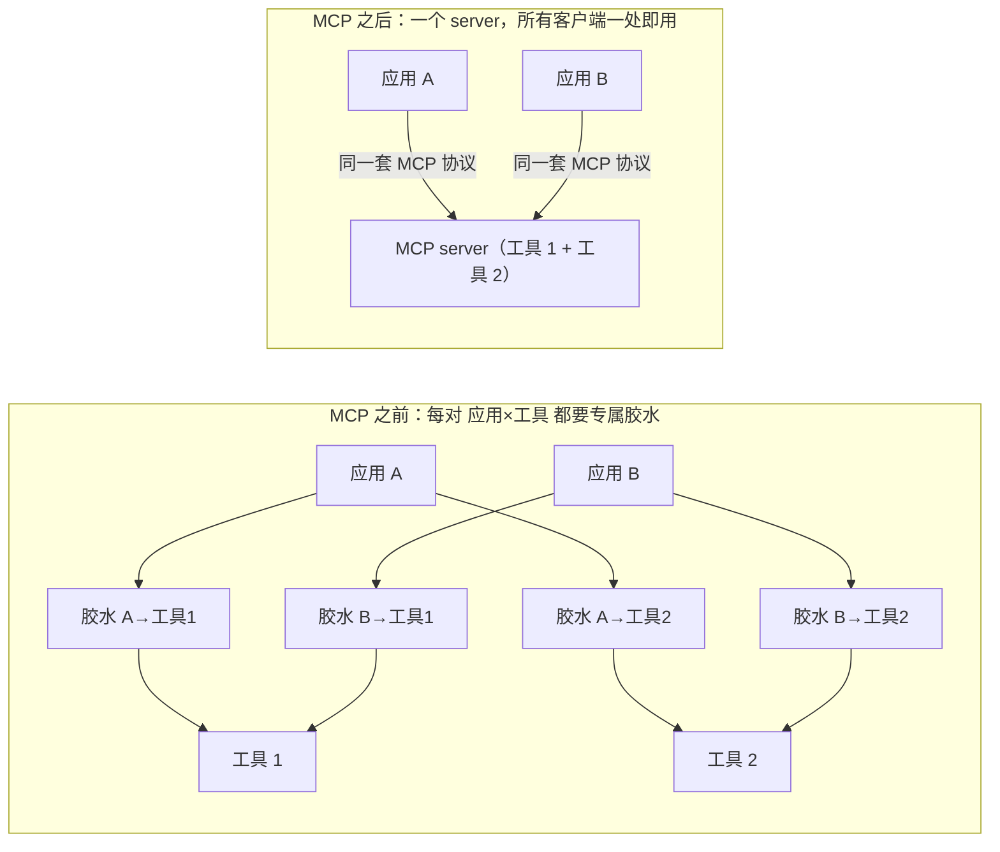
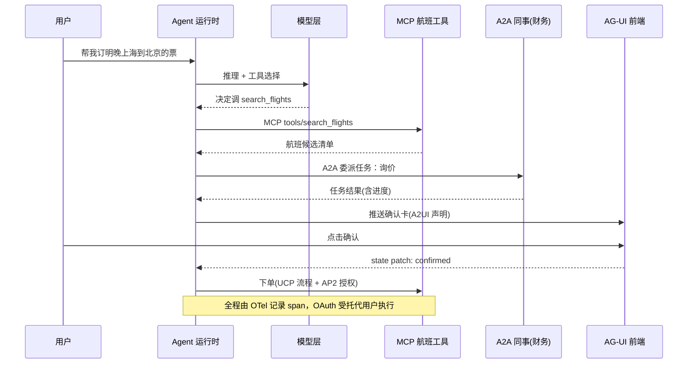
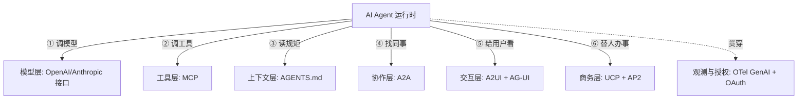
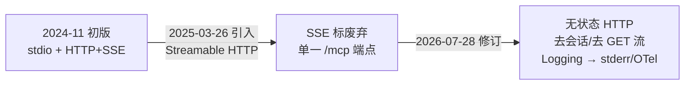

**TL;DR：** 你听说的"协议大战"是个错觉。2024 年 11 月只有 MCP 一个协议；到 2026 年 8 月，它是一张**七层协议栈**：**模型层**（OpenAI Responses / Chat Completions、Anthropic Messages）、**工具层**（MCP）、**上下文层**（AGENTS.md）、**协作层**（A2A）、**交互层**（A2UI + AG-UI）、**商务层**（UCP + AP2）、**观测与授权层**（OpenTelemetry GenAI + OAuth）。每一层锁住 agent 与世界之间的一条接缝，可以叠加、不可互替。最常弄错的三件事：**MCP 是 agent↔工具，不是 agent↔agent**；缩写 **ACP 至少有三个同名者**；所谓"统一"是各标准进了同一个基金会（Linux 基金会 AAIF），**不是只剩一个协议**。起步只记一句：**先 MCP，真需要跨框架委派时再加 A2A，做交互产品再上 AG-UI。**

## 一、先纠正一个误读：从来没有"唯一的 Agent 协议"

凡在 2025 年刷过技术新闻的人，张口就能说"AI Agent 用 MCP"。这个结论只对了一半——MCP 只覆盖了 agent 通往**工具**的那一条缝。

一个 agent 反复执行"观察 → 决策 → 行动"，每向外迈一步，就触碰一条不同的**接缝**：调模型、用工具、读项目规矩、跟别的 agent 协作、把输出渲染给用户看、替用户下单付钱、被观测审计。**几乎每条接缝都长出了自己的协议。** 所以 2026 年真正该问的不是"MCP 好还是 A2A 好"，而是：**这些协议各锁住哪条缝、我需不需要、从哪一层开始。**

一个一手证据先收下：**你正在读的这篇文章，本身就是这句话的实例**——它由一个读 AGENTS.md 的 agent 编写，靠 MCP 与 Skills 调用工具，写完后再按 AGENTS.md 里的写作守则自查。第五节末尾再回来细看它。

## 二、先把协议认到层：一张总表

| 层 | 协议 | agent 的对面是谁 | 锁住的缝 | 归属与状态 |
| :--- | :--- | :--- | :--- | :--- |
| 模型 | OpenAI Responses / Chat Completions；Anthropic Messages | 推理模型 | agent↔模型 | 厂商自有接口；OpenAI 新项目推荐 Responses |
| 工具/数据 | MCP | 工具服务、数据库、外部 API | agent↔工具 | Anthropic 提出（2024-11），已捐 Linux 基金会 |
| 上下文 | AGENTS.md | 仓库、协作规则 | agent↔项目 | OpenAI 提出（2025-08），AAIF 托管 |
| 协作 | A2A | 别的 agent | agent↔agent | Google 提出（2025-04），LF 治理，v1.0（2026-03） |
| 交互 | A2UI + AG-UI | 用户前端 | agent↔界面 | A2UI 是 Google；AG-UI 源自 Vercel、CopilotKit 维护 |
| 商务 | UCP + AP2 | 购物流程、收单方 | agent↔商家/支付 | Google + Shopify 等；AP2 有卡组织参与 |
| 观测/授权 | OpenTelemetry GenAI、OAuth | 追踪与鉴权 | agent↔观测/权限 | OTel 开源；OAuth 行业标准 |

**记忆法**：下面三层管"它能干什么、守什么规矩"，上面三层管"它跟谁协作、被谁看见、替谁付钱"，观测与授权是贯穿全栈的横线。

## 三、自下而上：七层怎么一层层长出来的

### 1. 模型层：接口也算协议——只是"事实标准"而非"标准化协议"

大部分人从 MCP 讲起，但最基层其实是**各家的模型 API**：

- **OpenAI Chat Completions（`/v1/chat/completions`）**：从 2023 年就是事实上的最低公分母，vLLM、Ollama、OpenRouter、LiteLLM 和几乎所有云网关都兼容它。
- **OpenAI Responses API**：2025-03 推出，内置工具调用、文件搜索、远程 MCP 等 agent 能力，官方推荐新项目优先用它；Chat Completions 仍受支持但不再是新项目首选。旧封装 **Assistants API** 已于 2026-08-26 下线。
- **Anthropic Messages API**：另一套主流接口，以 tool use 见长。

所以"模型 API 算不算协议"：**算，但要区分两种协议**——它是**事实标准**（没有标准组织，靠生态自认的公约），而 MCP、A2A 是**有规范文档、有治理方的标准**。换模型只动一行的原因，不是存在某个官方协议，而是所有网关把最低公分母做成了 OpenAI 兼容。

### 2. 工具层：MCP 把 N×M 的接线压成 N+M

MCP（Model Context Protocol）被反复称作"AI 的 USB-C"，但它只是一层：**agent 与工具/数据之间**的接缝。

- 对话格式：JSON-RPC 2.0。
- 传输：**stdio（本机进程）或 Streamable HTTP（远端）**——这里有一个 2025–2026 刚发生的重要演替，详见第五节澄清四。
- 三个原语：**tools**（可调用的动作）、**resources**（可读取的数据）、**prompts**（可复用的模板）。

它解决什么问题：MCP 之前，每个 AI 应用 × 每个数据源都要写专属胶水，复杂度是 N×M 矩阵；MCP 把世界拆成"一个工具一个 server"，任何宿主（Cursor、Copilot、ChatGPT、Claude 等）只要会 MCP 就能调任意 server，降为 N+M。这也是它被全线采纳的原因：OpenAI、Google、Microsoft、AWS、Snowflake、Salesforce 都原生支持；公开 server 约上万个，SDK 月下载量约 9700 万（2026 初口径）。

上面左半是 N×M 条胶水，右半是 N+M 个接口——MCP 值钱的地方不在协议优雅，在把这张图的边数砍掉一大半。

### 3. 上下文层：AGENTS.md——"不是接口，是一条规矩"

如果 MCP 是 agent 的"手"，AGENTS.md 就是 agent 的"纪律"：仓库根目录一份普通 Markdown，告诉来访的 agent 构建命令、测试命令、风格公约、禁改目录。OpenAI 于 2025-08 提出，2025-12 捐给 Linux 基金会新设的 AAIF。

它凭什么也算"协议"：**协议的最小形态是双方约定**。AGENTS.md 把"怎么构建、怎么测试、遵守什么风格"做成可读、跨工具生效的文件惯例——Codex、Cursor、GitHub Copilot、VS Code、Jules 等 20+ 工具原生读取，GitHub 上采用量 60,000+（约）。没有 DSL、没有 schema，正因为普通，才被普遍采纳。

（它常和 Anthropic 的 CLAUDE.md 混谈：Claude Code 的原生记忆文件是 CLAUDE.md；Claude Code 官方口径**不直接读 AGENTS.md**，建议用 `@AGENTS.md` 导入或软链。写仓库版本时，要确认你的 agent 认哪个文件。）

### 4. 协作层：A2A——"peer，不是 tool"

MCP 接 agent↔工具；**agent 与 agent 之间**的缝由 A2A（Agent2Agent）接住：Google 2025-04 提出，2025-06 捐给 Linux 基金会治理，2026-03 出 v1.0，约 150 家组织公开支持。核心是一个"不透明对等体"模型：

- 每个 agent 发布一张 **Agent Card**（惯例在 `/.well-known/agent-card.json`），声明自己提供什么能力、要什么认证，**不暴露内部实现**。
- 双方以**任务**为单位协作，任务是显式状态机：`submitted → working → input-required → completed / failed / canceled`；长任务支持进度回传与流式结果。
- v1.0 把核心放在**无状态的普通 HTTP** 上，能被负载均衡和标准网关直接承接。

**为什么 MCP 与 A2A 无法互替**：MCP 的语义是"我的工具，听我调"；A2A 的语义是"我们各自自治，互相委派有生命周期的任务"。同一个系统里，子 agent 之间用 A2A、子 agent 对专属工具用 MCP，是常见组合，不是二选一。

### 5. 交互层：A2UI 与 AG-UI——"渲染什么"和"怎么送"

用户界面的缝被拆成两半，两个协议：

- **A2UI（Agent-to-User Interface，Google，v0.8 预览）**：声明式 UI 约定。定义 18 个**安全原语**（TextField、Button、Chart、Card 等），agent 只声明"我要一个填写表单"，**不执行任意代码**；宿主端按本应用原生组件渲染。
- **AG-UI（Agent-User Interaction）**：传输层，源自 Vercel AI SDK，现由 CopilotKit 维护。定义**类型化事件集**（message / tool call / state patch / lifecycle），经 SSE 流式推给前端，支持双向——用户的"确认 / 取消"能回写 agent。

分工一句话：**A2UI 决定"屏幕上呈现什么"，AG-UI 决定"这些呈现怎么实时送过去"。**

### 6. 商务层：UCP 与 AP2——替人做事之前，先替钱立规则

agent 开始替人下订单时，真正的问题不是"模型会不会"，而是"**谁授权了这笔钱**"。这一层的两个协议：

- **UCP（Universal Commerce Protocol，Google + Shopify/Walmart 等）**：把"发现 → 购物车 → 结算"标准化成一条流程，agent 可以跨商家走同一套。
- **AP2（Agent Payments Protocol，Google 与多家卡组织）**：给"替付"加**加密授权**：以 Intent（要做什么）、Cart（形成购物车）、Payment（实际支付）三类授权令限定 agent 能买什么、上限多少，让无人在场的支付可追溯、不可抵赖。

这是"agent 商务信任"的地基，也是它独立成层的原因。

### 7. 观测与授权层：贯穿七层的横线

最后不是一条新协议，是给全程兜底的两根"横杆"：

- **OpenTelemetry GenAI 语义约定**：把 LLM 调用、工具调用、token 用量统一成 span/attribute，让 agent 像微服务一样能被追踪观测——跨 MCP、A2A 的整条链路可回放。
- **OAuth 委托授权**：用户先把授权交给 agent，agent 携带凭证代用户调 MCP server 或 A2A 服务；这也是 MCP 生态当前默认收敛的安全方向。

这层不常出现在"协议 PK"海报上，但没有它，每多一层接缝就多一份越权风险——企业上线 agent 的第一道坎，通常就在这里。

把七层叠进一次真实任务：订票 agent 帮用户订一张票，各层各显身手——模型层做推理与工具选择、MCP 查航班、A2A 委托财务 agent 询价、交互层把确认卡推给用户并接受确认、商务层替付、最顶上 OTel 全程留痕：

把它当成一张"接缝速查图"：每一个箭头走的是哪一层协议，就是这张栈在这一条的答案。

## 四、把"卖什么"排成一张能作决定的表

| 层 | 协议 | 核心承诺 | 缺了它会发生什么 |
| :--- | :--- | :--- | :--- |
| 模型 | OpenAI 接口等 | 换模型/网关只改一行 | 各家各格式，迁移成本高 |
| 工具 | MCP | 一个 server，全客户端可用 | 每应用 × 每数据源写胶水（N×M） |
| 上下文 | AGENTS.md | 一份规矩，多 agent 生效 | 每工具各一份，换 agent 行为漂移 |
| 协作 | A2A | agent 可对等委派、可追踪 | 手写 agent↔agent 粘合，断了无责 |
| 交互 | A2UI + AG-UI | 界面可声明、事件可流式 | 每页手写聊天前端，无状态同步 |
| 商务 | UCP + AP2 | 行动有流程、付账有签名 | agent 乱下单，无人可追责 |
| 观测 | OTel + OAuth | 跨接缝可回放、权限可委托 | 出事了查不出是哪一步、谁授权的 |

## 五、事实澄清：最容易弄错的四件事

### 澄清一：MCP 是"agent↔工具"，不是"agent↔agent"

最普遍的一个错。MCP 的谈话双方是 host（agent/应用）与一个为它提供工具/数据的 server。要把任务交给另一个独立 agent，是 A2A 的地盘。**记忆**：MCP = "我的手"，A2A = "我的同事"。同一个 agent 可以同时用两者。

### 澄清二："ACP" 至少有三个同名者

| 名字 | 全称 | 谈话对象 | 现状 |
| :--- | :--- | :--- | :--- |
| ACP | Agent Client Protocol | agent↔编辑器 | 由 Zed 推动，IDE 生态 |
| ACP | Agent Communication Protocol | agent↔agent | 已并入 A2A |
| ACP | Agentic Commerce Protocol | agent↔结账 | OpenAI 面向电商 |

读任何"ACP"之前，先问它的对面是谁。

### 澄清三："统一" = 进了同一把伞，不是"只剩一个协议"

2025-12 月，Linux 基金会成立 AAIF（Agentic AI Foundation）：Anthropic 捐 MCP、OpenAI 捐 AGENTS.md、Block 捐 goose，A2A 与 AGENTS.md 都归入 Linux 基金会治理。**注意**：这是"各标准进了同一把伞"，**不是两个标准合并成一个**。协议仍各自独立声明、并存、配合——MCP 管工具、A2A 管 agent 间、AGENTS.md 管规矩。"统一"发生在治理层，不在协议层。

### 澄清四：MCP 的传输层这两年"切"了几回（时效事实）

- **2024-11**（最初规范）：只有 **stdio** 和 **HTTP+SSE** 两种传输。
- **2025-03-26**（规范修订）：引入 **Streamable HTTP**（单一 `/mcp` 端点）取代 HTTP+SSE，后者随即标为 **deprecated**。
- **2026-07-28**（最新修订）：Streamable HTTP 进一步去状态——**移除协议级会话（sessionId）与独立 GET 流端点**，变为无状态 HTTP：一次请求一问、可水平伸缩；同时把 Logging 原语改为由 stderr / OpenTelemetry 承担。

演化一目了然：

所以"MCP 又切回 HTTP"的说法对，但要说完整：不是退回老 SSE，而是**远端传输一律 Streamable HTTP，且已无状态化**。写新远程 server 直接走 stdio（本机）或 Streamable HTTP，不要再用已废弃的 HTTP+SSE。

## 六、从哪一层起步？（按需叠加，不是选一个）

1. **先上 MCP**：只要你的应用需要 agent 接到真实工具/数据，第一层就值得。生态最全、生产可用度最高、最容易交付。
2. **再加 A2A，且只在"越界"时**：单 agent、或内部 function call 能完成的场景，不要上 A2A——它的成本（Agent Card、任务状态机、认证）不便宜。等真正出现"另一个团队/供应商控制的 agent，我要正式委派任务"时再引入。
3. **交互层按需**：做聊天类产品、需要流式与用户确认时，加 AG-UI；需要动态表单再考虑 A2UI。
4. **商务层**：除非真做 agent 下单，否则不碰 UCP/AP2。
5. **观测与授权**：从第一天就要有，它不是"选不选"，是"任何一层上线前的地基"。

## 七、结论与下一步

**结论**：AI Agent 没有"一个协议"，是一张**七层协议栈**；关键不是背缩写，而是认准**每层锁住的缝**：模型、工具、上下文、agent 间、界面、钱、观测。所谓"协议战争"在 2026 年已收敛为"同一把伞下的分层协作"，对开发者的意义是：**胶水被标准化了，价值回到业务与权限**。记住三句就够了：MCP 是手，A2A 是同事，AGENTS.md 是规矩。

**下一步（约一小时可复现）**：
1. 给自己的仓库加一页 AGENTS.md（构建命令、测试命令、风格公约各一行），用两个不同的 agent 跑同一任务，观察行为是否一致。
2. 用 SDK 写一个约 12 行的最小 MCP server（暴露一个 get_time 工具），分别用 stdio 与 Streamable HTTP 各连一次，体会"一次写 server、处处可用"。
3. 若做多 agent 系统，抓一份真实 Agent Card（`GET https://某服务/.well-known/agent-card.json`），看它如何描述能力与认证。
4. 写代码前，翻对应协议的官方 spec 与 changelog——本文澄清四已演示：这类事实更新快，以 spec 版本号为准。

## 参考资料
1. Model Context Protocol 官方规范（传输、Streamable HTTP）：https://modelcontextprotocol.io/
2. MCP 规范变更（2026-07-28 修订）：https://github.com/modelcontextprotocol/modelcontextprotocol
3. A2A 规范与 Agent Card：https://a2a-protocol.org/
4. AGENTS.md 公约与工具清单：https://agents.md/
5. AG-UI 事件规格：https://docs.ag-ui.com/
6. AAIF / Linux Foundation 成立公告：https://www.linuxfoundation.org/press/linux-foundation-announces-the-formation-of-the-agentic-ai-foundation
7. OpenAI 开发文档（Responses 迁移、Assistants 下线）：https://developers.openai.com/api/docs/guides/migrate-to-responses
8. OpenTelemetry GenAI 语义约定：https://opentelemetry.io/docs/specs/semconv/gen-ai/
9. OWASP Top 10 for Agentic Applications（2026）

> 延伸阅读：一次请求从用户走到模型与工具的一生，见[AI 后端没有魔法](/writing/ai-backend-no-magic)；跨系统把一次调用变成一条可追踪链路，见[分布式追踪与 OpenTelemetry](/writing/distributed-tracing-otel)；协议栈思维在 HTTP 缓存上同样的一笔账，见[HTTP 缓存控制与 ETag](/writing/http-cache-control-etag)。