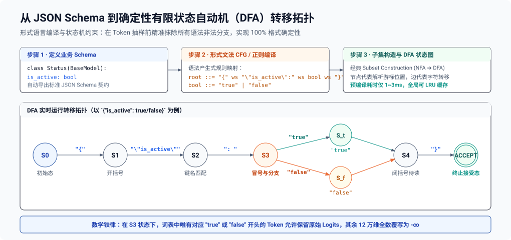
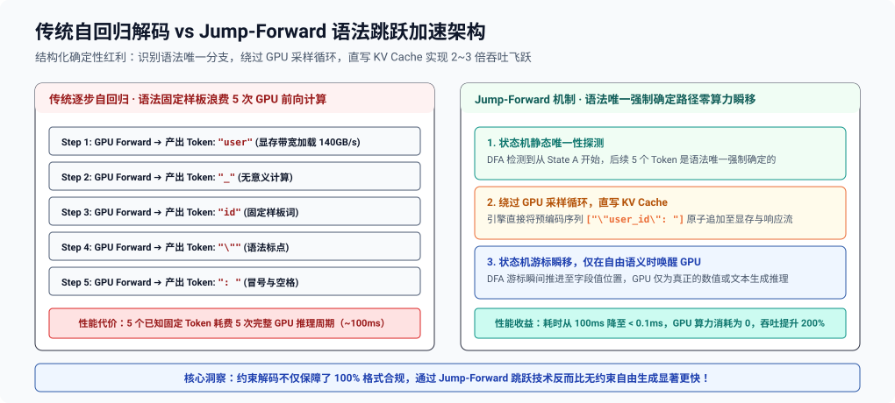
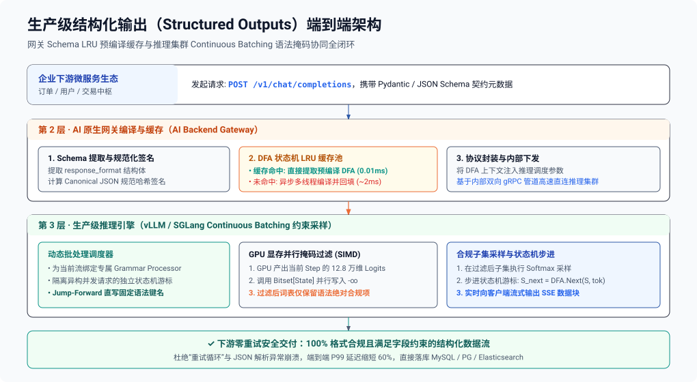

**TL;DR：** 在传统后端微服务体系中，服务间契约由强类型协议（Protobuf、JSON Schema、OpenAPI）严格守护。然而，当后端系统引入大语言模型（LLM）作为处理复杂非结构化意图的决策节点时，传统的契约体系面临灭顶之灾：自回归 LLM 本质上是基于词表概率分布的随机采样器，无论在 System Prompt 中如何声嘶力竭地强调“*必须严格输出合法 JSON，禁止包含 Markdown 代码块与废话*”，在温度系数 $T > 0$ 与海量并发调用下，输出被截断、字段缺失、多出尾部逗号（Trailing Comma）或格式幻觉的概率**在数学上永远无法降为零**。生产级后端的破局之道，是将治理从“后置补救”推向前置的**受限解码（Constrained Decoding / Structured Outputs）**：将后端的 JSON Schema 或文法直接在内存中编译为**确定性有限状态自动机（DFA / FSM）**；在 GPU 生成每个 Token 的微秒级采样间隙，遍历词表并**将所有不满足当前状态合法转移的 Token 的 Logits 强行置为 $-\infty$**，从概率空间中彻底抹除非法可能，实现 $100\%$ 的格式合规、零解析报错与零重试开销。

> [!NOTE] 架构定位
> 本文属于 **《面向后端工程师的 AI 架构与工程实战》** 系列核心篇目。
> - **所属层级**：**第二层：契约保障与受限输出层 (Contracts & Constrained Decoding)**
> - **全局坐标**：上承传输接入网关，下接业务微服务强类型契约，从词表概率空间彻底切断格式幻觉。全景架构蓝图与因果链路详见专栏总纲：[《面向后端工程师的 AI 架构总纲：破除无头苍蝇困境的五层生产级心智模型》](/writing/ai-backend-00-architecture-blueprint)。

---

## 一、生产之痛：为什么提示词工程与 JSON 修补在后端必然覆灭？

### 1.1 大模型概率采样的物理本质

在 Transformer 自回归生成阶段，第 $t$ 步的输出并非直接产出文字，而是经过线性层输出一个覆盖全词表（Vocabulary，现代主流模型如 LLaMA-3、Qwen、DeepSeek 词表大小 $V \ge 128,000$）的未归一化对数概率向量：

$$\mathbf{z}_t \in \mathbb{R}^{V}$$

通过 Softmax 函数将 Logits 转换为概率分布：

$$P(w_t = v \mid w_{<t}) = \frac{\exp(z_{t, v} / T)}{\sum_{j=1}^{V} \exp(z_{t, j} / T)}$$

其中 $T$ 为温度参数（Temperature）。

> [!WARNING] 自由采样的概率论缺陷
> 历史上下文 $w_{<t}$ $\to$ Transformer 注意力计算 $\to$ 线性层 Logits $\mathbf{z}_t \in \mathbb{R}^{128,000}$ $\to$ $\text{Softmax}(\mathbf{z}_t / T)$
> - 在多项式采样（Multinomial Sampling）中，哪怕非法字符仅有 $0.1\%$ 的尾部微弱概率，在连续长序列生成下也会被不可避免地抽中；
> - 典型故障：模型突发吐出开场客套话（`"Sure! Here is your JSON:"`）、包裹 Markdown 标记（` ```json `）、或尾部多余逗号破坏结构。

#### 后端工程师面对的数学现实：
假设某模型生成合法 JSON 字符的单步概率高达 $99.9\%$。对于一个包含 500 个 Token 的复杂结构化输出，**整段 JSON 毫无语法错误的综合概率仅为**：

$$P_{\text{success}} = (0.999)^{500} \approx 60.6\%$$

**这意味着有接近 $40\%$ 的线上请求会由于偶发抽中非法 Token 而导致后端 `json.Unmarshal()` 或 `JSON.parse()` 抛出异常崩溃！**

### 1.2 工业界三大过渡方案的致命缺陷

在受限解码技术成熟前，业界曾尝试过三种妥协方案，但均无法作为后端生产级的坚固基石：

| 方案类别 | 核心机制 | 核心缺陷与工程瓶颈 | 生产可用性 (SLA) |
| :--- | :--- | :--- | :--- |
| **提示词工程 + 失败重试** | 注入强提示：`"Output valid JSON only. No markdown."`，解析报错时重新请求大模型 | **纯概率黑盒**：无法提供确定性保障；线上 P99 延迟由于重试恶化数倍，Token 成本成倍浪费 | ❌ 不可用（偶发 40% 格式击穿） |
| **后置正则修补 (JSON Repair)** | 利用开源库（如 `json_repair`）基于正则与启发式状态机补全缺失括号或截断前缀 | **治标不治本**：仅能挽救基础括号闭合，**无法约束字段类型与语义契约**（如必填 key 缺失、类型被篡改、枚举越界） | ⚠️ 勉强可用（业务层依然崩溃） |
| **早期 Function Calling 微调** | 依赖模型预训练时对特定工具调用特殊 Token（如 `<tool_call>`）的拟合 | **依然属于概率学软约束**：在超长上下文或深度嵌套复杂 Schema 下，仍然存在不可控的幻觉越界 | ⚠️ 部分场景可用（无法做到 100%） |

---

## 二、第一性原理：受限解码（Constrained Decoding）架构解密

以 **Outlines（Willard & Louf, 2023）**、**Guidance（Microsoft）**、**vLLM** 以及 **OpenAI Structured Outputs（2024）** 为代表的技术，将受限逻辑直接注入到了**大模型解码采样循环（Sampling Loop）的核心内核中**。

### 2.1 动态 Logits 掩码（Dynamic Logits Masking）数学模型

受限解码不再把模型当成黑盒，而是在 Softmax 采样执行之前的纳秒级瞬间，引入一个**布尔掩码向量（Boolean Mask Vector）**：

$$\mathbf{m}_t \in \{-\infty, 0\}^{V}$$

定义文法状态机当前所处状态为 $S_t$，词表为 $\mathcal{V}$。
若词表中的某个 Token $v \in \mathcal{V}$ 拼接到当前已生成的前缀后，**完全符合预定义的文法规范**，则允许其被采样；否则，将其 Logits 强行置为 $-\infty$：

$$m_{t, v} = \begin{cases} 0, & \text{若 } \delta(S_t, v) \text{ 合法} \\ -\infty, & \text{若 } \delta(S_t, v) \text{ 非法} \end{cases}$$

修正后的条件概率分布为：

$$P_{\text{constrained}}(w_t = v \mid w_{<t}) = \frac{\exp\left((z_{t, v} + m_{t, v}) / T\right)}{\sum_{j=1}^{V} \exp\left((z_{t, j} + m_{t, j}) / T\right)}$$

##### 原始未受限 Logits 采样分布（存在 19.8% 破防风险）

| Token ID | Token 内容 | 原始未归一化 Logits $z_i$ | 原始采样概率 $P(w_t)$ | 合法性判定与潜在风险 |
| :--- | :--- | :--- | :--- | :--- |
| `#1024` | `"{"` | 12.5 | 80.2% | ✓ 语法合法起始符 |
| `#2048` | `"Sure"` | 11.2 | 15.1% | ✗ **非法 Token**（客套废话破坏 JSON 边界） |
| `#3096` | `"```"` | 9.8 | 4.7% | ✗ **非法 Token**（嵌套 Markdown 围栏导致解析崩溃） |

##### 应用文法状态机掩码（Grammar Masking）强制置零

状态机检测到当前处于根节点 `INITIAL` 状态，唯一合法的后续字符为 `"{"`。引擎在 Softmax 计算前注入掩码向量 $m_{t, v}$：

$$z'_{t, v} = \begin{cases} z_{t, v}, & \text{若 } v \in \mathcal{V}_{\text{valid}} \\ -\infty, & \text{若 } v \notin \mathcal{V}_{\text{valid}} \end{cases}$$

##### 修正后受限 Logits 与重整化概率分布

| Token ID | Token 内容 | 修正后 Logits $z'_i$ | 最终归一化采样概率 $P_{\text{constrained}}$ | 采样裁决 |
| :--- | :--- | :--- | :--- | :--- |
| `#1024` | `"{"` | 12.5 | **100.0%** | **绝对命中合规 Token** |
| `#2048` | `"Sure"` | $-\infty$ | **0.0%** | 物理抹除（概率归零） |
| `#3096` | `"```"` | $-\infty$ | **0.0%** | 物理抹除（概率归零） |

**数学结论：在受限解码下，非法 Token 的采样概率被严格清零。模型在每一步被“强迫”只能在语法合法的候选词集合中进行注意力权重分配，从而实现 100% 格式确定性！**

---

## 三、编译流水线：从 JSON Schema 到确定性有限状态自动机（DFA）

为什么不能简单地用正则表达式实时匹配？
因为大模型词表中每个 Token 是一个由多字符组成的“碎片（Sub-word）”，每次生成一个 Token 都对全局执行正则匹配会引发 $O(N \cdot |\text{Regex}|)$ 的巨大 CPU 延迟。

工业级方案采用**编译期离线构造状态机**：



- 当自动机处于 **State 3**（读取了冒号 `:`）时：
  合法的前驱字符只能是空白符 ` `、`t`（准备拼写 `true`）或 `f`（准备拼写 `false`）；
  **任何以字母 `a`、数字 `1`、引号 `"` 开头的 Token，在 State 3 处均无有效转移边，立即被掩码拦截！**

---

## 四、核心算法：分词跨边界问题与前缀树（Trie）微秒级索引

在理论上，状态机处理的是单个**字符（Character）**。
然而，现代大模型的分词器（Tokenizer，如 BPE、WordPiece）操作的最小单位是**词元（Token）**。一个 Token 往往跨越了多个字符，甚至跨越了 JSON 的语法边界！

### 4.1 BPE 分词跨边界陷阱（The Token Boundary Problem）

考虑词表中的这三个真实 Token：
1. `Token A = 'true'`（4个字符合为一词）
2. `Token B = 'true}'`（兼具值与闭合大括号）
3. `Token C = ',\n  "role":'`（包含了逗号、换行、缩进、字段名与冒号）

如果状态机每次只匹配单个字符，面对 `Token B = 'true}'`，模型需要连续穿透多个状态。

- **常规逐字符驱动匹配（低效瓶颈）**：
  Token `'true}'` 必须拆解为 `'t' \to \text{State 4} \to 'r' \to \text{State 5} \to 'u' \to \text{State 6} \to 'e' \to \text{State 11} \to '\}' \to \text{State 12}`；
- **词表前缀树（Vocabulary Trie）离线预建索引**：
  在词表加载时对全部 128,000 个 Token 预先构建 Trie 树，预计算每个 Token 的连续状态转移序列 $\delta^*(S, \text{Token})$。

### 4.2 词表前缀索引与预计算位图（Pre-computed Bitsets）

Outlines 与 XGrammar 采用了颠覆性的预计算算法：**将词表映射到 DFA 状态的倒排索引（Inverted Index）**。

| DFA 状态 ID | 合法 Token 稀疏位图（Allowed Token Bitmask） | 寻址与执行时序 |
| :--- | :--- | :--- |
| `State 0` | `[Token #123 "{", Token #456 "{\n", Token #789 " {\""]` | $O(1)$ 内存寻址（$< 5\mu\text{s}$） |
| `State 3` | `[Token #11 " true", Token #12 " false", Token #13 " t"]` | $O(1)$ 内存寻址（$< 5\mu\text{s}$） |
| `State 11` | `[Token #99 "}", Token #100 "}\n", Token #101 " }"]` | $O(1)$ 内存寻址（$< 5\mu\text{s}$） |

> [!TIP] SIMD / AVX-512 并行掩码下发
> 当推理步进至 `State 3` 时，直接提取预计算好的 `Bitset[3]`，通过 GPU 显存广播指令或 CPU AVX-512 指令集，并行将非法索引的 Logits 快速刷写为 $-\infty$。

#### 性能突破：
通过在模型启动或任务编译阶段一次性完成 Trie 与状态机求交，在生成每个 Token 时，**查找合法 Token 集合的时间复杂度降为纯粹的 $O(1)$ 表查找**，将受限解码引入的 CPU 额外开销压制在 **$10\mu\text{s}$ 以内**，对总首字时延（TTFB）与生成速率（TPS）的影响小于 $3\%$！

---

## 五、极致吞吐优化：静态前缀跳跃（Jump-Forward / Speculative Inlining）

受限解码不仅能带来 100% 的格式确定性，还能带来一个让后端工程师极其惊喜的副作用：**大幅提升推理速度、节约 GPU 算力！**

### 5.1 为什么还要让 GPU 去“计算”已知的固定字符串？

观察一段典型的 JSON 输出结构：
```json
{
  "code": 200,
  "message": "success",
  "data": { ... }
}
```
在这段文本中：
`{\n  "code": `、`,\n  "message": "`、`",\n  "data": `
这些模板字符是由 JSON Schema **唯一确定、毫无悬念的固定前缀**！
在传统无受限推理中，GPU 必须像对待真实生成内容一样，执行数十次耗时的自回归 Forward 前向计算，把算力浪费在预测已知字符上。

### 5.2 静态前缀直接插入（Jump-Forward Engine）

在现代优化引擎中，DFA 能够识别出**单一后继确定性转移路径（Deterministic Linear Path）**：



#### 工业收益实测：
对于字段名较多、嵌套结构深的微服务数据对象，**Jump-Forward 机制能将整体生成的 Token 总计算量减少 $30\% \sim 50\%$，端到端吞吐量（Tokens per Second）提升近一倍**！

---

## 六、生产级端到端落地架构与代码实战

### 6.1 企业级 AI 网关受限解码全景拓扑



### 6.2 基于 Python + Outlines 的生产级微服务代码实战

以下展示如何在后端工程中，利用 Pydantic 强类型模型驱动大模型受限输出：

```python
from enum import Enum
from typing import List, Optional
from pydantic import BaseModel, Field
import outlines
from transformers import AutoModelForCausalLM, AutoTokenizer

# 1. 后端强契约定义 (严格的类型系统)
class SeverityLevel(str, Enum):
    LOW = "low"
    MEDIUM = "medium"
    HIGH = "high"
    CRITICAL = "critical"

class SecurityAuditResult(BaseModel):
    vulnerability_found: bool = Field(description="是否检测到安全漏洞")
    cve_id: Optional[str] = Field(default=None, regex=r"^CVE-\d{4}-\d{4,7}$", description="标准 CVE 编号")
    severity: SeverityLevel
    affected_components: List[str] = Field(min_items=1, description="受影响的模块列表")
    risk_score: float = Field(ge=0.0, le=10.0, description="CVSS 风险评分，范围 0 到 10")

# 2. 加载底层模型与 Outlines 引导生成器
model_name = "Qwen/Qwen2.5-7B-Instruct"
tokenizer = AutoTokenizer.from_pretrained(model_name)
model = AutoModelForCausalLM.from_pretrained(model_name, device_map="auto")

# 3. 核心黑魔法: 将 Pydantic 编译为引导式 JSON 生成器 (内部自动构建 DFA 与 Token 掩码)
generator = outlines.generate.json(model, SecurityAuditResult)

# 4. 执行推理 (即便传入极端恶意/复杂的代码，模型也绝对只能吐出符合该结构的 JSON)
prompt = """
请对以下后端代码进行安全审计：
func HandleUser(w http.ResponseWriter, r *http.Request) {
    db.Exec("SELECT * FROM users WHERE id = " + r.URL.Query().Get("id"))
}
"""

# 5. 秒级获得 100% 合法且强类型的对象实例
result: SecurityAuditResult = generator(prompt, max_tokens=1024, temperature=0.7)

# 后端可以直接安全调用，绝无 KeyError、类型错误或 JSONDecodeError!
print(f"检测状态: {result.vulnerability_found}")
print(f"风险级别: {result.severity.value}")
print(f"受影响组件: {result.affected_components}")
```

---

## 七、高频生产事故与架构避坑指南

### 7.1 死锁陷阱：Schema 存在数学不可达约束（Unsatisfiable Regex）

如果在 Schema 中定义了极其严苛的互斥正则，例如：
`pattern: "^[0-9]{5}$" 且 minLength: 10`
状态机会发现**到达某个节点后，后续所有 Token 的掩码全部为 $-\infty$**（全词表无任何合法 Token 可选）！
- **后果**：采样器陷入死锁，GPU 只能强行抛出 `NoValidTokenException` 异常并中断生成；
- **防范**：在向 API 网关注册 Schema 时，前置运行**静态文法可达性检查器（Grammar Liveness Analyzer）**，杜绝逻辑矛盾的模式入库。

### 7.2 性能陷阱：复杂递归嵌套导致的 DFA 状态爆炸

有限状态自动机（DFA）只擅长处理**正则语言（Regular Language）**。
若业务定义了深层无限递归嵌套的数据结构（例如允许无限包含子节点的 AST 语法树或递归评论树），DFA 的状态节点数量会发生指数级组合爆炸（State Space Explosion），导致编译耗时突破数秒、内存被状态表撑爆。
- **解法**：对于递归结构，采用基于下推自动机（Pushdown Automaton, PDA）的 **上下文无关文法（CFG，如 llama.cpp 的 GBNF）**，利用运行时符号栈（Symbol Stack）代替平铺状态，兼顾内存可控与语法完备。

---

## 八、总结与输出确定性工程演进全景表

| 治理流派 | 传统提示词工程 (Prompting) | 后置修补 (Post-hoc Repair) | 受限解码 (Constrained Decoding) |
| :--- | :--- | :--- | :--- |
| **格式合规率** | 概率学可用 ($85\% \sim 95\%$) | 提升至中等 ($95\% \sim 98\%$) | **数学级绝对确定 ($100.0\%$)** |
| **单次解析开销** | 需完整字符串解析与字段校验 | 需反复正则扫描与字符串替换修复 | **直接对应内存偏移，即时反序列化** |
| **异常处理成本** | 失败触发重试，P99 延迟与成本翻倍 | 无法规避逻辑字段缺失或越界 | **零重试、零异常拦截开销** |
| **首字延迟 (TTFB)**| 无额外系统开销 | 无额外系统开销 | **轻微引入预编译开销（可 LRU 缓存平摊至 $< 10\mu\text{s}$）** |
| **生成吞吐 (TPS)**| 基线吞吐 | 基线吞吐 | **Jump-Forward 机制跳过固定模板，吞吐暴增 $30\% \sim 50\%$** |
| **适用业务级别** | 玩具 Demo、草稿生成 | 低 SLA 离线批量任务 | **高并发金融结算、微服务编排、生产级 Agent 核心决策** |

---

## 参考资料与规范出处

- **Brandon T. Willard & Rémi Louf** (Outlines, 2023) - *Efficient Guided Generation for Large Language Models (DFA Logits Masking)*.
- **OpenAI Engineering Documentation** (2024) - *Introducing Structured Outputs in the API (Formal JSON Schema Constrained Decoding)*.
- **Microsoft Research** - *Guidance: A language for controlling large language models (Grammar-directed generation)*.
- **XGrammar Project** (MLC-LLM & vLLM Ecosystem, 2024) - *Flexible and Efficient Grammar-guided Generation Engine for LLMs*.
- **Georgi Gerganov et al.** (llama.cpp) - *GBNF (GGML BNF) Grammar-Based Constrained Sampling Specification*.
- **John E. Hopcroft & Jeffrey D. Ullman** - *Introduction to Automata Theory, Languages, and Computation (DFA & CFG Foundations)*.
