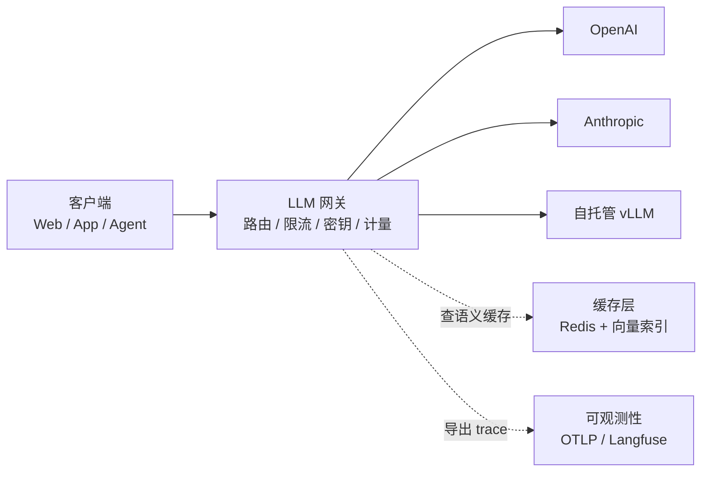
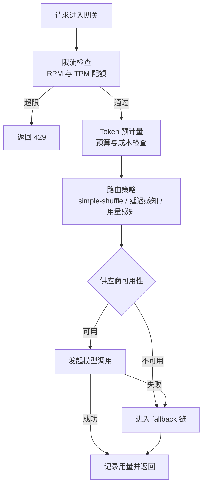
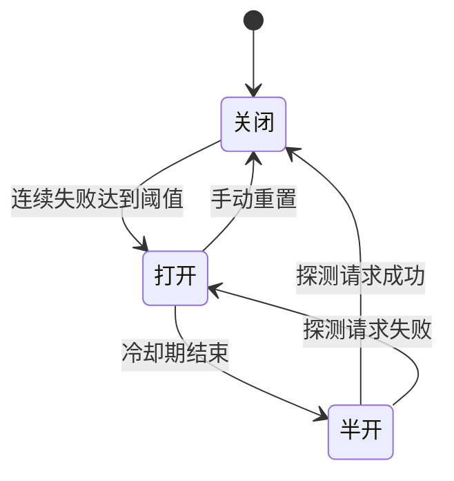
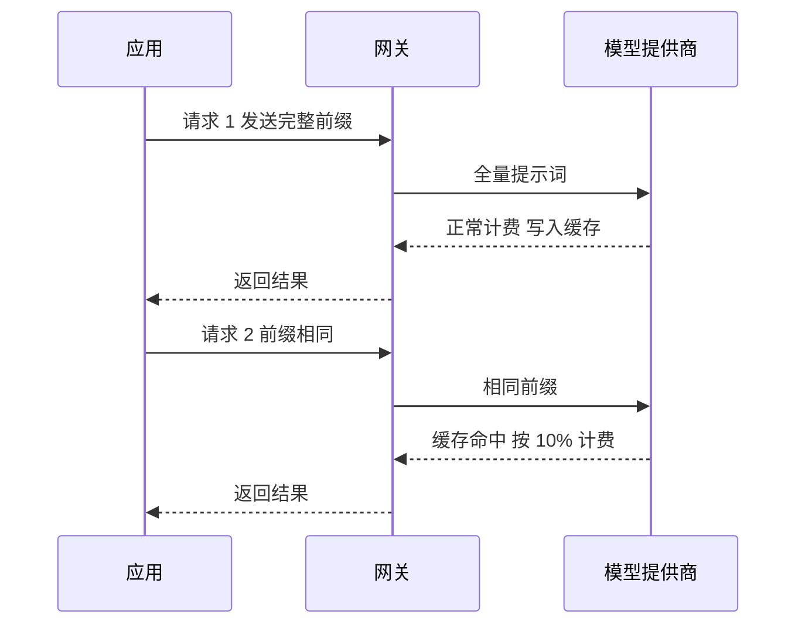
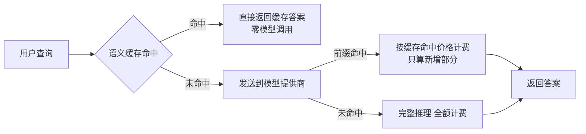
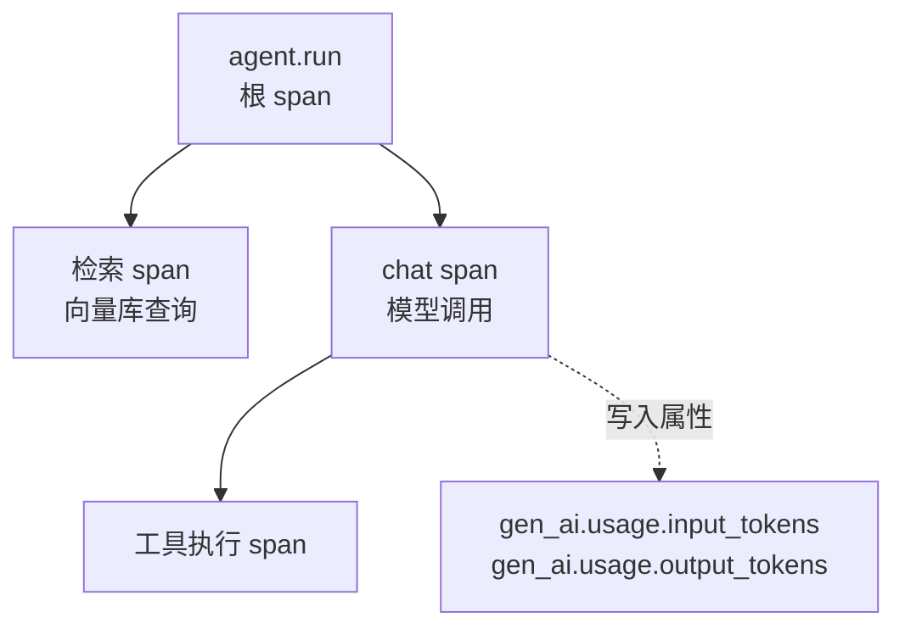
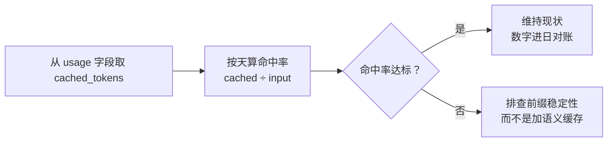
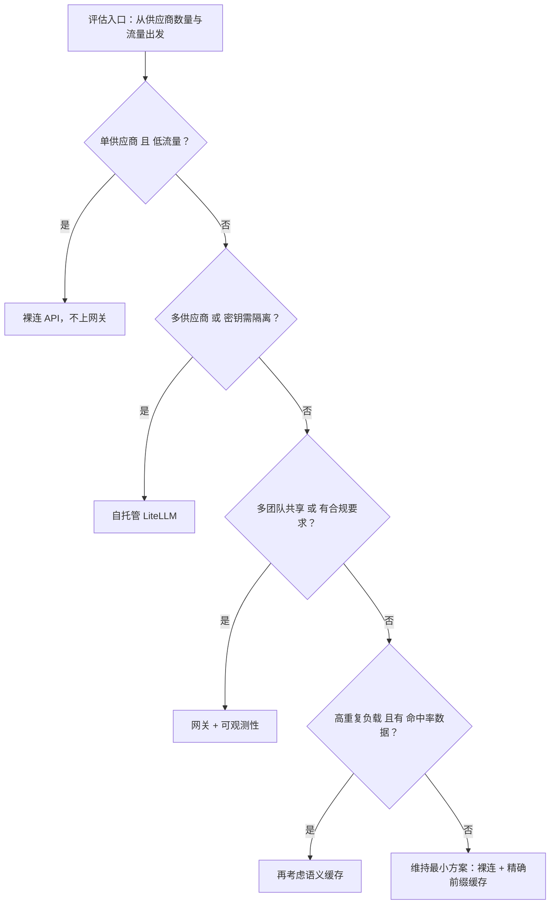

**TL;DR：** AI 应用的后端没有新物种：限流、超时、重试、缓存、计量、可观测性，全是老问题，只是成本高了两个数量级、延迟从毫秒变成了秒。结论：先拿免费的精确前缀缓存，网关与可观测性直接用成熟开源，语义缓存等命中率数据证明之后才值得自建。

## 一、 看起来像魔法，拆开全是老问题

你可能见过这个场面：Agent 的流式回答播到一半，忽然被推翻重来。原因是上游供应商在流式中途失败，fallback 换了一家。看起来像模型在改主意，拆开看是后端的老问题在兜底。

Demo 里的 RAG 应用是魔法：用户问一句，系统从文档库里找出答案，附上引用，几秒内完成。Agent 更夸张，自己决定调哪个工具、试错、重来。第一次见到时，你很难不去想"这后端该有多复杂"。

把链路拆开看，复杂度并没有长在你想的地方。请求进来，先经过一层网关：限流、鉴权、密钥换发、选模型、决定调用哪个供应商；中间是检索、拼 prompt、带着超时与重试去调上游 API；返回后要计量 token、记 trace、算成本；为了压账单，还要在好几层缓存之间做取舍。

这套结构里没有一项是新问题：限流、超时、重试、缓存、计量，每一件都被互联网工程反复解决过二十年以上，只是这次成本高两个数量级，于是每个问题都被放大到不能再忽略。



真正新的是参数：一次模型调用从几十毫秒变成几秒，重试一次的成本从忽略不计变成真金白银，缓存未命中意味着整段预填充重新计费。老问题没有消失，只是账单变大了。重试会放大错误，见[重试会放大一切错误：幂等性工程的完整账本](/writing/idempotency-engineering)。


*图注：同样的问题，不同的数量级——延迟 50ms → 3s（约 60 倍），重试从免费变成整段预填充重新计费。*

## 二、 LLM 网关：老问题，新账单

### 2.1 网关的五项职能：统一 API、密钥隔离、限流、failover、计量

把 2025-2026 年的多份网关资料摆在一起，功能清单几乎没有分歧：统一 API（OpenAI 兼容接口 + 格式翻译）、密钥管理（虚拟密钥与预算隔离）、限流（按 RPM/TPM 配额）、failover（fallback 链 + 熔断）、token 计量与成本追踪。LiteLLM 作为开源网关的事实标准，官方文档里的路由策略就有 simple-shuffle、least-busy、latency-based-routing、usage-based-routing 等多种；当前文档把 fallback 明确分为标准、内容策略、上下文窗口三种类型，2026 年 6 月末发布的 v1.90.0 已覆盖 100+ 供应商。

一个典型的 LiteLLM 网关配置（简化版）长这样：

```yaml
model_list:
  - model_name: gpt-4o
    litellm_params:
      model: openai/gpt-4o
      api_key: os.environ/OPENAI_API_KEY
  - model_name: claude-sonnet
    litellm_params:
      model: anthropic/claude-sonnet-4-5
      api_key: os.environ/ANTHROPIC_API_KEY

router_settings:
  routing_strategy: latency-based-routing
  fallbacks: [{"gpt-4o": ["claude-sonnet"]}]
  allowed_fails: 3
  cooldown_time: 30

litellm_settings:
  success_callback: ["prometheus", "langfuse"]
  failure_callback: ["langfuse"]
```

这份配置同时表达了架构与运维契约：业务代码只认 `gpt-4o` 这个名字，密钥由网关持有，主供应商挂了自动切备选，失败 3 次后冷却 30 秒。业务团队不再需要关心"密钥在谁手里、超限了怎么办、供应商宕机了怎么办"。



路由策略的名字好记，代价函数才难选。策略名背后的差别，其实是三个不同的代价函数：

- **latency-based-routing**：维护每个部署在时间窗口（`routing_strategy_args.ttl`）内的平均响应时间，优先选最快的候选；`lowest_latency_buffer` 把延迟差距小于缓冲比例的部署视为等价，防止流量全部压到当前最快的那一个。它的统计来自真实请求采样——新上线的部署没有历史数据，头几分钟的路由基本是盲选。这就是"探测流量自身的成本"：你要拿一部分请求去喂统计，统计才有意义。
- **usage-based-routing**：每次请求前查 Redis 里各部署的分钟级用量（TPM/RPM 计数），选用量最低的。它把路由决策变成两次 Redis 往返，LiteLLM 官方文档明确写着生产环境不推荐——对高流量网关，路由本身的开销会吃掉它省下的配额。
- **cost-based-routing**：从模型成本表取每 token 单价，选最便宜的部署；成本表里查不到的模型按 $1 兜底。所以它的效果直接取决于成本表维护得勤不勤：供应商改价、缓存命中价引入后，不更新的成本路由会把流量导向账面上的便宜货。

健康窗口也要说清楚：429 响应会让部署立刻进入冷却（默认约 5 秒），一分钟内失败率超过 50% 同样触发冷却。冷却不是惩罚，是给探测让路——把流量从可疑部署上移开，才有机会探明它是否恢复。

failover 链还有一个几乎没人提前算的账：**备选供应商的前缀缓存是冷的**。前缀缓存跟着"哪家收到过这个前缀"走：主供应商的缓存里躺着你的长系统提示，fallback 到备选之后，同样的前缀第一次到达时大概率按全价计费，TTFT 也更差。能做的有限——Anthropic 系可以主动写缓存，OpenAI 系连缓存点都不能指定，只能靠真实流量去"喂"，所以平时把一小部分请求（或专门的金丝雀流量）走到备选，让它的前缀缓存保持温度。fallback 不只是延迟兜底，也是成本兜底。

### 2.2 限流的四种形态：RPM 只是最小的一档

供应商账面上的限流只有 RPM/TPM 两维，网关侧的限流至少有四层：

- **RPM（每分钟请求数）**：最便宜的限流，请求进来先数数。它挡不住"一次请求 10 万 token"这种炸弹。
- **TPM（每分钟 token 数）**：真正卡预算的限流，难点在于输出 token 数是未知数——请求发出前只能用 `max_tokens` 预占，实际消耗要等响应回来才能记账。
- **并发限流**：RPM 允许 1000 次/分钟不代表能同时跑 1000 个流式请求。LiteLLM 的 `max_parallel_requests` 用信号量按住并发，防止突发把供应商的配额一次性烧光。
- **成本限流**：把配额从"次数和 token"换算成钱——按虚拟密钥设 `max_budget`，越界直接拒绝。这是预算的硬闸门，第六节展开。

与 429 打交道的方式也决定成本：供应商的 429 响应通常带 `Retry-After` 头，明说多久之后再来。重试预算要写死：指数退避 + 抖动，最多三次，超过就换供应商而不是换运气。重试会放大错误——同一笔请求在多个供应商之间来回重试，每一跳都是钱，见[重试会放大一切错误：幂等性工程的完整账本](/writing/idempotency-engineering)。

网关侧的实现，令牌桶与滑动窗口都有人用：令牌桶允许短时突发（桶容量 + 匀速补充），滑动窗口限制窗口内的总量、更贴近供应商"每分钟 X 次"的计数语义。对 LLM 网关，TPM 限流天生偏向滑动窗口——它按"窗口内累计 token"计数，而桶模型需要预知每个请求的 token 数，这恰好是未知的。

### 2.3 熔断与 failover：把失败当一等公民

2025 与 2026 年多起已公开复盘的主流模型 API 故障，把"单供应商部署"从便利变成了架构负债。网关因此从可选项变成了基础设施。OpenRouter 的处理方式很有代表性：用健康窗口持续探测，30 秒内把 5xx 的供应商降权，其余流量按成本加权在健康供应商间分配。

熔断器的状态机依然是那个状态机，只是触发条件从"下游 5xx"变成了"模型调用超时或限流"：



注意「半开→关闭」的迁移条件是探测请求成功，不是冷却期结束——探测失败的半开会再次打开，这是熔断器防抖的关键。

这条技术债我提过不止一次：网关把密钥集中起来，同时也把失败集中起来。2026 年 3 月 LiteLLM 曾发生一起 PyPI 供应链投毒事件（v1.82.7/1.82.8 被植入凭据窃取代码，1.83.0 修复），业界多篇复盘都指向同一个教训：网关是密钥所在，必须锁版本、审依赖、当关键路径运维。

网关的边界也在这里：熔断一旦打开，所有流量开始排队或绕行，故障探测的延迟被压到网关自己身上。故障期间，网关本身可能成为新的瓶颈。

### 2.4 请求编排：超时、重试、并行

网关解决的是"调谁"的问题，编排解决的是"怎么调"的问题。RAG 里检索与生成串行不可省，但一次 Agent 任务里常常有多个可以并行的上游调用；超时和重试则从"防御性写法"变成了必要设计。

延迟从 50 毫秒变成 3 秒之后，超时参数直接决定产品形态：给 30 秒还是 60 秒，等于先回答用户愿意等多久。

```typescript
import { sleep, backoff, callProvider } from "./llm-client";

async function callWithFallback(request: ChatRequest, chain: ModelRef[]): Promise<ChatResponse> {
  if (chain.length === 0) throw new Error("empty chain");

  for (let attempt = 0; attempt < chain.length; attempt++) {
    try {
      return await callProvider(chain[attempt], request, {
        // 首跳 30s 快速失败，fallback 多给一倍时间：用户已经在等了
        timeoutMs: attempt === 0 ? 30_000 : 60_000,
      });
    } catch (err) {
      const e = err as { type?: string };
      const retriable = e.type === "rate_limit" || e.type === "timeout" || e.type === "5xx";
      if (!retriable || attempt === chain.length - 1) throw err;
      await sleep(backoff(attempt));
    }
  }

  throw new Error("unreachable");
}
```

还有一个流式特有的坑：流式输出到一半供应商挂了，fallback 到另一家意味着用户已经看到的半个回答会被推倒重来。对工具调用这类解析敏感的输出，宁可关掉流式走完整 fallback，也不要在半路换供应商。

### 2.5 Agent 编排的失败模式：死循环、参数、幂等

Agent 的编排把 2.4 的"一次调用"放大成"一次循环"：模型决定调什么工具，工具结果再喂回模型，直到模型宣布完成。这个循环有三个必须预设的边界：

- **最大迭代次数与预算**：工具循环可能收敛得很慢，也可能根本不收敛——模型在"再试一次"和"换个参数再来"之间打转。给循环设硬上限（比如 10 轮）之外，还要给循环设成本上限：LiteLLM 的 Agent Gateway 支持 `max_iterations` 与 `max_budget_per_session`，会话级预算到点就断。循环的成本不是线性的：越往后每轮塞回的上下文越长，账单涨得越快。
- **工具参数校验**：模型决定调 `transfer(user, amount)` 时，参数是模型生成的。把"让模型返回合法 JSON"当脆弱方案的老规矩在这里加倍成立（见 5.4 结构化输出）：工具入参必须过 schema 校验，失败的调用直接重试，而不是带着坏参数执行。
- **幂等工具调用**：工具调用失败后的重试会重复执行副作用——扣款、发信、改库存都是不可安全重放的。工具必须按幂等工程的标准设计：请求带幂等键，重复的调用要么返回原结果、要么被拒绝，见[重试会放大一切错误：幂等性工程的完整账本](/writing/idempotency-engineering)。

还有一句提醒，关于 prompt injection：Agent 把工具结果塞回上下文的那一刻，工具的返回内容就进入了"指令环境"。把不可信内容与系统指令放在同一层级，等于允许文档指导模型改自己的行为。这不是新问题，只是攻击面从"人给模型提示词"变成了"文档给模型提示词"。

## 三、 缓存：精确前缀缓存免费，语义缓存有条件

### 3.1 第一层：供应商精确前缀缓存

这是 2025-2026 年最被低估的免费午餐，因为两家主要供应商的机制完全不同。

OpenAI 是自动的：gpt-4o 及更新模型默认启用，只要请求前缀（≥1024 token）与之前的请求完全一致，服务端自动命中缓存，无需任何代码改动。折扣随模型而异：官方 cookbook 里 gpt-4o 是 50%，gpt-4.1 是 75%，gpt-5.2 是 90%；官方文档称整体上输入成本最多降 90%、延迟最多降 80%。代价是默认情况下几乎没有可控性：不能指定缓存点、不能预热。

但 2026 年有新变化：GPT-5.6 起支持逐请求指定缓存行为（`prompt_cache_breakpoint` 等），显式缓存写入按 1.25 倍输入价计费、TTL 目前仅 30 分钟；24 小时长留存是 gpt-5.5 及更早模型的 extended caching，别混用。此前的模型仍然完全自动、不可干预。

Anthropic 提供两种模式：在请求顶层加一个 `cache_control` 标记即可启用自动缓存，系统自动决定断点位置；或使用 per-block 显式断点（在 content block 上打 `cache_control: {"type": "ephemeral"}`，最多 4 个）。读缓存按 0.1 倍输入价计费（90% 折扣），写缓存 1.25 倍（5 分钟 TTL）或 2 倍（1 小时 TTL，需显式 `"ttl": "1h"`），默认 TTL 5 分钟、每次命中自动刷新，且缓存命中不计入限流配额。官方公布的书聊基准里，10 万 token 的缓存前缀把 TTFT 降了约 79%。



两种机制共同依赖同一条纪律：静态内容在前、动态内容在后。把时间戳、请求 ID、用户名塞进系统提示词，等于每次请求都在换缓存键；文档顺序抖动、工具 schema 重排，都会让缓存从断点之后整体失效。前缀缓存是"代码卫生问题"：它不是配置出来的，是 prompt 结构维护出来的。只有在你把稳定前缀当成工程资产来维护时，它才会便宜。

### 3.2 第二层：语义缓存

语义缓存是把"用户问过什么"嵌入向量库，新查询按余弦相似度找邻居，相似度超过阈值就直接返回旧答案。它解决的是精确前缀缓存够不到的问题：两句话措辞不同、意思相同，token 前缀完全不同，但答案可以复用。

它也很容易被做坏。我见过最快的翻车方式：先上了精确串缓存，发现命中率只有 2%-3%，得出"LLM 调用太随机、没法缓存"的结论。实际上原始字符串命中率低是正常的，第三方实测（链接见参考资料）里，FAQ 与支持类负载在语义缓存下的命中率是 30%-70%。但语义缓存有明确的适用边界：

- 适合：FAQ 机器人、支持工单、静态文档问答、重复意图高且个性化低的任务
- 不适合：强个性化（账户、订单、健康数据）、强时效（价格、政策）、创造性输出
- 换 embedding 模型 = 全缓存失效，必须整体重建
- 相似不等于正确：接近的向量可能对应错误答案，阈值必须按场景校准——FAQ 类最低、代码生成最高，具体值要用留出集自己标定



命中率高也不等于省钱：每次查询都要先付 embedding 的 50-200 毫秒时延，只有命中省下的模型调用成本超过这笔时延预算才算划算。缓存的语义与失效问题同源，见[缓存一致为什么比缓存命中难](/writing/cache-consistency)。

### 一个常见的误解：缓存折扣 50% 就是成本打五折

前缀缓存的折扣不是给整笔输入打五折，而是只作用于**命中缓存的那段前缀**：OpenAI 的 50%/75%/90% 与 Anthropic 的 0.1× 读缓存价，计价对象都是"本次请求中与已缓存前缀精确匹配的部分"，未命中部分照付全价。所以实际折扣 = 折扣率 × 命中率，是命中率的函数。命中率取决于复用：同一批任务的相同系统提示、并发请求共享长上下文，能逼近折扣上限；一次性、长尾、动态内容的 prompt 命中率趋近于零，账面上再高的折扣也拿不到。判断标准一句话：prompt 里变化的部分在哪个位置，折扣就在哪里断掉。

### 3.3 缓存怎么选：两层要决策，一层不用管

| 维度 | 精确前缀缓存 | 语义缓存 | KV 缓存 |
|------|------------|---------|---------|
| 缓存键 | 完全相同的 token 前缀 | 查询语义相似度 | 已计算的注意力 KV 张量 |
| 计费 | 命中按 10%-90% 输入价（视模型） | 命中零模型成本，付 embedding 费 | 无直接计费 |
| 归属 | 模型供应商管理 | 应用自建（Redis 向量检索等） | 推理框架内部（vLLM、SGLang） |
| 适用 | 固定系统提示、RAG 长上下文 | FAQ 等高频重复查询 | 长上下文推理加速 |
| 典型命中率 | 取决于前缀稳定性 | 30%-70%（重复负载） | 内部机制 |
| 失效模式 | 缓存键一变即失效 | 相似不等于正确；换 embedding 模型全量失效 | 随上下文窗口滚动回收 |
| 命中判定 | token 前缀精确匹配 | 向量相似度阈值（按场景校准） | 推理框架内部调度 |
| 主要风险 | 前缀一变即失效 | 相似不等于正确 | 无业务风险 |

工程判断：精确前缀缓存是零接入成本（OpenAI）或几行标记（Anthropic）的事，先拿；KV 缓存是供应商与推理框架的事，不用管；语义缓存只在自己的数据证明"查询高度重复"之后才建。建之前先算清楚 embedding 的开销（单次约 50-200 毫秒）买不买得回模型调用的钱。

## 四、 RAG 检索质量：召回是召回，答案是答案

RAG 的整条链路经常被当成一个黑盒打总分，但检索和生成是两道完全不同的题，必须分开打分。

### 4.1 检索与生成分开评估

先给检索打分，再给答案打分，两个分数不要混进一个总分。检索的分数是工程指标：对一批种子问题，检索返回的 top-k 里是否包含正确答案——命中率是可计算、可调优的（调 k、调 chunking、调 rerank），跟第一章说"命中率是数学题"是同一回事。答案的分数是质量指标：给定检索结果，模型答得对不对、引用对不对，用 LLM-as-judge 或人工打分（5.5 的评估集就是干这个的）。

分开打分的理由是定位：检索分低，改 prompt 没有用，问题在索引和召回；答案分低但检索分高，问题在 prompt 或模型。混在一起打总分，两边的问题互相掩盖，任何调优都像在黑暗里猜。

### 4.2 分块：chunk 大小与重叠

检索的粒度由分块决定。块太小，答案被拦腰截断，模型拿不到完整上下文；块太大，混入无关内容，向量相似度被噪声稀释。几百 token 的块大小、块间少量重叠（让跨块被切断的句子至少完整出现在一个块里）是常见的起点，但这不是可以抄的参数：块的内容边界（段落、表格、代码块）比固定长度重要得多——按语义单位切，比按字数切更稳。

### 4.3 重排：用一次额外的调用买回精度

向量检索的 top-k 排序是"语义近邻"，不是"答案相关性"。重排（rerank）用更贵的模型对 top-k 逐条打分后重新排序，常见做法是检索取 top-20、重排后只留 top-5 进 prompt。收益是精度：重排后顶部结果的相关性明显更集中，模型拿到的上下文更干净。代价是延迟与成本：多一次模型调用（或交叉编码器推理），且它发生在用户已经在等的路径上。什么时候值得？答案是"当 top-k 里的噪声真的进过 prompt 并造成过坏答案"——先测，再上。

### 4.4 上下文窗口预算：塞多少 token 是直接写进账单的

进 prompt 的每个 token 都是成本：检索结果、工具输出、历史消息，全按输入价计费。上下文窗口预算是一道算术题：固定系统提示要留足（那是前缀缓存能命中的部分，见 3.1），动态内容要克制——top-k 截断、长文档只取相关片段、历史消息按窗口滑出。这里有个和缓存机制衔接的决策：静态内容放前面、动态内容放后面，不只是缓存命中的纪律，也是成本纪律——前缀里每多一个会变的 token，就多一段全价计费的内容。

## 五、 可观测性与质量：先有计量，才有优化

### 5.1 Token 计量：把三家供应商的 usage 字段归一成一张账单

Token 计量首先是工程问题：不计量，你连一次故障的账单长什么样都不知道。每个供应商的响应里都带着用法明细：OpenAI 的 `usage.prompt_tokens_details.cached_tokens`，Anthropic 的 `cache_creation_input_tokens` 与 `cache_read_input_tokens`。网关的作用是把它们归一化成按虚拟密钥、团队、模型聚合的账单。LiteLLM 这类网关自带成本表与预算上限，越界即熔断，这比月底看账单惊心要可靠得多。

### 5.2 延迟分解：TTFT 与 TPOT

模型调用的延迟不是一个数，而是两段：TTFT（首 token 时间，取决于提示词长度、前缀缓存命中与否、供应商负载）与 TPOT（每输出 token 时间，决定流式速度）。缓存命中能显著压 TTFT 却几乎不影响 TPOT，所以要定位"为什么慢"，必须先拆开这两段。只看总延迟，你连该优化哪一段都说不出来。

### 5.3 Trace 与语义约定：约定还没转正，先埋五个属性

OpenTelemetry 本体在 2026 年 5 月 21 日从 CNCF 毕业，成了事实上的可观测性标准。但一个容易踩坑的事实：其 GenAI 语义约定（`gen_ai.*` 属性）到 2026 年年中仍是 Development 状态，没有一个 gen_ai 专属属性是 Stable，规范也已从主仓库迁往独立的 `semantic-conventions-genai` 仓库，尚无正式版本发布；2025 年还发生过 `gen_ai.system` 改名 `gen_ai.provider.name` 的破坏性变更。所以务实的做法是：用 shim（OpenLLMetry、OpenInference 这类）挡住约定漂移，埋最小属性集：`gen_ai.operation.name`、`gen_ai.request.model`、`gen_ai.usage.input_tokens/output_tokens`、会话 ID：

```python
from opentelemetry import trace

tracer = trace.get_tracer("rag-app")

with tracer.start_as_current_span("agent.run") as root:
    root.set_attribute("gen_ai.conversation.id", conversation_id)

    with tracer.start_as_current_span("llm.chat") as span:
        span.set_attribute("gen_ai.operation.name", "chat")
        span.set_attribute("gen_ai.provider.name", "anthropic")
        span.set_attribute("gen_ai.request.model", "claude-sonnet-4-5")
        span.set_attribute("gen_ai.usage.input_tokens", 12_300)
        span.set_attribute("gen_ai.usage.output_tokens", 410)
```

链路结构比单点日志更有价值：一条 Agent 请求的根 span 下挂着检索、多次模型调用、工具执行，只有把整棵树连起来，才能回答"这一步慢是因为检索慢还是模型慢"：



工具生态也在快速收敛：Langfuse（MIT 开源、可自托管）2026 年 1 月被 ClickHouse 收购，官方承诺许可证与自托管路径不变，且原生支持 OTLP 接入；Helicone（Apache 2.0）2026 年 3 月被 Mintlify 收购后进入维护模式。选型时这已经是公开信息，选择长期依赖前先看项目是否还在活跃迭代。

### 5.4 接口契约：结构化输出

凡是让下游代码消费模型输出的地方，都要把"让模型返回 JSON"当成脆弱方案。第三方实测（链接见参考资料）显示，单纯 prompt-and-parse 的成功率约 80%-95%，JSON mode 保证语法合法但不保证 schema 合规，裸用时 schema 违规率有 8%-12%。OpenAI 自 2024 年 8 月发布 Structured Outputs（`strict: true`），Anthropic 也在 2025 年下半年跟进，两者都提供基于受约束解码的严格结构化输出，从 token 生成层面保证符合 schema；再配上 Pydantic/Zod 校验与失败重试（Instructor、BAML、Vercel AI SDK 都做这事），接口才算有契约。schema 即 prompt：字段名、枚举、必填项设计得好，比多写三百字指令更有效。这是我在 schema 迁移上付过学费的结论。

### 5.5 评估与回归：把 CI 的断言从 200 换成相关性与格式合规

模型是会升级的，prompt 是会改的，而每次改动都可能让一部分请求悄悄变坏。生产链路上至少要有两类护栏：离线评估集在发布前跑一遍回归，线上用 LLM-as-judge 或人工抽检盯质量分。可观测性工具（Langfuse 等）把 trace 数据直接变成评估数据集，这一步把"出了事才看日志"变成"改之前先跑测试"。本质上就是传统软件的 CI/CD 流程，只是测试的断言从"返回 200"变成了"答案相关性与格式合规"。

最小可用的离线评估集长这样：

- 十条种子问题覆盖主要意图（登录、余额、订单、退款、权限……），每条预置期望行为；
- 发布前重跑评估：对每条问题取模型答案，由 LLM-as-judge 或人工按相关性打分（1-5 分）；
- 通过阈值设为"相关性 ≥ 4 且 strict schema 校验通过"——任一条低于阈值即为回归，阻止发布；
- 举例：种子问题"怎么找回被锁的账号？"，标答是三步流程与客服入口；升级后若只答"联系管理员"，相关性大约只有 2 分，直接被拦下。

```python
seed_questions = [...]                        # 10 条覆盖主要意图的种子问题
scores = {q: judge(model.answer(q)) for q in seed_questions}  # 相关性 1-5 分
assert all(s >= 4 for s in scores.values()), "存在质量回退，阻止发布"
```

判分标准一旦固定，改动前后的对比才有意义：评估的本质是让质量与成本可见，和用火焰图给 CPU 时间记账是同一件事，见[先采样再优化：perf 火焰图与 CPU 时间到底去哪了](/writing/perf-flamegraph-sampling)。

### 一个常见的误解：加了语义缓存就能省钱

语义缓存的收益不是"命中一次省一次"，而是"省下的钱要覆盖缓存本身的持续开销"：embedding 计算与存储、向量检索、TTL 与失效管理，每笔都是新账单。判定线可以写成示意公式：**命中率 > 缓存开销 ÷ 单位请求的模型成本**，超过才值得建。FAQ 类负载命中率 30%-70% 轻松过线；长尾个性化请求命中率低于 1%，缓存开销反而超过省下的钱。先有命中率数据，再决定建不建——而不是先建缓存、再祈祷命中率。

## 六、 成本与预算控制：账单是给下个月的自己写的

### 6.1 预算告警：按虚拟密钥与团队聚合

预算是网关职能的一部分（2.1 的五项职能里就有计量），把预算变成闸门才算数。LiteLLM 的预算模型是三层嵌套：虚拟密钥个人预算、团队共享预算（key 挂 `team_id` 即计入团队支出）、多窗口预算（`budget_limits` 可以同时设"每天 $10 和每月 $100"两个窗口，各自独立重置）。硬闸门是 `max_budget`：越界后请求直接失败，不再产生任何成本；软闸门是告警：团队支出达到最大预算的 80%（可配）时发邮件，一天最多一条，防的是"月底看账单惊心"。

工程判断：硬闸门设给外部客户和失控风险最高的场景（一个坏循环能把预算烧穿），软告警设给内部团队——内部团队的预算是治理问题，不是故障问题，先让人知道，别直接断流。

### 6.2 成本日对账：网关的账和供应商的账必须能对上

网关的 spend 表是估算出来的（按本地成本表算单价），供应商的账单是实测出来的（按对方计价器算）。两者必然有差，对账的目的是把差异控制在已知范围：每天对一次账，按时间范围、token 分类（输入/输出/缓存命中/缓存写入）、模型逐项对比。差异突然变大，通常意味着下面三件事之一：成本表没更新（供应商改价）、缓存命中计数被误读、有人换了模型没改配置。

对账不是财务流程，是工程流程：账对不上，预算告警和成本路由（2.1 的 cost-based-routing）都建立在不可靠的数字上。

### 6.3 前缀缓存的收益测算：命中率 × 折扣率

第三章那个误解小节说清了「折扣是命中率的函数」，这里给一个可执行的工作流：

1. 从网关的 usage 字段取每个请求的 `cached_tokens` 与 `input_tokens`（OpenAI 的 `prompt_tokens_details.cached_tokens`，Anthropic 的 `cache_read_input_tokens`）；
2. 按天算缓存命中率 = cached_tokens ÷ input_tokens；
3. 命中率乘以对应模型的缓存折扣率，得到"实际省下的输入成本比例"；
4. 命中率低于预期时，不急着加语义缓存，先查 prompt 前缀的稳定性——是时间戳进了系统提示，还是文档顺序在抖（见 3.1 的纪律）。



这一步把"感觉缓存应该生效"变成"命中率 41%、省了 30% 输入成本，数字说话"。语义缓存该不该上，也由这组数字决定（见第五章的误解小节）。

### 6.4 月账单防呆：把意外留在月初之前

账单防呆的完整形态是三层：日对账发现异常（6.2），软告警提前预警（6.1），硬闸门兜底断电（6.1 的 `max_budget`）。三者缺一，月账单就会变成事故现场——账单是延迟一个月的监控，没有闸门时它是唯一能说明问题的东西。

## 七、 工程判断：自建还是现成



| 环节 | 判断 |
|------|------|
| 精确前缀缓存 | 必做。OpenAI 零成本自动生效，Anthropic 加标记即可；先管好 prompt 前缀稳定性 |
| 网关 | 单供应商、低流量、单团队：不上网关。多供应商或多团队共享密钥：直接自托管 LiteLLM，锁版本 |
| 语义缓存 | 默认不做。只有 FAQ/支持类高重复负载，且命中率被数据证明后，再自建 |
| 可观测性 | 先 OTel 埋点 + Langfuse 自托管（MIT、活跃、数据不出内网）；Helicone 处于维护模式，慎选 |
| 结构化输出 | strict mode + schema 校验 + 失败重试，杜绝裸 JSON mode 上生产 |

网关的取舍再展开一点：自建网关的好处是把数据、密钥、限流策略全部握在自己手里，代价是你多运维一个位于关键路径上的组件，而它一旦出错，所有业务一起失败；托管网关（OpenRouter、Cloudflare AI Gateway、Portkey 一类）起步快，但要接受数据出境、平台加价与另一层供应商绑定。业界过去两年的事实是，模型供应商故障频繁到让"单供应商即单点"成了不可接受的架构，所以对多数做 LLM 应用的公司，答案是"自托管开源网关"，而不是"自研网关"或"裸连 API"。

如果只留三件事：一，把静态内容固定在请求前缀的最前面：OpenAI 的缓存自动生效，Anthropic 加一行 `cache_control`，这是免费的折扣，先拿；二，网关选自托管 LiteLLM 并锁版本，2026 年 3 月那次供应链投毒已经演示过网关失守的账单；三，埋 OTel 的最小属性集（`gen_ai.operation.name`、`gen_ai.request.model`、usage 两个计数、会话 ID），用 shim 挡住约定漂移。

语义缓存先不碰，等你的命中率数据说话。参考资料里的官方文档，够照着开工了。

## 八、 参考资料

官方文档与公告：

- OpenAI Prompt Caching 文档：https://developers.openai.com/api/docs/guides/prompt-caching
- OpenAI API 发布 Prompt Caching 公告：https://openai.com/index/api-prompt-caching/
- OpenAI Prompt Caching 201（折扣明细）：https://developers.openai.com/cookbook/examples/prompt_caching_201
- Anthropic Prompt Caching 文档：https://platform.claude.com/docs/en/build-with-claude/prompt-caching
- Anthropic 发布 Prompt Caching 公告（书聊基准）：https://www.anthropic.com/news/prompt-caching
- OpenTelemetry GenAI 语义约定仓库（已从主仓库迁出）：https://github.com/open-telemetry/semantic-conventions-genai
- CNCF 宣布 OpenTelemetry 毕业：https://www.cncf.io/announcements/2026/05/21/cloud-native-computing-foundation-announces-opentelemetrys-graduation-solidifying-status-as-the-de-facto-observability-standard/
- LiteLLM Router 文档：https://docs.litellm.ai/docs/routing
- LiteLLM Fallbacks 文档：https://docs.litellm.ai/docs/proxy/reliability
- LiteLLM 预算与限流（虚拟密钥 / 团队 / 多窗口预算）：https://docs.litellm.ai/docs/proxy/users
- LiteLLM 虚拟密钥与成本追踪：https://docs.litellm.ai/docs/proxy/virtual_keys
- LiteLLM 成本追踪与对账：https://docs.litellm.ai/docs/proxy/cost_tracking
- LiteLLM 预算告警（软预算邮件）：https://docs.litellm.ai/docs/proxy/email
- Langfuse 加入 ClickHouse：https://langfuse.com/blog/joining-clickhouse
- Helicone 加入 Mintlify：https://www.helicone.ai/blog/joining-mintlify
- Redis 语义缓存文档：https://redis.io/docs/latest/develop/use-cases/semantic-cache

业界文章：

- Prompt Caching 的成本机制与断点纪律：https://tianpan.co/blog/2025-10-13-prompt-caching-cut-llm-costs

补充阅读：

以下为社区文章，作者观点仅供参考，非官方基准：

- OpenTelemetry GenAI 约定的真实状态（2026 年 7 月）：https://ecorpit.com/opentelemetry-genai-conventions-llm-agent-tracing-2026/
- 语义缓存的阈值校准与生产化：https://letsbuildsolutions.com/blog/ai-ml/building-a-semantic-cache-for-llm-applications-embedding-similarity-eviction-policies-and-cost-reduction-at-scale/
- LLM 网关与 failover 市场现状（含 LiteLLM 供应链事件）：https://www.bestaiweb.ai/llm-failover-in-production-2026-bifrost-benchmarks-real-outages-and-the-ai-gateway-race
- Helicone 与 Langfuse 选型对比：https://www.agenticwire.news/article/helicone-vs-langfuse
- 结构化输出三种可靠性层级的实测数据：https://www.kalviumlabs.ai/blog/structured-output-from-llms-json-mode-function-calling/

> 延伸阅读：缓存的语义与失效问题同源——从 TTL 容忍到强一致的分层解法，见[缓存一致为什么比缓存命中难](/writing/cache-consistency)；重试会放大错误，幂等性工程的完整账本，见[重试会放大一切错误：幂等性工程的完整账本](/writing/idempotency-engineering)。
