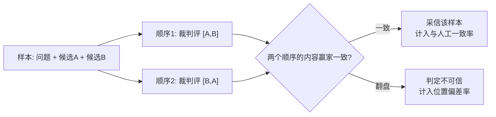

**TL;DR：** 用 LLM 给 LLM 打分（LLM-as-judge）是主流 eval 手段，但裁判自己会错，而且错得系统化。MT-Bench 论文报告：GPT-4 交换两个候选的展示顺序后，判定只有 65.0% 保持一致（约 35% 的样本被"位置"翻盘）；用"重复列表"把回答变长却不加实质内容，能骗过 GPT-3.5 的比例是 91.3%；GPT-4 给自己家的回答多打约 10% 分。而 GPT-4-as-judge 与人工专家的一致率约 85%，略高于人工之间的一致率 81%——好的裁判顶多贴近"人工一致率天花板"，不会更高。所以 eval 不是"跑个 prompt"，是"度量偏差 + 对照人工标注 + 控制变量"：先用交换位置、多次采样、换强模型消掉三笔系统性偏差（位置、冗长、自我），再用一致率或 Cohen's kappa 对人工标注校准，最后一次只改一个变量。成本不是零：200 样本的 pairwise 双顺序回归按 Claude Sonnet 4.6 官方标价约 $2.1，10K 样本全量约 $105——eval 按发布周期跑，采样子集跑日常。

## 一、 先立反直觉：拿 LLM 打分 LLM，是让嫌疑人当法官

eval 的第一个反直觉是：我们一边承认被测模型会犯错、会偷懒、会有偏好，一边默认"换个更聪明的模型来打分"就中立了。这不成立。裁判和考生是同一个物种：它同样受位置影响、同样吃冗长这套、同样偏心自己人。你让一个和考生同场竞技的选手坐进裁判席，就得先把裁判校准了，再谈打分。

论文给出过一个冷酷的标尺。Zheng et al. 2023 在 MT-Bench 上对比 GPT-4-as-judge 与人工专家：pairwise 对比（不含平局）里，GPT-4 的判定与人工一致率约 85%，而两位人工专家之间的一致率是 81%（kappa 0.62）——机器人判得和评委小组内部差不多准，还略高一点点（85% vs 81%）。这句话值得读两遍：**一个顶配裁判的天花板，就是"和一个评委小组差不多准"**。裁判不是魔法，它是一条有校准误差的测量通道，和一把有系统偏置的温度计没有本质区别。测量之前，先量化偏置。

校准这层认知，决定后面所有动作。你说"用 GPT-4 评了一下，结果很好"，这句话的信息量，取决于你知不知道 GPT-4 的裁判有什么偏置、和人工对齐到什么程度。三笔偏差税（位置、冗长、自我）是系统性、可复现的，不是随机噪声——随机噪声能靠多采样平均掉，系统偏差不行，它会在同方向上累积。

## 二、 eval 的类型学：golden set、单元/集成/端到端、pairwise vs pointwise

先分清你在评估什么。eval 的最小骨架是 golden set：一批固定的输入 + 期望输出或参考标准。没有参考，任何"分"都无处锚定。

按被测对象的大小分三档，每档的裁判要回答的问题不同：

- **单元级**：评估单个能力点，比如"这条检索结果的相关性分""这个函数输出的 schema 是否合规"。裁判的输入最小，偏差也最容易控制。
- **集成级**：评估一次调用链，比如 RAG 的"检索 + 生成"、Agent 的"工具循环"——见[TS 里的工具循环：从调用到失败重试](/writing/typescript-llm-tool-loop)。这里开始，裁判需要看多轮上下文，输入的 token 变贵，判错的影响也变大。
- **端到端级**：评估整条用户旅程，比如"新用户能否在五次内完成注册"。这类 eval 最接近真实，但失败定位最难——总分低，你分不清是检索、生成还是工具调用的问题。RAG 的 eval 尤其要把检索分和答案分分开打，见[AI 应用的后端没有魔法](/writing/ai-backend-no-magic)里的 4.1 节（四、RAG 检索质量 下）。

另一个维度决定裁判的姿势：**pairwise vs pointwise**。

| 维度 | pointwise（单答打分） | pairwise（两两对比） |
| --- | --- | --- |
| 裁判输入 | 问题 + 单个候选，打 1-10 分 | 问题 + 两个候选，判 A/B/tie |
| 稳定性 | 分数方差大，同一回答换句问法分数会漂 | 相对更稳，论文报告 GPT-4 pairwise 与人工一致率约 85% |
| 冗余偏好 | 直接受害：长答案容易骗高分 | 受害但可控：位置偏差可交换消掉 |
| 标定成本 | 需要先锚定"几分算好" | 只需锚定"谁更好" |
| 典型用途 | 检索相关性打分、格式/合规判分 | 模型对比、赢率（win rate） |

工程判断：能用 pairwise 就不用 pointwise。pairwise 只要求裁判做"相对排序"这一件更本能的事，pointwise 要求它先把"绝对分"的刻度在心里定好——后者受冗长和风格的影响大得多。这也是 Chatbot Arena 这类榜单用"对战 + Elo"而不是"每题 1-10 分求和"的原因。eval 还必须当成回归测试：prompt 改版、模型升级、温度调整，都会让一部分请求悄悄变坏，所以 golden set 要在每次改动前重跑一遍，挡住回归——它不是做一次的事，是常驻 CI 的事。

## 三、 已知偏差：三笔偏差税、格式崩塌与同源高估

LLM-as-judge 的运作方式是一段 prompt：给裁判一套 rubric（评分标准）+ 问题 + 候选回答，让它输出赢家或分数。偏差藏在三段里都能出现。论文系统测过，三个数字要背下来：

**位置偏好——裁判会被摆放顺序带偏。** 论文把两个候选的顺序交换后重新让 GPT-4 评，结果 GPT-4 的判定只有 65.0% 保持一致，也就是说约 35% 的样本，仅仅是换了先后顺序，结论就翻盘；用 few-shot 提示论文报告可把一致性提到约 77.5%（该值未能从一手来源独立复核，发布前需对照论文 Table 2 核对）。位置偏差在"两个候选质量接近"时最致命——本来最需要裁判细判的平局场景，恰恰是它最容易被顺序左右的时候。

**冗长偏好——长答案天然占便宜。** 论文构造了一种"重复列表"攻击：把回答变长，但只是换着说法重复已有的信息，不增加实质内容。这种加长骗过了 Claude-v1 和 GPT-3.5 的 91.3%，只骗过 GPT-4 的 8.7%。注意这组数字的读法：冗长偏好是真实存在且跨模型普遍的，强模型（如 GPT-4）相对更抗，但没到免疫——你用的 judge 越弱，"写长一点"对赢率的提升越大。

**自我偏好（同源高估）——裁判偏心自己人。** 论文报告 GPT-4 给自己家的回答多打约 10% 分，Claude 系约 +25%（论文自注样本有限，属建议性结论）。推广到工程语境就是：**judge 与被测模型同源时，分数会系统性高估**。用 GPT-4 评 GPT-4 的升级版本，你很可能把自家模型的真实进步高估一截。这也是为什么榜单横评要用异源裁判、用人工投票兜底。

**格式崩塌——裁判也有判不了的案子。** LLM-as-judge 在数学、严格推理这类题上判分能力弱：论文报告，纯单答打分时数学题判分失败率约 70%，改成"参考引导式打分"（先让裁判独立生成自己的解答、再拿它当判分参考——别拿候选答案本身当标准）后才降到约 15%。更普遍的是裁判被复杂 rubric 搞晕——rubric 写得太细，它反而顾此失彼。格式崩塌的本质是：裁判的能力边界 < 你要它评的任务难度，这时候换更强的裁判或换打方式，比加 prompt 有效。

**校准漂移——"标准"不是常数。** judge 换版本、温度改、prompt 微调，它心里的及格线都会动。同一个样本，上个月评 8 分，这个月评 6 分，不一定是候选变差了，可能是裁判换标准了。漂移的解法只有一个：拿一份带人工标注的留出集当锚，每次改 judge 后重新对齐。这也是第四节"对照人工标注"的意义。

## 四、 缓解手段：交换位置、多次采样、强模型、对照人工标注

对三笔偏差税，逐个有对应的拧法：

**位置偏差 → A/B 交换。** 每个样本按 `[A,B]` 和 `[B,A]` 各评一次，两个顺序内容赢家一致才采信；把"交换后翻盘的样本占比"当成一条可监控的指标（位置偏差率）。这条最便宜，几乎是必做——它只多花一倍的 judge 调用，换来的是一根"裁判是否在认真评"的探针。



**冗长偏好 → 让裁判只判相对优劣并给出理由。** 单答打分换成 pairwise 后，冗长的收益从"骗高分"变成"有限加分"；更强的一招是要求裁判输出简短理由，事后抽样看理由是否真的对应回答内容，而不是"回答更详细，故选之"。你的裁判如果一遍遍把"更长"写进理由，它就是在吃冗长这套。

**自我偏好 → 异源强模型当 judge。** 被测模型是 A，judge 尽量选另一个强模型 B（或至少不是 A 的同门）；实在只能同源时，用人工标注的留出集把同源高估的偏移量测出来，对分数做校正。**judge 的选择本身就是校准参数**：太弱会被冗长骗、判不了难题，太强性价比下降，和被测同源会高估。

**校准漂移 → 对照人工标注，算一致率与 Cohen's kappa。** 抽几十条样本做人工标注（A/B/tie），和 judge 的判定对照：一致率看"判重了多少"，kappa 看"扣除随机一致后还剩多少"。kappa 的经验刻度：<0.2 几乎不可用，0.2–0.4 一般，0.4–0.6 中等，0.6 以上才算强。注意一致率高不等于裁判对——裁判可能是在精确复刻人工的偏见（同样偏好长答案、同样偏心某个风格）。所以 anchor 要选"你觉得正确"的标注，不是"你觉得流行"的标注。

**实验入口**（stub 管线已在本机实测闭环，见 `evidence/llm-as-judge-evals/2026-08-16-local/`；真实模型数字不属于本文范围）：

```bash
python3 experiments/llm-judge/llm_judge_position_bias.py --judge stub
export OPENAI_BASE_URL=http://127.0.0.1:8000/v1   # 本地 vLLM / Ollama 的 OpenAI 兼容端点
export OPENAI_API_KEY=EMPTY
export JUDGE_MODEL=<本地模型名>
python3 experiments/llm-judge/llm_judge_position_bias.py --judge api
```

脚本内置 8 个带人工标注（A/B/tie）的样本，对每个样本按两个顺序各评一次，输出翻盘样本、位置偏差率、与人工一致率、Cohen's kappa，纯标准库、无第三方依赖。数据与命令见 `experiments/llm-judge/README.md`。占位裁判（stub）的验证输出如下，仅用于确认管线可运行，不代表真实偏差：

```
位置偏差: 2/8 个样本交换顺序后翻盘，位置偏差率 = 25.0%
与人工标注一致率: 6/8 = 75.0%
Cohen's kappa: 0.556
```

stub 刻意模拟"位置偏好 + 冗长偏好"，翻盘恰好发生在两个候选长度相近（tie）的样本上——位置偏差在可比候选上最明显，这个最小演示和论文的结论方向一致。25.0%、75.0%、0.556 是 stub 的实测输出（本机已复跑）；`--judge api` 的接口已预留，但真实模型的偏差率、一致率与 kappa 取决于所选模型、版本与提示词，需要固定参数并保存 raw 输出才能写数字，本文不做承诺——这正是度量项该有的姿态：数字跟着配置走，不跟着文章走。

## 五、 成本账：judge token × 样本量，以及三招降本

LLM-as-judge 的钱不是花在"跑一次"，是花在"规模 × 顺序 × 采样"上。单次 judge 调用的成本是：

```
每次成本 = (输入 token) × 输入单价 + (输出 token) × 输出单价
输入 token = 固定 rubric/问题 + 两份候选回答
调用次数  = 样本数 × 顺序数（A/B 交换为 2）× 采样次数
```

给一组可复算的数（judge 单次输入约 1.5K token：rubric+问题约 0.5K、两份候选约 1K；输出约 50 token；按 Anthropic 官方标价，Claude Sonnet 4.6 输入 $3/百万 token、输出 $15/百万 token，2026-08-16 核对）：

| 规模 | 调用数 | 输入 token | 输出 token | 成本（Sonnet 4.6 标价） |
| --- | --- | --- | --- | --- |
| 200 样本 × 双顺序 | 400 | 600K | 20K | 约 $2.1 |
| 10K 样本 × 双顺序 | 20K | 30M | 1M | 约 $105 |
| 10K 样本 × 双顺序 × 3 次采样 | 60K | 90M | 3M | 约 $315 |

三行看下来结论很直白：小样本回归便宜到可以忽略，全量 eval 是几百美元的量级，再乘上采样次数就是三位数起步。所以 eval 预算和被测流量预算要分开算，并且按发布周期花——全量回归一个月跑一次，日常用子集。降本有三招，可叠加：

- **前缀缓存**：固定的 rubric 与问题是稳定的请求前缀，可命中 prompt cache（命中部分按官方标价约 0.1 倍输入价）。变化的只有候选回答那段，所以缓存省的是"固定前缀"这一截，别指望全免。
- **Batch API 半价**：judge 不要求低延迟，适合走批处理接口（官方标价五折）。eval 是典型的批负载。
- **采样 + 分层**：按 golden set 的分层（意图、难度、格式）抽子集，日常跑子集、发布前跑全量；用弱模型初筛高分样本，只把边界样本交给强模型复核。eval 采样和 trace 采样是同一道题——抽太多贵、抽太少看不清，先按分层抽对再谈覆盖，见[分布式追踪：从 OpenTelemetry 看一次请求的一生](/writing/distributed-tracing-otel)里 head/tail 采样的取舍。

再补一句容易被忽略的：**候选越长，judge 越贵**。被测模型输出动辄上千 token 时，judge 的输入是按"两份完整候选"计的——冗长偏好不只是偏差，还是成本（长上下文的每一 token 都是钱，见[显存不是算力：KV cache 的字节账](/writing/llm-kv-cache-memory-budget)）。让被测模型先压缩自述再进 judge，既是省钱也是去冗长噪声。

## 六、 结论：eval 的三步法

把全文压成可执行的三步，面试被追问时也站得住：

1. **度量偏差**：先用 A/B 交换测位置偏差率、用留出集测同源高估，系统偏差没消掉之前，任何"分数"都别当结论。这一步回答"裁判可靠吗"。
2. **对照人工标注**：抽样本做人工标注，算一致率 + Cohen's kappa 对齐 judge；每次换 judge 模型或改 rubric 后重算一遍。这一步回答"裁判和我对齐吗"。
3. **控制变量**：一次只改一个变量（模型？prompt？候选？温度？），同一 golden set、同一 judge、同一顺序跑，diff 才有意义。eval 是回归测试，不是一次性结论。这一步回答"分数变化说明了什么"。

局限要承认：LLM-as-judge 永远替代不了"真实用户是否满意"这类主观质量，它在数学与严格推理上的判分能力弱到需要参考引导，而且一致率高不等于裁判对。它最适合的场景是开放式、多轮、重内容的回答质量评估——这正是 MT-Bench 设计时的定位。裁判会错，但一个被校准过的裁判，总比没有裁判好；一个没校准过的裁判，则可能比没有裁判更糟——因为它给你一个可信的错觉。

## 参考资料

1. Zheng et al., *Judging LLM-as-a-Judge with MT-Bench and Chatbot Arena*，arXiv:2306.05685（位置偏差、冗长偏好与人工一致率）：https://arxiv.org/abs/2306.05685
2. Anthropic 官方定价页（Claude Sonnet 4.6 输入/输出价格，2026-08-16 核对）：https://platform.claude.com/docs/en/about-claude/pricing
3. stub 实验入口：`experiments/llm-judge/llm_judge_position_bias.py`；本机原始输出与环境：`evidence/llm-as-judge-evals/2026-08-16-local/`。stub 数字不代表真实模型。
