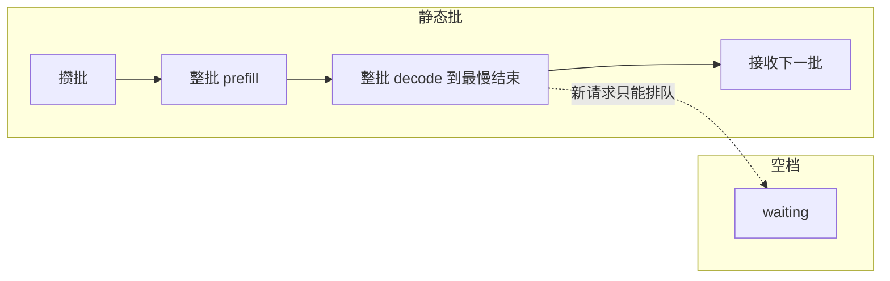
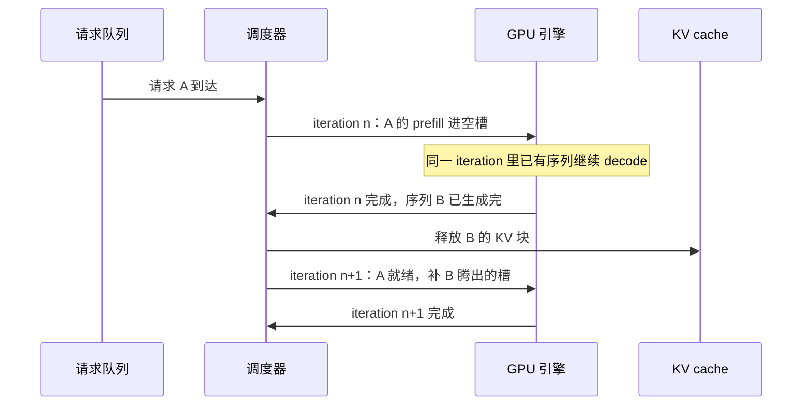

**TL;DR：** 一张 GPU 跑 LLM 解码，利用率低很少是算力不够，而是批的粒度太粗。prefill 是计算密集、decode 是内存带宽密集且逐 token 串行，静态批让整批等最慢的序列结束、末尾留空档，新请求只能排队。continuous batching（Orca 在 2022 年提出，vLLM 在 2023 年产品化）把调度粒度从「一批」缩到「一步」：序列完成立即腾槽、新请求随到随插。论文数字在这里：Orca 论文报告，同延迟水平下吞吐比请求级调度的 FasterTransformer 最高约 36.9 倍；vLLM 论文报告，比当时的先进系统高 2–4 倍。批的边界不在算力而在 KV cache 显存与延迟 SLO，这是第五节的内容。

## 一、 先立账：一次推理里有两笔形状不同的成本

GPT 风格模型的生成分两个阶段，两阶段的成本形状完全不同。

**prefill（预填充）**：把整段 prompt 一次性算完，所有 token 并行处理，是矩阵-矩阵运算，计算密集。一次 prefill 的成本大致正比于 prompt 长度，GPU 的算力被喂满，一锤子买卖。

**decode（自回归生成）**：逐 token 输出。第 t+1 个 token 依赖前 t 个的全部中间状态，所以每步要读出模型权重、再读出全部历史的 KV cache 去算注意力，最后只产出一个 token。这是矩阵-向量加注意力，内存带宽密集——GPU 的计算单元大部分时间在等内存搬运。而且 decode 每一步只能出一个 token，无法像 prefill 那样并行。

这两笔成本形状不同，决定了「批」这个杠杆只对 decode 有效。decode 每步有一笔固定开销：读权重、kernel 启动、搬运 KV cache。批只有一条序列时，这笔开销摊在 1 个 token 上，算术强度（每字节内存搬运对应的浮点运算）太低，GPU 吃不饱；把批加到 B 条序列，固定开销摊到 B 个 token 上，算力才被真正用起来。所以在内存带宽打满之前，decode 吞吐近似随批大小线性涨。而 prefill 天生就把算力用满，批它并不涨吞吐。

这一句话是全文的地基：**批是 decode 的杠杆，不是 prefill 的杠杆。** 后半句要加个限制——decode 单步时间严格说会随批大小上升，吞吐只是随批增长得更快；「单步时间近似与批大小无关」是批能带来收益的理想极限，第五节讲它的边界。

## 二、 静态批的排队税：一批等最慢的，末尾留空档

早期 serving 系统（FasterTransformer、Triton 的请求级调度）的工作方式是：攒够一批请求，整批 prefill，然后整批 decode 到最慢的那条结束，再接收下一批。这个模型里 GPU 付三笔税：

1. **填充等待**：为了凑批，先到的请求等后来的；到达不均匀时，要么等满批（延迟涨），要么固定超时（批不满，利用率跌）。
2. **阶段互斥**：整批 prefill 时 decode 空转；整批 decode 时新请求进不来，只能排队。
3. **尾部空档**：批内先完成的序列占着槽位不干活。批的 decode 时长由批内最长的输出决定，而平均输出远短于最长输出。

第三笔是最大的。给一组具体数字（手算示意，不是实测）：一批 8 条序列，输出长度分别是 100/120/90/110/200/500/130/140，最长 500，平均 174。decode 阶段必须跑满 500 步，但每一步的平均活跃序列数只有 2.8（= 所有输出之和 1390 ÷ 500）——一个 8 槽 GPU 在 decode 阶段的利用率只有约 35%，另外 65% 在等最慢的那条。而且这 500 步期间，新到的请求全部排队。

这就是「排队税」：静态批按「一批」收税，每批都要付最长序列的尾部时间，而这个时间不产生任何新收益。



## 三、 continuous batching：把调度粒度从「一批」缩到「一步」

Orca（OSDI 2022）做的是把调度粒度从请求级改成 iteration 级（iteration-level scheduling，也就是后来被叫开的 continuous batching）。调度器不再等一批请求，而是每执行完一步模型迭代就重新决策：

- 完成的序列立即返回客户端、腾出 KV 槽位；
- 新请求的 prefill 插入同一 iteration 的空闲槽（Orca 的 selective batching：非注意力算子按 token 跨请求批量，注意力算子按请求单独算，因为注意力的 mask 在请求间不能混）；
- 剩下的 decode 序列每步照常推进。



这一步把「批」从一次性的分组，变成了每个 iteration 都在动态变化的活跃集。GPU 按「步」收费、不按「请求」收费，所以把每一步填满才是关键；一条序列的完成不再拖住任何人，它只是让出自己的槽。静态批付的尾部税，在这里根本不存在：慢序列自己占自己的槽，不阻塞任何别的东西。

效果看论文原文。Orca 论文报告，在同样的 GPT-3 175B 模型、同样延迟水平下，Orca 比请求级调度的 NVIDIA FasterTransformer 吞吐最高约 36.9 倍（Orca 论文《Orca: A Distributed Serving System for Transformer-Based Generative Models》，OSDI 2022，见参考资料）。

2023 年 vLLM（SOSP 2023）把 continuous batching 产品化的同时，解决了另一个卡住批大小的瓶颈：KV cache 内存。vLLM 论文报告，此前系统对 KV cache 的利用率只有约 20.4%–38.2%——显存碎片和预留浪费吃掉了大半；PagedAttention 把 KV 切成固定大小的块、用块表按 OS 虚拟内存的方式管理，把利用率拉回接近 100%。显存边界一放宽，批能更大，continuous batching 才有施展空间。vLLM 论文摘要报告，同样延迟水平下吞吐比当时的先进系统高 2–4 倍；项目发布博客给出的更激进的量级——与 HuggingFace Transformers 这类未做 KV 内存优化的朴素实现相比最高约 24 倍——对应的是基准里最有利的负载，别当普遍值（论文《Efficient Memory Management for Large Language Model Serving with PagedAttention》，SOSP 2023）。

值得注意的是，continuous batching 与 PagedAttention 是两件正交的事：前者提高 GPU 的时间利用率，后者提高显存的空间利用率。少了任何一个，另一个都到不了论文里的数字——这正是 KV cache 的字节账成为独立话题的原因，见[显存不是算力：KV cache 的字节账，40GB 里到底塞得下几个并发](/writing/llm-kv-cache-memory-budget)。

## 四、 模拟器实测：同一条 trace 下利用率何时拉开

论文数字证明这件事值得做，但「静态批到底浪费多少」最好自己跑一遍。我在 `experiments/llm-batching/` 写了一个离散事件模拟器，两种策略吃同一份请求 trace（固定 seed，可复现）。物理模型做了三处简化，都在 README 里写明：

- decode 是带宽瓶颈：一次 iteration 固定耗时 `T_DECODE_MS`，批内每个活跃序列各出 1 个 token，活跃数在 `1..MAX_BATCH` 之间变化不改变单次耗时。这是「固定开销摊平」的理想极限，趋势与真实 GPU 一致。
- prefill 是计算瓶颈，时长 = prompt_tokens / `PREFILL_RATE`。continuous batching 里 prefill 与 decode 并行、不拉长 decode iteration（乐观假设，vLLM 的 chunked prefill 就是为了修正它）；静态批里 prefill 是串行独立阶段，整个阶段 decode 空转。
- 显存/KV cache 充足，容量只由 `MAX_BATCH` 限定。

在仓库根目录运行；基础模拟纯标准库、无依赖（`--plot` 出图需可选安装 matplotlib，缺了只出表格）：

```bash
python3 experiments/llm-batching/sim.py
python3 experiments/llm-batching/sim.py --arrivals "1,2,4,8,16,32" --max-batch 16 --plot curves.png
```

默认参数：单步 10ms、最大批 16、prefill 速率 8 tok/ms、prompt 均值 300、输出均值 200、seed 42。下表来自同一条 trace 的本机运行；`GPU 空闲率`和`decode 利用率`是模拟器指标，不是 GPU profiler 采样。原始输出与环境在 `evidence/llm-continuous-batching-throughput/2026-08-16-local/`。

| 到达率 λ (req/s) | 策略 | 吞吐 (req/s) | decode 容量利用率 | GPU 空闲率 | 平均时延 (s) |
|---|---|---|---|---|---|
| 2 | 静态批 | 1.88 | 26.0% | 0.2% | 4.4 |
| 2 | continuous | 1.88 | 24.9% | 3.1% | 2.1 |
| 8 | 静态批 | 3.35 | 49.2% | 0.0% | 100.7 |
| 8 | continuous | 7.30 | 93.6% | 0.1% | 3.0 |
| 32 | 静态批 | 3.34 | 49.1% | 0.0% | 160.6 |
| 32 | continuous | 7.66 | 98.2% | 0.1% | 58.0 |

这组输入的差异很具体：λ=8 时 continuous 的 decode 利用率为 93.6%，静态批为 49.2%；静态批平均时延为 100.7s，continuous 为 3.0s。λ=32 时两者都接近饱和，但 continuous 仍以 98.2% 对 49.1% 的槽位利用率领先，平均时延也从 160.6s 降到 58.0s。低负载 λ=2 时，差异缩小，说明排队税要在负载接近容量时才显性化；这些数字只属于该模拟器和该 trace。

两个指标怎么读：GPU 空闲率看的是「GPU 纯空转」的 wall 时间比例，低负载时两者都高；decode 容量利用率看的是「每次 iteration 里槽位有多满」，它直接对应尾部空档和批内浪费，是高负载下拉开差距的那一列。只看空闲率会低估问题的严重性——高负载时静态批也几乎不空转，它是「一直忙、但忙得低效」。

## 五、 代价与边界：为什么批不能无限加

continuous batching 的收益建立在「批越大越划算」上，但这个上界不是算力，是一组约束：

1. **KV cache 显存是硬边界**。批越大，同时活跃的序列越多，KV 占的显存越多。vLLM 论文给过一个数量级：13B 模型每个 token 的 KV cache 约 800KB（2 组 K/V × hidden 5120 × 40 层 × fp16 2 字节）。显存决定你能同时驻留多少条序列，这是容量硬顶，具体账见[显存不是算力：KV cache 的字节账，40GB 里到底塞得下几个并发](/writing/llm-kv-cache-memory-budget)。

2. **显存爆了就要 preemption**。continuous batching 下系统必须能把某些序列的 KV 释放掉，两条路：重算（丢弃 KV，回来时重新 prefill——省显存费算力），或换出（把 KV 块搬到 CPU 内存——费 PCIe 带宽与主机内存）。选谁被请出去也是调度策略：vLLM 的 V1 调度器 preempt 优先级最低的运行序列（FCFS 下即最后被接纳的那条），V0 是运行集尾部的最后一条；V1 默认完全不把 KV 换到 CPU，靠重算补回，而重算时会先按块哈希复用仍驻留缓存的前缀块，只重算缓存之外的后缀（这些块若已被别的序列挤走，就得从头重算）。被 preempt 的请求延迟必然放大——这是调度器拿吞吐换公平与 SLO 的地方。

3. **调度顺序本身是策略：最长前缀优先**。prefill 谁先算，直接决定前缀缓存命中率。把共享最长公共前缀的请求排在一起算，前面的 KV 块就能被后面的请求复用——vLLM 的 automatic prefix caching 按内容哈希寻块（`--enable-prefix-caching`），SGLang 的 RadixAttention 用前缀树管理并做最长前缀优先调度。系统提示、RAG 长上下文这类稳定前缀就是命中率的主要来源，也解释了为什么 prompt 结构要稳定——前缀一动，缓存键全失效，见[AI 应用的后端没有魔法](/writing/ai-backend-no-magic)。

4. **单步时间随批涨，延迟 SLO 卡住批上限**。第三节说单步时间近似与批大小无关，那是理想极限；真实 GPU 上批越大，每步计算量越大，per-token 延迟（TPOT）上升。TTFT/TPOT 一旦有 SLO，批大小就有上限——serving 框架的批大小参数（vLLM 的 `max_num_seqs`）要按延迟预算去调，不是拍脑袋定的。这正是「不能无限加批」在工程上的落点。

5. **prefill 会抢 decode 的计算**。把长 prompt 的 prefill 塞进正在 decode 的 iteration，会拉长整步。vLLM 的 chunked prefill 把 prefill 切成小块、分散到多个 iteration，把对 decode 步长的冲击压到可控。这是批越大越要处理的细节。

所以 continuous batching 的边界是一组约束：KV 显存决定容量、前缀缓存与调度顺序决定 KV 复用率、延迟 SLO 决定批上限、prefill/decode 抢占决定步长抖动。调度器在这几层里做取舍——这也是它从「一个批处理技巧」变成「一个调度系统」的原因。

## 六、 结论：利用率不是硬件的账，是调度的账

回到开头那张 GPU：decode 阶段利用率低，根因是调度粒度太粗，不是硬件不济。静态批按「批」调度，慢序列的尾部时间成了每批必交的税；continuous batching 把粒度缩到「一步」，让每一步都尽量装满。这个判断可以用一句话验证：同一个模型、同一块 GPU、同一份请求负载，只改调度策略，吞吐能差出论文里那个量级——Orca 的最高约 36.9 倍、vLLM 的 2–4 倍，都来自调度与内存管理，而不是更快的 kernel。

如果你要把它用在工程上，三件可执行的事：

- 别手写批调度。需要连续 batching 时直接用 vLLM / SGLang 这类框架，它们把 iteration 级调度、chunked prefill、preemption 都做完了；自己实现等于重新发明调度器。
- 理解并测量两个指标而不是一个：decode 容量利用率（时间维度）和 KV cache 利用率（空间维度），后者对应的是[KV cache 的字节账](/writing/llm-kv-cache-memory-budget)。
- 把 serving 层当调度系统来设计，而不是当「批处理脚本」：容量由显存定、批上限由 SLO 定、preemption 策略要选。这也延续了[AI 应用的后端没有魔法](/writing/ai-backend-no-magic)里的判断——没有新物种，只有老问题（调度、排队、内存管理）在新成本结构下被放大；而整条链路从网关到推理服务再到 Agent 协议，每一层都有自己的排队税，见[AI Agent 的协议栈](/writing/ai-agent-protocol-stack)。

## 七、 参考资料

- Orca: A Distributed Serving System for Transformer-Based Generative Models（OSDI 2022）：https://www.usenix.org/conference/osdi22/presentation/yu
- Efficient Memory Management for Large Language Model Serving with PagedAttention（SOSP 2023）：https://arxiv.org/abs/2309.06180
- vLLM 官方文档（continuous batching 与 PagedAttention 的产品实现）：https://docs.vllm.ai/
