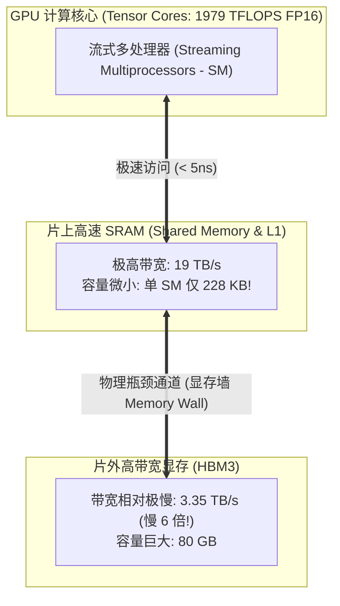
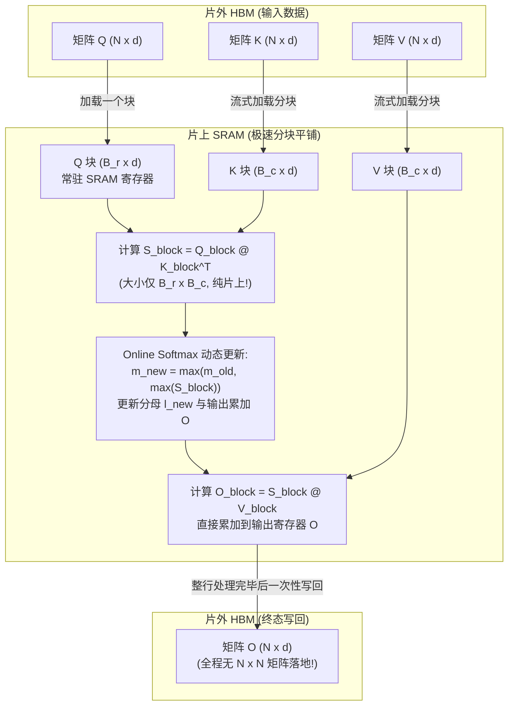

**TL;DR：** 在深度学习模型的数学表达中，标准自注意力机制（Self-Attention）非常优雅简洁：$\text{Attention}(Q, K, V) = \text{softmax}\left(\frac{QK^T}{\sqrt{d}}\right)V$。然而，当把这一公式翻译到物理 GPU 硬件上时，它却演变成了一场**极其惨烈的访存灾难**。中间计算出来的注意力权重矩阵 $S = QK^T$ 和 $P = \text{softmax}(S)$ 的空间复杂度是 $O(N^2)$。当序列长度 $N$ 达到 128k 时，仅这一个临时矩阵就需要吞噬上百 GB 显存！即使 GPU 拥有成百上千 TFLOPS 的恐怖浮点算力，Tensor Core 也必须有 90% 以上的时间挂起等待慢速的高带宽显存（HBM）搬运数据。

斯坦福大学博士生 Tri Dao 提出的 **FlashAttention** 彻底打破了这一“显存带宽墙（Memory Bandwidth Wall）”。它的第一性原理在于：**不改变任何计算数学结果的前提下，利用 GPU 片上超高速的 SRAM（Shared Memory）对输入矩阵进行分块平铺（Tiling），借助 Online Softmax 算法在寄存器中实时累加局部最大值与归一化分母，使得 $O(N^2)$ 的中间注意力矩阵彻底无需在慢速 HBM 中物化（Materialization），将显存读写量直接缩减 5~10 倍！** 从 FlashAttention-1 到 FlashAttention-3（深度榨取 NVIDIA Hopper 架构的 TMA 硬件引擎与 WGMMA 指令），本文将彻底推导其数学底座与硬件微架构工程精髓。

---

## 一、动笔前任务卡与核心矛盾

| 任务字段 | 本篇架构推导与回答 |
| :--- | :--- |
| **目标读者** | 负责超大规模模型预训练、算子优化、CUDA 内核调优与 AI 基础设施的资深架构师与性能工程师。 |
| **核心问题** | 为什么标准 Self-Attention 会遭遇 GPU 访存墙？如何在不保存全量注意力矩阵的情况下正确计算带有全局指数归一化的 Softmax？从 FA-1、FA-2 到 FA-3 的微架构演进历程与代价是什么？ |
| **知识主角** | FlashAttention 算子优化、GPU 存储层次结构（HBM vs SRAM）、Online Softmax 数学递推方程、Hopper 架构 TMA 与 WGMMA 硬件加速。 |
| **熟悉入口** | PyTorch `torch.nn.functional.scaled_dot_product_attention`、Roofline 算力访存比模型。 |
| **因果主线** | GPU 硬件 SRAM/HBM 带宽断层 $\to$ 标准 Attention 的 $O(N^2)$ 读写灾难 $\to$ Online Softmax 动态缩放递推证明 $\to$ Tiling 分块在前向与反向传播中的闭环 $\to$ FA-2 / FA-3 异步硬件指令演进。 |

---

## 二、GPU 硬件存储层次结构的残酷现实：HBM vs SRAM 带宽墙

要看懂 FlashAttention 的必要性，必须先直面现代顶级 GPU（以 NVIDIA A100 / H100 为例）内部极其悬殊的存储层次结构：

```
┌────────────────────────────────────────────────────────────────────────┐
│                        NVIDIA H100 GPU 存储金字塔                      │
├───────────────────┬──────────────┬───────────────┬─────────────────────┤
│ 存储层级          │ 容量上限     │ 物理带宽      │ 相对延迟            │
├───────────────────┼──────────────┼───────────────┼─────────────────────┤
│ 1. 寄存器 (Regs)  │ ~256 KB / SM │ ~30 TB/s      │ 1 个时钟周期 (~0.5ns)│
│ 2. 共享内存 (SRAM)│ ~228 KB / SM │ ~19 TB/s      │ ~10-20 个周期 (~5ns) │
│ 3. 二级缓存 (L2)  │ 50 MB (全局) │ ~12 TB/s      │ ~100-200 个周期     │
│ 4. 高带宽显存(HBM)│ 80 GB (全局) │ 3.35 TB/s     │ ~500-1000 个周期    │
└───────────────────┴──────────────┴───────────────┴─────────────────────┘
```



### 2.1 Roofline 模型下的 Memory-Bound 悲剧
在高性能计算（HPC）中，一个算子的执行瓶颈由其 **算力访存比（Operational Intensity，FLOPs per Byte）** 决定：
$$\text{Operational Intensity} = \frac{\text{浮点运算次数 (FLOPs)}}{\text{从 HBM 读写的总字节数 (Bytes)}}$$

- **Compute-Bound（算力受限）**：矩阵乘法（GEMM）通常是算力受限，因为计算量 $O(N^3)$ 远大于数据读取量 $O(N^2)$；
- **Memory-Bound（访存受限）**：Softmax、Dropout、LayerNorm 和逐元素加法。计算量极小（$O(N)$），但必须完整从 HBM 读出并写回。

在标准的 PyTorch 原生 Self-Attention 实现中：
```python
# 标准 Self-Attention 的执行逻辑 (极其致命的多次 HBM 往返)
# 1. 从 HBM 读 Q, K (2 * N * d) -> 计算 S = Q @ K.T -> 写入 HBM! (大小: N * N)
S = torch.matmul(Q, K.transpose(-1, -2)) / math.sqrt(d)

# 2. 从 HBM 读 S (N * N) -> 计算 Softmax -> 再次写入 HBM! (大小: N * N)
P = torch.softmax(S, dim=-1)

# 3. 从 HBM 读 P (N * N) 和 V (N * d) -> 计算 O = P @ V -> 写入 HBM! (大小: N * d)
O = torch.matmul(P, V)
```
当序列长度 $N = 32,768$，批次为 8，头数为 32 时：
- $N \times N$ 的中间矩阵 $P$ 单个头的大小就是 $32768 \times 32768 \times 2 \text{ bytes} \approx 2 \text{ GB}$；
- 32 个头就是 **64 GB**！
- GPU 的计算核心算力闲置率高达 80%，全都在死等数据从 HBM 缓慢加载到芯片内。

---

## 三、核心数学突破：Online Softmax 算法的严格推导

为什么必须物化 $N \times N$ 矩阵？因为 **标准的 Softmax 需要全局信息**：
$$\text{softmax}(x)_i = \frac{e^{x_i - m}}{\sum_{j=1}^N e^{x_j - m}}, \quad m = \max_{j}(x_j)$$
为了数值稳定（防止浮点数 $e^{x_i}$ 溢出），必须先遍历整行找到最大值 $m$，然后再遍历整行求和分母 $l = \sum e^{x_j - m}$，最后才能算出每个元素的输出。

这要求：**在看到整行的最后一个元素之前，第一个元素根本无法算完并输出！** 这就是传统算法必须把整行（大小 $N$）存下来的数学死穴。

### 3.1 Online Softmax 递推归纳法证明
1997 年，Milakov 等人提出了 Online Softmax。FlashAttention 将其巧妙运用于分块平铺中。

设一个向量 $X$ 被切分为两半：$X = [X^{(1)}, X^{(2)}]$。
- 对于前半段 $X^{(1)}$：
  - 局部最大值：$m^{(1)} = \max(X^{(1)})$
  - 局部非归一化和：$l^{(1)} = \sum_{j} e^{X_j^{(1)} - m^{(1)}}$
- 现在处理后半段 $X^{(2)}$，并看到了新的局部数据：
  - 新局部最大值：$m^{(2)} = \max(X^{(2)})$
  - 新局部非归一化和：$l^{(2)} = \sum_{j} e^{X_j^{(2)} - m^{(2)}}$

**全局合并定理（Theorem of Online Merging）**：
合并后的全局最大值显然为：
$$m^{\text{new}} = \max(m^{(1)}, m^{(2)})$$

关键在于：**如何用旧的分母 $l^{(1)}$ 和新的分母 $l^{(2)}$ 直接推导出全局分母 $l^{\text{new}}$？**
推导过程如下：
$$\begin{aligned}
l^{\text{new}} &= \sum_{j \in X^{(1)} \cup X^{(2)}} e^{X_j - m^{\text{new}}} \\
&= \sum_{j \in X^{(1)}} e^{X_j - m^{\text{new}}} + \sum_{j \in X^{(2)}} e^{X_j - m^{\text{new}}} \\
&= \sum_{j \in X^{(1)}} e^{X_j - m^{(1)} + (m^{(1)} - m^{\text{new}})} + \sum_{j \in X^{(2)}} e^{X_j - m^{(2)} + (m^{(2)} - m^{\text{new}})} \\
&= e^{m^{(1)} - m^{\text{new}}} \sum_{j \in X^{(1)}} e^{X_j - m^{(1)}} + e^{m^{(2)} - m^{\text{new}}} \sum_{j \in X^{(2)}} e^{X_j - m^{(2)}} \\
&= e^{m^{(1)} - m^{\text{new}}} l^{(1)} + e^{m^{(2)} - m^{\text{new}}} l^{(2)}
\end{aligned}$$

同理，对于累加输出的分子部分 $O = P V$，旧的累加向量 $O^{(1)}$ 可以通过简单的乘法缩放与新块加权融合：
$$O^{\text{new}} = \text{diag}\left(e^{m^{(1)} - m^{\text{new}}}\right) O^{(1)} + e^{m^{(2)} - m^{\text{new}}} \left(e^{X^{(2)} - m^{(2)}}\right) V^{(2)}$$

**结论**：**我们根本不需要一次性看到全部数据！每拿到一个新的分块，只需利用缩放因子 $e^{m^{\text{old}} - m^{\text{new}}}$ 对已有累加值进行校准，就能在片上 SRAM 中以常数内存增量计算出绝对精确的 Softmax 结果！**

---

## 四、FlashAttention-1 核心机制：Tiling 分块流水线

有了 Online Softmax，FlashAttention-1 的物理分块平铺（Tiling）管线得以成立：



### 4.1 算法复杂度对比
设序列长度为 $N$，特征维度为 $d$，GPU SRAM 大小为 $M$：
- **标准 Attention**：HBM 内存访问量为 $O(N d + N^2)$。当 $N$ 很大时，主要开销完全被 $N^2$ 的中间读写统领；
- **FlashAttention**：HBM 内存访问量降至 $O\left(\frac{N^2 d^2}{M}\right)$，中间 $N \times N$ 矩阵读写完全消失！
- **结果**：不仅显存占用从 $O(N^2)$ 断崖式下降到 $O(N)$，而且端到端运行速度提升了 **2~4 倍**！

---

## 五、FlashAttention-2 的极致重构：指令与循环级优化

FlashAttention-1 证明了算法的可行性，但在 GPU 硬件微架构层面，依然存在大约 50% 的理论算力闲置。Tri Dao 在 2023 年推出了 **FlashAttention-2**，做了两大关键重构：

### 5.1 循环顺序颠倒（Outer Loop over Q）
- **FA-1 的设计**：外层循环遍历 $K, V$ 块，内层循环遍历 $Q$ 块。这导致外层每前进一步，都需要对全局输出 $O$ 和标量分母 $l$ 进行一次原子规约（Atomic Reduction）写入 HBM；
- **FA-2 的设计**：**将外层循环改为遍历 $Q$ 块，内层循环遍历 $K, V$ 块**。
  - 单个线程块（Thread Block）负责一个 $Q$ 块的全部计算；
  - $Q$ 块以及对应的累加输出 $O$ 始终锁死在片上寄存器中，内层循环处理完所有的 $K, V$ 块后，**只需向 HBM 执行一次最终写入**！

### 5.2 减少非 Tensor Core 浮点运算
在 NVIDIA 架构中，Tensor Core（专攻 FP16/BF16 矩阵乘）的计算速度是普通 CUDA Core（单精度加减乘除）的 **16 倍以上**。
- FA-1 在内层循环中频繁对 $O$ 乘以局部归一化因子，占据了大量普通核心开销；
- FA-2 推迟了除法操作：在内层循环中始终保持未归一化的累加状态，直到整行计算完全结束，才在最后执行一次单维向量除法 $\frac{O}{l}$，消除了海量冗余缩放计算。

---

## 六、FlashAttention-3（Hopper 架构）：榨取 TMA 与 WGMMA 硬件极限

随着 2024 年 NVIDIA Hopper 架构（H100/H800）的普及，FlashAttention-3 进一步将优化下潜到了**硬件指令集与专用加速芯片级别**：

```
┌────────────────────────────────────────────────────────────────────────┐
│                   FlashAttention-3 的三大 Hopper 硬件杀手锏             │
├───────────────────┬────────────────────────────────────────────────────┤
│ 1. TMA 硬件引擎   │ Tensor Memory Accelerator: 专用的硬件拷贝引擎，     │
│                   │ 线程无需参与循环计算地址，硬件自动将 HBM 数据搬进 SRAM│
├───────────────────┼────────────────────────────────────────────────────┤
│ 2. WGMMA 指令     │ Warp Group MMA: 允许 128 个线程（4个 Warp）作为一个 │
│                   │ 整体协作，直接从 Shared Memory 读取数据执行矩阵乘   │
├───────────────────┼────────────────────────────────────────────────────┤
│ 3. 软件流水双缓冲 │ Ping-Pong Buffering: 计算第 k 块矩阵乘的同时，      │
│                   │ TMA 硬件异步加载第 k+1 块，实现 100% 算网/访存重叠 │
└───────────────────┴────────────────────────────────────────────────────┘
```

### 6.1 TMA（Tensor Memory Accelerator）带来的革命
在传统的 CUDA 编程中，要想把数据从全局显存搬进共享内存，必须让 32 个线程组成的 Warp 齐刷刷地执行 `ld.global` 指令，算地址、读显存、再执行 `st.shared` 写入 SRAM。这占用了宝贵的计算发射槽位。
**Hopper 架构加入了 TMA 独立硬件单元**：
- Warp 只需发出一条指令：“*TMA 帮我把坐标 $(x, y)$ 大小为 $128 \times 64$ 的张量搬进 SRAM 地址 0x1000*”；
- 随后所有的计算线程立刻去执行 Tensor Core 矩阵乘；
- TMA 硬件单元在后台默默利用硬件 DMA 通道搬运数据，完成后通过硬件屏障（Asynchronous Barrier）触发通知。

**收益**：FlashAttention-3 在 H100 上的吞吐达到了理论峰值的 **75%~85%**（超过 600 TFLOPS FP16），在长上下文场景下比 FlashAttention-2 再快 **1.5~2 倍**！

---

## 七、总结与全栈 Infra 决策边界

FlashAttention 的演进史，是现代 AI 基础设施工程师穿透软件黑盒、向物理硬件极限发起冲锋的教科书范例：
1. **算法创新并不等于凭空创造新数学**：Online Softmax 早在 20 年前就已存在，但唯有将其与 GPU 的 SRAM/HBM 存储层次结构严密契合，才释放出了颠覆整个行业的能量；
2. **内存墙（Memory Wall）是长上下文第一瓶颈**：随着模型上下文从 4k 拓展至 1M，任何将 $O(N^2)$ 中间状态物化到内存的做法都会迅速暴毙；
3. **软硬件协同设计（Co-design）是顶级 Infra 的终极护城河**：从 FA-1 的分块思想，到 FA-2 的内外循环重排，再到 FA-3 与 Hopper TMA 硬件的绝对锁合，底层优化的颗粒度已经精细到了时钟周期与硬件执行流水线。

在下一篇中，我们将深入万卡集群并行拓扑的第三大支柱：**《前沿大模型训练与全栈 Infra 解密（三）：MoE 专家并行与通信隐藏 —— 从 Switch Transformer 到 DeepSeek-V3 无辅助损失路由与 All-to-All 算网重叠》**，彻底解密上百位专家在集群网络间的调度神迹！

---

## 参考资料与规范出处

1. **Dao, T., et al. (2022)**: *FlashAttention: Fast and Memory-Efficient Exact Attention with IO-Awareness*, NeurIPS 2022.
2. **Dao, T. (2023)**: *FlashAttention-2: Faster Attention with Better Work Partitioning and Parallelism*, ICLR 2024.
3. **Shah, J., Dao, T., et al. (2024)**: *FlashAttention-3: Fast and Accurate Attention with Asynchrony and Low-precision on Hopper GPUs*, arXiv:2407.08608.
4. **Milakov, M., & Gimelshein, N. (2018)**: *Online normalizer calculation for softmax*, arXiv:1805.02867.
5. **NVIDIA Corporation**: *NVIDIA Hopper Architecture In-Depth: TMA and Asynchronous Transfer Mechanics*, NVIDIA Developer Technical Blog, 2023.
