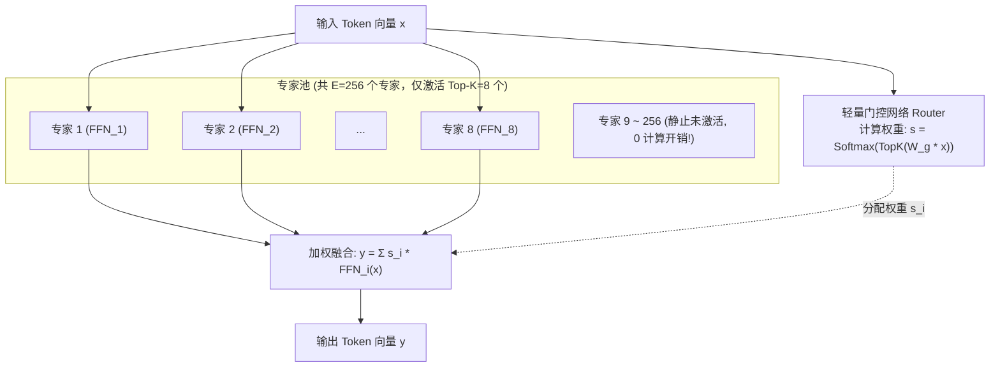
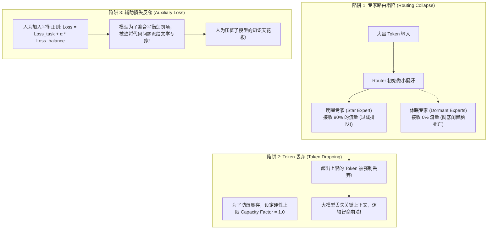

**TL;DR：** 随着大模型参数量向数千亿规模攀升，传统的稠密模型（Dense Models）狠狠撞上了能效比与训练成本的“叹息之墙”——每次前向传播必须激活所有参数，算力需求随参数量线性爆炸。混合专家模型（Mixture-of-Experts, MoE）提供了一条完全不同的物理路径：**用显存容量换取计算稀疏度**。以 DeepSeek-V3 为例，其拥有高达 6710 亿（671B）的总参数量，但每个 Token 经过门控路由后，仅仅激活其中的 370 亿（37B）参数。

然而，软件层面的“稀疏计算”，在硬件与网络层却演变成了一场**近乎疯狂的“跨机网络通信豪赌”**。由于不同专家被分散切放在成百上千台不同物理 GPU 节点上，每个 Token 必须在毫秒级内通过昂贵的 **All-to-All 集合通信** 跨机投递到对应专家所在的显卡上，算完后再 All-to-All 收集回来。更致命的是，早期的 MoE 架构饱受“明星专家负载过载”、“Token 强制丢弃导致退化”以及“辅助损失损害模型上限”的三重折磨。本文从专家并行（Expert Parallelism）的第一性原理出发，深度拆解 DeepSeek-V3 是如何用纯工程反馈偏置（Bias）破除辅助损失魔咒，并通过精妙的双缓冲机制实现 All-to-All 通信延迟近乎 100% 隐藏的顶级 Infra 实践。

---

## 一、动笔前任务卡与核心矛盾

| 任务字段 | 本篇架构推导与回答 |
| :--- | :--- |
| **目标读者** | 负责超大规模集群分布式训练、模型架构工程化落地、高性能算力网络与异构算力调优的资深架构师。 |
| **核心问题** | 为什么 MoE 会导致集群网络严重拥塞？跨节点的 All-to-All 通信瓶颈在哪里？DeepSeek-V3 如何做到既不牺牲模型智能、又能让万卡集群的专家负载均匀并完全掩盖通信开销？ |
| **知识主角** | 专家并行（Expert Parallelism, EP）、All-to-All 集合通信、无辅助损失动态路由（Auxiliary-Loss-Free Balancing）、算网双缓冲重叠（Overlap）。 |
| **熟悉入口** | FFN（前馈神经网络）多层感知机、NCCL All-Reduce、分布式负载均衡。 |
| **因果主线** | Dense 算力墙 $\to$ MoE 稀疏激活与专家并行拓扑 $\to$ All-to-All 跨机传输成为阿喀琉斯之踵 $\to$ 早期辅助损失与 Token Drop 的反噬 $\to$ DeepSeek-V3 动态偏置与计算通信完全重叠的终局方案。 |

---

## 二、从 Dense 到 MoE：用显存换算力的物理飞跃

在标准 Transformer 架构中，多头注意力（MHA）和前馈网络（FFN）构成了每个 Block 的核心。其中，**FFN 层占据了全模型参数量的约 2/3**。
在 Dense 架构中，无论用户输入的是一首诗、一段 Python 爬虫，还是复杂的量子力学公式，数据都无差别地流经所有的 FFN 权重矩阵：

```text
Dense 模型的算力公式:
激活参数量 = 全量参数量 (Activation Ratio = 100%)
计算成本 (FLOPs) ∝ 模型总参数量 (Parameters)
```

MoE 的核心哲学非常纯粹：**将单个庞大的 FFN 拆分为 $E$ 个独立的小型 FFN（称为专家，Experts），并在前面挂载一个轻量级的门控网络（Router / Gating Network）。对于每一个输入的 Token，门控网络从 $E$ 个专家中只挑选最匹配的 Top-$K$ 个专家进行激活计算：**



### 2.1 恐怖的能效比跃迁
以 DeepSeek-V3 为例：
- **总参数量**：$671\text{B}$（拥有 6710 亿参数的超广博知识库存储在 GPU 显存中）；
- **单 Token 激活参数量**：仅约 $37\text{B}$；
- **收益**：模型具备接近甚至超越 GPT-4 级 Dense 模型的推理理解能力，但单步迭代所需的算力消耗仅相当于一个小得多的 37B 稠密模型，训练与推理成本断崖式下跌 80%！

---

## 三、阿喀琉斯之踵：跨机 All-to-All 集合通信风暴

天下没有免费的午餐。MoE 在算法层为 GPU 算力松了绑，却在物理层给**网络通信基础设施戴上了沉重的枷锁**。

在分布式训练中，为了放下数百个专家，我们必须采用 **专家并行（Expert Parallelism, EP）**：
- 假设集群有 8 台 GPU，每台 GPU 分配 32 个专家；
- 当一个 Batch 的 Token 进入 GPU-0 时，门控网络可能做出如下裁决：
  - Token-1 路由去专家 3（位于 GPU-0 本机）；
  - Token-2 路由去专家 45（位于 GPU-1 跨机）；
  - Token-3 路由去专家 128（位于 GPU-3 跨机）……

这意味着：**每一张 GPU 上产生的数据，都必须根据门控决策，被打散分发到集群中的任意其他 GPU 上；计算完成后，又必须原路收集回来！**

```text
┌────────────────────────────────────────────────────────────────────────┐
│                        MoE 专家并行 All-to-All 通信时序                │
├────────────────────────────────────────────────────────────────────────┤
│                                                                        │
│   GPU 0  ───(Token A)───►  [ 网络 Fabric: 跨机交换机 ]  ───►  GPU 1    │
│   GPU 1  ───(Token B)───►   InfiniBand / RoCE v2      ───►  GPU 0    │
│   GPU 2  ───(Token C)───►   全对全跨节点双向对射       ───►  GPU 3    │
│                                                                        │
│   1. Dispatch 阶段: All-to-All 将 Token 打散投递到对应专家物理卡        │
│   2. Compute  阶段: 各 GPU 并行计算分配给自己的本地 Expert FFN         │
│   3. Combine  阶段: All-to-All 将计算结果逆向跨机收集并加权还原       │
│                                                                        │
└────────────────────────────────────────────────────────────────────────┘
```

### 3.1 All-to-All 通信的物理带宽瓶颈
- **单机内**：NVIDIA NVLink 带宽高达 900 GB/s；
- **跨机器**：即便配置了顶级的 400 Gbps（50 GB/s）InfiniBand 网卡，带宽也只有机内的 **1/18**！
- 如果没有极其严密的系统工程调度，GPU 的 Tensor Core 会在 60% 的时间里陷入**通信挂起等待（All-to-All Stall）**，昂贵的超算集群算力利用率（MFU）将跌破 20%。

---

## 四、早期 MoE 的三大致命陷阱：为什么传统方案走不通？

在 DeepSeek-V3 之前，以 Google Switch Transformer 和 GShard 为代表的早期 MoE 架构在实际生产中频频遭遇翻车：



### 1. 专家负载不均与路由塌陷（Routing Collapse）
在训练初期，某些专家由于随机初始化的微小优势，被选中的概率稍高。模型反向传播时，这些专家的梯度更新更快，导致其后续被选中的概率更高，最终演变为“赢者通吃”：**极少数明星专家撑死并成为计算瓶颈，其他绝大多数专家彻底退化为死权重**。

### 2. Token 丢弃（Token Dropping）的下策
为了避免明星专家的显存被打爆，系统通常设定一个硬性容量上限（Expert Capacity）。一旦发往某个专家的 Token 数量超过容量，**多出来的 Token 被直接抛弃（Dropped），跳过 FFN 计算通过残差边直通**。这导致在长逻辑推理（如代码与数学）中，关键符号被随机丢弃，模型推理精度雪崩。

### 3. 辅助损失（Auxiliary Loss）的“形式主义”
为了解决不平衡，学术界普遍引入辅助负载均衡损失（Auxiliary Loss，如 Switch Transformer 的平方和损失）。
但**辅助损失是一个严重的折中与妥协**：优化目标从纯粹的“理解下一个词”变成了“既要理解词，又要保证所有专家出场率均等”。大模型被迫违背客观事实，把原本属于计算机领域的专业 Token 硬塞给法律专家，严重阻碍了专家的专精深度。

---

## 五、DeepSeek-V3 的史诗级破局：无辅助损失与算网 100% 重叠

2024 年底发布的 **DeepSeek-V3**，在 MoE 的体系结构上完成了革命性的工程突破。它通过两套极其硬核的软硬件协同设计，彻底终结了上述历史顽疾。

### 5.1 突破一：无辅助损失负载均衡（Auxiliary-Loss-Free Load Balancing）

DeepSeek 团队做出了一个极为大胆的架构决策：**在总损失函数中彻底删除辅助损失（$\alpha = 0$），将负载均衡的控制权完全收归到底层工程系统调度！**

其核心思想是在门控网络为每个专家计算亲和度得分（Affinity Score）时，引入一个**动态自适应偏置项（Dynamic Bias $b_i$）**：

$$s_{i} = \text{Softmax}\left(\frac{W_g x}{\|W_g\|} + b_i\right)$$

- **完全解耦梯度**：偏置项 $b_i$ **完全不参与反向传播计算梯度（No Gradient Backprop）**，绝不污染模型原本的学习目标！
- **纯工程反馈自适应调节**：
  网关/调度层在每个 Step 统计各专家的实际负载：
  - 如果专家 $i$ 超载（排队堆积），调度层直接让它的偏置项微幅下调：$b_i \leftarrow b_i - \gamma$；
  - 如果专家 $i$ 饥饿（闲置空转），调度层直接让它的偏置项微幅上调：$b_i \leftarrow b_i + \gamma$。

```python
# DeepSeek-V3 无辅助损失自适应偏置路由状态机模拟
import torch
import torch.nn as nn

class AuxLossFreeRouter(nn.Module):
    def __init__(self, d_model: int, num_experts: int, top_k: int, gamma: float = 0.001):
        super().__init__()
        self.gate = nn.Linear(d_model, num_experts, bias=False)
        self.top_k = top_k
        self.gamma = gamma # 偏置动态调整步长
        # 偏置向量常驻显存，不参与梯度反向传播
        self.register_buffer("expert_biases", torch.zeros(num_experts))

    def forward(self, x: torch.Tensor):
        # 1. 计算原始门控亲和度得分
        logits = self.gate(x) # [Batch*Seq, num_experts]
        
        # 2. 注入工程偏置项 (纯前向调整路由偏好)
        biased_logits = logits + self.expert_biases
        
        # 3. 选取 Top-K 专家
        topk_scores, topk_indices = torch.topk(biased_logits, self.top_k, dim=-1)
        
        # 4. 计算最终权重时，使用原始 logits 消除偏置带来的数值失真
        original_topk_logits = torch.gather(logits, -1, topk_indices)
        final_weights = torch.softmax(original_topk_logits, dim=-1)
        
        return final_weights, topk_indices

    @torch.no_grad()
    def update_biases_after_step(self, expert_load: torch.Tensor, target_load: float):
        """
        在每个训练 Step 结束后，由调度层根据实际统计负载自适应更新偏置
        """
        # 负载高于目标均值 -> 扣减偏置; 负载低于目标均值 -> 补偿偏置
        load_diff = expert_load - target_load
        self.expert_biases -= self.gamma * torch.sign(load_diff)
```

**实测结果**：DeepSeek-V3 实现了高达 **99.8% 的专家负载完美均匀分布**，而且由于完全无需 Token Dropping，**没有丢弃任何一个 Token**，模型能力彻底解放！

### 5.2 突破二：细粒度共享专家隔离（Shared Experts）
DeepSeek 发现，有些通用的语法连接词、标点和基础句式是所有任务都需要的。如果让专家去争抢这些通用知识，会浪费专家的特化容量。
- DeepSeek 引入了 **共享专家（Shared Experts）**：固定 1~2 个专家无论何时都处于常驻激活状态，专门消化通用公共知识；
- 剩下的 256 个专家作为细粒度路由专家（Routed Experts），专注于细分领域的深度推理，实现了专家知识纯度的几何级提升。

### 5.3 突破三：极致算网重叠（100% Computation-Communication Overlap）

如何解决跨机 All-to-All 的通信延迟？DeepSeek 设计了一套精巧的 **双缓冲异步流水线（Dual-Buffer Software Pipelining）**：

```text
┌────────────────────────────────────────────────────────────────────────┐
│                   DeepSeek-V3 双缓冲全重叠执行时序                     │
├────────────────────────────────────────────────────────────────────────┤
│                                                                        │
│ 时间轴 ──►                                                             │
│                                                                        │
│ [计算流水线] │ GEMM 计算 (Chunk 1) │ GEMM 计算 (Chunk 2) │ ...         │
│             └─────────────────────┴─────────────────────┘              │
│                          ▲                       ▲                     │
│               两者在物理硬件上完全重叠并发执行!    │                     │
│                          ▼                       ▼                     │
│ [通信流水线] │ All-to-All 传输     │ All-to-All 传输     │ ...         │
│             │ (针对 Chunk 2 数据) │ (针对 Chunk 3 数据) │              │
│             └─────────────────────┴─────────────────────┘              │
│                                                                        │
└────────────────────────────────────────────────────────────────────────┘
```

1. 将当前 Batch 的 Token 切分为两个微批次（Chunk 1 与 Chunk 2）；
2. 当 Tensor Core 正在全力计算 Chunk 1 的本地 Expert FFN 矩阵乘法时，网卡（NIC / RDMA）通过独立的 DMA 通道，在后台全速执行 Chunk 2 的跨节点 All-to-All 数据收发；
3. **计算与通信在物理时间线上 100% 紧密重叠**！
4. **原本耗时数十毫秒的跨机全对全通信网络开销，在端到端耗时中被“凭空抹平”！**

---

## 六、总结与前沿大模型 Infra 全景认知

从 Dense 到 MoE 的演进，揭示了大模型底层基础设施与算法之间极其深层的共生关系：
1. **算法架构的极限取决于网络通信的物理边界**：没有现代 400G/800G 无损 RDMA 网络和高度优化的 All-to-All 算子，MoE 根本无法在万卡集群上落地；
2. **拒绝形式主义辅助损失**：DeepSeek-V3 证明了顶级的 AI 架构师必须敢于打破传统算法约束，用纯粹的底层工程自适应反馈（Dynamic Bias）解决算力与业务的结构性矛盾；
3. **计算与通信重叠是规模化的唯一正道**：在万卡集群上，任何串行的纯通信等待都是不可饶恕的算力浪费。通过精妙的分块双缓冲流水线，将网络开销隐藏在矩阵乘法的阴影之下，才是大模型基础设施的最高艺术。

---

## 参考资料与规范出处

1. **DeepSeek-AI**: *DeepSeek-V3 Technical Report: Architecture, Infrastructure & Auxiliary-Loss-Free Load Balancing*, arXiv:2412.19437, 2024.
2. **Fedus, W., Zoph, B., & Shazeer, N. (2022)**: *Switch Transformers: Scaling to Trillion Parameter Models with Simple and Efficient Sparsity*, JMLR.
3. **Shazeer, N., et al. (2017)**: *Outrageously Large Neural Networks: The Sparsely-Gated Mixture-of-Experts Layer*, ICLR 2017.
4. **Lepikhin, D., et al. (2020)**: *GShard: Scaling Giant Models with Conditional Computation and Automatic Sharding*, ICLR 2021.
5. **NVIDIA Corporation**: *NCCL All-to-All Communication Performance Tuning on Multi-Node InfiniBand Fabrics*, 2024.
