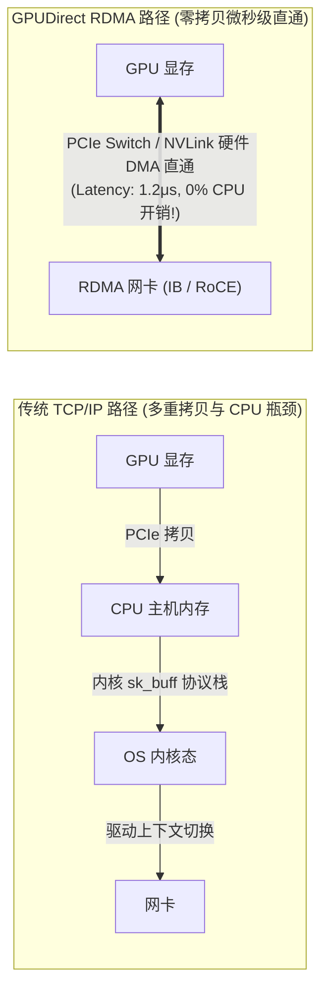
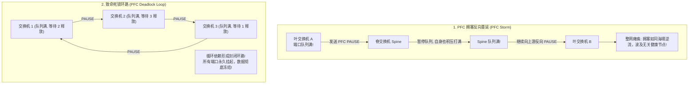
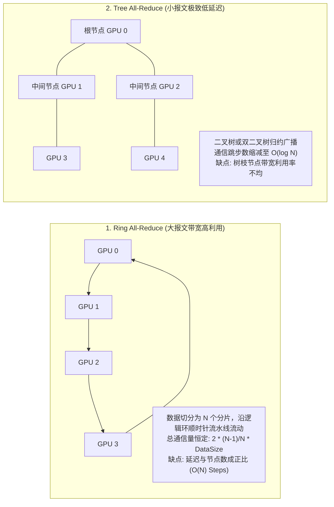

**TL;DR：** 在超大规模 GPU 集群（万卡至数万卡规模）的分布式深度学习训练中，**网络不再仅仅是传输数据的通道，而是整台“超级计算机内部的系统总线”**。一个由 16,384 张 GPU 构成的千亿参数模型训练作业，每秒钟在网络 Fabric 中穿梭的梯度与激活值数据高达数十 PB。在如此极端的高并发突发流量下，只要网络中发生万分之一的微小丢包，就会引发 RDMA 传输重传；而单个交换机端口的微突发拥塞，会像多米诺骨牌一样通过优先级流控（PFC）反向蔓延，形成吞噬整座数据中心的“PFC 拥塞死锁环”，导致成万张单价几十万元的 GPU 瞬间全线静默挂起。

究竟是选择造价极其昂贵但开箱即用的 **InfiniBand（IB）**，还是选择基于以太网标准的 **RoCE v2（RDMA over Converged Ethernet）**？NVIDIA 的 **NCCL（NVIDIA Collective Communications Library）** 底层是如何在 Ring（环形）与 Tree（树形）拓扑之间切换以压榨 95% 以上网络物理线速的？面对令人闻风丧胆的集群“慢卡（Straggler）”，万卡超算该如何实现毫秒级自动隔离？本文深入万卡物理网络底盘，拆解其真实工程架构。

---

## 一、动笔前任务卡与核心矛盾

| 任务字段 | 本篇架构推导与回答 |
| :--- | :--- |
| **目标读者** | 负责万卡 GPU 超算中心、AI 算力网络组网规划、RDMA 内核调优与大规模分布式训练稳定性的资深网络与系统架构师。 |
| **核心问题** | 为什么以太网做 RDMA 会频发 PFC 死锁？RoCE v2 与 InfiniBand 在物理硬件与协议层有何本质区别？NCCL 的集合通信算法如何在物理导轨（Rail）拓扑上实现算网最优协同？ |
| **知识主角** | 无损以太网（Lossless Ethernet）、InfiniBand vs RoCE v2、PFC（Priority-based Flow Control）死锁环、ECN/DCQCN 拥塞控制、NCCL Ring/Tree 算法、Rail-Optimized 导轨拓扑。 |
| **熟悉入口** | TCP/IP 滑动窗口、交换机 QoS 队列、`ibstat` / `rdma` 命令行工具。 |
| **因果主线** | 万卡梯度同步的超高突发带宽需求 $\to$ RDMA 旁路内核零拷贝 $\to$ InfiniBand 信用流控 vs RoCE 丢包敏感性 $\to$ PFC 暂停帧蔓延与死锁环成因 $\to$ DCQCN 拥塞调优与 NCCL 导轨拓扑工程落地。 |

---

## 二、万卡网络的物理底盘：为什么传统 TCP/IP 彻底出局？

在传统互联网数据中心，TCP/IP 是通信的绝对统治者。然而在 GPU 分布式训练中，**TCP/IP 协议栈是完全不可接受的巨大性能黑洞**：

```text
┌────────────────────────────────────────────────────────────────────────┐
│                        传统 TCP/IP vs 现代 RDMA 网络                   │
├───────────────────┬──────────────────────┬─────────────────────────────┤
│ 维度              │ 传统 TCP/IP 栈       │ RDMA (Kernel Bypass)        │
├───────────────────┼──────────────────────┼─────────────────────────────┤
│ 1. 内核参与度     │ 必须陷入内核态软中断 │ 完全旁路内核 (Kernel Bypass)│
│ 2. 内存复制次数   │ 3 次 (Socket/内核/网卡)│ 0 次 (硬件 DMA 显存直通)    │
│ 3. 单向通信延迟   │ 10 ~ 50 微秒 (μs)    │ 1 ~ 2 微秒 (μs)             │
│ 4. CPU 开销       │ 跑满多个 CPU 核心    │ 0% CPU 占用 (网卡硬件协处理)│
│ 5. GPU 间直通     │ 必须途经主机内存中转 │ GPUDirect RDMA (卡对卡直通) │
└───────────────────┴──────────────────────┴─────────────────────────────┘
```



通过 **GPUDirect RDMA**，GPU 0 的 HBM 显存可以通过机内的 PCIe Switch 直接向 RDMA 网卡发起 DMA 传输，跳过 CPU 与操作系统内核，直接打到远端机器 GPU 1 的显存中。这不仅消除了 CPU 瓶颈，还将网络延迟压缩到了极限的 **1~2 微秒**！

---

## 三、双雄对决：InfiniBand 极速黑盒 vs RoCE v2 开放以太网

在大规模 GPU 集群的硬件选型中，业界始终存在着两大技术路线的剧烈博弈：

```text
┌────────────────────────────────────────────────────────────────────────┐
│                        InfiniBand vs RoCE v2 深度对比                  │
├───────────────────┬──────────────────────┬─────────────────────────────┤
│ 指标              │ NVIDIA InfiniBand    │ RoCE v2 (无损以太网)        │
├───────────────────┼──────────────────────┼─────────────────────────────┤
│ 物理网络层        │ 专有 IB 物理层与线缆 │ 标准以太网 (IEEE 802.3)     │
│ 流控机制          │ 基于信用机制 (Credit)│ 优先级流控 (PFC 802.1Qbb)   │
│ 控制面拓扑        │ Subnet Manager 集中式│ BGP / EVPN 分布式路由       │
│ 拥塞响应速度      │ 纳秒级 (硬件闭环)    │ 微秒级 (依赖 ECN 标记回传)  │
│ 交换机与网卡生态  │ NVIDIA 独家垄断      │ 开放生态 (Broadcom/Arista等)│
│ 部署维护成本      │ 极度高昂             │ 相比 IB 降低 30% ~ 50%      │
│ 故障排查难度      │ 专有工具，相对封闭   │ 标准网络抓包与成熟监控体系  │
└───────────────────┴──────────────────────┴─────────────────────────────┘
```

### 3.1 InfiniBand 的物理硬件优势：Credit-Based Flow Control
InfiniBand 为什么能在万卡规模下做到近乎 100% 的线性加速比？其核心王牌在于 **基于信用令牌的逐跳硬件流控（Credit-based Flow Control）**：
- 发送端网卡在向交换机端口发送数据之前，必须先询问该端口当前剩余的接收缓冲区大小（Credits）；
- 如果接收端只有 10KB 缓冲区，发送端最多只发 10KB；**没有 Credit，发送端在硬件物理层直接停发**；
- **数学结论**：InfiniBand 在链路层从根本上杜绝了缓冲区溢出（Buffer Overflow），**物理层天生具备 100% 无损性**！

### 3.2 RoCE v2 的现实妥协：为什么以太网做“无损”如此艰难？
标准以太网从诞生的第一天起就是为 **“尽力而为（Best-Effort）”** 的丢包重传模型设计的。为了让以太网也能跑 RDMA，业界制定了 **RoCE v2** 规范（将 InfiniBand 传输层报文封装进 UDP/IP 包中）。

然而，UDP 是不可靠传输，RDMA 的 Go-Back-N 硬件重传代价极其惨烈（一旦丢 1 个包，后续成百上千个连续包全部作废重传）。
为了让以太网不丢包，网络工程师被迫在交换机上开启 **PFC（Priority-based Flow Control，IEEE 802.1Qbb）**：
- 当下游交换机端口队列深度超过阈值时，向上一跳反向发送一个 `PFC PAUSE` 暂停帧；
- 上一跳交换机收到 PAUSE 帧后，立即暂停向该优先级队列发送数据，防止下游溢出。

**正是这个看似美好的 PFC 机制，成为了以太网算力网络中最可怕的灾难源泉！**

---

## 四、噩梦之源：PFC 拥塞风暴与死锁环（PFC Deadlock）

在万卡大规模拓扑中，PFC 极易演化为毁灭性的 **PFC 拥塞扩散与死锁环**：



### 4.1 拥塞死锁环是如何闭合的？
在大模型 All-to-All 极度复杂的全互联通信中，流量在 Fat-Tree 拓扑的叶（Leaf）和脊（Spine）交换机之间双向对穿：
1. 交换机 1 正在发送流量给交换机 2，但交换机 2 队列满，向交换机 1 发送 PAUSE；
2. 交换机 2 正在向交换机 3 发送，交换机 3 也队列满，向交换机 2 发送 PAUSE；
3. 交换机 3 恰好有反向流量需要发往交换机 1，因此也在等待交换机 1 释放空间；
4. **环路闭合（Cyclic Dependency）**：三个交换机互相等待对方释放缓冲区，所有的数据包全部卡死在内存队列中，网络吞吐直接跌至 **0 bps**！

### 4.2 工业级破局解法：ECN 显式拥塞通知与 DCQCN 算法
为了彻底防范 PFC 死锁，生产级 RoCE v2 必须配置 **ECN（Explicit Congestion Notification）与 DCQCN（Data Center Quantized Congestion Notification）** 拥塞控制算法：

```text
┌────────────────────────────────────────────────────────────────────────┐
│                        RoCE v2 拥塞控制双门限模型                      │
├────────────────────────────────────────────────────────────────────────┤
│                                                                        │
│   ▲ 交换机队列深度 (Queue Depth)                                       │
│   │                                                                    │
│   ├──────────────────────────────────────── PFC Pause Threshold (硬拦截)│
│   │  ▲ 最后防线: 只有在极罕见拥塞时才允许触发 PFC PAUSE，严防滥用      │
│   │                                                                    │
│   ├──────────────────────────────────────── ECN K_max (100% 概率标记)   │
│   │  ▲                                                                 │
│   │  │ 拥塞区间: 交换机不丢包，而是在 IP 头中打上 CE (Congestion) 标记 │
│   │  ▼ 接收端收到标记包后，反向发送 CNP (Congestion Notification Packet)│
│   ├──────────────────────────────────────── ECN K_min (开始概率标记)   │
│   │                                                                    │
│   └──────────────────────────────────────── 0 (完全健康)               │
│                                                                        │
└────────────────────────────────────────────────────────────────────────┘
```
**核心原则**：**宁可让源端网卡提前自发降速（Throttle），也绝不能轻易触发导致全网死锁的 PFC PAUSE 帧！**
通过将 ECN 的标记门限设置在 PFC 之前，网络在微秒级提前发现拥塞，网卡硬件自动降低发送速率，将队列深度死死压制在安全水位以下。

---

## 五、NCCL 集合通信优化与导轨拓扑（Rail-Optimized Topology）

硬件网络搭好后，如何将其与 NVIDIA GPU 进行最高效的连接？这完全由 **NCCL（NVIDIA Collective Communications Library）** 决定。

### 5.1 NCCL 核心通信算法：Ring vs Tree
在分布式训练中，梯度同步的核心操作是 **All-Reduce**（所有 GPU 汇聚各自的局部梯度求和，并广播回所有 GPU）：



- **Ring 算法**：当同步的数据量极大时（如几百 MB 的模型梯度），Ring 算法能够 100% 打满每一根网线的物理全双工带宽；
- **Tree 算法（Double Binary Tree）**：当节点规模达到几千张卡且同步数据较小（如 MoE 门控路由张量）时，NCCL 自动切换为双二叉树算法，将通信跳步从数千步大幅压缩至 $\log_2 N$ 步。

### 5.2 导轨优化网络拓扑（Rail-Optimized Network）
在一台典型的 8 卡 H100 训练服务器中，插有 8 块 400G 的 RDMA 网卡。
如何连接交换机？传统网络管理员习惯将一台机器的 8 张网卡插在同一台接入交换机（Leaf Switch）上。**这是严重的架构反模式！**

**工业界标准的“导轨优化架构（Rail-Optimized）”**：
- 每一台服务器上的第 $k$ 块网卡，分别插入专属的第 $k$ 组独立的交换机网络平面（Rail $0 \sim 7$）；
- 例如，所有服务器上的 GPU 0（负责张量并行的第 0 块分片），在物理网络上拥有专属的直连 Fabric 平面，彼此通信绝对不需要经过任何跨平面的哈希碰撞！

```text
┌────────────────────────────────────────────────────────────────────────┐
│                        万卡 Rail-Optimized 物理导轨拓扑                │
├────────────────────────────────────────────────────────────────────────┤
│                                                                        │
│   [Server 1]   GPU 0   GPU 1   GPU 2   ...   GPU 7                     │
│                  │       │       │             │                       │
│   [Server 2]   GPU 0   GPU 1   GPU 2   ...   GPU 7                     │
│                  │       │       │             │                       │
│                  ▼       ▼       ▼             ▼                       │
│   网络平面:   [Rail 0] [Rail 1] [Rail 2] ... [Rail 7]                  │
│                                                                        │
│   每个 Rail 平面拥有完全独立的无损交换机集群，跨平面流量绝对隔离!       │
│                                                                        │
└────────────────────────────────────────────────────────────────────────┘
```

---

## 六、生产杀手：集群慢节点（Straggler）的毫秒级自动隔离

在万卡大规模训练中，有一种比“机器直接宕机”更恐怖的现象：**慢节点（Straggler）**。

### 6.1 慢节点为何能瘫痪整座数据中心？
- 假设集群中有 16,384 张卡，其中只有 **1 张卡** 因为光纤接头微弯、光衰过大，网络带宽从 400 Gbps 跌落到了 50 Gbps；
- 在 Ring All-Reduce 环形同步中，**环的整体流速取决于木桶最短的那根板**！
- 数据流在经过这台慢卡时发生严重堵塞；后续的所有 16,383 张显卡，哪怕全部性能完好，也必须在 Barrier 处齐刷刷挂起等待！
- **结果**：价值数十亿元的超算集群，算力吞吐瞬间下跌 **80%**，排查日志却看不到任何 Error 报错（因为网络没有断，只是变慢了）。

### 6.2 工业级自动化慢节点探测状态机
现代 AI 超算集群必须在网关与调度层挂载常态化硬件探针：
1. **基于 NCCL Trace 的偏离度检测**：
   实时采集所有节点的 `allreduce_time`，计算中位数与四分位距（IQR）。一旦某个节点的通信耗时超过集群均值的 **$3\sigma$（3倍标准差）** 且持续 3 个 Step；
2. **快速硬件断言验证**：
   调度器立即对疑似慢节点注入微秒级点对点 RDMA Loopback 探测；
3. **自动化动态摘除与热备卡替换（In-place Node Swapping）**：
   从热备池（Hot Spare Pool）中秒级拉起健康节点，通过修改动态 NCCL 通信拓扑（Communicator Rebuild），将慢节点直接踢出训练环并触发自动化告警工单。

---

## 七、总结与工程决策边界

万卡算力网络的搭建与调优，是深度学习世界中与物理现实贴合最紧密的硬核工程：
1. **无损通信是万卡的基础不变量**：无论是选择专有高贵的 InfiniBand，还是走向开放的 RoCE v2，必须通过精密的流控（Credit 或 ECN/PFC）将丢包率压制在绝对为零的物理极限；
2. **算法必须与网络拓扑同构**：NCCL 的 Ring/Tree 选择与 Rail-Optimized 物理布线紧密耦合，忽视物理布线的逻辑通信调度必然遭遇严重的跨叶跨脊拥塞；
3. **容灾能力决定最终有效算力（Goodput）**：网络规模放大到万卡级别后，硬件故障与光衰是常态。唯有建立起包含自动慢节点嗅探与毫秒级拓扑重构的弹性防御系统，才能确保训练任务在万卡上稳定狂奔数月不停歇。

在下一篇（系列收官之作）中，我们将深入探讨超大规模训练的终极韧性底座：**《前沿大模型训练与全栈 Infra 解密（五）：万卡容灾与弹性训练 —— 2.5 秒近无感 Checkpoint、跨可用区故障自愈与异步流水线》**！

---

## 参考资料与规范出处

1. **InfiniBand Trade Association (IBTA)**: *InfiniBand Architecture Specification Volume 1 & Volume 2*, 2023.
2. **IEEE Standards Association**: *IEEE 802.1Qbb: Priority-based Flow Control (PFC) Standard*, 2011.
3. **Zhu, Y., et al. (2015)**: *Congestion Control for Large-Scale RDMA Deployments (DCQCN)*, ACM SIGCOMM 2015.
4. **NVIDIA Corporation**: *NVIDIA Collective Communications Library (NCCL) Developer Guide & Architecture*, 2024. [https://github.com/NVIDIA/nccl](https://github.com/NVIDIA/nccl).
5. **Meta Engineering**: *Building Meta’s GenAI Infrastructure: 24k GPU Clusters with RoCE and InfiniBand*, Meta Engineering Blog, 2024.
