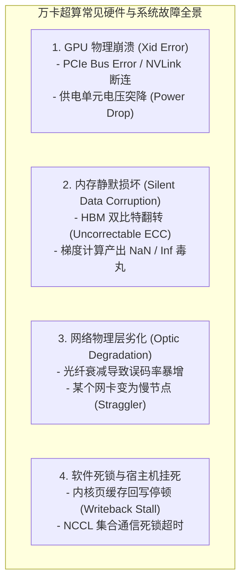
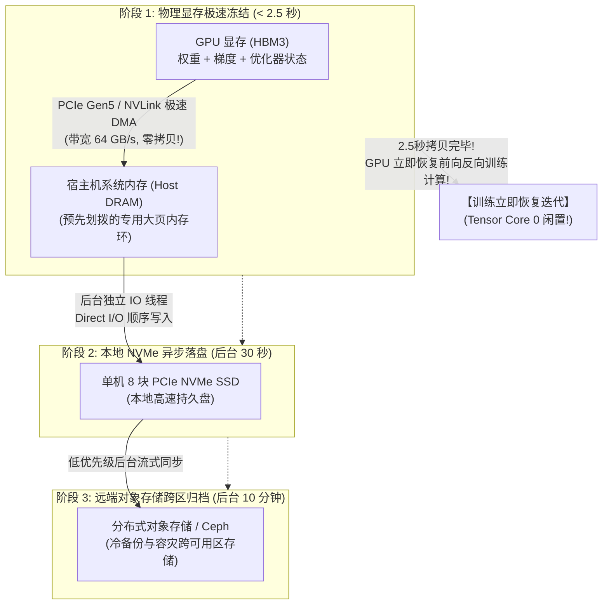
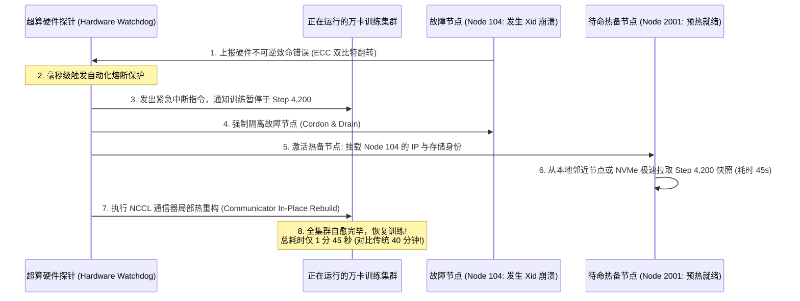

**TL;DR：** 在小规模分布式系统中，节点故障往往是“罕见意外”；然而当算力集群膨胀到 16,384 张甚至数万张高端 GPU 时，**硬件故障变成了每时每刻都在发生的“必然物理常态”**。统计数据显示，万卡集群的平均无故障时间（MTBF: Mean Time Between Failures）通常只有 **2 到 3 个小时**——哪怕单个元器件的年故障率只有 0.1%，数万个 GPU 核心、HBM 显存颗粒、NVLink 桥接芯片、高速光模块与供电单元累加在一起，也会引发几乎每隔几小时就发生的节点崩溃或静默数据损坏。

在传统的训练方案中，容灾完全是一场**吞噬宝贵算力的灾难**：为了保住训练成果，集群每隔几小时就必须完全挂起所有卡，耗费 20~30 分钟将数十 TB 的权重和优化器状态慢慢倾倒到远程存储；一旦遇到宕机，销毁重建作业又要花费半小时从头加载。全集群真正的有效计算时间（Goodput）往往被腰斩至 50% 以下，数亿元算力被白白虚耗。Meta 与 DeepSeek 最前沿的万卡超算架构，彻底打破了这一桎梏。本文作为《前沿大模型训练与全栈 Infra 解密》系列的收官之作，全面解密 **“2.5 秒近无感三级 Checkpoint”**、**“坏卡原地热备秒级替换”** 以及 **“Loss Spike 梯度前向回滚”** 的终极工程落地。

---

## 一、动笔前任务卡与核心矛盾

| 任务字段 | 本篇架构推导与回答 |
| :--- | :--- |
| **目标读者** | 负责超大规模集群分布式训练、超算调度平台、模型工程稳定性与万卡集群 Goodput 优化的资深架构师与平台专家。 |
| **核心问题** | 为什么万卡集群频繁挂掉？如何在几乎不中断训练（< 2.5秒）的前提下持久化数百 TB 显存状态？坏卡发生时如何避免全局销毁重建？ |
| **知识主角** | 万卡容灾体系、三级异步 Checkpoint（3-Tier Async Checkpoint）、有效算力利用率（Goodput）、原地秒级自愈替换、Loss Spike 异常拦截。 |
| **熟悉入口** | PyTorch `torch.save` / `DDP`、Kubernetes Job 重启、Redis RDB 后台快照。 |
| **因果主线** | 万卡规模下的 MTBF 物理归零 $\to$ 传统全量同步保存拖垮 Goodput $\to$ 三级异步持久化流水线（显存 $\to$ Host内存 $\to$ NVMe $\to$ 远端） $\to$ 原地热备重连与微秒级拓扑自愈 $\to$ 全系列架构闭环。 |

---

## 二、万卡超算的物理残酷性：MTBF 崩塌与故障全景

许多初学者常常误以为万卡训练是“一次性提交任务，几个月后收获大模型权重”。但在工程现实中，**万卡训练是一场在连续故障中惊险求生的极限走钢丝**：

```text
万卡集群典型元器件故障率与 MTBF 估算:
- 单张 H100 GPU 芯片年故障率 (AFR): ~3%
- 8 卡服务器整机 (含 CPU、主板、电源、风扇) AFR: ~10%
- 400G 光模块与光纤网络接头故障率: ~1.5%

当集群规模达到 16,384 张 GPU (2,048 台服务器，数万根高速光纤):
- 每日硬件故障期望事件: ~3.5 次!
- 集群平均无故障连续运行时间 (MTBF): 仅约 2.5 ~ 4 小时!
```



如果采用传统的“单点崩溃，全局失败重启”策略，工程师每天将有 80% 的时间在人工排查节点、重启 K8s Job 和恢复进度中度过，**模型几乎永远不可能在万卡集群上收敛**。

---

## 三、有效算力比（Goodput）：衡量万卡基础设施的唯一黄金标尺

在大模型基础设施工程中，存在一个区分业余团队与顶级 Infra 团队的终极指标 —— **Goodput（有效算力比）**：

$$\text{Goodput} = \frac{\text{纯净用于前向反向计算的有效时间}}{\text{集群申请占用的总物理时间}} = \frac{T_{\text{compute}}}{T_{\text{compute}} + T_{\text{checkpoint}} + T_{\text{failure}} + T_{\text{recovery}}}$$

```text
┌────────────────────────────────────────────────────────────────────────┐
│                        传统架构 vs 顶级架构 Goodput 对比               │
├───────────────────┬──────────────────────┬─────────────────────────────┤
│ 阶段              │ 传统开源粗放架构     │ 顶级架构 (Meta/DeepSeek)    │
├───────────────────┼──────────────────────┼─────────────────────────────┤
│ 1. Checkpoint 耗时│ 25 分钟 (全网完全挂起)│ 2.5 秒 (片上瞬时快照)       │
│ 2. 故障排查与定位 │ 30 分钟 (人工看日志) │ 10 秒 (自动化硬件探针精准定界)│
│ 3. 故障恢复与重拉 │ 40 分钟 (重造万卡Job)│ 2 分钟 (原地热备秒级替换)   │
│ 4. 最终 Goodput   │ 42% ~ 55% (极其惨烈) │ 90% ~ 95% (逼近物理极限)    │
└───────────────────┴──────────────────────┴─────────────────────────────┘
```

**Goodput 从 50% 提升至 90%，意味着在完全相同的万卡算力支出下，模型研发周期直接缩短一半，净省数千万元硬件电费与折旧成本！**

---

## 四、2.5 秒近无感三级 Checkpoint 架构解密

传统 Checkpoint 之所以慢，是因为它试图一次性把数百 TB 的数据直接写入远端分布式文件系统（如 Ceph 或 Lustre）：
- 万卡分布式保存不仅严重受到网络出方向带宽限制，而且极易遭遇分布式存储元数据服务器的并发争用，导致写操作挂起数十秒甚至半小时。

Meta 与 DeepSeek 采用了极其精妙的 **三级近无感异步存储流水线（3-Tier Asynchronous Checkpoint Pipeline）**：



### 4.1 核心解耦机制：利用 Host 内存充当“安全气囊”
在高性能 8 卡训练服务器中，通常配备有 **2TB 的 Host 物理内存（DRAM）**。
- 单台机器 8 张卡在训练过程中需要持久化的状态量（经过 ZeRO-3 或 FSDP 分片后）通常在 **100GB ~ 200GB** 之间；
- PCIe Gen5 拥有单向 **64 GB/s** 的物理吞吐；
- **计算物理耗时**：
  $$T_{\text{freeze}} = \frac{150 \text{ GB}}{64 \text{ GB/s}} \approx 2.34 \text{ 秒！}$$
- **工程神来之笔**：只要把数据成功搬运进 Host 宿主机内存，GPU 就可以解除状态冻结，立即启动下一个 Step 的前向计算！
- 至于将数据从 Host 内存刷入本地 NVMe 固态硬盘、以及从 NVMe 传输到跨机房的 S3 对象存储，完全交给 CPU 后台低优先级线程异步慢慢做，**全程与昂贵的 GPU 计算时间线完全解耦**！

---

## 五、原地热备秒级自愈与弹性拓扑重构（In-Place Hot-Spare Swapping）

在万卡集群中，传统的 Kubernetes 容器调度模式（销毁崩溃 Pod，等待 Scheduler 寻找新节点并重建）在大模型场景下是极其笨拙的反模式：
- 重新拉起 2,048 个 Pod，仅镜像拉取和网络握手就要花费 15 分钟；
- 重新初始化 NCCL 通信拓扑需要建立数万条全互联连接；
- 整个集群陷入长时间的剧烈抖动。

### 5.1 原地热备自愈机制（In-Place Self-Healing）
现代超算平台在物理机房中预先划拨 **2%~3% 的节点作为常驻热备池（Hot Spare Standby Pool）**：



### 5.2 核心突破：NCCL 动态通信域重构
传统 NCCL 要求一旦节点变动，必须调用 `ncclCommDestroy` 销毁所有通信器并全量重建。
现在的弹性训练框架（如 Torch Elastic / Megatron-LM 扩展）支持 **局域通信拓扑热修补（Sub-Communicator Dynamic Patching）**：
- 仅仅修补受到故障节点影响的那一个 TP/PP/EP 逻辑切片环路；
- 其余数千个不受影响的健康节点无需重新进行全量握手，将拓扑恢复时间从几十分钟彻底打到 **几十秒以内**。

---

## 六、算法与系统的交叉防护：Loss Spike 早期预警与梯度散度拦截

除了硬件故障，超大规模训练中还潜伏着令所有算法工程师闻风丧胆的“软性幽灵” —— **Loss 异常爆炸（Loss Spike）**：

```text
典型 Loss Spike 现场:
Step 10,450: Loss = 2.145 (训练平稳收敛)
Step 10,451: Loss = 2.143
Step 10,452: Loss = 18.942 (突发激增!)
Step 10,453: Loss = NaN (数值溢出，模型彻底废掉，梯度权重全部崩坏!)
```

### 6.1 Loss Spike 的深层成因与传统痛苦
- **成因**：由于训练数据中混入了低质异常样本（如畸形长文本、乱码），或者某张 GPU 在执行 FP8 矩阵乘时发生了微小的静默计算错误（Silent Bug），导致激活值瞬间溢出；
- **传统痛苦**：算法工程师第二天才发现模型跑飞了，被迫翻看昨天的 Checkpoint，回滚整整一天（浪费数千万元算力）重新跑。

### 6.2 网关与训练引擎的“前向智能刹车”状态机
现代训练底座在网关和训练循环中内置了 **数学散度看门狗（Gradient Divergence Watchdog）**：

```python
# 生产级 Loss Spike 自动监控与前向回滚状态机
class TrainingResilienceWatchdog:
    def __init__(self, spike_threshold: float = 3.0, max_rollback_steps: int = 5):
        self.spike_threshold = spike_threshold
        self.loss_history = []
        self.recent_checkpoints = [] # 内存中保留最近 3 个 Step 的轻量快照

    def inspect_step(self, current_step: int, loss: float, grad_norm: float) -> bool:
        # 1. 检查是否存在数值崩溃毒丸
        if math.isnan(loss) or math.isinf(loss) or math.isnan(grad_norm):
            logger.critical(f"FATAL: NaN/Inf detected at step {current_step}!")
            return False

        # 2. 检查相对历史均值的偏离度 (Loss Spike 异常跳变)
        if len(self.loss_history) >= 20:
            avg_loss = sum(self.loss_history[-20:]) / 20.0
            if loss > avg_loss * self.spike_threshold:
                logger.warning(
                    f"WARNING: Loss Spike detected at step {current_step}! "
                    f"Current Loss: {loss:.3f}, Moving Avg: {avg_loss:.3f}"
                )
                return False

        self.loss_history.append(loss)
        return True

    def trigger_auto_recovery(self, current_step: int):
        """
        触发自动化前向回滚与数据跳过
        """
        logger.info(f"Initiating Rollback from In-Memory Snapshot to Step {current_step - 1}...")
        # 1. 从宿主机 DRAM 恢复上一个健康 Step 的显存状态 (耗时 < 2秒)
        self.restore_last_healthy_snapshot()
        # 2. 动态通知数据加载器 (DataLoader) 跳过引发本次 Spike 的有毒 Batch 数据
        self.skip_toxic_data_batch()
        logger.info("Training successfully resumed with toxic sample quarantined!")
```
通过在 Host 内存中始终保留最近 3 个 Step 的轻量显存快照，一旦发现 Loss 异常飙升，**系统自动在 2 秒内秒级回滚到上一 Step，自动跳过污染数据样本继续向前训练**，实现了真正的全自主无人值守。

---

## 七、《前沿大模型训练与全栈 Infra 解密》全系列总结与终极版图

到这里，《前沿大模型训练与全栈 Infra 解密》全系列五篇的核心架构与工程实战全景落地完成。

我们完整推导了驱动当代数万卡超算集群高效运转的底层物理支柱：

```text
┌────────────────────────────────────────────────────────────────────────┐
│             《前沿大模型训练与全栈 Infra 解密》五篇全景技术版图        │
├────────────────────────────────────────────────────────────────────────┤
│                                                                        │
│   01 并行切分: 3D 并行拓扑 (TP/PP/DP/ZeRO) —— 千亿模型物理拆解        │
│        │                                                               │
│   02 算子极限: FlashAttention 1/2/3 访存平铺与 Hopper TMA 异步硬件加速  │
│        │                                                               │
│   03 稀疏计算: MoE 专家并行、DeepSeek-V3 动态偏置与 100% 算网重叠      │
│        │                                                               │
│   04 超算网络: InfiniBand vs RoCE v2、PFC 死锁防御与 NCCL 导轨优化     │
│        │                                                               │
│   05 容灾终局: 2.5 秒三级 Checkpoint、坏卡原地热备自愈与 Goodput 破 90% │
│                                                                        │
└────────────────────────────────────────────────────────────────────────┘
```

从数学算子的精妙分块，到单机 NVLink 物理显存的 3D 拓扑切分；从数万卡跨交换机的无损网络通信，到面对频繁宕机时的微秒级弹性自愈 —— **这就是现代大模型全栈基础设施（AI Infra）最真实、最硬核的系统底盘！**

---

## 参考资料与规范出处

1. **Meta Engineering**: *The Technology Behind Meta’s 24k GPU Clusters: Reliable Large-Scale Training Infrastructure*, Meta Engineering Blog, 2024.
2. **DeepSeek-AI**: *DeepSeek-V3 Technical Report: DualPipe, Asynchronous Checkpointing and Fault Tolerance*, 2024.
3. **Zheng, Z., et al. (2024)**: *MegaScale: Scaling Large Language Model Training to More Than 10,000 GPUs*, USENIX NSDI 2024.
4. **NVIDIA Corporation**: *High Availability and Fault Recovery in NVIDIA Quantum InfiniBand GPU Superclusters*, 2024.
5. **Patterson, D., et al. (2021)**: *The Carbon Footprint of Machine Learning Training Will Plateau, Then Shrink*, IEEE Computer. (训练 Goodput 与能效比奠基论述).
