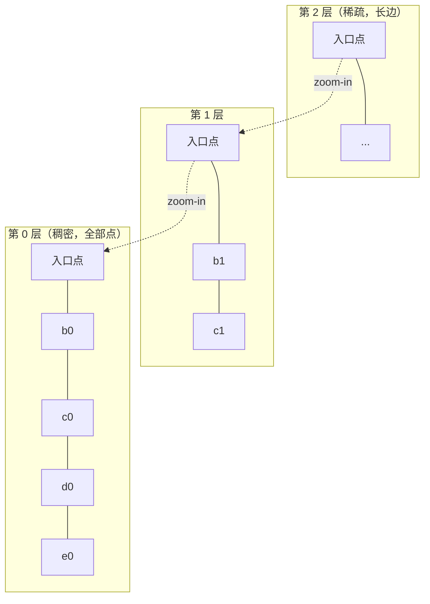

**TL;DR：** 向量检索的难点通常不在一次距离计算，而在如何减少候选：精确 k-NN 在没有额外数据结构假设时要扫描全库，ANN 则用不同的近似承诺缩小搜索范围。本文聚焦三类常见路线：HNSW 用多层图和候选宽度换召回；IVF 用聚类桶和 `nprobe` 换扫描量；PQ 用乘积量化换存储字节，再用 ADC 查表估算距离。召回、时延、内存不是数学上固定的“三选二”，而是一条随数据分布、参数、硬件和并发变化的 Pareto 前沿。RAG 只能先用内存、召回目标和延迟预算筛掉方案，最终仍要用真实 embedding 与目标引擎验证。

## 一、 精确最近邻为什么慢：全量扫描，和三个度量

「向量检索」四个字会让人以为难在距离计算。拆开看不是：d=128 维的 L2 距离只是固定长度的乘加；本文不绑定单核单次延迟数字。真正的成本是次数——精确 k-NN 要对库中每个向量算一次，100 万条就是 100 万次距离，外加约 512,000,000 字节（约 488 MiB）的向量读取，尚未计入缓存、对齐和其他元数据。这才是向量检索的账单主体：不是只问“怎么算得快”，还要问“能不能少算”。

为什么不能直接照搬 B-tree 的 O(log N)？因为欧氏空间没有同样的一维全序，常见的树形划分在高维和分布变化下可能退化；精确索引也不是永远只能全扫，但要取得通用的精确保证，通常必须承担更高的索引或计算成本。于是工程上常用近似最近邻（ANN）：不保证返回真最近邻，而是用可调参数换取某个数据集上的召回/时延折中。至少要同时记录三类指标：

- **召回率 recall@k**：对一批查询，返回的 top-k 里包含多少真最近邻，平均占比 = |返回 ∩ 真值| / k。它度量「近似掉了多少精度」，1.0 就是没掉。
- **QPS / 时延**：吞吐与单查询耗时，决定你扛不扛得住并发。
- **内存**：索引占多少字节，含向量本体和附加结构。

三个指标只能同时压两个，第三个必须靠参数赎回来——这正是后面三条路各自的位置。

## 二、 HNSW：用一张多层图换召回

HNSW 的思路是把数据集组织成一张多层图：顶层稀疏、连的都是长边（相当于跳表的高速公路），底层稠密、连的都是短边（街区里的路）。搜索从顶层入口开始，每层贪心走向最近节点，逐层 zoom-in 到底层，再用优先队列按 beam 宽度扩展候选。节点层级按随机分布产生，期望最大层随数据规模呈对数增长；查询在常见分布和参数下表现出近似对数扩展，但这不是对任意数据分布、实现和召回目标的硬复杂度保证。



建图（插入）的正确理解是这样三步：新点按一个指数衰减的随机分布分配自己的最大层 l（高层只有少数点进得去，这就是「跳表式」的来源）；从顶层入口开始贪心定位；在 [0..l] 每一层做一次带 beam 的搜索，选出 M 个邻居，并用 diversity heuristic（保证邻居方向分散、不挤成一团）建双向边。整个构造是「随机分配层 + 贪心 + 优先队列 + 邻居多样性修剪」。

三个旋钮，各管一件事：

- **M**：控制图的连接度。常见实现中上层每个节点的邻居上限约为 M，底层可能使用更大的上限（例如 hnswlib 的 level-0 约为 2M）；M 越大图越密、单点候选越多，召回通常更高。按 M=16、只计算底层双向邻接的 4 字节 ID，邻接 ID 的账约为 2×M×4 = 128 字节/节点；这只是 payload 下界，不含层级、链表、对齐和分配器开销，不能直接写成实际索引大小。查询时每次展开的邻居也会增加，所以时延随 M 的变化必须实测。M 是内存与召回之间的第一枚旋钮。
- **efConstruction**：建图时 beam 的宽度。越大，每层选邻居的候选池越大，选出来的边越接近真近邻，图质量越高；只影响建库成本，不占查询时的内存。
- **efSearch**：查询时 beam 的宽度。越大召回越高、时延越大。它和 IVF 的 `nprobe` 一样是**查询期旋钮——直接改字段、不用重建索引**，召回预算可以在运行时按负载调；HNSW 的差异不在「能调」，在召回基线更高、调整对结果更直接。

一句话总结 HNSW 的取舍：它押的是「召回 + 较低搜索工作量」，用图空间和建库成本换候选步数。代价不只是内存，还有写侧——插入要逐层搜索定位再建边，M 和 efConstruction 调大后建库通常更贵；图的局部性、更新/删除支持和召回收益都要按数据集验证。这和 LSM 的写放大是同一种预算思路：读侧更快，是靠写侧多付的成本换来的，见[LSM 与 B-tree 的读写放大](/writing/lsm-vs-btree-io-amplification)。

## 三、 IVF：用聚类桶换速度

IVF（Inverted File）押的是「速度 + 内存」。训练阶段用 k-means 把库分成 nlist 个簇，每簇一个质心（这就是 coarse quantizer）；每个向量被放进最近质心的倒排桶。查询时先算 query 到 nlist 个质心的全精度距离——nlist 次，很便宜——只进入最近的 nprobe 个桶，桶内线性扫描所有向量算全精度距离，取全局 top-k。

- **nprobe=1** 时只有一个桶参与精确/近似扫描；只有在桶大小接近均匀时，才可以把扫描量粗略看成全库的约 1/nlist。nlist=1000 不等于任何数据集都只扫千分之一，偏斜分布会让热点桶大得多。
- **nprobe 是召回-时延旋钮**：探测的桶越多，真最近邻越可能落在探测集合里，召回越高、越慢；nprobe=nlist 时退化成全量扫描（还多付一次质心距离开销）。
- **上限在聚类质量**：IVF 的承诺是「相近的点大概率同簇」，它赌数据可分。数据可分，桶才干净；分布偏斜时某些桶巨大，桶内线性扫描长度不均，个别桶变成热点。
- **残差向量**：桶内存的是 x − 质心（residual），查询用 query − 质心对齐再算距离。这把「粗量化误差」从距离里剥掉一层，是 IVF-PQ 的标准做法——下一节的 PQ 误差会和粗量化叠加，能减一档是一档。

IVF 单用时（IVF-flat）桶内是精确距离，召回损失只在「走错桶」这一层；一旦叠加 PQ，就多一层向量本身的近似。这是第四节的主场。

## 四、 PQ：用量化换内存

PQ（乘积量化）押的是「内存」。思路是把 d 维向量切成 m 段子向量，每段 d/m 维；训练阶段对每一段各跑一个 k-means，得到 k 个质心的 codebook。一个向量最终被表示成 m 个索引——每段用「离它最近的质心」的编号，log2(k) 位。

一个具体例子：一个 32 字节的向量切成 m=8 段，每段 4 字节；每段配一个 256 质心（k=256，8 bit）的 codebook，则每段只需 1 字节索引 → 总共 8 字节，码 payload 是原向量的四分之一。128 维 float32 的 512 字节同理：m=8、k=256 时得到 8 字节码；如果实现还为每个向量保存 8 字节 ID，码与 ID 的示意 payload 是约 16 字节/向量，约为原向量的 1/32。它不是完整索引内存：codebook、桶结构、对齐、批量分配和实现元数据都还没算。「乘积」二字来自把高维空间写成 m 个子空间直积、各自独立量化——码本是 m 个小 codebook，而不是一个 k^m 级别的巨码本。

距离怎么算，是 PQ 的隐藏难点：库向量已经量化了，不能直接算。答案是 **ADC（非对称距离计算）**——query 保持全精度不量化，只有库向量量化，这是「非对称」的含义。对 query 的每一段，预计算它到该段 codebook 每个质心的距离（m 张表、每张 k 个浮点）；任意库向量与 query 的距离 = 按它的 m 个码逐段查表求和。查表把每次距离从 O(d) 乘加换成 O(m) 查表加和，这也是 PQ 不反量化就能算距离的原因。

代价在量化误差：库向量被质心近似，距离带了误差，召回上限下降。补偿手段有三档，按顺序试：加大 nprobe（候选变多，靠数量赢回质量，但每个候选的距离都不准）；加大 m（分段更细、量化更准，但每段维度变少、码本相对稀疏，存在最优折中）；加大 k/nbits（码本更大、量化更细，但要更多训练数据撑住 m×k（PQ）+ nlist（粗量化）个质心）。IVF-PQ 是两层量化——粗量化（分桶）加细量化（PQ），误差叠加，所以同样的 nprobe 下召回通常比 IVF-flat 低一截。

内存预算的思维方式，和 LLM 服务的显存预算是同一件事：都要先问「多少字节/单位」再谈规模，见[显存不是算力：KV cache 的字节账](/writing/llm-kv-cache-memory-budget)。

## 五、 三档对比表，和 RAG 场景的判断线

| 维度 | 暴力扫描（IndexFlatL2） | HNSW | IVF-PQ |
|------|----------------------|------|--------|
| 内存 | 向量本体 512 字节/向量（128 维 float32） | 向量本体 + 图/层级/分配器开销；M=16 时 128 字节只是底层邻接 ID 的简化账，不是总大小 | 8 字节 PQ code + 可选 ID 的 payload 约 16 字节/向量；codebook、桶和实现开销另计 |
| 召回 | 1.0（精确） | 高，efSearch 拉满接近精确 | 中，靠 nprobe 赎回 |
| 时延 | O(N)，随库规模线性增加；本文不绑定跨机器数字 | 由 M、efSearch、数据分布和硬件共同决定；本文不绑定跨机器数字 | 由 nprobe、桶大小、量化实现和硬件共同决定；本文不绑定跨机器数字 |
| 建库 | 无（直接 add） | M / efConstruction 越大，建图工作越多 | k-means 训练一次 + 量化训练（nlist 与 m 决定） |
| 适用条件 | 数据量和并发使全扫仍在预算内，或必须精确 | 图索引能放进内存，且目标数据集上的召回/更新语义可接受 | 内存是硬约束，能接受训练、量化误差和参数校准 |
| 参数旋钮 | 无 | M / efConstruction / efSearch | nlist / m / nprobe |
| 主要风险 | 时延随 N 线性 | 内存与建库成本 | 量化误差 + 聚类质量天花板 |

几个需要注明出处的数字：SIFT1M（100 万条 128 维 SIFT 描述子）和 GIST-1M（100 万条 960 维 GIST 描述子）是 ANN 领域的事实标准基准，HNSW 论文（Malkov & Yashunin, *Efficient and robust approximate nearest neighbor search using Hierarchical Navigable Small World graphs*, arXiv:1603.09320）的正文实验覆盖 SIFT1M、GIST-1M 等基准数据集。论文摘要给出的承诺是三个性质而不是具体毫秒数：层按指数衰减分布随机分配、搜索自上而下走，从而获得对数级复杂度扩展；邻居选择启发式显著提升高召回区间（99% 附近）的性能；整体显著优于当时的开源向量索引方案。论文正文的召回-查询时间曲线是论文所在机器的成绩，不是通用承诺；具体到你这台机器，唯一可信的数字来自第六节的实验脚本。跨硬件、跨数据集的召回-QPS 全景，见 ann-benchmarks 的 sift-128-euclidean 交互图（ann-benchmarks.com）。

RAG 场景怎么选，判断线可以压成一句：

> **先用内存预算、召回下限和尾延迟筛选，再在 HNSW、IVF-PQ 和 exact baseline 上做同语义对照；暴力扫描只在数据量、并发和精确性要求都允许时成立。**

为什么这条线成立（三种方案的语义承诺差异）：HNSW 押的是局部图结构在目标数据集上能找到足够好的候选，不应声称对任意分布都稳健；IVF 押的是相近点大概率同簇，前提是训练集和线上分布相近；PQ 再叠加“向量可以被近似表示”，把更多误差换成更低的存储字节。所以选择本质上是三个问题的答案：你信数据可分吗？你内存够吗？你要不要精确？RAG 可能有 reranker 兜底，但 reranker 不能修复候选根本没被召回的文档，召回下限仍需按业务评估。

但 RAG 还有一层预算纪律：检索时延要放进整条链路看。RAG 的生成是秒级，检索是毫秒级，先确认延迟预算花在哪个环节再调索引——检索再快，生成排队也会吃掉整张卡的利用率，见[LLM 推理的排队税：从静态批到 continuous batching](/writing/llm-continuous-batching-throughput)。RAG 后端整体没有魔法，向量检索只是其中一环，见[AI 应用的后端没有魔法](/writing/ai-backend-no-magic)。

## 六、 实验入口：把三角画成三条曲线

本地数字一律以你的机器为准。本文不引用任何「某博客测得 X QPS」——那是别人的机器和分布。以下是一组本机复现出的曲线（2026-08-18，Apple Silicon / 系统 Python 3.9.6 / faiss-cpu 1.13.0 / hnswlib，`N=50000, d=128, queries=500, k=10`，原始 CSV 与运行记录见 `evidence/vector-ann/2026-08-18-local/`，命令见下）——它演示的是三角形状，不是真实 embedding 分布的性能承诺。

脚本在 `experiments/vector-ann/run_ann_scan.py`：小规模随机数据集（默认 10 万条、128 维、1000 条查询、k=10，真值用 faiss IndexFlatL2 精确 top-10），跑三组：

- hnswlib 扫 HNSW：M ∈ {8,16,32} × efSearch ∈ {32,64,128,256}，efConstruction=200；
- faiss 扫 IVF-PQ：nlist=1000、m=8、nbits=8，nprobe ∈ {1,2,4,8,16,32,64,128,256}；
- faiss IndexFlatL2 暴力基线（recall=1.0 的单点）。

输出 `experiments/vector-ann/results/` 下三条曲线（recall-QPS、recall-索引体积、QPS-索引体积）和 `ann_scan.csv`。索引体积用序列化字节数（hnswlib save_index / faiss serialize_index），是内存的确定性代理；QPS 取 3 次批量搜索的最小值压计时噪声。

```bash
python3 -m venv .venv
.venv/bin/pip install numpy faiss-cpu hnswlib matplotlib
.venv/bin/python experiments/vector-ann/run_ann_scan.py \
  --n 100000 --d 128 --queries 1000 --k 10
```

依赖：numpy、faiss-cpu、hnswlib（matplotlib 可选，缺了只出 CSV 和表格，不出 PNG）。本机实测关键行的形状（合成随机数据，机制演示）：

| 索引 | 配置 | recall@10 | QPS | 序列化体积 |
| :--- | :--- | ---: | ---: | ---: |
| flat（精确） | — | 1.000 | 24,642 | 25.6 MB（= 全量向量） |
| HNSW | M=8, efS=32 | 0.283 | 89,515 | 29.9 MB |
| HNSW | M=16, efS=256 | 0.860 | 7,520 | 33.0 MB |
| HNSW | M=32, efS=256 | 0.951 | 4,691 | 39.4 MB（比 flat 大 54%） |
| IVF-PQ | nlist=1000, m=8, nprobe=256 | 0.063 | 25,228 | 1.45 MB（flat 的 1/17.6） |

三条规律就是正文的机制结论：HNSW 的 recall 与 QPS 是同一条曲线上的两个点（efSearch 升 → 召回升、吞吐降，M 升 → 体积升）；IVF-PQ 把体积压到 flat 的约 1/18，但 m=8 的量化在随机数据上把 recall 压到 0.06——"省内存"与"保精度"直接对撞。换个机器、换个真实分布，绝对数字会变，这三条形状不变。

## 七、结论：先想清楚哪一种误差进入预算

召回、时延、内存会形成一条受数据、参数和硬件影响的权衡前沿，三条近似索引路是三种不同的押注：HNSW 押图结构带来的候选质量，内存是价格；IVF 押分桶带来的扫描减少，召回依赖训练质量和 `nprobe`；PQ 押存储压缩，精度靠 ADC、更多候选和量化参数补偿。没有免费的“又准又快又省”，宣称三者同时最优时，要追问它是否漏算了邻接表、训练/构建成本、尾延迟或真实数据分布。

给读者的下一步是可执行的：跑一遍第六节的脚本，把你机器上的三条曲线贴出来，再换你自己的 embedding 维度和真实数据量重跑一次。评审时要能说出三种方案各自的语义承诺差异和失败条件（图搜索漏候选、走错桶、量化误差、内存超预算），比背出一个 QPS 数字有用得多。

## 参考资料

1. Malkov、Yashunin，*Efficient and robust approximate nearest neighbor search using Hierarchical Navigable Small World graphs*，arXiv:1603.09320：https://arxiv.org/abs/1603.09320
2. Jégou、Douze、Schmid，*Product quantization for nearest neighbor search*，IEEE TPAMI 2011：https://doi.org/10.1109/TPAMI.2010.57
3. Faiss 官方文档：IVF、PQ 与索引组合的实现说明：https://github.com/facebookresearch/faiss/wiki/Faiss-indexes
4. ann-benchmarks：不同数据集、硬件和实现下的 ANN 对照入口：https://ann-benchmarks.com/
