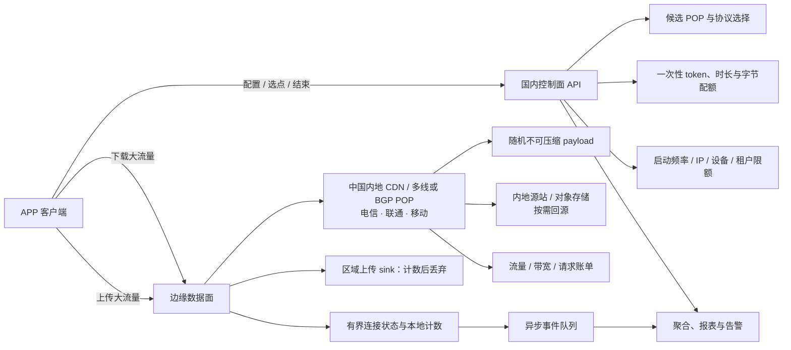

**TL;DR：** 设计 APP 测速服务端，先确定它要提供哪一种测试证据：边缘到客户端的峰值 goodput、真实业务路径的体验，还是带服务端遥测的网络诊断。推荐的国内服务端形态是三层：**控制面**签发测试 profile、短期 token、端点和配额；**数据面**用中国内地 CDN 或边缘节点提供不可压缩下载，用区域 sink 接收并丢弃上传；**观测与账单面**异步记录应用字节、边缘计费流量、源站回源、并发、过载和异常流量。容量先按「并发测试数 × 单测试吞吐」算出口，再算连接缓冲、TLS/CPU、请求数和国内 CDN 计费。客户端在这里不是主角，它只是执行服务端下发的测试合同并回传结果。

## 一、服务端先定义被测对象：同一个 /speed 不能回答五种问题

测速服务端真正要解决的第一个问题不是“返回多少 Mbps”，而是“这次测试的字节经过了哪些组件”。用户界面可以只有一个“开始测速”按钮，服务端却必须把测试对象写进 profile，否则 CDN、源站、业务 API 和自建节点的结果会被混在一起。

| 服务端测试模式 | 被测路径 | 服务端主要工作 | 不能得出的结论 |
|---|---|---|---|
| `edge_peak` | 中国内地 CDN/POP → 客户端 | 提供不可压缩 payload，控制时长、流数和边缘配额 | 不能代表你的业务 API 或源站吞吐 |
| `origin_path` | 指定源站/数据面 → CDN 或客户端 | 控制回源、缓存旁路、源站出口和连接复用 | 不能代表所有运营商都走同一条路径 |
| `app_quality` | 真实业务域名或真实业务风格的请求链路 | 记录首字节、业务响应、失败和服务端排队 | 不能把小 body 的结果叫接入带宽峰值 |
| `diagnostic` | 固定 POP/协议 + 服务端遥测 | 返回 RTT、重传、窗口受限、写阻塞和容量状态 | 不能用 HTTP 超时直接推导精确丢包率 |
| `capacity_probe` | 固定探针 → 固定服务端集群 | 在时间窗口内重复测试，记录公平性和过载 | 不能用随机用户点击替代容量压测 |

中国大陆的服务端端点还要把省份或城市、运营商、线路、IP 协议和 CDN POP 分开记录。北京的中国移动 5G、上海的中国电信宽带、企业 Wi-Fi 和教育网，可能走完全不同的链路；同一个城市里，CDN 根据客户端地址选到的 POP 也不等于云控制台里的地域。

服务端结果至少应带上 `province`、`isp`、`transport`、`ip_family`、`pop`、`endpoint_role` 和 `billing_region`。拿不到可靠的运营商信息时就写未知，不要从城市或 ASN 反推一个看起来精确的标签。

服务端要先写一行测试合同：

> 本次测试的字节从哪里产生，经过哪一层边缘或源站，允许跑多长时间和多少字节，什么条件下算完成、无容量或无效？

这行合同决定端点、缓存策略、客户端请求方式、服务端配额和最终账单。一个 CDN 边缘 300 Mbps 的结果不能冒充源站或业务 API 的吞吐；一个小 JSON 请求也不能拿来填满用户的接入链路。

## 二、指标合同：测速结果不应该只有一个 Mbps

### 2.1 Goodput、带宽和业务延迟不是同一个数字

建议把结果至少分成四层：

1. **建立阶段**：DNS、TCP/QUIC 建连、TLS、HTTP 请求到首字节的耗时。
2. **空载网络阶段**：没有大流量时的小请求 RTT，作为基线。
3. **加载阶段**：下载或上传持续进行时的 RTT、抖动、重传和吞吐。
4. **应用阶段**：完整请求的成功率、业务响应时间、取消和重试结果。

下载 goodput 可以定义为：

```text
goodput_bps = 测试阶段收到的应用字节数 × 8 / 有效传输秒数
```

“应用字节”必须说清楚。M-Lab 的 ndt7 将应用层字节和 `TCP_INFO` 中的内核层字节分开，前者不包含 WebSocket、TLS、TCP/IP 和链路层头部开销。这种分层很重要：用户界面可以显示应用层 goodput，诊断报告则可以额外显示重传和 TCP 受限原因。不要把 TCP 线速、网卡吞吐、应用收到的 payload 和云账单上的出站字节混成一个数。

单位也要固定。本文的预算公式使用十进制 `Mbps` 和 `GB`：

```text
1 Mbps = 1,000,000 bit/s
1 GB = 1,000,000,000 byte
```

如果实现使用 `MiB`、`GiB` 或运营商常见的“兆宽带”口径，结果必须在字段名或界面上写出来。

### 2.2 空载 RTT 与加载 RTT 要同时测

只测一次 `ping`，再测一次下载，回答不了“测速是否把网络队列压爆了”。至少需要：

- **空载 RTT**：小请求或小探测包在没有吞吐压力时的 RTT 分布；
- **加载 RTT**：下载/上传持续进行时的 RTT 分布；
- **加载延迟增量**：例如 `loaded_p50 - idle_p50` 或 `loaded_p95 - idle_p50`，作为队列增长的启发式信号；
- **抖动定义**：到底是 RTT 样本的标准差、`p95 - p50`，还是包到达间隔的变化。

RFC 6349 把带宽、延迟、丢包和 delay variation（通常称为 jitter）作为不同的网络指标，并讨论 TCP 窗口、带宽时延积、重传效率和缓冲延迟。它没有授权我们把所有东西都压成一个“网络分数”。如果产品需要一个总分，应该先保存原始维度，再明确总分的权重和失效条件。

### 2.3 “请求失败”不等于“丢包”

HTTP 请求超时可能来自 DNS、连接、代理、服务端排队、应用超时或网络中断。它不能直接被报告为“丢包率 10%”。

要测丢包，至少需要以下之一：

- 服务端和客户端都能读取 TCP 重传或 ACK 相关信息；
- 使用带序号的 UDP 探测，并规定包大小、发送速率、接收超时和防滥用策略；
- 使用专门的诊断协议，在服务端协助解释重传、接收窗口和发送窗口受限。

同理，TCP 的“可靠传输”不代表用户完全没有网络问题。TCP 会重传，应用可能最后拿到了完整 body，但延迟和加载 RTT 已经恶化。结果里应同时保存 `completed`、`bytes`、`duration`、`retransmissions`（若可得）和 `aborted_reason`。

一个可用的结果协议草案可以长这样：

```json
{
  "mode": "edge_peak",
  "server": {
    "region": "cn-east-1",
    "protocol": "h2",
    "endpoint_role": "edge"
  },
  "network": {
    "transport": "wifi",
    "validated": true,
    "metered": false
  },
  "download": {
    "goodput_mbps": 0,
    "bytes": 0,
    "duration_ms": 0,
    "streams": 1
  },
  "upload": {
    "goodput_mbps": null,
    "bytes": 0,
    "duration_ms": 0,
    "status": "not_run"
  },
  "latency": {
    "idle_p50_ms": 0,
    "loaded_p95_ms": 0
  },
  "validity": {
    "network_changed": false,
    "user_cancelled": false,
    "server_overloaded": false
  }
}
```

这不是最终字段表，重点是把“测到的值”和“这次结果能不能解释”放在一起。若服务端已经过载，客户端不能把低吞吐当成用户网络质量；若测试中途从 Wi-Fi 切到了蜂窝网络，也不应该把前后两段拼成一个漂亮平均值。

## 三、服务端给客户端什么合同：profile、阶段和终止语义

客户端只是数据面的执行者。服务端要通过 profile 规定端点、协议、流数、时长、字节上限、返回字段和终止原因，客户端不能自行把一个普通下载请求升级成无限制的压力测试。

### 3.1 profile 必须是一次性、可过期、可审计的测试合同

控制面返回的 profile 至少应包含：

- 测试模式和 `endpoint_role`；
- 选中的 POP、协议、IP 家族和是否允许连接复用；
- 下载、上传、空载 RTT 的阶段顺序；
- 最大总时长、每阶段最大字节数、最大流数；
- token 的测试 ID、过期时间、签名和版本；
- 服务端容量状态、无容量错误码和结果上报地址。

客户端可以上报网络类型、IP 家族、运营商和网络切换状态，但这些字段是结果上下文，不是服务端授权。服务端仍要以 token 中的阶段、字节和时长为准，不能相信客户端自己上报的“已完成”或“实际读取字节”。

### 3.2 服务端要掌握阶段状态和终止权

服务端可以把一次测试拆成以下状态：

1. `created`：控制面签发 profile 和 token，还没有产生大流量；
2. `selected`：客户端确认端点，服务端完成 token、POP 和配额校验；
3. `idle_probe`：执行小请求或小流，建立空载 RTT 基线；
4. `warming`：建立连接和预热拥塞控制，不把预热字节直接算进稳定吞吐；
5. `downloading` / `uploading`：进入受配额保护的数据阶段；
6. `finalizing`：停止供数、等待上传 body 结束、生成服务端摘要；
7. `completed`、`cancelled`、`invalid`、`no_capacity` 或 `failed`：只能由服务端依据事实收束。

服务端必须设置总时长、阶段时长、读取超时、写阻塞超时、请求体上限和空闲连接超时。客户端断开后要尽快释放连接状态；客户端不回传 finish 也不能让服务端永久保留会话。

### 3.3 流数必须由服务端 profile 控制

单连接测试更接近“一个真实请求或一个下载任务能得到什么”。多连接测试更接近“在客户端允许并发时，这条接入链路最多能被填到什么程度”。服务端必须把两者作为不同 profile，并给每个 session 设置流数上限，否则多流客户端可以把一个普通测速接口变成不可控的并发压测。

建议显式提供模式：

| 模式 | 流数量 | 适合回答 | 代价 |
|---|---:|---|---|
| `app_quality` | 1 | 一个真实下载/接口在当前网络上的体验 | 可能低估极高 RTT 或单流受限链路的峰值 |
| `edge_peak` | 1 → 2，按配置升级 | 测量中国内地边缘到客户端的峰值能力 | 流量更多，仍受端点和设备限制 |
| `diagnostic` | 受控多流或 UDP | 判断队列、重传、路径和整形 | 实现复杂，安全和解释成本高 |
| `capacity_probe` | 由固定探针 profile 决定 | 长期观测服务端容量、公平性和过载 | 不能代表随机用户的大流吞吐 |

RFC 6349 也指出，有些流量管理现象需要多个 TCP session 才能观察到。多流不是“把数字乘大”的作弊手段，而是另一种测量合同。服务端应在结果中同时记录 `streams_requested`、`streams_started`、`streams_completed` 和每条流的字节数。

### 3.4 取消、慢客户端和网络切换都要在服务端收束

服务端不能假设客户端会正常结束。以下事件都应有明确的结束原因：

- 客户端主动取消或 TCP 连接关闭；
- 客户端读取速度低于服务端允许的最小速度；
- 上传请求体迟迟没有到达，或超过最大 body；
- 网络切换导致旧连接半开；
- token 过期、阶段不匹配、流数超限或字节配额用尽；
- 服务端进入过载、预算阈值或 POP 摘除状态。

服务端摘要应保存 `abort_reason`、`last_byte_at`、`server_write_blocked_ms`、`bytes_sent`、`bytes_received` 和 `quota_exhausted`。客户端展示流量和电量是产品问题，服务端要做的是让这些消耗有界、可回收、可计费和可解释。

## 四、服务端架构：把控制面和大流量数据面彻底分开

测速服务最重要的架构决定，不是先选 Go、Java 还是 Node，而是把小请求和大流量请求隔离。



### 4.1 控制面只签发测试合同，不承载 body

控制接口可以是：

```text
GET  /v1/speedtest/profile
GET  /v1/speedtest/candidates
GET  /v1/speedtest/download/{session}
POST /v1/speedtest/upload/{session}
POST /v1/speedtest/finish/{session}
```

其中 `profile` 返回：

- 选中的 POP 和候选端点；
- 下载、上传、空载 RTT 的阶段配置；
- 是否允许多流、允许的最大流数；
- 最大测试时长和每阶段最大字节数；
- 过期时间、测试 ID 和签名 token；
- 结果上报策略、客户端展示文案和当前容量状态。

数据面在每个请求开始时验证签名、过期时间、阶段、会话和配额，然后直接流式读写。它不应该为了给一次测速写一行订单式业务记录，也不应该在请求期间查询一个中心数据库。否则数据库连接池、跨区延迟和锁等待会成为测速本身的瓶颈。

结束事件可以异步写入队列。即使分析系统暂时不可用，数据面也应该能在有限时间内完成测试或返回明确的“结果未上报”，而不是把用户的吞吐变成分析服务的可用性指标。

### 4.2 下载 payload：测什么，就决定是否允许缓存

下载端点有两种语义，不能混用：

1. **测边缘到客户端的能力**：可以让 CDN 预热一个固定大小、不可压缩的随机对象，测量用户到 POP 的路径。此时 CDN 是被测系统的一部分。
2. **测源站到客户端的能力**：必须绕过或明确控制缓存，让每个测试真正经过源站或指定的数据面。此时源站出站、回源和边缘连接都在被测路径中。

压缩会破坏结果。全是零的 body 在 gzip 或其他压缩层里可能变得极小，客户端收到的应用字节数和链路实际发送的字节数不再对应。随机或不可压缩数据更适合做吞吐 payload。服务端还要明确 `Content-Encoding`、`Content-Length`、`Cache-Control` 和 `Range` 的语义。

如果使用 CDN，不能只看“请求返回了 200”。Cloudflare 的文档明确说明，GET/HEAD、`Cache-Control`、`Range` 和响应状态会影响缓存行为，并且同一个对象可能由边缘直接命中，也可能回源。测速结果必须记录 `endpoint_role`、缓存状态和是否回源，否则不同测试可能测到不同路径。

### 4.3 上传 sink：只接受、计数和回收，不把测试数据落盘

上传测试的服务端通常不需要保存用户上传的随机字节。正确的数据路径是：

```text
读取请求体 → 累加应用字节 → 必要时记录采样计数 → 丢弃
```

要设置请求体大小、读取超时、空闲连接超时和总测试时长。上传接口不应该因为用户断线而继续等待一个永远不会到达的 body，也不应该把“上传测速”变成廉价对象存储。

### 4.4 选点不是“找地理上最近的服务器”

地域、DNS、Anycast、CDN POP 和真实路由并不等价。一个很远的机房可能因为运营商互联更好而拥有更低 RTT；一个很近的节点也可能走了绕路或拥塞路径。

实践上可以先由控制面返回 2～3 个候选端点，再用轻量连接或小请求选择；但要把这个选择成本与大流量测试分开。M-Lab 的 ndt7 规范也提醒客户端不要假设 locate 服务每次都返回严格地理最近、固定版本或固定时长的服务器。

在中国大陆，候选端点不能只按“华北、华东、华南”三个地域标签准备。至少要把下面几件事分开观察：

- **运营商**：中国电信、中国联通、中国移动的移动网和固定宽带路径不同；一个 POP 对某家运营商很好，不代表对另外两家也好。
- **线路形态**：单运营商节点、BGP 多线、三线接入和 CDN 智能调度的路径语义不同。多线只说明入口可覆盖更多网络，不等于每个省份都得到相同质量。
- **IP 协议**：IPv4 和 IPv6 要分开统计。双栈环境下，客户端选择的地址族可能改变 RTT、NAT 和出口路径。
- **境内与境外**：面向中国大陆用户的基线不要把海外 CDN POP 混进来；跨境访问应该单独命名、单独计费、单独解释。

如果产品真的要回答“哪个运营商更快”，就要使用固定版本、固定端点和真实三网样本，不能只凭 CDN 的智能调度结果猜测运营商质量。

## 五、服务端资源怎么估：中国大陆的主账单是出口和计费口径

测速服务最容易被低估的地方，是把它当成普通 API。普通 API 主要关心请求数和 p99；测速数据面主要关心**同时有多少条连接、每条连接正在搬多少字节、出口能不能付得起**。

### 5.1 先算并发，再算峰值带宽

令：

- `λ`：每秒开始的测试数；
- `T`：一次测试占用数据面连接的平均秒数；
- `C`：同时进行的测试数；
- `r_d`：每个测试的下载应用层吞吐，单位 Mbps；
- `r_u`：每个测试的上传应用层吞吐，单位 Mbps；
- `H`：协议头、重试、提前断线和安全余量带来的预算系数。

第一阶估算可以使用 Little 定律：

```text
C ≈ λ × T
```

峰值下载带宽预算则是：

```text
egress_peak_Mbps ≈ C × r_d × H
```

例如，峰值每秒开始 20 次测试，每次数据阶段平均占用 10 秒，那么平均并发约为 200。若每个测试允许服务端向客户端提供 100 Mbps，未加余量就是 20 Gbps；按 `H = 1.3` 做容量预算，就是约 26 Gbps 的边缘出口能力。

这个数字不是说所有用户都会恰好拿到 100 Mbps，而是告诉你为什么“一个 4 核实例能不能扛住”不是第一个问题。只要产品允许很多用户同时把链路填满，网卡、CDN 配额、跨区路径和出站账单会先出问题。

### 5.2 先算每次测试和每月流量

当速率使用 Mbps、时间使用秒时，一次下载产生的十进制 GB 近似为：

```text
download_GB_per_test = r_d × t_d / 8000 × H
upload_GB_per_test   = r_u × t_u / 8000 × H
```

举一个只用于预算的例子：

- 每天 10,000 次测试；
- 下载 100 Mbps，持续 5 秒；
- 上传 20 Mbps，持续 5 秒；
- `H = 1.1`，只把它当成预算余量，不声称这是协议固定开销；
- 每月按 30 天计算。

则：

```text
下载：100 × 5 / 8000 × 1.1 = 0.06875 GB/次 = 68.75 MB/次
上传： 20 × 5 / 8000 × 1.1 = 0.01375 GB/次 = 13.75 MB/次
```

每月下载出站约：

```text
68.75 MB × 10,000 × 30 = 20,625 GB ≈ 20.625 TB
```

每月上传入站约 4.125 TB。入站通常不和 CDN 下行使用同一计费项，但它仍然占用网卡、TLS、内核缓冲和上传 sink 的处理能力，不能从容量模型里删掉。

### 5.3 国内云/CDN账单不是“应用字节 × 一个单价”

中国大陆部署时，真正要对账的是供应商边缘节点的计费数据，不是客户端上报的 payload 字节。阿里云文档明确说明，CDN 的基础计费通常按 L1 节点的下行流量或带宽统计，实际计费流量会因为 TCP/IP 包头和重传高于应用日志中的流量；腾讯云和华为云也都把 CDN 基础费用拆成流量或带宽，并另列流量包、请求或全站加速等项目。

国内常见的账单结构如下：

| 计费项 | 典型口径 | 对测速平台的影响 |
|---|---|---|
| CDN 按流量 | 边缘节点实际下行 GB，按阶梯计费 | 用户点击呈现尖峰但总量可预估时通常更容易预算 |
| CDN 峰值带宽 | 日峰值、日峰值月平均或合同带宽 | 一次突发的大规模测速可能抬高当天峰值，不能只看月平均流量 |
| 月结 95 带宽 | 有效日带宽采样排序后取 95 分位 | 适合流量稳定、有商务门槛的业务，不要假设小账号可以直接开通 |
| CDN 流量包 | 预付费抵扣特定计费区域和计费模式的流量 | 切到带宽计费、跨到境外区域或使用其他加速产品后，流量包可能不能抵扣 |
| HTTPS/QUIC 请求 | 按请求数或增值服务另计 | 控制面、小文件探测和多流测试会增加请求数，不能只乘下载 GB |
| 源站/回源 | 由源站类型、地域和云厂商网络路径决定 | CDN 命中、回源、对象存储和 IDC 源站可能落在不同账单里 |
| WAF、DDoS、日志和监控 | 按套餐、请求、日志 GB 或专属资源计费 | 测速接口本身容易成为异常流量入口，防护成本要写进预算 |

因此，国内成本公式应改成：

```text
monthly_cost_CNY =
  cdn_traffic_GB × price_cn_traffic
+ peak_bandwidth_Mbps × price_peak_bandwidth
+ https_requests_million × price_https
+ quic_requests_million × price_quic
+ origin_return_GB × price_origin_return
+ compute_hours × price_compute
+ storage_GB_month × price_storage
+ log_GB × price_log
+ waf_ddos_monitoring
```

上面不是把所有项相加，而是根据实际供应商合同选择启用的计费项。比如同一个域名通常在“按流量”和“按峰值带宽”之间选择基础计费方式，不能把两种公开单价同时乘一遍。

### 5.4 用国内公开价格做一个人民币预算

仍然沿用每天 10,000 次、每次下载 100 Mbps × 5 秒、`H = 1.1` 的例子，应用层预算约为 20,625 GB。根据[阿里云 CDN 基础服务计费规则](https://help.aliyun.com/zh/cdn/product-overview/billing-rules-of-basic-services/)页面在 2026-08-23 展示的中国内地示例梯度，前 10 TB 为 0.24 元/GB，10～50 TB 为 0.23 元/GB；同一页面明确 `10 TB = 10240 GB`。下面把 20,625 GB 作为供应商计费量的近似值，只为展示计算方法：

```text
10,240 GB × 0.24 元/GB
+ (20,625 - 10,240) GB × 0.23 元/GB
= 4,846.15 元/月
```

这只是公开示例价的算术，不是合同报价，也没有包含 HTTPS 请求、源站回源、对象存储、WAF、日志、税费、资源包折扣和突发超额。应用层十进制 GB、供应商计费用量和最终账单仍可能因为进制、包头、重传和统计延迟不同而不一致，实际采购时应以控制台和商务合同为准。

腾讯云的官方文档把基础计费区分为流量或带宽，并明确流量包只抵扣流量计费模式；HTTPS、QUIC 等还可能单独计费。华为云也提供流量、峰值带宽、月结 95 和日峰值月平均等方式。三家公开页面的计费周期、进制、区域、折扣和开通门槛并不完全相同，不能只抄一家的单价去比较另一家的月账单。

还要注意两个现实问题：

1. **流量包有区域和模式边界**：中国内地流量包通常不能抵扣境外计费区域，也不能在切换到带宽计费后继续抵扣。控制面必须记录 POP 计费区域，不能只记录用户 IP 所在省份。
2. **用量封顶不是瞬时断路器**：供应商的流量、带宽或 HTTPS 请求封顶通常存在统计和执行延迟，触发后还可能直接让测速域名下线。应用自己仍要做每会话配额、全局并发闸门和紧急关闭开关。

不要把“应用层 20.625 TB”直接写成“账单一定是 20.625 TB”。上线前至少用一轮真实测试校准应用字节、CDN 计费用量、源站回源和账单出账之间的比例。

### 5.5 CPU、内存和存储的资源模型

带宽只是最大的一笔，其他资源要按不同方式估算：

| 资源 | 主要消耗者 | 设计公式或检查项 | 常见误区 |
|---|---|---|---|
| 出站带宽 | 下载 payload、协议重试、恶意流量 | `并发 × 单会话 Mbps × 余量` | 只按平均日流量买带宽，不管峰值并发 |
| CPU | TLS 握手、加解密、HTTP/2/3、随机数据生成、解析 | `握手率 × 握手成本 + 字节率 × 每字节成本 + 请求率 × 解析成本` | 用普通 API 的 QPS benchmark 推测速容量 |
| 内存 | TCP/TLS/HTTP 缓冲、连接状态、限流桶 | `基线 + 并发 × 每连接实际缓冲` | 为每个会话预分配完整 100 MB payload |
| 本地盘/对象存储 | 预生成随机对象、日志、聚合结果 | `对象大小 × POP 数 + 日志保留量` | 把上传 body 写进对象存储 |
| 数据库 | token、配额、配置、分析索引 | 只放小状态，数据面尽量无依赖 | 每个数据块都写数据库 |
| 日志与观测 | 每会话、每阶段、错误和流控事件 | 采样原始事件，聚合高频计数 | 每个连接每秒一条完整日志 |

内存尤其容易被“测试文件大小”误导。一个 1 GB 的随机文件可以由内核和文件系统分段提供，或者由 CDN 缓存；不应该在应用堆里为每个连接保留 1 GB。相反，如果为了“动态随机”而在每个会话中生成大量数据，存储成本会下降，但 CPU 可能成为瓶颈。两者必须用同一台目标实例、同一 TLS 和同一 payload 做基准，不能凭感觉写每 vCPU 能跑多少 Mbps。

连接寿命也有成本。用户每次点击都新建 TCP + TLS 连接，会把 CPU 峰值推向握手；复用连接会降低握手成本，却可能让“建立阶段”与“数据阶段”混在一起。结果里要标记连接是否复用，服务端容量测试也要分别测冷连接和热连接。

## 六、实现方案怎么选：省运维、测真实路径和控制成本不能同时最大化

### 6.1 四种主流方案

| 方案 | 适合 | 优点 | 主要代价与限制 |
|---|---|---|---|
| 中国内地 CDN + 对象存储 + 区域上传 sink | 大多数用户主动测速、首版产品 | 三网覆盖快，源站压力小，下载出口和流量包容易按国内账单预算 | 缓存命中会改变测量语义，上传端点和大 body 限制要核对，不能把境外 POP 混入基线 |
| 自建多线/BGP 多地域数据面 | 运营商、企业网络、路线质量和强诊断需求 | POP、线路、协议、内核指标、限流和数据留存都可控 | 需要买国内出口、做 DDoS 防护、维护多地域部署，线路采购和运维成本高 |
| 国内云边缘函数动态生成 | 小流量验证、轻量探针、控制逻辑 | 没有常驻机器，部署快，能靠近用户 | 执行时长、并发、响应体、CPU、回源和出站限制可能不适合持续大流 |
| 海外 CDN 或跨境公共节点 | 明确要测跨境访问、海外用户或国际链路 | 能复用海外覆盖和既有协议 | 不能作为中国大陆用户的默认基线，会引入跨境时延、稳定性和计费变量 |
| 复用成熟公共协议或供应商 | 公共测速、研究、快速接入 | 协议和客户端少走弯路，可能已有选点与诊断能力 | 必须先验证中国大陆可达性、端点分布、数据主权、配额和合同语义 |

M-Lab 的 ndt7 是一个值得借鉴的设计：它用 WebSocket over TLS 测量应用层下载和上传，默认一次使用单条 TCP 连接，客户端尽量简单，把更多判断放到服务端，并允许服务端在测量已经稳定或资源不足时结束测试。对中国大陆项目来说，它更适合作为协议设计参考或在确认可达性后的专项方案，不是默认的国内生产节点承诺。重点不是照抄 WebSocket，而是学习它把“客户端体验”和“服务端资源控制”同时写进协议。

### 6.2 固定对象还是动态生成

| Payload 方式 | CPU | 存储与缓存 | 测量语义 |
|---|---:|---|---|
| 预生成随机对象 | 低 | 需要每个 POP 或源站保存对象 | 适合测 CDN/边缘到客户端 |
| 每次动态生成随机流 | 高 | 存储小，缓存价值低 | 适合测动态数据面或绕过缓存 |
| 可压缩的固定字符串 | 低 | 缓存友好 | 很容易被压缩层污染，不推荐 |

如果目标只是帮助用户判断“当前网络能不能跑满”，预生成不可压缩对象通常是成本更可控的起点。如果目标是比较自建边缘节点的真实服务能力，动态流或明确绕过缓存更诚实，但要把 CPU 和源站出口算进去。

### 6.3 HTTP、WebSocket、UDP 和 HTTP/3 的取舍

- **HTTPS 下载/上传**：最容易接入 CDN、代理、系统网络栈和现有观测，适合用户产品与 `app_quality`。它能测应用层 goodput，但不能凭 HTTP 错误推导精确丢包。
- **WebSocket 或类似 ndt7 的双向协议**：控制和测量可以在一条连接里协作，服务端可以持续回报 TCP 信息，适合公共诊断或需要服务端遥测的场景。代理、库、重连和协议审计成本更高。
- **UDP 探测**：更适合测包级丢失、单向延迟和抖动，但必须有序号、速率上限、服务端配额和放大攻击防护。它不应该作为普通用户点击后的默认大流量路径。
- **HTTP/3/QUIC**：如果产品的真实业务已经主要走 HTTP/3，可以增加一个“真实协议体验”模式；但只测 HTTP/3 不能代表 TCP 业务，也不能在所有平台都假设协议可用。协议版本要作为结果字段，而不是隐藏在实现里。

我的默认建议是：**首版在中国内地用 HTTPS/HTTP/2，由国内 CDN 或边缘节点提供应用层数据面，先把三网选点、指标和资源边界做对；只有当“丢包、单向延迟或协议差异”是明确需求时，再增加 UDP、HTTP/3 或独立诊断协议。** 真实业务已经大量使用 HTTP/3 时，再单独增加 HTTP/3 profile，不要让协议协商结果悄悄改变不同用户的结果含义。

## 七、真的要实现时：从 profile、三网到回滚的服务端落地清单

前面的架构可以画得很漂亮，但上线时最先卡住的经常不是代码，而是域名、线路、账单、客户端生命周期和故障处理。下面是一份按中国大陆项目整理的实现清单。

### 7.1 先定义 profile 和 session：服务端必须拥有权威状态

真正实现时，先把测试 profile 写成版本化协议，而不是先写三个 HTTP handler。最小 profile 应至少包含：

- `mode`：`edge_peak`、`origin_path`、`app_quality` 或 `diagnostic`；
- `endpoint_role`、POP、线路、IP 家族和协议版本；
- 阶段顺序、最大时长、最大字节数、最大流数；
- 是否允许上传、上传 sink、是否需要服务端 RTT/重传遥测；
- token 的 session ID、签发时间、过期时间、profile 版本和签名；
- 当前 POP 的剩余并发、降级档位和 `no_capacity` 条件。

session 状态必须由服务端掌握。客户端可以上报开始、阶段进度和 finish，但服务端要根据实际连接、实际读写字节、配额和超时决定最终状态。不能相信客户端传来的 `completed=true`，也不能让客户端自己把 `max_streams=1` 改成 20。

建议把 session 记录拆成两类：开始阶段的短状态可以放在控制面或 Redis 中；数据阶段只保留内存中的有界连接状态，结束后异步写入摘要。不要让大流量数据经过业务数据库。

### 7.2 用“地域 × 运营商 × 线路 × 协议”规划服务端端点

中国大陆的节点规划不应该只列一张“北京、上海、广州”的城市表。最低限度要建立下面这张端点矩阵：

| 维度 | 要回答的问题 | 落地动作 |
|---|---|---|
| 地域 | 哪些省份或城市是用户主要来源？ | 先按真实用户分布选 2～3 个区域，不要一开始铺全国自建机房 |
| 运营商 | 电信、联通、移动的路径是否都可接受？ | 用三网真实 SIM 和固定宽带样本分层统计，不用一个 CDN 平均值代替 |
| 线路 | 单线、BGP 多线、三线接入的差异是什么？ | 把线路类型写进端点元数据，分别测冷连接、热连接和大流 |
| IP 家族 | IPv4 与 IPv6 是否走相同路径？ | 结果中记录 `ip_family`，不要把双栈结果混桶 |
| 接入类型 | Wi-Fi、4G、5G、企业网和教育网是否有不同限制？ | 客户端记录 `transport`，必要时按测试模式限制大流量 |
| 被测角色 | 测 CDN 边缘、源站还是跨境路径？ | 用 `endpoint_role=edge/origin/cross_border` 明确命名，不混成“全国网速” |

第一版可以使用国内 CDN 覆盖大多数下载流量，控制面返回 CDN 或边缘选择结果；需要比较线路质量时，再增加固定的自建探针。不要为了追求“全国覆盖”先买几十个节点，最后发现客户端只有少量测试，账单和运维却按全国规模发生。

### 7.3 端点实现要把缓存、压缩和上传路径拆开

可以把域名角色分开，即使它们使用同一张证书：

```text
api-speed.example.cn       控制面：profile、token、finish、容量状态
download-speed.example.cn  下载面：CDN/边缘随机对象
upload-speed.example.cn    上传面：区域 sink，计数后丢弃
```

每个角色都要有自己的验收规则：

- **控制面**：响应体小、可跨两个实例运行、签名 token 有过期时间、重复 finish 不产生额外副作用；
- **下载面**：payload 随机且不可压缩，明确 `Content-Length` 和 `Content-Encoding`，按 `edge` 或 `origin` 语义配置缓存；
- **上传面**：限制请求体和总时长，流式读取，断线后立即释放，不写对象存储；
- **域名和证书**：客户端不硬编码 IP，检查 DNS、SNI、证书链、IPv4/IPv6、HTTP/2 协商和 CDN 回源；
- **代理配置**：确认反向代理不会缓冲 SSE 一类控制流或上传 body，也不会替换测速响应；
- **失败响应**：无容量、token 过期、超过配额、网络切换和服务端过载要有可区分的错误码。

如果测的是 CDN 边缘，固定随机对象可以缓存；如果测的是源站，必须明确绕过缓存或使用单独的源站域名。不要用“随机 query 参数”来掩盖没有想清楚的缓存合同，它往往只是把命中率变成零，同时让源站和 CDN 都承担成本。

### 7.4 先实现最小数据面，不要先做完整分析平台

一个能上线的第一版服务端可以只有四块：

1. **无状态控制 API**：签发 HMAC 或非对称签名 token，返回阶段配置、候选端点、配额和 `server_overloaded` 状态。
2. **下载数据面**：国内 CDN 提供预生成对象；源站只负责预热、回源和健康检查。
3. **区域上传 sink**：部署在国内目标区域的轻量服务，读取、计数、丢弃；不依赖业务数据库。
4. **异步分析**：只在阶段结束时上报聚合结果，原始事件采样保存。

跨实例的启动频率可以使用 Redis 或其他短状态存储，但不要让每个数据块都经过 Redis 或数据库。全局并发和账单保护应当在“开始测试”阶段完成 admission，数据阶段只维护有界的本地计数和连接状态。

控制面和数据面要有独立的开关：

- `download_enabled`：关闭后新测试只返回小探针或无容量；
- `upload_enabled`：上传出现异常时可以单独关闭；
- `max_duration_ms`、`max_bytes`、`max_streams`：按 APP 版本或用户群下发；
- `allowed_pop_set`：临时从故障 POP 摘除；
- `billing_budget_state`：进入预算阈值后自动降级测试档位。

这样出了问题时可以先关掉大流量，不需要立刻把整个 APP 的控制 API 一起下线。

### 7.5 服务端要处理半开连接、慢客户端和异常结束

客户端的网络切换、后台挂起和主动取消，最终都会在服务端表现为 EOF、RST、超时、半开连接或迟迟不结束的请求。数据面不能只实现“正常读到最后一个字节”这条路径。

服务端至少要区分这些结束原因：

- 客户端主动取消或 TCP 连接关闭；
- 客户端读取速度低于允许的最小速度；
- 上传请求体迟迟没有到达，或超过最大 body；
- token 过期、阶段不匹配、流数超限或字节配额用尽；
- POP、源站或 CDN 进入无容量状态；
- 服务端写阻塞、读取超时、总时长超时或内部错误。

服务端 session 状态可以简化为：

```text
created -> selected -> warming
                    -> downloading | uploading
                    -> finalizing
                    -> completed | cancelled | invalid | no_capacity | failed
```

每个状态都要定义进入条件、超时、资源释放和摘要字段。客户端传来的 finish 只是提示，服务端要以实际字节、连接状态、配额和超时为最终依据。服务端还应记录 `last_byte_at`、`server_write_blocked_ms`、`bytes_sent`、`bytes_received` 和 `abort_reason`，这样慢客户端不会变成永久连接，网络切换也不会变成无法解释的测试悬挂。

### 7.6 压测必须使用中国真实网络矩阵

服务端在本机或单个云区域跑通，不代表中国大陆用户能用。上线前至少做以下组合：

| 测试维度 | 必须覆盖的反例 |
|---|---|
| 运营商 | 中国移动、中国联通、中国电信的移动网络和固定宽带 |
| 网络形态 | 家庭 Wi-Fi、企业 Wi-Fi、校园网、VPN、弱信号移动网络 |
| 客户端协议栈 | 不同 Android/iOS 网络栈、HTTP/1.1、HTTP/2、IPv4/IPv6 和后台切换 |
| 协议 | IPv4/IPv6、HTTP/1.1/HTTP/2，若开放则单独验证 HTTP/3 |
| CDN | 命中、未命中、回源、节点故障、源站故障和证书更新 |
| 测试模式 | 单流、多流、只下载、下载加上传、用户取消、服务端无容量 |
| 资源 | 并发阶梯、慢客户端、断网重连、超大 body、恶意重复启动 |
| 账单 | 应用 payload、边缘计费用量、源站回源、HTTPS 请求和实际账单 |

每组测试都要保存 APP 版本、服务端版本、端点、POP、运营商、IP 家族、协议、流数、持续时间和原始输出。尤其要把“服务端过载”作为独立标签，否则压测得到的服务端瓶颈会被误写成运营商网络问题。

### 7.7 把国内账单做成可观测指标和紧急开关

控制台账单通常有延迟，供应商的用量封顶也可能在统计周期内晚于真实流量生效。服务端应用层必须自己维护至少四条曲线：

```text
app_payload_bytes       客户端实际读写的应用字节
edge_billed_bytes       CDN/边缘计费口径的流量
origin_return_bytes     源站回源字节
test_starts_and_aborts  测试启动、取消、失败和无容量
```

每天把这几条曲线按域名、POP、运营商、APP 版本和测试模式对账。发现 `edge_billed_bytes / app_payload_bytes` 突然变化时，优先排查重试、压缩、缓存、代理和恶意流量，不要马上调大资源。

同时配置三层保护：

1. **客户端保护**：每次测试字节上限、上传确认、失败退避；
2. **应用保护**：每 IP/账号/设备启动频率、全局并发、每 POP 配额和一键关闭大流量；
3. **云厂商保护**：CDN 流量/带宽/HTTPS 请求封顶、余额和资源包告警、WAF 与 DDoS 策略。

云厂商的封顶规则有自己的延迟和下线语义，不能替代应用层开关；应用层开关也不能替代供应商的账单保护。

### 7.8 用灰度发布验证“结果可解释”，再扩大流量

上线顺序建议是：

1. 内部网络和固定三网样本，只开放单流下载；
2. 小比例真实用户，上传关闭，观察应用字节与 CDN 账单的比例；
3. 增加第二个国内区域和多运营商样本；
4. 逐步打开上传、多流和更高测试档位；
5. 最后才考虑跨区域自建节点、HTTP/3、UDP 或长期后台探针。

每一步都要有回滚条件，例如账单比预算异常、某 POP 的无容量率升高、某运营商的失败率上升、服务端写阻塞或连接泄漏增加。回滚不应该删除历史结果，而应该保留版本、端点和 `profile`，这样才能解释“哪次配置改变了什么”。

## 八、上线前的限制：测速接口本身就是一个高价值流量出口

### 8.1 未授权的大流量端点等于公开带宽提款机

任何人都可以调用一个没有限制的 `GET /download`，它就可能被用于流量消耗、代理转发、DDoS 流量源或恶意压测。至少需要：

- 短期、签名、绑定测试阶段的 token；
- 每次测试的最大时长、最大下载字节和最大上传字节；
- 按 IP、设备、账号、APP 版本和租户的启动频率限制；
- 全局并发上限与分地域 admission control；
- 过载时返回明确的“当前无容量”，而不是继续排队到超时；
- 失败、取消、断线和慢速读取的回收路径；
- 上传请求体、空闲连接和总时长限制；
- 入口 WAF、DDoS 保护、异常流量封禁和账单告警。

M-Lab 的 ndt7 规范把“无容量”作为客户端需要处理的协议状态，并建议非交互客户端退避，而不是无限重试。这个语义应当保留：**服务端容量不足是测试结果的状态，不是用户网络速度的一个低分。**

### 8.2 缓存、压缩和代理会改变被测对象

需要在验收里故意检查这些反例：

1. 下载对象被 gzip 或 Brotli 压缩，应用字节与网络字节不再对应；
2. 两个用户命中同一个缓存对象，测到的是 CDN 命中路径，不是源站；
3. `Range`、`Content-Length` 或代理缓冲让客户端提前认为阶段已完成；
4. 反向代理缓冲上传 body，服务端以为自己在流式读，实际内存已经积满；
5. HTTP/2 或 HTTP/3 的连接复用把握手时间归到错误阶段；
6. 透明代理、VPN、企业网关或 captive portal 返回了一个“看起来成功”的小页面；
7. 服务端 CPU 或出口过载，却仍然返回一个普通 200，让客户端把服务端瓶颈算在用户头上。

每一种模式都要在结果里留下可解释的标记，例如 `cache_status`、`protocol`、`connection_reused`、`server_overloaded` 和 `aborted_reason`。

### 8.3 账单和异常流量必须有独立看板

测速服务的业务指标和账单指标不是一回事，应该分开看板：

| 看板 | 关键字段 | 用来判断什么 |
|---|---|---|
| session | profile、POP、阶段、结束原因、应用字节 | 测试是否按合同完成 |
| data plane | 并发、连接数、写阻塞、CPU、内存、网卡 | 服务端是否接近资源边界 |
| CDN/源站 | 边缘计费流量、峰值带宽、HTTPS 请求、回源字节 | 供应商账单是否与应用流量一致 |
| abuse | IP/设备启动频率、慢客户端、异常流量、token 失败 | 是否有人把测速接口当公开流量出口 |

发现 `edge_billed_bytes / app_payload_bytes` 突然变化时，优先排查重试、压缩、缓存、代理和异常流量，不要先盲目扩容。日志也要按 session 摘要和采样事件留存，不要为每个数据块写一条永久日志。

## 九、方案抉择：先选测量语义，再决定购买哪种服务

可以用下面的矩阵做第一轮决策：

| 你的主要目标 | 推荐起步方案 | 不要先做什么 |
|---|---|---|
| 用户想知道当前网络快不快 | 国内控制面 + 中国内地 CDN + 不可压缩下载 + 可选上传 | 不要一开始做 UDP、全量热力图和十个自建 POP；先把三网和账单跑通 |
| 证明自己的业务体验 | 真实业务请求 + 一条轻量吞吐对照 | 不要用 CDN 大文件 Mbps 替代 API p95，也不要用境外节点做国内基线 |
| 比较运营商与接入类型 | 服务端按 `isp`、`transport`、`ip_family` 和 POP 分组聚合 | 不要把不同网络或切换前后的字节拼进一个平均值 |
| 做运营商/地域诊断 | 国内固定端点或多线节点，固定版本、线路和服务端遥测 | 不要只保存前端一个速度数字，也不要把 CDN 智能调度当线路真相 |
| 做容量或 SLA | 国内固定探针、独立压测环境、预留出口和重复窗口 | 不要让真实用户的随机点击承担压测，更不要拿 CDN 日峰值账单冒充 SLA |
| 快速上线而非掌握测量平台 | 国内云 CDN/流量包或已验证可达的供应商 | 不要先自建全国出口，再发现线路、配额、回源和账单都没准备好 |

如果是一个普通 APP 的首版，我会选择以下边界：

1. **控制面**：使用独立的国内 API 域名和证书，返回 2～3 个候选 POP、协商协议、阶段时长、字节上限、一次性 token 和客户端展示文案。
2. **下载面**：中国内地 CDN 或边缘节点提供预生成的随机对象；结果明确标记这是 `edge` 还是 `origin` 测量，并记录计费区域。
3. **上传面**：用户主动点击后才开启；服务端流式计数，计数完成后丢弃，不写对象存储，必要时绕开静态 CDN 使用区域 sink。
4. **客户端**：先做单流 `app_quality`，再根据 profile 升级到短时多流 `edge_peak`；服务端同时记录 idle/loaded RTT 和网络切换。
5. **容量保护**：按测试启动率、并发和字节配额做 admission control；无容量时快速结束，客户端不把它显示为低网速。
6. **分析**：热路径只保留有界计数，完整结果异步聚合；日志和原始事件按采样率留存。
7. **验证**：先用中国移动、联通、电信和多种 Wi-Fi 真实客户端测一轮，再分别做冷连接、热连接、单流、多流、CDN 命中、CDN 回源、过载、账单对账和恶意大流量测试。

这套方案的优点不是功能最多，而是每个数字都能解释：你知道它测的是哪条路径，知道一次测试会消耗多少流量，也知道并发上来时先撞哪一个资源边界。

## 十、FAQ：几个经常被问错的问题

### “服务端应该用 CDN 还是自建数据面？”

如果目标是用户到中国内地边缘的峰值 goodput，先用国内 CDN 和固定随机对象，成本和节点覆盖更容易控制；如果目标是观察源站、线路、TCP 遥测或自定义限流，再自建区域数据面。两种结果必须使用不同的 `endpoint_role`，不要把 CDN 命中结果当源站能力。

### “上传测速为什么不应该写数据库？”

上传测试的数据只是负载，不是业务对象。服务端应流式读取、计数、限时、丢弃，结束时只写 session 摘要。把每次 body 落对象存储或数据库，会增加写放大、存储费用和运维风险，还会让存储系统进入测速热路径。

### “单流和多流应该由谁决定？”

由服务端 profile 决定。单流更接近真实下载任务，多流更接近填满接入链路。服务端要限制 `max_streams`，记录请求流数和实际启动流数，并给两种模式不同的结果名称和流量配额。

### “如何防止测速服务把云账单打爆？”

同时设置 session 字节上限、全局并发上限、每 POP 配额、IP/设备启动频率、token 过期、供应商用量封顶和一键关闭大流量开关。应用 payload、CDN 计费流量、源站回源和请求数要分别监控；发现比例异常时先降级或停测，再排查缓存、重试、慢客户端和异常流量。

## 十一、结论：先写测量合同，再购买带宽

APP 测速服务端的第一步不是实现一个 `/speed` 接口，而是确定这个接口要提供哪一种证据：

- `edge_peak`：测中国内地 CDN/POP 到客户端的应用层 goodput；
- `origin_path`：测指定源站或自建数据面经过 CDN 后的路径；
- `app_quality`：测真实业务风格的首字节、响应和失败；
- `diagnostic`：由服务端提供 RTT、重传、写阻塞和容量状态；
- `capacity_probe`：用固定探针验证服务端集群的并发、公平性和过载边界。

架构上，把控制面、下载/上传数据面、观测与账单面分开；实现上，让服务端掌握 profile、session、配额、终止和摘要；预算上，先算 `并发测试数 × 单测试吞吐`，再把应用字节换算成国内 CDN 的边缘计费流量、峰值带宽、HTTPS 请求和源站回源，最后才比较国内 CDN、区域自建节点、边缘函数或第三方服务的价格。

最值得保留的判断只有一个：**测速平台卖的不是一个速度数字，而是一份带测量语义、资源边界和成本解释的证据。**

## 参考资料

1. [RFC 6349：Framework for TCP Throughput Testing](https://www.rfc-editor.org/rfc/rfc6349)（吞吐测试方法、RTT、带宽时延积、TCP 效率与缓冲延迟）
2. [M-Lab ndt7 protocol specification](https://github.com/m-lab/ndt-server/blob/main/spec/ndt7-protocol.md)（应用层 goodput、客户端/服务端职责、单连接、时长与无容量语义；页面核对于 2026-08-23）
3. [阿里云 CDN：基础服务计费方式定价规则](https://help.aliyun.com/zh/cdn/product-overview/billing-rules-of-basic-services/)（中国内地流量、峰值带宽、月结 95、应用日志与实际计费流量差异；页面核对于 2026-08-23）
4. [阿里云 CDN：用量封顶](https://help.aliyun.com/zh/cdn/user-guide/configure-usage-cap)（带宽、流量、HTTPS 请求封顶和统计延迟；页面核对于 2026-08-23）
5. [腾讯云 CDN：计费常见问题](https://cloud.tencent.com/document/product/228/43799)（流量、带宽、流量包、HTTPS/QUIC 请求的计费结构；页面核对于 2026-08-23）
6. [腾讯云 CDN：资源包说明](https://cloud.tencent.com/document/product/228/60462)（中国境内流量包的抵扣区域和计费模式限制；页面核对于 2026-08-23）
7. [华为云 CDN：流量计费](https://support.huaweicloud.com/price-cdn/cdn_01_0158.html)（流量阶梯、流量包和中国大陆计费口径；页面核对于 2026-08-23）
8. [Cloudflare：Default cache behavior](https://developers.cloudflare.com/cache/concepts/default-cache-behavior/)（缓存控制、Range 请求与 request collapsing；作为 CDN 缓存语义的补充资料，页面核对于 2026-08-23）
