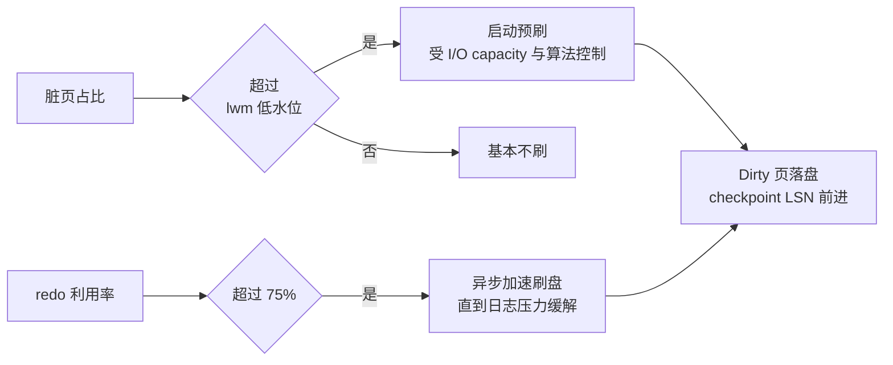

**TL;DR：** Buffer Pool 常被当成"内存缓存"，这是方向性误读。它同时维护两条相关但不等价的时间线：**LRU 账**（读路径：页按访问和冷热分段，决定谁更可能被淘汰）和 **flush/checkpoint 账**（写路径：脏页按最早修改 LSN 进入 flush list，刷盘进度受脏页水位、redo 使用量和后台 I/O capacity 共同影响）。淘汰与刷盘不是同一条队列，唯一的直接交汇是淘汰脏页前必须先把它落盘。本文以 MySQL 8.4 为例：`innodb_max_dirty_pages_pct=90` 是目标水位，`innodb_old_blocks_pct=37` 是旧区比例，而 `innodb_io_capacity` 是后台 I/O 能力预算，不是固定的“每秒刷页数”；版本、构建和发行版不同，默认值也可能不同。

## 一、直觉错在哪：把 Buffer Pool 当"缓存"，就会调错参数

"缓存"的心智模型是：命中=快，未命中=从磁盘读。按照这个模型，Buffer Pool 只是读加速层，调参就是往大调。

但 InnoDB 的写路径也不能只看“把一行写进磁盘”。一次行更新会先修改承载它的页并留下 redo 记录；页大小、记录格式、是否同一页还有其他更新、checkpoint 和刷盘时机，都会决定最终 I/O。InnoDB 的回答是：**先改内存页、标记脏（dirty），让后台根据 checkpoint 与 I/O 状态批量刷盘**。所以 Buffer Pool 的写路径功能是“延迟并合并页写”，读缓存只是同一块内存的另一种收益；不要用一个固定的“行字节 ÷ 页字节”比例替代真实写放大。

两个推论立刻改变调参视角：

1. 读路径吃**命中率**（LRU 账），写路径吃**刷盘节奏**（LSN 账）——两本账独立演进；
2. 脏页比例不是"缓冲层用得多深"的指标，而是"写账积压多少"的指标，决定的是写 I/O 节奏，不决定读延迟。

## 二、两本账的语法：LRU 链（读）与 Flush list（写）

两种"页"在 Buffer Pool 里都按链表排队，但排的依据完全不同：

**LRU 链（读账）**：所有页按访问和冷热分段组织，新读入的页先进入“旧区”（MySQL 8.4 默认约占 37%，由 `innodb_old_blocks_pct` 控制）；旧区页只有在第一次访问后至少经过 `innodb_old_blocks_time` 才有资格晋升到新区。全表扫描的页因此不必立刻污染热段，但这只是启发式，不是“扫描页一定一次就淘汰”。淘汰发生时若页是脏页，必须先把它落盘再腾位——这是两条时间线的直接交汇点。

**Flush list（写账）**：脏页记录 `oldest_modification_lsn`，flush list 按这个最早修改位置组织，帮助 page cleaner 推进 checkpoint。它不是“只要 LSN 最老就一定先刷”的严格单线程队列；实际刷哪些页还会受脏页水位、redo 生成速度、I/O capacity、邻居刷盘和存储状态影响。正确的判断是：刷盘优先级有 LSN/checkpoint 约束，而不是由 LRU 最近访问顺序决定。

```text
读账：这页 30 秒没被读了，淘汰它腾地方？
写账：这页改了 2 分钟还没落盘，redo 扇区快转不动了？
```

**两段问题不同，答案也不同**。这就是 InnoDB 把参数拆成两组的根本原因：`old_blocks_pct/old_blocks_time` 归读账，`max_dirty_pages_pct/io_capacity` 归写账。

## 三、写账的运营节奏：水位、IO 预算与 checkpoint 闭环

写账由 page cleaner 线程运营（线程数=`innodb_page_cleaners`，默认与 buffer pool 实例数相同）。它根据脏页水位、redo 使用量和可用 I/O 能力动态决定刷盘工作量；`innodb_io_capacity` 是后台任务可用的 IOPS 预算，不应直接翻译成“每秒刷多少页”。



- **常规水位刷**：脏页占比达到 `innodb_max_dirty_pages_pct_lwm` 时启动预刷；MySQL 8.4 默认低水位是 10%，达到 `innodb_max_dirty_pages_pct=90` 时会更激进地刷。`90` 是刷盘目标，不是“允许任何情况下安全堆到 90%”的性能承诺。
- **I/O 预算**：MySQL 8.4 的 `innodb_io_capacity` 默认值是 `10000`，`innodb_io_capacity_max` 默认是它的两倍；这些是版本相关的后台 I/O 能力参数，不是 SSD 的通用推荐值。应按目标实例的设备 IOPS、并发、脏页增长速率和其他后台任务校准。
- **redo 75% 边界**：官方文档把 redo 利用率达到 75%描述为触发异步刷盘的硬编码边界。若 InnoDB 需要复用仍被脏页占用的 redo 区间，可能出现 sharp checkpoint，导致前台事务等待刷盘；“75%”不是“事务立刻失败”的单一阈值，也不是只由 Buffer Pool 大小决定的结果。

## 四、候选实验：各动一本账，另一本不动

下面是一个可重复的本地实验模板，不是本次 checkout 已保存的 MySQL raw。要把它升级成证据，必须固定镜像 digest、机器/存储、数据量、预热、采样周期和重复轮次；当前文章不把示意输出写成实测结论。

启动 MySQL 8.4：

```bash
docker run -d --name bp -e MYSQL_ROOT_PASSWORD=x mysql:8.4
docker exec -it bp mysql -uroot -px
```

建表并写一个固定规模的负载（以下只是实验输入，运行前先确认容器有足够磁盘）：

```sql
CREATE DATABASE IF NOT EXISTS test;
USE test;
CREATE TABLE hot (id INT PRIMARY KEY AUTO_INCREMENT, v VARCHAR(500)) ENGINE=InnoDB;
DROP PROCEDURE IF EXISTS fill_hot;
DELIMITER $$
CREATE PROCEDURE fill_hot()
BEGIN
  DECLARE i INT DEFAULT 0;
  WHILE i < 1000000 DO
    INSERT INTO hot(v) VALUES (REPEAT('a', 500));
    SET i = i + 1;
  END WHILE;
END$$
DELIMITER ;
CALL fill_hot();
-- 写入期间另开一个终端每秒取样
```

然后每秒取样（读账 + 写账一起看），至少同时记录配置、脏页、redo 使用量、I/O 和事务延迟：

```sql
SHOW ENGINE INNODB STATUS\G
SHOW VARIABLES WHERE Variable_name IN
  ('innodb_io_capacity', 'innodb_io_capacity_max',
   'innodb_max_dirty_pages_pct', 'innodb_max_dirty_pages_pct_lwm',
   'innodb_old_blocks_pct', 'innodb_old_blocks_time');
```

可以从输出中抽取这些字段；下面不填数字，避免把某次机器的快照伪装成默认结果：

```text
BUFFER POOL AND MEMORY
Buffer pool hit rate ...                              ← 读账：命中率
...
Modified db pages: ...                                ← 写账：脏页
History list length: ...                              ← 长事务/MVCC 清理压力，不能直接当刷盘指标
```

实验设计应一次只改一个变量：例如只改变 `innodb_io_capacity`，比较脏页曲线、redo 利用率、刷盘 I/O 和前台延迟；另一轮只改变 `innodb_old_blocks_pct` 或 `innodb_old_blocks_time`，比较扫描后的热页命中与淘汰。只有在同一负载、同一初始状态和多轮结果下，才能说“主要改变了哪一本账”；当前没有这些 raw，因此本文只给出验证方法。

## 五、常见翻车点：把两本账当成一本调

| 症状 | 病在哪本账 | 错误直觉 | 正确动作 |
| --- | --- | --- | --- |
| 读慢、命中率低 | 读账 | 加 buffer pool 一个参数解决 | 区分工作集、扫描污染、预读和存储延迟，再看 `old_blocks_*` |
| 写风暴、查询卡顿 | 写账 | 怀疑 LRU 淘汰 | 看 redo 利用率、脏页水位、刷盘速率与设备队列；75%/90% 是信号，不是完整诊断 |
| redo 写爆、磁盘 I/O 打满 | 写账 | 一个劲加内存 | 按实际 IOPS 校准 `io_capacity`，同时检查 redo 容量、写入速率和 checkpoint 压力 |
| 大表扫描后热点消失 | 读账 | 去调刷盘参数 | 用 `old_blocks_pct/time`、访问模式和读放大验证扫描污染 |

第三条尤其反直觉：**内存大满≠刷盘会解决**。脏页压力需要看 flush/checkpoint 与设备是否跟得上；单纯扩大 Buffer Pool 可能增加可容纳的脏页数量，也可能改变工作集命中率，不能替代写入速率和刷盘能力的测量。

## 六、结论：LRU 与 Flush list 是两条独立的时间线

Buffer Pool 的架构真面目是"读一本账 + 写一本账并行运转的引擎"。LRU 按**最近访问与冷热分段**组织，Flush list 按**脏页最早修改位置**帮助推进 checkpoint，两本账共享同一片页内存，但排序依据、触发条件、临界值、执行线程并不相同。唯一的直接耦合是"淘汰脏页必须先落盘"。

调参纪律一句话：**先分清自己在动哪条时间线**。命中率低且读延迟高 → 先核对工作集、访问模式和 `old_blocks_*`；脏页积压、redo 利用率升高或写入毛刺 → 看 `dirty_pct`、flush/checkpoint、`io_capacity`、redo 容量和设备队列。两边分开测，才不会把一个参数的相关变化误判成因果。

下一步（本机、分钟级）：

```bash
docker run -d --name bp -e MYSQL_ROOT_PASSWORD=x mysql:8.4
docker exec -it bp mysql -uroot -px -e "SHOW ENGINE INNODB STATUS\G" | grep -E "Modified|Buffer pool hit rate"
```

## 参考资料

1. MySQL 8.4：InnoDB Buffer Pool（LRU 两段机制与 scan resistant）—— https://dev.mysql.com/doc/refman/8.4/en/innodb-buffer-pool.html
2. MySQL 8.4：Configuring Buffer Pool Flushing（lwm / redo 75% / sharp checkpoint）—— https://dev.mysql.com/doc/refman/8.4/en/innodb-buffer-pool-flushing.html
3. MySQL 8.4：系统变量（默认值与 `io_capacity` 单位）—— https://dev.mysql.com/doc/refman/8.4/en/innodb-parameters.html
4. MySQL 8.4：Configuring InnoDB I/O Capacity—— https://dev.mysql.com/doc/refman/8.4/en/innodb-configuring-io-capacity.html

> 延伸：脏页落盘才有崩溃恢复，见[MySQL 的 redo/undo/binlog 三本账](/writing/mysql-redo-undo-binlog)；刷盘节奏的原点是 commit 时的 fsync，见 [fsync 不是数据保险单：group commit 与两级账](/writing/fsync-group-commit)；页级读放大与页填充的关系，见 [B+Tree 的写放大来自分裂](/writing/btree-page-split-write-amplification)。
