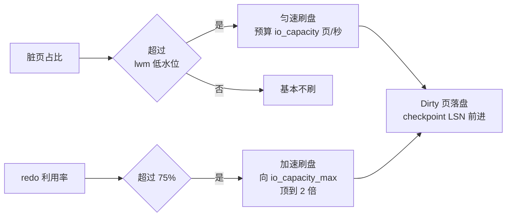

**TL;DR：** Buffer Pool 常被当成"内存缓存"，这是方向性误读。它同时维护两本独立的账：**LRU 账**（读路径：页按最近访问时间排队，决定谁被淘汰）和 **LSN 账**（写路径：页按最早修改 LSN 排队，决定谁先落盘）。淘汰与刷盘互相独立——唯一的交汇点是"淘汰脏页前必须先把脏数据落盘"。默认参数给两本账各自定价：`innodb_max_dirty_pages_pct=90`（脏页上限）、`innodb_io_capacity=200`（每秒刷盘页数预算）、`innodb_old_blocks_pct=37`（LRU 新城区占比）。调参前先确认你在调哪一本账。

## 一、直觉错在哪：把 Buffer Pool 当"缓存"，就会调错参数

"缓存"的心智模型是：命中=快，未命中=从磁盘读。按照这个模型，Buffer Pool 只是读加速层，调参就是往大调。

但 InnoDB 最大的成本在写路径。一次 UPDATE 改一行（约 128B），落在 16KB 的页上（见[B+Tree 写放大](/writing/btree-page-split-write-amplification)的同一数学：行改一字节，页写一页）。如果每行都立刻写盘，就是 100 倍以上的字节级写放大。InnoDB 的回答：**先改内存页、标记脏（dirty），落盘交给后台批量、合并、顺序执行**。所以 Buffer Pool 的写路径功能是"写合并缓冲"，读缓存只是同一块内存的副作用。

两个推论立刻改变调参视角：

1. 读路径吃**命中率**（LRU 账），写路径吃**刷盘节奏**（LSN 账）——两本账独立演进；
2. 脏页比例不是"缓冲层用得多深"的指标，而是"写账积压多少"的指标，决定的是写 I/O 节奏，不决定读延迟。

## 二、两本账的语法：LRU 链（读）与 LSN 链（写）

两种"页"在 Buffer Pool 里都按链表排队，但排的依据完全不同：

**LRU 链（读账）**：所有页按"最近访问时间"排成一条链，新读数页先进入"旧区"（默认占 37%，`innodb_old_blocks_pct`），并在一个 `innodb_old_blocks_time`（默认 1000ms）的窗口内被再次访问才提升到"新城区"。全表扫描的页读一遍就淘汰，不污染热段。淘汰发生时若页是脏页，必须先把它落盘再腾位——两本账唯一的交汇点。

**LSN 链（写账）**：每个脏页身上挂一个 `oldest_modification_lsn`（最早修改它的 LSN）。page cleaner 刷盘只看你**多早改的，不看多晚用的**——最早 LSN 的页最先刷。这保证刷盘按数据文件顺序推进，而不是随机挑页，与 redo log 的滑动方向一致。

```text
读账：这页 30 秒没被读了，淘汰它腾地方？
写账：这页改了 2 分钟还没落盘，redo 扇区快转不动了？
```

**两段问题不同，答案也不同**。这就是 InnoDB 把参数拆成两组的根本原因：`old_blocks_pct/old_blocks_time` 归读账，`max_dirty_pages_pct/io_capacity` 归写账。

## 三、写账的运营节奏：水位、IO 预算与 checkpoint 闭环

写账由 page cleaner 线程运营（线程数=`innodb_page_cleaners`，默认等于 buffer pool 实例数）。它按四个信号决定每秒刷几页：



- **常规水位刷**：脏页占比越过 `innodb_max_dirty_pages_pct_lwm`（8.4 默认 10，8.0 默认 0=关闭预刷）开始匀速刷；到 `innodb_max_dirty_pages_pct=90` 才换"激进"模式。**90 是设计出来的写合并区间，不是事故**——允许脏页占 9 成缓冲池，全是为了延迟落盘以减少 I/O 次数。
- **IO 预算**：默认 `innodb_io_capacity=200` 页/秒，上限 `innodb_io_capacity_max=2000`。SSD 上必须提到 1000-2000 才跟得上设备能力；参数默认值是给老 HDD 的。
- **redo 75% 硬顶**：无论脏页比例多少，redo 日志利用率到 75% 触发异步快速刷，接近满时触发"尖锐 checkpoint"：事务提交被迫等待刷完这组页，吞吐瞬时塌陷。**这是两本账独立的铁证级细节：Buffer Pool 再大，redo 转完照样骨折。**

## 四、可复现实验：各动一本账，另一本不动

Docker 一行起 MySQL 8.4：

```bash
docker run -d --name bp -e MYSQL_ROOT_PASSWORD=x mysql:8.4
docker exec -it bp mysql -uroot -px
```

建表并写高压负载（存储过程循环 INSERT 100 万行，行 500B）：

```sql
USE test;
CREATE TABLE hot (id INT PRIMARY KEY AUTO_INCREMENT, v VARCHAR(500)) ENGINE=InnoDB;
DROP PROCEDURE IF EXISTS fill_hot;
DELIMITER $$
CREATE PROCEDURE fill_hot()
BEGIN
  DECLARE i INT DEFAULT 0;
  WHILE i < 1000000 DO
    INSERT INTO hot(v) VALUES (REPEAT('a', 500));
    SET i = i + 1;
  END WHILE;
END$$
DELIMITER ;
CALL fill_hot();
-- 写入期间另开一个终端每秒取样
```

然后每秒取样（读账 + 写账一起看）：

```sql
SHOW ENGINE INNODB STATUS\G
```

看两段输出（示意值，实际随机器）：

```text
BUFFER POOL AND MEMORY
Buffer pool hit rate 999 / 1000, young-making rate 0.010   ← 读账：命中率
...
Modified db pages: 5160 / 8192 (63%)   ← 写账：脏页（23 占比）
History list length: 25124             ← undo 未清理（写账副产物）
```

把 `innodb_io_capacity` 从 200 提到 1500，再来一轮：**脏页峰值下降、写入毛刺消失，但命中率纹丝不动**——证明调的是写账，读账不受影响。反过来动 `innodb_old_blocks_pct` 只改变 LRU 冷热边界，对刷盘节奏零影响。

## 五、常见翻车点：把两本账当成一本调

| 症状 | 病在哪本账 | 错误直觉 | 正确动作 |
| --- | --- | --- | --- |
| 读慢、命中率低 | 读账 | 加 buffer_pool 一个参数解决 | 本金照大、查 `old_blocks_time` 是否被扫描压爆 |
| 写风暴、查询卡顿 | 写账 | 怀疑 LRU 淘汰 | 查 redo 利用率>75%、dirty>90  |
| redo 写爆、磁盘 I/O 打满 | 写账 | 一个劲加内存 | 提 `io_capacity`（页/秒预算）或扩 redo 文件 |
| 大表扫描后热点消失 | 读账 | 让调到刷盘参数 | 调 `old_blocks_time` 防扫描冲垮2 |

第三条尤其反直觉：**内存大满≠刷盘会解决**。脏页顶到 90% 后靠的是 io_capacity 把积成堆的页挤出，而非 LRU 顺手淘汰。

## 六、结论

Buffer Pool 的架构真面目是"读一本账 + 写一本账并行运转的引擎"。LRU 按**最近用过**排队，LSN 按**最早改过**排队，两本账共享同一片页内存，但排序依据、触发条件、临界值、执行线程全部独立。唯一的耦合是"淘汰脏页必须先落盘"。

调参纪律一句话：**先分清自己在动哪本账**。命中率低且读延迟高 → 读账，动 `buffer_pool/old_blocks_*`；脏页顶线 / redo 逼近 75% / 写入毛刺 → 写账，动 `dirty_pct/io_capacity/redo`。两边分开算，才是 InnoDB 的"内存账本"真相。

下一步（本机、分钟级）：

```bash
docker run -d --name bp -e MYSQL_ROOT_PASSWORD=x mysql:8.4
docker exec -it bp mysql -uroot -px -e "SHOW ENGINE INNODB STATUS\G" | grep -E "Modified|Buffer pool hit rate"
```

## 参考资料

1. MySQL 8.0：InnoDB Buffer Pool（LRU 两段机制与 scan resistant）—— https://dev.mysql.com/doc/refman/8.0/en/innodb-buffer-pool.html
2. MySQL 8.4：Configuring Buffer Pool Flushing（lwm / io_capacity / 75% 阈值）—— https://dev.mysql.com/doc/refman/8.4/en/innodb-buffer-pool-flushing.html
3. MariaDB InnoDB 系统变量（io_capacity=200 / io_capacity_max=2000 / old_blocks_pct=37 参数值验证）—— https://mariadb.com/docs/server/server-usage/storage-engines/innodb/innodb-system-variables

> 延伸：脏页落盘才有崩溃恢复，见[MySQL 的 redo/undo/binlog 三本账](/writing/mysql-redo-undo-binlog)；刷盘节奏的原点是 commit 时的 fsync，见 [fsync 不是数据保险单：group commit 与两级账](/writing/fsync-group-commit)；页级读放大与页填充的关系，见 [B+Tree 的写放大来自分裂](/writing/btree-page-split-write-amplification)。