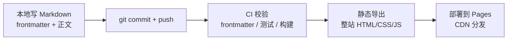
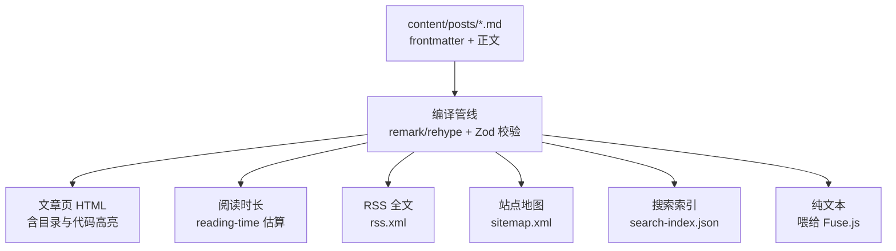

**TL;DR：** 博客的底层应该是一套文本工作流，而不是一台内容机器：内容即文件，git push 即发布——无数据库、无后台、无构建服务，系统只负责校验、编译与部署，内容的寿命交给纯文本和 Git 保证。

## 一、为什么回到 Markdown

写博客最容易陷入的误区，是先为写作造一台过于复杂的机器。账号、数据库、编辑器、草稿箱和发布按钮一应俱全，最后却发现：真正缺少的仍然是一篇愿意写完的文章。

我更喜欢把内容留在普通文本里。它能被 Git 追踪，能被任何编辑器打开，也能在十年后继续迁移。Markdown 的价值并不在于语法简单，而在于它足够接近纯文本：标题、列表、链接和代码块都保留着清楚的语义，不依赖某个数据库才能理解。一个 Markdown 文件十年后打开，里面的内容依然是内容；一套 CMS 十年后打开，先要回答的是平台还活着吗、数据怎么导出来。

把"内容比系统活得更久"当作设计原则，很多选择就变得清楚：富文本编辑器把排版存成私有格式，换编辑器就等于换遗产；数据库把文章拆成行和列，导出成 HTML 还要再过一遍模板；而 Markdown 文件本身就是最终格式，系统可以换，内容不用迁。

也有人担心纯文本表达力不够。但博客文章的排版需求就那么多：标题、段落、列表、引用、代码、图片——Markdown 恰好覆盖，多出来的格式能力往往只是拖延写作的借口。有限表达能力不是缺陷，是约束，约束让作者把注意力留在内容本身。

三种方案的差异摊开看：

| 维度 | Markdown 文件 | CMS | 数据库 |
|------|--------------|-----|--------|
| 内容可追溯性 | Git 完整历史，逐行 diff | 依赖平台导出 | 需自行设计审计 |
| 迁移成本 | 复制粘贴即迁移 | 导出格式绑定平台 | 依赖 schema 与备份 |
| 离线写作 | 任意编辑器，无网络 | 通常需在线后台 | 需要连接与工具链 |
| 构建依赖 | 一个编译管线 | 平台版本与插件生态 | 运行时 + ORM |
| 故障面 | 构建失败即上线失败，可回滚 | 平台宕机即不可写 | 数据库故障波及全文 |

表格的结论很直接：数据库和 CMS 解决的是多人协作、实时编辑、权限管理这类问题，而个人博客的核心需求是"写、存、发"——这三件事，文件系统加 Git 已经足够。选用数据库之前，先问一句：你缺的是一篇文章，还是一个发布按钮？

> 这套博客只有一个约定：内容永远是主角，系统只负责把它排得更好、送得更远。

## 二、一个常见的误解：Markdown 是标准化的

**一个常见的误解："Markdown 是标准化的"。** 恰恰相反：Markdown 从 2004 年诞生后十多年没有正式标准，各实现的方言互相冲突——同样的语法在不同编辑器里渲染结果不同，表格在这家是竖线文本、在那家是 HTML。2017 年 CommonMark 才成为事实标准，而 GFM（GitHub Flavored Markdown）只是 GitHub 在 CommonMark 之上的扩展。所以"写 Markdown 就能到处迁移"只在严格遵守 CommonMark 子集时成立：表格、任务列表、脚注、删除线都是扩展语法，换引擎不一定会报错，但可能静默渲染成别的样子。内容可迁移的底气不在"Markdown 这个名字"，而在你用的语法子集够不够保守。

**规范解剖：CommonMark 怎么规定解析。** 规范正文 §1.3「About this document」给自己定的任务是 "This document attempts to specify Markdown syntax unambiguously"——**确定性解析**：同一输入在任何 CommonMark 实现下产出相同的 AST（进而相同的 HTML），这是它敢自称标准的原因。为此规范把细节写到令人发指的程度，缩进几个空格、空行是否分隔段落都有条文。另一条常被忽略的规则：**内联 HTML 是允许的，但块级 HTML 行为复杂**——块级 HTML 标签会打断段落，且其内部内容默认按原样输出，Markdown 不再解析。

## 三、一次发布四件事

这不是抽象的口号，而是每次 `git push` 之后真实发生的事情。构建程序会完成四件事：

1. 校验文章的标题、摘要、日期与标签——frontmatter 不合格，构建直接失败；
2. 把 Markdown 编译为带目录和代码高亮的 HTML；
3. 生成搜索索引、RSS 与站点地图；
4. 将整站作为静态内容发布。



这已经是完整的"后台"。它不需要登录，也没有会丢失数据的富文本编辑器；发布按钮就是 `git push`，而"后台地址"是一条 CI 工作流文件。校验不过不会发布，构建失败不会部署——出问题的地方，就是问题被拦下的地方。

作者与构建系统之间唯一的约定是 frontmatter：标题、摘要、日期、标签、草稿标记。它是内容的自描述元数据，放在文件头部而不是后台表单里，意味着每篇文章都带着自己的"说明书"迁移。Pull Request 阶段 CI 只做校验和构建验证、不会真正发布，合并到主分支才触发部署——线上永远只存在审核通过的内容。

## 四、frontmatter 为什么是 YAML

第一节表格里我说"作者与构建系统之间唯一的约定是 frontmatter"。这句话值得拆开讲：为什么是 YAML，为什么每个字段长这样，坏掉的元数据什么时候会被拦住。

**为什么是 YAML。** 文件头的元数据格式有过一轮竞争：JSON 被转义符和引号占掉一半可读性，TOML 更晚才流行，而 YAML 是为"配置即文本"设计的——缩进表达结构、不需要引号也能读。更重要的是 Jekyll 在 2010 年代把它变成了事实约定（`---` 包裹的 frontmatter），后来的静态站点生成器几乎都沿用。选 YAML 没有技术上的惊天理由，选的是"所有人都会写、所有生成器都认"。

这套博客的 frontmatter 由 Zod 合约（lib/content/schema.ts）规定，字段逐个解释：

| 字段 | 语义 | 校验规则 |
|------|------|---------|
| `title` | 文章标题 | 非空；同时进页面 `<title>`、RSS 与搜索索引 |
| `description` | 一句话摘要 | 非空；列表页与社交卡片都读它 |
| `publishedAt` | 发布日历日期 | 必须是真实存在的 YYYY-MM-DD |
| `updatedAt` | 修订日期 | 可选；内容大改后补上 |
| `tags` | 标签数组 | 至少一个；驱动标签页聚合 |
| `draft` | 草稿标记 | 默认 false；true 时不进入生产构建 |
| `featured` | 首页推荐 | 默认 false；影响首页与归档排序 |
| `series` | 所属系列 | 可选；用于系列聚合 |

每个字段都有明确消费方：`title` 和 `description` 不只是给人看的，RSS 阅读器和搜索引擎真的会读它们；`tags` 决定一篇新文章出现在哪些聚合页；`draft: true` 是"没写完就不上线"的开关。把这一行行读一遍，你会发现 frontmatter 就是这份内容对其他系统的接口声明。

一篇文章的完整 frontmatter 长这样（新文章直接照抄改字段即可）：

```yaml
---
title: "把写作还给 Markdown"
description: "静态博客与 Markdown 文件的底层逻辑"
publishedAt: "2026-07-26"
tags: ["Markdown", "工程效率"]
draft: true   # 写草稿时打开,合并发布前去掉
featured: false
---
```

**为什么放在文件头，而不是后台表单。** 因为元数据必须跟着内容走。后台表单的模型是"元数据存一张表、正文存另一张表、图片存第三个桶"，导入导出时才把它们拼回去；文件头模型里，元数据就是文件的前几行——迁移、diff、代码审查时它和正文一起出现。你 review 一篇 PR 时能看到"摘要写得太水"和"标签拼错了"在同一个 diff 里，这在任何后台里都要跨三个页面才能看到。

**校验失败的拦截时机。** 元数据不是写进去就完事。Zod 校验发生在编译管线的最起点（`lib/content/markdown.ts` 之前的 `schema.ts`），比常见的"正则查格式"狠一层：`publishedAt` 会构造 `Date.UTC` 逐字段比对，2 月 30 日这种合法格式非法日期直接拒绝。更重要的是拦截的时机——校验跑在 CI 里，不合格的 frontmatter 让构建失败，构建失败就不部署。坏元数据永远到不了线上，它在 PR 阶段就被红叉拦住，而这套逻辑的完整拆解在[一个 Markdown 博客的完整生命周期](/writing/inside-my-markdown-blog-architecture)。

## 五、Git 就是内容管理系统

把内容放进 Git 之后，你会发现传统 CMS 的每个功能都能在 Git 里找到对应物：新增文章是 `git add` + `git commit`，修改是再提交一次，删除是 `git rm`，检索是 `git log` 和 `grep`。CMS 把 CRUD 做成了按钮，Git 把 CRUD 做成了命令——功能没有少，只是都变得可追溯。

**`git blame` 是考古工具。** 遇到"这篇文章什么时候写的、谁改的、当时怎么想的"，`git blame -L` 直接给出答案，而且答案有据可查：

```bash
git blame -L 10,20 content/posts/building-a-markdown-blog.md
# 每一行都标注:提交 hash、作者、提交时间
git show <commit-hash> --stat   # 看那次提交动了哪些文件
```

**`git revert` 就是发布回滚。** 文章发出去发现事实错误，不需要登录任何后台找"撤销发布"按钮：

```bash
git revert --no-edit <commit-hash>   # 反向提交:文章从仓库移除
git push                              # 一次构建,线上回到上一版
```

回滚走的是同一条发布流水线——这是文件工作流最被低估的优势：发布和回滚不是两套系统，是一个按钮的两个方向。

**feature branch + PR 是编辑审稿流程。** 写一篇新文章时开分支、写完后开 PR、请人 review、合并到 main 触发部署。这看起来是 Git 协作，实际就是出版流程：分支是草稿箱，PR 是投稿，review 是审稿，merge 是签发。区别在于这一切都留下了文本记录——审稿意见、修改理由、合并时间，十年后 `git log` 里全在。


**`git log` 就是出版史。** 只看这个命令，你就知道这个博客写过什么、什么时候写的、中间改过几次：

```bash
git log --oneline -- content/posts      # 全部文章的提交史
git log --oneline --follow -- content/posts/clock-skew-distributed-systems.md  # 单篇的修改史
```

数据库里的"出版时间"字段会撒谎（可以 UPDATE），Git 里的提交时间不会。

## 六、图片与静态资源

正文只是内容的一半，配图是另一半。这套工作流里图片同样以文件存在：`public/images/` 目录，正文用标准的 Markdown 图片语法引用——比如 perf 文章的配图就是 ``，路径指向仓库里真实存在的文件。

图片管理有一个常常被忽视的约束：**每张图都要有 `alt` 文本**。`alt` 不是给"看不见的人"的礼貌项——屏幕阅读器靠它朗读图片，搜索引擎靠它理解图片上下文，图片加载失败时浏览器把它显示成占位文字。一篇"手把手画火焰图"的文章配图没有 `alt`，等于这篇教程对读屏用户是空白。

配图格式上我优先用 SVG。本博客的配图绝大多数是 SVG 矢量图，理由很实际：矢量图任意缩放不糊、文件小（对比动辄几百 KB 的位图截图）、而且 SVG 本质是 XML 文本——它和正文一样能被 Git diff、能进代码审查。位图只在少数场景出现，比如必须如实展示的截图。矢量图是"图也是文本"原则的延伸，正文和配图在同一个工作流里。

内容与资源同仓库还有一个隐藏收益：**版本一致性**。`git revert` 撤回一篇文章时，它引用的图片跟着一起回滚；改写正文时配图可以同一次提交里修改。不会出现"文字还挂在线上、图片已经被删掉"的错位——这在图片单独存对象存储、由 CMS 维护映射关系的体系里，是要靠额外的软删除逻辑才能防住的坑。

## 七、同一份 Markdown 的派生物

第三节说构建会"生成搜索索引、RSS 与站点地图"，其实不止这些。同一份 Markdown 在编译管线里被派生出一整套产物：



注意这些产物的角色：RSS 是给阅读器的，sitemap 是给搜索引擎的，搜索索引是给站内搜索的，目录和阅读时长是给读者的——它们都是同一份内容的派生视图，没有一个是独立维护的数据。这就是"内容与展示分离"的收益：你改一个错别字，四个产物同步更新；你想换主题，只动模板不动内容；十年后换一个生成器，把 `content/` 目录搬过去就行。

派生物的生成顺序有个讲究：目录和阅读时长在编译管线里顺手产出（`collectHtmlHeadings`、`reading-time`），不依赖第二次解析；搜索索引用的是去掉代码块和 Markdown 符号的纯文本，而不是渲染后的 HTML——管线怎么实现这些派生物，见[一个 Markdown 博客的完整生命周期](/writing/inside-my-markdown-blog-architecture)的编译管线一节。

## 八、故障模式与回滚

系统再简单也会坏，关键是坏的时候怎么恢复。文本工作流的故障面比 CMS 小一个量级，而且每一种故障都有标准动作。

**构建失败 = 发布失败。** 这是设计意图，不是 bug。frontmatter 日期非法、正文代码块没闭合、某个插件抛异常——CI 红叉，线上保持上一个版本，什么都不发生。在 CMS 里"发布失败"意味着文章进了草稿箱或半状态，在文件工作流里"发布失败"意味着构建没通过，概念上干净得多。

**发布错了 = 一次 revert。** 事实性错误、不该发的草稿误发、文章得罪了不该得罪的人——`git revert` 加 `git push`，几分钟回到之前的状态，回滚本身还会留一条提交记录。CMS 时代"撤下文章"是内容表里 UPDATE 一个状态字段，审计上不如一条 revert 提交诚实。

**修订 = 再提交一次。** 文章上线后发现要改，改文件、提交、推送。旧版本哪里去了？在 Git 历史里，每条提交都是这篇文章的完整快照。数据库的 `updated_at` 只能告诉你"改过"，Git 能告诉你"改成了什么"。

对照第一节那张表，故障面的对比更清楚：CMS 的平台宕机意味着**不可写**（连草稿都存不进去）；文件工作流的故障只发生在构建和部署这一段——本地写作永远可用，`git push` 失败重试就行，平台故障最多让"发布"变慢，不会让"写作"停止。

## 九、保留必要的摩擦

自动化不是把所有步骤消灭。写完后确认摘要、标签和草稿状态，仍然是一种有价值的停顿。好的工具减少重复劳动，但不会替作者做判断。

git 的纪律本身就是写作流程的一部分：一次提交对应一篇文章，提交信息就是这篇内容的出版记录；发布前经过 review，相当于给"冲动发布"加了减速带；而构建失败即发布失败，意味着"内容不完整"在发布前就被系统拦截，而不是上线之后由读者发现。过度自动化还有一个隐蔽的代价：它把判断从人手里拿走——标题含糊、标签随手一填、日期忘了改，如果系统悄悄替你补上，作者就失去了发现自己没写完的机会。摩擦不是 bug，是提示音。

这些摩擦加起来不过几分钟，换来的却是内容在十年后依然可读、可迁移、可回溯。系统复杂才是昂贵的——每一次升级、迁移和安全补丁，最终都要由内容买单。

这套工作流把发布的门槛从"能不能登录后台"降到了"愿不愿意写完"。缺少的从来不是更顺滑的发布按钮，而是一篇认真写完的文章——工具把路铺平了，走不走完还是作者自己的事。

## 十、常见问题

**没有后台，怎么管理图片？** 图片是 `public/images/` 下的普通文件，新增就是 `cp` 一张图进目录、在正文里引用路径；改图是覆盖文件再提交，Git 会保留旧版。SVG 图甚至可以直接用编辑器改。配图需要上传工具？不需要——`git push` 比任何后台的上传按钮都快。

**多人协作怎么办？** 和写代码完全一样：各自的 branch 写作，PR 里互相 review，合并顺序由 Git 仲裁。冲突是文本级的——两篇文章同时改了同一处，`git merge` 给你标出来；同一篇文章分叉了，merge 会有冲突提示，解决方式是读一遍两个版本再合并，而不是凭感觉覆盖。CMS 的"锁定编辑"在 Git 面前显得原始。

**文章误删怎么找回？** 先 `git log --diff-filter=D --oneline -- content/posts` 找到删除那次提交，再 `git checkout <commit> -- <文件路径>` 恢复；连提交都搞丢了还有 `git reflog` 兜底——Git 的删除是"可撤销的操作"，不是销毁。

**换域名或换平台怎么办？** 换平台：把 `content/` 目录搬进新生成器，frontmatter 就是现成的元数据，正文里的链接是相对路径不用改。换域名：静态站点不存在"数据库里的绝对 URL 残留"，重新构建即可。唯一要动手的是 DNS 和站点地图——内容本身零成本迁移。这正是第一节那张表里"迁移成本"一列的兑现：不是承诺，是复制的成本。

## 参考资料

1. CommonMark 规范：Markdown 语法的权威定义 —— https://spec.commonmark.org/
2. GitHub Flavored Markdown 规范：GFM 是 CommonMark 的 GitHub 扩展，表格、任务列表、删除线等方言的正式定义 —— https://github.github.com/gfm/
3. Git 官方文档：版本追踪与提交模型 —— https://git-scm.com/doc
4. GitHub Pages 官方文档：静态站点托管 —— https://docs.github.com/en/pages
5. Hugo 官方文档：静态站点生成器的另一种选择 —— https://gohugo.io/documentation/
6. YAML 规范（1.2.2，2021）：frontmatter 语法的权威定义 —— https://yaml.org/spec/1.2.2/
7. John Gruber：2004 年原始 Markdown 语法说明（"方言分化"的起点）—— https://daringfireball.net/projects/markdown/syntax

> 延伸阅读：这套方案的技术细节与完整架构——从编译管线、静态生成到 CI/CD 与客户端增强，见[一个 Markdown 博客的完整生命周期：从文本到线上的全链路架构](/writing/inside-my-markdown-blog-architecture)。
