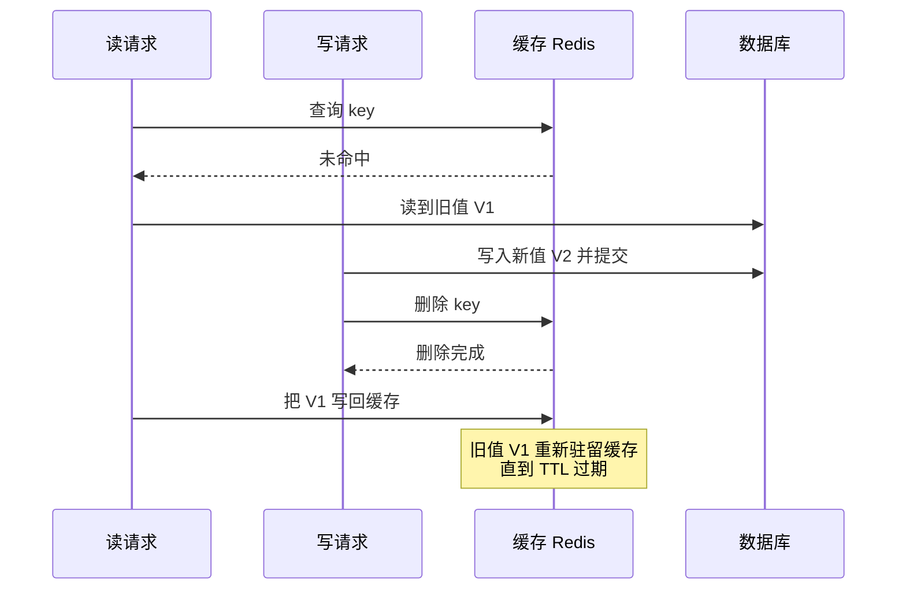
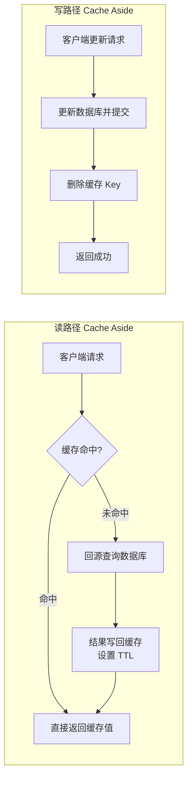
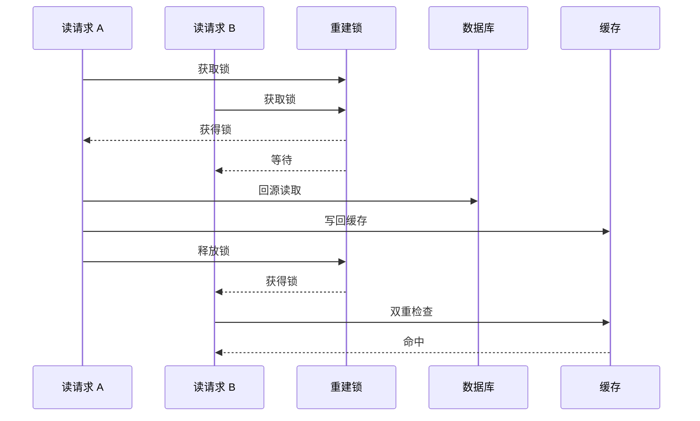
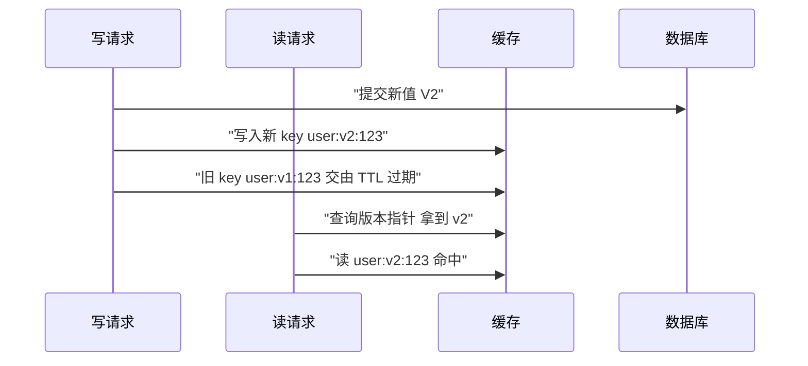
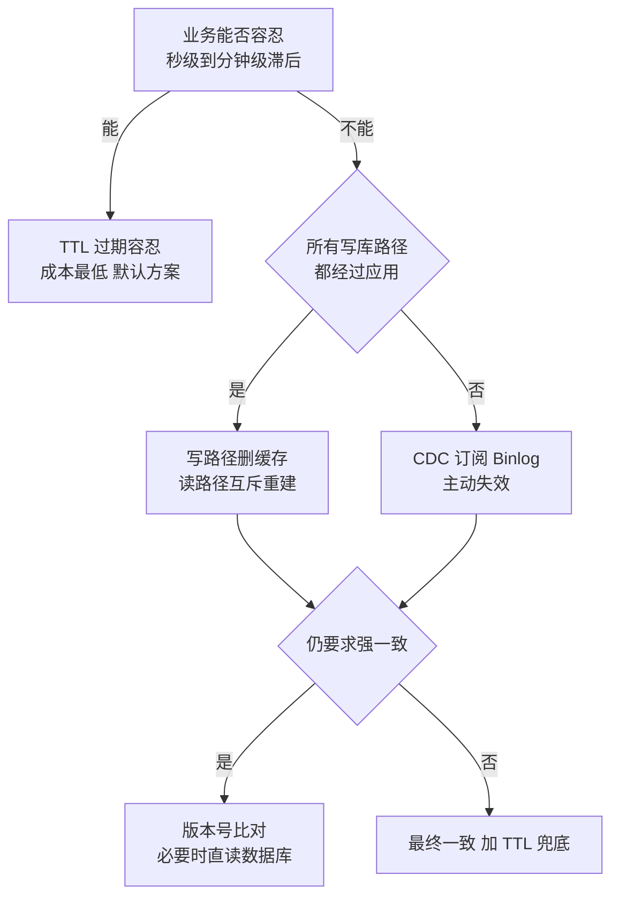

**TL;DR：**命中率是能精确计算、能调优的性能问题，缓存一致性是没有终点的工程问题。

- 写路径的三个候选各有失效窗口：删缓存有读回填竞态，双写把一致性完全让给并发时序，延迟双删只是把一个概率窗口换成另一个。
- 解法从容忍到强一致层层递进，每一层都有明码标价：一致性越高，实现成本越高，性能收益越稀薄。
- 决策顺序：先给每类 key 定义一致性预算，再顺着决策树选方案。

绝大多数业务停在 TTL + 容忍这一层，把预算写进监控；写库通道不受控再上 CDC；兜底永远是直读数据库。

## 序幕：一次旧值复活事故

读、写、删全部成功，日志里没有一行报错，可缓存里最后驻留的，是数据库已经抛弃的旧值。

先看这场时序：



上面这场事故里，每一步都返回「成功」，可缓存命中时给出的答案，却是错的。缓存命中了才可怕：它把错误也缓存了。

## 一、命中率是有解的数学题，一致性是没完没了的工程题

把缓存做出来很容易，难的是回答「缓存里的值还能不能信」。面试里常见的缓存问题，其实藏着两个难度完全不同的题。

第一道题是命中率。给定访问分布、缓存容量、淘汰策略和 TTL，命中率是可以用模型算出来、用监控量出来、用参数调出来的。它甚至有明确的优化方向：把热数据留下，把冷数据挤走。这是一个「有解」的问题，答案收敛，指标可见，老板看得懂。

第二道题是缓存一致性：数据更新之后，缓存里的旧值什么时候消失、会不会永不消失？这个问题没有封闭解。它同时牵涉三件不完全受你控制的事：并发的时序（两个请求以任意顺序交错）、故障的窗口（删除失败、写库超时、进程被杀）、业务的语义（这个值滞后三秒会造成资损，还是只是界面难看）。

不一致大致有三种形态，工程上必须分开对待：

- **滞后**：缓存里是旧值，数据库里是新值。滞后是缓存存在的必然代价，只要 TTL 存在，滞后就有上界。大多数业务可以接受。
- **脏读**：缓存里是数据库从未以提交状态存在过的值，比如写路径先写缓存、而数据库事务随后回滚或提交失败，或者双写只成功了一半。脏读没有 TTL 兜底之外的解，这是真正要消灭的。
- **丢失更新**：两次写互相覆盖，缓存停在旧值而数据库停在更晚的值上。双写和读回填是丢失更新的主要来源。

命中率是可优化的数字，一致性是必须做出取舍的工程判断。不少缓存事故，恰恰是把这两件事当成了一件事。

## 二、写路径的三个候选：删缓存、双写、延迟双删

### 2.1 Cache Aside：读路径与写路径

Cache Aside（旁路缓存）是应用代码里最常见的模式：读路径回源回填，写路径先落库再删缓存。



对应的 Go 实现：

```go
type UserCache struct {
    db    *sql.DB
    redis *redis.Client
}

func (c *UserCache) Get(ctx context.Context, id string) (*User, error) {
    key := "user:" + id

    u, err := c.redis.Get(ctx, key).Result()
    if err == nil {
        return decode(u), nil
    }
    if err != redis.Nil {
        return nil, err // Redis 故障不挡业务，降级回库
    }

    u, err = loadUserFromDB(ctx, c.db, id)
    if err != nil {
        return nil, err
    }

    // 回填缓存：TTL 就是你对滞后时间的预算
    c.redis.Set(ctx, key, encode(u), 30*time.Second)
    return u, nil
}

func (c *UserCache) Update(ctx context.Context, id string, u *User) error {
    // 先更新数据库，再删缓存
    if err := saveUserToDB(ctx, c.db, id, u); err != nil {
        return err
    }
    return c.redis.Del(ctx, "user:"+id).Err()
}
```

代码省略了 encode/decode 与 ORM 细节，只保留缓存相关路径。

写路径选择「删缓存」而不是「更新缓存」，是刻意的：删除是幂等的、与值无关的，下一次读自然从数据库回填；而 SET 新值把「新值一定正确」的判断押在了写路径上，写路径一旦失败、回滚或收到乱序的异步写，缓存里就是数据库从未提交过的状态，即脏读。删除最多退化成一次缓存 miss，不会引入错误的值。Azure 架构中心对 Cache Aside 的建议同样是「先更新数据存储，再移除缓存项」。

### 2.2 为什么「先更新库再删缓存」仍可能读到旧值

「先更新库再删缓存」比「先删缓存再更新库」更安全，因为它把「缓存里存在旧值」的窗口压缩到最小。但它没有消除竞态，只是把竞态挪到了读回填上。

回到开头的时序：读请求在删除之前回源读到了旧值 V1，写请求随后提交 V2 并删除了缓存，但读请求的写回动作发生在删除之后，缓存里于是重新驻留了旧值。这个值会一直服务到 TTL 过期，期间所有读请求都拿到 V1。

这个窗口说明了一个事实：**任何「删除」与「回填」之间没有互斥的方案，都存在旧值复活的竞态。** 命中率多高、QPS 多大，都不改变这一点。Cache Aside 的「先更新库再删缓存」之所以是行业默认，不是因为它消除了不一致，而是因为它把不一致的窗口压到了最小，还给滞后上了 TTL 这个上界。

### 2.3 双写为什么不行

有人问：那我在更新数据库的同时，把缓存也 SET 成新值，双写不就一致了吗？不行。双写是两个没有原子性的独立写操作，并发时序会制造出永久不一致：

- 请求 A 更新数据库为 V1；
- 请求 B 更新数据库为 V2；
- 请求 B 更新缓存为 V2；
- 请求 A 更新缓存为 V1。

数据库是 V2，缓存是 V1，两个「成功」的请求制造了一个没人想要的终态。而且双写把「缓存写入失败怎么办」变成了每写必答的问题：缓存写失败时业务要不要失败？回滚数据库吗？回滚之后缓存里的值又怎么处理？一旦引入补偿逻辑，复杂度就不归你管了。

写路径应该反过来想：**让缓存不要持有值，而不是让缓存持有正确的值。** 删缓存，把「值是否正确」的仲裁权交还给数据库的下一次读。

### 2.4 延迟双删：把一个概率窗口换成另一个概率窗口

延迟双删是缓解 2.2 竞态的土办法：更新库、删缓存、等一小会儿、再删一次：

```go
func (c *UserCache) UpdateDelayed(ctx context.Context, id string, u *User) error {
    key := "user:" + id

    if err := saveUserToDB(ctx, c.db, id, u); err != nil {
        return err
    }
    if err := c.redis.Del(ctx, key).Err(); err != nil {
        return err
    }

    // 二次删除：覆盖读回填写回旧值的窗口
    time.AfterFunc(500*time.Millisecond, func() {
        c.redis.Del(context.Background(), key)
    })
    return nil
}
```

它的问题在于：**500 毫秒是猜的。** 它假设所有读回填都能在 500 毫秒内完成，但回填耗时取决于数据库负载、GC 停顿、网络抖动，全部在你的控制之外。只要有一次回填慢于这个延迟，二次删除就落在旧值写回之前，脏值照样驻留。延迟双删能显著降低竞态概率，但本质上是从一个概率窗口跳到另一个概率窗口，永远无法证明收敛。

### 2.5 写穿与写回：两个亲戚模式

Cache Aside 的兄弟有两个：write-through（写穿）和 write-behind（写回）。它们的共同点是写路径不再「删缓存」，而是让缓存参与写的生命周期：

- **write-through**：写数据库的同时写缓存，两处都成功才算成功。读路径从此几乎永远命中，代价是每次写都被放大成两次落盘，缓存写失败时还要决定「业务要不要跟着失败」——于是写路径又被拽回 2.3 双写的老问题：补偿逻辑。
- **write-behind**：写路径只写缓存，后台异步把脏数据批量刷回数据库。读快写也快，但数据库里永远是「缓存同意」的值：进程一崩，还没刷回数据库的写直接蒸发；缓存层宕机，丢失的就是未落库的那批数据。它把缓存的弱点（易失）直接暴露给了持久性。

| 维度 | Cache Aside | write-through | write-behind |
|------|-------------|---------------|--------------|
| 写路径动作 | 落库 + 删缓存 | 落库 + 写缓存 | 只写缓存 |
| 读路径 | 回源回填 | 几乎必中 | 几乎必中 |
| 一致性 | 最终一致，滞后有界（TTL） | 写侧无旧值 | 异步窗口内不一致 |
| 写延迟 | 一次写库 | 写库 + 写缓存 | 只写缓存，最快 |
| 丢失风险 | 无（最多缓存 miss） | 无（但写缓存失败要处理） | 进程崩溃/缓存宕机丢未刷数据 |
| 典型场景 | 默认方案，绝大多数业务 | 读极热且写后必须立即可见 | 写吞吐极高、可接受丢失窗口 |

大多数业务选 Cache Aside，不是因为 write-through 不好，而是因为它的收益只在「写后立刻被读到」的场景里兑现，而绝大多数 key 的热度在读侧而不是写侧——为少数读热 key 把每次写都放大一次，不合算。write-behind 则把一致性让渡给了异步窗口，需要明确的丢失容忍。这两位的存在让第二章的结论更清楚：写路径的候选不是「删缓存 vs 更新缓存」二选一，而是先把写放大、写延迟和丢失窗口摆上桌，再谈别的。

## 三、分层解法：从容忍到强一致

### 3.1 缓存击穿、穿透、雪崩：三种故障模式

缓存话题里的三个成语——击穿、穿透、雪崩——经常被混着用，其实它们是被三种完全不同的机制驱动的：

- **击穿（breakdown）**：单个热点 key 过期的瞬间，大量请求同时回源。它不是数据问题，是并发问题：同一时间 N 个请求都发现「没缓存」，于是一起去打数据库。对策是互斥重建——同一时刻只让一个请求回源（3.3 展开）。
- **穿透（penetration）**：查询一个数据库中根本不存在的 key，缓存永远不命中，每次都打到数据库。它不是过期问题，是「查询空间里有洞」：用户 ID 是伪造的、订单号不存在。对策是布隆过滤器（把存在的 key 放进去，查询先过过滤器）或空值缓存（把「查无此人」也缓存一小段 TTL）。穿透平时无害，一旦攻击者开始扫号，数据库就扛不住了。
- **雪崩（avalanche）**：大量 key 在同一时刻集中过期（常见于批量导入时给整批 key 设了相同的 TTL），过期瞬间集体回源。对策是给 TTL 加随机抖动（比如 300 秒 ± 60 秒），让过期时间散开；以及多级缓存兜底。它不是单 key 问题，是「过期时间点重合」问题。

| 模式 | 成因 | 典型特征 | 对策 |
|------|------|----------|------|
| 击穿 | 热点 key 过期瞬间集体回源 | 单个 key，瞬时并发打库 | 互斥重建（singleflight / 锁） |
| 穿透 | 查询不存在的 key | 缓存永远 miss，查库恒为空 | 布隆过滤器 / 空值缓存 |
| 雪崩 | 大量 key 同时过期 | 批量 key 同刻失效，整体回源 | TTL 加抖动 / 多级缓存 |

三种模式经常一起出现：一次雪崩导致的回源尖峰，会让某个热点 key 的互斥重建锁成为新的瓶颈；穿透被扫号流量放大时，又会给回源路径叠加压力。诊断的第一步永远是先分清楚眼前是哪种——对策不一样，改错了地方等于没改。互斥重建的适用面就是「击穿」这一格：它不防穿透（根本没有正主可重建），也不防雪崩（互斥的是单个 key 的并发，不是一批 key 的集体回源）。

### 3.2 TTL + 容忍：最常被低估的正解

缓存一致性问题的正解，绝大多数都停在 TTL 这一层。Redis 官方文档把 cache-aside 描述为「写时失效 + TTL 过期」：写路径更新数据库并让缓存失效，TTL 保证缓存里不会永久驻留旧值。把「缓存可能旧，但旧不过 TTL」当作显式的服务约定。TTL 的计时基于墙上时钟——时钟回拨会让所有 TTL 瞬间提前过期，见[时间戳会骗人：时钟回拨与分布式系统的顺序幻觉](/writing/clock-skew-distributed-systems)。

做法不复杂：给每个 key 类型定一个「一致性预算」。用户昵称可以滞后五分钟，库存数字只容忍十秒，订单状态不能滞后。预算定下来，TTL 就定下来，测试和监控都有据可依。超过预算的滞后是 bug，预算内的滞后是特性。

大多数喊「缓存不一致」的线上事故，排查下来不是 TTL 没设置，就是设成了 0（永久）。没有 TTL 的缓存不是缓存，是第二份真相不明的数据库。

预算的验收也是一条命令的事：

```bash
# 查看 key 的剩余 TTL：-1 表示永久（预算失控），-2 表示 key 已不存在
redis-cli TTL user:123

# 审计整类 key：找出没有 TTL 预算的漏网之鱼
# 线上审计用 SCAN，不用会阻塞 Redis 的 KEYS
redis-cli --scan --pattern 'user:*' | xargs -n1 redis-cli TTL | grep '^-1$'
```

让预算从口头约定变成可执行的检查项：抽查某个 key 还剩多少预算，再扫描整类 key 有没有漏网的永久 key。预算不写进监控，就写不进事故复盘。

### 源码解剖：Redis 的过期到底怎么扫

Redis 官方文档把过期机制拆成两半：

> "Redis keys are expired in two ways: a passive way and an active way. A key is passively expired when a client tries to access it and the key is timed out. However, this is not enough as there are expired keys that will never be accessed again. These keys should be expired anyway, so periodically, Redis tests a few keys at random amongst the set of keys with an expiration. All the keys that are already expired are deleted from the keyspace."
>
> —— Redis 官方文档，EXPIRE 命令附录 "Redis expires"：https://redis.io/docs/latest/commands/expire

惰性删除在"客户端访问到该 key"时检查过期；主动删除是后台周期性对"带过期的 key 集合"做**随机抽样**。抽样不是全扫，`src/expire.c` 里的预算常量写得很直白：

```c
// src/expire.c,unstable(L96-100)
#define ACTIVE_EXPIRE_CYCLE_KEYS_PER_LOOP 20      /* Keys for each DB loop. */
#define ACTIVE_EXPIRE_CYCLE_FAST_DURATION 1000    /* Microseconds. */
#define ACTIVE_EXPIRE_CYCLE_SLOW_TIME_PERC 25     /* Max % of CPU to use. */
#define ACTIVE_EXPIRE_CYCLE_ACCEPTABLE_STALE 10   /* % of stale keys after which
                                                     we do extra efforts. */
```

这些数字是设计文档，不是性能瑕疵：

- **slow cycle 有 CPU 时间预算**：每个 server.hz 周期（默认 10Hz）最多占用 25% 的时间（`SLOW_TIME_PERC=25`），每库每轮只随机抽 20 个 key（`KEYS_PER_LOOP=20`），抽完就停，下轮再说。
- **fast cycle 更快更短**：上限 1000 微秒（`FAST_DURATION=1000`），且与上次 fast cycle 至少间隔 2 倍时长（源码 L327 的判断 `start < last_fast_cycle + duration*2`），只在事件循环的 beforeSleep 里补刀。
- **acceptable_stale=10**：一轮里"已过期 key 占比"低于 10% 就提前终止——过期率高才加大力气，低就省 CPU。

这套"采样 + 预算"的设计解释了一个常见现象：**TTL 到了，Redis 不会立刻删**。键超时后，要么等下一次访问触发惰性删除，要么等主动删除的抽样轮到它——抽样是概率性的，预算内删不完是设计内的行为（`active_expire_effort` 可以调大力气，但代价是 CPU）。回到本文主题：TTL 是"滞后上界"的概率化兑现，不是精确闹钟；一致性预算应该按"最坏情况多活几个周期"来定，而不是按 TTL 恰好到点来定。

### 一个常见的误解：TTL 一到，键立刻消失

"设了 TTL，到点键就没了"是缓存话题里最常见的错误直觉。惰性删除只在"有人访问到该 key"时触发，此后不再被访问的键永远不会被这条路径删除；主动删除是周期性随机抽样，受 CPU 预算约束——每库每轮 20 个、慢周期最多 25% CPU、预算内删不完就推迟到下一轮。所以一个超时的键可能多活相当一段时间，这是设计内行为，`active_expire_effort` 只能调大力气，不能清零。这解释了缓存击穿窗口为什么存在：TTL 到达后到键真正被删之前，热点请求可能同时落在"已过期未删除"的状态上集体回源；也解释了"TTL + 容忍"方案的预算为什么要按最坏情况来定。

### 3.3 读重建互斥：防击穿，也收窄窗口

热点 key 过期瞬间，大量请求同时回源，就是缓存击穿。读重建互斥（singleflight / 锁）让同一时刻只有一个请求回源重建：



先划边界：**读方互斥只能防击穿，不能单独消除 2.2 的竞态。** 读请求在锁内完成「读库 + 写回」，但写方删缓存时并不持有这把锁，旧值仍然可能被写回。想彻底收窄竞态，写方的删除也必须拿同一把锁。锁的价值在于：把「多个请求各回源一次」降为「多个请求回源一次」，数据库负载下降，竞态的参与者也从 N 个并发读变成串行化的一段临界区。

### 3.4 版本化 key：写新值，不删旧值

删缓存的所有竞态，根源都在「删除」这个动作必须与「回填」竞争（2.2 的结论）。版本化 key 换了一个思路：不删，直接写一个新的 key。

写法是给 key 加版本号：`user:v1:123` 对应第一版数据；更新时把新值写进 `user:v2:123`，读路径跟随版本指针读新 key，旧 key 交给 TTL 自然过期：



读路径不再有「回源后写回」的动作，缓存里也就永远没有「旧值复活」的问题——第五章问题 2 里说的「版本化 key 让新值直接可读」，就是这个动作。

代价有三笔：

- **旧版本 key 的回收**：每次更新都留一个死 key，没有 TTL 的版本化 key 会无限堆积。要么带 TTL（一致性预算照旧生效），要么定期清理低于当前版本的 key。
- **读放大**：读方要知道「当前版本号是几」，于是多一次元数据查询（比如把当前版本号单独缓存）。冷 key 还会经历「版本号在缓存、值不在」的二次 miss。
- **可见性窗口**：版本切换不是原子的——读方拿到版本号 v2 后，`user:v2:123` 可能还没写进去，于是回到数据库回源。这个窗口比删除竞态小得多，但存在。

版本化 key 与 3.6 的版本号校验是同一思路的两个方向：校验是读侧对账（发现版本落后就重读），版本化 key 是写侧切换（让新值天然可读）。前者适合读多、写少、值体积大的场景，后者适合写频繁、命中率被写失效拖垮的场景——正好是第五章问题 2 的分岔路。

### 3.5 CDC / binlog 订阅：让数据库自己宣布变更

应用内删缓存有一个先天缺陷：它只能覆盖应用自己写的路径。DBA 改数、批处理脚本、另一个服务直接 UPDATE，这些变更应用一概不知，缓存只能靠 TTL 慢慢过期。

CDC 的思路是让数据库自己宣布变更：MySQL 把每次变更写进 binlog，订阅组件伪装成从库解析 binlog，把变更事件投递到消息队列，消费端拿到事件后主动删缓存：


两个组件都成熟，选谁主要看三点差异：

- Canal 是阿里开源的 MySQL binlog 订阅组件，要求源库开启 binlog 且格式为 ROW，支持 5.1.x 到 8.0.x 的 MySQL，原生支持把事件投递到 Kafka 或 RocketMQ；
- Debezium 是 Red Hat 主导的 CDC 框架，通过 Kafka Connect 接入，覆盖面更广，原生投递目标是 Kafka，接 RocketMQ 需借助 RocketMQ Connect 的社区适配器；
- 版本节奏：截至 2026 年中，Debezium 主线已迭代到 3.x，当前稳定版 3.6。

支持矩阵随版本变化较快，具体以仓库 README 为准。

消费端的逻辑朴素到几乎不需要测试：

```go
func startInvalidator(cache *redis.Client, events <-chan RowChange) {
    for e := range events {
        switch e.Table {
        case "users":
            // DEL 幂等：重复投递、乱序投递都不会产生副作用
            cache.Del(context.Background(), "user:"+e.RowID)
        case "products":
            cache.Del(context.Background(), "product:"+e.RowID)
        }
    }
}
```

CDC 的代价是基础设施：binlog 解析、消息队列、消费水位管理，链路多一跳，失效延迟从「毫秒」变成「秒级」。它适合两类场景：变更高频到应用内删缓存跟不上，或者写库通道不受控（多服务共享库、DBA 直改）。换来的回报是覆盖一切写路径的失效，包括那些你忘了写失效逻辑的路径。

### 3.6 两级缓存：失效为什么必须广播

追求极致读延迟时，Redis 的毫秒级访问也会成为瓶颈，于是出现两级缓存：进程内 L1 + 分布式 L2：


多级缓存的关键矛盾是：**L1 在每个实例里各有一份，删了 A 实例的 L1，B 实例的 L1 还拿着旧值。** 于是失效必须广播：用 Redis Pub/Sub 或消息队列把「某个 key 失效了」发给所有实例，让每个实例删自己的 L1。

同时 L1 的 TTL 必须明显短于 L2，否则广播链路故障时旧值会驻留到 L1 的 TTL；更稳的做法是回填时把数据库的版本号（或 updated_at）一起放进缓存，读方发现版本落后就丢弃本地值，重新回源。版本号校验与幂等性工程同构——都靠版本把重放与重读变得可判定，见[重试会放大一切错误：幂等性工程的完整账本](/writing/idempotency-engineering)。

层级越多，失效延迟越长，一致性预算就要越宽松。这是用一致性换延迟的明码标价。

## 四、 Redis 故障与缓存降级

第二章的 Go 代码里有一行注释：「Redis 故障不挡业务，降级回库」。这句话展开来，是一整套降级策略：

- **单次读失败直接回库**：缓存读超时或报错，不重试（重试只会让 Redis 的故障窗口更长），直接走数据库。代价是这一次请求慢一点，换来的是缓存故障不扩散。
- **缓存写失败不影响主流程**：回填失败、删缓存失败，业务照常返回。写缓存失败最多意味着多一次 miss，绝不能让缓存成为写路径的故障点。
- **本地降级开关**：Redis 不可用时，如果所有读都直落数据库，数据库要扛住全部流量——这个放大是灾难性的。所以要有全局开关：确认 Redis 挂了之后，把「读缓存」这一步整体关掉（省下每次 miss 的往返），同时给数据库侧留余量；恢复后再打开。
- **failover 期间的陈旧**：主从切换后，切换前发给旧主库的缓存失效动作可能没生效——删除命令跟着旧主库一起下线了，新主库不知道。于是缓存里驻留着切换前的旧值，直到 TTL 过期。这是「滞后有界」预算恰好要覆盖的场景：预算内是特性，预算外才是 bug。

缓存降级与熔断的关系：降级是策略（缓存不可用就走数据库），熔断是保护（数据库扛不住时把回源也拦住，让一部分请求快速失败）。前者保住可用性，后者保住数据库。Redis 挂了之后的处理顺序：先确认故障范围（打开降级开关），再决定要不要熔断（保护数据库），恢复后再把缓存逐步放回读路径。

## 五、决策建议：先定义一致性预算，再选方案

选方案之前先回答三个问题：

1. **这个值滞后一分钟，业务后果是什么？** 用户昵称滞后无人在意，库存或余额滞后就是资损。后果为零，停在 TTL 层。
2. **写频率和读频率的比值是多少？** 每次写都失效，写频繁的 key 命中率趋近于零，缓存对该 key 毫无意义：要么用版本化 key 让新值直接可读、避免删 key 后的回填竞态，要么干脆别缓存。
3. **所有写库路径都经过你的应用吗？** 答案是肯定的，应用内失效就够；答案是否定的，上 CDC。

| 方案 | 一致性 | 实现成本 | 失效延迟 | 适用场景 |
|------|--------|----------|----------|----------|
| Cache Aside + TTL | 最终一致，滞后有界 | 极低 | 秒级到分钟级 | 默认方案，绝大多数读多写少业务 |
| 读重建互斥 | 最终一致，窗口收窄 | 低 | 毫秒级 | 热点 Key 防击穿，配合写方锁可消除竞态 |
| 延迟双删 | 最终一致，窗口靠猜 | 低 | 毫秒级 | 临时收窄竞态，不建议长期依赖 |
| CDC 主动失效 | 最终一致，滞后小 | 中高 | 秒级 | 高频变更、写库通道不受控 |
| 版本号 + 互斥 | 近强一致 | 高 | 无 | 强一致刚需、热点集中 |
| 直读数据库 | 强一致 | 零（但放弃缓存收益） | 无 | 强一致刚需且读量可控 |

决策树长这样：




*图注：阶梯每一级都有明码标价——越接近强一致，缓存的性能收益越稀薄；大多数业务停在第一级，预算写进监控即可。*

要清醒地认识到强一致的价签：要么分布式锁（获取、续租、故障释放，锁本身就可能成为新的故障点），要么版本号乐观校验（每次读都比对版本，落后就重读），要么直接放弃缓存让每次读都走数据库。**越接近强一致，缓存的性能收益就越稀薄，直到归零。** 所以「这个接口必须强一致」的合理翻译通常是「这个接口不该用缓存」，而不是「我要一个更强的缓存方案」。

## 六、 把预算写进监控

动工之前，先给每类 key 写下一致性预算：这个值滞后多久可接受，超过多少算事故。TTL 设置、监控报警、事故复盘，都锚在同一份预算上。

方案沿第五章的决策树选，验收用 3.2 的审计命令。线上出了滞后，先查 Redis TTL，对照预算算出超了多少，再决定是加互斥、上 CDC，还是干脆放弃缓存直读数据库。预算没有锚在监控里，事故复盘就无从对照。

## 七、 把预算写进测试

预算从口头约定到监控报警之间，还差一道闸门：测试。三类测试最便宜、最值得写：

- **TTL 断言**：缓存写入的封装层做单测——所有写缓存的调用必须显式带 TTL，TTL 为 0（永久）直接判失败。多数「缓存不一致」事故的起点就是某个 key 的 TTL 被设成了 0。
- **键审计 CI 化**：3.2 的审计命令（SCAN + TTL 检查）不应该只在出事故时手搓。把它变成脚本，在 staging 环境定期跑（或接进 CI 的巡检任务），输出「没有 TTL 的 key 清单」，超阈值报警。SCAN 保证不阻塞线上 Redis，脚本可以放心跑：

```bash
# 键审计：统计没有 TTL 的 key 数量，供 CI 巡检调用；大于 0 即失败
redis-cli --scan --pattern 'user:*' | xargs -n1 redis-cli TTL | grep -c '^-1$' | awk '{print "no-ttl keys:", $1} $1 > 0 {exit 1}'
```

- **一致性预算表驱动测试**：第六节说「预算锚在监控里」，测试让它更进一步——预算表本身是测试用例的输入：每类 key 的 TTL 配置必须与预算表一致（预算「滞后 30 秒」，TTL 就不该是 5 分钟），监控阈值由同一张表生成。预算改口，测试和监控跟着改，三处不会各说各话。

预算写进测试之后，一致性预算才真正成为一条可执行的契约，而不是一段会议纪要。

## 延伸阅读与参考资料

**官方文档**

- Redis 官方文档：Cache-Aside 模式（写时失效 + TTL 过期的定位）— https://redis.io/docs/latest/develop/use-cases/cache-aside/
- Redis 官方文档：EXPIRE 命令（附录 "Redis expires" 对惰性删除与主动删除的定义）— https://redis.io/docs/latest/commands/expire
- Redis 官方文档：SCAN 命令（不阻塞的键空间遍历，键审计脚本的基础）— https://redis.io/docs/latest/commands/scan/
- Azure Architecture Center：Cache-Aside Pattern（先更新数据存储再移除缓存项的官方建议）— https://learn.microsoft.com/en-us/azure/architecture/patterns/cache-aside
- AWS Whitepaper：Database Caching Strategies Using Redis（Cache-Aside 与 Write-Through 等缓存策略的取舍）— https://docs.aws.amazon.com/whitepapers/latest/database-caching-strategies-using-redis/caching-patterns.html

**开源项目**

- Alibaba Canal：MySQL binlog 增量订阅与消费组件 — https://github.com/alibaba/canal
- Redis 源码：src/expire.c（主动过期循环的预算常量与 fast/slow cycle 调度）— https://github.com/redis/redis/blob/unstable/src/expire.c
- Debezium：分布式 CDC 平台 — https://debezium.io/

**著作与延伸**

- Martin Kleppmann：《Designing Data-Intensive Applications》（对数据一致性边界问题的系统讨论）— https://dataintensive.net/

> 延伸阅读：时钟回拨会让所有 TTL 瞬间提前过期——时间戳与分布式系统的顺序幻觉，见[时间戳会骗人：时钟回拨与分布式系统的顺序幻觉](/writing/clock-skew-distributed-systems)；版本号校验与重试幂等是同一套账，见[重试会放大一切错误：幂等性工程的完整账本](/writing/idempotency-engineering)。
