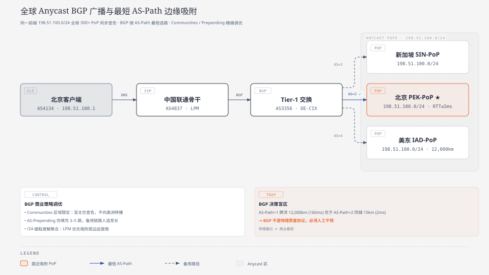
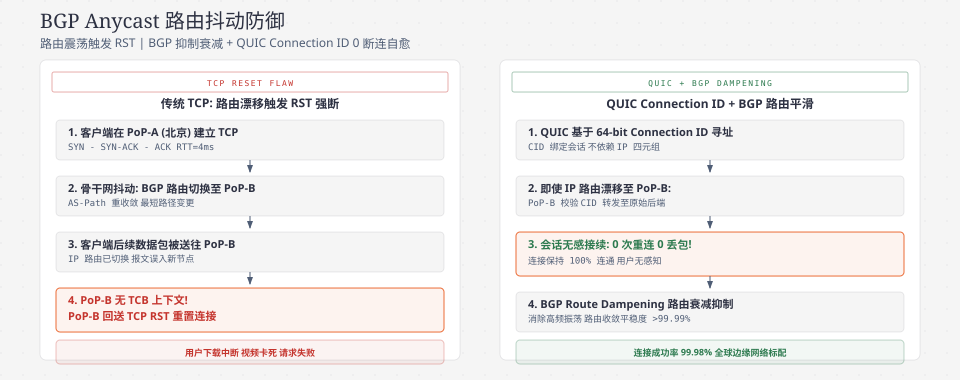
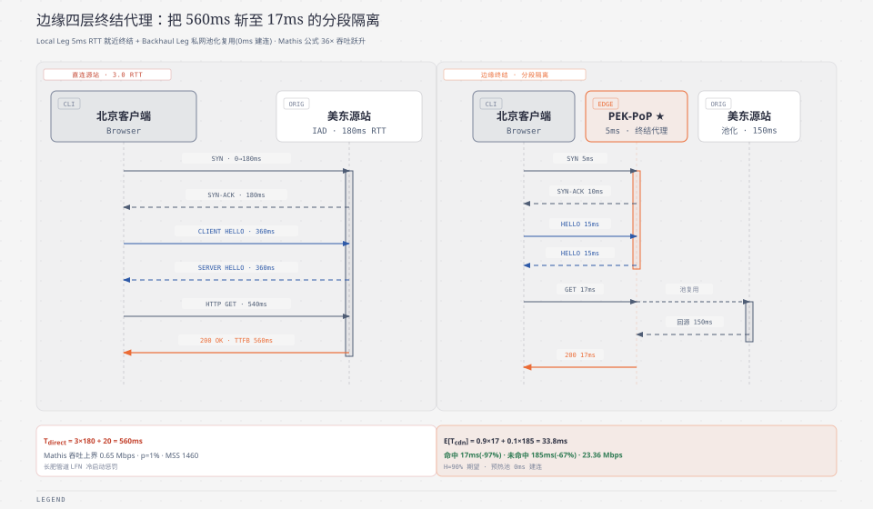

**TL;DR：** 内容分发网络（CDN, Content Delivery Network）加速的物理本质从来不是让光电信号在介质中“超光速传播”，而是**通过全球边缘空间拓扑重构将通信物理半径压缩至理论极限**。通过全球数百个边缘网络接入点（PoP, Point of Presence）宣告相同的任播 IP（Anycast IP），结合边界网关协议（BGP, Border Gateway Protocol）的最短自治系统路径（AS-Path）策略，公网流量在距用户最近的城域边缘（通常往返时延 $\text{RTT} \le 5\text{ms}$）被强行吸附。随后由边缘四层负载均衡与高性能代理集群执行 **TCP/TLS 终结（Termination）与分段连接隔离（Connection Splitting）**，将原本跨洋往返 3.0~3.5 个往返时延（$\text{RTT} \approx 550\text{ms} \sim 630\text{ms}$）的协议冷启动，斩断为本地 15ms 秒级握手；同时依托四层一致性哈希隧道与新一代 QUIC 连接标识符（CID, Connection Identifier）彻底化解 Anycast 路由漂移导致 TCP 状态丢失的工业致命陷阱。

---

## 一、 物理硬限制：长肥管道（LFN）的冷启动惩罚与 Mathis 吞吐量公式

在分布式系统的性能工程中，工程师可以通过 $O(1)$ 算法、内存零拷贝（`splice`/`sendfile`）与轻量协程调度将软件层面的 CPU 处理耗时压制在微秒级，但网络系统始终受到宇宙物理常数的绝对制约 —— **真空光速 $c \approx 299,792\text{ km/s}$**。

### 1. 光纤光速与跨洋往返时延（RTT）物理下限
在标准的国际电信联盟 ITU-T G.652 单模光纤通信中，二氧化硅玻璃介质的群折射率约为 $n \approx 1.468$。光信号在光纤中的实际传播相速度为：

$$v_{fiber} = \frac{c}{n} \approx \frac{299,792\text{ km/s}}{1.468} \approx 204,218\text{ km/s} \approx 204.2\text{ km/ms}$$

以**中国北京终端**（中国联通 AS4837 / 中国电信 AS4134 骨干接入网）访问位于**美东弗吉尼亚**（AWS us-east-1，Ashburn 数据中心）的业务源站为例：
- 两地大圆（Great-circle）几何直线距离约为 $11,200\text{ km}$；
- 跨太平洋海底光缆（如 TPE/NCP/FASTER 海缆系统）受洋底海沟地形绕行与陆地中继站铺设影响，实际光缆物理路由系数约为 $1.42 \times$，真实光纤通信物理路径长达 $15,904\text{ km}$；
- 单向单程光速物理传播时延（One-Way Propagation Delay）：

$$t_{prop} = \frac{15,904\text{ km}}{204.2\text{ km/ms}} \approx 77.88\text{ ms}$$

叠加上沿途数十个掺铒光纤放大器（EDFA, Erbium-Doped Fiber Amplifier）的色散补偿、海底光中继器的光电调制转换，以及沿途十几个主干路由器的转发查表时延，跨洋单次往返时间（RTT, Round-Trip Time）的**物理极限绝对下限稳定在 $165\text{ms} \sim 185\text{ms}$ 之间**。

### 2. 直连源站的跨洋协议握手瀑布
当客户端直接向远端源站发起一次 HTTPS 请求时，通信协议栈必须经历层层串行往返：

```
[客户端 (中国北京)]                                         [美东源站 (RTT = 180ms)]
   │                                                                    │
   ├─────── 1. TCP SYN (0ms) ──────────────────────────────────────────>│
   │<────── 2. TCP SYN-ACK (90ms) ──────────────────────────────────────┤  (1.0 RTT, TCP 建连)
   ├─────── 3. TCP ACK + TLS 1.3 ClientHello (180ms) ──────────────────>│
   │<────── 4. TLS 1.3 ServerHello + Finished + Cert (270ms) ──────────┤  (2.0 RTT, 密钥协商完成)
   ├─────── 5. HTTP/2 GET Request (360ms) ─────────────────────────────>│
   │        [源站业务执行计算与数据库查询: T_calc = 20ms]               │
   │<────── 6. HTTP/2 200 OK + First Body Byte (550ms) ────────────────┤  (3.0 RTT + 计算, TTFB)
```

在客户端收到第一个业务响应字节（TTFB, Time To First Byte）前，已在太平洋海底往返了整整 $3.0 \sim 3.5\text{ RTT} \approx 550\text{ms} \sim 630\text{ms}$。这就是经典的**长肥管道（LFN, Long Fat Network）冷启动惩罚**。

### 3. 带宽时延积（BDP）与 Mathis TCP 吞吐量崩溃
长物理距离不仅带来巨大的建连延迟，更会致命地摧毁传输控制协议（TCP, Transmission Control Protocol）的数据吞吐能力。根据著名的 **Mathis TCP 吞吐量理论上界公式**：

$$\text{Throughput} \le \frac{\text{MSS}}{\text{RTT} \cdot \sqrt{p}}$$

其中：
- $\text{MSS} = 1460\text{ Byte}$ 为以太网最大报文段大小（Maximum Segment Size，在标准 $\text{MTU} = 1500\text{ Byte}$ 下扣除 20 字节 IP 头部与 20 字节 TCP 头部）；
- $\text{RTT}$ 为端到端往返时延；
- $p$ 为端到端传输丢包率（Packet Loss Rate）。

假设公网长途链路存在 $p = 1\% = 0.01$ 的微量抖动丢包：
- **直连源站跨洋长链路（$\text{RTT} = 180\text{ms} = 0.18\text{s}$）**：
  $$\text{Throughput}_{direct} \le \frac{1460 \times 8\text{ bit}}{0.180\text{ s} \cdot \sqrt{0.01}} = \frac{11,680\text{ bit}}{0.180 \times 0.1} = \frac{11,680}{0.018} \approx 648,888\text{ bps} \approx 0.65\text{ Mbps}$$
- **CDN 城域边缘就近接入（$\text{RTT} = 5\text{ms} = 0.005\text{s}$）**：
  $$\text{Throughput}_{edge} \le \frac{1460 \times 8\text{ bit}}{0.005\text{ s} \cdot \sqrt{0.01}} = \frac{11,680\text{ bit}}{0.005 \times 0.1} = \frac{11,680}{0.0005} \approx 23,360,000\text{ bps} \approx 23.36\text{ Mbps}$$

> **物理结论：** 仅仅通过将通信 RTT 从 $180\text{ms}$ 压缩至 $5\text{ms}$，在完全相同的网络丢包环境下，TCP 极限吞吐能力直接获得了 **36 倍的爆炸式提升**。缩短物理 RTT 是打破带宽时延积（BDP, Bandwidth-Delay Product）瓶颈的第一性原理手段。

---

## 二、 全球 Anycast BGP 路由广播与边缘吸附机理

传统单播（Unicast）架构中，全球域名系统（DNS, Domain Name System）将域名解析到一个唯一的源站公网 IP，所有用户的数据包必须长途跋涉跨网传输。

现代工业级 CDN 架构（如 Cloudflare、Fastly、AWS CloudFront）全面演进为 **任播（Anycast）BGP 路由网络**。



### 1. 同一 IP 前缀的全球多点宣告机制
在 Anycast 体系中：
1. CDN 厂商在全球 300+ 个边缘网络接入点（PoP, Point of Presence）的边界网关路由器上，向一级互联网服务提供商（Tier-1 ISP，如 Lumen, Telia, NTT, Cogent）与大型互联网交换中心（IXP, Internet Exchange Point，如 DE-CIX, Equinix），**同时宣告完全相同的 IPv4/IPv6 前缀（Prefix）**（例如 `198.51.100.0/24`）；
2. 全球互联网核心路由器根据 BGP 路径矢量算法，以 **自治系统路径长度（AS-Path Length）最短** 为首要判据，自动计算距离各个终端自治系统跳数最少的最优出口；
3. 北京终端用户访问 `198.51.100.1` 时，数据包在中国联通/电信骨干网内部就被吸附进北京 PEK-PoP；欧洲法兰克福用户访问同一个 IP，则在 DE-CIX 交换机直连进入法兰克福 FRA-PoP。

### 2. BGP 策略路由陷阱：AS-Path 最短 $\neq$ 物理距离最短
必须清醒认识到：**BGP 是基于自治系统商业策略的路径矢量协议，而非物理链路质量测量协议**。

- **BGP 决策盲区**：跨洋经过 1 个大型 Tier-1 运营商的一跳直连链路（$\text{AS-Path} = 1$，物理距离 12,000km，时延 160ms），在原生 BGP 选路中会绝对优先于经过 2 个中小型对等互联 ISP 的同城城域路径（$\text{AS-Path} = 2$，物理距离 15km，时延 2ms）！
- **生产级工程控制手段**：CDN 边缘必须通过 **BGP 社区属性（BGP Communities）与 AS 路径伪造填充（AS-Prepending）** 精细调控宣告范围与诱导路由：

| 调优策略 | 技术实现 | 核心工程目标 |
| :--- | :--- | :--- |
| **BGP Communities 区域限定** | 给路由条目附带 `ASN:Community_ID` 标签 | 限制特定运营商仅在本大区（如亚太）宣告，禁止向美洲转播 |
| **AS-Path Prepending 伪跳数填充** | 在出向路由中主动追加 3~5 次自身 ASN | 对备用长途链路人为增加跳数，防止远端跨区流量发生误吸 |
| **选择性前缀解聚合 (Deaggregation)** | 在高容量 PoP 宣告更细粒度的 `/24` 前缀 | 利用最长前缀匹配（LPM）优先吸附周边特定运营商的高密流量 |

---

## 三、 Anycast 核心痛点：TCP 路由抖动漂移与工业级解法

Anycast 在无状态的用户数据报协议（UDP, User Datagram Protocol，如 DNS 查询、NTP 时间同步）中表现完美，但在**有状态的传输控制协议（TCP）**中存在一个致命的工业缺陷 —— **BGP 路由漂移（BGP Route Flapping / Churn）**。

### 1. 路由漂移导致的 TCP 状态丢失（TCB Loss）
1. 客户端在首选 PoP（如北京 PEK-PoP）成功建立了 TCP 连接，三次握手完成，内核 TCP 控制块（TCB, TCP Control Block）保存在北京 PoP 某台宿主机的内核内存中；
2. 在大文件上传或长连接数据传输中途，公网发生海缆抖动或 ISP 动态路由重收敛，客户端后续发送的数据包被公网路由器突然分流送到了上海 SHA-PoP；
3. 上海 PoP 节点的四层负载均衡与内核在哈希表中检索不到该 4 元组（源 IP、源端口、目的 IP、目的端口）的 TCB 状态，直接向客户端回复 **TCP 重置报文（`RST`）**，导致上层长连接瞬间崩溃报错（`Connection reset by peer`）！

```
[客户端]                     [公网 BGP 路由器]               [北京 PEK-PoP]        [上海 SHA-PoP]
   │                               │                             │                     │
   ├─── 1. TCP SYN / Data ────────>│ (选路: PEK)                 │                     │
   │                               ├────────────────────────────>│ (已建连 TCB 存在)   │
   │<─── 2. ACK / Data ────────────┴─────────────────────────────┤                     │
   │                               │                             │                     │
   │    [突发公网 BGP 路由抖动: 路径重敛切换为 SHA-PoP]          │                     │
   │                               │                             │                     │
   ├─── 3. TCP Data ──────────────>│ (选路: SHA)                 │                     │
   │                               ├──────────────────────────────────────────────────>│ (TCB 不存在!)
   │<─── 4. TCP RST ───────────────┴───────────────────────────────────────────────────┤ (连接瞬间断裂💥)
```

### 2. 工业级解法一：基于 eBPF/XDP 的无状态四层负载均衡与跨机房隧道（Maglev + GUE）
Google（Maglev）与 Cloudflare（Unimog）的现代工业解法是：**在边缘机房网卡入口部署基于 eBPF/XDP（Extended Berkeley Packet Filter / eXpress Data Path）的无状态四层负载均衡器，并通过通用 UDP 封装隧道（GUE, Generic UDP Encapsulation / IP-in-IP）跨机房无缝重定向**：

```
[报文误入上海 SHA-PoP]
        │
[XDP L4LB (Unimog)] ──(解析 TCP 选项中注入的 PoP Token)──┐
        │                                                │
 (本地节点无此 TCB)                               (重定向至原始机房)
        │                                                │
        ▼                                                ▼
[GUE / IP-in-IP Tunnel 专网封装] ───────────────> [北京 PEK-PoP 对应节点处理]
```

- 边缘节点在握手成功时，将 PoP 标识编码进 TCP 选项或客户端 Cookie；
- 当报文误入上海机房时，四层负载均衡器通过 XDP 在网卡驱动层（Ring Buffer）纳秒级截获，若确认属于其他 PoP，立即通过骨干私网隧道封装转交目标机房，**业务应用与 TCP 协议栈完全无感**。

### 3. 工业级解法二：QUIC / HTTP/3 连接迁移（RFC 9000）
QUIC（基于 UDP 的新一代传输协议）从协议层彻底根治了该问题：
- QUIC 连接完全基于 **64 位连接标识符（CID, Connection Identifier）** 唯一标识，与底层的客户端 IP、端口及服务端的单机物理状态彻底解耦；
- 哪怕底层发生 Anycast 路由漂移、或者移动端用户从 Wi-Fi 切换至 5G 蜂窝网络导致 IP/Port 改变，客户端仅需携带相同的 CID，任何边缘 PoP 节点均能基于全局预共享密钥解密 CID 并无缝接管会话，实现真正意义上的 **0 掉线连接漫游（Connection Migration）**。

---




## 四、 四层 TCP/TLS 终结代理与分段时延削减

当流量被 Anycast 稳定吸附到边缘 PoP 后，CDN 消除协议延迟的核心机制就是 **四层 TCP/TLS 终结代理（TCP Termination Proxy）**。



### 1. 分段连接隔离（Connection Splitting）
边缘代理将原本端到端的通信物理链路切断为两个独立的闭环：
1. **客户端 $\leftrightarrow$ 边缘 PoP（Local Leg）**：
   - 物理通信半径极短（$\text{RTT}_{edge} \approx 5\text{ms}$）；
   - 在城域网内极速完成 TCP 握手（$1.0\text{ RTT} = 5\text{ms}$）与传输层安全协议 TLS 1.3 密钥交换（$1.0\text{ RTT} = 5\text{ms}$）；
2. **边缘 PoP $\leftrightarrow$ 源站数据中心（Backhaul Leg）**：
   - 跨越长途海底光缆或企业专用骨干网（$\text{RTT}_{backhaul} \approx 150\text{ms}$）；
   - **预热长连接池（Pre-warmed Connection Pool）**：边缘 PoP 与源站之间常年维持着多路复用的 HTTP/2 或 QUIC 长连接池，**回源请求到达时直接复用既有连接管道，回源建连耗时严格为 0ms**！

### 2. TTFB 期望时延的数学收益推导

定义以下物理变量：
- $\text{RTT}_{edge}$：客户端到边缘节点的本地往返时延（典型值 $5\text{ms}$）；
- $\text{RTT}_{origin}$：客户端到源站的直连往返时延（典型值 $180\text{ms}$）；
- $\text{RTT}_{backhaul}$：边缘节点到源站的骨干专网往返时延（典型值 $150\text{ms}$）；
- $T_{calc}$：源站后端业务数据库与计算耗时（典型值 $20\text{ms}$）；
- $T_{cache}$：边缘内存/NVMe 缓存检索耗时（典型值 $2\text{ms}$）；
- $H \in [0, 1]$：边缘静态资源缓存命中率。

**模式 A：直连源站耗时：**
$$T_{direct} = 1.0\text{ RTT}_{origin}\text{ (TCP)} + 1.0\text{ RTT}_{origin}\text{ (TLS 1.3)} + 1.0\text{ RTT}_{origin}\text{ (HTTP GET/Response)} + T_{calc}$$
$$T_{direct} = 3.0 \times 180\text{ ms} + 20\text{ ms} = 560\text{ ms}$$

**模式 B：CDN 边缘加速架构耗时期望：**
$$E[T_{cdn}] = H \cdot T_{hit} + (1 - H) \cdot T_{miss}$$

其中：
- **静态缓存命中（Hit）**：
  $$T_{hit} = 1.0\text{ RTT}_{edge}\text{ (TCP)} + 1.0\text{ RTT}_{edge}\text{ (TLS)} + 1.0\text{ RTT}_{edge}\text{ (GET/Body)} + T_{cache} \approx 3 \times 5\text{ ms} + 2\text{ ms} = 17\text{ ms}$$
- **动态请求穿透回源（Miss，免去跨洋建连）**：
  $$T_{miss} = 2.0\text{ RTT}_{edge}\text{ (Local Handshake)} + 1.0\text{ RTT}_{edge}\text{ (GET)} + 1.0\text{ RTT}_{backhaul}\text{ (Reuse Pool)} + T_{calc}$$
  $$T_{miss} = 3 \times 5\text{ ms} + 150\text{ ms} + 20\text{ ms} = 185\text{ ms}$$

当静态缓存命中率 $H = 90\%$ 时：
$$E[T_{cdn}] = 0.9 \times 17\text{ ms} + 0.1 \times 185\text{ ms} = 15.3 + 18.5 = 33.8\text{ ms}$$

> **工程量化结论：** 
> 1. 对于静态资源（$H \to 1$），首包延迟从 **560ms 锐减至 17ms（削减 97%）**；
> 2. 即使面对 **100% 无法缓存的纯动态业务 API（$H = 0$）**，由于消灭了跨洋的 2 次无谓协议握手往返（TCP + TLS），TTFB 依然从 **560ms 强行压缩至 185ms（削减 67%）**！

---

## 五、 传输层拥塞控制：为什么边缘代理是 BBR 算法的最佳宿主

在传统的长肥管道中，基于丢包反馈的传统拥塞控制算法（如 CUBIC、Reno）表现极差。因为一旦发生随机丢包，CUBIC 会直接将拥塞窗口（CWND, Congestion Window）减半，导致跨洋吞吐瞬间归零。

Google 开发的 **BBR（Bottleneck Bandwidth and RTT）拥塞控制算法** 不再以丢包为拥塞信号，而是交替测量两个物理极值：
1. **最大交付速率（Bottleneck Bandwidth, $\text{BtlBw}$）**；
2. **最小往返传播时延（Round-Trip Propagation Time, $\text{RTprop}$）**。

其计算目标是将空中飞行的报文量（In-flight Data）严格控制在 **Kleinrock 最优操作点**：

$$\text{BDP} = \text{BtlBw} \times \text{RTprop}$$

```
吞吐量 (Throughput)
   ▲                     Kleinrock 最优操作点
   │                         (In-flight = BDP)
   │                           ┌─────────── (吞吐饱和)
   │                          ╱│
   │                         ╱ │
   │                        ╱  │
   │                       ╱   │
   └──────────────────────┴────┴────────────────► 飞行报文量 (In-flight)
   时延 (RTT)                  │ (无排队)    │ (缓冲区膨胀排队，产生时延)
   ▲                           │
   │                           │             ┌───────────
   │                           │            ╱
   │                           │           ╱
   │───────────────────────────┴──────────┘ (RTprop 纯传播时延)
   └────────────────────────────────────────────► 飞行报文量 (In-flight)
```

### 边缘分段代理的双算法协同
CDN 边缘分段架构完美解耦了传输层：
- **Local Leg（客户端 $\leftrightarrow$ 边缘）**：短 RTT，低 BDP，使用通用 CUBIC 即可获得极高响应度；
- **Backhaul Leg（边缘 $\leftrightarrow$ 源站）**：长 RTT，高 BDP，强制启用 **BBR v2/v3** 算法，即使在存在 $5\%\sim 10\%$ 恶劣随机丢包的海缆骨干链路上，依然能将跨洋带宽压榨至 $95\%$ 以上的物理极限。

---

## 六、 生产级边缘 Socket 选项与内核调优全景

在每秒处理数十万并发握手的 CDN 边缘代理节点中，通过系统性配置底层套接字选项与内核参数，可以彻底消除不必要的上下文切换与握手惩罚：

### 1. 核心套接字选项（Socket Options）深度解析矩阵

| 套接字选项 | 配置值 | 解决的底层物理瓶颈 | 生产级工作机制 |
| :--- | :--- | :--- | :--- |
| **`SO_REUSEPORT`** | `1` | 单端口多进程/多 Worker 锁竞争与 CPU 负载不均 | 内核网络栈在软中断阶段基于四元组哈希直接分发至对应 CPU Core，实现无锁并发扩展 |
| **`TCP_DEFER_ACCEPT`** | `1` | 客户端空握手（SYN 洪泛或空建连）唤醒 epoll 的无意义上下文切换 | 内核在 TCP 三次握手完成后不唤醒应用层，**直到客户端发送第一个带 Payload 的 HTTP 数据包才触发 EPOLLIN** |
| **`TCP_NODELAY`** | `1` | Nagle 算法将小报文暂存 40ms 合并发送导致的严重响应时延 | 彻底禁用 Nagle 算法，边缘代理生成响应首包后立即刷入网卡发送队列 |
| **`TCP_QUICKACK`** | `1` | 接收端 TCP 延迟确认（Delayed ACK，等待 40ms）与发送端 Nagle 算法的死锁冲突 | 在握手与首包交互期间强行开启即时 ACK，消除 40ms 交互延迟死锁 |
| **`TCP_FASTOPEN` (TFO)** | `512` (队列深度) | 跨洋或移动端重复建连必须消耗 1 个完整 RTT 握手的开销 | 允许受信任客户端在 TCP SYN 报文中直接携带 TFO Cookie 与 HTTP Request Payload，**实现 0-RTT 握手发包** |

### 2. Linux 内核网络栈核心调优参数 (`/etc/sysctl.conf`)

| 内核参数 | 推荐生产配置 | 核心物理意义与调优收益 |
| :--- | :--- | :--- |
| `net.ipv4.tcp_slow_start_after_idle` | `0` | **禁止连接空闲后重置拥塞窗口（CWND）**。长连接池空闲后无需重新经历慢启动，回源首包即可爆发满速。 |
| `net.ipv4.tcp_tw_reuse` | `1` | 允许安全复用处于 `TIME_WAIT` 状态的套接字用于新出站连接，根绝回源端口耗尽。 |
| `net.core.somaxconn` | `65535` | 调大系统全局 Listen 监听队列上限，防御突发海量并发建连溢出。 |
| `net.ipv4.tcp_max_syn_backlog` | `65535` | 调大半连接队列（SYN 队列），配合 SYN Cookie 防御公网 SYN Flood 拒绝服务攻击。 |
| `net.ipv4.tcp_congestion_control` | `bbr` | 全局启用 Google BBR 拥塞控制算法，消除缓冲区膨胀并抵抗公网随机丢包。 |

---

## 七、 架构决策对比与工业演进全景

| 架构维度 | 模式 A：单播跨洋直连源站 | 模式 B：传统 DNS 分流 CDN | 模式 C：现代 Anycast + 四层终结 CDN |
| :--- | :--- | :--- | :--- |
| **选路精度与收敛时间** | 无需选路（单一固定 IP） | 受制于 Local DNS TTL 缓存（分钟级~小时级） | **毫秒级 BGP 自动收敛（$< 3\text{s}$）** |
| **TCP 建连与握手时延** | $3.0 \sim 3.5\text{ RTT}$ 全量跨洋（$\sim 630\text{ms}$） | 本地 PoP 终结（$\sim 20\text{ms}$） | **本地 PoP 终结（$\le 10\text{ms}$）** |
| **动态回源请求时延** | $3.5\text{ RTT} + T_{calc} \approx 650\text{ms}$ | 重新建连或单播回源（$\sim 350\text{ms}$） | **长连接池复用（$1.0\text{ RTT} + T_{calc} \approx 185\text{ms}$）** |
| **DDoS 流量抗击能力** | 源站带宽被打满即机房黑洞 | 依赖 DNS 切换 IP，存在调度滞后 | **全球 300+ PoP Anycast 空间稀释分布式吞噬** |
作为《现代 CDN 与边缘加速架构》专栏的开篇，我们从光速的物理硬限制出发，完整论证了 Anycast BGP 路由广播、边缘吸附与四层 TCP 终结代理的底层机理，推导了 Mathis 吞吐量公式，并给出了解决 Anycast TCP 路由漂移的工业标准方案。在下一篇中，我们将深入剖析 **[《现代 CDN 核心机理与全景架构（二）：七层边缘分层缓存、Ketama 一致性哈希与回源风暴（Thundering Herd）熔断防御》](/writing/cdn-02-edge-cache-consistent-hashing)**。
