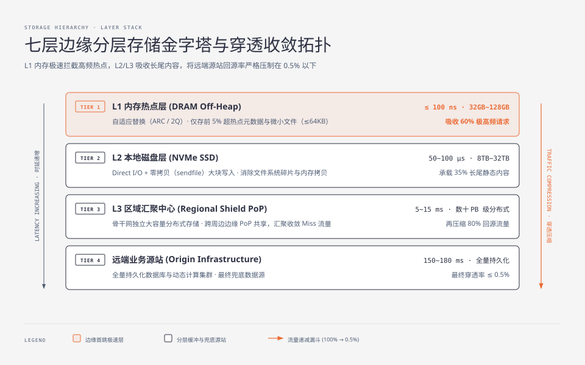
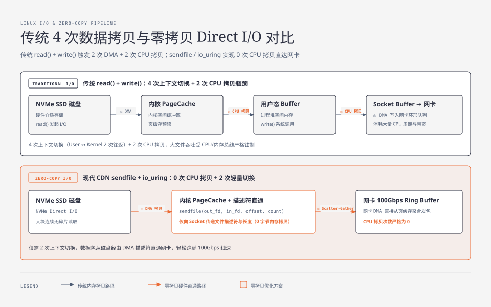
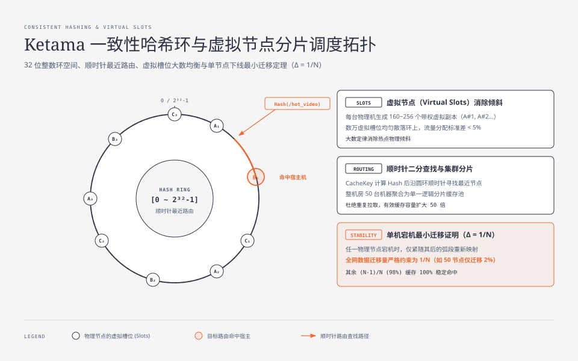
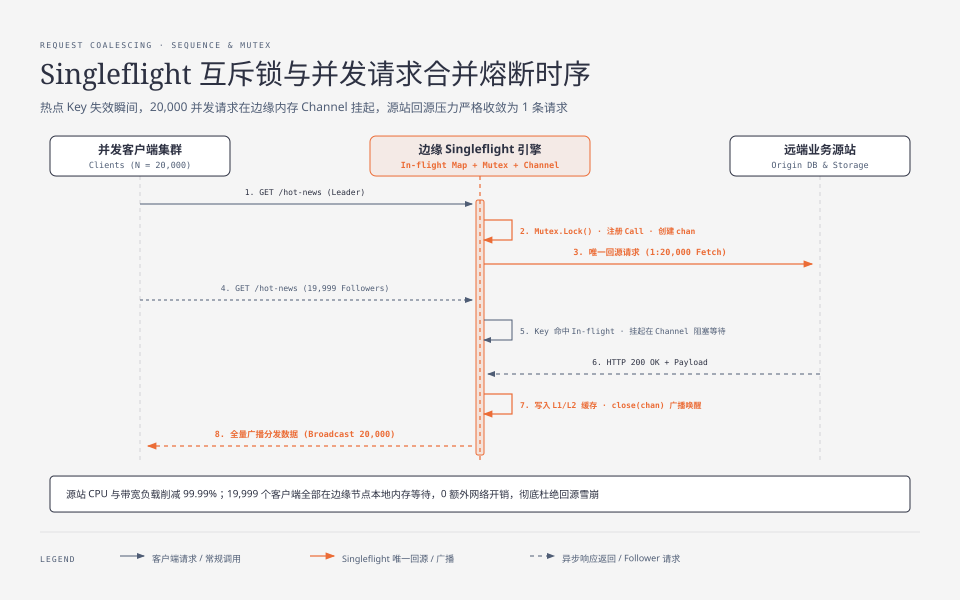
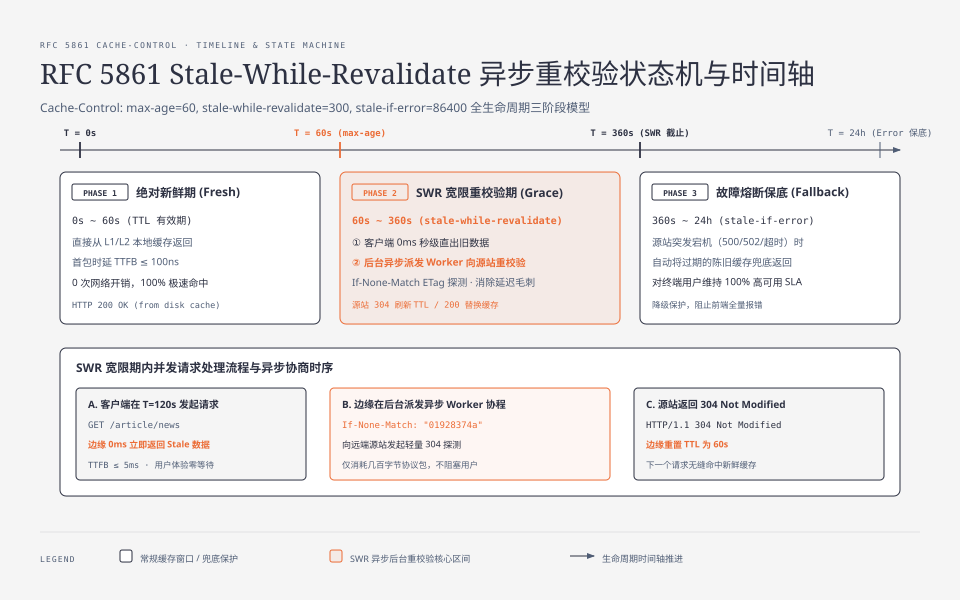
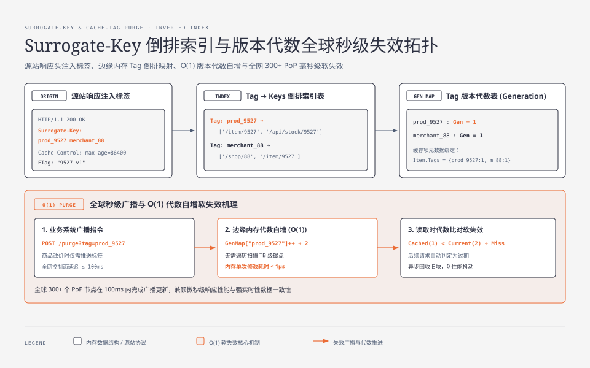

**TL;DR：** 在内容分发网络（CDN, Content Delivery Network）架构中，当四层传输层利用任播（Anycast）将客户端的 TCP/TLS 握手终结在城域边缘后，**七层应用层反向代理的核心使命，就是用有限的边缘硬件资源支撑海量高并发请求，并将源站回源流量严格压制在 1% 以下**。现代工业级 CDN 依托三大支柱实现这一目标：一是构建 **L1 内存（DRAM）+ L2 本地高速固态硬盘（NVMe SSD）+ 区域收敛中心（Regional Shield）的三级存储金字塔**；二是引入带虚拟槽位的 **Ketama 一致性哈希算法**，将机房内数十台独立服务器整合成统一的分片缓存集群，消除重复热点并将有效缓存容量扩大数十倍；三是通过 **Singleflight（请求合并）互斥锁状态机**，在热点资源过期瞬间将数万并发穿透聚合成唯一定点回源，从物理上彻底根绝回源风暴（Thundering Herd）与源站雪崩。

---

## 一、 七层边缘分层存储拓扑（Storage Hierarchy）

在现代超大规模边缘网络接入点（PoP, Point of Presence）中，单台服务器的物理资源是严格受限的。一台标准的 2U 边缘物理机通常配置：
- **内存（RAM, Random Access Memory）**：$128\text{GB} \sim 512\text{GB}$ 高速动态随机存取内存（DRAM）；
- **磁盘（SSD, Solid-State Drive）**：$4 \times 3.84\text{TB}$ 非易失性高速固态硬盘（NVMe SSD, Non-Volatile Memory Express）；
- **网卡带宽**：$2 \times 100\text{Gbps}$ 聚合网络接口。

面对每秒数百万次查询（QPS, Queries Per Second）的高密请求，若全部由内存承载，成本将呈指数级爆炸；若全部读取磁盘，NVMe 的纳秒级 I/O 排队依然会拖慢首包响应时延（TTFB, Time To First Byte）。因此，现代 CDN 演进出了严格的 **分层存储架构（Storage Hierarchy）**。



### 1. 存储金字塔的物理特征矩阵

| 缓存层级 | 存储介质 | 访问时延（Latency） | 典型单机容量 | 缓存淘汰策略与管理机制 | 业务承载角色 |
| :--- | :--- | :--- | :--- | :--- | :--- |
| **L1 内存热点层** | DRAM 堆外内存（Off-Heap） | $\le 100\text{ ns}$ | $32\text{GB} \sim 128\text{GB}$ | **自适应替换缓存（ARC / 2Q）**，只存前 5% 超热点资源元数据与微小文件（$\le 64\text{KB}$） | 吸收 60% 极高频静态小文件，实现微秒级响应 |
| **L2 本地磁盘层** | NVMe SSD 高速存储 | $50\mu\text{s} \sim 100\mu\text{s}$ | $8\text{TB} \sim 32\text{TB}$ | **Direct I/O + 零拷贝（`sendfile`）**，大块连续写入，消除文件系统碎片 | 存放 35% 长尾静态内容（大图片、音视频分片、JS/CSS 包） |
| **L3 区域汇聚层 (Regional Shield)** | 骨干网独立 PoP 存储集群 | $5\text{ms} \sim 15\text{ms}$ | 数十 PB 级分布式存储 | **分布式对象存储与冷热分级引擎**，跨周边十几个边缘 PoP 统一共享 | 汇聚周边边缘 PoP 的 Miss 流量，将源站回源流量再压缩 80% |
| **远端业务源站 (Origin)** | 数据库与云存储（如 AWS S3） | $150\text{ms} \sim 180\text{ms}$ | 全量持久化数据 | 业务系统计算、数据库事务读写、原始素材存储 | 最终兜底数据源，仅承载 $\le 0.5\%$ 的穿透请求 |

### 2. 零拷贝与 Direct I/O：消除内核缓冲区双重拷贝
在 L2 磁盘层读取数十兆的静态视频或安装包时，传统 `read()` + `write()` 系统调用会在内核页缓存（Page Cache）与用户态内存之间发生 2 次 CPU 拷贝和 4 次上下文切换：



现代 CDN 反向代理（如基于 Nginx/Envoy 或自研 Rust/Go 引擎）在 L2 命中时，采用 **Linux `sendfile` 系统调用结合异步 I/O（`io_uring`）**：
- DMA（直接内存访问）控制器直接将磁盘数据送入内核缓冲区，并由网卡分散-聚集（Scatter-Gather）机制直接读取发送，**CPU 拷贝次数严格归零**，单机大文件吞吐轻松跑满 100Gbps 网卡线速。

---

## 二、 集群级哈希路由：Ketama 一致性哈希与虚拟节点分片

在大型城域 PoP（例如中国北京联通机房）中，通常部署有 30~80 台独立的高性能缓存服务器。

如果入口负载均衡器对这 50 台服务器采用传统的**轮询（Round-Robin）或随机调度**，会引发灾难性的系统性内耗：
1. **缓存重复冗余**：同一个热门视频（例如 `/video/hot_stream.ts`）会被这 50 台机器各自回源拉取并缓存一份，导致机房内有效缓存容量缩水为原来的 $\frac{1}{50}$；
2. **缓存命中率暴跌**：后续用户请求随机落到未缓存该文件的机器上，引发频繁的重复回源，整体命中率从 98% 跌落至 60% 以下。

### 1. 模运算哈希（Hash % N）的致命缺陷
如果采用最简单的取模哈希算法：

$$\text{ServerIndex} = \text{Hash}(\text{RequestURI}) \pmod N$$

当机房内某台服务器发生硬件故障下线（节点数由 $N$ 变为 $N-1$）或业务高峰扩容（由 $N$ 变为 $N+1$）时，由于分母变化，**几乎 100% 的现有 Key 的哈希映射全部错位**。整个机房瞬间发生**全量缓存失效**，数百万请求同一秒砸向源站，引发机房级雪崩！

### 2. Ketama 一致性哈希环的数学机理

为了解决这一难题，业界标准是采用由 Last.fm 提出的 **Ketama 一致性哈希算法（Consistent Hashing Ring）**。



#### (1) 环空间映射与顺时针路由
1. 整个哈希空间被组织为一个首尾相连的逻辑圆环，取值范围为 $[0, 2^{32}-1]$（32 位无符号整数空间）；
2. 每一个请求的缓存键（Cache Key，由 `Host + URI + QueryString` 构成）通过哈希函数（如 MurmurHash3 或 MD5）映射到环上的某个具体整数点；
3. 数据沿着圆环**顺时针寻找距离其最近的第一个节点**，该节点即为负责该请求的唯一存储宿主机。

#### (2) 虚拟节点（Virtual Nodes）消除数据倾斜
若直接将物理节点 IP 映射到环上，由于节点数量较少（如 50 个点），在圆环上的分布极度不均匀，会导致某些机器分担 80% 的流量，而其他机器闲置（数据倾斜）。

Ketama 的工程解法是引入 **虚拟节点（Virtual Slots）**：
- 每台物理服务器根据其权重，生成 $160 \sim 256$ 个带编号的虚拟副本（例如 `NodeA#1`, `NodeA#2` $\dots$ `NodeA#200`）；
- 将这数万个虚拟节点均匀撒落在 $[0, 2^{32}-1]$ 环上；
- **数学收益**：根据大数定律，当虚拟节点数 $\ge 160$ 时，各物理节点的流量分配标准差低于 $5\%$，实现近乎完美的高负载均衡。

#### (3) 节点宕机扰动最小化证明
当某台物理节点宕机被剔除时，仅有顺时针紧随其虚拟节点之后的一小段圆弧数据需要重新映射到下一个邻居节点。
- **数据迁移量上界**：对于拥有 $N$ 个节点的集群，发生单节点故障或扩容时，**受影响的数据比例严格为 $\Delta = \frac{1}{N}$**，其余 $\frac{N-1}{N}$（例如 50 台机器中的 98%）的请求映射保持完全不变，缓存依然 100% 稳定命中！

---

## 三、 回源风暴（Thundering Herd）与 Singleflight 请求合并熔断

在 CDN 生产运营中，最危险的场景从来不是持续的平稳流量，而是 **突发热点资源在缓存失效瞬间的“回源雪崩”（Cache Stampede / Thundering Herd）**。

### 1. 回源风暴的发生机理
假设中国北京发生突发重大新闻，或者某知名游戏发布数十 GB 的更新补丁：
1. 该资源的缓存生存时间（TTL, Time To Live）设置为 60 秒；
2. 在第 60.001 秒，边缘节点的缓存项刚好过期失效；
3. 在接下来的 100 毫秒内，全网并发涌入 20,000 个用户请求；
4. 这 20,000 个并发请求同时检查本地缓存，全部判定为 **Cache Miss**；
5. 如果没有并发控制，这 20,000 个请求将同时发起跨洋回源连接，源站数据库连接池与带宽瞬间被打爆，接口全部超时报错，引发全链路瘫痪。

### 2. Singleflight（请求合并）状态机与互斥锁熔断

现代 CDN 边缘代理（如 Go/Rust 自研代理或 Nginx `proxy_cache_use_stale updating`）内置了高效的 **Singleflight 请求合并机制**。



### 3. Singleflight 核心机制深度解析

| 机制维度 | 传统无并发控制代理 | 生产级 Singleflight 请求合并代理 |
| :--- | :--- | :--- |
| **并发回源连接数** | $N$（全量穿透，例如 20,000 连接） | **严格为 1（1:N 极致聚合）** |
| **源站后端 CPU/带宽消耗** | 承受 20,000 倍洪峰冲击，引发宕机 | **仅消耗 1 个标准请求的算力与带宽（削减 99.99%）** |
| **等待端阻塞模型** | 客户端在远端网络上消耗 TCP 窗口与 RTT | **在本地边缘内存 Channel/epoll 挂起，0 额外网络消耗** |
| **回源失败降级保护** | 20,000 个请求同时收到 504 Gateway Timeout | **支持 `stale-if-error` 兜底，自动将旧缓存返回给所有等待者** |

---

## 四、 HTTP 缓存控制协议与 RFC 5861 SWR 异步重校验

HTTP 协议提供了极其丰富的缓存控制标头（Cache-Control Headers），现代 CDN 依据严格的状态机解析这些协议语义：

### 1. 核心 Cache-Control 指令语义矩阵

| 响应标头指令 | 协议标准定义 | CDN 边缘节点执行行为 |
| :--- | :--- | :--- |
| **`public`** | 允许任何节点（客户端、边缘代理）公开缓存 | 允许存入 L1/L2 共享缓存池，向所有用户分发 |
| **`private`** | 仅允许终端用户浏览器私有缓存 | **CDN 边缘绝对不缓存**，直接透传回源 |
| **`max-age=N`** | 资源在客户端浏览器中的有效秒数 | 浏览器本地缓存 $N$ 秒 |
| **`s-maxage=N`** | **共享代理（Shared Cache）专用有效期** | 边缘 CDN 严格按照 $N$ 秒缓存，覆盖 `max-age` 的数值 |
| **`no-cache`** | 每次使用缓存前必须向源站进行协商确认 | 边缘保留副本，但每次必须带 `ETag` 向上游发起 `304` 探测 |
| **`no-store`** | 严禁任何持久化存储（敏感保密数据） | **物理内存与磁盘均不保留任何字节**，即刻销毁 |
| **`immutable`** | 资源在 TTL 内绝不会发生任何改变 | 彻底禁用用户的 F5 刷新协商，禁止向源站发包探针 |

### 2. RFC 5861：Stale-While-Revalidate（SWR）状态机

传统缓存模型中，一旦缓存到期，下一个用户请求必须同步等待回源完成才能拿到响应，产生数百毫秒的延迟抖动。

IETF RFC 5861 引入了 **`stale-while-revalidate`（SWR）** 机制，彻底消除了过期时的延迟毛刺：

```http
HTTP/1.1 200 OK
Content-Type: application/json
Cache-Control: max-age=60, stale-while-revalidate=300, stale-if-error=86400
ETag: "01928374a"
```



1. **绝对新鲜期（0 ~ 60s）**：直接返回 L1/L2 缓存，TTFB $\le 5\text{ms}$；
2. **SWR 宽限期（60s ~ 360s）**：
   - 客户端发起请求时，边缘**毫不犹豫直接返回本地持有的稍微过期的旧缓存（Stale Data）**，用户体验依然是极致的 $0\text{ms}$ 等待！
   - 与此同时，边缘在后台异步派发一个轻量协程（Worker），携带 `If-None-Match: "01928374a"` 向源站发起异步协商；
   - 源站若返回 `304 Not Modified`，边缘毫秒级刷新元数据并重置 TTL；若返回 `200 OK`，静默替换本地缓存。
3. **`stale-if-error` 业务熔断保底**：若源站突发故障宕机（返回 `500/502/503` 或网络超时），在设定的 24 小时（86400s）内，边缘继续提供旧版本服务，**对外表现为 100% 可用率**！

---

## 五、 全局秒级缓存失效（Cache Purge）与 Surrogate-Key 标签拓扑

在电商秒杀、突发新闻修正或前端版本发布时，业务方需要主动将全球数百个 PoP 的缓存立即清除。

### 1. 三种清除粒度的技术实现与复杂度

| 清除模式 | 触发方式 | 底层实现机理 | 全球收敛耗时 |
| :--- | :--- | :--- | :--- |
| **URL 精确清除 (Single URL)** | `POST /purge?url=...` | 精确计算哈希值，删除对应 L1/L2 索引键 | $\le 150\text{ ms}$ |
| **目录前缀清除 (Wildcard / Prefix)** | `POST /purge?prefix=/static/v2/*` | 边缘 Radix-Tree / Trie 前缀树批量失效标记 | $\le 300\text{ ms}$ |
| **标签联动清除 (Surrogate-Key / Cache-Tag)** | `POST /purge?tag=product_9527` | **反向倒排索引（Inverted Index）+ 版本号自增** | $\le 100\text{ ms}$ |

### 2. Surrogate-Key / Cache-Tag 的倒排索引魔法
对于复杂的现代 Web 页面（例如一个电商商品详情页包含：商品信息、商家评价、推荐列表、库存状态），其由多个微服务数据组合而成：



- 源站在输出 HTTP 响应头时注入标签：
  ```http
  Surrogate-Key: product_9527 merchant_88 category_digital
  ```
- 边缘节点在存储该缓存时，在内存中维护 **Tag $\to$ Set(CacheKey) 倒排索引** 与 **Tag 版本代数表（Generation Map）**；
- 当商家仅修改商品价格时，业务系统仅需广播指令 `Purge-Tag: product_9527`：
  - 边缘无需遍历扫描 TB 级磁盘，仅需将内存中 `product_9527` 的版本代数加 1（$O(1)$ 复杂度）；
  - 后续请求到达时比对代数，旧代数自动判定为无效，**在全球 300+ 个 PoP 节点实现 100 毫秒内的全网秒级即时失效**！

---

## 六、 架构决策对比与工业演进全景

| 架构维度 | 模式 A：单机随机本地缓存 | 模式 B：传统取模哈希分片 | 模式 C：现代分层 + 一致性哈希 + Singleflight CDN |
| :--- | :--- | :--- | :--- |
| **有效缓存容量** | 单机容量（$1\times$，各机大量冗余） | 集群总和（$N\times$） | **全集群分层复用（$N\times$，消除重复占用）** |
| **节点故障时缓存丢失率** | 该机器 100% 失效 | **全集群 100% 缓存雪崩** | **仅影响 $\frac{1}{N}$ 弧段（98% 依然稳定命中）** |
| **热点资源过期并发回源** | 50 台机器各自并发穿透 | 单机数十并发穿透 | **Singleflight 严格限制为 1 个 In-flight 回源** |
| **过期更新首包时延** | 同步等待跨洋回源（$>180\text{ms}$） | 同步等待跨洋回源（$>180\text{ms}$） | **RFC 5861 SWR 异步重校验（$\le 5\text{ms}$ 极速返回）** |
| **源站回源流量压力** | 极大（回源率 $\sim 35\%$） | 较大（回源率 $\sim 15\%$） | **极小（回源率严格控制在 $\le 1\%$）** |

至此，在《现代 CDN 与边缘加速架构》的第二篇中，我们完整拆解了七层分层存储拓扑、Ketama 一致性哈希分片、Singleflight 回源风暴熔断机制与 SWR 协议状态机的底层实现。在下一篇中，我们将深入剖析 **[《现代 CDN 核心机理与全景架构（三）：动态请求加速（DCA）、私有骨干专网智能路由与 TCP 拥塞控制实战》](/writing/cdn-03-dynamic-acceleration-smart-routing)**。
