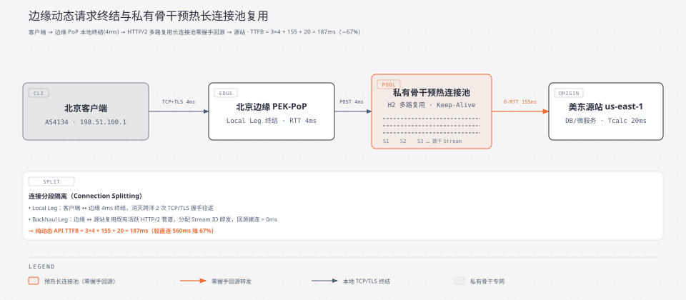
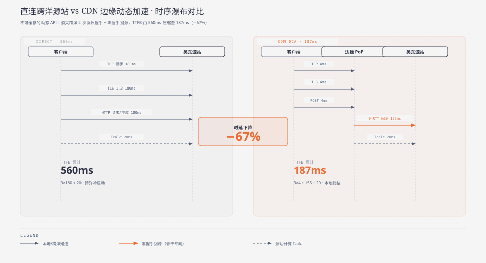
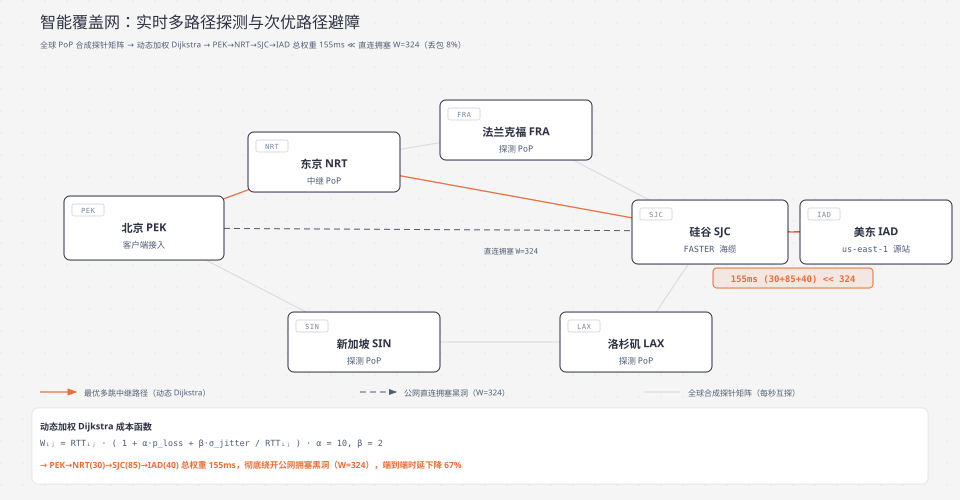
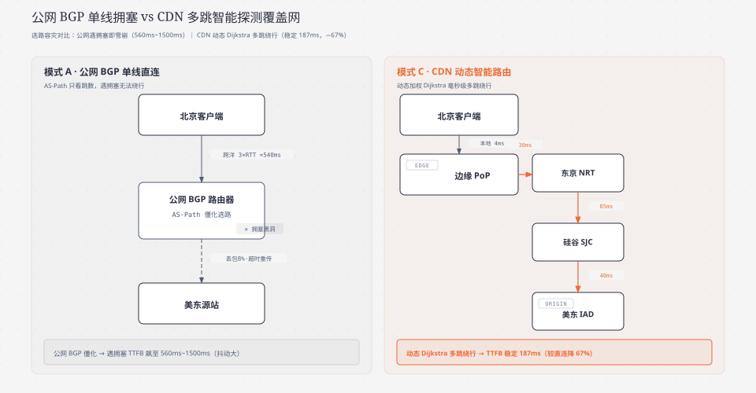

**TL;DR：** 许多工程师存在一个认知误区，认为“CDN 只能加速静态图片与音视频，对动态 API 和交易请求毫无作用”。**事实上，现代 CDN 超过 40% 的流量价值体现在动态内容加速（DCA, Dynamic Content Acceleration）上**。面对 100% 无法缓存的动态数据（如 `POST /api/v1/order` 下单支付、个性化推荐流、WebSocket 实时信令），CDN 通过三大底层机制实现加速：一是在城域边缘就近执行 **TCP/TLS 终结（Local Leg 握手仅需 4ms）**，消灭跨洋协议往返；二是在边缘与源站之间常年维持 **预热长连接池（Pre-warmed Connection Pool）与多路复用（Multiplexing）**，使跨洋回源建连耗时严格归零；三是构建 **全球实时探测智能覆盖网（Smart Overlay Routing）**，利用动态加权 Dijkstra 算法毫秒级绕行公网 BGP 拥塞节点，结合 **BBR 拥塞控制算法** 压榨跨洋长肥管道的极限吞吐，使动态 API 的首包响应时延（TTFB）暴降 **67% 以上**。

---

## 一、 动态内容加速（DCA）的物理本质与痛点剖析

在现代 Web 应用与移动端架构中，绝大部分核心业务数据都是**高度动态且无法静态缓存的**：
- **实时交易接口**：如电商下单、金融扣款（`POST /trade/checkout`，包含幂等性 Token 与动态鉴权 Header）；
- **用户个性化流**：如社交动态信息流、千人千面的推荐算法 Feed；
- **长连接双向通信**：如在线协作白板、实时游戏状态同步、WebRTC 信令交互。

这些请求在 HTTP 语义上通常携带 `Cache-Control: no-store, private`，无法直接通过边缘节点的内存或磁盘进行命中缓存。

### 1. 传统公网直连的“三重时延雪崩”
当中国北京的终端用户直接通过公网访问部署在美东弗吉尼亚（AWS us-east-1 数据中心）的动态业务 API 时，必须承受三重致命的物理延迟打击：

1. **跨洋协议冷启动开销**：单次请求必须在太平洋海底来回穿梭 3 次（TCP 握手 1 RTT + TLS 协商 1 RTT + HTTP 请求响应 1 RTT），在数据还没开始处理前就已经耗费了 $540\text{ms}$；
2. **公网 BGP 路由僵化与单点拥塞**：公网 BGP 选路只看自治系统跳数（AS-Path），当某个跨洋主干路由器发生光纤老化、拥塞排队甚至 $5\%\sim 8\%$ 随机丢包时，公网路由器无法自动感知与绕道，导致 TCP 频繁超时重传，延迟飙升至数秒；
3. **TCP 慢启动（Slow Start）吞吐被锁死**：新建连接的拥塞窗口（CWND, Congestion Window）初始值极小（通常 $\text{initcwnd} = 10\text{ MSS}$），在长达 $180\text{ms}$ 的往返时延下，大 Payload 请求无法瞬间跑满带宽。

---

## 二、 边缘终结与预热长连接池复用（Connection Pooling）

CDN 解决动态请求冷启动的第一项核心武器，就是 **分段连接隔离（Connection Splitting）与预热长连接池（Pre-warmed Connection Pool）**。

### 1. 边缘协议终结（Local Leg 极速握手）
- 客户端在城域网内连接距其最近的北京边缘接入点（PEK-PoP，$\text{RTT}_{edge} \approx 4\text{ms}$）；
- 客户端与边缘节点在本地毫秒级完成 TCP 三次握手（$4\text{ms}$）与 TLS 1.3 密钥协商（$4\text{ms}$）；
- 客户端在第 $8\text{ms}$ 即可直接向边缘代理推送 HTTP POST 业务载荷。

### 2. 私有骨干多路复用长连接池（Backhaul Leg 零握手开销）
在边缘 PoP 与源站之间，CDN 厂商通过企业专用骨干网常年维持着一个高可用的 **HTTP/2 多路复用连接池（Multiplexed Connection Pool）**：
- **常驻保活（Keep-Alive）**：连接池中的数百条 TCP/TLS 管道在闲置时定期发送轻量探测包保活，**绝不主动断开**；
- **全多路复用（Multiplexing）**：单个 HTTP/2 或 HTTP/3 物理管道上可以并发交错传输数千个独立的 Request Stream（数据流），互不阻塞；
- **零握手回源（0-Handshake Forwarding）**：当北京用户的动态 POST 请求到达边缘时，边缘代理无需向美东源站发起任何 TCP/TLS 握手，**直接挑选一条既有的活跃管道分配 Stream ID 发送数据**！

### 3. 动态加速耗时数学收益推导

定义端到端各项物理时延指标：
- $\text{RTT}_{local}$：客户端到边缘 PoP 的本地往返时延（$4\text{ms}$）；
- $\text{RTT}_{backhaul}$：边缘 PoP 到源站的私网专线往返时延（$155\text{ms}$）；
- $T_{calc}$：源站后端业务数据库与微服务计算耗时（$20\text{ms}$）。

$$\text{TTFB}_{direct} = 1.0\text{ RTT}_{origin}\text{ (TCP)} + 1.0\text{ RTT}_{origin}\text{ (TLS)} + 1.0\text{ RTT}_{origin}\text{ (HTTP)} + T_{calc} = 3 \times 180 + 20 = 560\text{ ms}$$

$$\text{TTFB}_{dca} = 1.0\text{ RTT}_{local}\text{ (TCP)} + 1.0\text{ RTT}_{local}\text{ (TLS)} + 1.0\text{ RTT}_{local}\text{ (POST Payload)} + 1.0\text{ RTT}_{backhaul}\text{ (Zero-Handshake)} + T_{calc}$$
$$\text{TTFB}_{dca} = 3 \times 4\text{ ms} + 155\text{ ms} + 20\text{ ms} = 187\text{ ms}$$

> **工程量化结论：** 对于 **100% 无法缓存的纯动态业务 API**，CDN 动态内容加速依然将端到端延迟从 **560ms 强行压缩至 187ms，时延暴降 67%！**

---

## 三、 全球实时探测智能覆盖网（Smart Overlay Routing）

长途跨洋物理链路的质量是瞬息万变的。公网原生 BGP 路由器只依据商业跳数选路，缺乏对链路丢包、抖动和队列积压的实时感知。

现代 CDN 构建了覆盖全球的 **应用层覆盖网络（Application Layer Overlay Network）**，实现了毫秒级动态智能选路。

### 1. 全球合成探针矩阵（Synthetic Probes Mesh）
- 全球 300+ 个 PoP 节点之间，每秒高频相互发送轻量级的 UDP/TCP 合成探针（Synthetic Probes）；
- 探针实时采集各机房之间物理链路的三大核心指标：
  1. **实时往返时延（$\text{RTT}_{t}$）**；
  2. **端到端瞬时丢包率（$p_{loss}$）**；
  3. **时延抖动方差（$\sigma_{jitter}$）**。

### 2. 动态加权 Dijkstra 路由图算法
CDN 控制面将全球 PoP 抽象为一个有向加权图 $G = (V, E)$，其中边权重 $W_{ij}$ 并非简单的物理距离，而是综合链路质量的成本惩罚函数：

$$W_{ij} = \text{RTT}_{ij} \cdot \left(1 + \alpha \cdot p_{loss} + \beta \cdot \frac{\sigma_{jitter}}{\text{RTT}_{ij}}\right)$$

其中 $\alpha, \beta$ 为丢包与抖动惩罚系数（生产环境通常设 $\alpha = 10, \beta = 2$）。

#### 智能多跳绕行（Multi-Hop Relay）实战：
- **场景**：北京直连美东的公网海底光缆发生突发拥塞（丢包率激增至 $8\%$，导致权重 $W_{direct} = 180 \times (1 + 10 \times 0.08) = 324$）；
- **动态选路**：智能路由引擎毫秒级计算出最优两跳路径：
  - 第一跳：北京 PEK $\to$ 东京 NRT（$\text{RTT} = 30\text{ms}$，丢包 $0\%$，$W_1 = 30$）；
  - 第二跳：东京 NRT $\to$ 硅谷 SJC（FASTER 海缆专线，$\text{RTT} = 85\text{ms}$，丢包 $0\%$，$W_2 = 85$）；
  - 第三跳：硅谷 SJC $\to$ 美东弗吉尼亚 IAD（美国陆地骨干网，$\text{RTT} = 40\text{ms}$，丢包 $0\%$，$W_3 = 40$）；
  - **总权重与时延**：$W_{overlay} = 30 + 85 + 40 = 155\text{ ms} \ll 324$！
- 数据包在 CDN 内部高速中继机房之间通过常驻长连接透明流转，**彻底绕开公网拥塞黑洞**。

---

## 四、 传输层长肥管道调优：BBR 拥塞控制在骨干专网中的实战

在跨洋回源长链路上（$\text{RTT} \ge 150\text{ms}$），传统的基于丢包反馈的拥塞控制算法（如 CUBIC）会引发严重的吞吐崩溃。

### 1. CUBIC 在长肥管道中的致命缺陷
CUBIC 将丢包视作网络拥塞的唯一信号。一旦遇到海底光缆的微量非拥塞性随机丢包（如 $1\%$ 物理抖动）：
- CUBIC 会立刻将拥塞窗口（CWND）削减 $30\%\sim 50\%$；
- 在长达 $150\text{ms}$ 的大 RTT 下，CWND 重新爬升到满速需要数秒时间；
- 导致跨洋百兆专线上的实际利用率不足 $10\%$。

### 2. Google BBR（Bottleneck Bandwidth and RTT）算法的物理突破
BBR 算法不再依赖丢包反馈，而是交替对网络物理边界进行主动测量：
1. **最大传输带宽（$\text{BtlBw}$）**：通过滑动窗口测量交付速率的最大值；
2. **最小传播时延（$\text{RTprop}$）**：通过静默排空缓冲区测量光纤纯物理传播时延。

其将发送速率与飞行数据量（In-flight Data）严格锚定在 **带宽时延积（$\text{BDP} = \text{BtlBw} \times \text{RTprop}$）** 的最优工作点：
- **丢包免疫力**：面对公网 $5\%\sim 15\%$ 的随机丢包，BBR 能够准确判断出瓶颈带宽未变，**绝不盲目削减拥塞窗口**，始终保持满速发送；
- **消除缓冲区膨胀（Bufferbloat）**：主动限制 In-flight 报文量，防止中间路由器队列积压产生数百毫秒的额外排队时延。

---

## 五、 协议层与数据载荷压缩优化

除了传输层与路由层，现代 CDN 还在七层应用层对动态数据实施极致的瘦身压缩：

### 1. Brotli（br）动态压缩算法
相比于传统的 Gzip（Deflate 算法），Google 开发的 **Brotli 压缩算法** 拥有预置的 120KB 静态通用词典（包含常见 HTML 标签、CSS 属性、常用 JSON 字段等）：
- 对于动态 JSON API 响应，Brotli 压缩率比 Gzip 提高 **15% ~ 25%**；
- 载荷体积缩小直接减少了 TCP 发送报文段（Segment）的数量，大幅降低大 BDP 链路上的排队时间。

### 2. HTTP/2 HPACK 与 HTTP/3 QPACK 头部压缩
在 RESTful API 与移动端请求中，HTTP 请求头（包含长 Cookie、JWT Token、User-Agent 等）通常高达数 KB：
- **HPACK / QPACK** 在客户端与边缘代理之间建立静态与动态索引表，**相同的 Header 字段仅用 1~2 个字节的索引编号代替传输**；
- 消除动态小请求中“头部比包体还大”的严重协议开销。

---

## 六、 架构决策对比与工业选型权衡矩阵

| 架构维度 | 模式 A：单播跨洋公网直连 | 模式 B：传统单级反代加速 | 模式 C：现代 CDN 动态加速 (DCA) |
| :--- | :--- | :--- | :--- |
| **动态 API 建连时延** | $2.0 \sim 3.0\text{ RTT}$ 全量跨洋（$\sim 540\text{ms}$） | 本地单机代理（未预热） | **本地 4ms 终结 + 预热长连接池（0ms 建连）** |
| **选路容灾能力** | 僵化依赖公网 BGP，遇拥塞即雪崩 | 固定单一回源路径 | **全球合成探针 + 动态加权 Dijkstra 智能多跳绕行** |
| **高丢包网络吞吐** | CUBIC 丢包减半，吞吐跌零 | CUBIC 算法受限 | **骨干专网强制部署 BBR，抵抗 15% 丢包满速传输** |
| **头部与载荷开销** | 原始文本传输，开销大 | Gzip 基础压缩 | **Brotli 高压缩比 + HPACK/QPACK 头部字典索引** |
| **端到端 TTFB 表现** | $560\text{ ms} \sim 1500\text{ ms}$（抖动大） | $\sim 380\text{ ms}$ | **稳定维持在 $180\text{ ms} \sim 190\text{ ms}$（降低 67%）** |

至此，在《现代 CDN 与边缘加速架构》的第三篇中，我们彻底攻克了纯动态 API 无法缓存的加速难题，剖析了边缘四层终结、预热连接池复用、全球智能探测覆盖网与 BBR 拥塞控制调优的底层机理。在下一篇中，我们将深入剖析 **[《现代 CDN 核心机理与全景架构（四）：安全防御体系：边缘 WAF、DDoS 分布式清洗与 TLS 证书自动化卸载》](/writing/cdn-04-edge-security-waf-ddos)**。
