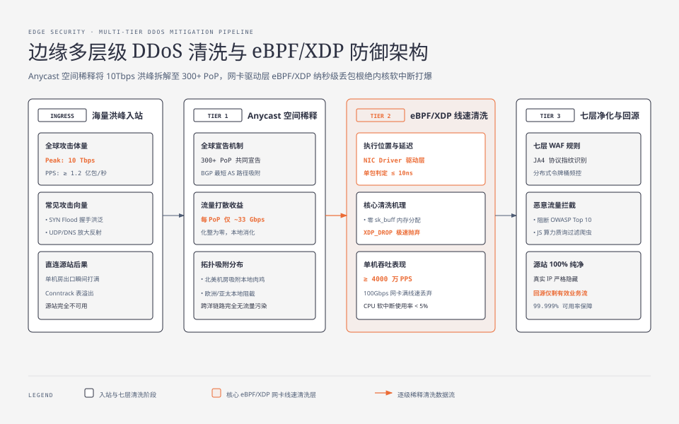
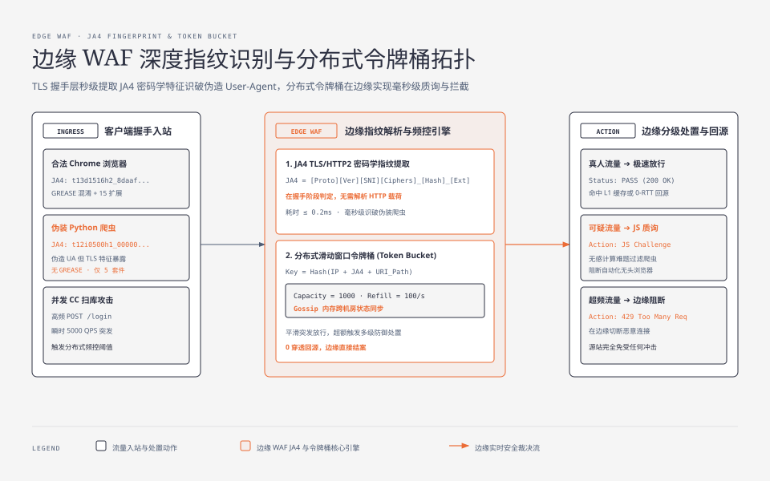

**TL;DR：** 现代 CDN 不仅是全球流量分发的加速引擎，更是**互联网基础设施的第一道安全盾牌**。在传统的源站直连架构中，攻击者只需发起 $10\text{Gbps}$ 的分布式拒绝服务攻击（DDoS, Distributed Denial of Service）或针对登录接口的黑产撞库，就能直接瘫痪源站机房与数据库。现代工业级 CDN 将安全边界推移至全球 300+ 个边缘网络接入点（PoP, Point of Presence），构建了三道立体纵深防线：一是依托 **Anycast BGP 路由实现全球空间稀释**，将海量攻击洪峰化整为零；二是在网卡驱动层部署 **eBPF/XDP（扩展伯克利数据包过滤器 / 快速数据路径）**，以纳秒级线速丢弃四层恶意报文（单机吞吐超 4000 万 PPS）；三是在七层应用层通过 **JA4 TLS/HTTP2 协议指纹识别、分布式令牌桶频控与 TLS 1.3 0-RTT 防重放机制**，精准识别恶意爬虫并阻断 OWASP Top 10 注入攻击，实现源站 100% 隐藏与纯净回源。

---

## 一、 四层 DDoS 攻击物理本质与 Anycast 空间稀释

分布式拒绝服务攻击（DDoS）的物理本质，就是**利用攻击者掌握的不对称带宽与算力资源，在单位时间内向目标服务器灌入远超其物理承载上限的垃圾数据流**。

### 1. 常见四层攻击向量与杀伤力模型

| 攻击类型 | 攻击协议与原理 | 消耗的目标物理资源 | 源站直连瘫痪机理 |
| :--- | :--- | :--- | :--- |
| **SYN Flood (SYN 洪泛)** | 伪造随机海量源 IP 发送 TCP SYN 握手报文 | 宿主机内核半连接队列（`tcp_max_syn_backlog`）与 TCB 内存 | 内核套接字队列被垃圾半连接占满，正常用户无法完成三次握手 |
| **UDP Reflection (UDP 放大反射)** | 利用公网暴露的 DNS / NTP / Memcached 服务伪造源 IP 反射放大 | 机房边界出口带宽（放大倍数可达 $50\times \sim 50000\times$） | 海量 UDP 垃圾报文直接将机房物理光纤与交换机端口拥塞打满 |
| **ACK / RST Flood** | 向目标发送无对应连接状态的随机 TCP 报文 | 路由器与防火墙状态表（Conntrack Table） | 防火墙 CPU 软中断打满 100%，连接跟踪表溢出宕机 |



### 2. Anycast BGP 空间稀释（Spatial Dispersion）
如果源站采用单播（Unicast）公网 IP，全球数万台僵尸网络（Botnet）发起 $10\text{Tbps}$ 的洪峰流量时，所有数据包会通过全球骨干网收敛汇聚到同一个机房，机房入口瞬间被物理熔断。

在 CDN Anycast 架构中：
- 相同的 Anycast IP 在全球 300+ 个 PoP 节点同时向全球运营商宣告；
- 根据 BGP 最短自治系统路径（AS-Path）就近吸附原则，**北美僵尸机流量被吸附进北美各 PoP，欧洲攻击流量落入法兰克福/伦敦 PoP，亚洲攻击流量分散至东京/新加坡/中国香港 PoP**；
- $10\text{Tbps}$ 的全球洪峰被物理拆解分散到 300 个节点，**平均每个 PoP 仅承受 $\sim 33\text{Gbps}$ 的局部流量**，完全在机房日常冗余承载能力之内，彻底消除了单点链路打爆的风险。

---

## 二、 网卡级线速清洗：基于 eBPF/XDP 的四层无锁拦截

传统 Linux 防火墙（如 `iptables` / `nftables`）在处理网络报文时，必须经过完整的内核网络栈路径：

```
[网卡接收数据] ──► [DMA 拷贝到环形缓冲区 RingBuffer] ──► [分配 sk_buff 结构体 (分配堆内存)] ──► [触发软中断 NET_RX_SOFTIRQ] ──► [iptables 规则匹配]
```

为每个垃圾数据包分配 `sk_buff` 结构体需要消耗大量 CPU 周期和内存分配器锁。在 $40\text{Mpps}$（每秒四千万数据包）的洪峰冲击下，CPU 100% 的算力被用于处理软中断与内存分配，系统瞬间陷入假死。

### 1. eBPF/XDP（eXpress Data Path）的极速优势
现代 CDN（如 Cloudflare Magic Transit、自研 eBPF 防火墙）将防御代码直接加载进网卡驱动层的 **XDP（快速数据路径）执行钩子**：
- **零内存分配**：在网卡驱动刚收到 DMA 数据包、**尚未分配 `sk_buff` 内存前**，直接执行由 Clang/LLVM 编译生成的 eBPF 字节码指令；
- **纳秒级判定**：单包安全检查耗时 $\le 10\text{ns}$；
- **`XDP_DROP` 极速抛弃**：一旦识别为恶意报文，直接在网卡驱动 Ring Buffer 内原路丢弃，**完全不进入 Linux 内核网络栈**！
- **单机吞吐能力**：单台边缘物理机即可线速清洗超过 **4000 万 PPS（Packets Per Second）** 的四层垃圾报文。

---

## 三、 七层边缘 WAF：JA4 协议指纹与分布式令牌桶频控

当流量进入七层应用层后，面临的是更隐蔽的攻击 —— **CC 攻击（Challenge Collapsar，七层 HTTP 洪泛）、爬虫刮取、撞库与 SQL 注入/XSS 等漏洞利用**。



### 1. JA4 协议指纹：识别伪造 User-Agent 的终极武器
现代黑产爬虫与攻击脚本往往会伪造 User-Agent（如伪装成标准的 Chrome/Safari 浏览器标头）。但由于其底层所使用的 TLS/HTTP2 协议栈（如 Python Requests、Go net/http、curl 等）与真实浏览器在密码学握手特征上存在巨大的本质差异，**七层协议指纹成为精准识破伪装的核心技术**。

FoxIO 提出的 **JA4 指纹标准** 通过提取客户端 TLS `ClientHello` 中的核心参数组合生成确定性哈希：

$$\text{JA4} = \text{协议类型(t/q)} + \text{TLS版本} + \text{SNI标识} + \text{密码套件数量} + \text{扩展数量} + \text{首个ALPN} \_ \text{套件哈希} \_ \text{扩展哈希}$$

| 客户端实体 | 提取的 TLS 密码套件与扩展特征 | JA4 指纹特征值 | WAF 判定结论 |
| :--- | :--- | :--- | :--- |
| **真实 Chrome 浏览器 (Mac)** | 支持 GREASE 混淆套件，固定 15 个扩展，ALPN `h2` | `t13d1516h2_8daaf618843b_...` | **真人流量（信誉极高）** |
| **Python Requests 脚本** | 无 GREASE，仅 5 个默认套件，ALPN `http/1.1` | `t12i0500h1_000000000000_...` | **恶意爬虫（秒级识破）** |
| **Go net/http 默认客户端** | 固定的 Go 标准库扩展排序，无特定浏览器扩展 | `t13d0800h2_4a6b2c8901ef_...` | **脚本探测（阻断/质询）** |

边缘 WAF 在 TLS 握手阶段即可秒级完成 JA4 计算，无需解析任何 HTTP 请求体即可对自动化黑产实施精准拦截。

### 2. 分布式令牌桶算法（Distributed Token Bucket）
面对针对登录、抢购或支付接口的高频并发扫库，边缘 WAF 部署了分布式令牌桶频控引擎：
- 边缘内存中维护基于 IP、用户 ID 或 JA4 指纹的滑动时间窗口计数器；
- 支持 **平滑突发放行** 与 **机房级 Gossip / 内存状态同步**；
- 触发阈值时，边缘支持分级处置动作：
  1. **Log Only**：静默记录并上报安全分析平台；
  2. **JS Challenge / CAPTCHA**：向客户端下发无感 JavaScript 计算难题或验证码，过滤无头浏览器；
  3. **Drop / 403 Forbidden**：直接在边缘切断连接，不产生任何源站回源开销。

---

## 四、 TLS 证书自动化卸载与 TLS 1.3 0-RTT 防重放实战

在 CDN 边缘代理体系中，HTTPS 流量在边缘 PoP 进行集中卸载，源站无需再承担庞大的非对称加密计算（RSA / ECDSA 签名验证）。

### 1. ACME 协议与全球证书自动化生命周期
CDN 边缘平台基于 IETF RFC 8555 **自动证书管理环境协议（ACME, Automatic Certificate Management Environment）** 实现了百万级域名的全自动证书轮换：
- 边缘自动响应 Let's Encrypt 等权威证书颁发机构（CA）的 `HTTP-01` 或 `DNS-01` 挑战；
- 自动完成证书签发、私钥内存热重载与全网 300+ PoP 异步同步；
- 边缘代理常驻开启 **OCSP 封套（OCSP Stapling, Online Certificate Status Protocol）**，由边缘周期性获取 CA 签名并缓存，客户端在 TLS 握手时直接验证，**彻底免去客户端向远端 CA 服务器发起的慢速 DNS/HTTP 证书吊销查询（节省 50~100ms 握手时延）**。

### 2. TLS 1.3 0-RTT 防重放攻击（Anti-Replay Attack）
TLS 1.3 支持使用会话凭证（Session Ticket / PSK）进行 0-RTT 快速握手，客户端在发送第一个加密报文时即可携带应用层 Early Data（如 HTTP GET/POST）。

**安全隐患**：由于 Early Data 缺乏服务器即时确认的随机数保护，中间人攻击者可以截获该报文并向服务端重复发送无数次，导致针对金融接口的**资金重复扣款重放攻击**！

**CDN 生产级防重放工程解法**：
1. **单向滑动时间窗口（Monotonic Time Window）**：边缘只接受握手时间戳在 $[T - \Delta t, T + \Delta t]$（通常 $\Delta t = 5\text{s}$）内的 0-RTT 票据；
2. **分布式布隆过滤器（Bloom Filter Filter）与唯一 Ticket 记录**：边缘在内存中用 Bloom Filter 记录所有已被消费过的 Session Ticket 标识符，一旦检测到重复使用，**立即强制降级为标准的 1-RTT 完整握手并拒收 Early Data**，从物理机制上彻底根除重放风险。

---

## 五、 架构决策对比与工业选型权衡矩阵

| 防御维度 | 模式 A：源站暴露裸连 | 模式 B：传统硬件防火墙清洗 | 模式 C：现代 CDN 边缘立体安全体系 |
| :--- | :--- | :--- | :--- |
| **四层 DDoS 抗击上限** | 受限于单机房物理带宽（$<10\text{Gbps}$） | 受限于清洗中心专线（$<500\text{Gbps}$） | **全球 Anycast 空间稀释，抗击能力 $\ge 10\text{Tbps}$** |
| **四层单机丢包性能** | iptables 内核协议栈（$< 2\text{Mpps}$） | 专用硬件设备（昂贵且扩展慢） | **eBPF/XDP 网卡线速丢弃（$\ge 40\text{Mpps}$ / 单机）** |
| **七层恶意爬虫识别** | 依赖明文 User-Agent，极易被绕过 | 传统 IP 黑白名单，滞后性强 | **JA4 TLS/HTTP2 深度指纹，毫秒级识破伪装** |
| **高频 CC 攻击拦截** | 穿透至应用层，数据库被打崩 | 简单 IP 频控，易误杀同网段用户 | **分布式多维令牌桶 + 无感 JS 质询 + 动态评分** |
| **TLS 证书维护成本** | 手工运维上传，易过期遗漏 | 集中式网关管理 | **ACME 自动化全生命周期轮换 + OCSP 封套** |

至此，在《现代 CDN 与边缘加速架构》的第四篇中，我们全面解析了现代 CDN 的边缘立体安全防护体系，从 Anycast 空间稀释、eBPF/XDP 网卡级线速清洗，到 JA4 深度协议指纹与 TLS 1.3 0-RTT 防重放机制。在下一篇（终篇）中，我们将深入剖析 **[《现代 CDN 核心机理与全景架构（五）：边缘计算与 Serverless：从边缘 KV、V8 Isolate 到全球分布式状态编排》](/writing/cdn-05-edge-computing-serverless-runtime)**。
