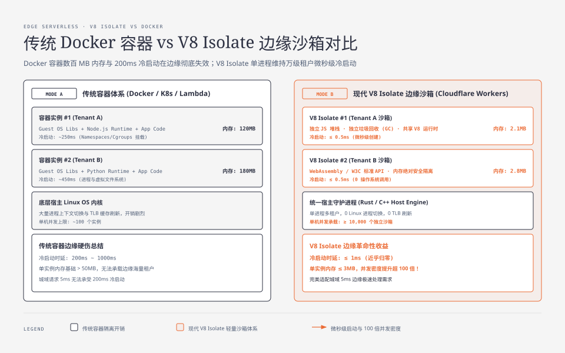
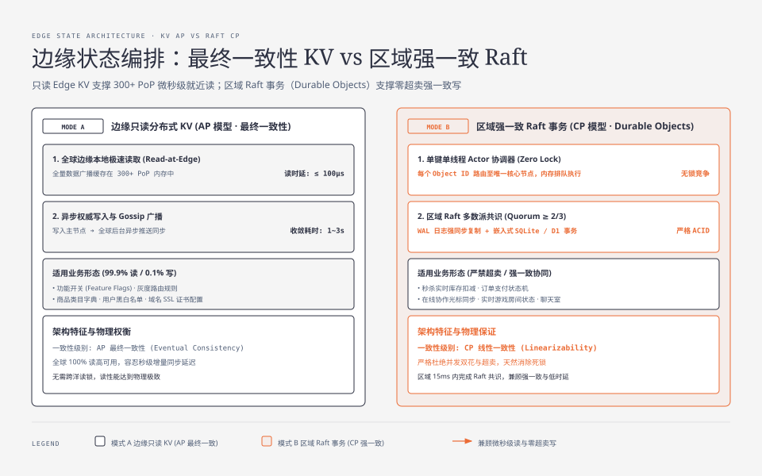
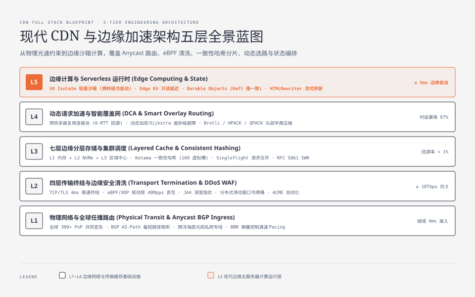

**TL;DR：** 边缘计算（Edge Computing）标志着 CDN 从传统的“被动管道与静态缓存”彻底演进为**全球分布式的无服务器通用计算平台（Serverless Edge Platform）**。传统的基于 Docker 容器的云计算模型因为 **100ms+ 的冷启动延迟与数百兆的内存开销**，在边缘毫秒级时延场景下完全失效。现代 CDN（如 Cloudflare Workers、Fastly Compute）底层依托 **Google V8 Isolate 引擎的进程内轻量沙箱技术**，实现了 **$< 5\text{ms}$ 的超低冷启动与单机上万并发函数的安全隔离**；在数据持久化层，通过 **全球边缘只读 KV（最终一致性）+ 区域 Raft 事务共识（强一致性 Durable Objects / Edge SQL）** 的双层存储拓扑，结合 `TransformStream` 边缘流式 HTML 组装，使全链路业务逻辑完全脱离中心源站，在距用户仅 5ms 的物理边缘独立自治运行。

---

## 一、 边缘计算演进史：为什么传统 Docker 容器在边缘彻底失效？

在传统的中心化云计算（如 AWS Lambda、Kubernetes 容器集群）中，计算任务的隔离依赖于 **Linux 操作系统级虚拟化（Namespaces、Cgroups、RootFS 联合文件系统）**：

### 1. 传统容器架构的边缘物理硬伤

| 架构维度 | 传统 Docker / K8s 容器体系 | 现代 CDN 边缘计算需求 | 边缘物理冲突与崩溃点 |
| :--- | :--- | :--- | :--- |
| **实例冷启动耗时** | $100\text{ms} \sim 2000\text{ms}$（加载系统镜像、挂载 RootFS、启动运行时） | $\le 5\text{ms}$（匹配城域 RTT） | 用户发起的 HTTP 请求总耗时才 5ms，冷启动 200ms 会让用户体验瞬间雪崩 |
| **单实例内存基线** | $50\text{MB} \sim 200\text{MB}$（包含独立 Guest OS 库与完整 Runtime） | $\le 3\text{MB}$ | 一台 256GB 内存的物理宿主机最多只能运行数千个容器，无法承载全球海量租户 |
| **单机实例并发密度** | $\sim 100$ 个容器实例 | $\ge 10,000$ 个并发租户沙箱 | 实例切换引发剧烈的 Linux 内核进程上下文切换与 TLB 缓存抖动 |

### 2. V8 Isolate 进程内沙箱：微秒级轻量隔离的物理突破
现代 CDN 抛弃了“为每个请求启动独立进程/容器”的传统思路，转向 **Google Chrome V8 引擎的 Isolate（隔离区）架构**：
- **单进程多租户**：数万个租户的代码运行在同一个由 Rust/C++ 编写的宿主守护进程中；
- **内存堆完全隔离**：每一个 V8 Isolate 代表一个完全独立的 JavaScript/Wasm 虚拟机实例，拥有独立的垃圾回收（GC, Garbage Collection）堆栈与调用栈，**不同租户之间内存地址空间绝对不可访问**；
- **0ms 冷启动**：创建一个新的 Isolate 仅仅是在宿主进程中分配几百 KB 的内存结构，耗时仅需微秒级（$< 1\text{ms}$）；
- **单机承载密度**：一台普通的 128GB 内存边缘服务器可以轻松并发维持 **10,000+ 个独立的 Isolate 函数沙箱**，实现极致的硬件利用率。

---

## 二、 边缘无状态计算核心范式：Web Standards 与流式重写

边缘计算运行时的核心设计哲学是 **完全对齐 W3C / WHATWG Web 标准 API**（如 `fetch()`、`Request`、`Response`、`ReadableStream`、`TransformStream`、`Web Crypto API`），让工程师无需学习复杂专有框架。

### 1. 核心边缘无状态业务场景矩阵

| 边缘计算模式 | 核心执行机制 | 传统源站做法 | 边缘计算收益 |
| :--- | :--- | :--- | :--- |
| **边缘即时鉴权** | 在边缘拦截请求，基于 `crypto.subtle` 微秒级校验 JWT 签名与过期时间 | 穿透回源到后端鉴权微服务 | 非法与过期请求 **100% 阻断在边缘**，源站无谓算力消耗归零 |
| **A/B 测试与灰度路由** | 解析用户 Cookie / Header，在边缘直接重写 URL 指向不同后端集群 | 源站返回 302 重定向让客户端重新发起 | **0 次额外 HTTP 重定向往返**，用户完全无感且无首屏闪烁 |
| **自适应图片实时转码** | 检查客户端 `Accept` 头，实时将 JPEG/PNG 转码为 WebP / AVIF | 源站离线批量生成存储所有格式 | 节省源站 80% 的云存储成本与网络出站带宽 |

### 2. 流式 HTML 动态拼装：HTMLRewriter 与 TransformStream
在传统的服务端渲染（SSR, Server-Side Rendering）中，源站必须在内存中拼装完整的 HTML 字符串后才发送给客户端，导致 TTFB 居高不下。

现代 CDN 边缘计算引入了基于 Rust SAX 解析器驱动的 **`HTMLRewriter` 流式引擎**：
- **边拉边改（Streaming Transform）**：当源站静态 HTML 骨架流经边缘时，`TransformStream` 在字节流（Byte Stream）流动的过程中实时匹配 CSS 选择器；
- **边缘微前端聚合（Edge Micro-frontends）**：边缘在匹配到 `
` 时，直接异步并发调用就近的边缘 KV 填入用户头像与个性化推荐，随后继续流式输出给客户端；
- **首字节时延突破**：客户端在 $5\text{ms}$ 内即可收到 `<!DOCTYPE html><head>...` 骨架开始预加载 CSS/JS，大幅提升 Core Web Vitals（LCP/FCP）指标。

---

## 三、 边缘分布式状态编排：最终一致性 KV vs 区域强一致 Raft

无状态的纯计算只能做数据转换。现代边缘计算的终极挑战在于：**在跨越上万公里、物理时延达 180ms 的全球 300+ 个机房之间，如何优雅地处理数据持久化与一致性？**

根据分布式系统 **CAP 定理（一致性 Consistency、可用性 Availability、分区容错性 Partition tolerance）**，跨洋网络分区的存在使得全网“全局强一致 + 极低写入时延”在物理上无法同时实现。现代 CDN 采用 **双层分级状态架构（Tiered State Architecture）** 彻底化解了这一矛盾。

### 1. 模式 A：边缘只读分布式 KV（Read-at-Edge, AP 最终一致性）
适用于“读极高频（99.9% 读）、写低频（0.1% 写）、允许秒级同步延迟”的业务状态（如功能开关 Feature Flags、配置中心、商品类目字典、用户权限黑名单）：
- **读路径（Read Path）**：数据被全量异步广播缓存在全球 300+ 个 PoP 节点的本地内存中，**读操作 100% 命中本地，时延 $< 100\mu\text{s}$**；
- **写路径（Write Path）**：写操作路由至离写发起端最近的权威中心写入，随后通过全球异步 Gossip / 消息队列向全球所有 PoP 广播增量更新，**通常在 1~3 秒内实现全网最终收敛**。

### 2. 模式 B：区域强一致 Raft 事务（Durable Objects / Edge SQL, CP 强一致性）
适用于“必须强一致、严禁超卖、支持事务计数”的核心状态（如分布式游戏房间、在线协作光标同步、秒杀库存锁、实时聊天室）：
- **单键原子排队调度（Single-threaded Actor Pattern）**：
  - 每一个 Durable Object（持久化对象）由其唯一 ID 路由到全球某一个离活跃用户群最近的核心数据中心；
  - 该对象在内存中由单线程事件循环执行，**天然消除数据库行锁竞争与死锁风险**；
- **Raft 多数派共识与持久化**：
  - 状态修改由区域内的 Raft 节点集群通过法定人数（Quorum $\ge 2/3$）确认后写入 NVMe 磁盘（基于嵌入式 SQLite / D1）；
  - 提供严格的 **线性一致性（Linearizable Consistency）** 与事务 ACID 保证。

---

## 四、 架构全景对比与工业演进全景

| 架构维度 | 传统中心化云函数 (AWS Lambda) | 传统边缘 CDN 脚本 (Edge VCL) | 现代 V8 Isolate 边缘计算 (Workers) |
| :--- | :--- | :--- | :--- |
| **运行物理位置** | 集中在少数大型数据中心（如美东） | 全球 CDN 边缘 PoP 节点 | **全球 300+ 边缘 PoP 节点本地执行** |
| **冷启动时延** | $100\text{ms} \sim 2000\text{ms}$（严重抖动） | $0\text{ms}$（功能极度受限） | **$\le 5\text{ms}$（微秒级初始化）** |
| **运行时环境** | 完整 Linux 容器（Node.js / Python） | 专有配置语言（Varnish VCL） | **W3C 标准 Web API + V8 / WebAssembly** |
| **单机并发密度** | 数百实例（受限于 OS 内存与进程） | 高（仅支持简单 HTTP 规则） | **单机 10,000+ 独立多租户 Isolate 沙箱** |
| **状态存储生态** | 依赖中心 RDS / Redis（跨洋延迟大） | 无持久化状态 | **本地超高速 KV + 区域 Raft 强一致 SQLite** |

---

## 五、 全系列总结与现代边缘加速全景工程图谱

至此，《现代 CDN 与边缘加速架构》五部曲已全部完结。我们从最底层的光速物理约束出发，完整遍历了现代边缘计算体系的完整技术栈：

现代 CDN 的终极价值，正是通过这一整套**空间拓扑重构、分层缓存分片、覆盖网智能调度与边缘沙箱计算**，在对抗光速传播物理极限的同时，为全球用户提供毫秒级、高可用且极致安全的现代 Web 体验。
