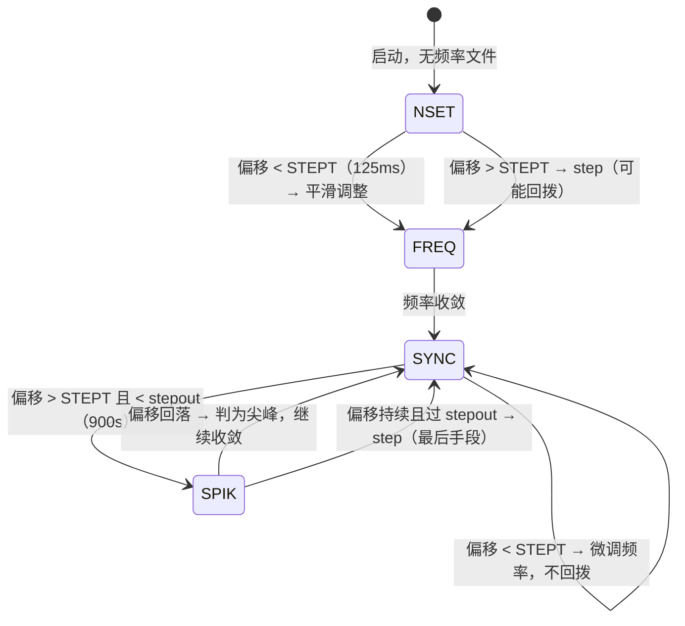
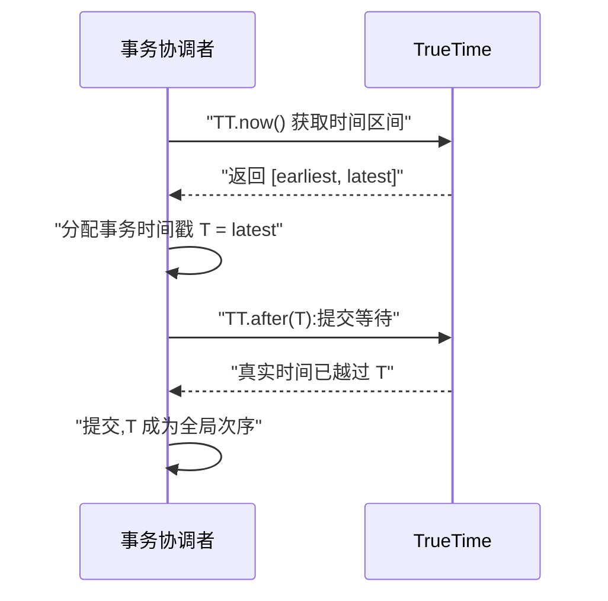
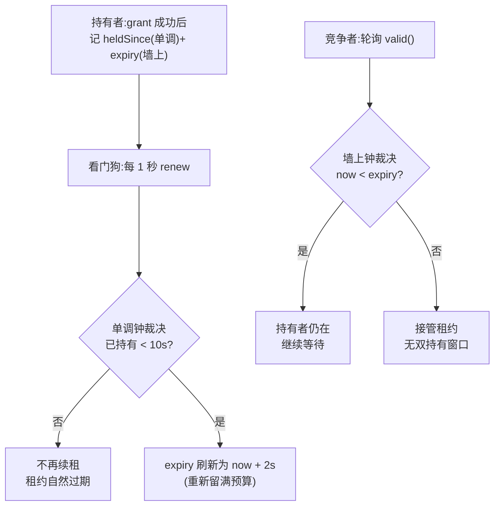
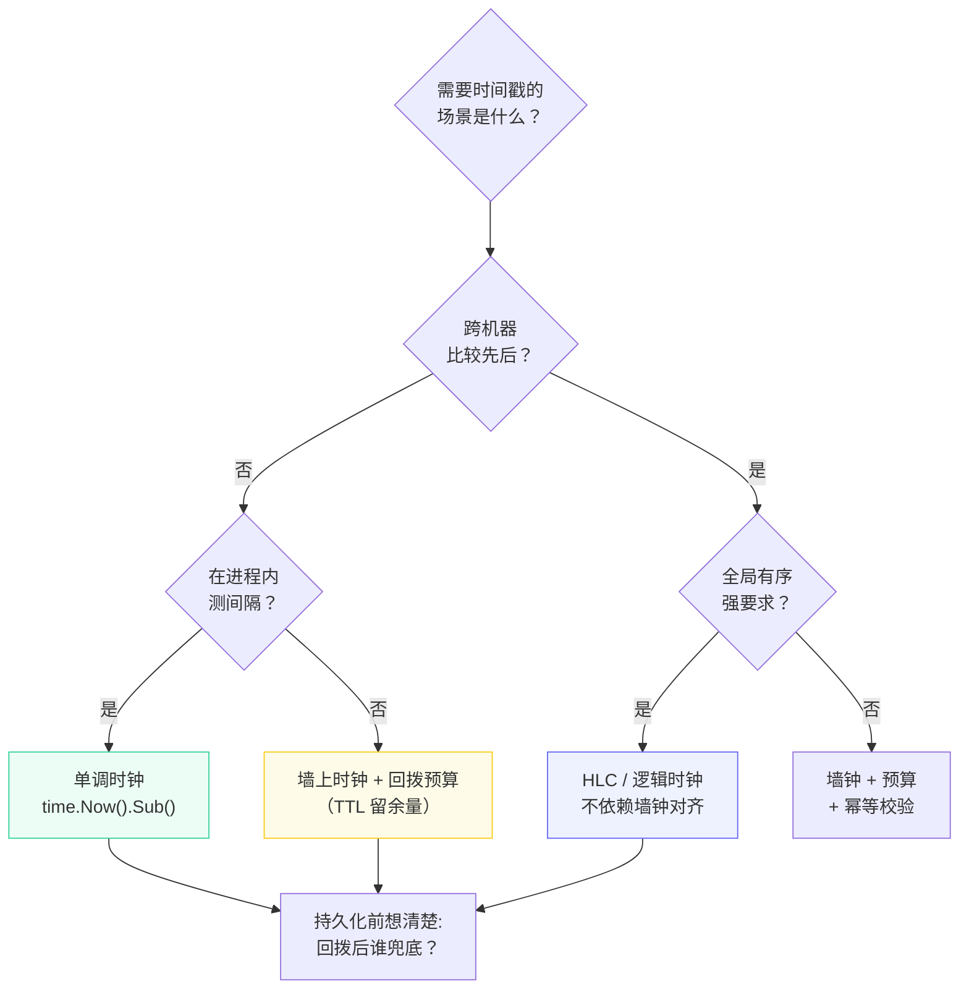

**TL;DR：** 服务器上 `time.Now()` 返回的不是"时间",而是"这台机器对时间的看法"——它由 NTP 校准，可能被瞬间拨快、拨慢甚至**拨回**。墙上时钟（wall clock）可回拨，单调时钟（monotonic）只前进。回拨发生时，雪花 ID 会重复或逆序、缓存和租约提前过期、审计日志顺序错乱——**一切依赖"时间戳单调递增"的假设全部失效**。工程上只有三条防线：能用单调钟就不碰墙上钟；必须用墙上钟时给回拨留预算（等待、哨兵、HLC）；最后把"时钟不可信"写进架构假设，而不是祈祷 NTP 完美。

## 一、两种时钟：一个会骗人，一个不会

操作系统给用户程序提供两种时间语义：

| 时钟类型 | 语义 | 能否回拨 | 用途 |
| :--- | :--- | :--- | :--- |
| 墙上时钟（REALTIME） | "当前日期时间" | **能**（NTP step） | 日志时间戳、过期时间、业务显示 |
| 单调时钟（MONOTONIC） | "自启动以来的时间" | 否（只前进） | 测量间隔、超时、采样基准 |

墙上时钟的意义是**与真实世界对齐**——但它对齐的手段（NTP 校准）正是回拨的来源。单调时钟的意义是**测量**：两次读数的差，就是真实的经过时间，它不受 NTP 影响。Go 的标准库把这个区别藏在了 `time.Now()` 里：

```go
t1 := time.Now()          // 内部同时记 wall + mono 两个读数
time.Sleep(100 * time.Millisecond)
t2 := time.Now()
elapsed := t2.Sub(t1)     // 用 mono 计算,永远正确
```

`t2.Sub(t1)` 使用单调读数，NTP 把墙上时钟拨回一小时也不会算错。但一旦**持久化**（写数据库、序列化传远程），`t1` 的单调读数丢失，只剩墙上时钟——**回拨风险随之而来**。这就是为什么"比较时间差"要留在进程内，"记录时间点"才用墙上时钟。

## 二、回拨从哪来：NTP 的 step 与 slew

NTP 客户端发现本机与服务器偏差时，有两种校准方式：

- **step（步进）**：偏差超过阈值时（ntpd 默认偏差超过 128ms 即 step，panic 阈值 1000s），**直接跳变** 系统时间——可能前进，也可能**倒退**。这是回拨的根源。
- **slew（平滑）**：偏差较小时，通过微调时钟频率逐步追上，时间连续前进，不回拨。chronyd 默认不 step、只做平滑调整，发行版常配置 `makestep 1 3` 允许启动初期 step。

step 的瞬间画出来就是回拨本身——墙上时钟往回跳了一截，而单调时钟从头到尾没受影响：


用 `timedatectl` 可以查看本机当前策略与最近校准：

```bash
timedatectl show | grep -E "NTPSynchronized|NTPEnabled"
# 系统启用了 NTP,并不意味着不会 step——
# ntpd 偏差超 128ms 即 step;chronyd 默认只 slew,除非显式配置 makestep
```

云厂商的工程对策是把"校准偏差"当第一公民：**Amazon Time Sync Service** 把实例时钟与真实 UTC 的偏差预算设为 60 秒——实例时钟被固定在 UTC-60s 到 UTC 之间，NTP 只做小幅 slew，永不 step（哪怕真实偏差再大，也通过慢慢爬升消化）。**用"预算"换"连续性"**：时钟保证单调，代价是可能比真实时间慢最多一分钟。对多数业务，连续性比精确对齐值钱得多。

## 三、规范解剖：NTP 时钟纪律——RFC 5905 的阈值与状态机

`step` 与 `slew` 的分界不是实现细节，而是 RFC 5905 明文规定的协议纪律。偏移量与处理动作的关系定义在 §10：

> §10："STEP means the offset is less than the panic threshold, but greater than the step threshold STEPT (125 ms). In this case, the clock is stepped to the correct offset, but since this means all peer data have been invalidated, all associations MUST be reset and the client begins as at initial start. ADJ means the offset is less than the step threshold and thus a valid update."

三个阈值参数（§11.3）：

| 参数 | 值 | 含义 |
| :--- | :--- | :--- |
| STEPT | 125 ms | step 阈值——偏移超过它才考虑 step |
| WATCH | 900 s | stepout 阈值——step 前的防抖窗口 |
| PANICT | 1000 s | panic 阈值——超过直接终止 |

状态机（§11.3 节选）规定：在 NSET（刚启动、无频率文件）状态下，偏移小于 STEPT 就 "adjust time"（slew），大于 STEPT 才 "step time"；进入 SYNC 稳定态后，偏移小于 STEPT 一律 "adjust freq, adjust time"（slew），大于 STEPT 还要看 stepout 窗口：

> §11.3 状态转移表（节选）："| NSET | theta < STEP ->FREQ / adjust time | theta > STEP ->FREQ / step time | no frequency file |" "| SYNC | theta < STEP ->SYNC / adjust freq, adjust time | theta > STEP: if < 900 s ->SPIK else ->SYNC / step freq, step time | normal operation |"



step 是最后手段，而且有防抖约束：

> §11.3："A step clock action is implemented by setting the clock directly, but this is done only after the stepout threshold WATCH (900 s)... This resists clock steps under conditions of extreme network congestion."

解读出四条纪律：

- **先 slew 后 step**：偏移 < 125ms 一律 slewing（adjtime 微调频率，时间连续不回拨）；> 125ms 才进入 step 候选（协议参数 STEPT=125ms，ntpd 实现默认取 128ms，量级一致）；
- **step 有防抖窗口**：系统运行不满 stepout（900s）不允许 step——防止极端网络拥塞期间把抖动误判成真偏差；
- **超过 panic 阈值直接终止**：偏移 > PANICT（1000s）时协议放弃修正；
- **step 失效全部 peer 数据**："all associations MUST be reset"，step 后本机从初始状态重新收敛——这就是回拨之后"重新建立正确时间"的协议层原因。

chrony 把"默认不 step"贯彻到了用户配置层，官方文档对 `makestep` 指令的说明：

> chrony 官方文档（makestep）："Normally chronyd will cause the system to gradually correct any time offset, by slowing down or speeding up the clock as required... This directive forces chronyd to step the system clock if the adjustment is larger than a threshold value, but only if there were no more clock updates since chronyd was started than a specified limit... makestep 0.1 3: This would step the system clock if the adjustment is larger than 0.1 seconds, but only in the first three clock updates."

默认配置下 chronyd 全程 slew（"gradually correct... by slowing down or speeding up the clock"）；`makestep 阈值 次数` 只在启动后的前 N 次时钟更新里允许 step，之后即使偏差再大也继续 slewing——与 RFC 的"step 是例外"一脉相承。可运行演示：`cd experiments && go run ./snowflake`，看回拨预算内等待追平、超预算拒绝。

## 四、破坏面：回拨瞬间，四个假设同时失效

回拨 5 秒会造成什么？取决于系统里有多少"时间戳单调递增"的隐式假设：

**① 雪花 ID：重复与逆序。** 雪花算法的时间部分取毫秒级墙上时钟（`timestamp = now() - epoch`），同一毫秒内靠序列号区分。回拨后 `now()` 变小，新 ID 的时间位小于旧 ID——**同一毫秒位宽下直接重复**。正确实现必须显式处理：

```go
var (
    lastTS int64
    seq    int64
)

func nextID(workerID int64) (int64, error) {
    now := wallMillis() // 墙上时钟毫秒
    if now < lastTS {
        // 方案一:等待回拨量,时钟追上再发(阻塞)
        delta := lastTS - now
        if delta > maxBackoff {
            // "clock skew too large":回拨量超过上限,拒绝服务
            return 0, errors.New("clock skew too large")
        }
        time.Sleep(time.Duration(delta) * time.Millisecond)
        now = wallMillis()
    }
    if now == lastTS {
        seq++
        // "seq exhausted":同一毫秒内序列号耗尽
        if seq >= maxSeq { return 0, errors.New("seq exhausted") }
    } else {
        seq = 0
    }
    lastTS = now
    return now<<22 | workerID<<12 | seq, nil
}
```

Twitter 的 Snowflake 文档明确要求"回拨时要么等待要么报错"。美团 Leaf 在启动时经 ZooKeeper 分配 workerId 并校验本地时间；运行时回拨 ≤5ms 时等待时钟追平，超过 5ms 拒绝服务；个别实现会在回拨期间摘除自身节点。所有方案的本质一致：**回拨窗口内不产出新 ID，宁可慢，不可错**。

**② 缓存过期与租约：提前失效。** 缓存 TTL 的计时基于墙上时钟——回拨 5 秒 = 所有 TTL 瞬间少了 5 秒。若 TTL 本身只有 10 秒，回拨等同于**大规模提前过期**，缓存雪崩压力全部打回数据库。分布式锁租约同理：回拨导致租约提前过期，另一个节点抢到锁，**两个"持有者"同时存在**——这是分布式锁失效的经典模式。

对策：
- TTL/租约至少留一个回拨预算（如 TTL 预算内不续租）；
- 续租时机用单调钟测量，不让墙钟参与续租判定。

**③ 审计日志与事件排序：顺序幻觉。** 跨机器比较事件先后时，时间戳来自各自的墙钟，NTP 偏差与回拨让"时间排序"失真——**跨机器的先后关系必须用逻辑时钟**，墙上时间戳只用于展示。

这正是 HLC（Hybrid Logical Clock）存在的理由：物理时间打底 + 逻辑计数器保证跨节点单调，收到更大时间戳时本地逻辑计数递增，使 `(物理, 计数)` 二元组全局偏序。

**④ 数据库的 `updated_at` 与乐观锁。** 用 `updated_at` 做乐观锁版本判断时，回拨会让"新写"的时间戳小于"旧读"的时间戳，乐观锁把合法的写入误判为冲突——解决方式很简单：**乐观锁用自增版本号或 UUID，不要用时间戳**。

### 一个常见的误解：NTP 会把时间拨准

**“NTP 会把时间拨准”是错的。** NTP 的目标不是“绝对正确”，而是让本机偏移收敛进 step 阈值之内、并在 SYNC 状态维持 slew——它保证的是“不会错太多”，不是“分毫不差”。而且 step 会重置全部 peer 数据（“all associations MUST be reset”），step 之后本机要重新经历一个收敛期（slew 逐步追平）才回到精确，这个窗口里时间戳依然是“偏的”。所以跨机器比较时间戳永远需要容忍窗口：要么接受毫秒级偏差，要么用逻辑时钟绕开墙上钟。

## 五、更多破坏面：过期时间、证书与定时任务

第四节讲的是"把时间戳当单调序列用"的系统。还有一类系统把墙上时钟当**绝对参照物** 用——回拨让"参照物"本身动摇了，后果同样致命：

| 系统 | 时钟怎么被读 | 回拨 5 秒的后果 |
| :--- | :--- | :--- |
| JWT 令牌 | 校验 `exp`/`nbf` 时对比本地墙钟 | 合法令牌被判过期，在线用户批量登出 |
| TLS 证书 | 校验 `notBefore`/`notAfter` | 刚签发的证书"尚未生效"，握手直接失败 |
| cron 定时任务 | 墙钟判断下一次触发时刻 | 触发时刻"退回过去"，任务重复或跳过 |
| 日志聚合 | 时间戳建索引（ELK/Loki） | 时间窗口错位，查询与告警丢数据 |

**JWT 是回拨的最痛案例。** JWT 的 `exp`（过期时间）与 `nbf`（生效时间）在签发时以签发机的墙钟为准，校验时以校验机的墙钟为准——RFC 7519 对签发者不做时钟要求，只要求校验方：**"Implementers MAY provide for some small leeway, usually no more than a few minutes, to account for clock skew"**（§4.1.4）。也就是说，标准把"时钟会偏"这个事实明明白白写进了规范，允许校验端留几分钟的余量。但余量是一把双刃剑：leeway 越大，令牌的重放窗口越大，安全收益越小。工程上折中方案是：校验端留 30-60 秒量级的 leeway，同时用单调钟缓存"最近一次成功校验的 nbf"做二次校验——回拨的机器在校验端缓存面前依然会被挡住。

**TLS 证书只在时间正确时有效。** 证书的 `notBefore`/`notAfter` 是绝对的墙上时间点，客户端校验证书时必须读本地墙钟。签发机时钟快了，证书的 `notBefore` 落在未来——客户端看到"证书尚未生效"；服务器时钟慢了，看到的是"证书已过期"。公网 CA（如 Let's Encrypt）要求申请者服务器时间基本正确才能签发，不是偏好，是协议前提。补救路径没有技巧：服务器时间必须可靠，`systemd-timesyncd`/chrony 开机即校、监控 NTP 同步状态（`timedatectl` 的 `NTPSynchronized` 字段），把它当成和磁盘空间同级的运维指标。

**cron 用墙钟算"下一次"。** cron 维护一个"下次触发时刻"的时间表，由墙钟驱动：回拨让当前时间退回过去，已经执行过的时刻被重新触发，或反之错过。`anacron` 这类补跑工具解决的是"停机期间错过的任务"，解决不了"时钟倒退导致的重复"。调度类的正解是两层：**触发驱动用单调钟**（定时器只量间隔），**触发点对齐用墙钟**（把"每小时整点"换算成"距上次整点 3600 秒"）；重任务配幂等兜底（见[重试会放大一切错误:幂等性工程的完整账本](/writing/idempotency-engineering)）。

**日志时间戳是"显示型"破坏。** 日志本身不参与业务正确性，但日志平台按事件时间建索引——回拨 5 秒，新日志的事件时间小于旧日志，按时间窗查询会丢数据、告警窗口会错位，排查问题时"明明发生的事在日志里看不到"。解法是把**事件时间（event time）与接收时间（ingest time）分开**：索引和聚合用接收端写入时间（单调可信），事件时间只作展示字段。回拨最隐蔽的伤害往往不是业务错误，而是"排查手段本身失灵"——这类系统修复成本最低，但最容易在事故复盘时被忽略。

## 六、混合逻辑时钟 HLC：既能排序，又不回拨

第四节 ③ 说"跨机器的先后关系必须用逻辑时钟"。朴素 Lamport 时钟能排序，但时间戳与物理时间完全脱钩——调日志、看 TTL、对监控时完全没法用。HLC（Hybrid Logical Clock）把两者缝合：**物理时间打底，逻辑计数补序**。它由 Kulkarni、Demirbas 等人 2014 年的论文 *Logical Physical Clocks and Consistent Snapshots in Globally Distributed Databases* 给出完整算法（Figure 5）。

HLC 的每个事件带一个二元组 `(l, c)`：`l` 是"本机见过的最大物理时间"，`c` 是同一 `l` 下的逻辑计数器。三条规则：

1. **本地事件/发送事件**：`l = max(本机物理时间, 本机 l)`；`l` 没变则 `c++`，变了则 `c = 0`；
2. **接收事件**：`l = max(本机物理时间, 本机 l, 消息 l)`；按"l 与谁相等"分四分支更新 `c`；
3. **比较**：字典序——`(a, b) < (c, d)` 当且仅当 `a < c` 或（`a = c` 且 `b < d`）。

可运行的完整实现（把代码存成 `main.go`，`go run main.go` 直接跑，依赖 Go 1.21+ 的 `max` 内建）：

```go
package main

import (
	"fmt"
	"sync"
)

// hlc 维护 (l, c) 二元组:l 是"本机见过的最大物理时间",
// c 是 l 相同时区分先后次序的逻辑计数器。
type hlc struct {
	mu sync.Mutex
	l  int64
	c  int64
}

type clock struct{ pt int64 }

var wall clock

func now() int64 { return wall.pt }

// event:本地事件(发消息、写日志、生成时间戳)。
// l 跟随物理时间推进;只有 l 没变时才递增 c,否则 c 归零——c 因此有界。
func (h *hlc) event() (int64, int64) {
	h.mu.Lock()
	defer h.mu.Unlock()
	if l := now(); l > h.l {
		h.l, h.c = l, 0
	} else {
		h.c++
	}
	return h.l, h.c
}

// recv:收到携带 (ml, mc) 的消息。l 取三者的最大值,
// 再按"l 与谁相等"分四分支更新 c——这是论文 Figure 5 的原样实现。
func (h *hlc) recv(ml, mc int64) (int64, int64) {
	h.mu.Lock()
	defer h.mu.Unlock()
	l := max(h.l, max(ml, now()))
	switch {
	case l == h.l && l == ml:
		h.c = max(h.c, mc) + 1
	case l == h.l:
		h.c++
	case l == ml:
		h.c = mc + 1
	default:
		h.c = 0
	}
	h.l = l
	return h.l, h.c
}

// before:(a,b) 与 (c,d) 的字典序比较。
func before(a, b, c, d int64) bool { return a < c || (a == c && b < d) }

func main() {
	// A 在物理时间 100 生成事件;同一物理时刻内再发一个事件,c 递增
	wall.pt = 100
	a := &hlc{}
	la, ca := a.event()
	la2, ca2 := a.event()
	fmt.Println("A 两次事件:", la, ca, "->", la2, ca2)

	// B 的物理时间比 A 慢 5 个刻度(模拟时钟回拨):
	// max 规则让 B 的时间戳追平 A,消息方向的先后不丢
	wall.pt = 95
	b := &hlc{}
	lb, cb := b.recv(la, ca)
	fmt.Println("B 收到 A 的消息后:", lb, cb)
	fmt.Println("消息方向保序:", before(la, ca, lb, cb))
}
```

运行输出：

```
A 两次事件: 100 0 -> 100 1
B 收到 A 的消息后: 100 1
消息方向保序: true
```

注意 B：它的物理时钟回拨到了 95，但 `l` 被 `max` 规则钉在 100 上——**B 产生的时间戳永远不会倒退**，同时因为 c 的参与，消息方向（A → B）的先后被严格保留。论文用三条定理概括这个性质：

- **定理 1（因果保序）**：`e` happens-before `f` ⟹ `(l.e, c.e) < (l.f, c.f)`——HLC 排序完全保留因果顺序；
- **定理 2（贴近物理）**：`l.f ≥ pt.f`——HLC 的 l 永远不落后于本机物理时间，监控与 TTL 依然可用；
- **定理 3（回拨可解释）**：`l.f > pt.f` 时，必然存在某个 happens-before `f` 的事件 `g` 且 `pt.g = l.f`——**l 比物理时间大不是凭空来的，一定因果地来自某个先前事件**。

工程上还有一条实惠：论文给出压缩表示——`l` 用 48 位、`c` 用 16 位（论文 §6），序列化到消息里只多 8 字节。分布式数据库（如 CockroachDB 的事务时间戳）正是采用 HLC 及其同类设计：既有物理时间的可读性，又拿到逻辑时钟的单调性，代价只是一次 `max` 和 8 字节。

## 七、Google TrueTime：用区间对冲不确定性

HLC 的立场是"不信任物理时间，用逻辑兜底"。Google Spanner 的 TrueTime 走了另一条路：**不假装知道精确时间，而是返回一个确定包含真实时间的区间**。

TrueTime 的 API 只有三个调用：

- `TT.now()`：返回 `[earliest, latest]`，真实时间一定在区间内，半宽即不确定度 `ε`；
- `TT.after(t)`：`t` 是否**确定** 在过去（`t < earliest`）；
- `TT.before(t)`：`t` 是否**确定** 在未来（`t > latest`）。

区间的不确定度来自时间源本身：Spanner 给每台机器配了**两套独立的时间源**——GPS 接收机与原子钟。GPS 信号可能被天线故障、干扰、闰秒处理打断；原子钟不会受信号影响，但会缓慢漂移。两套源互为冗余，`ε` 由二者的包络决定；论文报告的生产实测，典型 `ε` 在 1-7 毫秒量级。

区间表示本身没有消除不确定性，真正消除它的是**提交等待（commit wait）**：事务拿到时间戳 `T` 后，在提交前必须等 `TT.after(T)` 成立——即等真实时间越过 `T` 的区间上界（通常约 2ε 的等待）：



**回拨在区间表示里被"吸收"了**：即使本机物理时间被拨回，`earliest` 也随之退回，而事务已经分配的时间戳 `T` 是区间上界——提交等待保证任何后到的事务看到的时间都 ≥ `T`。代价是每次提交多等约 2ε（毫秒级），换取的是**外部一致性**：跨数据中心的事务提交顺序与真实时间顺序完全一致，且不受本地时钟跳变影响。

对比第六节：HLC 是"逻辑时间在物理时间之上修补"，TrueTime 是"物理时间本身带不确定性预算"。前者零基础设施成本、适用于大多数业务系统；后者需要专属时钟硬件与机房环境，是 Spanner 这类"一次写入、全球可读且严格有序"的场景的答案。

## 八、PTP：亚微秒对齐的另一条路

第三节聊的 NTP 精度是毫秒级，而且互联网链路的抖动（RTT 不对称）决定了它很难再进一步。要更准的时间，工程界用的是 **PTP（Precision Time Protocol，IEEE 1588）**：同步报文在局域网内做精密交换，主从时钟链通过测量链路延迟校准偏移。

PTP 与 NTP 的关键差异在**时间戳打在哪儿**：

| 维度 | NTP | PTP |
| :--- | :--- | :--- |
| 时间戳位置 | 软件层（协议栈） | 网卡硬件（PHC，PTP Hardware Clock） |
| 精度 | 毫秒级 | 亚微秒级（硬件时间戳） |
| 部署前提 | 互联网可达即可 | 交换链路设备支持硬件时间戳 |
| 典型场景 | 通用服务器 | 电信、金融、音视频、数据中心 |

Linux 上的标准实现是 linuxptp 包，两个守护进程分工：`ptp4l` 跑 PTP 协议、同步网卡上的 **PHC 硬件时钟**（报文的时间戳由网卡硬件打，不受系统中断与调度抖动影响）；当使用硬件时间戳时，系统时钟本身不会自动跟随 PHC，官方文档专门说明需要 `phc2sys` 把系统时钟与 PHC 同步。RHEL 文档给的对比结论：硬件时间戳的 PTP 达到亚微秒级精度，远好于 NTP 的毫秒级；而纯软件时间戳的 PTP 精度会显著退化。

PTP 能消灭回拨吗？不能——它只是让时钟源更准：偏移小了，step 就罕见，slew 为主，回拨从"常态风险"变成"罕见故障"。但 PHC 与系统钟的同步链路（ptp4l/phc2sys）本身也可能出错，上层该留的回拨预算、该用的单调钟，一个都不能少。**PTP 是把时钟的"底"抬高，不是把时钟的"谎"变成真**——前几节的所有分析在 PTP 环境依然成立，只是概率变小。

## 九、租约实战：单调钟裁决 + 墙上钟发布的完整实现

第四节 ② 说"续租时机用单调钟测量"。把这句话落成代码，就是分布式租约的完整形态——**本机裁决用单调钟，对外发布用墙上钟**：

```go
package main

import (
	"fmt"
	"sync"
	"time"
)

const (
	grant      = 10 * time.Second // 租约面额:最长持有 10 秒
	renewEvery = 1 * time.Second  // 看门狗续租周期:必须小于预算
	skewLeeway = 2 * time.Second  // 墙上钟到期点留的回拨预算
)

type lease struct {
	mu        sync.Mutex
	heldSince time.Time // 单调钟读数:从授予到现在过了多久
	expiry    time.Time // 墙上钟读数:对外的绝对到期点
}

// grant 由抢到锁的一方调用一次。
func (l *lease) grant() {
	l.mu.Lock()
	defer l.mu.Unlock()
	l.heldSince = time.Now()
	l.expiry = time.Now().Add(skewLeeway)
}

// renew 由持有者的看门狗周期调用。
// 裁决依据是单调钟——NTP 把墙上钟拨回 5 秒,已持有时长一分不少。
func (l *lease) renew() bool {
	l.mu.Lock()
	defer l.mu.Unlock()
	if time.Since(l.heldSince) >= grant {
		return false // 面额用尽,把锁让出去
	}
	l.expiry = time.Now().Add(skewLeeway)
	return true
}

// valid 给所有非持有者(竞争者、看门狗)判断租约是否还有效。
// 这里只能用墙上钟——别的进程/机器只认这个绝对到期点。
func (l *lease) valid() bool {
	l.mu.Lock()
	defer l.mu.Unlock()
	return time.Now().Before(l.expiry)
}

func main() {
	l := &lease{}
	l.grant()
	fmt.Println("granted, valid:", l.valid())
	time.Sleep(1200 * time.Millisecond)
	fmt.Println("renew:", l.renew())
	fmt.Println("valid:", l.valid())
}
```



三个数字的关系值得单独讲：**面额 10s > 续租周期 1s > 回拨预算 2s**。

- **续租周期必须远小于面额**：持有者保证在面额耗尽前不断续租，竞争者看到的 `expiry` 永远被刷新；
- **回拨预算必须大于续租周期**：哪怕墙上钟在最坏时刻被拨回 2 秒，`expiry` 依然在未来，竞争者不会误判过期；
- **面额是唯一上限**：持有者一旦失联（网络分区、进程卡死），最迟 `面额 + 预算` 后租约必然失效，其他节点才能接管——这就是"牺牲可用性换取安全性"。

这套结构与 Redis 官方 Redlock 文档的 validity time 概念、以及 etcd 租约（grant TTL + keepalive）的思路同源：**墙钟只负责"对外承诺"，单调钟只负责"对内裁决"，两者的差价就是回拨预算**。任何分布式锁实现缺了这三者之一，回拨事故复盘时都会在"双持有者"上翻车。

## 十、选型：把"时钟不可信"写进架构



三条防线按成本递增排列：

1. **能用单调钟，绝不碰墙钟**——超时、间隔、采样全部单调；墙钟只出现在展示与持久化边界；
2. **墙钟必须用时，显式编码回拨处理**——雪花 ID 等待/哨兵、TTL 留预算、锁租约用单调钟续租；
3. **最顶层一致性不可靠墙钟**——跨节点排序用 HLC 或自增版本，业务正确性交给幂等与状态机（见[重试会放大一切错误:幂等性工程的完整账本](/writing/idempotency-engineering)）。

架构评审时值得把"时钟回拨"放进故障注入清单：在测试环境把 NTP 校准改成每 30 秒 step 一次，观察雪花 ID、缓存、租约、审计日志四类系统是否还能正确运行——**能在回拨下无感运行的系统，才算真的把时间当作一种可能出错的外部输入**。

## 参考资料

1. Linux 内核文档：timekeeping（REALTIME 与 MONOTONIC 的语义差异）—— https://docs.kernel.org/core-api/timekeeping.html
2. chrony 文档：Calibration and drift correction（step 与 slew 的阈值与行为）—— https://chrony-project.org/doc/4.0/chrony.conf.html
3. Amazon Web Services：Amazon Time Sync Service（UTC-60 秒预算设计）—— https://aws.amazon.com/blogs/aws/keeping-time-with-amazon-time-sync-service/
4. Twitter Engineering Blog：Snowflake（回拨处理的原始设计约束）—— https://blog.twitter.com/engineering/en_us/a/2010/announcing-snowflake
5. Kulkarni 等：HLC（Hybrid Logical Clocks）论文解读——muratbuffalo 博客—— https://muratbuffalo.blogspot.com/2014/07/hybrid-logical-clocks.html
6. IETF：RFC 5905 Network Time Protocol Version 4（step/slew 阈值与状态机，§10/§11.3）—— https://datatracker.ietf.org/doc/html/rfc5905
7. chrony 官方文档：chrony.conf(5)（makestep 指令语义）—— https://chrony-project.org/doc/4.0/chrony.conf.html
8. Kulkarni、Demirbas 等：Logical Physical Clocks and Consistent Snapshots in Globally Distributed Databases（HLC 算法与三条定理的论文原文，Figure 5）—— http://www.cse.buffalo.edu/tech-reports/2014-04.pdf
9. Google：Spanner: Google's Globally-Distributed Database（OSDI 2012，TrueTime API 与提交等待的原始出处）—— https://www.usenix.org/system/files/conference/osdi12/osdi12-final-16.pdf
10. IETF：RFC 7519 JSON Web Token（exp/nbf 语义与 clock skew leeway 建议，§4.1.4）—— https://datatracker.ietf.org/doc/html/rfc7519
11. Red Hat：Configuring PTP Using ptp4l（linuxptp、PHC 硬件时钟与 phc2sys 的官方说明）—— https://docs.redhat.com/en/documentation/Red_Hat_Enterprise_Linux/7/html/system_administrators_guide/ch-configuring_ptp_using_ptp4l

> 延伸阅读：回拨导致的重复与逆序,最终要靠幂等与重放兜底——见[重试会放大一切错误:幂等性工程的完整账本](/writing/idempotency-engineering)；乐观锁/版本号对比,见[缓存一致为什么比缓存命中难](/writing/cache-consistency)。
