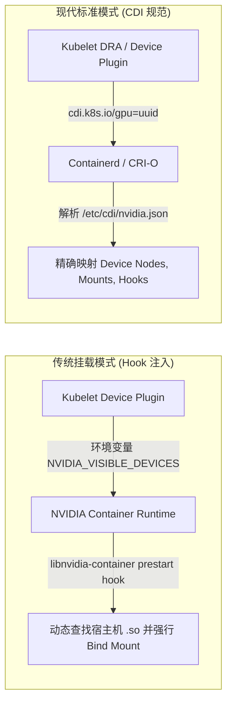
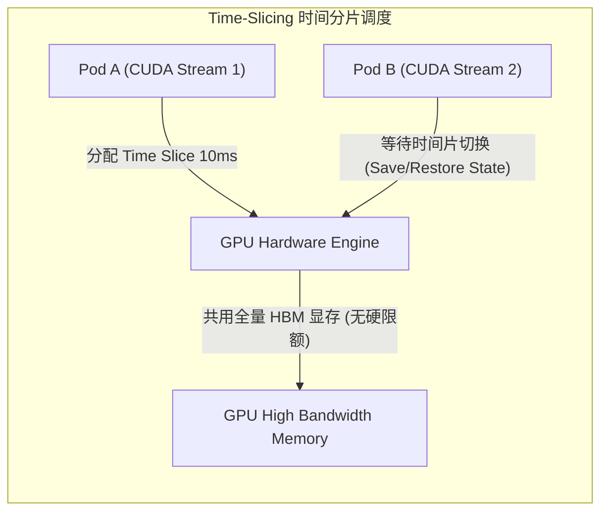
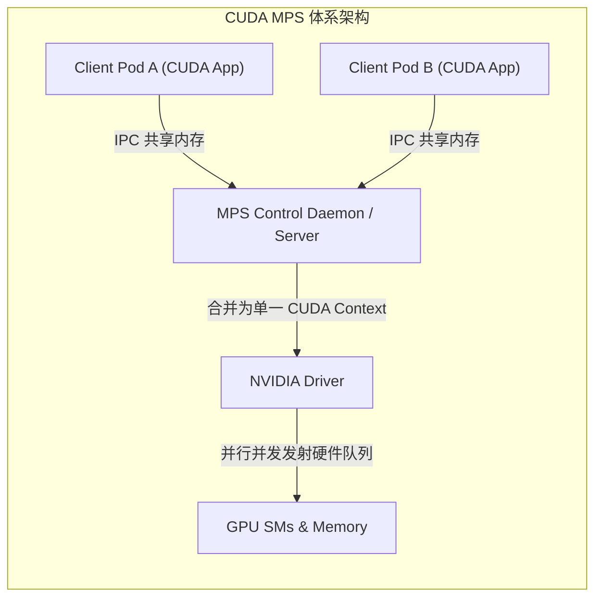
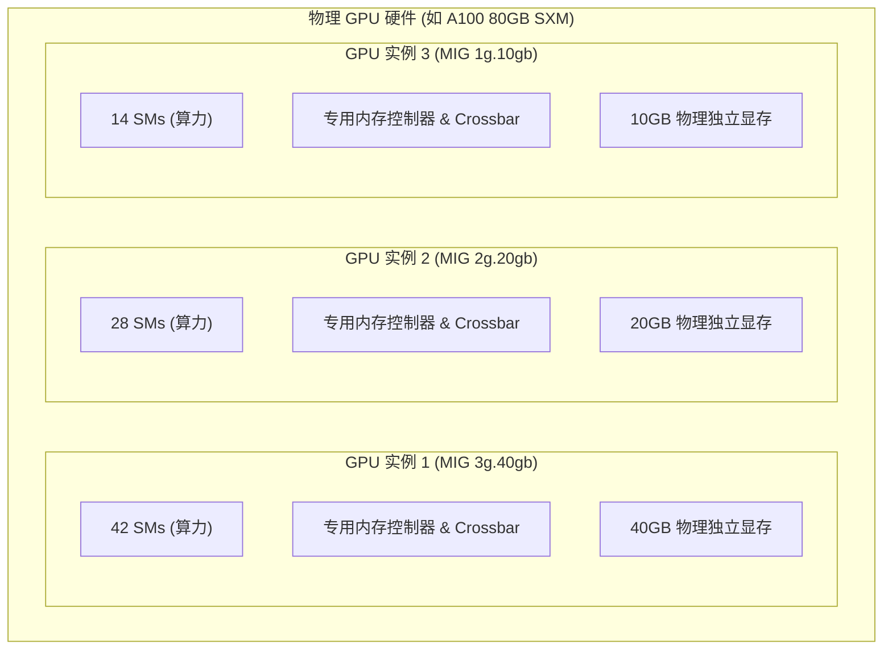
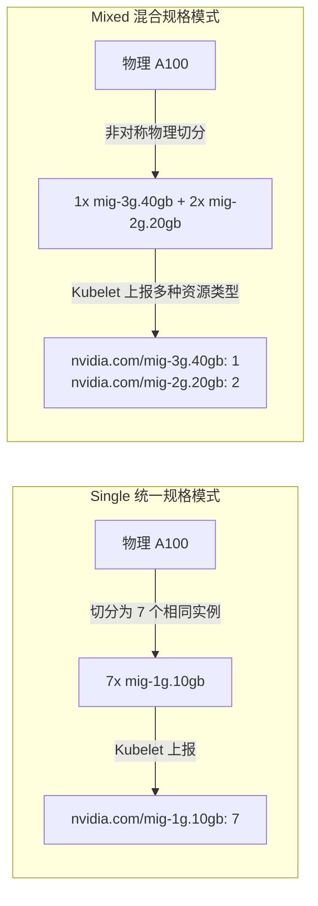

**TL;DR：** 在 Kubernetes 集群中管理 GPU 算力早已告别「单 Pod 独占整卡」的粗放时代。大模型微调、小参数模型推理、Embedding 向量化等异构负载对 GPU 算力的需求差异巨大。本文深入剖析 Linux 容器挂载 GPU 设备的底层演进——从依赖动态链接库注入与环境变量黑盒的 NVIDIA Container Toolkit，到基于标准化 JSON 配置的容器设备接口（Container Device Interface, CDI）；进而从 GPU 硬件架构（Streaming Multiprocessor, SM、Crossbar、显存控制器）出发，深度横向对比 Time-Slicing（时间分片）、MPS（多进程服务）与 MIG（多实例 GPU）三代虚拟化方案的内核隔离等级、硬件资源排队、上下文切换惩罚（Context Switch Penalty）与生产落地决策矩阵。

---

## 一、 容器化 GPU 挂载的演进：从 Hook 黑盒到 CDI 标准化

在 Linux 原生世界中，容器本质是基于 Namespace、Cgroups 和 rootfs 构建的隔离进程视图。然而，GPU 设备（`/dev/nvidia*`、`/dev/nvidia-uvm`、`/dev/nvidia-modeset`）并非纯粹的字符设备节点，它们高度依赖宿主机内核驱动（`nvidia.ko`、`nvidia-uvm.ko`）与复杂的用户态驱动库（`libcuda.so`、`libnvidia-ml.so` 等）。



### 1.1 传统模式的结构性缺陷：`libnvidia-container` 与 Prestart Hook

在 CDI 规范诞生前，Kubernetes 调度 GPU 必须依赖 NVIDIA 提供的特定堆栈：
1. **环境变量约定**：Kubelet GPU Device Plugin 在发现节点 GPU 后，将特定设备 UUID 注入 Pod 的环境变量 `NVIDIA_VISIBLE_DEVICES=GPU-xxxx` 和 `NVIDIA_DRIVER_CAPABILITIES=compute,utility`；
2. **Runtime 劫持**：底层运行时（如 containerd）调用定制的 `nvidia-container-runtime`；
3. **Hook 盲注入**：`nvidia-container-runtime` 在 OCI 容器配置的 `prestart` 阶段执行 `nvidia-container-cli`，动态读取宿主机的驱动库路径，将几十个 `.so` 动态链接库和驱动设备节点强制以只读方式 bind mount 进容器的 rootfs 中。

这种模式在生产中引发了严重的**确定性与兼容性危机**：
- **容器镜像污染与运行时不可重现**：容器内部的应用运行时完全受制于宿主机注入的动态链接库版本，极易引发 CUDA Forward Compatibility 兼容性崩溃；
- **非 root 容器与安全沙箱断裂**：Hook 阶段以 root 权限强行修改容器 spec，直接破坏了 kata-containers、gVisor 等安全沙箱的隔离边界；
- **多设备联合难以抽象**：当同一 Pod 同时请求 GPU 与配套的 RoCE/InfiniBand RDMA 网卡时，各自的 Hook 工具互相冲突，缺乏统一的设备拓扑表达。

### 1.2 CDI（Container Device Interface）规范架构

为解决第三方硬件与容器运行时耦合的乱象，由 CNCF 推动的 **CDI 规范**成为了 Kubernetes 1.28+ 和 containerd 1.7+ 的绝对事实标准。

CDI 的核心思想是**将设备描述从动态 Hook 行为转化为静态声明式契约**。设备插件在节点初始化时，于 `/etc/cdi/nvidia.json` 生成严格遵循 OCI 规范的设备描述文件：

```json
{
  "cdiVersion": "0.5.0",
  "kind": "vendor.com/device",
  "devices": [
    {
      "name": "gpu0",
      "containerEdits": {
        "deviceNodes": [
          {"path": "/dev/nvidia0", "hostPath": "/dev/nvidia0", "permissions": "rw"},
          {"path": "/dev/nvidia-uvm", "hostPath": "/dev/nvidia-uvm", "permissions": "rw"},
          {"path": "/dev/nvidiactl", "hostPath": "/dev/nvidiactl", "permissions": "rw"}
        ],
        "mounts": [
          {
            "hostPath": "/usr/lib/x86_64-linux-gnu/libcuda.so.550.54.14",
            "containerPath": "/usr/lib/x86_64-linux-gnu/libcuda.so.1",
            "options": ["ro", "bind"]
          }
        ],
        "env": [
          "NVIDIA_VISIBLE_DEVICES=none"
        ]
      }
    }
  ]
}
```

通过 CDI，CRI 运行时无需任何第三方 Hook 拦截器，直接按照标准规范将底层硬件映射入 OCI runtime-spec，彻底消除了驱动版本漂移与运行时沙箱断裂问题。

---

## 二、 GPU 虚拟化方案一：Time-Slicing（时间分片）

在不需要严格硬件隔离的场景下，**Time-Slicing** 是最轻量、普适性最高的共享方案。



### 2.1 调度机制与内核驱动行为

Time-Slicing 本质上是在**驱动层（NVIDIA Kernel Driver）**实现的软多任务调度。
1. **虚拟副本抽象**：NVIDIA GPU Device Plugin 允许将一张物理 GPU 声明为 $N$ 个逻辑设备（例如配置 `replicas: 4`，使单张 H100 对 Kubernetes 上报 4 个 `nvidia.com/gpu` 资源）；
2. **轮转上下文切换（Round-Robin Context Switching）**：GPU 内部的硬件调度器（Hardware Work Distributor）按照驱动设定的时间片（通常默认在毫秒级）在不同的 CUDA 上下文之间进行轮转；
3. **状态保存与恢复**：当从 Pod A 切换到 Pod B 时，GPU 必须将 SM 上的寄存器堆状态（Register File）、共享内存（Shared Memory）和程序计数器写回显存，并加载 Pod B 的上下文。

### 2.2 致命缺陷：显存无隔离与高延迟抖动

Time-Slicing 在生产中最常被滥用，但也带来了两大灾难性问题：

1. **显存 OOM 连锁崩溃（No Memory Isolation）**：
   Time-Slicing **没有任何硬件或驱动级的显存硬配额**。如果 Pod A 申请了 80% 显存，Pod B 突然突发申请显存，一旦物理显存耗尽，将触发 CUDA `out of memory` 错误，导致运行中的推理 Pod 随机崩溃。
2. **上下文切换惩罚（Context Switch Penalty）**：
   在密集计算下，GPU 上下文切换的耗时比 CPU 昂贵数个数量级（因为 SM 寄存器堆总量高达数百 KB 至数 MB）。当并发 Pod 数量增加时，GPU 利用率表面上飙升到 100%，但大量算力被浪费在硬件状态交换的流水线排空（Pipeline Drain）与重填上，导致端到端推理时延 P99 严重恶化。

---

## 三、 GPU 虚拟化方案二：MPS（Multi-Process Service）

针对 Time-Slicing 频繁切换上下文的损耗，NVIDIA 推出了 **CUDA MPS（多进程服务）**。



### 3.1 架构原理：消除 Context Switch，实现算力并发

MPS 的核心突破在于：**将多个独立容器/进程的 CUDA 任务，汇聚为单一底层 CUDA Context**。
- **MPS Control Daemon & Server**：在每个节点或 Pod 组内运行一个 MPS Control Daemon 和 MPS Server 进程；
- **共享上下文**：各个容器内的客户端应用程序通过 Unix Domain Socket 和共享内存与 MPS Server 通信；
- **并发发射（Concurrent Kernel Execution）**：由于共用同一个 GPU 上下文，GPU 硬件调度器可以将来自不同 Pod 的 Kernel 指令**同时发射到不同的 SM 上并行执行**，彻底消除了时间分片切换的开销，极大地提升了小 batch 推理与小模型训练的算力填充率。

### 3.2 显存与线程限制配置

自 Volta 架构起，MPS 提供了细粒度的**资源限制能力**，可通过环境变量注入容器：
- `CUDA_MPS_PINNED_DEVICE_MEM_LIMIT`：限制该客户端容器可分配的最大 GPU 显存（例如 `0=4G,1=8G`）；
- `CUDA_MPS_ACTIVE_THREAD_PERCENTAGE`：限制该客户端可占用的最大 SM 线程比例（例如 `50` 表示最多占用 50% 的 SM 算力）。

### 3.3 生产边界与致命弱点：错误扩散（Fault Domain Leak）

尽管 MPS 解决了性能与轻量显存限额问题，但它有一个在金融与多租户平台中无法容忍的阿喀琉斯之踵：**容错域泄露**。
- 由于所有共享 MPS 的容器在底层硬件上共享**同一个地址空间上下文**；
- 一旦 Pod A 发生非法的内存越界访问（Illegal Memory Access）或触发硬件级 CUDA 异常，**整个 MPS Server 会发生崩溃，进而导致挂载该 MPS Server 的所有其他租户 Pod 同时强制断开退出**。

---

## 四、 GPU 虚拟化方案三：MIG（Multi-Instance GPU）

为了在硬件层面实现真正的多租户安全隔离，NVIDIA 在 Ampere（A100）、Hopper（H100/H800）和 Blackwell 架构中推出了 **MIG（多实例 GPU）**。



### 4.1 硬件级物理切分内核：GPC、Memory Slice 与 Crossbar

MIG 绝非软件模拟，而是在**硅片物理电路层面**进行的解耦：
1. **GPU Processing Cluster（GPC）独立划分**：一张 A100 包含 8 个 GPC（其中一个用于冗余，7 个可用）。MIG 按照 GPC 为基本粒度切分，每个 GPC 包含固定数量的 SM、Tensor Core、纹理单元与 L1 缓存；
2. **显存控制器与 Crossbar 物理隔离**：显存不仅按容量被硬切分成片（Memory Slice），而且对应的**显存控制器、内存总线带宽以及二级缓存（L2 Cache）**均按切分比例严格物理独占；
3. **独立的中断与硬件故障域**：每个 MIG 实例拥有独立的 PCIe 虚拟功能（Virtual Function）、独立的容错隔离域。如果 Pod A 触发了严重的硬件级非法寻址或内核 Panic，硬件异常被完全限制在其实例内部，其他 MIG 实例的计算完全不受任何抖动或中断影响。

### 4.2 Kubernetes 中的 MIG 策略选型：Single vs Mixed

在 Kubernetes 中配置 MIG 资源上报通常有两种拓扑模式：



- **Single Strategy**：整个集群或整机统一切分为同一种规格（例如全部是 `mig-1g.10gb` 或 `mig-3g.40gb`）。**调度器最为友好**，不存在由于碎片导致的资源锁定无法调度；
- **Mixed Strategy**：单张卡内切分为多种不同大小的实例（例如 1 个 3g.40gb 承载小模型微调，2 个 2g.20gb 承载并发推理）。虽然算力贴合业务需求，但一旦某个 2g 实例被 Pod 占用，无法动态重组为更大的 3g 实例，容易产生**节点内部物理碎片（Hardware Fragmentation）**。

---

## 五、 三大方案全景对比与工程决策矩阵

| 评估维度 | Time-Slicing（时间分片） | CUDA MPS（多进程服务） | MIG（多实例 GPU） |
| :--- | :--- | :--- | :--- |
| **隔离层次** | 驱动层时分复用（软隔离） | 用户态服务端共享上下文（软隔离） | **硬件硅片电路级切分（强物理隔离）** |
| **硬件要求** | 所有 NVIDIA GPU 均通用 | Kepler 架构及以上 | **仅限 A100 / H100 / B200 等数据中心架构** |
| **算力并发性** | 串行执行，排队等待时间片 | **并发执行，多任务同时占满 SM** | **硬件并行，各实例独占 SM 与流水线** |
| **显存带宽隔离**| ❌ 无隔离，互相争抢总线 | ❌ 仅限逻辑容量限制，带宽抢占 | **✅ 物理独占对应内存通道与 L2 缓存** |
| **故障爆炸半径**| 中（OOM 互锁导致 Pod 异常） | **高（单个进程段错误波及所有客户端）** | **零（完全独立的硬件故障与重置域）** |
| **调度与动态性**| 极高（仅需修改配置文件的副本数）| 高（守护进程自动管理连接） | 较低（动态重切分需要排空所有实例任务） |
| **典型适用场景**| 研发测试环境、批处理离线吞吐任务 | **中低吞吐、低显存占用的微服务推理** | **金融级多租户集群、高可用大模型推理生产线** |

---

## 六、 生产级配置全景示例：CDI + MIG 协同

以下是一个生产环境中使用 CDI 规范直接声明 MIG 实例的标准化 Pod 配置，彻底告别旧版环境变量 Hook：

```yaml
apiVersion: v1
kind: Pod
metadata:
  name: llm-embedding-service
  namespace: ai-serving
  labels:
    app.kubernetes.io/name: bge-large-embedding
spec:
  containers:
    - name: embedding-worker
      image: registry.example.com/ai/bge-large-zh:v1.5
      command: ["python3", "-m", "vllm.entrypoints.openai.api_server"]
      args:
        - "--model=/models/bge-large-zh"
        - "--gpu-memory-utilization=0.9"
      resources:
        limits:
          # 请求一个硬件物理隔离的 1g.10gb MIG 实例
          nvidia.com/mig-1g.10gb: "1"
          cpu: "4"
          memory: "16Gi"
        requests:
          nvidia.com/mig-1g.10gb: "1"
          cpu: "2"
          memory: "8Gi"
      volumeMounts:
        - name: model-cache
          mountPath: /models
  volumes:
    - name: model-cache
      persistentVolumeClaim:
        claimName: pvc-shared-nas-models
```

---

## 结论与演进思考

在云原生 AI 算力平台中，没有万能的虚拟化技术，只有对业务 SLA 与成本的精细化权衡：
- **开发与原型探索**：优先使用 **Time-Slicing**，以最低的运维代价最大化挖掘老旧卡（如 T4/V100/3090）的设备共享比；
- **小模型轻量推理（Embedding / Rerank / 文本分类）**：采用 **MPS** 模式，消除时分排队延迟，实现吞吐翻倍；
- **核心多租户生产集群与高可靠 LLM 推理**：坚决采用 **MIG** 模式并拥抱 **CDI 规范**，用硬件级隔离兜底集群稳定性，彻底消灭噪音邻居（Noisy Neighbor）与故障跨租户穿透。

在下一篇文章中，我们将视角从单机 GPU 虚拟化上升到**集群级作业调度**，深度拆解在分布式深度学习场景下，默认 `kube-scheduler` 为何屡屡引发死锁，以及 **Volcano 与 Kueue 的 Gang 调度与 PodGroup 状态机**是如何彻底解决 All-or-Nothing 资源死锁问题的。
