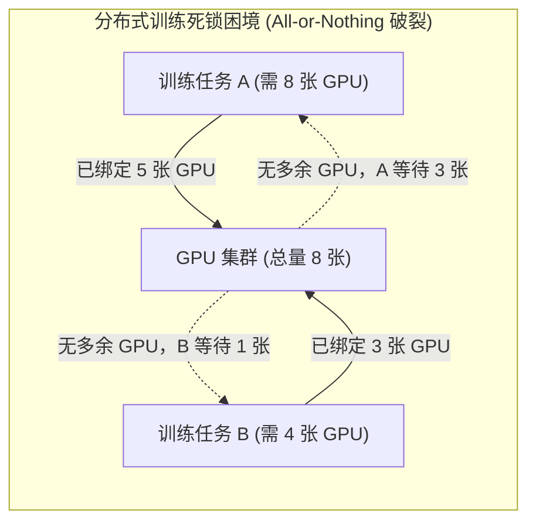
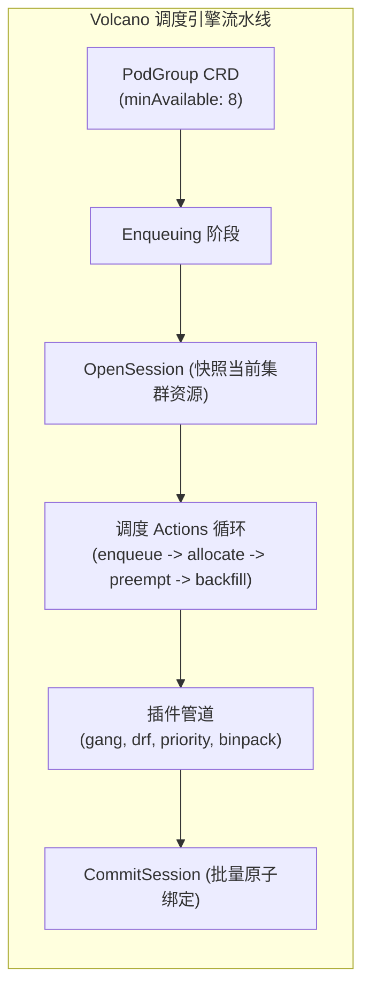
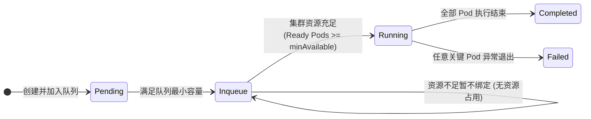
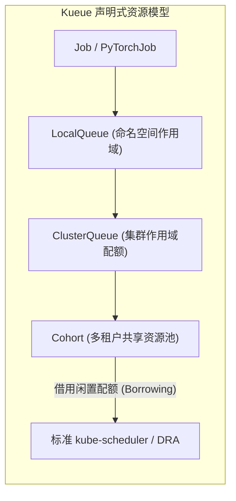

**TL;DR：** 默认的 `kube-scheduler` 是基于「单个 Pod」为原子单位进行打分与绑定的。而在大模型分布式训练（如 64 节点、512 卡的 Megatron-LM 训练任务）中，所有 Pod 必须同时就位才能初始化通信环（NCCL Ring），缺少任意一个节点都会导致整个作业挂起。在大并发任务提交时，单 Pod 调度模式极易引发经典的**死锁（Deadlock）**：作业 A 占用了 60% 算力等待剩余资源，作业 B 占用了 40% 算力等待更多资源，两者永久互相阻塞。本文深入拆解两代批处理调度引擎——深植于 CNCF 的独立定制调度器 **Volcano** 与轻量非侵入式的上层队列管理引擎 **Kueue**，深度对比其 Gang 调度内核、PodGroup 状态机流转、DRF 主资源公平共享与多租户借用配额（Borrowing Cohort）的工程实践。

---

## 一、 为什么默认 `kube-scheduler` 会在分布式 AI 场景中瘫痪？

Kubernetes 原生调度器的设计初衷是服务于长期运行的无状态微服务（Microservices）。在微服务世界中，ReplicaSet 里的 Pod 是互相独立、随时可替代的“牲畜”（Cattle）。



### 1.1 资源碎片与“All-or-Nothing”断裂

分布式深度学习依赖集合通信库（如 NVIDIA NCCL）。无论采用数据并行（DP）、流水线并行（PP）还是张量并行（TP），所有参与节点在启动时必须握手完成通信拓扑构建：
$$\text{Status} = \text{Init}(\text{Rank}_0, \text{Rank}_1, \dots, \text{Rank}_{N-1})$$
如果在超时阈值（NCCL 默认通信握手超时通常为 30 分钟）内有任意一个 Worker 处于 `Pending` 状态，其余已就位的 Worker 会在空转消耗巨额 GPU 显存与电力后全部抛出 `NCCL WARN: Call to connect returned Connection refused` 异常崩溃。

默认 `kube-scheduler` 逐个遍历 Pod 队列并进行 Predicate/Priority 决策：
1. 调度器看到任务 A 的 Pod 0~4 满足资源，直接执行 `Bind` 绑定到节点；
2. 随后调度器看到任务 B 的 Pod 0~2 满足资源，同样绑定到节点；
3. 此时集群 GPU 全部售罄。任务 A 的 Pod 5~7 与任务 B 的 Pod 3 均无法调度；
4. 两个任务同时空转，谁也不主动释放已占用的资源，形成**完全死锁**。

---

## 二、 Volcano 架构内核：以作业为核心的深度调度器

作为 CNCF 毕业的首个专为高性能批处理而生的调度系统，**Volcano** 彻底打破了“单 Pod 调度”的边界，引入了**作业（Job）与 PodGroup** 概念。



### 2.1 PodGroup 状态机与原子调度机制

Volcano 定义了 `scheduling.volcano.sh/v1beta1` 的 `PodGroup` 资源对象，用于表征一组具有强协同关系的 Pod：

```yaml
apiVersion: scheduling.volcano.sh/v1beta1
kind: PodGroup
metadata:
  name: llama3-70b-pretrain-pg
  namespace: ai-training
spec:
  minAvailable: 8  # 必须至少有 8 个 Pod 能同时调度，才允许整体执行绑定
  minResources:
    nvidia.com/gpu: "64"
    cpu: "256"
    memory: "1024Gi"
  queue: high-priority-training
```

PodGroup 的状态机流转实现了严格的数学闭环：



- **Pending / Inqueue**：当集群可用 GPU 小于 `minAvailable` 时，Volcano 的 `gang` 插件会在内存中直接拒绝进入分配状态，**不会对任何一个 Pod 执行 Kubelet 绑定**；
- **原子提交（Atomic Commit）**：只有当调度器在一个调度周期（Session）内确认整组 8 个 Pod 均能找到合法的安置节点时，才统一调用 API Server 批量写入节点的 `binding`，彻底粉碎死锁条件。

### 2.2 DRF（Dominant Resource Fairness）多维资源公平算法

在传统单一资源调度中，最大最小公平（Max-Min Fairness）行之有效。但在 AI 集群中，不同作业的资源配比极度异构（例如：数据预处理作业极度消耗 CPU/内存，模型训练作业极度消耗 GPU）。

Volcano 内置了经典的 **DRF 插件**，其核心逻辑如下：
1. 计算每个租户/作业对其主导资源（Dominant Resource）的占有比例：
   $$s_i = \max_{r \in R} \left( \frac{U_{i,r}}{C_r} \right)$$
   其中 $U_{i,r}$ 为第 $i$ 个作业分配的资源 $r$ 数量，$C_r$ 为集群资源 $r$ 的总容量；
2. 调度器优先满足**主导资源份额（Dominant Share）最小**的作业，从而保证多维度资源异构环境下的数学级公平性，杜绝算力垄断。

---

## 三、 Kueue 架构内核：声明式云原生轻量队列引擎

虽然 Volcano 功能强大，但它必须替换或重度定制 Kubernetes 的核心调度器，维护成本高且难以与公有云托管集群（如 EKS、GKE、ACK）的标准调度插件生态完全相融。

为此，Kubernetes SIG-Scheduling 推出了全新的上层排队协调器——**Kueue**。



### 3.1 架构哲学：非侵入式控制循环（Non-invasive Queueing）

Kueue 的设计理念是**关注点分离（Separation of Concerns）**：
- **Kueue 负责“何时准入（When to admit）”**：管理作业的优先级、排队、抢占与配额校验；
- **kube-scheduler 负责“放置何处（Where to place）”**：原生的拓扑感知、节点亲和性打分与容器设备绑定。

当用户提交一个批处理作业时，Kueue 的 Mutating Webhook 会先将其挂起（`suspend: true`）。此时该作业的所有 Pod 甚至**不会被实际创建出来**，API Server 负载为零。只有当 Kueue 计算出集群配额就绪后，才将作业解挂（`suspend: false`），由调度器立即执行就绪 Pod 的安置。

### 3.2 弹性借用机制：Cohort 与 Borrowing Limit

Kueue 最受企业欢迎的核心特性是**多租户弹性借用（Cohort）**。在传统方案中，为团队 A 划分 100 张卡，为团队 B 划分 100 张卡，一旦团队 A 闲置，团队 B 即使排长队也无法使用。

而在 Kueue 中，多个 `ClusterQueue` 可以加入同一个 `Cohort`，支持精细化的配额借用：

```yaml
apiVersion: kueue.x-k8s.io/v1beta1
kind: ClusterQueue
metadata:
  name: algorithm-team-cq
spec:
  cohort: ai-engineering-cohort # 共享算力池名称
  resourceGroups:
    - coveredResources: ["nvidia.com/gpu"]
      flavors:
        - name: "h100-flavor"
          resources:
            - name: "nvidia.com/gpu"
              nominalQuota: 32     # 保底独享 32 张卡
              borrowingLimit: 64   # 允许最多从 Cohort 中借用 64 张闲置卡
              lendingLimit: 16     # 最多允许借出 16 张卡给其他团队
```

### 3.3 Kueue 抢占与状态流转

当借用发生后，如果团队 A 突然提交了关键的高优先级任务，Kueue 会触发**按配额回收抢占（Preemption）**：
1. 识别出当前正运行在超出其 `nominalQuota` 配额的作业；
2. 发送优雅终止信号或挂起标记，将借出的算力快速归还，既实现了利用率最大化（压榨闲置资源），又确保了租户 SLA。

---

## 四、 Volcano 与 Kueue 全方位技术选型矩阵

| 评估维度 | Volcano | Kueue |
| :--- | :--- | :--- |
| **接入模式** | **侵入式**：替换或并行运行整套定制 Scheduler | **非侵入式**：基于标准 Controller/Webhook，复用标准 Scheduler |
| **Gang 粒度** | **Pod 级强约束**：通过 PodGroup 控制到底层 Bind | **Workload 级准入**：在 Job 创建层面控制 `suspend` |
| **公有云兼容度**| 较低（在托管 K8s 服务中配置自定义调度器难度高）| **极高（开箱即用，原生支持各大公有云托管集群）** |
| **网络拓扑调度**| 支持内置的跨交换机与机架感知插件 | 依赖原生 `kube-scheduler` 的拓扑管理器插件 |
| **生态集成** | 自带 VolcanoJob，也可支持 MPI/PyTorchJob | **原生深度集成 Kubeflow、Ray、Batch/Job、KubeRay** |
| **选型建议** | **自建 IDC、深度定制的高性能超算与 HPC 裸金属集群** | **现代化云原生平台、混合多租户、公有云 AI 训练/推理中台** |

---

## 五、 生产级配置：Kueue 驱动 PyTorchJob 实现无死锁 Gang 调度

以下为生产环境中利用 Kueue 对 Kubeflow `PyTorchJob` 进行 Gang 调度与弹性配额管理的完整定义：

```yaml
apiVersion: kubeflow.org/v1
kind: PyTorchJob
metadata:
  name: llama-3-8b-finetune
  namespace: ai-training
  labels:
    kueue.x-k8s.io/queue-name: algorithm-team-lq # 绑定本地队列
spec:
  pytorchReplicaSpecs:
    Master:
      replicas: 1
      restartPolicy: OnFailure
      template:
        spec:
          containers:
            - name: pytorch
              image: registry.example.com/ai/torch-train:v2.4
              resources:
                limits:
                  nvidia.com/gpu: 8
    Worker:
      replicas: 3 # 1 Master + 3 Workers = 4 节点 (32 张 GPU)
      restartPolicy: OnFailure
      template:
        spec:
          containers:
            - name: pytorch
              image: registry.example.com/ai/torch-train:v2.4
              resources:
                limits:
                  nvidia.com/gpu: 8
```

Kueue 在准入该 `PyTorchJob` 时，会将其整体作为一个 Workload 校验配额。如果当前 `algorithm-team-lq` 对应的集群可用卡数不足 32 张，整个任务保持 `suspend: true` 状态，不会有任何一个 Worker 提前霸占 GPU，从根源上杜绝了训练任务死锁与算力浪费。

---

## 结论与演进思考

解决多节点 AI 任务的调度问题，是 Kubernetes 走向 AI 原生基础设施的关键分水岭：
- 对于**超大规模自建裸金属超算集群**，Volcano 提供了极度精细的硬件排布与低层调度 Actions 编排能力；
- 对于**现代云原生平台与多团队协作环境**，Kueue 凭借其非侵入式、云厂商友好与灵活的 Cohort 配额借用机制，正迅速成为事实上的行业通用标准。

在下一篇文章中，我们将继续深入分布式深度学习的核心腹地，拆解在数千张 GPU 组成的计算集群中，**Kubeflow Training Operator 与 PyTorchJob 弹性容错、动态通信拓扑（Rendezvous）以及 GPUDirect RDMA 网络编排**的内核实现。
