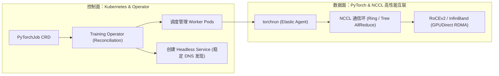
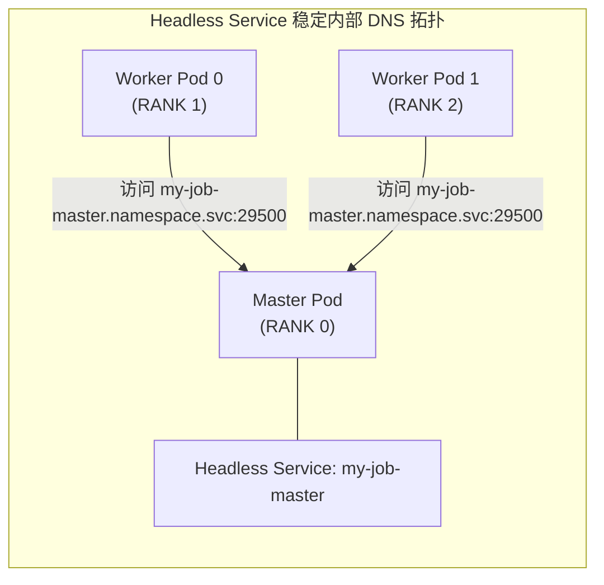
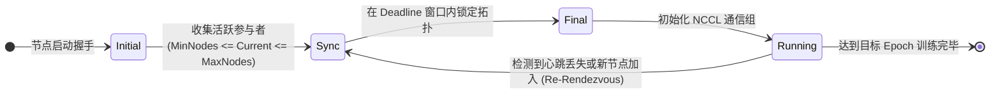
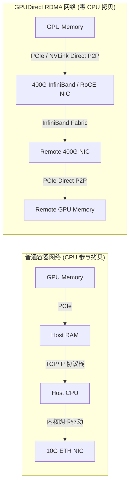

**TL;DR：** 在大规模分布式训练（如使用 Megatron-DeepSpeed 训练数百亿至万亿参数 LLM）中，底层硬件的物理故障率与节点规模成正比。一个 1024 卡的 GPU 集群平均数天甚至数小时就会遭遇一次显存 ECC 错误、InfiniBand 网卡掉线或 GPU 掉卡（Xid Error）。传统的静态训练任务一旦遇到单点硬件故障，整个通信环（AllReduce Ring）就会破裂并引发整组作业崩溃，从上次 Checkpoint 重启将浪费数小时的有效计算时间。本文深入剖析基于 **Kubeflow Training Operator** 的分布式训练编排架构，从静态 Headless Service 寻址进阶到 **PyTorch Elastic Agent（torchrun）** 的动态 Rendezvous 拓扑协商协议，剖析故障节点的动态剔除与热备替换机制，并给出结合 Multus CNI 与 SR-IOV 释放 GPUDirect RDMA 极限吞吐的生产级落地方案。

---

## 一、 大规模分布式训练的双层解耦：控制面 vs 数据面

理解 Kubernetes 上的分布式训练，首先必须清晰划分控制面（Control Plane）与高性能数据面（Data Plane）的权责边界：



- **Kubernetes 控制面**：负责宏观生命周期管理。计算资源配额、Pod 驱逐、失败重试、持久化 Checkpoint 卷（PVC）挂载以及对外健康检查；
- **NCCL/PyTorch 数据面**：负责微观计算通信。完全绕过 Kubernetes API Server 与宿主机 TCP/IP 协议栈，通过专用高速互联（NVLink / NVSwitch / RDMA）在纳秒级时延内流转模型梯度与激活张量（Activation Tensors）。

---

## 二、 Kubeflow Training Operator 的协调循环（Reconciliation）

Kubeflow Training Operator 统一了 `PyTorchJob`、`TFJob`、`XGBoostJob` 与 `MPIJob` 的控制逻辑，其中以 `PyTorchJob` 为现代主流大模型工程的核心。

### 2.1 拓扑构建与服务发现（Headless Service）

在执行 `torchrun` 时，每个进程必须知道通信协调者的地址（`MASTER_ADDR` 与 `MASTER_PORT`），以及自身的全局序号（`RANK`）和参与节点总数（`WORLD_SIZE`）。

Training Operator 通过为每个任务自动创建配套的 **Headless Service（`ClusterIP: None`）** 解决容器 IP 动态漂移的问题：



通过将 `RANK=0` 节点的网络名称固定绑定在稳定的内部 DNS 记录上，其他 Worker 节点即使遭遇重启或漂移，也能通过标准 DNS 快速重新定位协调者。

---

## 三、 动态集合通信与弹性容错：从 c10d 到 etcd Rendezvous

在传统的静态分布式训练中，一旦某个节点宕机，整个集群必须全部退出并重新调度。而在当代 **PyTorch Elastic（TorchElastic）** 架构下，训练任务具备了动态伸缩与容错恢复（Elastic Fault Tolerance）能力。

### 3.1 动态协商协议：Rendezvous 状态机

动态拓扑的基石是 **Rendezvous（集结协议）**。各个节点上的 `torchrun`（Elastic Agent）通过一个共享的后端（如 etcd 或 c10d 共享存储）在通信拓扑初始化前进行握手：



1. **弹性节点范围声明**：允许在 `PyTorchJob` 中声明节点数量的动态区间，例如 `minReplicas: 8`，`maxReplicas: 16`；
2. **集结超时窗口（Rendezvous Deadline）**：Elastic Agent 在启动时开始监听。只要在设定窗口内汇聚了 $\ge \text{minReplicas}$ 个节点，便锁定本轮通信组配置；
3. **Re-Rendezvous 拓扑重构**：当节点 3 因硬件 Xid 错误被内核踢出时，其维持的 Lease 租约过期。剩余健康节点监听到租约丢失事件，立即暂停当前的 Forward 计算，**触发 Re-Rendezvous 重新集结**，将 World Size 缩减为 15，加载最近的临时 Checkpoint 继续训练，**避免了整组千卡作业的大返工**。

---

## 四、 跨节点数据面加速：Multus CNI 与 GPUDirect RDMA

在大模型流水线并行与数据并行中，跨节点梯度同步的带宽瓶颈直接决定了 GPU 算力利用率（Model Flops Utilization, MFU）。如果跨节点通信走 Kubernetes 默认的 Flannel 或 Calico 等 Overlay 网络，报文需要经过复杂的 Linux Bridge、iptables、VXLAN 封包/解包与 CPU 中断软负载，吞吐将从 400Gbps 骤降到 10Gbps。

必须通过 **Multus CNI + SR-IOV 插件**，实现**容器对物理 InfiniBand/RoCE 网卡的直通旁路**：



### 4.1 GPUDirect RDMA 核心三要素

1. **直接内存访问（DMA 绕过 CPU）**：网卡（HCA）直接通过 PCIe 总线向 GPU 显存发起读取与写入，**全程无需 Host CPU 介入，无需在操作系统内核内存中中转**；
2. **Multus 多网络平面隔离**：
   - 第一网卡（`eth0`）：由 Calico/Cilium 管理，承载 Kubernetes 控制面通信、日志收集与监控指标抓取；
   - 第二网卡（`net1` ~ `net8`）：由 SR-IOV Device Plugin 直接将宿主机的 8 张 400Gbps RoCE 网卡以虚拟功能（VF）或物理功能（PF）直接挂载进容器。
3. **Hugepages 内存大页**：避免大模型训练传输海量张量时发生频繁的虚拟地址到物理地址 TLB 缺页中断。

---

## 五、 生产级配置：高可靠弹性 PyTorchJob 完整实战

以下为一个生产环境中部署在 K8s 上的千亿模型微调 `PyTorchJob` 配置，深度融合了 Kueue 调度、动态 Rendezvous 与 GPUDirect RDMA：

```yaml
apiVersion: kubeflow.org/v1
kind: PyTorchJob
metadata:
  name: qwen2-72b-elastic-pretrain
  namespace: ai-training
  labels:
    kueue.x-k8s.io/queue-name: training-cluster-queue
spec:
  elasticPolicy:
    minReplicas: 4      # 最少 4 节点 (32 卡) 即可开跑
    maxReplicas: 8      # 最多 8 节点 (64 卡)
    rdzvBackend: etcd   # 使用独立的高可用 etcd 作为集结后端
    rdzvEndpoint: "etcd-cluster.storage.svc:2379"
    maxRestarts: 5      # 允许单节点故障自动重启 5 次
  pytorchReplicaSpecs:
    Worker:
      replicas: 8
      restartPolicy: OnFailure
      template:
        metadata:
          annotations:
            # 挂载 8 张 400Gbps RDMA 专属网络平面
            k8s.v1.cni.cncf.io/networks: rdma-network-attach-def
        spec:
          containers:
            - name: pytorch
              image: registry.example.com/ai/megatron-training:v0.8.0
              resources:
                limits:
                  nvidia.com/gpu: "8"
                  rdma/hca_shared: "8"
                  hugepages-2Mi: "16Gi"
                  memory: "512Gi"
                  cpu: "64"
              securityContext:
                capabilities:
                  add: ["IPC_LOCK"] # 允许锁定物理内存，防止 RDMA 内存换出
              volumeMounts:
                - name: dshm
                  mountPath: /dev/shm # 扩展共享内存，防止 PyTorch DataLoader 死锁
          volumes:
            - name: dshm
              emptyDir:
                medium: Memory
                sizeLimit: 128Gi
```

---

## 结论与演进思考

在千卡级 AI 算力集群中，编排系统的核心指标不再仅仅是“能否把任务起起来”，而是**在硬件发生不可抗力物理损坏时，系统能保留多少有效吞吐算力（Effective Compute Retention）**：
- **静态架构时代**：单卡故障 $\rightarrow$ 全体报错退出 $\rightarrow$ 人工排查修复 $\rightarrow$ 重新全量排队 $\rightarrow$ 倒退至上一轮 Checkpoint（损耗往往以半天计）；
- **云原生弹性架构时代**：单卡故障 $\rightarrow$ Kubernetes 自动标记并驱逐故障节点 $\rightarrow$ 剩余存活节点通过 Elastic Agent 在 30 秒内完成 Re-Rendezvous $\rightarrow$ 动态重平衡微批次并无缝继续训练。

在大规模训练集群成功启动并跑通后，另一个致命的生产瓶颈随之浮现：**每个节点的容器镜像和基础运行环境高达 30GB 至 50GB，节点扩容时数百台机器同时向镜像仓库发起拉取，引发严重的网络拥塞与挂起**。在下一篇文章中，我们将深度拆解 **Nydus 块级按需加载与 Dragonfly P2P 集群分发**，看现代云原生平台如何将大模型节点启动耗时从 20 分钟压缩至 2 秒之内。
