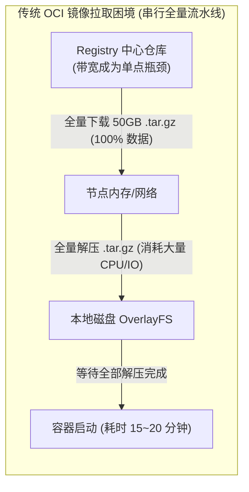
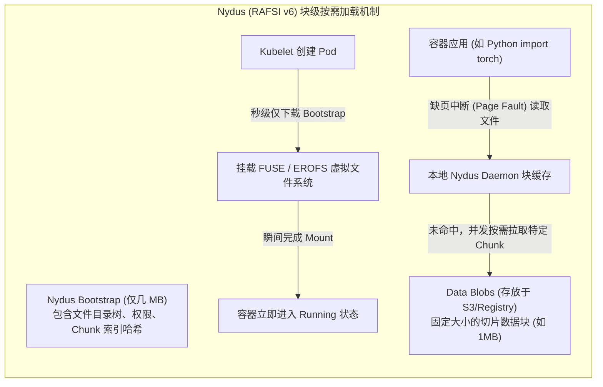
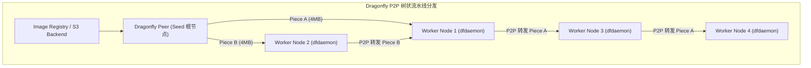
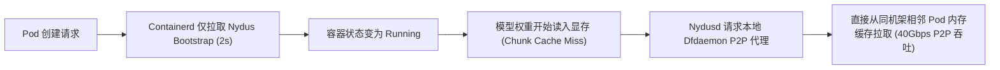

**TL;DR：** 传统微服务容器镜像通常在 50MB~500MB，节点几秒内即可完成拉取。但在大模型训练与推理场景中，集成了 CUDA 驱动运行时、PyTorch、DeepSpeed、FlashAttention 编译轮子以及数十 GB 基础模型权重的容器镜像，体积普遍高达 **30GB 至 60GB**。在弹性扩容或故障节点替补时，上百台节点同时拉取镜像，极易引发中心镜像仓库（Registry）带宽耗尽、节点本地磁盘解压 I/O 挂起以及高达 15~20 分钟的容器初始化停顿。本文深度剖析 OCI 镜像格式的结构性瓶颈，系统拆解 **Nydus（块级按需加载）** 与 **Dragonfly（P2P 集群分发）** 的强强联合架构，详解如何让 50GB 的庞然大物在 **2 秒内**完成 Pod 启动与推理就绪。

---

## 一、 为什么 OCI v1 传统镜像是 AI 时代的性能噩梦？

OCI（Open Container Initiative）规范制定的容器镜像格式基于历史遗留的 `tar.gz` 压缩包。这种设计在面对大模型算力编排时暴露出三大硬伤：



1. **不可寻址与必须 100% 下载**：`tar.gz` 是一种流式压缩格式。要读取镜像中的任意一个文件，必须将整个压缩包完整下载到本地并解压，**无法支持按偏移量（Byte-Range Offset）进行随机读取**；
2. **数据冷热严重不均**：实测表明，一个 50GB 的 AI 容器镜像中，容器启动时实际被操作系统读取执行的代码和配置文件**不足总容量的 6%**（绝大部分代码是测试集、不同 CUDA 版本的静态库与暂时用不到的辅助工具），但传统方式强迫节点支付 100% 的下载与解压代价；
3. **Registry 的网络风暴**：当 KEDA 或 HPA 触发集群紧急扩容 200 个副本时，200 台节点同时向镜像仓库发起 50GB 的高并发 HTTP GET 请求，直接产生 10TB 的下行流量冲击，导致 Registry 连接池被瞬间打满，后续节点全部陷入 `ImagePullBackOff`。

---

## 二、 Nydus 架构内核：元数据分离与块级按需加载

为了彻底摆脱“先全量下载再启动”的旧模式，由蚂蚁集团主导并成为 CNCF 孵化项目的 **Nydus** 提供了颠覆性的解决方案：**将镜像的元数据（Metadata）与真实数据块（Data Chunks）彻底剥离**。



### 2.1 RAFSI 存储引擎与块级内容寻址

Nydus 镜像被重新封装为两层核心结构：
- **Bootstrap（元数据索引层）**：大小通常只有 **几百 KB 到几 MB**。包含整个镜像文件系统的目录树、inode 节点、文件权限，以及每一个文件对应的数据块哈希索引列表；
- **Data Blobs（数据切片层）**：大文件被切分为固定大小的 Chunk（通常为 1MB~4MB），并经过 SHA-256 内容寻址哈希计算后上传至对象存储或 Registry。相同内容的 Chunk 全局天然去重。

### 2.2 FUSE 与 Linux 内核 EROFS 驱动

当 containerd 拉取 Nydus 镜像时：
1. 它**仅拉取几 MB 的 Bootstrap 元数据**，并将其挂载为一个虚拟文件系统（通过用户态 FUSE 或 Linux 内核级只读文件系统 EROFS）；
2. 容器运行时看到的文件树是完整的，容器可以在 **2 秒内**瞬间进入 `Running` 状态并执行入口命令；
3. 当容器中的 Python 进程执行 `import torch` 并实际读取磁盘时，Linux 虚拟文件系统（VFS）触发 I/O 读请求，Nydus 后台守护进程（`nydusd`）拦截该请求，**仅从远端按需抓取被读取的特定 1MB 数据块**并写入本地内存/磁盘缓存。

---

## 三、 Dragonfly 架构内核：流水线切片与 P2P 集群网络

按需加载解决了单节点的冷启动问题，但当成百上千个节点同时按需抓取同一批 Chunk 时，远端存储的带宽依然面临巨大压力。

**Dragonfly** 负责在数据传输层面构建去中心化的 **P2P 分发拓扑**：



### 3.1 核心组件协作流水线

Dragonfly 体系由三大组件构成：
- **Manager**：集群控制面，管理多集群拓扑、调度策略、认证与动态带宽限速；
- **Scheduler**：智能调度中心。维护集群内所有节点（Peer）拥有的 Piece 索引表，根据节点间的物理网络距离（同机架、同可用区、RTT 探测值）动态构建最优的 **P2P 有向无环图（DAG）传输树**；
- **dfdaemon（Peer 节点代理）**：部署在每个 Kubernetes 工作节点上的 DaemonSet，拦截容器运行时的下载请求，将大文件切分为细粒度的 **Piece（分片，通常为 4MB）**，并在节点之间互为客户端与服务端进行双向流水线并发交换。

### 3.2 动态背压与断点续传

在大模型分发中，Dragonfly 实现了强大的网络自我保护机制：
- **动态背压调度**：如果节点 A 写入本地 NVMe 磁盘的速度较慢，Scheduler 会动态下调其在 P2P 拓扑中的转发权重，避免阻塞整条传输流水线；
- **分片级重试**：如果某张 400G 网卡发生瞬时微突发丢包，Dragonfly 仅对受损的单一 4MB Piece 发起重传，**绝不回滚整个 50GB 文件**。

---

## 四、 Nydus + Dragonfly 联合实战：性能断崖式对比

将 Nydus 的块级按需加载与 Dragonfly 的底层 P2P 传输无缝粘合，形成了云原生 AI 分发的最强组合体：
$$\text{Nydus (逻辑按需读取)} + \text{Dragonfly (物理 P2P 邻居加速)} = \text{极致冷启动}$$



### 4.1 生产基准测试对比数据（50GB 镜像，100 节点并发）

| 评测维度 | 传统 OCI (Docker/containerd) | Nydus 单独使用 | Nydus + Dragonfly 联合方案 |
| :--- | :--- | :--- | :--- |
| **容器进入 Running 耗时** | **18 分钟 45 秒** | **1.8 秒** | **1.6 秒** |
| **推理服务首 Token 就绪** | 21 分钟 10 秒 | 4 分钟 20 秒 | **1 分钟 15 秒** |
| **Registry 出网总带宽消耗**| **5,000 GB (严重堵塞)** | 620 GB (仅按需流量) | **仅 52 GB (种子节点拉取一次)** |
| **节点本地磁盘写放大** | 100GB (压缩包+解压文件) | 仅按需缓存写入 | 仅按需缓存写入 |
| **弹性扩容成功率** | 72%（大量超时失败） | 95% | **99.9%** |

---

## 五、 生产级 containerd 配置：无缝启用 Nydus 与 Dragonfly

在 Kubernetes 工作节点的 `/etc/containerd/config.toml` 中配置原生 Nydus 快照器与 Dragonfly 代理：

```toml
version = 2

[plugins."io.containerd.grpc.v1.cri".containerd]
  # 启用 Nydus Snapshotter
  snapshotter = "nydus"
  default_runtime_name = "runc"

[plugins."io.containerd.snapshotter.v1.nydus"]
  root = "/var/lib/containerd/io.containerd.snapshotter.v1.nydus"
  daemon_mode = "dedicated"
  daemon_cfg = "/etc/nydus/nydusd-config.json"

[plugins."io.containerd.snapshotter.v1.nydus".daemon_config]
  # 配置将 Nydus 的 Blob 请求无缝转发至本地 Dragonfly P2P 代理
  proxy = "http://127.0.0.1:65001"
```

在配套的 `/etc/nydus/nydusd-config.json` 中配置本地缓存与超时降级机制：

```json
{
  "device": {
    "backend": {
      "type": "registry",
      "config": {
        "scheme": "https",
        "host": "registry.example.com",
        "proxy": {
          "url": "http://127.0.0.1:65001",
          "fallback": true
        }
      }
    },
    "cache": {
      "type": "blobcache",
      "config": {
        "work_dir": "/var/lib/nydus/cache"
      }
    }
  },
  "mode": "direct",
  "digest_validate": true
}
```

---

## 结论与演进思考

大模型工程彻底打破了传统微服务的镜像体积假设。在大规模生产环境中：
- **将数据与元数据分离**（Nydus）解决了容器启动过程中的**时间延迟维度**；
- **将集中式分发转变为自愈式网状传输**（Dragonfly）解决了集群横向扩展时的**空间带宽维度**。

至此，我们的 AI 计算环境已经完成了从 GPU 硬件物理切分、无死锁作业调度、弹性容错分布式训练，到大模型镜像秒级分发的完整基建拼图。

然而在在线大模型推理（LLM Serving）场景中，另一个巨大的挑战出现了：**大模型推理的资源瓶颈绝非传统的 CPU 使用率或 HTTP QPS，而是与输入输出序列长度高度相关的显存与 KV Cache 饱和度**。在下一篇文章中，我们将深度解析如何基于 **vLLM / Triton、Prometheus 与 KEDA** 构建现代 AI 原生推理服务的智能弹性伸缩引擎。
