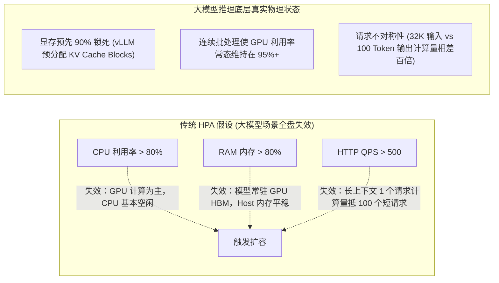
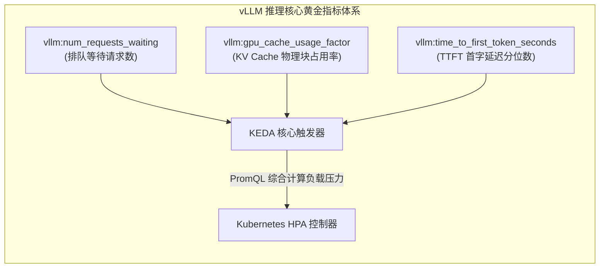
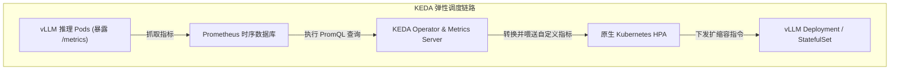

**TL;DR：** 将大模型推理服务（如基于 vLLM、Triton、TensorRT-LLM 部署的开源大模型）部署到 Kubernetes 时，很多团队会习惯性地套用微服务的传统自动扩缩容（HPA）方案——基于 CPU 使用率达到 80% 或 HTTP QPS 超过阈值扩容。然而在实践中，这种策略会瞬间引发两个极端灾难：**要么集群永远不扩容导致用户请求严重超时堆积，要么刚有少量请求就无脑扩出巨量昂贵的 GPU 副本造成算力预算瞬间破产**。本文深度解构大模型推理负载与传统 Web 服务的本质差异，从连续批处理（Continuous Batching）与 KV Cache 预分配机制出发，定位出表征大模型推理饱和度的**真实核心黄金指标**，并详解如何利用 **KEDA（Kubernetes Event-driven Autoscaling）** 打造基于显存饱和度、排队深度与平滑防抖的智能弹性调度系统。

---

## 一、 为什么传统的 CPU / QPS 弹性扩缩容在大模型推理中全盘崩溃？

大模型推理不是无状态的纯 CPU 计算，它的数学模型与显存布局打破了传统微服务的一切假设：



### 1.1 显存利用率恒定欺骗（Static VRAM Pre-allocation）

在启动 vLLM 或 TGI 时，默认参数 `--gpu-memory-utilization 0.9` 会在进程启动的瞬间，**一口气将物理显存的 90% 全部向系统申请锁死**。
- 这 90% 的显存中，除了一小部分存放固定的模型权重参数外，绝大部分被初始化为**空闲的 KV Cache Block 池**（类似操作系统启动时划分页表）；
- 从 Kubernetes 监控（如 Prometheus `container_gpu_memory_used_bytes`）看过去，该 Pod 的显存占用率从启动那一刻起**永远恒定在 90%**，无论当前是有 100 个并发请求，还是完全零请求。传统的显存阈值监控彻底失效。

### 1.2 GPU SM 计算利用率常态饱和（Continuous Batching）

在连续批处理（Continuous Batching）机制下，只要队列中存在待处理的 Token，GPU 的 Streaming Multiprocessor（SM）就会被矩阵乘法指令填满。
- 即使当前系统只在处理 2 个轻量请求，GPU 计算利用率也会显示为 95%~99%；
- 调度器如果看到 95% 就盲目扩容，会导致系统为了 2 个请求凭空扩出数张昂贵的 A100/H100 节点。

### 1.3 请求计算复杂度的极端不对称性（Prompt Length Disparity）

在 Web 接口中，每个 API 请求的处理耗时通常在一个量级（几十毫秒）。而大模型推理中：
- 场景 A：用户发送一段 32,000 Token 的长文档进行摘要，Prefill 阶段涉及 $O(N^2)$ 的全注意力矩阵运算，消耗数十秒算力与数 GB 的 KV Cache；
- 场景 B：用户发送一句简单的“你好”（3 Token），计算耗时不足 5 毫秒。
- 单纯统计 QPS（每秒请求数）完全无法反映后端系统的真实负载。1 个长文本请求就能直接挤爆显存，而 100 个短文本请求系统却依然游刃有余。

---

## 二、 穿透表象：大模型推理的“黄金三指标”

要实现精准的自动扩缩容，必须深入大模型推理引擎（以 vLLM 暴露的 `/metrics` 为标准）的内部运行时指标：



### 2.1 指标一：`vllm:num_requests_waiting`（等待队列深度）

- **物理含义**：当前已经到达服务但**由于 GPU 显存或算力已无空闲 Slot 而被迫滞留在系统排队队列中的请求数**；
- **扩容临界点**：健康的大模型服务应该具有近乎为 0 的排队深度。一旦 `num_requests_waiting > 0` 且持续数秒，说明当前所有在线副本的批处理通道全部满载，新来的请求正在遭受严重的端到端延迟恶化，**这是最直接、最紧急的扩容触发信号**。

### 2.2 指标二：`vllm:gpu_cache_usage_factor`（KV Cache 实际使用率）

- **物理含义**：在预分配的显存池中，当前正在被推理上下文实际占用的物理 Block 比例（值域 0.0 ~ 1.0）；
- **危险警戒线**：
  - 当该值达到 **0.80~0.85** 时，系统进入高度饱和预警区；
  - 一旦达到 **1.0**，vLLM 将被迫触发**抢占机制（Preemption）**——将低优先级请求的 KV Cache 强行释放或换出到 Host 内存（Swap-out），导致该请求后续必须重新执行极其昂贵的重新计算（Recomputation），用户体验产生灾难性卡顿。
  - 因此，**KV Cache 占用率突破 0.8 是最佳的预扩容（Proactive Scaling）触发点**。

### 2.3 指标三：TTFT 与 TPOT（业务体验时延 SLA）

- **TTFT（Time to First Token）**：首 Token 延迟，反映 Prefill 阶段的排队与计算开销；
- **TPOT（Time Per Output Token）**：Token 生成速率（Decoding 速度），反映 GPU 显存带宽与并发 Decoding 负荷。通常保持 TPOT 在 20ms~50ms 之间才能保证流畅的“打字机流式输出”。

---

## 三、 基于 KEDA 与 Prometheus 的架构设计

Kubernetes 原生 HPA 无法直接根据复杂的自定义 PromQL 表达式进行计算。**KEDA（基于事件驱动的自动伸缩器）** 提供了桥接能力：



### 3.1 解决缩容震荡（Scale-down Thrashing）与平滑防抖

由于大模型容器镜像庞大（30GB+）且模型权重加载至 GPU 显存通常需要 **1 到 3 分钟**（冷启动代价极高）：
- **扩容必须极速敏感**：发现排队立即扩容；
- **缩容必须极其缓慢保守**：一旦流量出现瞬时低谷就立即销毁 Pod，数分钟后流量反弹将遭遇长达数分钟的“冷启动空窗期”。

必须在 HPA 的 `behavior` 中配置**长达 10~15 分钟的稳定窗口（Stabilization Window）**，并限制单次缩容的最大步长。

---

## 四、 生产级配置：KEDA ScaledObject 完整实战

以下为一个支撑生产级千万级流量的大模型推理服务配置，结合了等待队列与 KV Cache 占用率双重触发机制：

```yaml
apiVersion: keda.sh/v1alpha1
kind: ScaledObject
metadata:
  name: qwen-72b-inference-scaler
  namespace: ai-serving
spec:
  scaleTargetRef:
    apiVersion: apps/v1
    kind: Deployment
    name: qwen-72b-vllm
  minReplicaCount: 2  # 保底常驻 2 副本，杜绝完全冷启动
  maxReplicaCount: 16 # 最大预算上限 16 副本 (128 卡)
  cooldownPeriod: 300 # 冷却时间 5 分钟
  pollingInterval: 15 # 每 15 秒评估一次 Prometheus 指标
  
  advanced:
    horizontalPodAutoscalerConfig:
      behavior:
        scaleUp:
          stabilizationWindowSeconds: 0 # 扩容零等待，瞬时响应
          policies:
            - type: Percent
              value: 100               # 激进扩容：允许单次翻倍
              periodSeconds: 15
        scaleDown:
          stabilizationWindowSeconds: 600 # 缩容稳定窗口 10 分钟 (防抖)
          policies:
            - type: Pods
              value: 1                  # 极端保守缩容：每次仅下线 1 个 Pod
              periodSeconds: 180

  triggers:
    # 触发器 1：排队等待请求数 (反映算力瞬间超载)
    - type: prometheus
      metadata:
        serverAddress: http://prometheus-k8s.monitoring.svc:9090
        metricName: vllm_waiting_requests_average
        # 统计集群内该模型所有副本平均等待请求数，目标阈值为 2
        query: sum(vllm:num_requests_waiting{model_name="qwen-72b"}) / count(vllm:num_requests_waiting{model_name="qwen-72b"})
        threshold: "2"

    # 触发器 2：KV Cache 物理占用率 (反映显存提前预警)
    - type: prometheus
      metadata:
        serverAddress: http://prometheus-k8s.monitoring.svc:9090
        metricName: vllm_gpu_cache_usage_average
        # 统计平均 KV Cache 占用率，目标阈值为 0.75 (75%)
        query: avg(vllm:gpu_cache_usage_factor{model_name="qwen-72b"})
        threshold: "0.75"
```

---

## 结论与演进思考

在 AI 原生时代，传统的基础设施可观测与调度指标已经完成了根本性的范式转移：
- **CPU / 物理内存 / HTTP QPS** 统治了微服务与 Web 架构的十几年；
- **排队请求深度（Queue Depth）/ KV Cache 块占用率 / TTFT 延迟分布** 则构成了大模型推理系统的全新中枢神经系统。

通过 KEDA 与 Prometheus 的精确解耦，我们将底层 vLLM 引擎的计算-显存特征无缝融入了 Kubernetes 原生调度体系，既守住了高并发下的用户体验底线，又杜绝了昂贵 GPU 节点的无谓浪费。

然而，在解决了单卡虚拟化、分布式训练、镜像加速与在线服务弹性之后，还有一个更底层的物理瓶颈隐藏在多卡服务器之中：**在拥有 8 张 GPU 的单台物理机内部，跨 NUMA 节点与跨 PCIe Switch 的数据传输时延相差数倍；一旦 Pod 被随意调度到不相匹配的 CPU Socket 与网卡上，大模型通信吞吐将暴跌 40%**。

在下一篇（完结篇）中，我们将彻底深入硬件拓扑的微观底层，解密 **Kubernetes 拓扑感知调度（Topology-Aware Scheduling）与全新的 DRA（Dynamic Resource Allocation）规范**。
