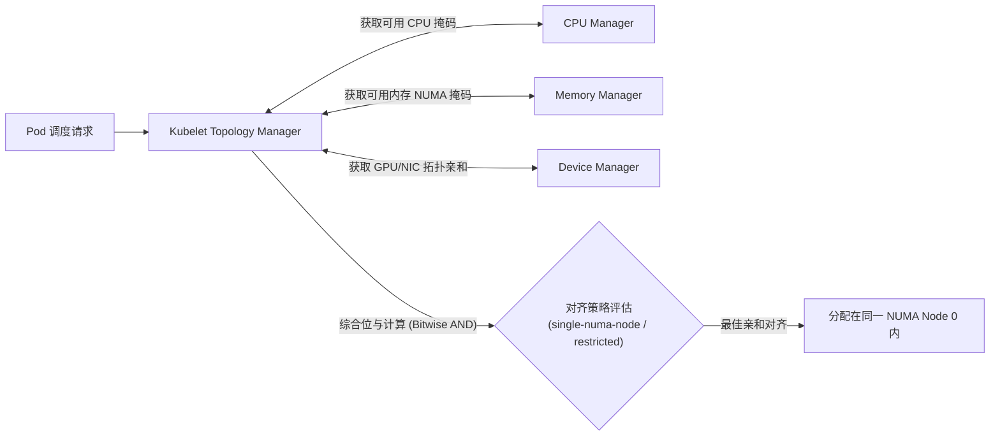
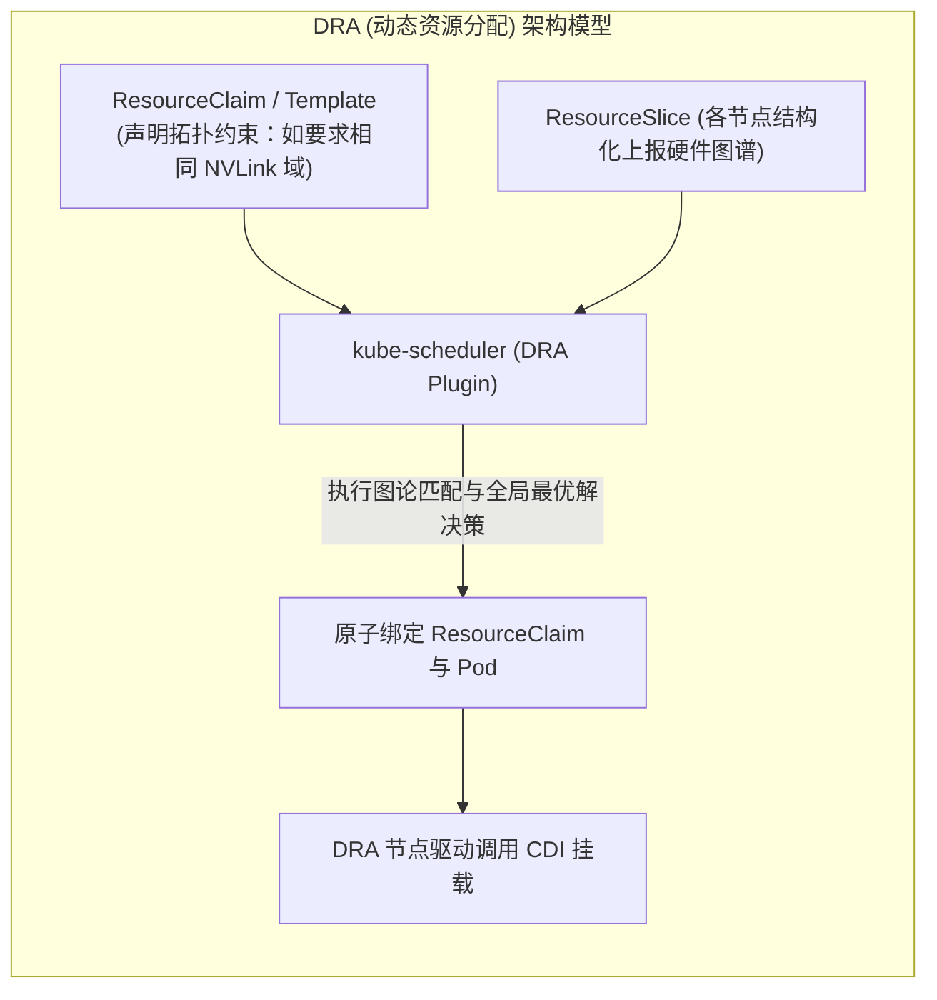
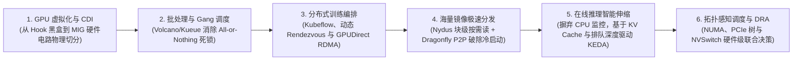

**TL;DR：** 在标准的 8 卡 GPU 物理服务器（如 NVIDIA DGX/HGX H100）中，硬件并非对称均匀分布的。服务器通常由双路 CPU 构成两个独立的 **NUMA 节点**，8 张 GPU 分别挂在多个不同的 **PCIe Switch** 甚至通过 **NVSwitch 芯片组**构成高低速不同的子域；同时配套的 8 张 400G RoCE/InfiniBand 网卡也严格物理绑定在特定的 CPU Socket 上。传统的 Kubernetes Device Plugin 仅仅把硬件抽象为粗粒度的整数计数器（`nvidia.com/gpu: 4`），调度器随意分配的 4 张卡极有可能横跨两个 CPU Socket，强迫 GPU 间的数据交换穿越极其狭窄的跨 CPU UPI/QPI 总线，导致通信吞吐发生 **30%~40% 的断崖式下跌**。本文深度拆解多卡多总线物理硬件拓扑，剖析 Kubelet Topology Manager 的 NUMA 对齐策略，并全景解读 Kubernetes 史上最具变革性的资源编排范式——**动态资源分配（DRA, Dynamic Resource Allocation）**。

---

## 一、 沉默的性能杀手：多 GPU 物理服务器的拓扑非对称性

在深度学习模型中，张量并行（Tensor Parallelism）与流水线并行（Pipeline Parallelism）对硬件点对点（P2P）通信带宽的要求达到了每秒数百 GB 甚至数 TB。

以下是典型 8 卡 AI 算力服务器（如 HGX A100/H100）的真实微观硬件拓扑剖面：

```mermaid
flowchart TD
    subgraph ServerChassis["8 卡 GPU 服务器硬件微观拓扑"]
        direction TB
        
        subgraph NUMA0["NUMA Node 0 (CPU Socket 0)"]
            CPU0["Intel Xeon / AMD EPYC CPU 0"]
            RAM0["DDR5 本地内存 1TB"]
            CPU0 --- RAM0
            
            subgraph PCIeSw0["PCIe Gen5 Switch 0"]
                GPU0["GPU 0"]
                GPU1["GPU 1"]
                NIC0["400G CX7 NIC 0"]
            end
            CPU0 === PCIeSw0
            
            subgraph PCIeSw1["PCIe Gen5 Switch 1"]
                GPU2["GPU 2"]
                GPU3["GPU 3"]
                NIC1["400G CX7 NIC 1"]
            end
            CPU0 === PCIeSw1
        end

        subgraph Interconnect["跨 CPU 互联总线 (UPI / Infinity Fabric) - 仅 ~64GB/s 瓶颈"]
            CPU0 <=====> CPU1
        end

        subgraph NUMA1["NUMA Node 1 (CPU Socket 1)"]
            CPU1["Intel Xeon / AMD EPYC CPU 1"]
            RAM1["DDR5 本地内存 1TB"]
            CPU1 --- RAM1
            
            subgraph PCIeSw2["PCIe Gen5 Switch 2"]
                GPU4["GPU 4"]
                GPU5["GPU 5"]
                NIC2["400G CX7 NIC 2"]
            end
            CPU1 === PCIeSw2
            
            subgraph PCIeSw3["PCIe Gen5 Switch 3"]
                GPU6["GPU 6"]
                GPU7["GPU 7"]
                NIC3["400G CX7 NIC 3"]
            end
            CPU1 === PCIeSw3
        end

        subgraph NVSwitchFabric["NVSwitch 芯片矩阵 (NVLink 900GB/s 全互联)"]
            GPU0 -.- NVSwitchFabric
            GPU1 -.- NVSwitchFabric
            GPU2 -.- NVSwitchFabric
            GPU3 -.- NVSwitchFabric
            GPU4 -.- NVSwitchFabric
            GPU5 -.- NVSwitchFabric
            GPU6 -.- NVSwitchFabric
            GPU7 -.- NVSwitchFabric
        end
    end
```

### 1.1 三级通信带宽阶梯断崖

当两个 GPU 之间尝试进行梯度同步或显存直拷时，它们的物理距离决定了通信速度的天壤之别：

1. **同 PCIe Switch（GPU 0 与 GPU 1）**：
   - 走本地 PCIe Switch 芯片直通（PCIe P2P Direct），带宽高达 **64GB/s（PCIe Gen5 x16）**，延迟不足 1 微秒；
2. **NVLink / NVSwitch 全互联（GPU 0 与 GPU 7）**：
   - 如果机器配置了 NVSwitch 芯片组，直接绕过 CPU 与 PCIe 树，带宽飙升至 **900GB/s（NVLink v4）**；
3. **跨 NUMA 节点（GPU 0 与 GPU 4，且无 NVLink 支持的普通服务器）**：
   - 数据必须走路径：`GPU 0 -> PCIe Switch 0 -> CPU 0 -> 跨 CPU UPI 总线 -> CPU 1 -> PCIe Switch 2 -> GPU 4`；
   - 跨 CPU 的 UPI 总线带宽仅有约 32~64GB/s，且充斥着操作系统内存一致性与缓存窥探（Cache Snooping）交通，**不仅吞吐暴跌 60%，通信延迟剧增 3 倍，而且剧烈消耗主板 CPU 算力**；
4. **RoCE 网卡错位配对（NIC 错配）**：
   - 如果一个 Pod 被分配了 `GPU 0`（挂在 Socket 0）和 `NIC 2`（挂在 Socket 1），GPUDirect RDMA 将被迫跨 Socket 传递，原本线速 400Gbps 的网络通信将严重受阻于 UPI 瓶颈。

---

## 二、 传统 Device Plugin 的困境与 Topology Manager

### 2.1 粗放的整数标量抽象

在 Kubernetes 原生 Device Plugin 规范中，节点只上报一个单纯的数字：
```yaml
status:
  allocatable:
    nvidia.com/gpu: "8"
```
当一个 Pod 声明 `limits: { nvidia.com/gpu: "2" }` 时，Kubelet 从 Device Plugin 返回的列表中随意挑出了 `[GPU 0, GPU 5]`。这两张卡分属不同的 CPU Socket，且挂在不同的 PCIe Switch 上。开发者在没有任何代码变更的情况下，模型训练速度凭空降低了 35%。

### 2.2 Kubelet Topology Manager 的局部救赎

为了缓解这一矛盾，Kubelet 在 1.18+ 引入了 **Topology Manager（拓扑管理器）**。它作为协调中枢，协同三大 Hint Provider：
- **CPU Manager**：分配绑定特定的物理 CPU Core；
- **Memory Manager**：绑定分配特定 NUMA 节点的物理 RAM 和 Hugepages；
- **Device Manager**：分配绑定的 GPU 与 SR-IOV 网卡设备。



#### 四大对齐策略（Topology Policies）：
1. `none`（默认）：不进行任何对齐校验；
2. `best-effort`：尽最大努力将 CPU、内存和 GPU 安排在同一 NUMA，但即使无法对齐也允许 Pod 启动；
3. `restricted`：如果请求的资源无法在某一个或某几个合法的 NUMA 节点集内严格满足，**直接拒绝准入并抛出 `TopologyAffinityError`**；
4. `single-numa-node`：最严苛的低延迟策略。**必须保证 CPU、内存、GPU、网络所有资源完全落在单一 NUMA 节点内**，否则拒绝启动。

---

## 三、 终极演进范式：DRA（Dynamic Resource Allocation）

Topology Manager 虽然在 Kubelet 单机层面解决了对齐，但存在一个致命的体系架构局限：**中心调度器（kube-scheduler）在做节点决策时是盲目的**。
- `kube-scheduler` 看到节点 A 还有 4 个 CPU 和 2 张卡，就将 Pod 调度上去；
- 到了节点 A 后，Kubelet Topology Manager 发现这 2 张卡分属不同 NUMA，直接拒绝 Pod 并报错；
- 导致 Pod 在多个节点间无谓漂移震荡。

为了彻底在**集群调度中心层面引入结构化硬件拓扑感知**，Kubernetes 正在全面推行 **DRA（动态资源分配规范，KEP-3063）**。



### 3.1 结构化资源切片（ResourceSlice）

在 DRA 中，节点不再上报无意义的标量计数器，而是通过 `ResourceSlice` CRD 结构化上报硬件的完整拓扑关系：

```yaml
apiVersion: resource.k8s.io/v1alpha3
kind: ResourceSlice
metadata:
  name: node-ai-worker-01-gpus
spec:
  nodeName: node-ai-worker-01
  driver: gpu.nvidia.com
  devices:
    - name: gpu-0
      basic:
        attributes:
          model: { string: "H100-SXM5-80GB" }
          numaNode: { int: 0 }
          pcieSwitch: { string: "pcie-sw-0" }
          nvlinkMeshId: { string: "mesh-alpha" }
    - name: gpu-1
      basic:
        attributes:
          model: { string: "H100-SXM5-80GB" }
          numaNode: { int: 0 }
          pcieSwitch: { string: "pcie-sw-0" }
          nvlinkMeshId: { string: "mesh-alpha" }
    - name: gpu-4
      basic:
        attributes:
          model: { string: "H100-SXM5-80GB" }
          numaNode: { int: 1 }
          pcieSwitch: { string: "pcie-sw-2" }
          nvlinkMeshId: { string: "mesh-alpha" }
```

### 3.2 声明式拓扑要求（ResourceClaim）

用户提交的 Pod 通过 `ResourceClaimTemplate`，以**结构化谓词过滤语法（CEL 表达式）**直接声明硬件亲和性与拓扑要求：

```yaml
apiVersion: resource.k8s.io/v1alpha3
kind: ResourceClaimTemplate
metadata:
  name: paired-nvlink-gpus-claim
spec:
  spec:
    devices:
      requests:
        - name: high-speed-pair
          deviceClassName: gpu.nvidia.com
          selectors:
            # 严格要求分配的 2 张 GPU 必须位于同一个 PCIe Switch 下，具备极速 P2P 互联
            - cel:
                expression: 'device.attributes["gpu.nvidia.com"].pcieSwitch == "pcie-sw-0"'
          count: 2
```

中心调度器在内存中持有全集群节点的硬件拓扑关系图，通过图匹配算法直接选出**完全符合微观物理总线亲和性**的节点与设备子集，彻底消灭了因为硬件非对称性导致的“隐形性能衰退”。

---

## 四、 云原生 AI 算力架构演进路线全景总结

通过本系列的六篇深度剖析，我们完成了从微观硬件电路到宏观集群调度的系统性知识闭环：



| 架构分层 | 核心技术方案 | 攻克的生产核心痛点 |
| :--- | :--- | :--- |
| **设备抽象层** | **CDI + MIG** | 消除动态 Hook 注入安全漏洞，实现硬件级显存与算力故障强隔离 |
| **队列准入层** | **Kueue / Volcano** | 告别单 Pod 盲目绑定，基于 PodGroup 与 Cohort 彻底消灭集群死锁 |
| **分布式通信层**| **PyTorch Elastic + Multus RDMA** | 屏蔽节点掉线等硬件物理损坏，跨节点实现零 CPU 介入的纳秒级互联 |
| **镜像存储层** | **Nydus (RAFSI) + Dragonfly P2P** | 50GB 庞大模型镜像 2 秒极速启动，解除 Registry 瞬时网络拥塞 |
| **服务弹性层** | **KEDA + vLLM 核心指标** | 识破 Continuous Batching 假饱和，基于真实排队与 KV Cache 智能伸缩 |
| **微观拓扑层** | **Topology Manager + DRA** | 穿透双路 CPU 与 PCIe Switch 非对称性，释放千卡集群 100% 理论吞吐 |

---

## 结论与全系列终篇寄语

将 Kubernetes 打造为现代 AI 算力的底座，绝非简单地在节点上安装一个 GPU 驱动插件。从单机总线延迟的微秒级优化，到跨集群千卡训练的宏观编排，**云原生工程师必须同时具备对硬件物理体系（SM、Crossbar、NVLink、RDMA）的深刻敬畏，以及对 Kubernetes 控制器模式、声明式 API 规范的纯熟运用**。

唯有穿透虚妄的封装，将调度逻辑真正扎根于硬件的物理规律之中，我们才能在大模型浪潮的算力军备竞赛中，构筑起坚不可摧、极致高效的云原生算力中枢。
