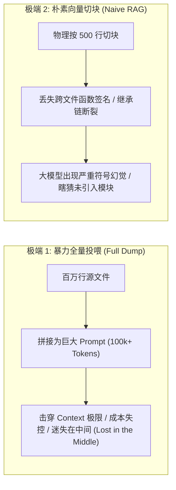
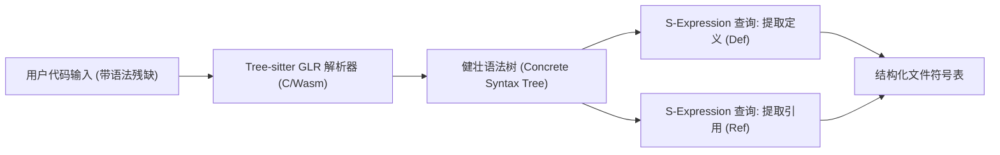
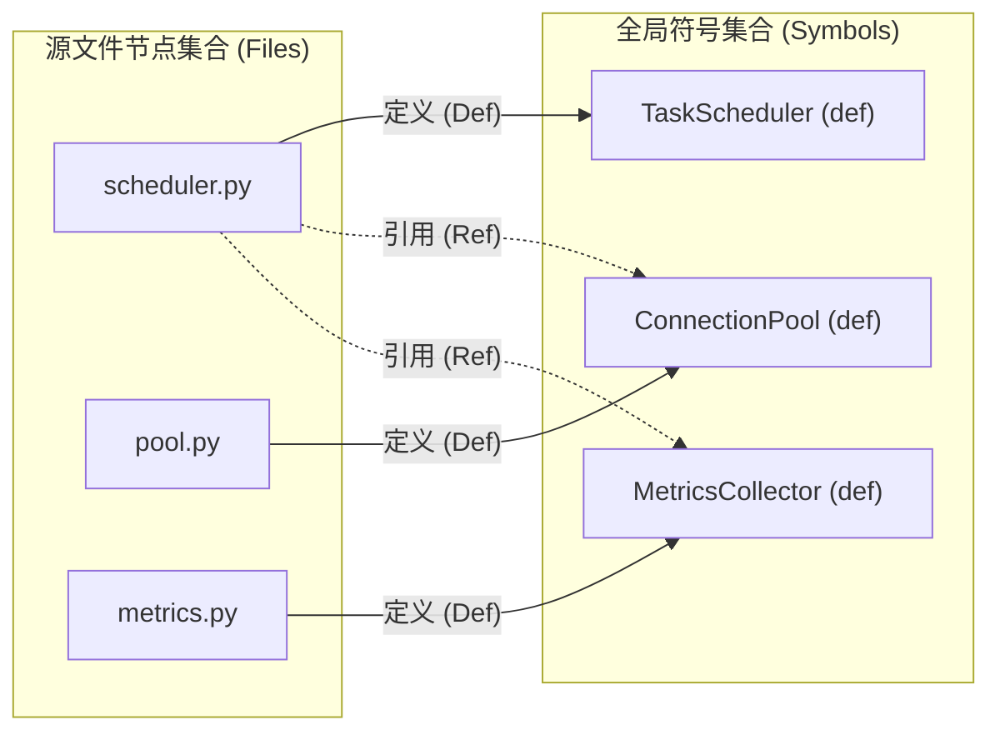
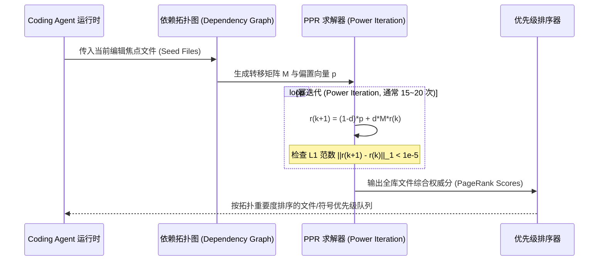
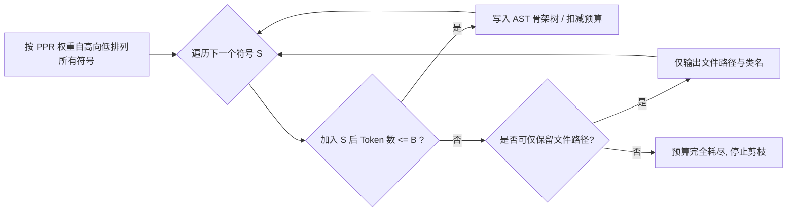

**TL;DR：** 在构建生产级 Coding Agent（如 Aider、Cline、Roo Code、OpenHands）的工程实践中，最核心的第一道物理瓶颈并非模型的推理能力，而是**如何在极其有限的上下文窗口（如 8k~32k Token）内，向模型完整投喂整个中大型代码库（数万至数百万行代码）的全局架构与依赖拓扑**。盲目投喂完整源文件会迅速击穿上下文窗口并诱发严重的“迷失在中间”（Lost in the Middle）现象；而传统的朴素 RAG（按行切块 + 向量召回）则会彻底切碎代码的跨文件符号定义与调用层级。本文以第一性原理深度剖析工业界最高效的解决方案——**基于 Tree-sitter 增量语法树与 Personalized PageRank 的 Repo Map（仓库符号图谱）压缩引擎**：通过 Tree-sitter 毫秒级增量 AST 提取顶层定义与引用，构建文件-符号二部有向图；利用带偏置的 PageRank 幂迭代算法筛选核心架构枢纽（Hub & Authority）；最终结合贪心 Token 预算执行语法树骨架剪枝，实现用区区 2k~4k Token 精准勾勒百万行代码库的全局上下文。

---

## 一、 上下文黑洞：为什么“代码库全局感知”不能靠全量投喂或朴素 RAG？

当人类资深架构师接手一个包含数百个源文件、几十万行代码的未知工程时，绝不会从第一行开始逐字逐行阅读，而是先翻阅目录结构、核心接口声明、基类定义与高频依赖枢纽，在脑海中建立一张**分层的符号拓扑地图**。

但在早期 AI 编程助手的设计中，研发团队通常走向了两个极端，并双双遭遇毁灭性的工程惨败：



### 1. 暴力全量投喂（Full Dump）的三重物理死线

1. **显存与 TTFT（首 Token 延迟）恶化**：即使现代长上下文模型（如 Gemini 1.5 Pro、Claude 3.5 Sonnet）支持 200k 乃至 1M 上下文，其 Prefill 阶段的计算量随 Token 数量呈现二次方或高线性膨胀。处理 100k Token 的前缀可能耗时数秒到十几秒，Coding Agent 每一次单步工具调用（Tool Call）都需要重走该 Prefill 流程，交互体验彻底卡死。
2. **“迷失在中间”（Lost in the Middle）困境**：学术界（Liu et al., 2023）与工程实测均证明，当关键信息埋藏在十几万 Token 的中间部分时，Transformer 的注意力机制会出现显著的召回率塌陷。大模型无法在海量具体业务逻辑代码的噪音中，辨别核心系统入口。
3. **FinOps 成本炸裂**：即使模型服务商提供了 Prompt Caching 优惠，一次多轮复杂调试任务可能触发 30~50 轮 Agent Loop，全量投喂将直接导致单次 Bug 修复的账单飙升至数十美元。

### 2. 朴素 RAG 为什么在代码工程上彻底失效？

朴素 RAG 是面向非结构化自然语言设计的（如维基百科、客服文档）。当强行用固定窗口（如 500 Tokens、重叠 50 Tokens）切割代码时，必然破坏代码严苛的语法树作用域：
- 类的成员方法被腰斩，方法签名与类属性上下文分离；
- 调用方位于 `router.go`，被调用方位于 `service.go`，跨文件符号链接彻底断裂；
- 向量相似度只能匹配“语义近似文本”，根本无法理解面向对象的多态、泛型约束以及编译器符号表解析。

**Coding Agent 迫切需要一种专为代码结构设计的紧凑表示法：在 2k~4k Token 预算内，保留所有模块的关键符号、类型定义与依赖关系，剔除所有具体的函数实现细节。这就是现代 Coding Agent 的基石——Repo Map。**

---

## 二、 破局第一步：Tree-sitter 增量语法树解析与符号提取

要在几十毫秒内完成整个代码库的符号提取，传统的正则表达式（Regex）早已力不从心（无法区分代码注释、字符串字面量与真实变量名），而完整的语言编译器（如 `javac`、`clang`、`tsc`）又过于笨重且无法容忍未编译通过的语法残缺代码。

### 1. Tree-sitter 的开山哲学：为编辑器而生的增量解析器

2018 年，Max Brunsfeld 领导 GitHub Atom 团队开源了 **Tree-sitter**。Tree-sitter 采用纯 C 语言编写（并可交叉编译为 WebAssembly），基于 GLR（Generalized LR）算法，专为现代代码编辑器与 IDE 提供毫秒级的 AST（抽象语法树）生成能力。

Tree-sitter 相比传统编译器前端具备三大核心杀手锏：

| 维度 | 传统语言编译器前端（gcc/javac/tsc） | Tree-sitter 增量语法树引擎 |
| :--- | :--- | :--- |
| **容错能力（Error Tolerance）** | 遇到语法错误立即中断并报 Panic，无法生成可用 AST | **极强容错**：遇到未闭合括号或残缺代码自动插入 `ERROR` 节点，其余 AST 子树完好保留 |
| **解析速度与生命周期** | 全量从头词法分析与语法分析，耗时数百毫秒至数秒 | **C 语言底层极致优化**：单文件解析通常 `< 2ms` |
| **增量解析（Incremental Parsing）** | 文件发生单个字符修改后，通常需要全量重新编译 | **局部节点重用**：通过编辑差分偏移量仅重新解析受影响的叶子节点，耗时 `< 0.1ms` |
| **多语言生态** | 每种语言独立的 AST 数据结构与工具链 | **统一的 S-expression 与通用 C API 遍历接口**，覆盖 100+ 主流编程语言 |



### 2. 编写精确的 Tree-sitter S-expression 查询提取符号

通过 Tree-sitter 强大的 Pattern Matching DSL（S-expression 模式匹配查询），Coding Agent 可以用极其简洁的代码，提取任意语言中的**符号定义（Definitions）**与**符号引用（References）**。

例如，针对 Go 语言和 Python 语言的顶层结构体、函数与接口定义，Tree-sitter 查询模式如下：

```scheme
; Go 语言符号定义查询 (scm)
(type_spec
  name: (type_identifier) @name.definition.class
  type: [
    (struct_type)
    (interface_type)
  ]
) @definition.class

(function_declaration
  name: (identifier) @name.definition.function
  parameters: (parameter_list) @parameters
  result: (_)? @return_type
) @definition.function

(method_declaration
  receiver: (parameter_list) @receiver
  name: (field_identifier) @name.definition.method
  parameters: (parameter_list) @parameters
) @definition.method
```

提取后的符号结构包含：
- **符号名称**：如 `TaskManager`、`DispatchTask`；
- **符号类型**：Class、Interface、Function、Method；
- **作用域与签名**：参数列表与返回值类型（丢弃方法体内部具体语句）；
- **行号区间与行缩进**：供后续骨架折叠使用。

---

## 三、 依赖拓扑：从文件集合到双向符号有向图

提取出代码库中每个文件的**定义集合（Defs）**与**引用集合（Refs）**后，下一步是建立整个代码库的依赖网络。

假设代码库中有两个文件：
1. `pkg/engine/scheduler.py`：定义了 `TaskScheduler` 类，其内部代码引用了 `ConnectionPool` 和 `MetricsCollector`；
2. `pkg/net/pool.py`：定义了 `ConnectionPool` 类。

显然，`scheduler.py` 依赖 `pool.py`。但在超大规模代码库中，这种交叉依赖构成了庞大错综的网状拓扑：



我们形式化地将代码库抽象为一个**加权有向图** $G = (V, E)$：
- **顶点集 $V$**：包含代码库中的所有源文件 $\{f_1, f_2, \dots, f_N\}$；
- **有向边集 $E$**：如果文件 $f_i$ 内部引用了在文件 $f_j$ 中定义的符号 $S$，则存在一条从 $f_i$ 指向 $f_j$ 的有向边 $(f_i \to f_j)$，其边权重 $w_{ij}$ 取决于引用的频次以及符号的独特性。

### 符号消歧与冷门引用加权

在真实代码库中，经常出现多个文件定义同名符号的情况（例如不同模块各自定义了 `Config` 或 `Handler`）。如果不对符号进行消歧与加权，通用的无意义符号（如 `id`、`name`、`err`）会引入海量无意义的交叉边。

Repo Map 引入了类似逆文档频率（IDF）的加权惩罚机制：
$$\text{Weight}(S) = \frac{1}{\sqrt{|\text{Defs}(S)|}}$$
如果符号 $S$ 在全库只被唯一定义过一次（例如 `PaxosLeaderElector`），则它的引用具有极高的因果置信度；如果 $S$ 在 100 个文件里都被定义过（如 `init`），其权重将被大幅衰减。

---

## 四、 权重分发：Personalized PageRank 算法的数学推导与收敛

当有向图构建完成后，如何量化“哪些文件和符号是系统的核心架构枢纽”？

### 1. 为什么是 PageRank？

在搜索引擎诞生前，学术文献网络通过“被引用次数”评估论文重要性；1998 年 Larry Page 与 Sergey Brin 将其发展为 **PageRank**：**一个被许多高权重节点指向的节点，自身也拥有极高的权重**。

在代码架构中，这一定律完美成立：
- 底层的核心基础抽象（如 `Context`、`Client`、`BaseModel`、`DBPool`）会被几乎所有业务模块层层引用；
- 边缘的单次调用脚本或特定工具函数，处于调用链叶子节点，重要性极低。

### 2. 数学形式化与带偏置的个性化 PageRank（PPR）

标准 PageRank 假设全网随机游走。但在 Coding Agent 的交互场景下，用户往往是在**特定的上下文环境下**发起提问的（例如用户正打开并要求修改 `pkg/auth/jwt.go`）。

因此，必须采用**个性化 PageRank（Personalized PageRank, PPR）**：让随机游走过程更大概率跳转回**焦点文件集合（Seed Files / Current Files）**，从而计算出**相对于当前上下文最关键的关联依赖**。

PPR 状态转移方程如下：

$$\mathbf{r}^{(k+1)} = (1 - d) \mathbf{p} + d \mathbf{M} \mathbf{r}^{(k)}$$

其中各符号严格定义如下：
- $\mathbf{r} \in \mathbb{R}^N$：全库所有文件的权重分布向量，且满足 $\sum_{i=1}^N r_i = 1$；
- $d \in (0, 1)$：阻尼系数（Damping Factor），工程上通常取 $d = 0.85$；
- $\mathbf{p} \in \mathbb{R}^N$：**个性化偏置向量（Personalization Vector）**。若用户当前正编辑文件 $f_{focus}$，则 $\mathbf{p}$ 在该文件分量上赋予极高权重（如 0.8），其余平摊；若无焦点文件，则退化为均匀分布 $\mathbf{p} = [\frac{1}{N}, \dots, \frac{1}{N}]^T$；
- $\mathbf{M} \in \mathbb{R}^{N \times N}$：随机游走转移概率矩阵，其中 $M_{ji} = \frac{w_{ij}}{\sum_{k} w_{ik}}$（从节点 $i$ 转移至节点 $j$ 的归一化概率）。



### 3. 幂迭代算法的工程收敛性

由于转移矩阵 $\mathbf{M}$ 是列随机矩阵（Column-stochastic matrix），且阻尼项保证了图的强连通性（消除悬挂节点与陷阱环路），根据佩隆-弗罗贝尼乌斯定理（Perron-Frobenius Theorem），幂迭代序列必定以几何级数收敛到唯一平稳分布。

在包含 5000 个源文件的典型中型工程中，稀疏矩阵乘法运算在 15 次迭代内即可达到 $10^{-6}$ 的收敛精度，纯 CPU 计算仅需 **10~25ms**。

---

## 五、 骨架生成与贪心 Token 预算压缩引擎

计算出每个文件和符号的 PageRank 权重之后，最后一道关键工序是：**如何将这些符号在预设的 Token 预算（如 2048 或 4096 Tokens）内，排版为对大模型最友好的伪代码骨架（Code Skeleton）？**

### 1. 保持行缩进的代码骨架折叠算法

大模型是极度敏感于代码缩进的序列生成器。如果直接将符号提取为扁平的清单列表（如 `pkg/a.go: func Foo()`），大模型将丧失对类继承体系与嵌套作用域的空间直觉。

业界最优雅的做法是**保留原始代码的树状缩进骨架，仅将函数体与私有实现替换为省略占位符**：

```python
# 原始源代码 (150 行)
class DatabaseCluster:
    def __init__(self, dsn: str, max_conns: int = 100):
        # 详细的连接初始化逻辑
        self.dsn = dsn
        self.pool = create_pool(...)
        self.metrics = init_metrics(...)

    def execute_query(self, sql: str, timeout: float = 5.0) -> QueryResult:
        # 数十行复杂的重试、熔断与执行逻辑
        ...

# 压缩后的 Repo Map 骨架 (仅 8 行, 节省 90% Tokens)
class DatabaseCluster:
    def __init__(self, dsn: str, max_conns: int = 100):
        ...

    def execute_query(self, sql: str, timeout: float = 5.0) -> QueryResult:
        ...
```

### 2. 动态贪心装箱策略（Greedy Knapsack Packing）

假设当前给 Repo Map 分配的物理预算为 $B = 3072$ Tokens：



1. **优先级分层**：
   - 第一优先级：焦点文件本身的完整结构体与核心接口；
   - 第二优先级：与焦点文件直接相邻的一度核心符号（Top-K PPR 节点）；
   - 第三优先级：全局 Top PageRank 架构枢纽的签名；
   - 最低优先级：低权重的叶子文件，仅输出文件名本身（如 `pkg/utils/uuid.go`），不展开任何符号。
2. **Token 精确预估**：
   利用轻量级词表编解码器（如 `tiktoken` 或 `tokenizers`）在内存中动态维护累计 Token 数，确保输出绝对不超过预设上限。

---

## 六、 完整工业级 TypeScript 核心实现

以下给出了符合生产级规范的 `RepoMapBuilder` 核心架构实现，展示了从符号图构建、PageRank 幂迭代到骨架 Token 剪枝的完整闭环：

```typescript
import { Parser, Tree, Query } from "web-tree-sitter";

export interface SymbolDefinition {
  name: string;
  kind: "class" | "function" | "interface" | "method";
  filePath: string;
  startLine: number;
  endLine: number;
  signature: string;
}

export interface FileSymbolMetadata {
  filePath: string;
  definitions: SymbolDefinition[];
  references: Set<string>;
}

export class RepoMapBuilder {
  private parser: Parser;
  private fileMetadataMap: Map<string, FileSymbolMetadata> = new Map();

  constructor(parser: Parser) {
    this.parser = parser;
  }

  /**
   * 1. 提取单文件的定义与引用集合
   */
  public indexFile(filePath: string, sourceCode: string, query: Query): void {
    const tree: Tree = this.parser.parse(sourceCode);
    const matches = query.matches(tree.rootNode);

    const definitions: SymbolDefinition[] = [];
    const references: Set<string> = new Set();

    for (const match of matches) {
      for (const capture of match.captures) {
        const text = capture.node.text;
        if (capture.name.startsWith("definition.")) {
          definitions.push({
            name: text,
            kind: capture.name.split(".")[1] as any,
            filePath,
            startLine: capture.node.startPosition.row,
            endLine: capture.node.endPosition.row,
            signature: capture.node.text.split("\n")[0], // 截取签名首行
          });
        } else if (capture.name.startsWith("reference.")) {
          references.add(text);
        }
      }
    }

    this.fileMetadataMap.set(filePath, { filePath, definitions, references });
  }

  /**
   * 2. 执行 Personalized PageRank 幂迭代
   */
  public computePersonalizedPageRank(
    focusFiles: string[],
    damping: number = 0.85,
    maxIterations: number = 20,
    tolerance: number = 1e-5
  ): Map<string, number> {
    const files = Array.from(this.fileMetadataMap.keys());
    const N = files.length;
    if (N === 0) return new Map();

    const fileIndices = new Map<string, number>(files.map((f, i) => [f, i]));

    // 构建符号到所属定义文件的反向映射表 (用于快速解析引用边)
    const symbolToDefFiles = new Map<string, string[]>();
    for (const [filePath, meta] of this.fileMetadataMap.entries()) {
      for (const def of meta.definitions) {
        if (!symbolToDefFiles.has(def.name)) {
          symbolToDefFiles.set(def.name, []);
        }
        symbolToDefFiles.get(def.name)!.push(filePath);
      }
    }

    // 构建稀疏邻接转移矩阵 (Adjacency Matrix)
    const outDegrees = new Array(N).fill(0);
    const inEdges: Array<Array<{ src: number; weight: number }>> = Array.from(
      { length: N },
      () => []
    );

    for (const [srcFile, meta] of this.fileMetadataMap.entries()) {
      const srcIdx = fileIndices.get(srcFile)!;
      for (const ref of meta.references) {
        const targetFiles = symbolToDefFiles.get(ref);
        if (targetFiles) {
          // 符号独特性加权: 1 / sqrt(|Defs|)
          const weight = 1.0 / Math.sqrt(targetFiles.length);
          for (const targetFile of targetFiles) {
            if (targetFile === srcFile) continue; // 忽略文件内部自环
            const targetIdx = fileIndices.get(targetFile)!;
            inEdges[targetIdx].push({ src: srcIdx, weight });
            outDegrees[srcIdx] += weight;
          }
        }
      }
    }

    // 构建个性化偏置向量 p (带焦点偏置)
    const p = new Array(N).fill(0);
    if (focusFiles.length > 0) {
      const focusWeight = 0.7 / focusFiles.length;
      const otherWeight = 0.3 / N;
      for (let i = 0; i < N; i++) p[i] = otherWeight;
      for (const focusFile of focusFiles) {
        const idx = fileIndices.get(focusFile);
        if (idx !== undefined) p[idx] += focusWeight;
      }
    } else {
      for (let i = 0; i < N; i++) p[i] = 1.0 / N;
    }

    // 初始平稳向量
    let r = [...p];

    // 幂迭代循环
    for (let iter = 0; iter < maxIterations; iter++) {
      const nextR = new Array(N).fill(0);
      let danglingSum = 0;

      for (let i = 0; i < N; i++) {
        if (outDegrees[i] === 0) {
          danglingSum += r[i];
        }
      }

      for (let j = 0; j < N; j++) {
        let incomingShare = 0;
        for (const edge of inEdges[j]) {
          incomingShare += (r[edge.src] * edge.weight) / outDegrees[edge.src];
        }
        // 核心 PPR 转移公式
        nextR[j] =
          (1 - damping) * p[j] +
          damping * (incomingShare + (danglingSum * p[j]));
      }

      // 计算 L1 范数差
      let delta = 0;
      for (let i = 0; i < N; i++) delta += Math.abs(nextR[i] - r[i]);
      r = nextR;

      if (delta < tolerance) break;
    }

    const resultMap = new Map<string, number>();
    files.forEach((f, i) => resultMap.set(f, r[i]));
    return resultMap;
  }

  /**
   * 3. 贪心装箱生成符合 Token 预算的 Repo Map Markdown
   */
  public generateRepoMap(
    scores: Map<string, number>,
    tokenBudget: number
  ): string {
    // 按权重降序排序所有文件
    const sortedFiles = Array.from(scores.entries())
      .sort((a, b) => b[1] - a[1])
      .map(([file]) => file);

    const outputLines: string[] = [];
    let estimatedTokens = 0;

    for (const filePath of sortedFiles) {
      const meta = this.fileMetadataMap.get(filePath);
      if (!meta || meta.definitions.length === 0) continue;

      const fileHeader = `\n### ${filePath}\n`;
      const fileTokens = Math.ceil(fileHeader.length / 4);

      if (estimatedTokens + fileTokens > tokenBudget) break;
      outputLines.push(fileHeader);
      estimatedTokens += fileTokens;

      for (const def of meta.definitions) {
        const symbolLine = `  ${def.signature}\n`;
        const symTokens = Math.ceil(symbolLine.length / 4);

        if (estimatedTokens + symTokens > tokenBudget) {
          outputLines.push("  // ... 其余符号因 Token 预算超限省略\n");
          return outputLines.join("");
        }

        outputLines.push(symbolLine);
        estimatedTokens += symTokens;
      }
    }

    return outputLines.join("");
  }
}
```

---

## 七、 生产级边界防线与架构权衡（Trade-offs）

虽然 Tree-sitter + PPR Repo Map 在 Aider、Roo Code 等工具中取得了亮眼的成效，但在企业级超大规模 Monorepo 落地中，依然存在必须直面的边界缺陷与防御策略：

### 1. 动态弱类型语言（Python/JavaScript）的“影子依赖”穿透陷阱

在静态强类型语言（如 Go、Rust、Java）中，符号绑定关系是严谨且唯一的；但在 Python、JavaScript 等动态语言中，动态导入（`importlib.import_module`）、运行时属性反射（`getattr(obj, name)`）以及无类型注解的鸭子类型参数会导致 AST 无法提取静态 `reference` 边。

**防御方案：**
- 引入**运行时导入跟踪**与**轻量级类型推断兜底**；
- 当 AST 无法确信符号所属时，结合**文件目录层级拓扑（Directory Proximity）**赋予防御性平滑权重，避免孤岛节点权重归零。

### 2. 万级文件 Monorepo 的图计算爆炸

当仓库规模膨胀到 50,000+ 个源文件时，全库双向图的边数量可能突破上百万条，频繁在本地进行全库解析将严重拖慢 IDE 响应速度。

**防御方案：**
- **Git Hash 增量子树缓存**：利用 Git 的 Tree Hash 机制，仅当文件的 SHA-1 发生变化时才调用 Tree-sitter 重新解析该文件，未改动文件的符号元数据直接命中内存缓存；
- **强连通子图分区（Subgraph Partitioning）**：按照顶级模块/目录边界将图切割为局部子图，仅在子图内部及子图边界导出点之间运行 PPR。

---

## 八、 总结与因果主线全景图

回顾整个 Coding Agent 仓库图谱压缩机制，其核心是一条高度自洽的第一性原理因果链：


1. **破局点在于放弃全文投喂**：承认 Token 窗口的稀缺性与注意力衰减定理，将问题转化为“代码架构骨架抽取与权重排序”；
2. **底层底座依靠 Tree-sitter**：利用其纯 C 性能、增量解析能力与绝佳的语法容错特性，在毫秒内完成 AST 提取；
3. **因果排序依靠 Personalized PageRank**：通过网络有向图的游走概率收敛，天然提取出系统的核心中枢，并将算力偏置于用户当前的工作目录；
4. **交付物是缩进保留的伪代码骨架**：在严格的 Token 物理红线内，让大模型在最少的认知负荷下，获得对整个软件工程全貌的透视。

这正是所有顶尖 Coding Agent 能够精准穿透未知大型代码库、瞬间定位 Bug 源头的首要秘密武器。
