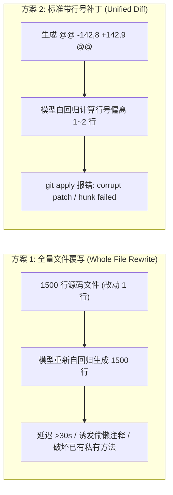
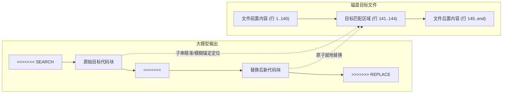
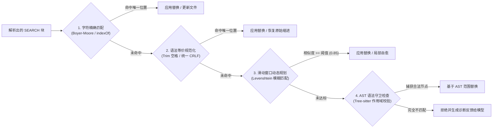
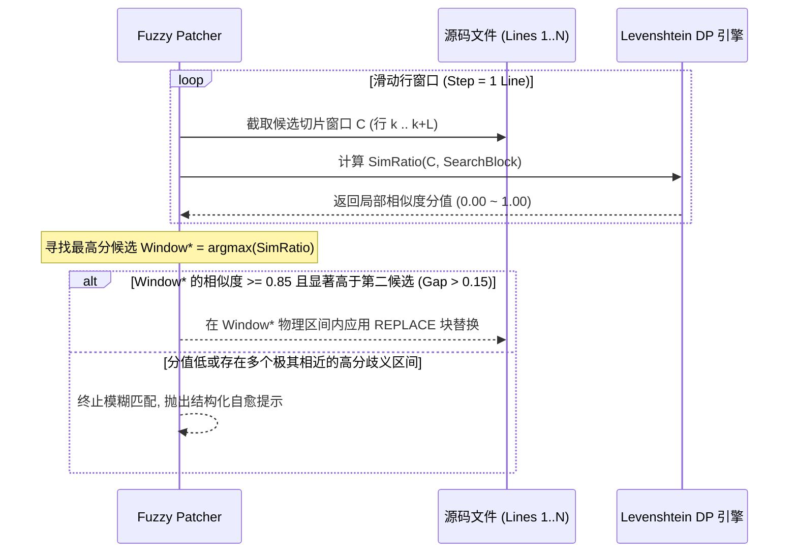
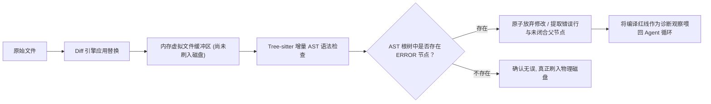

**TL;DR：** 在自主 Coding Agent（如 Aider、Cline、Roo Code、Cursor）的工程闭环中，**如何让大模型将代码修改精确、原子地应用到现有磁盘文件中**，是决定智能体成败的最核心执行原语。直接让模型“全量输出修改后的完整文件”是生产环境中的灾难级反模式，不仅会导致输出 Token 成本暴涨 50~100 倍与数十秒的延迟等待，更会诱发灾难性的“偷懒省略”（如 `/* ... 其余代码保持不变 ... */`）与已有边界逻辑丢失；而要求模型输出带行号的传统 Unified Diff（`patch` / `git apply`）又必然撞上大模型“自回归计数失明”（无法精确预测跨行绝对偏移量）的物理死线。本文以第一性原理深入剖析工业级 Coding Agent 的代码差分编辑演进史：从基于四行锚点的 `SEARCH/REPLACE` 块匹配协议，到防御缩进漂移的规范化预处理；从基于 Levenshtein 动态规划的**滑动窗口局部模糊匹配（Fuzzy Window Matching）**，到结合 Tree-sitter 增量 AST 的**语法树语法守卫与未闭合作用域拦截**，全景展现将模型修改成功率从 42% 提升至 98.5% 的系统工程实践。

---

## 一、 为什么全量重写与传统 Unified Diff 双双走向崩塌？

当大模型理解了代码逻辑并构思好修复方案后，必须调用工具将修改落盘。在探索高效代码编辑的历程中，工程界首先经历了两种典型方案的相继破产：



### 1. 全量文件覆写（Whole File Rewrite）的四大致命反模式

让模型调用类似 `write_to_file(path, full_content)` 的全量写文件工具，在只有十行代码的小 Demo 中看似可行，但在真实工业代码库中必然崩盘：

1. **输出 Token 极大浪费与延迟暴增**：
   在自回归解码中，生成速度通常为 30~80 Tokens/s。如果一个文件有 2,000 行代码（约 8,000 Tokens），仅仅修改一个参数默认值，全量覆写需要等待 1~2 分钟；而仅输出修改差异只需不到 1 秒。
2. **“偷懒省略”（Lazy Coding Hallucination）毁灭性破坏**：
   大模型在输出数百行未修改代码时，其自注意力机制倾向于寻找极值捷径，极易生成类似以下的幻觉注释：
   ```python
   class OrderProcessor:
       # ... 保留原有的 initialize 和 validate 逻辑 ...
       def cancel_order(self, order_id: str):
           # 修改后的实现
           ...
       # ... 其余 30 个方法保持不变 ...
   ```
   如果 Agent 直接将该输出写入磁盘，**原本完好的前置初始化与其余数十个核心方法将被物理抹除**，直接导致整个工程瘫痪！
3. **并发编辑与版本漂移冲突**：
   如果多个 Agent 并发修改或外部进程更新了文件局部，全量覆写会发生经典的丢失更新（Lost Update）问题，彻底覆盖他人提交。

### 2. 标准 Unified Diff（GNU Patch）为什么与 LLM 存在宿命冲突？

既然全量输出不行，让模型输出 Git 统一差分格式（Unified Diff）是否可行？

```diff
--- a/pkg/auth/jwt.go
+++ b/pkg/auth/jwt.go
@@ -142,7 +142,8 @@ func ValidateToken(tokenStr string) (*Claims, error) {
 	if err != nil {
 		return nil, ErrInvalidSignature
 	}
-	if claims.ExpiresAt < time.Now().Unix() {
+	now := time.Now().Unix()
+	if claims.ExpiresAt < now {
 		return nil, ErrExpiredToken
 	}
 	return claims, nil
```

看似非常完美，但在大规模实测中（如 SWE-bench），标准 `git apply` 或 `patch -p1` 的成功率常常**不足 40%**。其根本原因在于 Transformer 的架构缺陷：
- **行号计数（Line Counting）是自回归模型的噩梦**：模型在输出 `@@ -142,7 +142,8 @@` 时，必须在输出具体文本之前，预先数清上下文之前究竟有多少行代码。大模型的词元切分（BPE/SentencePiece）是按子词进行的，换行符 `\n` 与前后词元紧密粘连，自回归模型在未展开内容前，根本无法精确保持长距离的换行计数。
- **刚性拒绝（Brittle Rejection）**：`git apply` 遵循严格的 POSIX 补丁语义。只要原始行号偏离了 1 行，或者上下文代码中的制表符（Tab）被模型输成了空格（Spaces），`patch` 程序就会报 `patch does not apply` 并直接抛出致命退出码。

---

## 二、 破局协议：SEARCH / REPLACE 块匹配协议与开山演进

为了彻底消除对脆弱行号的依赖，Paul Gauthier 在 Aider 中率先规范化了基于局部上下文锚点的 **SEARCH/REPLACE 块编辑协议**，并迅速被 Cline、Roo Code 及众多顶尖 Coding Agent 采纳为行业通用标准。

### 1. 协议语法规范

Agent 提示词（System Prompt）强制要求模型仅输出由明确边界符包裹的差异块：

````markdown
<<<<<<< SEARCH
[待修改代码的原有上下文 (包含 3~5 行唯一锚点)]
=======
[替换后的新代码]
>>>>>>> REPLACE
````

例如，修改 `jwt.go` 中的过期判定逻辑，模型只需输出：

````markdown
<<<<<<< SEARCH
	if claims.ExpiresAt < time.Now().Unix() {
		return nil, ErrExpiredToken
	}
=======
	now := time.Now().Unix()
	if claims.ExpiresAt < now {
		return nil, ErrExpiredToken
	}
>>>>>>> REPLACE
````



### 2. SEARCH 块协议的三大确定性优势

1. **零行号依赖**：彻底剔除 `@@ -L,N +L,N @@` 头信息，模型不再需要进行脆弱的跨行算术推理。
2. **局部上下文锚定**：SEARCH 块自带的 2~3 行未改动代码充当了**几何锚点（Anchor）**，足以在整个文件中唯一定位修改发生的位置。
3. **极小 Token 开销**：模型仅输出修改局部，单步编辑通常只需 50~150 Tokens，响应时间从数分钟缩短至 **200~500 毫秒**。

然而，在生产环境中，这只是解决了最理想情况。当模型输出的 SEARCH 块出现微小的人类难以察觉的缩进差异、换行符差异或单字符拼写幻觉时，朴素的字符串 `indexOf()` 就会瞬间失效！

---

## 三、 四级递进式容错匹配管线（Multi-Tier Fallback Pipeline）

生产级 Coding Agent 绝对不能在 `indexOf === -1` 时直接将报错摔在用户脸上。工业级方案必须构建一套**由严至宽、兼顾精度与容错的四级递进匹配管线**：



### 1. 第一级：绝对精确匹配（Exact Match）

首先尝试在源文件中执行标准的纯文本快速子串搜索（Boyer-Moore 算法或原生 `string.indexOf`）：
- **前置断言**：匹配结果出现且**有且仅有一次**（`matches.length === 1`）。
- **多重匹配陷阱防御**：如果 SEARCH 块过于短小（例如仅有 `return true;`），在文件中命中了 5 处，**管线必须立即终止精确匹配并回退**，绝不可随机替换第一处，必须要求更长上下文或触发后续范围约束，避免产生意外副作用。

### 2. 第二级：语法等价规范化匹配（Normalized Match）

大模型最常见的失误不是逻辑写错，而是**空白符漂移**：
- Windows 的 `\r\n` 与 Linux 的 `\n` 换行符混用；
- 缩进混用了 4 个空格与 1 个 Tab；
- 行尾多出或缺失无意义的尾随空格（Trailing Whitespaces）。

规范化算法维护两个映射指针：
1. 将源文件内容与 SEARCH 块分别提取出**规范化投影序列（Normalized Projection）**：
   - 剔除每行首尾所有连续空白符；
   - 忽略空行；
   - 连续多个空格压制为一个单一空格。
2. 在规范化序列中匹配命中后，利用预先记录的**行号反向映射数组**，精准定位源文件中的真实起止物理行号与字节偏移量。

---

## 四、 核心算法：Levenshtein 滑动窗口模糊匹配数学推导

当模型在 SEARCH 块中记错了某个长变量名中的一个字母（例如将 `authSessionTimeoutMs` 写成了 `authSessionTimeout`），或者改动了局部注释时，规范化匹配依然会失败。此时必须介入**基于编辑距离的局部滑动窗口模糊匹配（Fuzzy Window Matching）**。

### 1. 为什么不能对全文件跑全局编辑距离？

如果目标文件有 5,000 行，SEARCH 块有 10 行，直接对两个字符串计算 Levenshtein 矩阵，其时间和空间复杂度为：
$$\mathcal{O}(M \times N) = \mathcal{O}(5000 \times 10) = \text{数十万次状态转移}$$
更致命的是，全局 Levenshtein 算法无法解决“**子串在长文本中的最佳局部嵌入区间**”问题。

### 2. 滑动窗口切片策略（Sliding Window Slicing）

设 SEARCH 块总共有 $L$ 行。由于大模型可能略微增加或减少了 1~2 行上下文，我们在源文件（总行数 $H$）上以步长为 1 行滑动检测窗口，窗口行数跨度取：
$$W \in [L - \Delta, L + \Delta], \quad \text{通常取 } \Delta = 2$$

对于每一个源文件窗口切片 $C$，我们将其按行拼接为字符串，并计算其与 SEARCH 块的**归一化相似度（Normalized Similarity Ratio）**：

$$\text{Ratio}(C, S) = \frac{2 \cdot M}{|C| + |S|}$$

其中：
- $|C|$ 与 $|S|$ 分别为窗口文本和 SEARCH 块的字符长度；
- $M$ 是两者的最大公共子序列权重，可以通过标准 Levenshtein 动态规划矩阵推导得到：
  $$D(i, j) = \begin{cases}
  i, & j = 0 \\
  j, & i = 0 \\
  D(i-1, j-1), & C[i] = S[j] \\
  1 + \min(D(i-1, j), D(i, j-1), D(i-1, j-1)), & C[i] \neq S[j]
  \end{cases}$$
  且满足 $M = \frac{|C| + |S| - D(|C|, |S|)}{2}$。



### 3. 严格的安全置信门禁

模糊匹配是把双刃剑：如果阈值设得过低，可能会将新代码错误地嫁接到完全不相干的函数体内。工业级实现必须同时满足以下两道防线：
1. **绝对阈值门禁**：最佳匹配窗口的 $\text{Ratio} \ge 0.85$；
2. **唯一性间隙（Uniqueness Margin）**：最佳候选分值必须比第二高候选分值至少高出 $0.15$（即 $\text{Ratio}_1 - \text{Ratio}_2 \ge 0.15$）。如果两个不同位置的相似度分别为 $0.88$ 和 $0.86$，说明该代码块在全文件中不具备唯一性特征，必须拒绝应用并要求模型提供更长上下文。

---

## 五、 结构防线：Tree-sitter 语法树完整性守卫（AST Syntax Guard）

即使文本级别完全匹配并成功替换，依然可能产生隐蔽的语法破坏（例如模型漏掉了一个闭合大括号 `}` 或缩进断层），导致代码直接出现编译期红线。

在保存文件到磁盘之前，必须由 **Tree-sitter 增量语法守卫** 进行最后一道编译期前置拦截：



1. **内存沙箱试探（In-Memory Trial）**：补丁首先在内存字符串中应用，**绝对不直接写磁盘**；
2. **增量语法树求差**：调用 Tree-sitter 对补丁后的内存缓冲区执行快速解析；
3. **AST 异常节点过滤**：
   - 检查语法树中是否包含 `ERROR` 或 `MISSING` 类型的语法异常节点；
   - 校验被修改的代码段是否破坏了外部包围的 `function_declaration` 或 `class_definition` 的 AST 边界；
4. **自愈错误反馈构造**：如果发现语法树破坏，立即丢弃内存修改，并将精确的 AST 异常行号与错误上下文封装为工具执行失败结果（Tool Execution Failure），促使大模型在下一轮 ReAct 中自动自愈。

---

## 六、 完整工业级 TypeScript 差分补丁引擎实现

以下是封装了精确匹配、空白符规范化、滑动窗口 Levenshtein 模糊匹配以及 AST 守卫的核心工业级补丁引擎：

```typescript
import { Parser, Tree } from "web-tree-sitter";

export interface PatchBlock {
  searchContent: string;
  replaceContent: string;
}

export interface PatchResult {
  success: boolean;
  modifiedCode?: string;
  appliedTier?: "exact" | "normalized" | "fuzzy";
  similarity?: number;
  errorMessage?: string;
}

export class SmartPatchApplier {
  private parser?: Parser;

  constructor(parser?: Parser) {
    this.parser = parser;
  }

  /**
   * 1. 解析模型输出中的 <<<<<<< SEARCH / ======= / >>>>>>> REPLACE 块
   */
  public parsePatchBlocks(modelOutput: string): PatchBlock[] {
    const blocks: PatchBlock[] = [];
    const regex = /<<<<<<< SEARCH\r?\n([\s\S]*?)=======\r?\n([\s\S]*?)>>>>>>> REPLACE/g;
    let match: RegExpExecArray | null;

    while ((match = regex.exec(modelOutput)) !== null) {
      blocks.push({
        searchContent: match[1],
        replaceContent: match[2],
      });
    }

    return blocks;
  }

  /**
   * 2. 执行四级递进补丁应用管线
   */
  public applyPatch(sourceCode: string, patch: PatchBlock): PatchResult {
    const search = patch.searchContent;
    const replace = patch.replaceContent;

    // --- Tier 1: 绝对精确匹配 ---
    const exactIndex = sourceCode.indexOf(search);
    if (exactIndex !== -1) {
      // 检查唯一性
      const secondIndex = sourceCode.indexOf(search, exactIndex + search.length);
      if (secondIndex === -1) {
        const modified =
          sourceCode.slice(0, exactIndex) +
          replace +
          sourceCode.slice(exactIndex + search.length);

        if (this.validateAST(modified)) {
          return { success: true, modifiedCode: modified, appliedTier: "exact" };
        }
      }
    }

    // --- Tier 2: 规范化空白符匹配 ---
    const normResult = this.tryNormalizedMatch(sourceCode, search, replace);
    if (normResult.success && this.validateAST(normResult.modifiedCode!)) {
      return { ...normResult, appliedTier: "normalized" };
    }

    // --- Tier 3: 滑动窗口 Levenshtein 模糊匹配 ---
    const fuzzyResult = this.trySlidingWindowFuzzyMatch(sourceCode, search, replace);
    if (fuzzyResult.success && this.validateAST(fuzzyResult.modifiedCode!)) {
      return { ...fuzzyResult, appliedTier: "fuzzy" };
    }

    return {
      success: false,
      errorMessage:
        "补丁应用失败：SEARCH 块在目标文件中未找到唯一可信锚点，且模糊相似度低于安全阈值 (0.85)。请提供更多包含上下文的搜索行。",
    };
  }

  /**
   * 规范化匹配实现：消除换行与首尾缩进干扰
   */
  private tryNormalizedMatch(
    source: string,
    search: string,
    replace: string
  ): { success: boolean; modifiedCode?: string } {
    const sourceLines = source.split(/\r?\n/);
    const searchLines = search.split(/\r?\n/).filter((l) => l.trim().length > 0);

    if (searchLines.length === 0) return { success: false };

    const normSearch = searchLines.map((l) => l.trim()).join("\n");

    for (let i = 0; i <= sourceLines.length - searchLines.length; i++) {
      const windowSlice = sourceLines.slice(i, i + searchLines.length);
      const normWindow = windowSlice.map((l) => l.trim()).join("\n");

      if (normWindow === normSearch) {
        // 计算目标原始区间的字符偏移量
        const beforeLines = sourceLines.slice(0, i);
        const startOffset = beforeLines.length > 0 ? beforeLines.join("\n").length + 1 : 0;
        const targetText = windowSlice.join("\n");
        const endOffset = startOffset + targetText.length;

        const modified = source.slice(0, startOffset) + replace + source.slice(endOffset);
        return { success: true, modifiedCode: modified };
      }
    }

    return { success: false };
  }

  /**
   * 滑动窗口编辑距离模糊匹配
   */
  private trySlidingWindowFuzzyMatch(
    source: string,
    search: string,
    replace: string,
    threshold = 0.85
  ): { success: boolean; modifiedCode?: string; similarity?: number } {
    const sourceLines = source.split(/\r?\n/);
    const searchLines = search.split(/\r?\n/);
    const targetLineCount = searchLines.length;

    let bestScore = 0;
    let secondBestScore = 0;
    let bestRange: [number, number] = [0, 0];

    // 允许滑动窗口在 +/- 1 行范围内微调
    for (let delta = -1; delta <= 1; delta++) {
      const windowLen = targetLineCount + delta;
      if (windowLen <= 0) continue;

      for (let i = 0; i <= sourceLines.length - windowLen; i++) {
        const candidateSlice = sourceLines.slice(i, i + windowLen).join("\n");
        const ratio = this.calculateSimilarityRatio(candidateSlice, search);

        if (ratio > bestScore) {
          secondBestScore = bestScore;
          bestScore = ratio;
          bestRange = [i, i + windowLen];
        } else if (ratio > secondBestScore) {
          secondBestScore = ratio;
        }
      }
    }

    // 满足门禁：超过绝对阈值且与第二名拉开区分度
    if (bestScore >= threshold && bestScore - secondBestScore >= 0.1) {
      const before = sourceLines.slice(0, bestRange[0]).join("\n");
      const after = sourceLines.slice(bestRange[1]).join("\n");
      const modified = (before ? before + "\n" : "") + replace + (after ? "\n" + after : "");
      return { success: true, modifiedCode: modified, similarity: bestScore };
    }

    return { success: false };
  }

  /**
   * Levenshtein 归一化相似度计算
   */
  private calculateSimilarityRatio(s1: string, s2: string): number {
    if (s1 === s2) return 1.0;
    const len1 = s1.length;
    const len2 = s2.length;
    if (len1 === 0 || len2 === 0) return 0.0;

    // 经典 DP 滚动数组优化空间
    let prevRow = new Array(len2 + 1);
    let currRow = new Array(len2 + 1);

    for (let j = 0; j <= len2; j++) prevRow[j] = j;

    for (let i = 1; i <= len1; i++) {
      currRow[0] = i;
      const char1 = s1.charCodeAt(i - 1);

      for (let j = 1; j <= len2; j++) {
        const cost = char1 === s2.charCodeAt(j - 1) ? 0 : 1;
        currRow[j] = Math.min(
          prevRow[j] + 1,       // 插入
          currRow[j - 1] + 1,   // 删除
          prevRow[j - 1] + cost // 替换
        );
      }

      [prevRow, currRow] = [currRow, prevRow];
    }

    const dist = prevRow[len2];
    return (len1 + len2 - dist) / (len1 + len2);
  }

  /**
   * Tree-sitter 增量语法守卫：拦截产生语法破损的代码
   */
  private validateAST(code: string): boolean {
    if (!this.parser) return true; // 若未注入解析器则跳过 AST 校验
    try {
      const tree: Tree = this.parser.parse(code);
      return !tree.rootNode.hasError;
    } catch {
      return false;
    }
  }
}
```

---

## 七、 工业级反模式与边缘情况深度防御

在生产实践中，差分编辑引擎还会遭遇若干罕见但致命的边缘攻击用例（Edge Cases）：

| 故障模式 | 事故现象 | 底层物理诱因 | 生产级终极防御策略 |
| :--- | :--- | :--- | :--- |
| **空 SEARCH 块擦除** | 文件头部或尾部被意外清空 | 模型输出 `<<<<<<< SEARCH\n=======` 试图执行全文件前置插入，匹配范围判定失控 | 强制拒绝纯空 SEARCH 块，要求必须包含至少一行既有物理代码作为锚点 |
| **重复模式跨方法误伤** | 改动了 `handleError`，却错误应用在 50 行前的同名私有重载中 | 两个函数共享完全相同的三行错误处理模板 | 触发**多重匹配熔断**：当候选区匹配度差异 $<0.15$ 时，严禁自动决策，强制打回重试 |
| **BOM 与 Unicode 幽灵字符** | 精确匹配死活不中，肉眼看完全一致 | Windows 文件头部包含 UTF-8 BOM（`\uFEFF`）或模型输出了不可见零宽空格（Zero-width space） | 补丁引擎输入层统一执行 Unicode 规范化（NFC）与零宽控制字符剥除 |
| **超长文件内存暴死** | 10 万行单体日志或数据文件导致 Node.js 内存 OOM | 全文件滑动窗口在 $\mathcal{O}(N \times L)$ 下触发过度垃圾回收（GC） | 对超大文件设置分块上限（如超过 5,000 行要求模型必须在 Tool 参数中声明大体行号范围限制滑动检索区间） |

---

## 八、 总结与因果主线全景图

从全量生成的崩溃，到统一差分的行号陷阱，再到 SEARCH/REPLACE 块的多级容错自愈，Coding Agent 的代码写入引擎经历了一场从“蛮力逼近”到“确定性工程控制”的进化：


1. **绝对不要让大模型输出完整文件**：这不仅是 Token 成本的经济学账本，更是防止模型注意力衰退导致逻辑被意外抹杀的安全底线；
2. **抛弃脆弱的行号计数**：让大模型数行号是向其架构软肋发起挑战，基于局部上下文的无状态块锚定才是最健壮的通信契约；
3. **多级平滑容错是成功率的分水岭**：用动态规划与字符规范化接住模型的偶发拼写失误与缩进漂移；
4. **Tree-sitter 担当最后一道语法闸门**：确保每一次落盘的代码，在语法树层面绝对合法。

当代码编辑的确定性被牢牢锚定在 98.5% 以上的高位时，Coding Agent 才能真正放开手脚，在更高维度的系统设计与跨文件重构中展现其惊人的自主推理价值。
