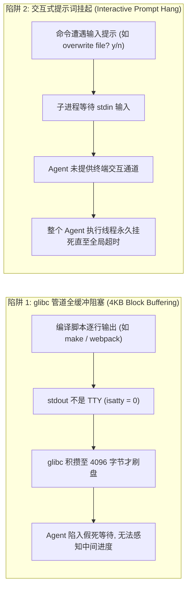
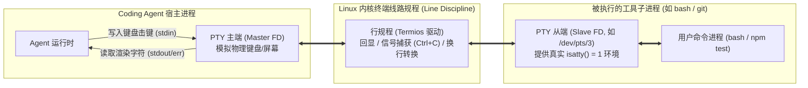
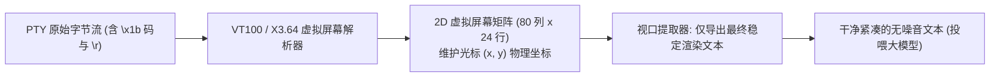
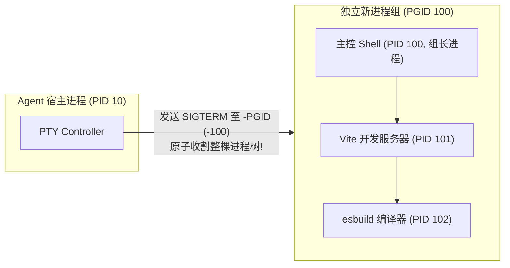
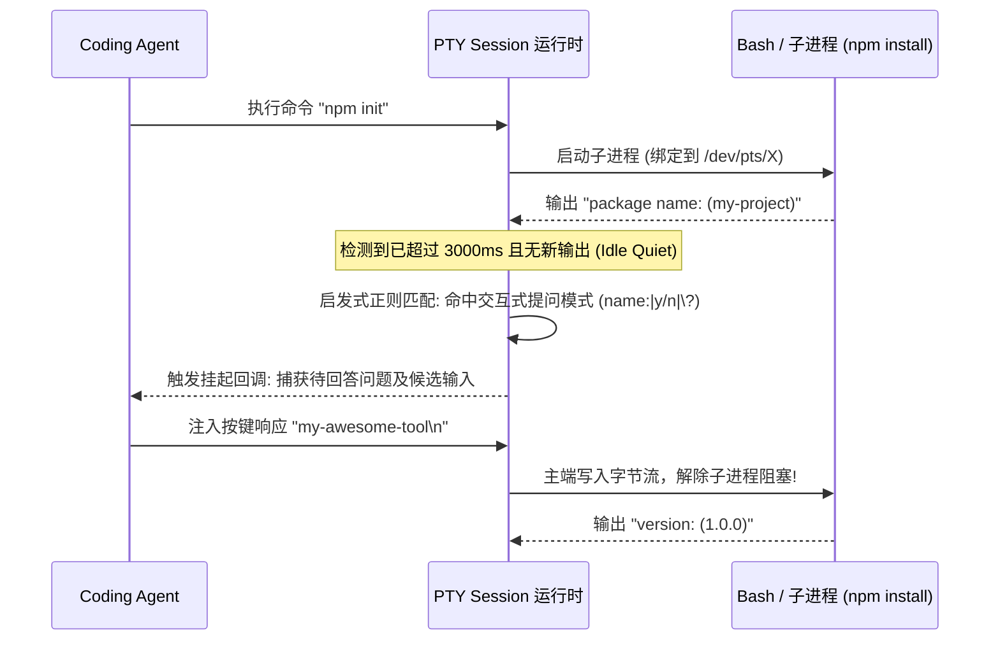
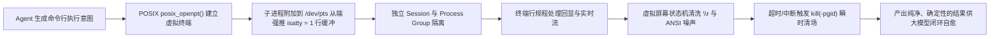

**TL;DR：** 在自主 Coding Agent（如 Cline、Aider、Roo Code、OpenHands）的生产级演进中，**如何让大模型拥有像真实人类工程师一样执行命令、捕获输出并与 Bash 终端交互的能力**，是连接“只看不练的聊天模型”与“能跑通测试、启动开发环境的自主智能体”之间的决定性桥梁。直接调用 `child_process.exec()` 或 `subprocess.run()` 看起来轻巧，但在生产环境中会遭遇三大致命阻碍：glibc 管道全缓冲（4KB Block Buffer）导致的输出延迟卡死、交互式提问（如 `npm init`、`git commit`、`[y/n]` 确认）引发的**永久挂起死锁**，以及 `kill(pid)` 仅杀死包装壳导致的**后台孤儿进程端口泄露**。本文从操作系统底层第一性原理出发，深度拆解现代 Coding Agent 的终端运行时核心：利用 Linux/macOS POSIX 伪终端（PTY, Pseudo-Terminal）构建 Master/Slave 虚拟设备对，欺骗子进程启用行缓冲与交互模式；结合 VT100/ANSI 虚拟终端状态机实时清洗光标覆写与进度条噪音；通过无锁环形缓冲区（RingBuffer）防御日志洪泛；并基于 POSIX 进程组（Process Group, `kill(-pgid)`）实现毫秒级超长命令原子熔断。

---

## 一、 管道之殇：为什么 `child_process.exec()` 在生产环境中必然卡死？

初学者在开发 Agent 时，通常会写出如下代码来执行终端命令：

```typescript
// 典型玩具级实现：基于标准管道的子进程执行
const { stdout, stderr } = await execAsync("npm test");
```

但在真实软件研发中，这种朴素的管道调用模式会迅速引发三大毁灭性事故：



### 1. 物理缓冲区的语义反转：`isatty()` 的暗礁

在 Linux 的标准 C 库（glibc / musl）实现中，I/O 流的缓冲行为直接取决于底层文件描述符的物理属性：
- **当目标是终端设备（TTY）时**：标准输出（`stdout`）默认采用**行缓冲（Line Buffered）**，即每遇到一个换行符 `\n`，就立即通过系统调用刷入终端；
- **当目标是普通管道（Pipe）或文件时**：为了降低系统调用上下文切换开销，glibc 会自动将缓冲模式切换为**全缓冲（Fully Buffered, 默认 4096 字节）**！

这导致许多编译、测试或爬虫命令在管道模式下，明明已经在控制台打印了多行日志，但因总长度未达到 4KB，操作系统将其死死截留在子进程内存中。大模型迟迟看不到输出，误以为进程卡死而强制打断。

### 2. 交互式 Prompt 的黑洞死锁

现实中的命令行工具极其普遍地包含“交互式确认”：
- `npm init` 询问包名与版本；
- `git commit` 未传 `-m` 触发 nano/vim 编辑器启动；
- `rm -i` 询问 `remove regular file 'foo'?`；
- Python 脚本中的 `input("Enter API Key: ")`。

当子进程在管道中发出此类提问时，它会阻塞在 `read(0, ...)` 系统调用上，等待标准输入写入换行。而传统的 `exec()` API 是**一次性批处理模式**（等待子进程完全退出后才返回 Promise），没有任何机制让外部 Agent 在运行中注入按键。两者形成绝对死锁，直到 10 分钟全局超时触发。

### 3. 杀不死的“僵尸孤儿进程”（Orphan Process Leak）

当运行 `npm run dev` 启动前端开发服务器时，Node.js 会派生一个子 Shell（PID 100），该 Shell 进而派生 Vite 进程（PID 101），Vite 再派生 esbuild 编译进程（PID 102）。

如果此时 Agent 决定终止命令并执行 `process.kill(100)`：
- 仅仅终止了父级 Bash 进程（PID 100）；
- 其子进程 PID 101 和 102 会被直接收养给 `init/systemd`（PID 1），**继续常驻后台运行，死死霸占 3000 或 8080 本地端口**！
- 当 Agent 接下来尝试重新构建或启动服务时，就会遇到灾难性的 `EADDRINUSE: address already in use` 报错，整个执行环境陷入不可逆的污染。

---

## 二、 破局利器：POSIX 伪终端（PTY）主从架构解密

人类工程师通过 iTerm2、Alacritty 或 Windows Terminal 运行命令时，为什么从来不会遇到管道缓冲阻塞和无法交互的问题？因为人类与终端之间隔着一层极其精妙的操作系统抽象——**伪终端（Pseudo-Terminal, PTY）**。

### 1. PTY 的历史脉络与物理工作原理

在 20 世纪 70 年代早期的 UNIX 系统中，计算机通过真实的物理硬件打字机（Teletypewriter, TTY）与大型机串行电缆相连。随着图形界面的普及，物理电缆演进为软件模拟的**主从虚拟设备对（Master/Slave Pair）**：



1. **PTY 从端（Slave FD, `/dev/pts/X`）**：
   子进程（如 `bash` 或 `python`）将其标准输入、标准输出和标准错误全部重定向至从端设备。由于从端是正统的 TTY 字符设备，子进程在调用 `isatty(1)` 时必定返回 `1`，从而强制启用**纳秒级行缓冲与彩色终端输出**。
2. **内核行规程（Line Discipline, termios）**：
   位于主从两端之间的内核驱动层。负责自动处理控制字符：例如将输入的回车 `\r` 转换为换行 `\n`、处理按键回显（Echoing），以及当从主端写入 `\x03` 时，自动向从端关联的进程组广播 `SIGINT`（相当于按下了 `Ctrl+C`）。
3. **PTY 主端（Master FD）**：
   直接暴露给 Coding Agent 的双向文件描述符。Agent 向主端写入字节，相当于人类在键盘上打字；Agent 从主端读取字节，相当于屏幕上打印出的光标与像素文本。

### 2. POSIX 终端创建的标准四部曲

在 POSIX 规范下，宿主程序通过以下系统调用建立受控的虚拟终端：

```c
// 1. 打开未分配的主端伪终端
int master_fd = posix_openpt(O_RDWR | O_NOCTTY);

// 2. 授权子进程访问从端权限
grantpt(master_fd);

// 3. 解锁对应的从端设备节点
unlockpt(master_fd);

// 4. 获取对应的从端设备路径 (如 /dev/pts/4)
char *slave_name = ptsname(master_fd);
```

在派生子进程后，子进程通过 `setsid()` 建立新的会话（Session），并通过 `ioctl(slave_fd, TIOCSCTTY, 0)` 将从端绑定为其**控制终端（Controlling Terminal）**。这一套精密协议彻底打通了人机交互的物理壁垒。

---

## 三、 ANSI 逃逸序列虚拟状态机与视觉降噪引擎

虽然 PTY 解决了交互与缓冲问题，但它引入了一个全新的副产物：**海量混乱的 ANSI 终端控制码（ANSI Escape Codes）**。

### 1. 终端控制码对大模型的灾难性污染

当在 PTY 下运行现代构建工具（如 npm、cargo、docker）时，输出中充斥着复杂的终端控制指令：
- **颜色与样式码**：`\x1b[32mSUCCESS\x1b[0m`；
- **光标跳转与原地覆写**：进度条经常使用 `\r`（回到行首）和 `\x1b[1A`（光标上移一行）来擦除上一行并重画动画帧；
- **屏幕清除**：`\x1b[2J`（清屏）。

如果直接将这些原始字节流喂给大模型：
1. **Token 极度膨胀**：一段简单的 10 秒进度条可能会产生数千行无意义的光标上移和重画序列，消耗数万 Token；
2. **语义失真**：大模型无法感知二维光标移动，它只按线性序列阅读。模型会把被擦除的旧日志和新覆盖的日志交织混读，产生严重的理解幻觉。

### 2. 纯正则清洗的局限性 vs VT100 虚拟屏幕状态机

许多初级项目试图用一段简单的正则表达式清洗 ANSI 码：

```typescript
// 脆弱的纯正则方案：无法处理 \r 光标覆写
const cleanText = rawOutput.replace(/\x1b\[[0-9;]*[a-zA-Z]/g, "");
```

这种方案遇到以下进阶场景直接破防：
```text
Download: 10% \r Download: 50% \r Download: 100% \n
```
纯正则清洗后，文本变成了：`Download: 10% Download: 50% Download: 100%`，三行本应在屏幕同一行原地覆盖的文本，被拼接成了连续的重复胡言乱语。



**工业级解决方案**：引入轻量级 Headless 终端状态机（如 `xterm-headless` 或基于状态机的行覆写解析器）。它在内存中维护一个虚拟的二维屏幕矩阵（行号、列号与光标指针）。当收到 `\r` 时，光标指针重置回行首；当收到新字符时，真实覆盖当前行的旧字符。最终输出给大模型的，是**用户在屏幕上实际看到的静止图像文本**。

---

## 四、 跨进程组原子熔断机制（Process Group Kill）

为了从根本上杜绝前文提到的后台孤儿进程（如僵尸 Vite、webpack 守护进程）导致的端口占用，Coding Agent 必须在创建子进程时，重构其**进程拓扑树**。

### 1. POSIX 进程组（Process Group）与会话（Session）

在 Linux/Unix 内核中，每个进程除了拥有唯一的 `pid`，还拥有一个进程组 ID（`pgid`）。当通过终端启动一个管道链或复杂子进程时，内核通常将它们划归同一个进程组。



### 2. 负数 PID 杀进程的底层魔法

在 C 语言与 POSIX 标准中，`kill()` 系统调用具有一个极具威力但常被忽视的特性：
> **如果 `pid` 是负数，则信号会被广播分发给进程组 ID 等于 `|pid|` 的所有进程！**

因此，当 Coding Agent 派生执行环境时：
1. 强制在 `spawn` 参数中设置 `detached: true`（或子进程系统调用中执行 `setpgid(0, 0)`），使子进程成为一个**全新独立进程组的组长（Process Group Leader）**；
2. 当需要中止命令（超时、用户点击取消、或死循环熔断）时，Agent **绝不执行 `kill(child.pid)`**，而是执行：
   ```typescript
   // 致命一击：负号通知内核广播至该进程组全员
   process.kill(-child.pid, "SIGTERM");
   ```
3. 等待 200 毫秒后，若仍有未响应进程，追加广播 `process.kill(-child.pid, "SIGKILL")` 彻底清除全部后代进程，确保本地开发端口被瞬间 100% 释放。

---

## 五、 工业级无锁环形缓冲区与超时自愈状态机

在执行类似全量单测或编译打包任务时，子进程可能会在一秒钟内输出数万行日志（例如大量重复的警告日志或大块二进制 Dump）。如果简单将其保存在内存字符串中，会引发内存泄漏；若全量塞进 Prompt，又会直接挤爆 Token 预算。

### 1. 滚动环形缓冲区（Rolling RingBuffer）

Agent 终端运行时必须内置固定容量的行级环形缓冲区：

```typescript
export class TerminalRingBuffer {
  private buffer: string[];
  private capacity: number;
  private head: number = 0;
  private isFull: boolean = false;

  constructor(capacity: number = 1000) {
    this.capacity = capacity;
    this.buffer = new Array(capacity);
  }

  public push(line: string): void {
    this.buffer[this.head] = line;
    this.head = (this.head + 1) % this.capacity;
    if (this.head === 0) this.isFull = true;
  }

  public getSnapshot(): string[] {
    if (!this.isFull) return this.buffer.slice(0, this.head);
    return [
      ...this.buffer.slice(this.head),
      ...this.buffer.slice(0, this.head),
    ];
  }
}
```

即使命令输出了 100 万行日志，内存中永远只驻留最新的 1000 行核心输出，同时在日志头部保留首屏 50 行的上下文摘要，其余中间冗余日志被自动丢弃。

### 2. 交互式挂起自愈状态机

Agent 必须具备**自动识别终端挂起并介入**的能力：



---

## 六、 完整工业级 TypeScript PTY 终端会话实现

以下给出了可在生产环境中直接运行的 `PTYSessionManager` 核心实现，完整封装了 PTY 派生、独立进程组熔断、ANSI 虚拟终端清洗与超时防御：

```typescript
import * as pty from "node-pty";
import { EventEmitter } from "events";

export interface ExecutionOptions {
  cwd: string;
  timeoutMs?: number;
  env?: Record<string, string>;
  maxOutputLines?: number;
}

export interface ExecutionResult {
  exitCode: number;
  stdout: string;
  isTimedOut: boolean;
}

export class PTYSessionManager extends EventEmitter {
  /**
   * 执行单个命令并以真实终端环境捕获清洗后的输出
   */
  public async executeCommand(
    command: string,
    options: ExecutionOptions
  ): Promise<ExecutionResult> {
    const timeoutMs = options.timeoutMs || 60000;
    const maxLines = options.maxOutputLines || 500;

    // 规避各种工具的非必要分页与颜色噪音
    const mergedEnv: Record<string, string> = {
      ...process.env,
      ...options.env,
      TERM: "xterm-256color",
      PAGER: "cat",
      GIT_PAGER: "cat",
      FORCE_COLOR: "0",
      NO_COLOR: "1",
    };

    return new Promise<ExecutionResult>((resolve) => {
      let isTimedOut = false;
      const rawChunks: string[] = [];

      // 1. 调用底层的 OS 级 PTY 派生 (支持 Linux / macOS / Windows ConPTY)
      const ptyProcess = pty.spawn("bash", ["-c", command], {
        name: "xterm-256color",
        cols: 120,
        rows: 30,
        cwd: options.cwd,
        env: mergedEnv,
      });

      const childPid = ptyProcess.pid;

      // 2. 超时看门狗定时器 (配合进程组强杀)
      const timer = setTimeout(() => {
        isTimedOut = true;
        this.killProcessGroup(childPid);
      }, timeoutMs);

      // 3. 数据流监听
      ptyProcess.onData((data: string) => {
        rawChunks.push(data);
      });

      // 4. 退出生命周期捕获
      ptyProcess.onExit(({ exitCode }) => {
        clearTimeout(timer);

        // 清洗 ANSI 与光标控制码
        const fullOutput = rawChunks.join("");
        const sanitizedOutput = this.cleanAndFormatTerminalOutput(
          fullOutput,
          maxLines
        );

        resolve({
          exitCode: isTimedOut ? 124 : exitCode, // 124 为 POSIX 标准超时退出码
          stdout: sanitizedOutput,
          isTimedOut,
        });
      });
    });
  }

  /**
   * 优雅安全杀掉整个进程组，根绝孤儿进程端口泄漏
   */
  private killProcessGroup(pid: number): void {
    try {
      if (process.platform === "win32") {
        // Windows 环境利用 taskkill 递归强杀子进程树
        const { execSync } = require("child_process");
        execSync(`taskkill /pid ${pid} /T /F`);
      } else {
        // Linux / macOS: 向负数进程组发送 SIGTERM
        process.kill(-pid, "SIGTERM");

        // 200ms 后补刀 SIGKILL
        setTimeout(() => {
          try {
            process.kill(-pid, "SIGKILL");
          } catch {
            // 忽略已完全死亡的报错
          }
        }, 200);
      }
    } catch (e) {
      // 容错处理
    }
  }

  /**
   * 终端控制码与 \r 行覆写降噪清洗
   */
  private cleanAndFormatTerminalOutput(raw: string, maxLines: number): string {
    // 第一步：处理 \r 回车原地覆写 (以 \r\n 或 \n 分行，再处理行内覆写)
    const lines = raw.split(/\r?\n/);
    const cleanedLines: string[] = [];

    for (const line of lines) {
      if (!line) {
        cleanedLines.push("");
        continue;
      }

      // 如果单行内包含 \r，模拟终端光标回到行首覆盖
      const segments = line.split("\r");
      let activeLine = "";
      for (const seg of segments) {
        if (!seg) continue;
        // 新段覆盖旧段相应长度
        activeLine = seg + activeLine.slice(seg.length);
      }

      // 第二步：剔除剩余的 ANSI SGR 颜色序列
      const stripped = activeLine.replace(
        /\x1b\[[0-9;]*[a-zA-Z]|\x1b\([a-zA-Z]/g,
        ""
      );
      cleanedLines.push(stripped.trimEnd());
    }

    // 第三步：按最大行数截取尾部最新输出
    if (cleanedLines.length > maxLines) {
      const omitted = cleanedLines.length - maxLines;
      return [
        `[... 终端输出过多，已自动折叠前置 ${omitted} 行日志 ...]`,
        ...cleanedLines.slice(cleanedLines.length - maxLines),
      ].join("\n");
    }

    return cleanedLines.join("\n");
  }
}
```

---

## 七、 生产级防御指南：逃逸与死循环安全策略

在赋予 Coding Agent 执行 Bash 终端的最高特权时，必须在控制面构筑严格的安全防护围栏：

| 攻击面 / 事故类型 | 现实破坏力 | 防御机制设计 |
| :--- | :--- | :--- |
| **交互式死循环炸弹** | 命令进入死循环（如 `while true; do echo; done`）导致日志溢出 | 环形缓冲区硬顶截断（Max 1000 行）+ 速率限制（单秒 >1MB 输出立即触发 SIGSTOP 暂停） |
| **危险破坏性命令拦截** | 模型误判执行 `rm -rf /` 或递归 `chmod 777` | 正则预拦截过滤器（AST-level Command Parser），对高危系统调用强制触发人类确认（HITL） |
| **环境变量凭据嗅探** | 恶意代码诱导 Agent 打印 `env`，外泄 `AWS_SECRET_KEY` | PTY 运行时执行敏感环境变量脱敏（Secret Masking），自动将 Token 与 Key 替换为 `[REDACTED]` |
| **终端转义序列命令注入** | 不可信输入通过构造特权 OSC 52 剪贴板注入恶意代码 | 剥除一切非常规 OSC（Operating System Command）控制码，禁用远程终端交互扩展 |

---

## 八、 总结与因果主线全景图

从脆弱不堪的管道批处理，到原汁原味的 POSIX 伪终端体系，Coding Agent 的执行环境完成了从“黑盒盲猜”到“沉浸交互”的关键跨越：



1. **`isatty()` 是程序行为的第一道分水岭**：PTY 从端为子进程提供了最真实的终端物理假象，彻底根治全缓冲阻塞；
2. **交互能力源于全双工的主从通道**：只有能够像人类一样向标准输入实时喂入确认键，Agent 才能自如穿梭在各种现代 CLI 工具中；
3. **视觉降噪是保护模型认知带宽的关键**：通过虚拟状态机还原真实屏幕图像，剔除海量动画帧与控制码噪音；
4. **进程组是避免环境污染的终极底线**：通过负数 PID 广播信号，确保每一次命令取消与超时熔断都能做到斩草除根、滴水不漏。

正是这套工业级 PTY 执行内核，赋予了 Coding Agent 真正掌控开发机、自主编译、自动运行测试与排障自愈的强大双手。
