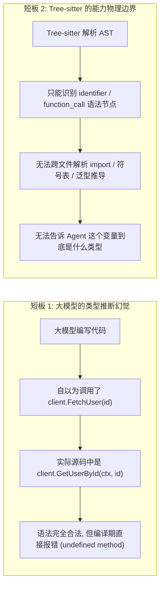
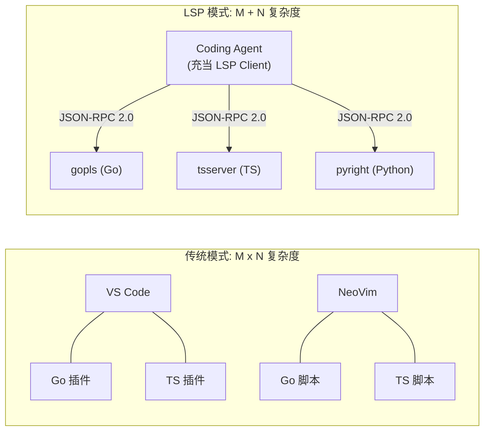
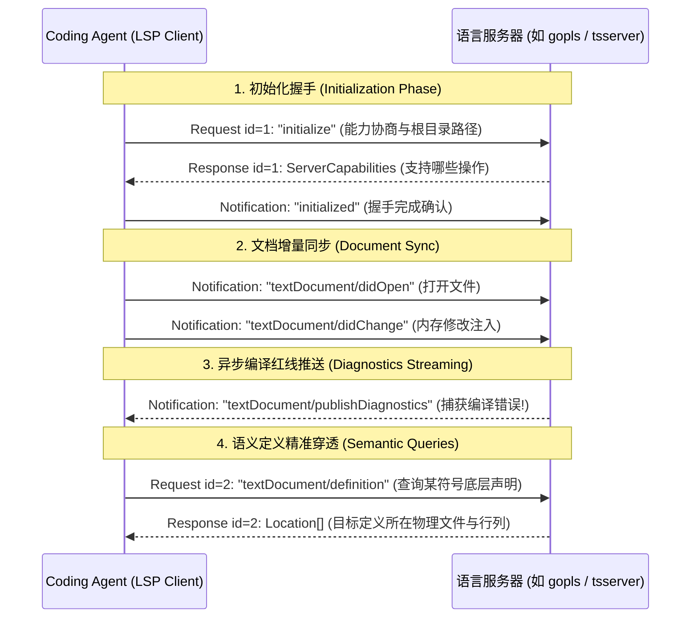
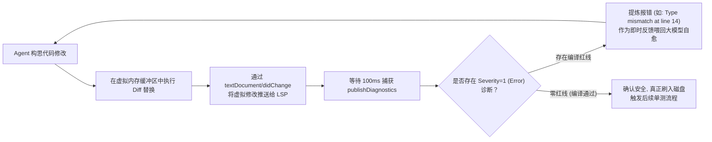
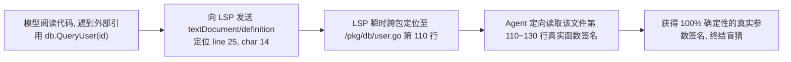
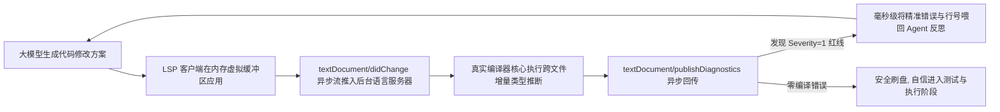

**TL;DR：** 在构建顶尖自主 Coding Agent（如 Cursor、Cline、Aider、OpenHands）的工程体系中，**如何让大模型摆脱“纯文本盲猜”与“自以为正确”的类型幻觉**，是区分玩具级代码补全与企业级架构重构的分水岭。大模型依靠概率推断出的代码经常在语法上无懈可击，却在语义上漏洞百出：调用了不存在的重载方法、遗漏了必填结构体字段、或者违反了泛型型变约束。依靠运行全量测试（`go test` / `npm test`）来排障，单次循环耗时动辄数十秒乃至数分钟；而 Tree-sitter 又只能解析语法结构（Grammar），无法跨文件推导类型（Types）。唯一的工业级终极解法，就是让 Coding Agent 原生接入 IDE 的核心大脑——**语言服务器协议（Language Server Protocol, LSP 3.17）**。本文深入剖析 Coding Agent 如何通过 JSON-RPC 2.0 双工协议，在无头环境（Headless）下桥接真实工业级编译器（`gopls` / `tsserver` / `pyright`）：在内存虚拟缓冲区中完成毫秒级增量同步（`textDocument/didChange`）、实时捕获编译红线诊断（`publishDiagnostics`）、并在修改前穿透跨文件符号定义（`goToDefinition`），构建真正具备编译器感知的超快自愈闭环。

---

## 一、 类型之盲：为什么纯大模型与 Tree-sitter 都无法解决“语义幻觉”？

很多开发者误以为“只要给大模型足够大的上下文窗口或 RAG，它就能写出 100% 正确的代码”。但在复杂的真实项目中，大模型存在两大致命短板：



### 1. 语法正确（Syntactically Valid）≠ 语义合法（Semantically Correct）

大模型本质是基于词元概率采样的模式匹配机。它非常擅长生成语法结构完美的语句：
```go
// 大模型自认为正确的代码
user, err := authService.ValidateToken(token)
if err != nil {
    return nil, err
}
return user.Role.Permissions(), nil
```
然而，当这段代码送入真实编译器时，可能会瞬间暴露出 3 处致命错误：
1. `authService.ValidateToken` 的第一个参数实际上需要传入 `context.Context`；
2. `user.Role` 返回的不是结构体指针，而是一个字符串枚举类型 `UserRole`；
3. `UserRole` 根本没有 `Permissions()` 方法，真正的方法位于 `rbac.GetPermissions(role)` 中。

如果只靠运行端到端测试，Agent 必须先存盘、启动构建流程、等待依赖加载、运行测试套件——**单次反馈延迟高达 15~60 秒**。对于需要多轮调整的复杂重构，Token 和时间成本直接失控。

### 2. Tree-sitter 为什么在类型层面束手无策？

在前文第 1 篇中，我们解析了 Tree-sitter 的增量语法树。但必须清醒认识到：**Tree-sitter 是一个 Parser（语法分析器），而不是 Type Checker（类型检查器）**。
- 它知道 `a.b()` 是一个方法调用节点；
- 但它根本不知道 `a` 的底层内存布局，不知道当前包引用了哪个版本的外部依赖，更不可能在内存中构建完整的符号交叉索引数据库。

**真正掌握全项目语义真理的，唯有各语言的官方编译器前端——这正是 LSP 的用武之地。**

---

## 二、 统一接口：LSP 架构哲学与 $M \times N$ 复杂度破解

在微软于 2016 年主导开源 LSP 之前，软件工具链处于极其混沌的 $M \times N$ 噩梦中：
$M$ 种编程语言（Go、Rust、TypeScript、Python、Java）$\times$ $N$ 种编辑器（VS Code、Vim、Emacs、Sublime）= 每一个编辑器都需要为每一种语言手写一套专属的语法高亮、自动跳转与补全插件。



### 1. LSP 的核心解耦哲学

LSP 通过将编辑器（Client）与语言分析引擎（Server）完全剥离，定义了一套基于 **JSON-RPC 2.0** 的通用通信规范：
- **Language Server 独立常驻**：作为后台子进程运行（如 `gopls` 或 `typescript-language-server`），在内存中维护全项目的虚拟文件系统与完整编译期符号图谱；
- **标准化语义原语**：无论是 C++、Go 还是 Rust，获取定义永远是 `textDocument/definition`，获取编译报错永远是 `textDocument/publishDiagnostics`。

对于自主 Coding Agent 而言，**Agent 自身只需扮演一个轻量级的 LSP Client**，即可瞬间继承各大语言官方编译器数十年来积累的深度类型推导能力！

---

## 三、 双向协议透视：JSON-RPC 2.0 与长连接通道

LSP 默认通过标准输入输出（`stdio`）或本地套接字（Socket）进行通信。每一个消息由标准的 HTTP-like 协议头和 JSON-RPC 消息体构成：

```http
Content-Length: 184\r\n
\r\n
{
  "jsonrpc": "2.0",
  "id": 1,
  "method": "textDocument/definition",
  "params": {
    "textDocument": { "uri": "file:///workspace/src/auth.ts" },
    "position": { "line": 42, "character": 18 }
  }
}
```

### 1. 三种核心消息模式

1. **请求（Request, 双向）**：包含唯一的 `id`，接收方处理完毕后必须返回带有相同 `id` 的 `result` 或 `error`；
2. **通知（Notification, 单向广播）**：**不包含 `id`**，发送方不期望也不会等待任何响应。例如，客户端通知服务端文件已修改（`didChange`），或者服务端向客户端推送最新编译报错（`publishDiagnostics`）；
3. **响应（Response）**：承载具体计算结果的确定性交付载体。



---

## 四、 核心闭环：毫秒级编译红线自愈（In-Loop Fast Feedback）

在拥有了 LSP 之后，Coding Agent 的反思与自愈能力发生了根本性的代际跃迁：

| 评估维度 | 传统单测/编译闭环（Test-Driven Loop） | LSP 实时编译红线闭环（LSP-Driven Loop） |
| :--- | :--- | :--- |
| **反馈延迟** | **15,000 ~ 60,000 ms**（受制于测试环境冷启动） | **50 ~ 200 ms**（仅受制于增量语义分析） |
| **磁盘依赖** | 必须刷入磁盘才能运行 CLI 测试 | **全内存虚拟演练**，错误代码绝不出内存沙箱 |
| **报错粒度** | 终端巨幅堆栈崩溃日志，含海量噪音 | **精确到字符级的结构化诊断**（行号、列号、编译器错误码） |
| **Token 消耗** | 喂入数百行终端日志（浪费数千 Token） | 仅喂入编译器精准错误提示（仅消耗 30~50 Token） |



### 1. 虚拟文档增量同步（Incremental Document Sync）

在生产环境中，如果每次修改都全量发送整份源文件（`Full Sync`），在大型文件中会造成极大的 JSON 序列化和管道通信负担。LSP 提供了基于范围的增量同步：

```json
{
  "jsonrpc": "2.0",
  "method": "textDocument/didChange",
  "params": {
    "textDocument": { "uri": "file:///app/main.go", "version": 2 },
    "contentChanges": [
      {
        "range": {
          "start": { "line": 10, "character": 4 },
          "end": { "line": 10, "character": 12 }
        },
        "rangeLength": 8,
        "text": "newFunctionCall"
      }
    ]
  }
}
```
LSP Server 在其内部维护着高效的 Rope 或 Piece Table 文本数据结构，在数十微秒内完成内部虚拟缓冲区的更新，并触发后台编译器工作线程（Worker）的增量类型推断。

### 2. 诊断严重级别过滤（Diagnostic Severity Filtering）

语言服务器会产出大量不同层级的诊断信息：
- `Severity = 1 (Error)`：编译阻断性错误（语法破损、类型不兼容、未声明标识符）；
- `Severity = 2 (Warning)`：代码警告（如未使用的变量、过时的 API）；
- `Severity = 3 (Information)` 与 `Severity = 4 (Hint)`：排版建议或代码风格提示。

**Agent 的自愈循环必须严格只拦截 `Severity === 1` 的红线错误**，切忌让模型陷入为了消除边缘代码风格提示（如“建议将单引号改为双引号”）而无休止空转的陷阱。

---

## 五、 跨文件定义穿透：在修改前探明底层类型

在进行复杂重构时，大模型经常需要知道某个函数具体需要什么参数。

传统方案中，Agent 只能通过工具在项目目录里暴力 `grep` 搜索函数名，往往会被同名方法或测试用例严重干扰；而在 LSP 下，Agent 拥有精准的“代码跳转（Go to Definition）”超能力：



通过这一闭环，Agent 彻底杜绝了因盲猜接口签名而引发的编译失败。

---

## 六、 完整工业级 TypeScript LSP 桥接客户端实现

以下给出了符合 LSP 3.17 规范的 `HeadlessLSPClient` 核心引擎实现，完整封装了基于 `Content-Length` 的异步流解析器、Promise 请求响应关联池、文档增量同步与诊断捕获：

```typescript
import { spawn, ChildProcess } from "child_process";
import { EventEmitter } from "events";

export interface Diagnostic {
  range: {
    start: { line: number; character: number };
    end: { line: number; character: number };
  };
  severity: number; // 1: Error, 2: Warning
  message: string;
  source?: string;
}

export class HeadlessLSPClient extends EventEmitter {
  private process: ChildProcess;
  private requestId = 0;
  private pendingRequests = new Map<number, { resolve: Function; reject: Function }>();
  private rawBuffer = Buffer.alloc(0);
  private diagnosticsMap = new Map<string, Diagnostic[]>();

  constructor(serverCommand: string, serverArgs: string[], cwd: string) {
    super();
    // 派生真实语言服务器后台进程 (如 gopls 或 typescript-language-server)
    this.process = spawn(serverCommand, serverArgs, {
      cwd,
      stdio: ["pipe", "pipe", "inherit"],
    });

    this.process.stdout!.on("data", (chunk: Buffer) => {
      this.handleIncomingData(chunk);
    });
  }

  /**
   * 1. LSP 标准 JSON-RPC 消息帧解析器 (处理 Content-Length 头)
   */
  private handleIncomingData(chunk: Buffer): void {
    this.rawBuffer = Buffer.concat([this.rawBuffer, chunk]);

    while (true) {
      const headerSeparator = this.rawBuffer.indexOf("\r\n\r\n");
      if (headerSeparator === -1) break;

      const headerText = this.rawBuffer.slice(0, headerSeparator).toString("ascii");
      const match = headerText.match(/Content-Length:\s*(\d+)/i);
      if (!match) {
        throw new Error(`无效的 LSP 协议头: ${headerText}`);
      }

      const contentLength = parseInt(match[1], 10);
      const messageStart = headerSeparator + 4;
      const messageEnd = messageStart + contentLength;

      if (this.rawBuffer.length < messageEnd) {
        // 消息体尚未完全到达，等待下一分块
        break;
      }

      const messageBody = this.rawBuffer.slice(messageStart, messageEnd).toString("utf-8");
      this.rawBuffer = this.rawBuffer.slice(messageEnd);

      const parsedJson = JSON.parse(messageBody);
      this.routeMessage(parsedJson);
    }
  }

  /**
   * 消息分发路由器
   */
  private routeMessage(msg: any): void {
    if (msg.id !== undefined && this.pendingRequests.has(msg.id)) {
      // 匹配请求响应
      const { resolve, reject } = this.pendingRequests.get(msg.id)!;
      this.pendingRequests.delete(msg.id);
      if (msg.error) reject(msg.error);
      else resolve(msg.result);
    } else if (msg.method === "textDocument/publishDiagnostics") {
      // 接收异步编译红线推送
      const uri = msg.params.uri;
      const diagnostics: Diagnostic[] = msg.params.diagnostics;
      this.diagnosticsMap.set(uri, diagnostics);
      this.emit("diagnostics", uri, diagnostics);
    }
  }

  /**
   * 2. 发送标准 RPC 请求
   */
  public sendRequest<T>(method: string, params: any): Promise<T> {
    const id = ++this.requestId;
    const payload = JSON.stringify({ jsonrpc: "2.0", id, method, params });
    const message = `Content-Length: ${Buffer.byteLength(payload, "utf-8")}\r\n\r\n${payload}`;

    return new Promise<T>((resolve, reject) => {
      this.pendingRequests.set(id, { resolve, reject });
      this.process.stdin!.write(message);
    });
  }

  /**
   * 3. 发送单向通知 (Notification)
   */
  public sendNotification(method: string, params: any): void {
    const payload = JSON.stringify({ jsonrpc: "2.0", method, params });
    const message = `Content-Length: ${Buffer.byteLength(payload, "utf-8")}\r\n\r\n${payload}`;
    this.process.stdin!.write(message);
  }

  /**
   * 4. 初始化握手
   */
  public async initialize(rootUri: string): Promise<any> {
    const result = await this.sendRequest("initialize", {
      processId: process.pid,
      rootUri,
      capabilities: {
        textDocument: {
          synchronization: { dynamicRegistration: false, willSave: false, didSave: false },
          publishDiagnostics: { relatedInformation: true },
        },
      },
    });

    this.sendNotification("initialized", {});
    return result;
  }

  /**
   * 5. 虚拟同步并等待秒级编译期红线
   */
  public async validateVirtualPatch(
    fileUri: string,
    newContent: string,
    timeoutMs = 1000
  ): Promise<{ hasErrors: boolean; errors: Diagnostic[] }> {
    // 强制通知语言服务器全量更新该文档的内存版本
    this.sendNotification("textDocument/didChange", {
      textDocument: { uri: fileUri, version: Date.now() },
      contentChanges: [{ text: newContent }],
    });

    // 等待语言服务器异步推送该文件的编译红线
    return new Promise((resolve) => {
      const timer = setTimeout(() => {
        const diags = this.diagnosticsMap.get(fileUri) || [];
        const errors = diags.filter((d) => d.severity === 1);
        resolve({ hasErrors: errors.length > 0, errors });
      }, timeoutMs);

      const handler = (uri: string, diags: Diagnostic[]) => {
        if (uri === fileUri) {
          clearTimeout(timer);
          this.removeListener("diagnostics", handler);
          const errors = diags.filter((d) => d.severity === 1);
          resolve({ hasErrors: errors.length > 0, errors });
        }
      };

      this.on("diagnostics", handler);
    });
  }

  /**
   * 优雅销毁
   */
  public shutdown(): void {
    this.sendRequest("shutdown", {}).finally(() => {
      this.sendNotification("exit", {});
      this.process.kill();
    });
  }
}
```

---

## 七、 生产级避坑指南与性能防护

将 LSP 嵌入 Coding Agent 生产运行时需要攻克一系列底层系统瓶颈：

| 故障模式 | 现象表现 | 诱发物理根因 | 生产级终极防御策略 |
| :--- | :--- | :--- | :--- |
| **内存无限泄漏（OOM）** | 运行数小时后 `tsserver` 或 `gopls` 消耗 10GB 内存 | 语言服务器为海量 `node_modules` 或构建产物构建了全量符号树 | 在 `initialize` 阶段强制配置 `watcher` 排除规则，严格忽略 `.git`、`dist`、`node_modules` |
| **高频 didChange 击垮 Server** | 频繁打断导致语言服务器假死卡顿 | Agent 快速试探多次修改，编译器在后台频繁取消与重建编译单元 | 客户端层增加 **防抖合并（Debounce & Throttle）**，在输入静止 80ms 后再统一发出同步通知 |
| **Monorepo 多工作区割裂** | 跨子项目的内部 Package 报 `Cannot find module` | 语言服务器只识别根目录单工程配置，无法理解 Go Workspaces 或 Pnpm 多包拓扑 | 在初始化阶段动态枚举所有的 `go.work`、`tsconfig.json` 或 `Cargo.toml`，以 `workspaceFolders` 多模块声明挂载 |
| **未保存文件的幽灵编译** | 内存验证虽通过，但其他并发文件找不到新类型 | 跨文件符号需要依赖磁盘落地或全局虚拟内存 OverlayFS | 严格限制多文件联动重构的拓扑排序，按依赖树从底层接口向上层实现依次提交落盘 |

---

## 八、 总结与因果主线全景图

从纯文本概率采样的“黑盒盲猜”，到依靠语言服务器协议实现的“编译期红线秒级穿透”，Coding Agent 在软件工程的认知深度上完成了一次关键闭环：



1. **大模型的归宿是逻辑推理，而非符号记忆**：通过将繁琐精确的符号解析与类型推导全权下放给 LSP，大模型可以专注于高阶业务设计与算法编写；
2. **50ms 的编译反馈彻底击碎了分钟级的调试延迟**：将错误排查拦截在代码存盘之前，让自主自愈循环的效率实现数量级的飞跃；
3. **跨文件跳转赋予了模型探查真理的放大镜**：在修改任何第三方或底层调用前，通过 `goToDefinition` 先行探明底层真实契约。

正是在 LSP 深度赋能之下，现代 Coding Agent 才能真正告别盲人摸象的窘境，化身为兼具广阔视野与严苛编译纪律的顶级代码工匠。
