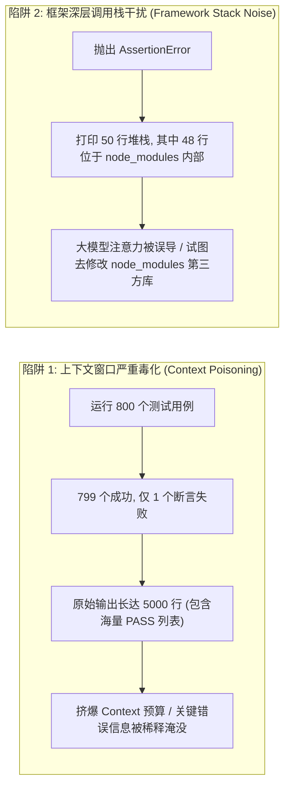
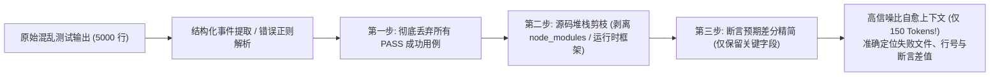
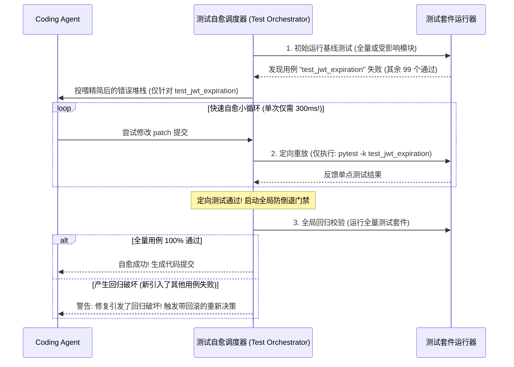
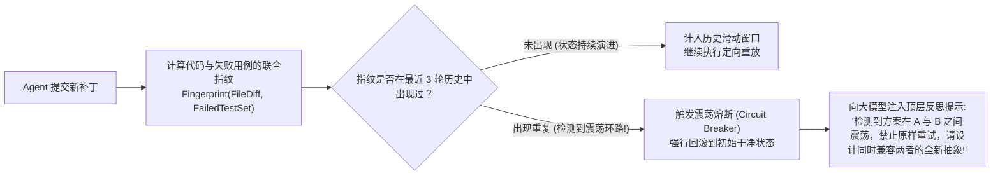
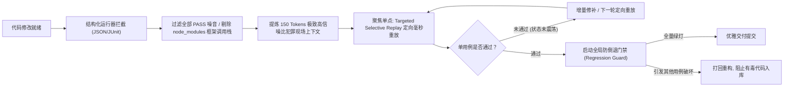

**TL;DR：** 在自主 Coding Agent（如 Aider、Cline、SWE-bench 顶尖系统、OpenHands）的工程闭环中，**如何让大模型在修改完代码后，通过运行测试用例自动感知失败、定位根因并自主修复**，是决定智能体能否独立交付高质量工业代码的终极考场。未经处理的测试输出是致命的“上下文毒药”：500 个用例中仅仅失败了 1 个，测试运行器（如 Vitest、Pytest、go test）却会倾泻数千行日志，充斥着成功的无关用例名、长达 40 行的框架内部无意义调用栈（`node_modules` / `site-packages`）以及上万字符的冗长 Diff 对比，瞬间挤爆 Token 预算并诱发模型的自注意力涣散；更会导致模型陷入“修了用例 A 搞崩用例 B，修了 B 又搞崩 A”的**死循环震荡**。本文以第一性原理系统拆解高阶 Coding Agent 的测试自愈引擎：从结构化测试事件（JSON/JUnit XML）拦截，到基于源码归属的**调用栈深度剪枝（Stack Trace Pruning）**；从聚焦单点的**失败用例定向极速重放（Targeted Selective Replay）**，到全局防倒退回归校验（Regression Guard）与震荡熔断控制，全景呈现将大模型从“手忙脚乱乱改一气”升级为“严谨遵循 TDD 闭环的自愈工程师”的核心架构实践。

---

## 一、 日志洪泛与注意力毒化：为什么全量单测输出会毁掉 Agent？

在初阶 Agent 的实现中，研发团队通常让模型直接执行 `npm test` 或 `pytest`，并将控制台打印出的全部内容原封不动塞回给模型：

```typescript
// 玩具级实现：直接将数千行原始测试输出喂回 Prompt
const output = await pty.run("npm test");
if (output.exitCode !== 0) {
  await agent.step(`测试失败，请查看输出并修复：\n${output.stdout}`);
}
```

在真实生产工程中，这种粗暴做法会立即引发三大不可逆的系统崩溃：



### 1. 信噪比崩塌：99% 的输出全是纯噪音

一个典型的大型工程单测运行，控制台输出通常包含：
- **大量无关的成功标志**：`✓ tests/auth.test.ts (45 tests passed)` 连续打印数百行；
- **构建工具的启动 Banner 与版本提示**；
- **全量快照或超大对象 Diff 倾倒**：如果一个包含 200 个字段的复杂 JSON 对象中，仅仅是 `status` 字段从 `"active"` 变成了 `"pending"`，某些测试框架会默认打印出整个对象的完整序列化对比，输出几万个字符。

大模型的自注意力权重在面对如此庞杂的字符流时，核心报错信息（“第 42 行预期得到 200，实际得到 401”）会被彻底淹没，诱发典型的注意力衰退。

### 2. 框架深层调用栈（Framework Stacks）的致命误导

当断言失败抛出异常时，Python、Node.js 或 Java 会打印完整的栈回溯（Traceback）：

```text
Error: expect(received).toBe(expected) // Object.is equality
Expected: 200
Received: 500
    at /workspace/node_modules/expect/build/index.js:134:25
    at /workspace/node_modules/vitest/dist/vendor/execute.js:89:12
    at processTicksAndRejections (node:internal/process/task_queues:95:5)
    at async runTest (/workspace/node_modules/vitest/dist/entry.js:45:9)
    at async /workspace/src/auth/service.test.ts:42:5
```

**致命现象：大模型被前 4 行 `node_modules` 堆栈严重误导**！模型会产生荒谬的幻觉：“我需要去修改 `node_modules/expect/build/index.js` 来修复这个 Bug”，甚至生成修改第三方依赖的补丁，导致整个代码库彻底毁坏。

### 3. 全量测试循环的不可承受之重

全量跑一次测试套件通常需要 **30 秒至 2 分钟**。如果 Agent 每修改一次局部代码，都必须跑一次全量测试，一个包含 5 轮迭代的修复任务就要耗时 10 分钟以上，且会产生数十万 Token 的冗余账单。

---

## 二、 蒸馏艺术：测试输出结构化清洗与堆栈深度剪枝

生产级 Coding Agent 绝对不能充当控制台字符的搬运工。它必须在子进程与大模型之间，嵌入一层**测试输出高精蒸馏器（Test Output Distiller）**：



### 1. 结构化测试结果优先原则（Structured Reporters）

最优雅的方案是直接规避控制台字符串解析，在执行测试命令时动态注入结构化 Reporter 标志：
- **Vitest / Jest**：`--reporter=json` 或 `--reporter=junit`；
- **Pytest**：`-q --tb=short --junitxml=report.xml`；
- **Go test**：`go test -json`；
- **Cargo test**：`cargo test -- --format=json`。

通过读取内存中的 JSON 流，Agent 可以用 $\mathcal{O}(1)$ 的时间复杂度，直接提取失败用例的集合数组，完全免疫 ANSI 控制码与换行排版的干扰。

### 2. 源码调用栈深度剪枝（Stack Trace Pruning）

当只能从控制台捕获文本栈回溯时，必须执行基于**源码路径边界（Workspace Boundary）**的启发式剪枝算法：

1. **白名单模式**：仅保留命中当前工作区（Workspace Root）路径的栈帧；
2. **黑名单过滤**：无条件丢弃所有包含以下路径模式的帧：
   - Node.js：`node_modules/`、`node:internal/`、`deps/`；
   - Python：`site-packages/`、`lib/python3.*/`、`pytest/`、`pluggy/`；
   - Go：`testing/testing.go`、`runtime/`；
3. **关键犯罪现场提取（Smoking Gun Frame）**：在过滤后的栈帧中，定位离抛出异常最近的**首个用户物理源文件及行号**，并自动提取该行前后 3 行的真实代码片段。

原本 50 行的巨幅堆栈，被蒸馏为极度紧凑的 3 行关键上下文：

```text
FAIL: src/auth/service.test.ts > should return 200 on valid token
Assertion: Expected 200, Received 500
At: src/auth/service.ts:42 -> const role = user.getRole();
```

---

## 三、 定向重放与全局防倒退（Targeted Replay vs. Regression Guard）

在人类软件工程中，优秀工程师修复 Bug 时绝不会每次都跑全量测试，而是遵循**“单点定向击破 $\to$ 全局回归守门”**的双轨调度哲学：



### 1. 目标用例定向重放（Targeted Selective Replay）

当定位到具体失败用例后，自愈调度器动态构造最小粒度的单用例运行命令：
- **Vitest**：`npx vitest run src/auth/service.test.ts -t "should return 200 on valid token"`；
- **Pytest**：`pytest tests/test_auth.py -k "test_jwt_expiration"`；
- **Go**：`go test ./pkg/auth -run "^TestJWTExpiration$"`。

单用例重放彻底跳过了其余数百个用例的执行时间，将 Agent 试错反馈循环压缩在 **200~500 毫秒**以内，让大模型能够以极快的节奏尝试微小调整。

### 2. 全局防倒退门禁（Regression Guard）

局部通过不代表全局安全。大模型经常在修复用例 A 时，粗暴修改了通用工具函数的返回值签名，导致此前原本通过的用例 B、C、D 大面积崩塌。

因此，**在宣布任务完成前，必须有且仅有一次全量回归门禁**。若全量测试失败，调度器必须清晰指明：
> “你对 `test_A` 的修复意外导致了原本正常的 `test_B` 失败。请重新权衡方案，保证两者同时通过。”

---

## 四、 震荡死循环检测与有向状态机熔断（Oscillation Breaker）

在多轮测试自愈过程中，最棘手的边缘故障是**语义震荡（Semantic Ping-Pong / Oscillation）**：
- 第 1 轮：模型为了让测试 1 通过，将配置参数改为 `strict: true`，导致测试 2 失败；
- 第 2 轮：模型为了让测试 2 通过，将配置参数改回 `strict: false`，导致测试 1 再次失败；
- 第 3 轮：模型再次改为 `strict: true`……

如果缺乏全局状态机监控，Agent 会在此类“左右摇摆”中无限消耗 Token，直到用户破产。



### 1. 联合状态指纹（Joint State Fingerprint）

调度器在每一轮测试后计算状态哈希值：
$$\text{StateHash} = \text{SHA256}(\text{GitTreeHash} \parallel \text{Sorted}(\text{FailedTestNames}))$$
如果在滑动窗口（最近 3~5 轮）内命中相同的 `StateHash`，说明 Agent 的思维陷入了局部极小值死循环。

### 2. 渐进式干预策略

一旦触发震荡熔断：
1. **立即原子回滚代码**：恢复到进入死循环前的初始健康状态；
2. **升级提示词上下文**：向大模型明确展示其前两轮互相矛盾的修改记录，指出其行为冲突，迫使其放弃“打补丁修补丁”的短视逻辑，转向重构公共底层逻辑。

---

## 五、 完整工业级 TypeScript 测试自愈调度器实现

以下给出了可在生产级 Agent 中直接使用的 `TestDrivenSelfHealingOrchestrator`，完整封装了测试输出蒸馏、用户堆栈修剪、定向单测重放与震荡熔断机制：

```typescript
import { exec } from "child_process";
import { promisify } from "util";
import * as crypto from "crypto";

const execAsync = promisify(exec);

export interface DistilledTestFailure {
  testFile: string;
  testName: string;
  assertionError: string;
  closestUserFrame?: {
    file: string;
    line: number;
    column: number;
  };
}

export interface SelfHealingSession {
  targetTestFile: string;
  targetTestName: string;
  maxAttempts: number;
  attemptsCount: number;
  historyFingerprints: Set<string>;
}

export class TestDrivenSelfHealingOrchestrator {
  private workspaceRoot: string;

  constructor(workspaceRoot: string) {
    this.workspaceRoot = workspaceRoot;
  }

  /**
   * 1. 运行全量测试并提取高信噪比失败用例 (以 Vitest JSON 为例)
   */
  public async runFullSuiteAndExtractFailures(): Promise<{
    passed: boolean;
    failures: DistilledTestFailure[];
    rawSummary: string;
  }> {
    try {
      // 优先采用 --reporter=json 结构化输出
      const { stdout } = await execAsync("npx vitest run --reporter=json", {
        cwd: this.workspaceRoot,
        env: { ...process.env, CI: "true" },
      });

      return { passed: true, failures: [], rawSummary: "全量测试通过" };
    } catch (error: any) {
      const rawStdout = error.stdout || "";
      const failures = this.parseAndDistillVitestJson(rawStdout);
      return {
        passed: false,
        failures,
        rawSummary: `单测未通过：检测到 ${failures.length} 个失败用例`,
      };
    }
  }

  /**
   * 2. 定向重放单个失败测试用例 (毫秒级反馈)
   */
  public async runTargetedTest(
    testFile: string,
    testName: string
  ): Promise<{ passed: boolean; errorOutput?: string }> {
    try {
      const cmd = `npx vitest run ${testFile} -t "${testName.replace(/"/g, '\\"')}"`;
      await execAsync(cmd, { cwd: this.workspaceRoot });
      return { passed: true };
    } catch (error: any) {
      const rawOutput = (error.stdout || "") + (error.stderr || "");
      const prunedTrace = this.pruneStackTrace(rawOutput);
      return { passed: false, errorOutput: prunedTrace };
    }
  }

  /**
   * 3. 结构化 JSON 解析与高信噪比蒸馏
   */
  private parseAndDistillVitestJson(jsonStr: string): DistilledTestFailure[] {
    const results: DistilledTestFailure[] = [];
    try {
      // 提取合法的 JSON 块 (防止前后夹杂其他终端日志)
      const jsonStart = jsonStr.indexOf("{");
      const jsonEnd = jsonStr.lastIndexOf("}");
      if (jsonStart === -1 || jsonEnd === -1) return [];

      const payload = JSON.parse(jsonStr.slice(jsonStart, jsonEnd + 1));
      for (const fileResult of payload.testResults || []) {
        for (const assertion of fileResult.assertionResults || []) {
          if (assertion.status === "failed") {
            const failureMsg = assertion.failureMessages?.[0] || "断言失败";
            const userFrame = this.extractClosestUserFrame(failureMsg);

            results.push({
              testFile: fileResult.name.replace(this.workspaceRoot + "/", ""),
              testName: assertion.title || assertion.fullName,
              assertionError: this.extractAssertionOnly(failureMsg),
              closestUserFrame: userFrame,
            });
          }
        }
      }
    } catch {
      // 若 JSON 解析失败，优雅回退至正则提取
    }
    return results;
  }

  /**
   * 4. 堆栈剪枝：剥离全部第三方框架堆栈，仅保留首个用户源码位置
   */
  public pruneStackTrace(rawTrace: string): string {
    const lines = rawTrace.split("\n");
    const cleanedLines: string[] = [];

    for (const line of lines) {
      // 丢弃 node_modules、vitest 内部、node 内部库
      if (
        line.includes("node_modules") ||
        line.includes("node:internal") ||
        line.includes("vitest/dist")
      ) {
        continue;
      }
      cleanedLines.push(line);
    }

    return cleanedLines.slice(0, 15).join("\n").trim();
  }

  /**
   * 定位首个用户物理源文件与行号
   */
  private extractClosestUserFrame(stackTrace: string): { file: string; line: number; column: number } | undefined {
    const regex = /(?:at\s+|@)(?:.*?\(?)(\/[^\s:)]+):(\d+):(\d+)\)?/;
    const lines = stackTrace.split("\n");

    for (const line of lines) {
      if (line.includes("node_modules")) continue;
      const match = line.match(regex);
      if (match) {
        return {
          file: match[1].replace(this.workspaceRoot + "/", ""),
          line: parseInt(match[2], 10),
          column: parseInt(match[3], 10),
        };
      }
    }
    return undefined;
  }

  /**
   * 仅提炼断言差异的核心句子 (过滤冗长对象文本)
   */
  private extractAssertionOnly(fullMessage: string): string {
    const firstFewLines = fullMessage.split("\n").slice(0, 4).join("\n");
    return firstFewLines.replace(/\x1b\[[0-9;]*[a-zA-Z]/g, ""); // 剥除颜色码
  }

  /**
   * 5. 状态哈希与死循环震荡守卫
   */
  public checkOscillationAndRecord(
    session: SelfHealingSession,
    codeDiff: string,
    failingTests: string[]
  ): boolean {
    const hash = crypto
      .createHash("sha256")
      .update(codeDiff + "::" + failingTests.sort().join(","))
      .digest("hex");

    if (session.historyFingerprints.has(hash)) {
      // 触发震荡死锁！
      return true;
    }

    session.historyFingerprints.add(hash);
    return false;
  }
}
```

---

## 六、 生产级防御指南：TDD 自愈安全策略矩阵

| 风险模式 | 破坏现象 | 防御设计 |
| :--- | :--- | :--- |
| **作弊式自愈（Cheat-to-Pass）** | 大模型直接把单测用例的 `expect` 断言改成了当前错误的返回值 | **测试用例只读锁（Test Immutability Gate）**：严禁 Agent 修改待测用例本身，仅允许修改实现代码 |
| **无脑注释大法** | 模型将抛异常的测试函数直接用 `//` 注释掉，制造“100% 通过”假象 | **用例基线总量守卫（Assertion Count Guard）**：通过用例总数必须与基线严格相等，少一个用例直接判负 |
| **异步超时死锁** | 测试中的未决 Promise 或监听器导致单测进程永不退出 | 定向重放施加**严格短超时（Per-test Timeout, 如 5000ms）**，超时即抛出超时中断 |
| **全局状态污染** | 前置用例在数据库或全局变量中留下了脏数据，导致后置用例随机崩溃 | 运行器强制启用进程隔离（`isolate: true` / 单用例独立进程），确保状态环境纯净 |

---

## 七、 总结与因果主线全景图

从粗暴丢给模型 5,000 行控制台垃圾日志，到基于精准堆栈剪枝与定向重放的高信噪比闭环，Coding Agent 的测试执行体系实现了从“玄学修 Bug”到“工业化 TDD 闭环”的蜕变：



1. **Token 带宽必须留给思考，绝不能浪费在噪音日志上**：剔除 99% 的无用输出，让大模型的有限注意力完全聚焦在核心断言偏差与出错代码行上；
2. **定向重放是高频敏捷试错的加速器**：将分钟级等待化作毫秒级轻快反馈，极大提升单轮自愈的收敛速度；
3. **全局门禁与震荡熔断是品质的最后守门人**：防止按下葫芦浮起瓢，坚决斩断逻辑死循环，确保交付物绝对健壮。

掌握了测试驱动自愈闭环的 Coding Agent，才真正具备了自主对抗不确定性、在复杂的软件迷宫中自我纠错直至抵达彼岸的工程师灵魂。
