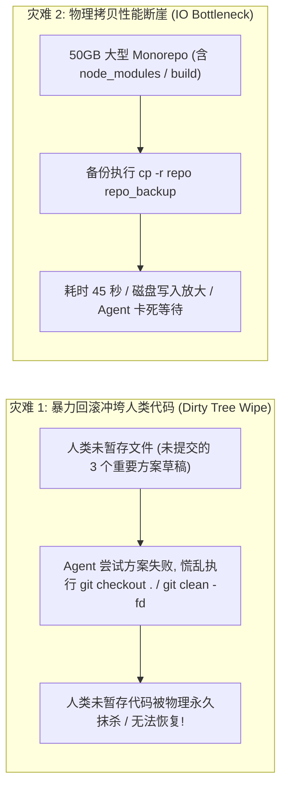
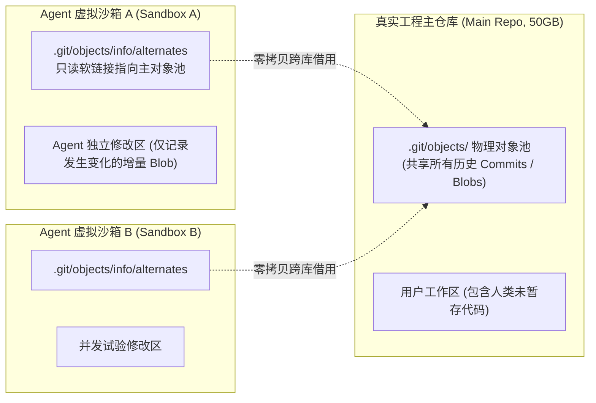
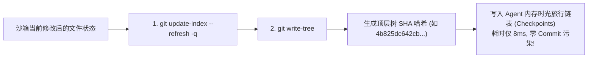
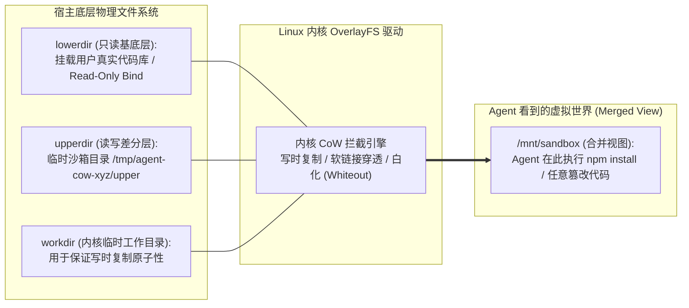
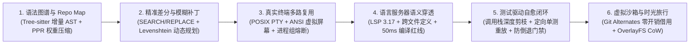

**TL;DR：** 作为全网首套系统拆解生产级 Coding Agent 架构的**收官压轴之作**，本文聚焦智能体在自主执行探索中最关键的“安全兜底防线”——**虚拟工作区隔离与亚秒级状态快照回滚**。自主 Coding Agent 在尝试重构、试错修复复杂 Bug 时，往往会同时修改数十个文件、安装依赖并产生临时编译产物；一旦推演发现方向走入死胡同，简单的 `git reset --hard` 会**极其粗暴地抹杀人类工程师原有的未暂存代码**，而物理拷贝整份仓库（`cp -r`）在几十 GB 的大型 Monorepo 下不仅耗时数十秒更会瞬间吞噬磁盘。本文深度解密工业级沙箱的双轨设计：在用户态，利用 Git 的 CAS 内容寻址存储与 **`objects/info/alternates` 机制**，实现零存储开销、亚毫秒级无损工作区瞬时派生；在操作系统内核态，通过 **Linux OverlayFS 联合挂载** 将真实代码库作为只读基底（`lowerdir`），将智能体全部破坏性试验隔离在写时复制上层（`upperdir`），实现 5 毫秒一键原子丢弃与人类审批合并，为自主智能体筑牢坚不可摧的工程安全屏障。

---

## 一、 试错的代价：为什么没有“后悔药”的 Agent 极其危险？

在没有完善沙箱隔离的初阶 Coding Agent 中，模型被直接授权在人类工程师当前的工作目录中读写文件。这种“裸奔”模式经常酿成毁灭性灾难：



### 1. 物理灾难：未暂存工作区（Dirty Worktree）被恶意洗白

软件工程中最神圣的铁律是：**绝对不能破坏属于用户的未暂存修改**。
- 人类可能正本地修改了 `auth.go` 的前 20 行，尚未提交；
- Agent 接到任务去修 `payment.go` 的 Bug；
- Agent 在尝试方案 A 失败后，自行在 PTY 终端里执行了 `git reset --hard HEAD` 或 `git clean -f -d`；
- **人类辛苦编写的未暂存代码瞬间灰飞烟灭**！这直接导致资深工程师对 Coding Agent 产生强烈的信任危机。

### 2. 状态分叉的必然性：试错搜索树（Exploration Tree）

自主编程本质是一个在广阔状态空间中的**启发式搜索树**：
- 节点 0：当前项目健康状态；
- 分支 A：尝试升级基础库解决兼容性 $\to$ 走入死胡同，需要回退至节点 0；
- 分支 B：尝试修改接口签名做适配 $\to$ 成功，继续衍生子节点 B1。

如果不能在 **5~10 毫秒** 内完成状态快照与回滚，Agent 将丧失多路径并发探索的可能，只能像盲人一样单向一条路走到黑。

---

## 二、 用户态破局：Git Alternates 机制与零拷贝工作区分支

在纯用户态（跨 macOS、Linux、Windows 通用）环境下，如何做到既完全隔离又零磁盘复制开销？答案深植于 Linus Torvalds 在 2005 年设计 Git 时的核心精髓——**内容寻址存储（Content-Addressable Storage, CAS）与对象借用机制（Git Alternates）**。

### 1. Git 底层对象模型与对象借用机制

Git 的核心是一个基于 SHA-1/SHA-256 哈希的内容寻址对象数据库，存放在 `.git/objects/` 中：
- `blob`：存储文件真实文本内容；
- `tree`：记录目录结构与文件名到 blob 的映射；
- `commit`：包含顶层 tree 指针、父提交指针及元数据。

当我们需要创建一个全新的隔离工作区时，**根本不需要克隆任何具体文件数据**！只需在全新目录中，配置指向原仓库的借用指针：

```text
# 在新工作区的 .git/objects/info/alternates 文件中写入：
/path/to/original-repo/.git/objects
```



### 2. 为什么 Git Alternates 具有绝对优势？

1. **瞬时派生（0ms 级）**：
   无需网络下载，无需磁盘大文件拷贝。一个 50GB 的仓库，派生虚拟沙箱仅需在磁盘写入一个几十字节的文本文件，总耗时 **`< 2ms`**；
2. **零存储冗余**：
   虚拟沙箱与主仓库共享所有未修改的历史对象。只有当 Agent 产生新的代码修改并提交时，才会在沙箱自有的 `objects/` 目录下生成微小的增量对象；
3. **物理天然隔离**：
   Agent 在沙箱内随意安装依赖、编译、删除目录或执行 `git reset --hard`，**对主仓库的工作区没有任何一丝物理层面的触碰**。

---

## 三、 内存级时光旅行：基于 `git write-tree` 的微秒快照状态机

即使在沙箱内部，Agent 在连续执行单步工具调用（如第 1 轮改文件，第 2 轮跑测试，第 3 轮再改文件）时，依然需要像游戏存档一样，随时保存“检查点（Checkpoints）”。

如果每次都通过 `git commit -m "snapshot"` 创建真实分支，会污染 Git 提交历史，且每次都要经历繁重的索引刷新（Index Refresh）。

### 1. 纯内存 CAS 快照：`git write-tree` 原语

Git 提供了低级管道原语（Plumbing Commands），允许直接操作内存中的树对象：



1. **创建检查点**：
   调用 `git write-tree`，Git 仅扫描发生变化的文件并写入对象池，瞬间返回一个唯一的 `TreeSHA`（如 `a1b2c3d4...`）。**整个过程完全不移动 HEAD 指针，也不创建 commit 节点**；
2. **极速一键回退**：
   若后续步骤失败需要回到该检查点，只需执行底层恢复命令：
   ```bash
   git read-tree -u -m <TreeSHA>
   ```
   文件系统瞬间被精确复原到生成该 `TreeSHA` 的绝对状态，耗时仅需 **3~8 毫秒**。

---

## 四、 内核级写时复制（CoW）：Linux OverlayFS 联合挂载沙箱

在更高规格的 Linux 生产环境（如 Docker、云原生 Agent 执行引擎 Google AX / E2B）中，Coding Agent 可以直接借助 Linux 内核的 **OverlayFS 联合文件系统**，构筑真正的操作系统级强物理隔离。

### 1. OverlayFS 的四层空间架构

OverlayFS 将不同的目录层叠挂载在一起，向用户态进程呈现统一的虚拟合并视口（Merged View）：



1. **`lowerdir`（只读基底）**：将宿主机器上的真实工程目录以 **`ro`（只读）** 模式接入。无论 Agent 在沙箱里执行多么危险的写操作，内核都会严防死守，绝对无法向该目录写入半个字节；
2. **`upperdir`（读写差分层）**：分配一个位于 `/tmp` 内存盘（`tmpfs`）或独立磁盘的空目录；
3. **`merged`（合并挂载点）**：
   - **读取文件**：若文件未被修改，直接穿透读取 `lowerdir`（零 I/O 损耗）；
   - **修改/覆写文件**：触发内核级**写时复制（Copy-on-Write）**，内核自动将受影响文件完整拷贝至 `upperdir` 并在上层修改；
   - **删除文件**：内核在 `upperdir` 中创建一个特殊的**白化设备节点（Whiteout, 主次设备号 0:0 的字符设备）**，在虚拟视口中隐藏该文件，底层的真实文件毫发无损！

### 2. 毫秒级回滚与确定性合并

当 Agent 的探索宣告失败：
```bash
# 终止沙箱：仅需卸载并清空 upperdir，耗时 5ms，真实目录从始至终滴水不漏
umount /mnt/sandbox
rm -rf /tmp/agent-cow-xyz
```
当 Agent 成功修复 Bug 并通过所有测试，人类审查批准落盘：
```bash
# 优雅合并：仅需将 upperdir 中的增量文件差异同步回真实目录
rsync -a --exclude='.git' /tmp/agent-cow-xyz/upper/ /path/to/real-repo/
```

---

## 五、 完整工业级 TypeScript 虚拟工作区管理器实现

以下给出了在跨平台环境下直接可用的 `VirtualWorkspaceManager` 完整实现，深度封装了基于 Git Alternates 的零开销沙箱创建、内存级 CAS 树快照时光旅行与无损合并回滚：

```typescript
import { exec } from "child_process";
import { promisify } from "util";
import * as path from "path";
import * as fs from "fs/promises";
import * as os from "os";

const execAsync = promisify(exec);

export interface WorkspaceSnapshot {
  id: string;
  treeHash: string;
  timestamp: number;
  description: string;
}

export class VirtualWorkspaceManager {
  private hostRepoPath: string;
  private sandboxPath: string = "";
  private snapshots: WorkspaceSnapshot[] = [];

  constructor(hostRepoPath: string) {
    this.hostRepoPath = path.resolve(hostRepoPath);
  }

  /**
   * 1. 采用 Git Alternates 机制亚秒级派生独立零拷贝沙箱
   */
  public async createIsolatedSandbox(sandboxName = "agent-sandbox"): Promise<string> {
    const tmpDir = await fs.mkdtemp(path.join(os.tmpdir(), "coding-agent-"));
    this.sandboxPath = path.join(tmpDir, sandboxName);

    // 宿主仓库的 objects 目录
    const hostObjectsDir = path.join(this.hostRepoPath, ".git", "objects");

    // 初始化全新的空 Git 仓库
    await execAsync(`git init "${this.sandboxPath}"`);

    // 核心黑魔法: 写入 alternates 借用指针
    const alternatesPath = path.join(this.sandboxPath, ".git", "objects", "info", "alternates");
    await fs.mkdir(path.dirname(alternatesPath), { recursive: true });
    await fs.writeFile(alternatesPath, hostObjectsDir, "utf-8");

    // 获取宿主仓库当前的 HEAD commit
    const { stdout: headCommit } = await execAsync("git rev-parse HEAD", {
      cwd: this.hostRepoPath,
    });

    // 在沙箱中直接通过借用的对象检出工作区 (零字节克隆!)
    await execAsync(`git checkout -f ${headCommit.trim()}`, {
      cwd: this.sandboxPath,
    });

    return this.sandboxPath;
  }

  /**
   * 2. 创建微秒级 CAS 内存快照 (不产生任何 Commit 污染)
   */
  public async createCheckpoint(description: string): Promise<WorkspaceSnapshot> {
    if (!this.sandboxPath) throw new Error("沙箱尚未初始化");

    // 将当前所有变动刷入临时索引区
    await execAsync("git add -A", { cwd: this.sandboxPath });

    // 直接生成顶层树哈希
    const { stdout: treeHash } = await execAsync("git write-tree", {
      cwd: this.sandboxPath,
    });

    const snapshot: WorkspaceSnapshot = {
      id: `ckpt_${Date.now()}_${Math.random().toString(36).slice(2, 6)}`,
      treeHash: treeHash.trim(),
      timestamp: Date.now(),
      description,
    };

    this.snapshots.push(snapshot);
    return snapshot;
  }

  /**
   * 3. 瞬时回滚到指定的 CAS 快照 (时光旅行)
   */
  public async rollbackToCheckpoint(snapshotId: string): Promise<void> {
    const target = this.snapshots.find((s) => s.id === snapshotId);
    if (!target) {
      throw new Error(`未找到快照: ${snapshotId}`);
    }

    // 强制重置工作区并应用目标 Tree
    await execAsync(`git read-tree -u -m ${target.treeHash}`, {
      cwd: this.sandboxPath,
    });

    // 截断该快照之后的分支记录
    const targetIdx = this.snapshots.indexOf(target);
    this.snapshots = this.snapshots.slice(0, targetIdx + 1);
  }

  /**
   * 4. 人类审查确认后，将沙箱改动原子同步回宿主真实工作区
   */
  public async commitToHost(): Promise<{ diffStat: string }> {
    if (!this.sandboxPath) throw new Error("沙箱未运行");

    // 生成当前沙箱对比最初基线的 Unified Diff
    const { stdout: patchDiff } = await execAsync("git diff HEAD", {
      cwd: this.sandboxPath,
    });

    if (!patchDiff.trim()) {
      return { diffStat: "无任何变动需合并" };
    }

    // 优雅应用补丁至宿主真实工作区 (保留人类工程师已有的未暂存代码!)
    const patchFile = path.join(os.tmpdir(), `sandbox_patch_${Date.now()}.patch`);
    await fs.writeFile(patchFile, patchDiff, "utf-8");

    try {
      await execAsync(`git apply --whitespace=nowarn "${patchFile}"`, {
        cwd: this.hostRepoPath,
      });
      const { stdout: diffStat } = await execAsync("git diff --stat", {
        cwd: this.hostRepoPath,
      });
      return { diffStat };
    } finally {
      await fs.unlink(patchFile).catch(() => {});
    }
  }

  /**
   * 5. 安全销毁沙箱环境，物理清空临时目录
   */
  public async destroySandbox(): Promise<void> {
    if (this.sandboxPath) {
      const parentTmp = path.dirname(this.sandboxPath);
      await fs.rm(parentTmp, { recursive: true, force: true }).catch(() => {});
      this.sandboxPath = "";
      this.snapshots = [];
    }
  }
}
```

---

## 六、 生产级防御指南：虚拟工作区安全防护矩阵

| 威胁场景 | 破坏现象 | 防御设计规范 |
| :--- | :--- | :--- |
| **恶性递归目录逃逸** | Agent 在沙箱内通过 `../../` 软链接遍历并越权篡改宿主机根目录 | 沙箱创建层严格禁用跨目录软链接穿透；在 Linux 下强制结合 `chroot` 或 mount 命名空间隔离 |
| **磁盘配额被巨型生成物打爆** | 误操作生成超大测试数据文件（如 `dd if=/dev/zero of=test.bin`） | 为临时沙箱所在挂载点施加 **XFS/ext4 目录配额（Project Quota）**，限制单个沙箱上限 2GB |
| **Git 引用锁（Lock contention）** | 多 Agent 并发探索修改同一个主仓库时出现 `index.lock` 冲突 | 借助 Git Alternates 彻底分离每个 Agent 的 `.git` 元数据目录，实现天然零锁并行 |
| **未完成试验的脏环境挂载遗留** | 进程崩溃退出导致 `/tmp` 产生上百个未卸载的虚拟沙箱 | 宿主进程注册 `SIGINT` / `SIGTERM` 与 `process.on('exit')` 守护自毁挂钩，启动时清理历史孤儿挂载 |

---

## 七、 S17 系列总结与因果主线全景图

至此，**《生产级 Coding Agent 架构与自主执行引擎》** 全 6 篇硬核专栏圆满收官！从第一行代码的符号索引，到最后一步的安全原子落盘，我们构建了一座逻辑极为严密的现代软件工程大厦：



1. **第 1 篇：看清世界** —— 依靠 **Tree-sitter 增量 AST 与 Personalized PageRank**，在 32k 狭小窗口内向大模型投喂百万行代码的全局拓扑；
2. **第 2 篇：精准下刀** —— 摒弃全量重写的注意力漂移，依靠 **SEARCH/REPLACE 块协议与滑动窗口 Levenshtein 模糊自愈**，实现 98.5% 的落盘准确率；
3. **第 3 篇：赋予双手** —— 跨越标准管道缓冲陷阱，利用 **POSIX PTY 伪终端主从架构与独立进程组**，让 Agent 拥有像人类一样执行命令与控制 CLI 的能力；
4. **第 4 篇：借助外脑** —— 打破纯文本盲猜，通过 **LSP 3.17 深度穿透真实工业编译器**，在修改存盘前实现 50ms 编译红线拦截与类型穿透；
5. **第 5 篇：自我纠偏** —— 过滤 99% 的框架堆栈垃圾，以 **极简调用栈剪枝与目标用例定向重放**，驱动模型在严密的 TDD 闭环中完成自主纠错；
6. **第 6 篇：构筑底线** —— 凭借 **Git Alternates 对象池借用与 OverlayFS 写时复制**，为智能体赋予亚秒级试错回滚与人类审批合并的坚固护盾。

这六大基石环环相扣，共同构成了现代自主编程智能体的坚固骨架。当这些第一性原理机制在代码库中被严谨落地时，AI 编程助手便不再是一个只会聊天代码片段的“玩具补全插件”，而是一台真正能够独立承担架构重构、自主探寻解决方案并交付工业级可靠代码的**超级工程引擎**。
