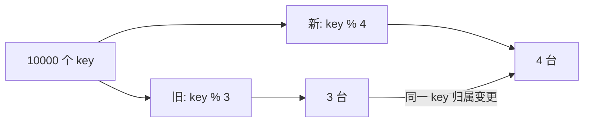
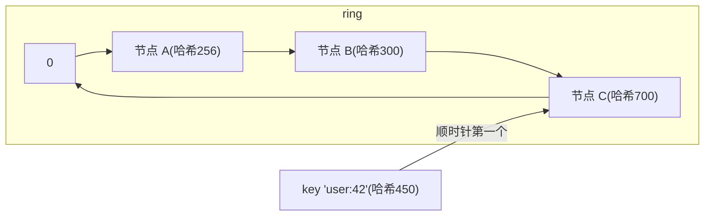

**TL;DR：** 一致性哈希（consistent hashing）解决的是**节点变更的最小冲击**问题：把服务器先哈希散落在 `[0, 2^32)` 的环上，key 哈希后**顺时针找第一个服务器**。**加一台机器，平均只有约 1/(N+1) 的 key 搬家**；而 `hash(key) % N` 加机器，理论上 (N-1)/N（10 台时约 90%）的 key 全换归属——缓存当场雪崩。虚拟节点（virtual node）把每台真实机器在环上散布成几百个点，照顾小集群的均衡。代价是牺牲"完美均匀"——你买的是"变更时可控的最小重建"。

## 一、为什么 `%N` 会炸

`key % N` 下，集群从 3 台变 4 台：



普通取模算法里，**只有 `key % 3 == key % 4` 的 key 才留在原机器**，其余全部重新归属。10 台变 11 台，理论上约 90%（`(N-1)/N`）的 key 换一次定位——对缓存就是从远端回源头，服务端全空白。

## 二、环的规则

把哈希值放到数轴并首尾相接，画成环：



规则就两条：

1. 服务器本身也哈希成一个环上的点（0..2^32-1）；
2. key 哈希后，沿环**顺时针**找第一个服务器点，它算出这道 key 归属谁。

**增删只波及邻居**：在环上 A、B 之间加一个节点 D，只有"原属于 B 又落在 A–D 段上的 key"会改归 D。统计上每加一个节点，平均约 **1/(N+1) 的 key 搬家**（N 是旧节点数）。这就是 `%N` 约 90% 与一致性哈希约 10%（1/(N+1), N=10 时约 9%）的差别——接近一个数量级。

## 三、把它算出来（可复现）

```python
import hashlib, random

def node_hash(x): return int(hashlib.md5(x.encode()).hexdigest()[:8], 16)

nodes = [f"N{i}" for i in range(3)]                       # 3 台服务器
ring = sorted((node_hash(n), n) for n in nodes)

def locate(key, ring):
    v = node_hash(key)
    for pos, n in ring:
        if pos >= v: return n
    return ring[0][1]

keys = [str(random.random()) for _ in range(100_000)]
old = {k: locate(k, ring) for k in keys}

ring4 = sorted((node_hash(n), n) for n in nodes + ["N3"])  # 加第 4 台

moved = sum(1 for k in keys if locate(k, ring) != locate(k, ring4))
print(f"key 总数 100000,加 1 台后搬家比例 = {moved/100000:.1%}")
# 约 25%(=1/4)；而 %N 版约 75%(=(N-1)/N)
```

这个脚本在真实环境跑，你会看到搬家比例贴近 **1/(N+1)**，而不是绝大部分。

## 四、为什么还要虚拟节点

物理环上的 3 台机器，哈希值可能挤在一起（两节点相隔极近），左边那台几乎没生意，右边那台扛全部。**虚拟节点（virtual node / vnode）** 的办法：每台真实机器在环上放 100~1000 个"影子点"（例如 `N0-1、N0-2、...`），把负载在环上打散到很多小段：

- 好处：小集群也摊匀；一台坏掉时，它的一百个影子点把负载扩散给各自的下一跳，而不是全砸到唯一邻居。
- 代价：内存（表 1000×N 的点）与**本质仍是舍入**：它不能保证完全均分，只能"统计上近似均衡"。

## 五、它不解决什么

一致性哈希是"缓存清空"问题的局部解，它负责的边界很窄：**把节点变更的重映射限定在邻居**。它**不解决**同一 key 的陈旧值（改归属前旧节点还留着值，要配合过期），**也不解决**热点 key（一个 hot key 落到唯一节点照样打爆）。热点要另加一层（热点多副本 / 多 vnode）——那是缓存一致性别的账。

## 结论
一致性哈希的意义是把"变更"从 O(N) 降到 O(1/N) 量级的搬迁：**加节点只影响环上邻居的一段,平均 1/(N+1) 的 key**，相比 `%N` 的 (N-1)/N 是个天壤之差。虚拟节点补平衡，代价是环上多 N×N 个点。记住一条裁剪线：**一致性哈希 = 以"均衡"换"从容"；冷启动的极不均衡要用 vnode 修。**

下一步：把上面脚本里的节点数改成 10，对比 `%` 与 ring 的搬家比例；之后想想去年那场缓存雪崩究竟是"缓存清空"还是"哈希分级"——用"加一台机器"的演练就能把隐患测出来。

## 参考资料
1. 一致性哈希（Consistent Hashing）词条，含 Karger 原论文出处—— https://en.wikipedia.org/wiki/Consistent_hashing
2. libketama：Ketama 一致性哈希实现（memcached 客户端）—— https://github.com/rj/ketama
3. Redis Cluster 哈希槽方案—— https://redis.io/docs/reference/cluster-spec/

> 延伸阅读：缓存命中率之战的另一本账见[缓存一致为什么比缓存命中难](/writing/cache-consistency)；缓存雪崩时后端被打穿的高可用防线见[限流、熔断与降级：高可用三件套的权衡](/writing/rate-limiting-circuit-breaker)；把 key 分布换成 trace 数据后，你要的是[分布式追踪：从一次请求的一生](/writing/distributed-tracing-otel)。