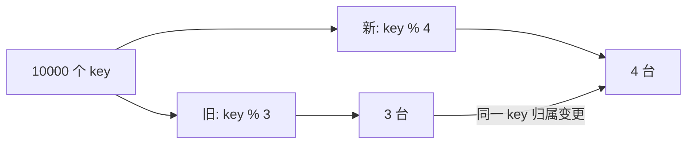
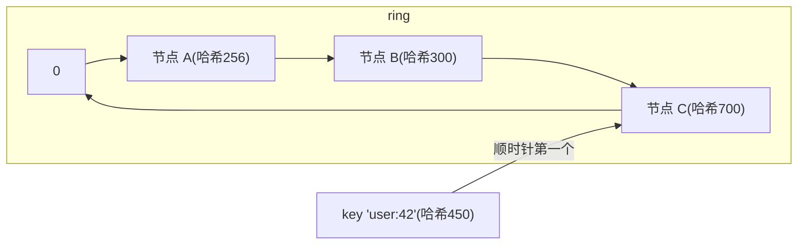

**TL;DR：** 一致性哈希（consistent hashing）解决的是**节点变更的最小冲击**问题：把服务器先哈希散落在 `[0, 2^32)` 的环上，key 哈希后**顺时针找第一个服务器**。从旧的 `N` 台增加到 `N+1` 台时，环的**平均期望**约有 `1/(N+1)` 的 key 搬家；相同输入下，普通 `hash(key) % N` 的理论移动比例约为 `N/(N+1)`。本篇用 100000 个确定性 key 做 3→4 对照：环搬动 **14.553%**，取模搬动 **74.828%**；14.553% 不是普遍常数，而是这组节点哈希位置的观测。虚拟节点用更多环点降低位置方差，但不自动解决热点、陈旧值或副本一致性。

## 一、为什么 `%N` 会炸

`key % N` 下，集群从 3 台变 4 台：



普通取模算法里，**只有 `key % 3 == key % 4` 的 key 才留在原机器**，其余全部重新归属。旧集群从 `N` 台变 `N+1` 台时，均匀哈希下理论移动比例约为 `N/(N+1)`；10 台变 11 台约 **90.91%**。对缓存来说，这意味着大部分 key 需要重新回源，不能把“加一台”当作无感扩容。

## 二、环的规则

把哈希值放到数轴并首尾相接，画成环：



规则就两条：

1. 服务器本身也哈希成一个环上的点（0..2^32-1）；
2. key 哈希后，沿环**顺时针**找第一个服务器点，它算出这道 key 归属谁。

**增删只波及邻居**：在环上 A、B 之间加一个节点 D，只有"原属于 B 又落在 A–D 段上的 key"会改归 D。统计上每加一个节点，平均约 **1/(N+1) 的 key 搬家**（N 是旧节点数）。这就是 `%N` 约 90% 与一致性哈希约 10%（1/(N+1), N=10 时约 9%）的差别——接近一个数量级。

## 三、把它算出来（可复现）

```python
import hashlib, random

def node_hash(x): return int(hashlib.md5(x.encode()).hexdigest()[:8], 16)

nodes = [f"N{i}" for i in range(3)]                       # 3 台服务器
ring = sorted((node_hash(n), n) for n in nodes)

def locate(key, ring):
    v = node_hash(key)
    for pos, n in ring:
        if pos >= v: return n
    return ring[0][1]

keys = [str(random.random()) for _ in range(100_000)]
old = {k: locate(k, ring) for k in keys}

ring4 = sorted((node_hash(n), n) for n in nodes + ["N3"])  # 加第 4 台

moved = sum(1 for k in keys if locate(k, ring) != locate(k, ring4))
print(f"key 总数 100000,加 1 台后搬家比例 = {moved/100000:.1%}")
# 约 25%(=1/4)；而 %N 版约 75%(=(N-1)/N)
```

把随机 key 改成固定 key 后，当前入口给出一组可以逐字复核的输出：

```bash
python3 experiments/consistent-hashing-boundary/consistent_hash.py
# keys=100000
# ring_moved=14553 ratio=14.5530%
# modulo_moved=74828 ratio=74.8280%
# ring_positions=[(1801024262, 'N0'), (2260485093, 'N1'), (2884504697, 'N3'), (3343614470, 'N2')]
```

环的平均期望仍是 `1/(N+1)`；但只有一次加节点、只有 3 个物理节点时，新增节点恰好切到多大区间取决于它的环位置，本例的 14.553% 低于 25% 不是算法失效。虚拟节点的价值之一，就是把这种小样本位置方差摊平。

## 四、为什么还要虚拟节点

物理环上的 3 台机器，哈希值可能挤在一起（两节点相隔极近），左边那台几乎没生意，右边那台扛全部。**虚拟节点（virtual node / vnode）** 的办法：每台真实机器在环上放 100~1000 个"影子点"（例如 `N0-1、N0-2、...`），把负载在环上打散到很多小段：

- 好处：小集群也摊匀；一台坏掉时，它的一百个影子点把负载扩散给各自的下一跳，而不是全砸到唯一邻居。
- 代价：内存（表 `V×N` 个点）与**本质仍是舍入**：它不能保证完全均分，只能“统计上近似均衡”。Vnode 越多，环查找和成员变更维护也越贵。

## 五、它不解决什么

一致性哈希是"缓存清空"问题的局部解，它负责的边界很窄：**把节点变更的重映射限定在邻居**。它**不解决**同一 key 的陈旧值（改归属前旧节点还留着值，要配合过期），**也不解决**热点 key（一个 hot key 落到唯一节点照样打爆）。热点要另加一层（热点多副本 / 多 vnode）——那是缓存一致性别的账。

## 六、结论：一致性哈希用局部搬迁换扩容从容

一致性哈希的意义是把节点变更的平均搬迁比例控制在 `1/(N+1)` 量级：**加节点只切走环上邻居的一段**；同一组 3→4 确定性输入中，环为 14.553%，取模为 74.828%。不要把 14.553% 或 25% 当成单次发布的承诺，生产选型还要测节点哈希位置、vnode 数量、热点和缓存回源能力。记住一条裁剪线：**一致性哈希 = 用局部搬迁换扩容从容；要均衡则用 vnode，不能靠环本身许诺完美均分。**

下一步：把入口中的物理节点改成 10，并分别运行 1、10、100 个 vnode 的多轮实验，记录搬迁比例的均值与最大值；再把缓存回源 QPS 和热 key 单独加入模型。只有同时满足重映射、负载和回源容量，扩容演练才有生产意义。

## 参考资料
1. Karger 等人的一致性哈希论文—— https://www.cs.princeton.edu/courses/archive/fall09/cos518/papers/chash.pdf
2. libketama：Ketama 一致性哈希实现（memcached 客户端）—— https://github.com/rj/ketama
3. Redis Cluster 哈希槽方案—— https://redis.io/docs/reference/cluster-spec/

实验入口：`experiments/consistent-hashing-boundary/consistent_hash.py`；本次命令、环境和原始输出：`evidence/consistent-hashing-minimal-remap/2026-08-16-local/`。

> 延伸阅读：缓存命中率之战的另一本账见[缓存一致为什么比缓存命中难](/writing/cache-consistency)；缓存雪崩时后端被打穿的高可用防线见[限流、熔断与降级：高可用三件套的权衡](/writing/rate-limiting-circuit-breaker)；把 key 分布换成 trace 数据后，你要的是[分布式追踪：从一次请求的一生](/writing/distributed-tracing-otel)。
