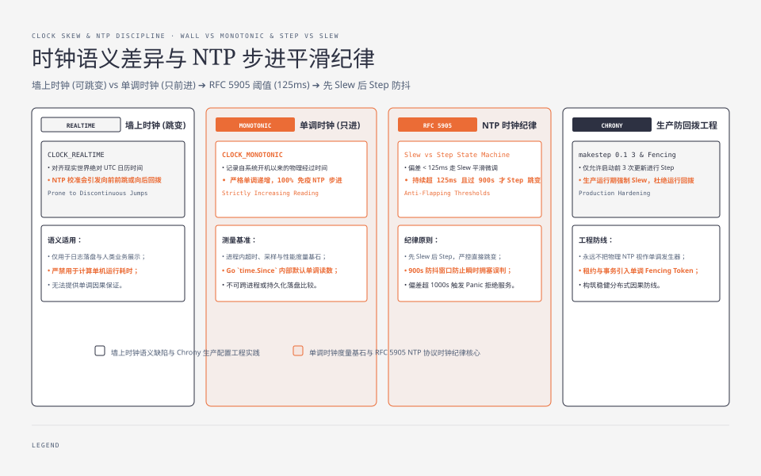
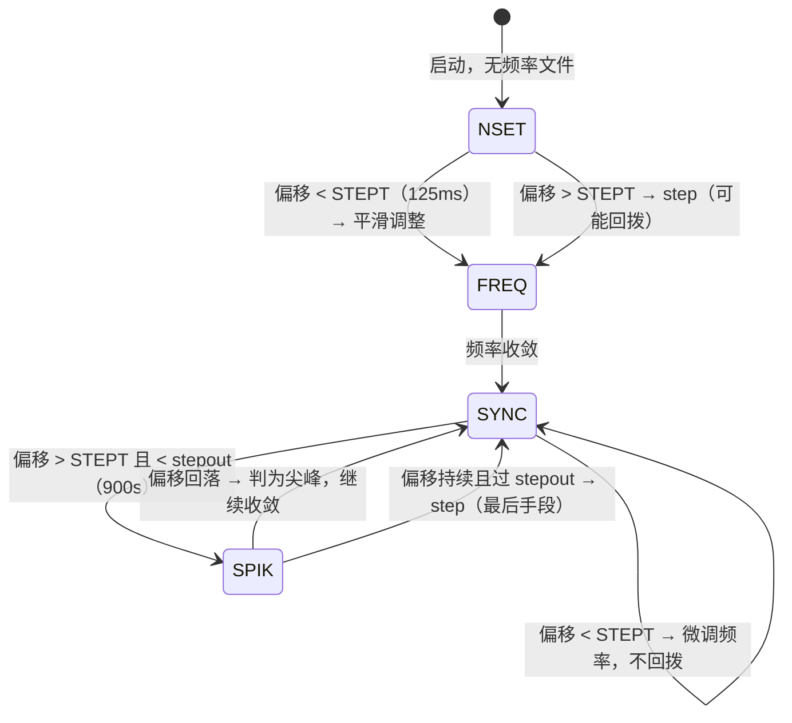
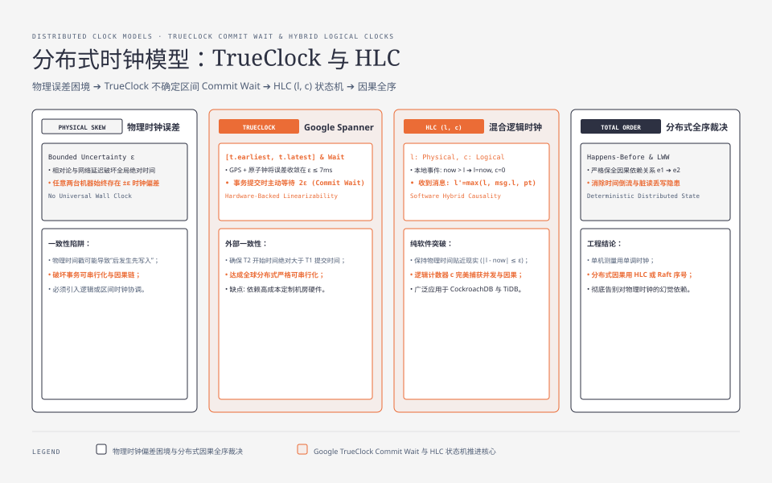
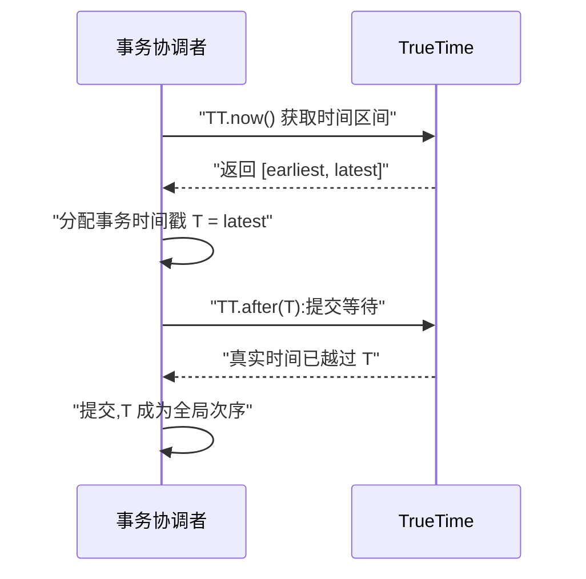
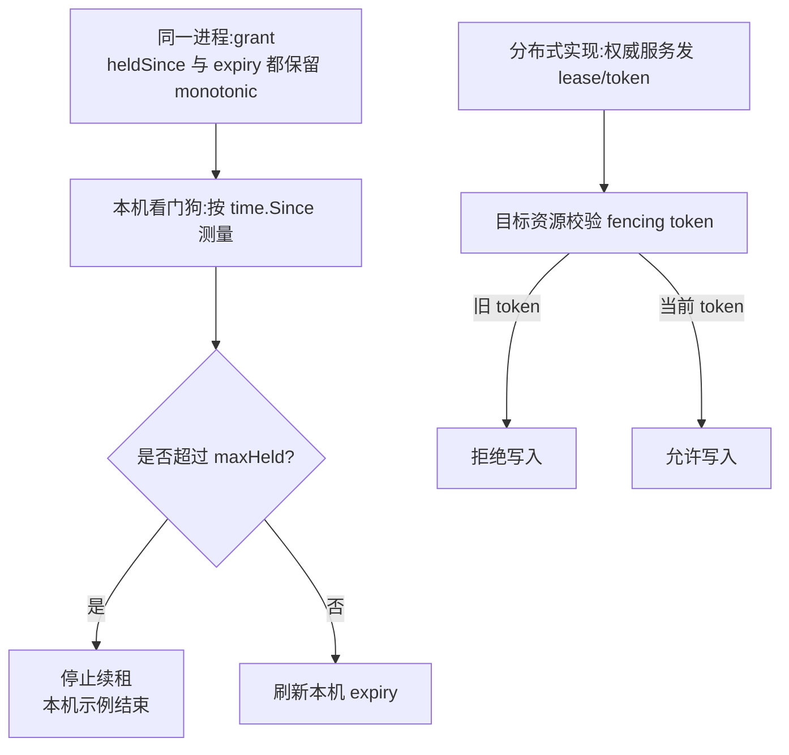
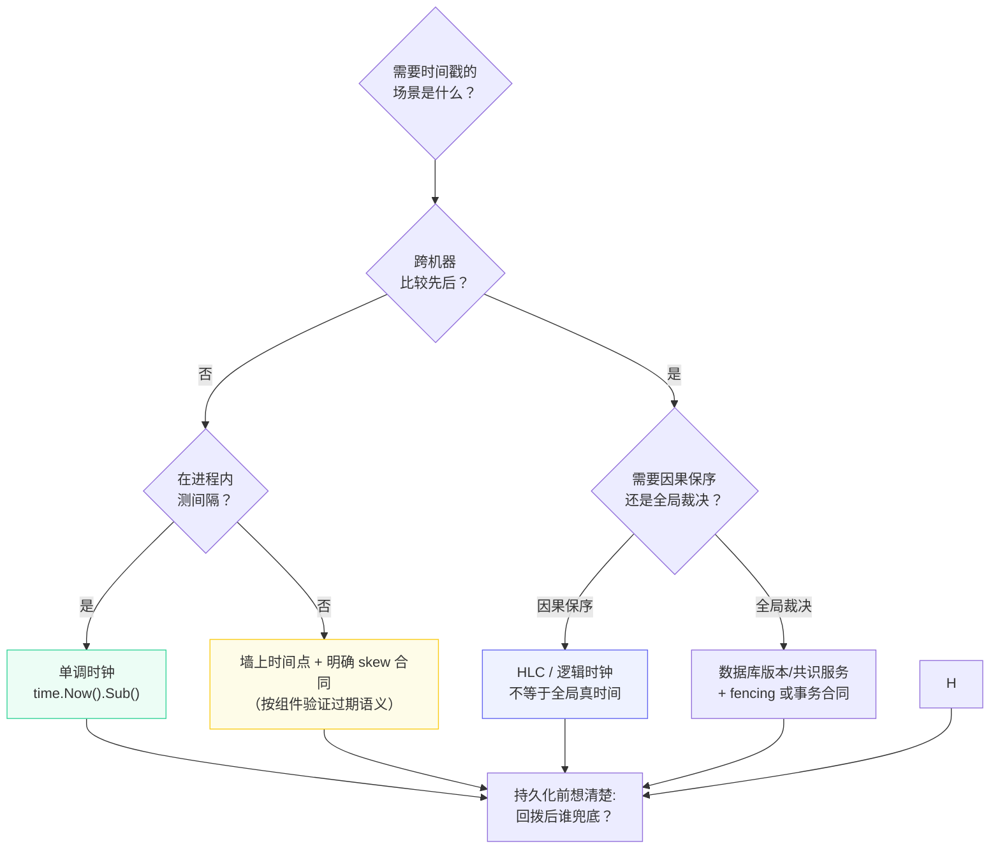

**TL;DR：** 服务器同时有墙上时钟、单调时钟和应用层逻辑时钟。墙上时钟会因同步策略跳变，单调时钟适合测量本机经过时间，HLC/版本号适合传播因果或裁决写入。回拨并不对所有组件造成同一种后果：绝对到期时间通常会延后过期，时钟前跳可能提前过期；JWT、证书、cron 还要分别判断本机偏快还是偏慢。工程上先选对时钟语义，再把 skew、取消、fencing、幂等和观测写进合同，而不是把 NTP 当成单调序列发生器。

## 一、两种时钟：一个会骗人，一个不会

操作系统给用户程序提供两种时间语义：

| 时钟类型 | 语义 | 能否回拨 | 用途 |
| :--- | :--- | :--- | :--- |
| 墙上时钟（REALTIME） | "当前日期时间" | **能**（NTP step） | 日志时间戳、过期时间、业务显示 |
| 单调时钟（MONOTONIC） | "自启动以来的时间" | 否（只前进） | 测量间隔、超时、采样基准 |

墙上时钟的意义是**与真实世界对齐**——但它对齐的手段（NTP 校准）正是回拨的来源。单调时钟的意义是**测量**：两次读数的差，就是真实的经过时间，它不受 NTP 影响。Go 的标准库把这个区别藏在了 `time.Now()` 里：

```go
t1 := time.Now()          // 内部同时记 wall + mono 两个读数
time.Sleep(100 * time.Millisecond)
t2 := time.Now()
elapsed := t2.Sub(t1)     // 同一进程内优先使用 monotonic reading
```

`t2.Sub(t1)` 在两个 `time.Time` 都保留 monotonic reading 时使用单调读数；NTP 把墙上时钟拨回一小时，进程内的测量仍不依赖该跳变。它也不是跨睡眠、跨进程或跨机器的绝对保证。一旦**持久化**（写数据库、序列化传远程），单调读数会被丢弃，只剩墙上时钟——**回拨风险随之而来**。这就是为什么“比较本机经过时间”要留在进程内，而“记录时间点”必须明确接受墙上钟的误差。

## 二、回拨从哪来：NTP 的 step 与 slew

NTP 客户端发现本机与服务器偏差时，有两种校准方式：

- **step（步进）**：某个实现和配置判断偏差超过 step 阈值时，**直接跳变**系统时间——可能前进，也可能**倒退**。这是回拨的根源；阈值、panic 行为和是否允许 step 不能从“使用 NTP”四个字推出。
- **slew（平滑）**：偏差较小时，通过微调时钟频率逐步追上，时间连续前进，不回拨。chronyd 默认不 step、只做平滑调整，发行版常配置 `makestep 1 3` 允许启动初期 step。

step 的瞬间画出来就是回拨本身——墙上时钟往回跳了一截，而单调时钟从头到尾没受影响：



用 `timedatectl` 可以查看本机当前策略与最近校准：

```bash
timedatectl show | grep -E "NTPSynchronized|NTPEnabled"
# 系统启用了 NTP,并不意味着不会 step——
# 不同实现的 step 阈值和启动期策略不同;chronyd 默认逐步校正,是否 step 由配置决定
```

云厂商的工程对策通常是提供更稳定的时间源和明确的同步配置，但不能把时间源质量直接等同于应用层单调性。以 AWS 为例，Amazon Time Sync Service 提供 EC2 可访问的 UTC 参考源并处理 leap-second smear；实例仍要核对 chrony/Windows 配置、offset 和是否允许 step。**更好的时间源降低跳变概率，不替代单调计时、fencing 或业务幂等。**

## 三、规范解剖：NTP 时钟纪律——RFC 5905 的阈值与状态机

`step` 与 `slew` 的关系可以从 RFC 5905 的 NTP 算法描述中理解，但实际阈值、状态机和默认配置还取决于具体实现与发行版。偏移量与处理动作的关系定义在 §10：

> §10："STEP means the offset is less than the panic threshold, but greater than the step threshold STEPT (125 ms). In this case, the clock is stepped to the correct offset, but since this means all peer data have been invalidated, all associations MUST be reset and the client begins as at initial start. ADJ means the offset is less than the step threshold and thus a valid update."

三个阈值参数（§11.3）：

| 参数 | 值 | 含义 |
| :--- | :--- | :--- |
| STEPT | 125 ms | RFC 5905 描述的 step 阈值参数 |
| WATCH | 900 s | RFC 5905 描述的 stepout 防抖参数 |
| PANICT | 1000 s | RFC 5905 描述的 panic 参数；实现可能禁用或改配置 |

状态机（§11.3 节选）规定：在 NSET（刚启动、无频率文件）状态下，偏移小于 STEPT 就 "adjust time"（slew），大于 STEPT 才 "step time"；进入 SYNC 稳定态后，偏移小于 STEPT 一律 "adjust freq, adjust time"（slew），大于 STEPT 还要看 stepout 窗口：

> §11.3 状态转移表（节选）："| NSET | theta < STEP ->FREQ / adjust time | theta > STEP ->FREQ / step time | no frequency file |" "| SYNC | theta < STEP ->SYNC / adjust freq, adjust time | theta > STEP: if < 900 s ->SPIK else ->SYNC / step freq, step time | normal operation |"



step 是最后手段，而且有防抖约束：

> §11.3："A step clock action is implemented by setting the clock directly, but this is done only after the stepout threshold WATCH (900 s)... This resists clock steps under conditions of extreme network congestion."

解读出四条纪律：

- **先 slew 后 step**：在 RFC 5905 这组参数下，小偏移走调整路径，大偏移才进入 step 候选；具体实现可能改阈值、禁用 panic 或配置启动期 step；
- **step 有防抖窗口**：系统运行不满 stepout（900s）不允许 step——防止极端网络拥塞期间把抖动误判成真偏差；
- **超过 panic 阈值直接终止**：偏移 > PANICT（1000s）时协议放弃修正；
- **step 失效全部 peer 数据**："all associations MUST be reset"，step 后本机从初始状态重新收敛——这就是回拨之后"重新建立正确时间"的协议层原因。

chrony 把"默认不 step"贯彻到了用户配置层，官方文档对 `makestep` 指令的说明：

> chrony 官方文档（makestep）："Normally chronyd will cause the system to gradually correct any time offset, by slowing down or speeding up the clock as required... This directive forces chronyd to step the system clock if the adjustment is larger than a threshold value, but only if there were no more clock updates since chronyd was started than a specified limit... makestep 0.1 3: This would step the system clock if the adjustment is larger than 0.1 seconds, but only in the first three clock updates."

chronyd 默认会逐步校正时钟；`makestep 阈值 次数` 可以把 step 限制在启动后的前 N 次更新。是否允许后续 step 由配置决定，不能把一个发行版的默认值写成所有机器的合同。可运行演示：`cd experiments && go run ./snowflake`，它只模拟雪花 ID 的回拨策略，不改变本机系统时钟；2026-08-17 本机输出见 `evidence/clock-skew-distributed-systems/2026-08-17-local/`。




## 四、破坏面：回拨瞬间，四个假设同时失效

回拨 5 秒会造成什么？取决于组件使用的是绝对到期点、经过时间还是排序版本；不能把所有后果归成“提前过期”：

**① 雪花 ID：逆序，某些实现还会重复。** 雪花算法的时间部分通常取毫秒级墙上时钟（`timestamp = now() - epoch`），同一毫秒内靠序列号区分。回拨后 `now()` 变小，新 ID 的时间位可能小于旧 ID；如果实现让序列号在回拨后重置，且时间重新落回已经使用过的值，还可能复用整个时间/worker/sequence 组合。正确实现必须显式处理：

```go
var (
    lastTS int64
    seq    int64
)

func nextID(workerID int64) (int64, error) {
    now := wallMillis() // 墙上时钟毫秒
    if now < lastTS {
        // 方案一:等待回拨量,时钟追上再发(阻塞)
        delta := lastTS - now
        if delta > maxBackoff {
            // "clock skew too large":回拨量超过上限,拒绝服务
            return 0, errors.New("clock skew too large")
        }
        time.Sleep(time.Duration(delta) * time.Millisecond)
        now = wallMillis()
    }
    if now == lastTS {
        seq++
        // "seq exhausted":同一毫秒内序列号耗尽
        if seq >= maxSeq { return 0, errors.New("seq exhausted") }
    } else {
        seq = 0
    }
    lastTS = now
    return now<<22 | workerID<<12 | seq, nil
}
```

Twitter 的 Snowflake 设计把回拨作为显式错误条件；其他实现可能选择等待、拒绝、摘除节点或使用逻辑序列。具体阈值必须绑定实现和证据，不能把某个项目的毫秒数外推成通用规则。共同约束是：**在无法证明唯一性的回拨窗口内，不要继续无条件产出 ID。**

**② 缓存过期与租约：方向取决于跳变。** 如果组件把 `expires_at = wall_now + TTL` 存成绝对墙上时间，墙上钟回拨 5 秒会让 `now < expires_at` 持续更久，通常表现为**过期延后**；墙上钟前跳才会让键提前过期。Redis 文档明确记录了绝对 Unix 时间戳和系统时钟变化的关系，但不同缓存/数据库可能使用自己的时间基准。分布式租约还要考虑节点偏差、网络延迟和旧持有者恢复；不能只用“加回拨预算”推出安全，必须有权威续租、fencing token 或业务幂等。

对策：
- 测量本机续租间隔用单调钟；对外的到期点按组件合同解释；
- 租约接管必须阻止旧持有者继续写入，不能只判断 `now < expiry`；
- 过期语义要用目标缓存/数据库的文档和故障注入验证，不能从 Go `time.Time` 的行为外推。

**③ 审计日志与事件排序：顺序幻觉。** 跨机器比较事件先后时，时间戳来自各自的墙钟，NTP 偏差与回拨让"时间排序"失真——**跨机器的先后关系必须用逻辑时钟**，墙上时间戳只用于展示。

这正是 HLC（Hybrid Logical Clock）存在的理由：物理时间打底 + 逻辑计数器保留因果单调性，收到更大时间戳时本地逻辑计数递增，使 `(物理, 计数)` 形成因果保序的部分序；并发事件的并列关系仍需业务规则。

**④ 数据库的 `updated_at` 与乐观锁。** 用 `updated_at` 做版本判断时，墙上钟跳变可能让新写入的时间戳小于旧值，导致排序、冲突检测或增量抽取失真；具体是误判冲突、漏更新还是接受旧写，取决于 SQL 条件。正确的并发裁决应使用数据库自增版本、条件更新或带 fencing 的序列，不要把墙上时间当作唯一版本号。

### 一个常见的误解：NTP 会把时间拨准

**“NTP 会把时间拨准”是错的。** NTP 的目标是让本机偏移在实现和配置允许的范围内收敛，而不是提供一个跨机器零误差的排序源。step 后还需要重新收敛，期间时间戳依然可能偏离。跨机器比较时间戳必须有误差预算；需要因果关系时用消息传播的逻辑时钟，需要写入裁决时用数据库版本或 fencing。

## 五、更多破坏面：过期时间、证书与定时任务

第四节讲的是"把时间戳当单调序列用"的系统。还有一类系统把墙上时钟当**绝对参照物** 用——回拨让"参照物"本身动摇了，后果同样致命：

| 系统 | 时钟怎么被读 | 回拨 5 秒的后果 |
| :--- | :--- | :--- |
| JWT 令牌 | 校验 `exp`/`nbf` 时对比本地墙钟 | 本机前跳可能提前判 `exp` 过期；本机回拨可能延长已过期令牌或让 `nbf` 仍未到，具体取决于偏差方向 |
| TLS 证书 | 校验 `notBefore`/`notAfter` | 客户端前跳可能判证书过期，回拨可能判刚签发证书尚未生效；签发机与验证机偏差也会叠加 |
| cron 定时任务 | 墙钟判断下一次触发时刻 | 可能重复触发或跳过任务，取决于调度器如何处理时间跳变 |
| 日志聚合 | 时间戳建索引（ELK/Loki） | 时间窗口错位，查询与告警丢数据 |

**JWT 要先判断偏差方向。** JWT 的 `exp`（过期时间）与 `nbf`（生效时间）在签发时以签发机的墙钟为准，校验时以校验机的墙钟为准；RFC 7519 允许校验方为 clock skew 留少量 leeway，但没有把 30–60 秒变成通用配置。校验机前跳会提前拒绝仍在有效期内的令牌，回拨则可能接受已过期令牌；`nbf` 还可能在回拨后继续显示为未生效。leeway 越大，安全重放窗口越大，必须按凭证风险和观测数据选择，而不是照抄一个秒数。

**TLS 证书只在时间语义一致时有效。** 证书的 `notBefore`/`notAfter` 是绝对的墙上时间点，客户端校验证书时必须读本地墙钟。签发机时钟快了，`notBefore` 可能落在验证机未来；验证机时钟前跳则可能提前判 `notAfter` 已过期，验证机回拨则可能继续接受已过期证书。公网 CA 和自动续期系统因此都依赖基本可靠的时间，但具体 leeway 与错误处理由验证库决定。补救路径没有业务魔法：配置可靠时间源，监控 offset/同步状态，并在证书轮换演练中覆盖偏差方向。

**cron 用墙钟算"下一次"，但具体反应是实现合同。** 回拨可能让调度器重新看到已过的时间点，也可能被实现跳过；前跳也可能一次跨过多个触发点。`anacron` 解决的是部分停机补跑问题，不能替代幂等与重复触发防护。调度类系统应明确区分“每隔一段时间”和“对齐墙上整点”：前者可用单调计时器，后者必须记录触发点、去重键和补偿策略。

**日志时间戳是"显示型"破坏。** 日志本身不参与业务正确性，但日志平台按事件时间建索引——回拨 5 秒，新日志的事件时间小于旧日志，按时间窗查询可能错位。解法是把**事件时间（event time）与接收时间（ingest time）分开**，并为同一来源提供序号、trace/span 或 ingest sequence；接收时间也只是采集节点的墙钟，不应被误称为全局单调时间。回拨最隐蔽的伤害往往不是业务错误，而是排查手段本身失灵。

## 六、混合逻辑时钟 HLC：既能排序，又不回拨

第四节 ③ 说"跨机器的因果关系不能只看墙钟"。朴素 Lamport 时钟能表达因果，但时间戳与物理时间完全脱钩——调日志、看监控时不直观。HLC（Hybrid Logical Clock）把两者缝合：**物理时间打底，逻辑计数补序**。它由 Kulkarni、Demirbas 等人 2014 年的论文 *Logical Physical Clocks and Consistent Snapshots in Globally Distributed Databases* 给出完整算法（Figure 5）。HLC 可以保留因果顺序；并发事件之间的先后仍是人为的字典序，不等于真实发生顺序或全局业务裁决。

HLC 的每个事件带一个二元组 `(l, c)`：`l` 是"本机见过的最大物理时间"，`c` 是同一 `l` 下的逻辑计数器。三条规则：

1. **本地事件/发送事件**：`l = max(本机物理时间, 本机 l)`；`l` 没变则 `c++`，变了则 `c = 0`；逻辑计数器要有溢出策略，不能假设它永远装得下；
2. **接收事件**：`l = max(本机物理时间, 本机 l, 消息 l)`；按"l 与谁相等"分四分支更新 `c`；
3. **比较**：字典序——`(a, b) < (c, d)` 当且仅当 `a < c` 或（`a = c` 且 `b < d`）。

可运行的最小 HLC 模型（把代码存成 `main.go`，`go run main.go` 直接跑，依赖 Go 1.21+ 的 `max` 内建；它不是跨节点生产实现）：

```go
package main

import (
	"fmt"
	"sync"
)

// hlc 维护 (l, c) 二元组:l 是"本机见过的最大物理时间",
// c 是 l 相同时区分先后次序的逻辑计数器。
type hlc struct {
	mu sync.Mutex
	l  int64
	c  int64
}

type clock struct{ pt int64 }

var wall clock

func now() int64 { return wall.pt }

// event:本地事件(发消息、写日志、生成时间戳)。
// l 跟随物理时间推进;只有 l 没变时才递增 c,否则 c 归零——c 因此有界。
func (h *hlc) event() (int64, int64) {
	h.mu.Lock()
	defer h.mu.Unlock()
	if l := now(); l > h.l {
		h.l, h.c = l, 0
	} else {
		h.c++
	}
	return h.l, h.c
}

// recv:收到携带 (ml, mc) 的消息。l 取三者的最大值,
// 再按"l 与谁相等"分四分支更新 c——这是论文 Figure 5 的原样实现。
func (h *hlc) recv(ml, mc int64) (int64, int64) {
	h.mu.Lock()
	defer h.mu.Unlock()
	l := max(h.l, max(ml, now()))
	switch {
	case l == h.l && l == ml:
		h.c = max(h.c, mc) + 1
	case l == h.l:
		h.c++
	case l == ml:
		h.c = mc + 1
	default:
		h.c = 0
	}
	h.l = l
	return h.l, h.c
}

// before:(a,b) 与 (c,d) 的字典序比较。
func before(a, b, c, d int64) bool { return a < c || (a == c && b < d) }

func main() {
	// A 在物理时间 100 生成事件;同一物理时刻内再发一个事件,c 递增
	wall.pt = 100
	a := &hlc{}
	la, ca := a.event()
	la2, ca2 := a.event()
	fmt.Println("A 两次事件:", la, ca, "->", la2, ca2)

	// B 的物理时间比 A 慢 5 个刻度(模拟时钟回拨):
	// max 规则让 B 的时间戳追平 A,消息方向的先后不丢
	wall.pt = 95
	b := &hlc{}
	lb, cb := b.recv(la, ca)
	fmt.Println("B 收到 A 的消息后:", lb, cb)
	fmt.Println("消息方向保序:", before(la, ca, lb, cb))
}
```

运行输出：

```
A 两次事件: 100 0 -> 100 1
B 收到 A 的消息后: 100 1
消息方向保序: true
```

注意 B：它的物理时钟回拨到了 95，但 `l` 被 `max` 规则钉在 100 上——**在该 HLC 实例中，逻辑时间不会因为本机墙钟回拨而倒退**，同时因为 c 的参与，消息方向（A → B）的先后被保留。论文用三条性质概括这个性质：

- **因果保序**：若 `e` happens-before `f`，正确传播与更新后应有 `(l.e, c.e) < (l.f, c.f)`；并发事件的排序不代表它们有真实先后；
- **贴近物理但不等于物理**：HLC 的 `l` 不应落后于本地已观察到的物理时间，但它可能因为收到远端时间而领先本机；不能直接把它当 TTL 的过期依据；
- **回拨可解释**：`l` 比本地物理时间大，可能来自本地历史或收到的远端时间；系统必须记录传播链和版本边界，不要把 HLC 当作“全球真时间”。

工程上还有一条实惠：论文讨论过压缩表示——`l` 用 48 位、`c` 用 16 位，但这不是所有实现的固定线格式；序列化宽度、溢出和比较规则必须写入协议。分布式数据库采用 HLC 或同类时间戳时，还会把它与事务版本、锁和不确定性窗口组合，不能只凭一次 `max` 就得到跨系统一致性。

## 七、Google TrueTime：用区间对冲不确定性

HLC 的立场是"不信任物理时间，用逻辑兜底"。Google Spanner 的 TrueTime 走了另一条路：**不假装知道精确时间，而是返回一个确定包含真实时间的区间**。

TrueTime 的 API 只有三个调用：

- `TT.now()`：返回 `[earliest, latest]`，真实时间一定在区间内，半宽即不确定度 `ε`；
- `TT.after(t)`：`t` 是否**确定** 在过去（`t < earliest`）；
- `TT.before(t)`：`t` 是否**确定** 在未来（`t > latest`）。

区间的不确定度来自时间源本身：Spanner 论文描述了**GPS 与原子钟等独立时间源**的组合，`ε` 由时间源和本地时钟误差共同决定；论文中的毫秒级数字是其历史系统报告，不能当成今天所有部署的固定保证。

区间表示本身没有消除不确定性，真正消除外部一致性歧义的是**提交等待（commit wait）**：事务拿到时间戳 `T` 后，在提交前必须等 `TT.after(T)` 成立——即等真实时间越过 `T` 的区间上界。等待时间取决于当时的 `ε`，不能固定写成一个毫秒数。



**回拨的风险被时间不确定性合同吸收**：TrueTime 不是简单地把本机墙钟当作真值，而是用区间和提交等待建立外部一致性。代价是提交延迟取决于 `ε` 与实现，换取的是 Spanner 定义下的外部一致性；这不是普通应用拿 HLC 就能自动获得的性质。

对比第六节：HLC 是"逻辑时间在物理时间之上修补"，TrueTime 是"物理时间本身带不确定性预算"。前者不需要专属时钟硬件，但仍需要正确传播、溢出处理和业务版本语义；后者是 Spanner 体系的基础设施与协议组合，不能被普通服务用一个时间戳字段替代。

## 八、PTP：亚微秒对齐的另一条路

第三节聊的 NTP 精度是毫秒级，而且互联网链路的抖动（RTT 不对称）决定了它很难再进一步。要更准的时间，工程界用的是 **PTP（Precision Time Protocol，IEEE 1588）**：同步报文在局域网内做精密交换，主从时钟链通过测量链路延迟校准偏移。

PTP 与 NTP 的关键差异在**时间戳打在哪儿**：

| 维度 | NTP | PTP |
| :--- | :--- | :--- |
| 时间戳位置 | 软件层（协议栈） | 网卡硬件（PHC，PTP Hardware Clock） |
| 精度 | 通常为毫秒量级，取决于网络与实现 | 在支持的硬件/链路上可达亚微秒量级 |
| 部署前提 | 互联网可达即可 | 交换链路设备支持硬件时间戳 |
| 典型场景 | 通用服务器 | 电信、金融、音视频、数据中心 |

Linux 上的标准实现是 linuxptp 包，两个守护进程分工：`ptp4l` 跑 PTP 协议、同步网卡上的 **PHC 硬件时钟**（报文的时间戳由网卡硬件打，不受系统中断与调度抖动影响）；当使用硬件时间戳时，系统时钟本身不会自动跟随 PHC，官方文档专门说明需要 `phc2sys` 把系统时钟与 PHC 同步。RHEL 文档给的对比结论：硬件时间戳的 PTP 达到亚微秒级精度，远好于 NTP 的毫秒级；而纯软件时间戳的 PTP 精度会显著退化。

PTP 能消灭回拨吗？不能——它只是让时钟源更准，具体 step/slew 仍由同步链路和配置决定。但 PHC 与系统钟的同步链路（ptp4l/phc2sys）本身也可能出错，上层仍要用单调钟测量、fencing/版本裁决和故障注入。**PTP 是把时钟的"底"抬高，不是把时钟的"谎"变成真**。

## 九、租约实战：本机单调计时不等于分布式锁

第四节 ② 说"续租间隔用单调钟测量"。下面的代码只演示**同一进程内**如何用 Go `time.Time` 的 monotonic reading 测量持有时长；它不是分布式租约。跨进程/跨机器后，序列化会丢掉 monotonic reading，远端只能看到一个墙上到期点，必须再引入权威租约服务、fencing token 和目标资源的过期 token 拒绝。

```go
package main

import (
	"fmt"
	"sync"
	"time"
)

const (
    leaseDuration = 2 * time.Second  // 本机演示的短租期
    maxHeld       = 10 * time.Second // 本机进程允许的最长持有时长
)

type lease struct {
	mu        sync.Mutex
	heldSince time.Time // 单调钟读数:从授予到现在过了多久
    expiry    time.Time // 同一进程内仍带 monotonic reading 的到期点
}

// grant 由本机互斥区的获胜者调用一次；不代表远端已经获得锁。
func (l *lease) grant() {
	l.mu.Lock()
	defer l.mu.Unlock()
    now := time.Now()
    l.heldSince = now
    l.expiry = now.Add(leaseDuration)
}

// renew 由持有者的看门狗周期调用。
// 裁决依据是同一进程内的 monotonic reading；它不是跨机器的 fencing。
func (l *lease) renew() bool {
	l.mu.Lock()
	defer l.mu.Unlock()
    if time.Since(l.heldSince) >= maxHeld {
		return false // 面额用尽,把锁让出去
	}
    l.expiry = time.Now().Add(leaseDuration)
	return true
}

// valid 只对同一进程内的观察者有意义；序列化 expiry 后不能复用这个保证。
func (l *lease) valid() bool {
	l.mu.Lock()
	defer l.mu.Unlock()
	return time.Now().Before(l.expiry)
}

func main() {
	l := &lease{}
	l.grant()
	fmt.Println("granted, valid:", l.valid())
	time.Sleep(1200 * time.Millisecond)
    fmt.Println("renew:", l.renew())
	fmt.Println("valid:", l.valid())
}
```



这段代码只能支持三个本机判断：持有多久、是否继续续租、同一进程里的到期判断。它不能支持“无双持有窗口”：进程暂停后可能恢复，网络分区期间旧持有者可能继续写，两个节点也可能对同一个墙上到期点有不同看法。Redis/etcd 的 lease API 能提供 TTL、keepalive 或失效通知，但是否能阻止旧持有者写入，要看目标资源是否检查 fencing token；API 名字本身不是 fencing 合同。

## 十、选型：把"时钟不可信"写进架构



三条防线按成本递增排列：

1. **能用单调钟，绝不碰墙钟**——超时、间隔、采样全部单调；墙钟只出现在展示与持久化边界；
2. **墙钟必须用时，按组件写清 skew 合同**——雪花 ID 等待/哨兵，缓存/数据库按文档验证过期语义，锁租约引入权威服务与 fencing；
3. **最顶层一致性不依赖墙钟排序**——因果关系用 HLC/消息序号，全局写入裁决用数据库版本、共识或事务合同，业务重复仍交给幂等与状态机（见[重试会放大一切错误:幂等性工程的完整账本](/writing/idempotency-engineering)）。

架构评审时值得把"时钟回拨"放进故障注入清单：在测试环境把 NTP 校准改成每 30 秒 step 一次，观察雪花 ID、缓存、租约、审计日志四类系统是否还能正确运行——**能在回拨下无感运行的系统，才算真的把时间当作一种可能出错的外部输入**。

## 参考资料

1. [Go `time` 包文档：Monotonic Clocks](https://pkg.go.dev/time)（进程内单调读数与序列化边界）
2. [Linux 内核文档：timekeeping](https://docs.kernel.org/core-api/timekeeping.html)（REALTIME 与 MONOTONIC 的语义差异）
3. [chrony FAQ：step 与 makestep](https://chrony-project.org/faq.html)（默认 slew 与配置化 step）
4. [AWS：EC2 时间参考源](https://docs.aws.amazon.com/AWSEC2/latest/UserGuide/configure-ec2-ntp.html)（Amazon Time Sync Service 的参考源与配置，不是 UTC-60 单调保证）
5. Twitter Engineering Blog：Snowflake（回拨处理的原始设计约束）—— https://blog.twitter.com/engineering/en_us/a/2010/announcing-snowflake
6. Kulkarni 等：HLC（Hybrid Logical Clocks）论文解读——muratbuffalo 博客—— https://muratbuffalo.blogspot.com/2014/07/hybrid-logical-clocks.html
7. [IETF RFC 5905](https://datatracker.ietf.org/doc/html/rfc5905)（NTP step/slew 参数与状态机，§10/§11.3）
8. chrony 官方文档：chrony.conf(5)（makestep 指令语义）—— https://chrony-project.org/doc/4.0/chrony.conf.html
9. Kulkarni、Demirbas 等：Logical Physical Clocks and Consistent Snapshots in Globally Distributed Databases（HLC 算法与论文原文，Figure 5）—— http://www.cse.buffalo.edu/tech-reports/2014-04.pdf
10. Google：Spanner: Google's Globally-Distributed Database（OSDI 2012，TrueTime API 与提交等待的原始出处）—— https://www.usenix.org/system/files/conference/osdi12/osdi12-final-16.pdf
11. IETF：RFC 7519 JSON Web Token（exp/nbf 语义与 clock skew leeway 建议，§4.1.4）—— https://datatracker.ietf.org/doc/html/rfc7519
12. Red Hat：Configuring PTP Using ptp4l（linuxptp、PHC 硬件时钟与 phc2sys 的官方说明）—— https://docs.redhat.com/en/documentation/Red_Hat_Enterprise_Linux/7/html/system_administrators_guide/ch-configuring_ptp_using_ptp4l
13. [Redis EXPIRE 文档](https://redis.io/docs/latest/commands/expire/)（绝对过期时间与系统时钟变化的边界）

> 延伸阅读：回拨导致的重复与逆序,最终要靠幂等与重放兜底——见[重试会放大一切错误:幂等性工程的完整账本](/writing/idempotency-engineering)；乐观锁/版本号对比,见[缓存一致为什么比缓存命中难](/writing/cache-consistency)。
