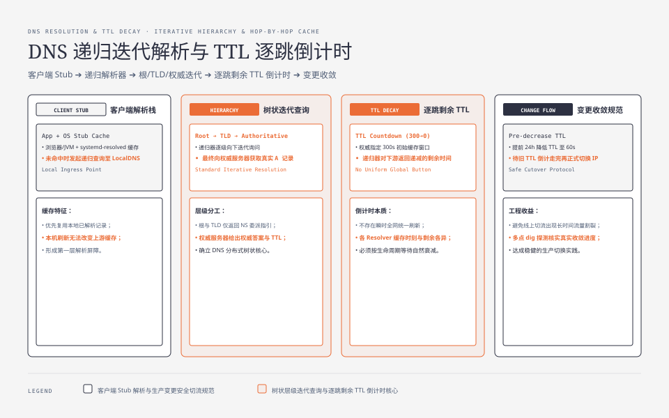
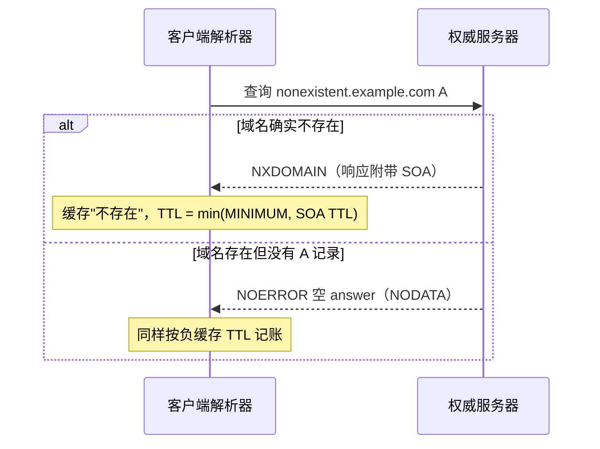
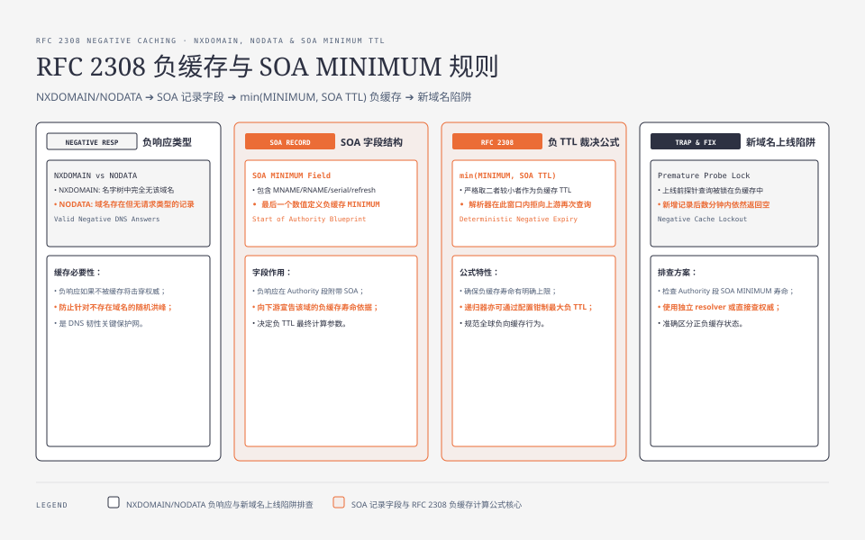

**TL;DR：** DNS 变更没有一个全网统一的“立即生效”按钮。权威服务器在响应中给出 TTL，递归解析器通常按响应中的剩余 TTL 复用缓存；客户端、企业 DNS、CDN 和 serve-stale/prefetch 策略还可能改变实际观察。`dig` 默认只查询本机配置的 resolver，不能仅凭一次低延迟或递减 TTL 证明“全网已经/尚未收敛”。另一套账是 RFC 2308 的负缓存：NXDOMAIN 与 NODATA 也会按 SOA 相关规则缓存。TTL 应按变更风险、解析负载、故障切换路径和负缓存历史共同设计，不能把 30–60 秒或 3600 秒写成通用答案。


---



## 一、事故现场：改了记录，十分钟没生效，后台全在催

一个常见事故：凌晨做故障切换，把域名的 `A` 记录指向新机房的 IP，发布完盯监控。几十分钟过去，某些健康检查仍连旧 IP。值班群立刻出现两种声音——“DNS 有缓存，要等”“缓存是不是挂了？要不要 flush”。这不是某个已保存的线上事故 raw，而是用来说明排查顺序的场景。

先别急着怪缓存。把“改 DNS 要不要等”换成可验证的问题：**你查询的是哪一个 resolver、它的答案来自哪里、响应 TTL 还剩多少、权威当前给的是什么？** 下面输出是格式示例，不代表本机当前结果：

```bash
$ dig example.com A +noall +answer
example.com.  300  IN  A  203.0.113.10
```

`300` 是这次响应允许缓存的时间上限；递归 resolver、客户端或中间服务可能有额外策略，不能从这个数字单独推出全网最后一个旧答案的时间。TTL 越大通常意味着已缓存答案的最长新鲜窗口越长，但 serve-stale、预取、负缓存和不同查询路径都要单独核对。

## 二、TTL 归谁管：权威画押，解析器倒计时

DNS 记录在**权威服务器**上带一条 TTL，定义响应允许被缓存的新鲜窗口。递归 resolver 从上游收到响应后保存过期时间，并在转发给下游时通常返回剩余 TTL；它不是每经过一跳就把 TTL 重新加满。客户端 stub resolver、OS、企业 DNS、CDN 和应用自己的缓存还可能拥有独立策略。

```text
$ dig @1.1.1.1 example.com A +noall +answer # 查询指定递归 resolver；非权威 raw
example.com.  300  IN  A  203.0.113.10     # TTL = 300
$ dig @1.1.1.1 example.com A +noall +answer # 再查同一 resolver，可能命中它的缓存
example.com.  299  IN  A  203.0.113.10     # TTL 减一
```

TTL 递减和低 `Query time` 只能作为该 resolver 路径的线索，不是“命中缓存”的单一证明；要比较权威与递归，分别查询权威 nameserver（`dig +trace` 或 `dig @authoritative-ns`）和目标 resolver，并记录时间、地点、EDNS/CDN 路径与返回值。全网收敛也不能简化成“最长 TTL + 每跳延迟”：不同 resolver 的缓存时刻、策略、stale 允许时间和客户端缓存都会改变观测。


每一层既可能读取上游，也可能独立缓存或转发。正常新鲜缓存会随着剩余 TTL 下降，到期后再查询；但递归器可能预取、serve-stale 或按运营策略钳制 TTL。正确的排查账本是“每个观察点的 resolver、返回值、剩余 TTL、查询时间和策略”，不是把每跳 TTL 相加。

## 三、第二本账：负缓存——"查不到"也有保质期

很多事故改的是根本不存在的记录（或新子域名），结果"明明建了，怎么全世界都查不到"。这段的关键不是正缓存，是 **负缓存（RFC 2308）**：

- 查询一个**不存在的域**返回 `NXDOMAIN`（整棵名字树里没有）；
- 查询存在但**该类型无记录**（有域，但只有 `CNAME` 而不是 `A`）返回 `NODATA`（状态 `NOERROR` 但 answer 区为空）。

这两种"没有"也是响应，同样被缓存。不缓存的话，每个 querier 都要问权威，权威会被击穿。**负缓存用什么 TTL？** RFC 2308 给出的默认规则是：**负 TTL = min(权威 SOA 的 `MINIMUM` 字段, SOA 记录自身的 TTL)**。权威 `SOA` 长这样：

```bash
$ dig example.com SOA +noall +answer
example.com.  3600 IN SOA ns1.example.com. hostmaster.example.com. 2026080801 7200 3600 1209600 600
#               TTL          MNAME              RNAME                 serial   refresh  retry  expiry  MINIMUM
```

最后那个数字 `600` 是 SOA 的 `MINIMUM` 字段。解析器拿到负响应时会结合 SOA 记录 TTL，按 RFC 2308 的规则计算负缓存 TTL，常见表达是 `min(MINIMUM, SOA TTL)`；实际还要看 resolver 配置和响应是否合法。**这就是“新域名查不到”的常见原因之一**：人只记得“DNS 有缓存”，忘了“查无此记录”本身也会被缓存。

不要把某个 resolver 的负 TTL 上限或推荐值写成 RFC 的全网合同；BIND、Unbound、企业 DNS 和云 DNS 都可能提供不同的配置钳制。排查时直接查询 SOA、响应中的 authority 区和目标 resolver 的实际剩余 TTL。



**反直觉的工程结论**：从 `CNAME` 切到 `A`、或新增记录时，如果目标位置原来一直返回 `NODATA`，负缓存会把这个"无记录"的状态锁住几分钟到几十分钟。上了新资源后四处 QPS 探不到，第一嫌疑是负缓存，不是"没生效"。




## 四、两本账对照：正、负、权威三张时

| 对象 | TTL 谁定 | 用什么值 | 典型时长 | 变更后的行为 |
| :--- | :--- | :--- | :--- | :--- |
| 正记录（A/AAAA/CNAME） | 权威区 | 记录自带 TTL + resolver 策略 | 由业务变更风险决定 | 新鲜窗口结束后通常重查；stale/prefetch 需另看策略 |
| NXDOMAIN 负缓存 | RFC 2308 + resolver | `min(SOA.MINIMUM, SOA TTL)` 的规则基础 | 由 SOA 与 resolver 配置决定 | “不存在”到期或被策略替换后才有机会查到 |
| NODATA 负缓存 | RFC 2308 + resolver | 同上，需看 authority SOA | 由 SOA 与 resolver 配置决定 | “该类型不存在”到期后才有机会查到 |
| 服务器内部（非缓存） | 无 | 无 | 0 | 变更多年都不可能逐跳消失 |

## 五、把变更放进 TTL 与负缓存的时间窗口

缓存本身没有“全网立即刷新”的通用按钮，能做的是**安排和验证**：

1. 在变更前按业务风险提前降低正记录 TTL，并等待目标 resolver、CDN 和客户端路径观察到新 TTL。注意：**降 TTL 只影响之后的新解析**，已缓存住、按原 TTL 倒计时的旧版本，该走完的还是会走完——所以过渡窗口要给足。
2. 窗口打开后，才真正改变量值。
3. 变更完成并稳定一段时间后，再按解析负载和回滚目标把 TTL 提高；新子域名还要检查此前的 NXDOMAIN/NODATA 负缓存。

容易记错的一句："降 TTL 立即生效"是假的；**TTL 降低后，已扩散出去的两份价值（每跳一份）仍按原倒计走到头**，只是之后的存活期变短。

## 六、账本与决策：你家的 TTL 该设多大

| 场景 | TTL 建议 | 为什么 |
| :--- | :--- | :--- |
| 长期稳定域名（API、CDN CNAME） | 较长 TTL | 解析命中高、权威压力小；代价是已缓存答案的变更窗口更长 |
| 演示/上线窗口紧的临时域 | 较短 TTL | 变更窗口更短；代价是递归查询与权威压力增加 |
| 刚上线的新子域名 | 先查负缓存再定 | 负缓存可能比正记录 TTL 更先成为可见性瓶颈 |
| 故障切换（DR/双活） | 不要只靠 TTL | TTL 是兜底，快切请走 LB/Service 等路径 |

原则就一条：**你想要的"立即生效"，其实是"全网尽快走完旧值"**。TTL 大 = 本地负担小、收敛慢；TTL 小 = 收敛快、刷新负载高、但对权威的查询压力越大。没有第四个参数让"旧记忆立刻消失 + 新值立刻全见"同时成立。

## 七、结论：TTL 是变更设计的时间约束

“改了 DNS 不生效”不是玄学，而是权威 TTL、递归缓存、客户端路径和负缓存（RFC 2308）共同决定的可见性窗口。想让新记录尽快被目标用户看到，需要提前规划 TTL、检查负缓存、在权威和多个 resolver 上观测，并为故障切换准备不依赖 DNS 单点收敛的路径。误以为“清一下本机缓存就能全球刷新”的，改变不了其他 resolver 已经持有的答案。

**下一步可以动手三分钟跑一遍：** 指定同一个递归 resolver 连续 `dig` 两次，记录回答、TTL、查询时间和 resolver 地址；再分别查询权威服务器与一个不共享缓存的 resolver。对 `nonexistent.你的域名` 记录 NXDOMAIN/NODATA 的 authority SOA 和实际剩余 TTL。把这些输出按时间排列，才能把“本机缓存”“递归缓存”“权威已经更新”区分开。

## 参考资料

1. RFC 2308, *Negative Caching of DNS Queries (NXDOMAIN Responses)* —— https://www.rfc-editor.org/rfc/rfc2308
2. RFC 1035, *Domain names - implementation and specification*（TTL 与 SOA 字段语义）—— https://www.rfc-editor.org/rfc/rfc1035
3. BIND 9 文档, *Negative caching* —— https://bind9.readthedocs.io/en/latest/reference.html
4. Unbound 文档（`cache-max-negative-ttl` 等参数）—— https://unbound.docs.nlnetlabs.nl/en/latest/manpages/unbound.conf.html
5. `dig(1)` 与 `resolvectl status(1)` 手册

> 延伸阅读：HTTP 缓存是另一套"保质期"账，见[缓存的保质期，不止 TTL](/writing/http-cache-control-etag)；DNS 负缓存其实是"写后读不一致"最隐蔽的样本之一，见[缓存、一致性、风险的三角账本](/writing/cache-consistency)；把"改前先建、建好再切"的纪律推广到后端，见[两阶段提交与 Saga/Outbox 的选择](/writing/distributed-transactions-2pc-saga)。
