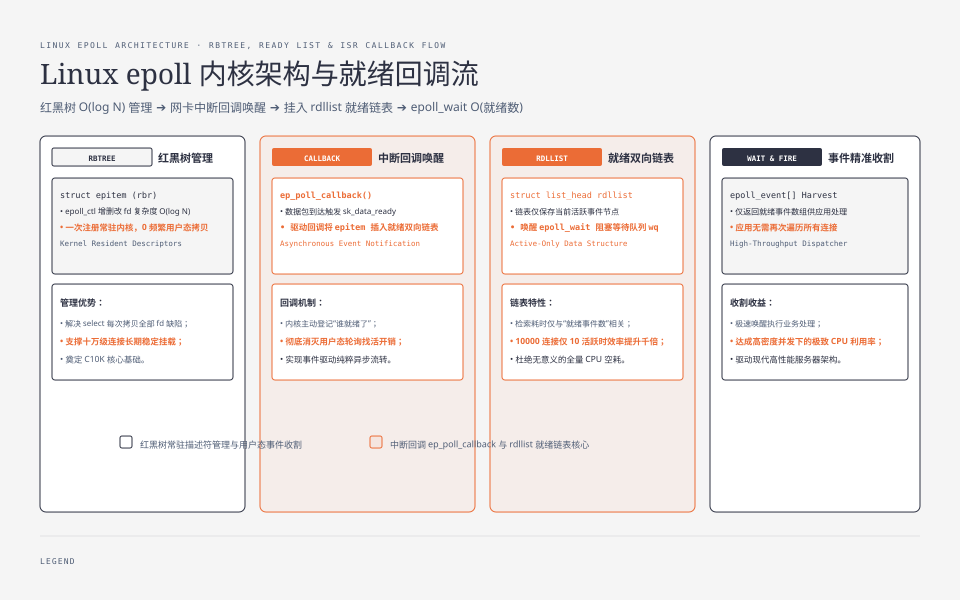
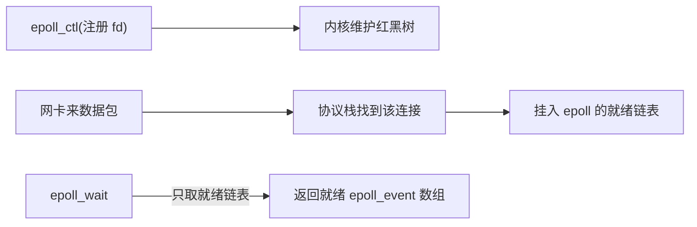
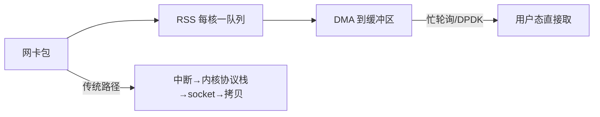

**TL;DR：** C10K（一万并发连接）不是"网络速度不够"，是**单核单位时间能检查多少 socket**的问题。select/poll 每次调用都要**全量扫描**全部 fd——一万个连接哪怕只活跃 10 个，也要扫一万个；epoll 让**内核登记"谁就绪了"**，每次 `epoll_wait` 只从就绪链表拿结果，复杂度从 O(N) 降到 O(就绪数)。C10M 时代连 epoll 的开销都嫌大：多队列（每 CPU 一条收包队列）+ 忙轮询（busy polling）+ 用户态收发（DPDK/XDP）把中断和拷贝一路压掉。本文把数据从网卡到应用这条路上的账单摊开。

## 一、select/poll 为什么到一万就崩

老式 `select` 把 fd 集合传给内核，内核逐一遍历检查是否就绪。每次调用都要扫全量：


三个开销：

- **拷贝**：每次调用都把整个 fd 集合从用户态拷进内核（位图再小也要拷全量）。
- **全量扫描**：一次系统调用 O(N)。
- **右到信息**：它只告诉你"有事件"，不告诉你是哪个 socket——应用还得再自己遍历一遍。

所以 select/poll 的单次等待成本是 **O(N)**；总成本取决于等待调用次数，近似为 `wait_calls × N`。不能把 `O(N²)` 当成协议定律，但在大量连接、频繁唤醒和低就绪率的场景里，重复扫描确实会把 CPU 花在“找活干”上。

## 二、epoll 的账本：注册、就绪、取就绪



epoll 把"查询"改成"事件订阅 + 就绪取用"两步：



三个关键数据结构：

1. **红黑树**：管理你注册的 fd（`epoll_ctl` 的 add/del/mod）。
2. **就绪链表**：协议栈处理完一个连接的包，就把它挂上这条链表。
3. **`epoll_wait`**：每次调用**只取链表头部的一段**，不扫整个 fd 集合；`maxevents` 只是每次最多取多少。

因此，`epoll_wait` 返回路径可以近似按**返回的就绪事件数**计价，而不是每次都遍历整个注册集合；注册、唤醒、锁竞争和用户态处理仍然有成本，不能把它简化成“与 N 永远无关”。在低就绪率、大连接集合场景，这个数据路径差异正是 epoll 能跨过 C10K 的重要原因。

一个常被低估的细节：`EPOLLET`（边缘触发）与 `EPOLLLT`（水平触发）的差别在于"就绪状态要不要重复提醒"。LT 在你没读完之前会反复给事件（不易丢但要注意别重复处理）；ET 只提醒一次，接下来想读多少由你决定。用 ET 必须在循环里一直读到返回 `EAGAIN` 再停，否则就绪数据永远留在缓冲区里等不到下一次通知——ET 卡死是一个入门级常见事故。

## 三、C10M 时代：瓶颈移到协议栈与拷贝

2013 年的 C10M 演讲指出：即便 epoll 把事件分发做到极致，**瓶颈仍在内核网络栈**——每包中断、协议栈处理、内核到用户态的拷贝。三个发力方向：

1. **多队列网卡（RSS）**：每 CPU 一条收包队列，用中断亲和绑定到固定核，多个核各啃各的队列。
2. **忙轮询（busy polling / NAPI）**：CPU 不睡等中断，改成自己轮询 DMA 缓冲区有没有新包——省掉中断上下文切换，代价是空转耗 CPU。
3. **用户态收发（DPDK/XDP）**：应用直接操作用户态的内存池与网卡环形队列，完全绕开内核协议栈。



**这笔账的折中**：从"事件分发省 CPU"转向"把中断和拷贝都省掉"。它们省的是 CPU，付的是"专用内核线程 + 专用内存 + 不与原系统复用"。绝大多数业务 C10K 就够，C10M 是为极限密度（边缘节点、抗 DDoS）准备的。

## 四、用复杂度模型隔离“找活干”的成本

旧版本曾写入 Linux 容器 + `wrk` 的精确吞吐、延迟和 CPU 百分比，但当前 checkout 没有服务端源码、容器配置、内核版本、`wrk` 完整命令与 raw 输出；这些数字不能继续当成本机实测。本节只保留一个可复现的计数模型：固定 `wait_calls=1000`、每次只有 10 个连接就绪，比较全量扫描需要检查多少项，以及按就绪事件取结果需要处理多少项。

```bash
python3 experiments/epoll-readiness-model/sim.py \
  --connections 100,10000 --ready 10 --wait-calls 1000
```

```text
ready=10 wait_calls=1000
connections scan_checks ready_events scan_to_ready_ratio
        100      100000        10000                 10.0x
      10000    10000000        10000               1000.0x
```

这组输出只支持复杂度层面的判断：在相同就绪数和等待次数下，注册连接从 100 增到 10000，会让“每次扫描全部连接”的检查量增加 100 倍，而就绪事件处理量不变。它没有测系统调用、缓存、锁、软中断、协议栈、网络设备或用户态 handler，因此不支持“延迟上涨 50 倍”“QPS 达到某个值”或“epoll 一定比 select 快多少”。要取得这些结论，需要在同一 Linux 内核、同一服务、同一客户端线程数和同一连接/就绪分布下做 `wrk`/`perf`/多轮尾延迟实验。

## 五、结论：C10K 的瓶颈从事件分发转向内核与拷贝

select/poll 的账是"每次全扫描、O(N)"，epoll 把它改成"就绪事件链表、O(就绪数)"——这是它能跨过 C10K 的算法原因。C10M 再往前，瓶颈从事件分发挪到中断与拷贝，解法是多队列、忙轮询、用户态收发。**每一层都是在换"钱从哪条路花得最值"。**

下一步：先运行复杂度模型确认“总连接数”和“就绪数”是两个不同变量；如果要回答真实延迟与吞吐，再固定 Linux 内核、服务端实现、客户端线程数、连接复用方式和就绪比例，保存 `wrk`、`perf`、CPU 与 p99 原始输出。不要把模型中的扫描次数直接改写成生产 QPS。模型 raw 与环境记录在 `evidence/epoll-c10k-c10m/2026-08-17-local/`。

## 参考资料

1. epoll 手册（Linux man page）—— https://man7.org/linux/man-pages/man7/epoll.7.html
2. Dan Kegel：The C10K problem—— https://www.kegel.com/c10k.html
3. C10M：Defending the Internet at Scale（2013 演讲）—— https://static.usenix.org/venue/lisa2013/slides/graham.pdf
4. Linux 内核 eventpoll.c 实现—— https://github.com/torvalds/linux/blob/master/fs/eventpoll.c
5. 内核文档：NAPI 与忙轮询—— https://www.kernel.org/doc/html/latest/networking/napi.html

> 延伸阅读：epoll 就绪链表里到底等着什么，见[Socket 背压：慢消费者如何盯住你的服务](/writing/socket-backpressure-slow-consumer)；网络栈那部分数据的搬运账见[一次网络请求的数据被搬了几次](/writing/zero-copy-sendfile-io-uring)；连接关多的节奏与 TIME_WAIT 的代价见[TIME_WAIT 到底在保护谁](/writing/time-wait-connection-reuse)。
