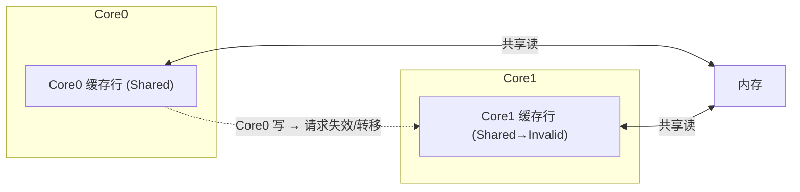
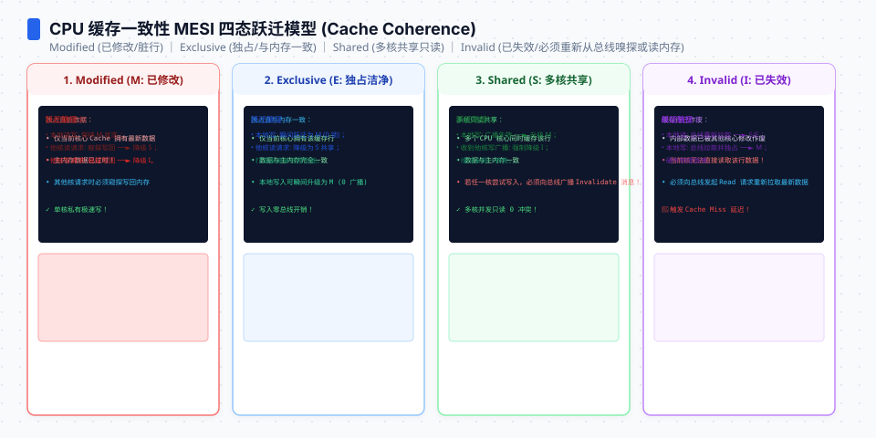

**TL;DR：** 多核 CPU 的共享内存不是“每个变量独立同步”：缓存以**缓存行**为一致性单位，本文实验把目标布局固定为 64B，但缓存行大小不是 Go 语言合同。MESI 是解释状态迁移的经典模型，真实处理器还可能使用目录、snoop、MESIF/MOESI 等变体。**伪共享**发生在两个线程逻辑上写不同变量、物理上却争夺同一缓存行时；padding 或分片可能降低这种写竞争，但也会增加内存和局部性成本。本机 Darwin arm64 的固定对照一次测得 packed/padded 中位数为 **78,632,084 ns / 18,277,333 ns，4.30x**；这是当前 workload 的观察，不是所有 CPU 的固定倍数。

## 一、缓存一致性：不是同步，是缓存行所有权迁移


现代 CPU 以**缓存行（cache line）**作为缓存和一致性操作的重要粒度。很多目标机器使用 64B，但它不是 Go 语言层面的保证；结构体是否跨行要用目标架构的布局检查确认。单核读写没问题；多个核同时写同一行，就要保证二者看到的最终值一致——MESI 用 M（Modified）/E（Exclusive）/S（Shared）/I（Invalid）四态提供一个有用的解释模型：



写一个共享行通常意味着当前写者要取得该行的独占修改权，其他核持有的副本会失效或转移；这不是“每个变量各自发一条通知”。具体是 snoop 广播、目录查询还是 cache-to-cache transfer，由微架构决定，所以“每次写都广播到所有核”只能作为简化图，不能当作硬件实现细节。

不要把下面这些数字当成文章结论：缓存层级延迟、失效确认和跨核传输都依赖 CPU 型号、频率、核拓扑、线程绑定和访问模式。本文没有在当前 Darwin 环境取得 PMU 的 `cache-misses`/一致性事件 raw，因此只报告一个固定 workload 的端到端耗时对照：

| 层次 | 延迟量级 |
| :--- | :---: |
| L1/L2/L3/内存 | 不能用一组跨 CPU 的常数代替 |
| 一致性状态迁移 | 取决于竞争、拓扑、目录/snoop 和调度 |
| 本文 packed/padded 对照 | 见第三节的当前本机 raw |

如果目标环境支持 PMU，可以额外用 `perf stat` 或平台等价工具观察事件；PMU 计数器只能帮助定位机制，仍需和同语义的端到端 benchmark 一起解释。




## 二、伪共享：两个变量，躺在同一条缓存行

两个 goroutine，各自写“自己那份”的计数器；逻辑变量不同，不代表物理缓存行不同：

```go
type Counter struct {
	a, b int64   // 相邻俩字段 → 挤在同一条 cache line
}

var c Counter
// 为了让示例具有明确的并发语义，实际实验使用 atomic.AddInt64：
// goroutine 1: for { atomic.AddInt64(&c.a, 1) }
// goroutine 2: for { atomic.AddInt64(&c.b, 1) }
```

如果目标布局把 `c.a` 和 `c.b` 放在同一缓存行，goroutine 1 修改 `c.a` 时会参与这一整行的所有权竞争；goroutine 2 修改 `c.b` 也一样。两家争的是**同一行**，而不是那 8 字节的业务数据——这就是**伪**共享。反过来，不能只看字段声明相邻就断言一定伪共享：还要看结构体 offset、对象起始地址、架构缓存行大小和实际线程调度。

## 三、把同语义对照跑出来

不要用两个随手写的 `main` 程序比较伪共享：计数次数、同步方式、warmup、调度和输出都会改变结果。当前仓库的实验把这些变量固定下来：两个 goroutine、`GOMAXPROCS=2`、每个计数器 2,000,000 次 `atomic.AddInt64`、先 warmup 1 次、正式运行 7 次并取中位数；程序还打印结构体大小和字段 offset。

```bash
cd experiments/mesi-false-sharing
go run main.go
```

本机这次 raw（Go 1.25.1、Darwin arm64）是：

```text
go=go1.25.1 goos=darwin goarch=arm64 gomaxprocs=2
cache_line_assumption=64 packed_size=16 packed_b_offset=8 padded_size=72 padded_b_offset=64
workers=2 iterations=2000000 repetitions=7 warmup=1 operation=atomic.AddInt64
case=packed median_ns=78632084
case=padded median_ns=18277333
ratio=4.30x
```

这次对照支持一个有限判断：在这个目标布局、原子操作、线程数和运行环境下，把两个写热点从 64B 区域中分开，端到端中位数低了约 4.30 倍。它不支持“伪共享固定慢 2–5 倍”、 “每次失效固定几十 ns”或“padding 对所有 workload 都更快”。实验没有绑定 goroutine 到不同物理核，也没有取得 Darwin PMU raw；后台负载、频率和调度变化都可能改变比值。完整环境和 raw 在 `evidence/mesi-cache-coherence-false-sharing/2026-08-17-local/`。

**关键洞察**：伪共享的风险与写频率和竞争者数量相关，但性能结果还受原子指令、核拓扑、调度和内存布局影响。队列头尾指针、限流器计数、并发统计是值得 profile 的候选，不是看到两个字段相邻就必须加 padding 的命令。


## 四、怎么避：对齐、分片、化竞争为局部分量

1. **Padding 对齐**：把两个线程各写的字段拆到不同行，但先用目标架构的 `unsafe.Offsetof`/布局检查确认。`[7]int64` 只是在本实验里把第二个字段推到 offset 64，不是所有架构的通用模板。
2. **分片计数**：把单个热变量拆成分片，各自原子加自己的 slot，读时汇总。分片之间仍要留出足够间距；把 slot 连续放进数组，可能只是把伪共享从两个字段搬到相邻 slot。
3. **原子计数也要分片**：`atomic.AddInt64` 解决的是更新的原子性，不会取消缓存行所有权竞争；只要多个写者持续修改同一行，失效/转移成本仍可能存在。
4. **先测再改布局**：用同一输入和同一调度条件跑 packed/padded 对照，再用目标平台的 PMU、profile 或线程级指标寻找证据。没有竞争写热点时，padding 的额外内存和更差局部性可能是纯成本。

## 五、别反过来把真共享也拆了

上面讨论的是“不同逻辑变量、多个写者”。如果两个线程确实要频繁读取同一个热字段，故意加 padding 把它拆开反而会损失局部性；如果字段写很少、读很多，缓存共享可能正是好事。还要注意两类容易误判的情况：

- **结构体数组的邻接**：单个结构体内部已经 padding，不代表数组里不同元素之间不会落在同一行；分片类型应同时检查 `sizeof` 和元素步长。
- **锁与原子不能混为一谈**：加锁可以改变同时写入的时序，但不保证消除缓存行迁移；无锁并不自动意味着伪共享。要把同步语义和布局成本分开测。

因此，正确的改动顺序是：先确认多个写者是否真的争同一行，再确认这个写热点是否在总耗时中足够大，最后比较 padding、分片、批量合并和减少写频率的代价。

## 六、结论：先证明缓存行竞争，再支付 padding 的成本

缓存一致性把行作为重要的所有权单位，所以逻辑上互不相干的字段仍可能互相拖慢；但“缓存行 64B”“失效必然广播”“固定慢 2–5 倍”都不能脱离目标微架构和 workload 单独成立。当前实验只证明 Darwin arm64 上一个原子计数对照的 4.30x 观察。工程上应先用布局检查和同语义 benchmark 坐实竞争，再在 padding、分片、批量更新和内存占用之间做取舍。

下一步：在目标部署架构运行 `experiments/mesi-false-sharing/main.go`，保存至少一轮环境和 raw；如果平台支持 PMU，再把 cache/coherence 事件与端到端耗时放在同一份记录里。不要把本机一次 4.30x 直接写进服务 SLO 或跨 CPU 选型结论。

## 参考资料
1. Intel 64 and IA-32 Architectures Software Developer's Manual—— https://www.intel.com/content/www/us/en/developer/articles/technical/intel-sdm.html
2. Go 官方 `sync/atomic` 文档—— https://pkg.go.dev/sync/atomic
3. Linux perf 教程（cache 事件）—— https://perf.wiki.kernel.org/index.php/Tutorial
4. MESI、MOESI、MESIF 作为概念模型的对照—— https://en.wikipedia.org/wiki/MESI_protocol

> 延伸阅读：缓存一致性与核调度/上下文切换叠加的物理进程，见[从 CPU 到 Go 协程：上下文切换](/writing/understanding-context-switching-from-cpu-to-goroutines)；`perf` 如何发现这类 cache-miss 税，见[先采样再优化：perf 火焰图](/writing/perf-flamegraph-sampling)；共享计数与 GC 一起抢内存带宽，见[Go 的 GC 时间税](/writing/go-gc-gctrace-account)。
