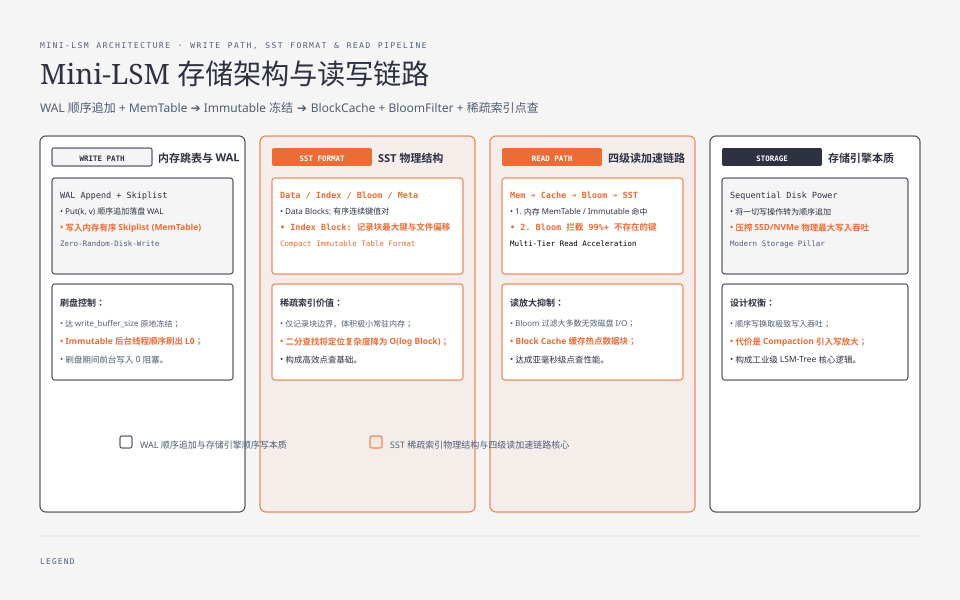
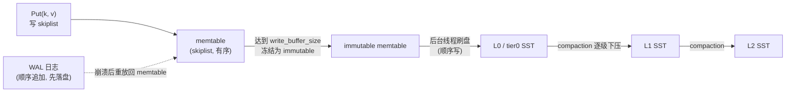
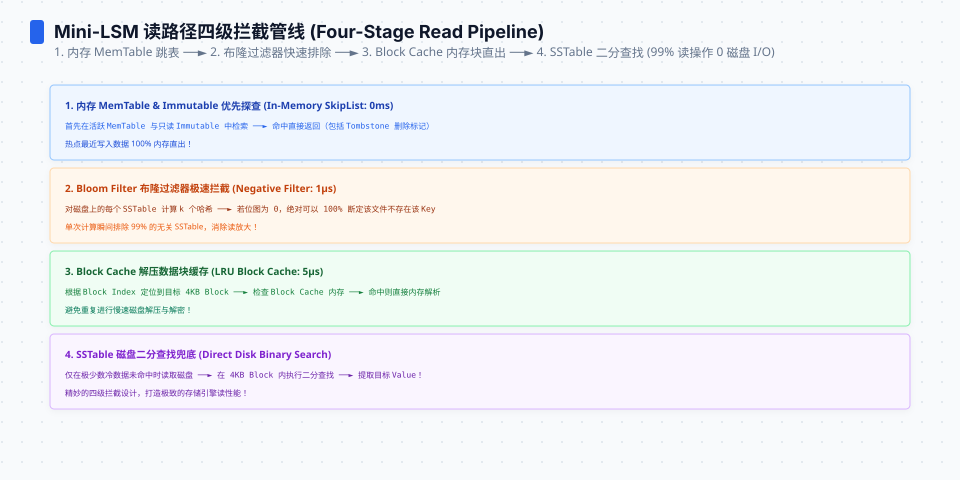
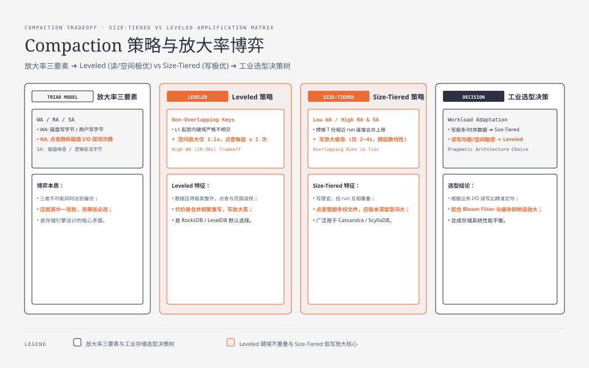

**TL;DR：** LSM 把"随机写"换成"顺序追加"，代价是同一份数据被 compaction 反复重写（写放大）和点查要逐层探测（读放大）。这篇不背结论，我把 memtable、WAL、SST、bloom、compaction 亲手拼成一个约 600 行的 Go 迷你 LSM（`experiments/mini-lsm`），用字节账推写放大、用随机 IO 次数算读放大。固定输入的 sweep 观测到：T=8 时 Leveled 写放大 5.38、Size-Tiered 2.69；但 Size-Tiered 在 T=40 的不存在键探测为 28.0 次，Leveled 为 5.0 次。**Leveled 用写放大换整齐的键域，Size-Tiered 用读放大和空间放大换更低的重写成本。** 这些是内存模拟的放大率，不是磁盘时延或生产引擎基准。


---



## 一、从零设计：memtable、WAL、SST 与 bloom 怎么拼成一台"只追加"的机器

先把目标说清楚：我要造的是一个能点查、能顺序写、能崩溃恢复的内存版 LSM，不追求吞吐，只求把"写放大和读放大从哪来"亲手验证一遍。整体是四件套拼起来的：



**写路径与 memtable 落盘触发条件。** 一次 `Put(k,v)` 做两件事：写进内存里的 skiplist（memtable），同时把这条记录追加进 WAL。skiplist 保证了内存里数据天然有序，这是后面所有 SST 的起点。memtable 不是攒到"多少条"才落盘的，而是**达到尺寸阈值就冻结**：RocksDB 默认 `write_buffer_size` 是 64MB、LevelDB 是 4MB（源码 `options.h`），到点后当前 memtable 原地变成 immutable，新开一个 memtable 继续收写，后台线程把 immutable 顺序刷成一个 L0 的 SST。这个"冻结"的语义很关键：刷盘期间写不阻塞，又不会因为频繁刷小文件把文件数打爆。WAL 的生命周期和 memtable 绑在一起——memtable 的数据没全部落盘之前，对应的 WAL 不能删，崩溃时靠它重放回内存（这就是[WAL 是数据库的命根子](/writing/wal-crash-recovery)那篇讲的共生关系）。

**SST 内部长什么样。** 一次 flush 产出的 SST 文件（LevelDB 的 table 格式，`doc/table_format.md`）由四块组成：

- **data blocks**：一段段有序的 (key, value)，物理上顺序排列；
- **index block**：稀疏索引，每个 data block 一条——"该块的最大键 → 块在文件里的偏移"。索引只记每块的边界，不记每个键，所以体积只是数据的零头，能常驻内存或缓存；
- **bloom filter**：对整个文件的键做的位向量（下一节算它的假阳性账）；
- **footer/metadata**：记 index block 和 bloom block 的位置。

点查一个键，就是先二分 index block 定位"键可能在哪个 data block"，再读那个 block、块内二分。所以读一个 block 的成本取决于它是否命中缓存——这篇只关心"随机 IO 的次数"，不关心命中率。

**我没做什么、为什么。** 没做 tombstone 删除（LSM 里删除是写一条删除标记、靠合并清账，那是另一篇的题）、没做多列族、没做 block cache。取舍理由很直接：这三者都改的是"账的进出"，不改"账怎么算"，而这篇要验证的是两张账本身。




## 二、点查为什么只要 O(levels) 次探测：稀疏索引与 bloom 的假阳性账

现在回答"读放大从哪来"。点查一个键，要从最新层往旧层找，找到第一个含它的文件为止。

先看没有 bloom 的探测链。Leveled 有个结构保证：**第 1 层起，层内文件键域不相交**（compaction 合并出来的文件互不重叠）。于是任意一个键，在某层最多落在 1 个文件的键范围内——点查每层最多做 1 次随机 IO（读那一个 data block）。所以无 bloom 的点查，最坏探测次数就是层数 O(L)。这就是"点查 = 每层一次随机 IO × 层数"的来源，也正是 index block 稀疏索引值钱的地方：文件级二分把"这层里哪个文件"这个问题变成了 O(log 文件数) 的索引查找，把成本压到"每层一次"。

bloom 再把其中大多数省的 IO 省掉。它是对整个文件做的位向量：插入时对键做 k 个 hash 置位，查询时 k 个位全 1 才放行。假阳性率的公式是：

```
p ≈ (1 − e^{−kn/m})^k
```

其中 m 是位向量位数、n 是文件里键数、k 是 hash 个数；k 取最优值 (m/n)·ln2 ≈ 0.693·(m/n) 时，p ≈ 0.6185^(m/n)。两个常用的点：m/n=10、k=7 → p ≈ 0.8%；同样 k=7、m/n=20 → p ≈ 0.02%（若把 k 调到最优值 (m/n)·ln2≈14，同位数下 p 还能再降到约 1/3、到约 0.007%）。模拟器里我故意不让假阳性率"直接传参"，而是把 m/n 和 k 喂进公式推出 p，否则"位数 → 假阳性率"这条教学链就断了。

于是读放大这张账能写成一个式子：**点查探测 = bloom 放行概率 × 每层一次随机 IO**。命中键 ≈ 1 + p·(L−1)（真正含键的那一层 + 其余层被 bloom 误放行的期望）；缺失键 ≈ p·L。bloom 只对"这文件里没有的键"省 IO，对真命中的那一层不省——反正那层要读。

## 三、compaction：Leveled 与 Size-Tiered，写放大的两本账怎么算

compaction 的本质是**把上层文件合并进下一层**：读出上层和下一层重叠的文件，归并去重后写回下一层。这正是"越深越贵"的来源——每下压一层就重写一次，还要和下一层（T 倍大）的重叠数据一起重写；末层是目的地，只吸收、不再下压。写放大 = 同一份数据被物理重写的次数，全记在这条下压路径上。

先立尺寸模型。设 memtable 大小 M，每层尺寸比 T，则 L1=T·M、L2=T²·M、…、末层 T^(L−1)·M≈N（N 为数据量）。所以 **L ≈ log(N/M)/log(T) + 1**——层数不是配置拍脑袋，是数据量决定的。

**Leveled 的写放大推导。** 一个字节从进入系统到抵达末层：

1. flush 写 1 次（memtable → L0）；
2. 依次经过 L0→L1、L1→L2、…、直到倒数第二层并进末层，每级边界合并时被重写 1 次，共 (L−1) 次。

所以写放大**至少**是 L = 1 + (L−1)，即"每个字节被重写约 L 次，其中 compaction 占 (L−1) 级"。这是下界；真正的额外项来自合并时下一层的重叠数据也被重写——最坏每级把整个下一层拖进来，写放大 ≈ **1 + (L−1)·T**。RocksDB 源码 `options_builder.cc` 给过自己的估式，拆开约等于 **4 + T·(L−1)**（L0 约 2 份、L1 约 2 份、中间每层 T、末层再 T），社区实测的典型值在 10–30x 之间（T=10、7 层时）。

这套推导有三个必须写明的近似条件：稳态（写入速率跟得上 compaction）、键域均匀（没有热点让某个文件反复被拖）、每层尺寸都维持在目标附近。任何一条不成立，写放大都可能远偏离 L 的量级——比如删除风暴会让层间全是 tombstone，写放大能翻倍。

**Size-Tiered 的写放大。** 策略完全不同：同一层攒够 T 份尺寸相近的 run，就合成 1 份 T 倍大的 run、上移一层。每份数据每 tier 只被重写一次，代价随**层数**增长、而不是随 T 增长——这就是它的写放大远低于 Leveled 的原因。Luo & Carey 的成本表把这层差别写得很清楚：tiering 写放大 O(L/B)，leveling 是 O(T·L/B)；空间放大反过来，tiering 上界 O(T)，leveling 只有 O((T+1)/T)。

| 维度 | Leveled | Size-Tiered |
| :--- | :--- | :--- |
| 写放大 | 约 L（每级重写一次），最坏 1+(L−1)·T | 约随层数增长，明显更低（~2–10x 量级） |
| 点查读放大 | 每层最多 1 次随机 IO，最坏 O(L) | run 互相重叠，要翻多份 run，更坏 |
| 空间放大 | 约 (T+1)/T ≈ 1.1 | 上界 O(T)：旧版本在多个 run 里滞留 |
| 一句话 | 数据被压得整齐，读便宜 | 写便宜，账记在读和空间上 |

一句"为什么"把两张账连起来：**同一层同一份数据，Leveled 把它合并到键域不相交，靠的是反复重写（写放大涨）；Size-Tiered 少写（写放大降），代价是 run 重叠、点查要多翻、旧版本滞留（读放大和空间放大涨）。** 你只是把成本从一张账挪到另一张账。




## 四、亲手跑模拟器：三张曲线与踩坑

**实验入口。** 可运行的 Go 模拟器在 `experiments/mini-lsm/main.go`，零依赖，固定 seed 可复现。它不碰真实磁盘——放大率本来就不依赖磁盘时序，用字节账和探测次数就能算：

- 写放大 = (flush 输出字节 + 全部 compaction 输出字节) / 用户写入字节；
- 读放大 = 一次点查在 SST 上做的随机 IO 次数（键范围判断与 bloom 判断是内存操作，不计 IO）；
- 空间放大 = 运行期磁盘峰值字节 / 逻辑存活字节。

跑法（先进入 `experiments/` 目录，它自带独立 go.mod）：

```bash
go run ./mini-lsm                                   # Leveled 与 Size-Tiered 各跑一遍，打对比表
go run ./mini-lsm -num 300000 -writes 400000 -mem 6000 -sweep   # 扫 T：三张曲线的表
go run ./mini-lsm -num 300000 -writes 400000 -mem 6000 -sweep -csv  # 同上，CSV 便于画图
```

**固定输入的 sweep 结果如下。** 每列的含义：T=每层尺寸比、层数=模拟器实际用到的层、写放大/空间放大/点查探测分别是上面三个度量。原始 CSV 保存在 `evidence/mini-lsm-write-amplification/2026-08-16-local/`。

| T | 策略 | 层数 | 写放大 | 空间放大 | 点查探测 存在/无bloom | 存在/有bloom | 不存在/无bloom | 不存在/有bloom |
|---:|---|---:|---:|---:|---:|---:|---:|---:|
| 2 | leveled | 7 | 8.09 | 1.26 | 3.9 | 1.02 | 4.0 | 0.03 |
| 2 | sizetiered | 7 | 6.42 | 1.26 | 2.9 | 1.02 | 3.0 | 0.02 |
| 4 | leveled | 4 | 5.25 | 1.29 | 4.6 | 1.03 | 5.0 | 0.04 |
| 4 | sizetiered | 4 | 3.62 | 1.27 | 3.9 | 1.02 | 4.0 | 0.03 |
| 8 | leveled | 3 | 5.38 | 1.19 | 4.8 | 1.03 | 5.0 | 0.04 |
| 8 | sizetiered | 3 | 2.69 | 1.27 | 3.9 | 1.02 | 4.0 | 0.03 |
| 12 | leveled | 3 | 5.52 | 1.25 | 3.9 | 1.02 | 4.0 | 0.03 |
| 12 | sizetiered | 2 | 1.88 | 1.31 | 9.2 | 1.07 | 12.0 | 0.10 |
| 20 | leveled | 3 | 5.13 | 1.29 | 4.6 | 1.03 | 5.0 | 0.04 |
| 20 | sizetiered | 2 | 1.86 | 1.28 | 8.4 | 1.06 | 10.0 | 0.08 |
| 30 | leveled | 3 | 5.60 | 1.21 | 4.4 | 1.03 | 5.0 | 0.04 |
| 30 | sizetiered | 3 | 1.83 | 1.24 | 7.9 | 1.06 | 9.0 | 0.07 |
| 40 | leveled | 3 | 6.42 | 1.27 | 4.5 | 1.03 | 5.0 | 0.04 |
| 40 | sizetiered | 2 | 1.60 | 1.33 | 21.7 | 1.16 | 28.0 | 0.23 |
| 60 | leveled | 2 | 8.68 | 1.08 | 3.9 | 1.02 | 4.0 | 0.03 |
| 60 | sizetiered | 2 | 1.75 | 1.20 | 7.5 | 1.05 | 8.0 | 0.06 |

跑之前可以用公式校准期望方向：Leveled 的写放大应落在 [L, 1+(L−1)·T] 之间，Size-Tiered 的读放大应明显高于 Leveled（run 重叠），bloom 应把"不存在键"的探测从 ~层数 压到 ~假阳性率×层数。

**我写这个模拟器时真实撞到的坑**（下列放大倍数来自早期 bug 版模拟器在同一 seed 下的测量，仅供对照，不是本机最终回填值），每个都对应一条 LSM 语义，写出来供参考：

1. **L0 永远不合并。** 第一版把 L0 的合并条件写成"文件数≥阈值 且 下一层已存在"，可下一层第一轮根本不存在——于是层数永远卡在 1、写放大停在 1.2，看起来"写放大真低"，其实是 compaction 压根没跑。教训：compaction 是下压动作，目标层不存在就应该先创建，而不是放弃。
2. **底部层判断错了。** 第二版用"当前存在的最后一层"当底部，L1 永远被当成末层，数据全堆在 L1，写放大虚高到 16x。改法：底部层由"数据量在哪层放得下"决定（或显式给 `-levels` 上限）。
3. **空间放大出现 <1 的不合理值。** 随机键负载不保证每个键都被写一遍，逻辑存活字节被高估，分母一错整个账全错。改成第一阶段把全量键各写一遍，分母才站得住。
4. **逐文件 vs 整批 L0 合并。** 逐文件把 L0 小文件拖进 T 倍大的 L1，写放大被顶到 39x（超过理论最坏）；整批清空 L0 又回到最坏值。最后取"最老的一批"折中，贴近真实引擎的批次语义。
5. **bloom 假阳性率不能直接传参。** 直接传 0.01 会断掉"位数 → 假阳性率"的教学链，改成由 m/n 和 k 用公式推出。

**必须说的局限。** 这个模拟器合并很勤快、每键只保留最新版本，所以 Size-Tiered 的空间放大通常远低于论文上界 O(T)——要看大空间放大，得加大更新比例让旧版本在多个 run 里滞留。它算的是字节账和探测次数，不是随机/顺序 IO 的物理延迟账。这是本地教学原型，不是生产引擎：RocksDB 的重叠最小化启发式、trivial move、dynamic level bytes 我都没做。

## 五、结论：同一份数据为什么两张账互斥，T 与 bloom 拧向哪边

把推导收拢成一句判断：**写放大是 compaction 勤快的代价，读放大是数据不整齐的代价，二者在"同一份数据"上天然互斥。** compaction 越勤（Leveled），数据被重写越多、写账越厚，但每层键域整齐、点查只要 O(L) 探测、读账越薄；compaction 越懒（Size-Tiered），写账越薄，但 run 重叠、点查要多翻、旧版本滞留，读账和空间账一起变厚。bloom 是唯一只动一张账的优化：用每键 m/n 位内存，把缺失键的探测从 O(L) 压到 p·L，不碰写放大也不碰空间放大。

两个旋钮的语义因此很清楚：

- **调大 T**：同数据量下层数变少（L = log(N/M)/log(T)+1），写放大和读放大的层数项都变小；但每层"下一层重叠重写"变大、Size-Tiered 的空间放大 O(T) 变大。T 是"层数 × 每层重量"的兑换旋钮，不是越大越好。
- **加 bloom**：点查是主路径、内存宽裕时，用每键约 10 位（p≈0.8%）把点查探测从"每层一次"压到接近 1+p·L。读写不点查、纯顺序写的工作负载不必加。

落到决策：SSD 寿命或写带宽是瓶颈 → 换 Size-Tiered 或调大 T（接受读和空间涨）；OLTP 式点查主路径 → 保持 Leveled 并加 bloom；空间敏感 → 保持 Leveled（空间放大约 1.1），别换 tiered；日志/时序这类写密集、读不走点查 → tiered 更划算。宏观上与[LSM 与 B+Tree 的 IO 战争](/writing/lsm-vs-btree-io-amplification)那张选型表同源，但这里每一格都从自己造的东西里长出来，而不是背下来的结论。

下一步可执行的事：跑一遍 `experiments/mini-lsm` 的 `-sweep` 把三张表回填，用文里的公式校准"写放大落在 [L, 1+(L−1)·T] 之间"；然后去读 RocksDB 的 Leveled Compaction 官方文档，看 `dynamic_level_bytes` 和 trivial move 这两个真实优化怎么进一步把写放大往下压——那是这张账在生产里的下一个缺口。

## 参考资料

1. O'Neil et al., The Log-Structured Merge-Tree (LSM-Tree), Acta Informatica 33(4), 1996 — DOI 10.1007/s002360050048
2. Luo & Carey, LSM-based Storage Techniques: A Survey, The VLDB Journal 29(1), 2019 — DOI 10.1007/s00778-019-00555-y（tiering 写放大 O(L/B)、空间 O(T)；leveling 写放大 O(T·L/B)、空间 O((T+1)/T)）
3. RocksDB Wiki：RocksDB-Tuning-Guide（含写放大 W-Amp 列与默认参数）— https://github.com/facebook/rocksdb/wiki/RocksDB-Tuning-Guide
4. RocksDB Wiki：Leveled Compaction — https://github.com/facebook/rocksdb/wiki/Leveled-Compaction
5. RocksDB 源码：util/options_builder.cc（写放大估式 4+T·(L−1)）— https://github.com/facebook/rocksdb/blob/4.8.fb/util/options_builder.cc
6. RocksDB 源码：include/rocksdb/options.h（write_buffer_size 默认 64MB）
7. LevelDB 设计文档：doc/table_format.md（SST 的 data blocks + metaindex + index + footer + filter meta block）— https://github.com/google/leveldb/blob/main/doc/table_format.md
8. RocksDB Wiki：Block-Based Table Format — https://github.com/facebook/rocksdb/wiki/Block-Based-Table-Format

> 延伸阅读：WAL 与 memtable 的共生关系见[WAL 是数据库的命根子](/writing/wal-crash-recovery)；提交路径那一下 fsync 的账见[数据库为什么宁可慢，也要等你 fsync](/writing/fsync-group-commit)；B+Tree 侧的写放大对照见[页分裂的写放大账](/writing/btree-page-split-write-amplification)。
