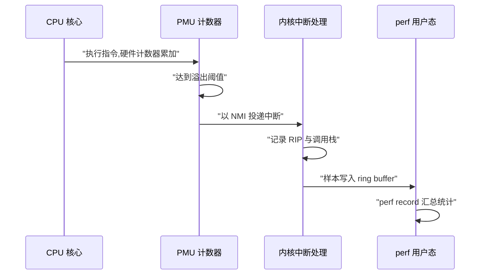
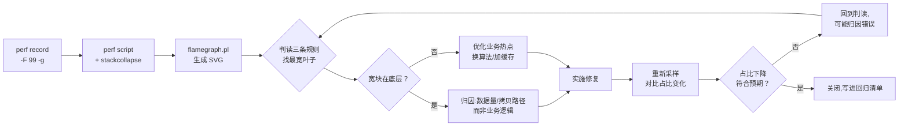
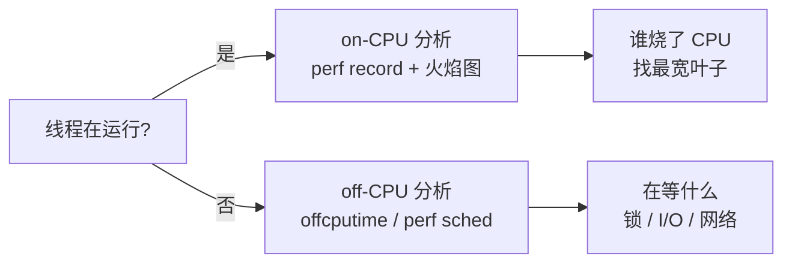

**TL;DR：** 优化之前先回答一个问题：CPU 时间到底花在哪。`perf` 用**定时中断采样** 回答——每隔固定时间打断 CPU，记下当前的指令地址与调用栈，汇总后得到"占比"而不是"耗时"。火焰图的判读只有三条规则：**宽度 = 样本占比**（不是执行顺序）、**越靠底部的宽块越接近根因**、**顶部收窄到单一底层函数 = 真热点**。最容易被忽略的是伪优化：宽块如果出现在 `memcpy`、内核拷贝这类底层，说明问题在"数据搬太多"，而不是"业务逻辑慢"——先归因，再动手。

## 一、采样原理：打断、记账、统计

`perf` 的核心不是跟踪每条指令，而是**采样**。CPU 上有一个可编程的定时中断源（硬件性能计数器或 `hrtimer`），`perf` 让它以固定频率触发——典型用法是每秒 99 次（`-F 99`，质数避免与工作负载节奏同步）——每次中断时记录两件事：**当前正在执行的指令地址（RIP）** 和 **当前线程的调用栈**：

```c
// 概念模型：perf 中断 handler 做的事
void perf_sample_hook(void) {
    u64 rip   = current_rip();          // 正在执行哪条指令
    u64 *call = unwind_stack(current);  // 展开调用栈（帧指针 / DWARF / ORC）
    record(rip, call);                  // 记一票样本
}
```

采样间隔内 CPU 在哪个函数里执行，概率上等价于"该函数占用了多少 CPU 时间"——**样本数占比 ≈ 时间占比**。这是采样的两个特性来源：

1. **开销低**：中断只记账，不打断流水线执行（相对而言），对在线服务可以接受；但低采样率下小函数可能一票都采不到，样本少时置信度低——`perf record` 结束后会提示样本总量，低于几万票的结论要谨慎。
2. **只看到采样时刻**：两个采样点之间发生的事（阻塞、调度、跨 CPU）是盲区。**采样适合"CPU 密集"的瓶颈分析；I/O 等待型瓶颈（进程在睡眠）需要 on-CPU 之外的视角**——`perf sched`、off-cpu 分析（Brendan Gregg 的 offcputime 方法）或 `perf trace` 才是那类问题的工具。

采样还有另一种模式：**按硬件事件采样**（`perf record -e cache-misses`、`-e cycles`、`-e branch-misses`）。它不量"时间"，量"事件"——比如 cache-miss 高频发生的代码位置，即使那里不耗 CPU，也值得看。这是把"CPU 时间去哪了"升级成"CPU 周期被什么浪费了"的关键一步。

## 二、采样是怎么触发的：PMU 溢出与 hrtimer

第一节里的"可编程的定时中断源"有两种，触发机制完全不同，值得分开讲清楚。

**硬件事件走 PMU。** `-e cycles` 用的是 CPU 上的 PMU（Performance Monitoring Unit）硬件计数器：`perf_event_open(2)` 设定一个溢出阈值（period），计数器每执行一个 CPU 周期累加一次，达到阈值时硬件产生中断，内核记录当前 RIP 与调用栈，然后重置计数器继续。x86 上这个中断以 **NMI（不可屏蔽中断）** 投递——它比普通中断硬：即使 CPU 正在执行关中断的临界区，NMI 也能打断。这是 perf 能采到内核热点的机制基础，`memcpy` 这种短促的内核函数之所以能出现在火焰图里，靠的就是溢出中断足够"硬"。



**软件事件走 hrtimer。** `-e cpu-clock` / `-e task-clock` 是软件事件：内核用高精度定时器（hrtimer）按时间间隔触发，记录"当前在哪个进程上"。它量的是**经过的时间**，不是 CPU 周期数——不受频率缩放（睿频、节能）影响。于是两种事件回答不同的问题：`-e cycles` 回答"CPU 周期被谁消耗"，`-e cpu-clock` 回答"真实时间被谁消耗"。在频率固定的负载机上两者接近，在睿频明显的机器上可能差出 30% 以上，选错事件会把结论带偏。

**周期模式与频率模式。** `perf_event_open` 里 `freq` 标志决定中断怎么触发：`-c 1000` 是固定周期——每 1000 个事件采一次，中断频率随 CPU 速度浮动；`-F 99` 是固定频率——内核动态调整周期，让采样频率稳定在每秒 99 次。固定频率的意义在于样本数可控：99Hz 采 30 秒就是约 2970 票，样本量与 CPU 快慢无关，跨机器对比才成立。

## 三、调用栈展开：帧指针、ORC 与 DWARF

样本只记录了一个 RIP，怎么还原出完整调用链？这一步叫**栈展开（unwinding）**，perf 按情况选择三种机制。

**帧指针（frame pointer）最便宜。** x86-64 的惯例是用寄存器 `rbp` 串起栈帧链：每个函数入口把旧 `rbp` 压栈、`rbp` 指向新帧，展开时顺着 `rbp` 链回溯即可。代价是每个函数多两条指令（压栈/出栈）——而现代编译器默认 `-fomit-frame-pointer`，把这套链条优化掉了。**Go 是例外：Go 1.7 起 amd64 默认保留帧指针**（go.dev/doc/go1.7），所以 Go 程序开箱就能被 perf 干净地展开；C/C++ 需要在编译时显式 `-fno-omit-frame-pointer`。

**ORC 是内核的展开器。** 内核自 4.14 起在 x86 上用 ORC（Oops Rewind Capability）作为默认展开机制：编译期由 objtool 生成展开表，运行时查表回溯。官方文档给了一组数字：保留帧指针让内核 .text 增大约 3.2%、部分负载有 5-10% 性能损失；ORC 的开销在带外，且展开速度大约是 DWARF 的 20 倍（后续优化后可能接近 40 倍），还能可靠地跨中断/异常展开。你不需要直接操作它——只要知道内核态调用栈由内核自己负责，占用的就是 ORC 或老内核的帧指针。

**DWARF 最全也最贵。** `perf record --call-graph dwarf` 让用户态展开走 DWARF 调试信息（`.debug_frame`/`.eh_frame`），能还原寄存器级别的细节，代价是每票样本的展开开销高一个量级。什么时候该用它：老二进制没有帧指针、JIT 代码、手写汇编这类"帧指针链断了"的场景。反过来——如果二进制有帧指针，`-g`（默认帧指针展开）又快又够。

| 机制 | 成本 | 适用场景 |
|------|------|---------|
| 帧指针 | 函数级：每函数两条指令 | Go 1.7+（默认）、显式 `-fno-omit-frame-pointer` 的 C/C++ |
| ORC | 带外查表，快 | 内核态（x86 默认） |
| DWARF（`--call-graph dwarf`） | 每票展开成本高一个量级 | 无帧指针的老二进制、JIT、汇编 |

**展开失败在火焰图上表现为"断根"。** 链条走到一半断了，表现为火焰图顶端一块 `[unknown]` 或悬空碎块。这一步最容易被误判成"热点就在这个 unknown 里"——先修展开，再谈归因：确认二进制带了帧指针或换成 dwarf 重采。第三节的判读规则全部建立在"栈是完整的"前提上。

## 四、完整命令序列：从采样到火焰图

以分析一个线上 Go 服务进程为例。线上快速初筛可先用 `perf top -p PID` 观察实时热点，确认目标进程后再做完整采样：

```bash
# 1. 采样 30 秒，99Hz，带调用栈，附加到目标 PID
perf record -F 99 -g -p 12345 -- sleep 30

# 2. 交互式报告（-g 展开调用栈，--children 显示含子调用占比）
perf report --stdio --no-children

# 3. 对热点函数反汇编逐行标注占比（看具体是哪个汇编指令）
perf annotate --stdio --symbol memcpy

# 4. 生成火焰图（Brendan Gregg 的 FlameGraph 工具集）
git clone --depth 1 https://github.com/brendangregg/FlameGraph
perf script | ./FlameGraph/stackcollapse-perf.pl | ./FlameGraph/flamegraph.pl > flame.svg
```

`-g` 默认走帧指针展开，展开机制的选择见第三节；权限与容器的坑见第十节。其余几个容易翻车的细节在下面的判读与案例里都有对应，先记住一条：`perf record` 结束时报的样本总量小于几万票，结论只能当线索。

## 五、判读规则：三条规则定位真热点

把采样结果画成火焰图（见下图），判读只需要三条规则：


*图注：x 轴是样本占比而非时间顺序；宽度由下而上逐层收窄，最宽的"叶子"（memcpy）就是 CPU 真正的去处。*

**规则一：宽度是占比，不是顺序。** x 轴只是"把样本按调用栈聚合成条形"的布局方式，块与块的左右排列不代表时间先后。只看宽度：`memcpy` 占 44%，意味着 30 秒采样里约有 13 秒 CPU 在执行 `memcpy`。

**规则二：越靠底部的宽块越接近根因。** 顶部的 `read_socket()` 宽，是"表象"；顺着调用链往下，`copy_to_user` 再到 `memcpy` 同样宽——根因是"把 64KB 数据从内核拷进用户空间"这件事本身。**修复目标是让整条链变窄，而不是在顶层函数里做微优化**——顶层函数的"慢"是结果，不是原因。

**规则三：顶部收窄到单一底层函数 = 真热点。** 当一条调用链自上而下收窄成一根"柱子"，柱子顶端的函数就是无可辩驳的热点（它占据了父函数几乎全部时间）。此时的优化选项很明确：**换算法（少做拷贝）、换路径（[sendfile 的零拷贝](/writing/zero-copy-sendfile-io-uring)）、换结构（缓存避免重复计算）**——三选一，然后重新采样验证。

### 一个常见的误解：采样频率越高越准

**"采样频率越高越准"是错的。** 采样是概率统计，频率翻倍不等于精度翻倍，代价却是线性上升的：① 样本点变多，但每次采样的硬件中断 + 内核记账开销也在线性增加，高频直接干扰被测程序本身；② hrtimer 采样可能与程序的执行节奏共振，采到的永远是同一相位（所以 `perf` 用质数 99Hz 而不是 100Hz）；③ 每样本一次调用栈回溯，展开栈本身也消耗 CPU。正确姿势：先用 `perf top` 粗筛、确认目标进程，再用 `-F 99` 细采；比采样间隔还短的小函数可能一票都采不到，要用硬件事件（`perf record -e cycles`）或延长采样时间补盲。

### 一个常见的误解：火焰图顶部的块最热

**"火焰图顶部的块最热"是错的。** 顶部块的宽度 = 包含它的**所有调用路径之和**，宽只说明它被很多路径调用过。真正的热点是"宽且接近叶子"的块——呼应规则三：看叶子，不看顶部，顶部的宽是结果，叶子的宽才是原因。

## 六、伪优化识别：宽块在底层，问题不在业务

火焰图最常见的误读：看到 `memcpy` 或 `sys_read` 很宽，就急着优化业务逻辑。这多半是伪优化——**底层的宽块往往是"数据量 × 每字节成本"的结果，业务逻辑只决定数据量，不决定每字节成本**。例如：

- `memcpy` 宽：要么数据太大，要么拷贝次数太多。前者看"为什么要拷这么多"，后者看"为什么不能引用传递"——[零拷贝路线图](/writing/zero-copy-sendfile-io-uring)正是这条思路；
- `sys_read`/`write` 宽：syscall 次数是每块 I/O 的固定成本。宽说明"小 buffer 高频 syscall"——合并 I/O（增大缓冲、`readv` 批量）比优化业务代码收益大得多；
- 内核函数栈顶（如 `tcp_sendmsg`）宽：可能是 socket 缓冲区满、发送端被对端背压——瓶颈在对端消费速度，本地优化无效。

判断"该不该修"的另一面是**成本对比**：`perf report --no-children` 看自身占比（不含子调用），`--children` 看含调用链的占比。如果某函数自身占比 1% 但 children 40%，它只是"恰好被热点调用"，优化它没有意义——**真正要修的是那 40% 的子树**。

## 七、一个可复用的案例骨架：从拷贝热点到二次采样

下面是一个用于说明判读流程的示意案例，不是当前仓库或线上服务的实测记录。真实项目必须把目标服务 commit、负载、采样环境、原始 folded 栈和优化前后数据一起保存。

```bash
# 采样 30s，假设发现 CPU 最高的是用户态 memcpy
perf record -F 99 -g -p 21457 -- sleep 30
perf script | ./FlameGraph/stackcollapse-perf.pl | ./FlameGraph/flamegraph.pl > flame.svg
# 示意判读：handler → read_socket → sys_read → copy_to_user → memcpy
```

如果确认网关只是把 64KB 读缓冲从内核拷到用户态再原样发出，归因方向应是“数据搬运路径”，而不是直接微优化 `memcpy`。候选修法可以是把 read+write 换成 splice 或 sendfile，但必须先确认文件/pipe/socket/TLS 条件符合对应合同，再用同一负载重新采样。**验证环节与采样环节同样重要**：没有第二次采样、吞吐和错误率对照，就不能宣称优化已经降低 CPU 时间或提高吞吐。



## 八、差异火焰图与回归流程

第七节的"改造后重新采样"只做了一半：把两次采样叠在一起看，才是完整的证明。FlameGraph 工具集里 `difffolded.pl` 专门干这个：

```bash
# 优化前后各采一次,折叠成"一行一栈"的格式
perf record -F 99 -g -p 21457 -- sleep 30   # 优化前
perf script | ./FlameGraph/stackcollapse-perf.pl > before.folded
perf record -F 99 -g -p 21457 -- sleep 30   # 优化后
perf script | ./FlameGraph/stackcollapse-perf.pl > after.folded

# 差异火焰图:红色 = 占比上升,蓝色 = 占比下降
./FlameGraph/difffolded.pl before.folded after.folded \
    | ./FlameGraph/flamegraph.pl > diff.svg
```

不想离开 perf 的话，`perf diff before.data after.data` 也能对两次 `perf record` 的原始文件做逐函数占比对比。两个工具各有取舍：`difffolded.pl` 输出可视化差异，适合给人看；`perf diff` 输出表格，适合写进报告。

差异火焰图有两个前提，缺一个结论就不可信：**两次采样的负载、时长、频率必须一致**（同一份压测脚本、同样的 30 秒、同样的 `-F 99`），否则差异是负载变化而不是优化效果；**优化前后要留出相同的环境**（同机型、同内核、同 cgroup 配额）。生产环境做不到完全一致时，就把"占比下降"当作趋势而非精确数字。

跑完 diff，顺手把结论固化成回归清单：本次优化的目标函数、优化前占比、优化后占比、验收阈值。阈值必须来自实际基线，不能照抄一个“memcpy 从 44% 降到 20%”的示例数字。下次合入新的改动时重跑同一套采样脚本，用 diff 检查有没有让老热点回潮。**优化是一次性的，回归检查是长期的**——这也是第七节流程图最后一步"写进回归清单"的意思。

## 九、off-CPU：进程在等什么

采样回答的是"CPU 在忙什么"。但有一类性能问题在火焰图里是**空白** 的：CPU 利用率只有 20%，p99 延迟却高达几秒。线程不在 CPU 上，采样采不到它——它在等。这就是 off-CPU 时间：阻塞在锁、磁盘 I/O、网络等待、定时器上。


off-CPU 分析的基本思路与采样对称：不在 CPU 上等时间点，而是**跟踪调度器**——每次线程被换下 CPU 时记下时间与调用栈，被换回时结算这段阻塞时长，按"阻塞调用栈 + 时长"聚合。Linux 上的标准工具是 bcc 的 `offcputime`（内核 4.8+ 的 eBPF 栈支持）：

```bash
# 跟踪 mysqld 进程 30 秒,按阻塞调用栈汇总等待时长,输出 folded 格式
offcputime -df -p $(pgrep -nx mysqld) 30 > off.folded

# 直接生成 off-CPU 火焰图(--color=io 用 I/O 配色)
./FlameGraph/flamegraph.pl --color=io --countname=us < off.folded > off.svg
```

off-CPU 火焰图的读法跟 on-CPU 一样：宽度 = 阻塞时长占比，宽块 = 主要的等待点。区别在于栈顶通常是阻塞原因——`fsync` 下的宽块说明在等刷盘，`futex_wait` 下的宽块说明在等锁。

开销要心里有数。Brendan Gregg 在一台 8 核、每秒 10.2 万次上下文切换的 MySQL 负载机上实测过：用 perf 全量记录调度事件，10 秒采样造成 9-13% 的吞吐损失、产生 224MB 数据文件，后续符号翻译还要再花 35 秒；换 eBPF 内核内汇总，10 秒采样 6-13% 开销、17 秒收尾。**结论：生产环境优先 eBPF 版本，短采样（30 秒内）足够**。调度类问题还有 `perf sched record` + `perf sched timehist` 这条纯 perf 路线，输出里有 wait time 列直接看调度延迟。

### 一个常见的误解：CPU 占用低就说明没有瓶颈

**"CPU 占用低 = 没有性能问题"是错的。** on-CPU 火焰图只能证明"CPU 没被烧"，证明不了"没有瓶颈"。一个可复用的排查假设是：消息处理服务 CPU 很低、客户端却频繁超时，on-CPU 火焰图几乎没有宽块；如果 offcputime 显示阻塞时长集中在 `fsync` 调用栈，瓶颈可能在磁盘等待，而不是 CPU。这里的比例和服务都是示意，真实判断必须保存目标服务的 raw。**on-CPU 回答"谁烧了 CPU"，off-CPU 回答"谁在等、等什么"，两个视角合起来才覆盖线程的全部时间。**



## 十、生产环境采样：权限与容器

生产机器上跑 perf 的第一道坎是权限。内核用 `kernel.perf_event_paranoid` 控制非特权用户的 perf 范围，等级含义（来自内核官方文档 Perf events and tool security）：

| 值 | 非特权用户可用范围 |
|----|-------------------|
| `-1` | 无限制（最不安全的模式） |
| `>=0` | 系统级采样可用，但禁用 raw/ftrace tracepoint |
| `>=1` | 仅进程级采样（系统级 per-CPU 采样被禁） |
| `>=2` | 仅进程级 + 仅用户态事件（内核态事件被排除） |
| `>=3` | 非特权 `perf_event_open` 完全禁止 |

内核源码默认 1，但不少发行版打包为 2——也就是说，普通用户默认只能"采进程、采用户态"。对应到命令上：`perf record -F 99 -g -p PID` 在 paranoid=2 的机器上会报权限错误，因为内核态采样被禁。三种解法：一是 `sysctl kernel.perf_event_paranoid=1`（或更低）并确认重启不丢；二是给进程/账户 CAP_PERFMON；三是最常用的——**用 `-e cycles:u` 只采用户态事件**，Go 服务的业务热点 90% 在用户态，先采用户态够用，不够再升级权限。

第二道坎是容器。容器里跑 perf 有三个 namespace 陷阱：**PID namespace**（容器内的 PID 与宿主机不同，`perf record -p` 要用宿主机视角的 PID，一般从宿主机上按 `pgrep -f` 拿）；**cgroup 隔离**（宿主机全局采样会带上别的容器，`perf record --cgroup` 可按 cgroup 过滤）；**权限限制**（容器默认 seccomp 禁掉 `perf_event_open`，要么 privileged 运行，要么在宿主机采样）。我的习惯：能上宿主机就上宿主机，容器内采样永远留一手。

最后是扰动控制。采样对在线服务不是零成本的：每次中断都有硬件中断 + 内核记账 + 栈展开三笔开销，且随频率线性增长。实战姿势是**短采样 + 低频**：99Hz、30 秒以内，选业务低峰期，避开发布窗口。样本量不够就加时长而不是加频率——频率翻倍，精度不翻倍，对服务的打扰倒是实打实翻倍。

## 参考资料

1. perf 官方文档：perf-record(1)（采样频率、事件选择、调用栈选项）—— https://man7.org/linux/man-pages/man1/perf-record.1.html
2. Brendan Gregg：perf Examples（从 record 到火焰图的完整命令集）—— https://www.brendangregg.com/perf.html
3. Brendan Gregg：Flame Graphs（火焰图方法论与判读规则原文）—— https://www.brendangregg.com/flamegraphs.html
4. Brendan Gregg：CPU Flame Graphs（采样原理与 off-CPU 盲区说明）—— https://www.brendangregg.com/FlameGraphs/cpuflamegraphs.html
5. Linux 内核文档：perf_event_open(2)（硬件事件与采样机制的底层接口）—— https://man7.org/linux/man-pages/man2/perf_event_open.2.html
6. Linux 内核文档：Perf events and tool security（perf_event_paranoid 各级语义）—— https://docs.kernel.org/admin-guide/perf-security.html
7. Linux 内核文档：ORC unwinder（帧指针与 ORC 的开销对比）—— https://docs.kernel.org/arch/x86/orc-unwinder.html
8. Brendan Gregg：Off-CPU Analysis（offcputime 方法与调度跟踪开销实测）—— https://www.brendangregg.com/offcpuanalysis.html
9. Go 1.7 发布说明（amd64 默认保留帧指针）—— https://go.dev/doc/go1.7
10. bcc：offcputime(8) 手册（选项与输出格式）—— https://github.com/iovisor/bcc/blob/master/man/man8/offcputime.8

> 延伸阅读：采样发现瓶颈在拷贝路径时,下一步是改数据搬运方式——见[一次网络请求的数据被搬了几次:从 sendfile 到 io_uring 的零拷贝路线图](/writing/zero-copy-sendfile-io-uring)；瓶颈如果出现在等待与调度,那是另一类分析(off-CPU),其根因常与[从晶体管到 Go 协程:图解 Linux 上下文切换的物理本质与硬核源码](/writing/understanding-context-switching-from-cpu-to-goroutines)描述的切换成本有关。
