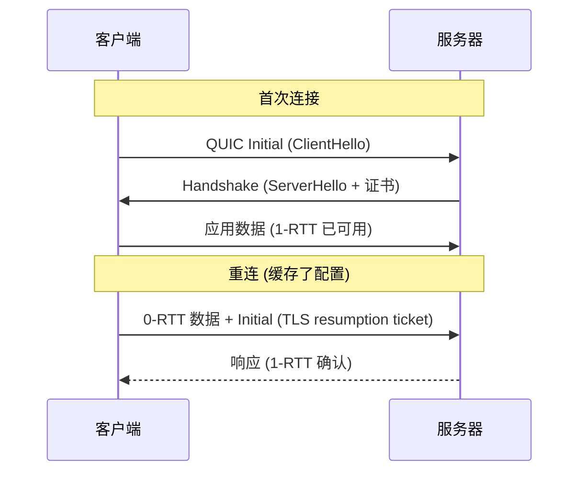

**TL;DR：** QUIC 不是“更快更稳的 TCP”，而是把可靠传输、TLS 握手和多路复用重新组合到 UDP 之上的协议。三笔账：①**丢包影响从连接级降到流级，但同一流仍会等待缺口，连接级拥塞控制/流量控制也仍共享**；②**0-RTT 用重放风险换握手早发数据**，应用必须只发送 replay-safe 的请求并接受服务器拒绝/重放处理；③**Connection ID 支持路径变化，但迁移需要新路径验证、CID 管理和中间设备配合**。`curl --http3` 能证明一次 HTTP/3 请求，不等于已经证明 0-RTT、迁移或丢包收益。

## 一、先分清：QUIC 到底重写了什么

HTTP/2 的队头阻塞常常被误讲成"多路复用的请求排队问题"。真实机制是：HTTP/2 把多条请求复用到**一条 TCP 连接**上，每条请求是独立流（stream）；但 TCP 是**有序字节流**——第 3 号流的包丢了，TCP 收不到第 3 号流，**2 号流的后续包也得在接收缓冲区里等着**（虽然它们没丢）。丢包的代价被 TCP 的全局有序性摊给了所有流。

QUIC 把"可靠传输 + 多路复用"搬到 UDP 上重写：**每一条流独立编号、独立确认、独立重传**，流的边界进入传输层：

```
TCP + HTTP/2:      [ TCP 段: 字节流 1,2,3,... ]  ← 丢一个字节, 整条流卡住
QUIC + HTTP/3:     [ 流1 数据 ] [ 流2 数据 ] [ 流3 数据 ]  ← 丢流2的包, 流1/3照常
```

所以准确的说法是：**QUIC 把 TCP 字节流造成的连接级队头阻塞降到流级**——一条流的包丢失时，其他流只要还有信用和拥塞窗口，通常可以继续交付；但丢包所在的那条流仍要等待重传，连接级拥塞控制、连接窗口和调度仍然共享。它不是把所有等待都消除。

代价是 QUIC 在协议实现中维护乱序重组、确认、加密和流控状态（常见实现位于用户态），于是：

- QUIC 的逻辑**跑在用户态**（库里，如 quiche/ngtcp2），升级协议版本不升级内核。
- 每包都要带**连接 ID + 流 ID + 偏移 + 确认号**，包头比 TCP 段大，小请求的协议开销占比升高。

## 二、握手账：1-RTT 建立连接，0-RTT 重建连接

TLS 1.3 把"TCP 握手 + TLS 握手"合并，QUIC 在此基础上再合一步：**首次连接 1-RTT**（ClientHello → ServerHello+证书+配置），重连 0-RTT（客户端缓存的服务器配置直接发请求）。



0-RTT 的快是真的，但它是**拿重放风险换的**：0-RTT 数据可能在服务器完成本次握手确认之前被接受，攻击者可以把可观察的早期数据重放。所以应用和服务器必须共同定义 replay-safe 的请求边界：

- RFC 9001/HTTP 应用语义要求：不要把不可安全重放的副作用放进 0-RTT；“GET”也不自动等于没有副作用，最终由应用合同决定。
- 服务器需要按 TLS/QUIC 和应用协议设计 anti-replay 窗口、ticket 使用和拒绝策略，不能只写成一个固定 cache 数字。
- **0-RTT 的节省只出现在恢复连接的早期发送阶段**；已建立的连接不会因为启用 0-RTT 再减少一个 RTT。

一句话记：**QUIC 的快不是每时每刻快，是"换网络时不断连"和"重连时不重握"这两个场景快**。

## 三、迁移账：Connection ID 让连接不认识网络

TCP 的连接身份是**四元组**（srcIP:port, dstIP:port）——换 Wi-Fi，IP 变了，连接立刻断裂，应用必须重连重握。QUIC 的连接身份是 **Connection ID**（客户端随机生成，写在每个包里），四元组只是"当前投递地址"：

```
换网瞬间:
旧 IP 上的连接  →  连接 ID 不变  →  新 IP 直接发新包  →  服务器认可, 连接继续
TCP 的换网    →  四元组失效   →  必须重连, 重新握手, 至少一个 RTT
```

这为移动场景的路径变化提供了协议支持，但不是“换网免费不断连”：端点要维护一组可轮换的 Connection ID，服务器要对新路径做验证，拥塞控制和 NAT/LB 状态也可能重新收敛。CID 在适用的 QUIC 包头中可被中间设备读取，但长度、是否轮换和路由编码由连接协商/实现决定，不是固定 8 字节；负载均衡器若需要无状态转发，必须理解部署方的 CID 路由合同，或者把连接固定到同一后端。

## 四、复现：先证明协议可用，再分别测 0-RTT 与迁移

```bash
# 1. 确认可用性：这只证明一次 HTTP/3 请求成功
curl --http3-only https://cloudflare-quic.com/ -o /dev/null -w "%{http_version}\n"

# 2. 抓包看 UDP 与可见的 QUIC 包头（过滤 UDP 443）
sudo tcpdump -i en0 -n -v udp port 443 -c 50
# CID 长度不是固定 8 字节；Packet Number 和帧内 Stream ID 不能直接
# 从普通 tcpdump 文本输出当作明文事实，需要 qlog/Wireshark 解密材料。
```

`curl --http3-only` 会打印 `HTTP/3`，但它不自动证明连接迁移或 0-RTT。要测 0-RTT，必须让同一客户端保存并复用服务器 session ticket，记录服务器是否接受 early data、请求是否 replay-safe；要测迁移，必须在同一 QUIC connection 上改变路径并记录 PATH_CHALLENGE/PATH_RESPONSE、CID、连接状态和应用请求结果。普通 `tcpdump` 只能作为 UDP/CID 可见性的线索，不能替代 qlog、TLS key log 和服务端日志。

```bash
# 模拟丢一条流的包，观察其他流（用 h2load/quiche 客户端较麻烦，这里给思路）
# 关键实验：同一连接两条流，故意丢其中一条的包 → 另一条流的吞吐不受影响
# 而 HTTP/2 在同样丢包下，两条流一起掉吞吐（对比实验见 quiche 的 demo）
```

诚实标注：流级隔离的收益取决于 RTT、丢包位置、拥塞控制、响应形状、连接窗口和实现；没有同一 trace 的 h2/h3 对照，就不能写固定丢包率、倍数或“公网必胜/内网无收益”。QUIC 选型要用目标用户的网络切换、丢包、代理/LB 支持、观测能力和运维成本共同决定。

## 五、部署账：谁来接这个新协议

| 维度 | 在 QUIC 侧 | 在 TCP 侧 |
| :--- | :--- | :--- |
| 协议实现 | 常见部署使用用户态库（quiche、ngtcp2、aioquic）；具体看实现 | TCP 通常由操作系统内核提供 |
| 中间设备 | LB/防火墙要认 Connection ID | 五元组即可 |
| 升级路径 | 更新库即升级 | 升级内核才换版本 |
| 调试 | 抓包工具（wireshark）需解析 QUIC | tcpdump 原生支持 |

对普通业务：如果用户主要走公网/移动网络，且 CDN、LB、客户端和服务端都能观测并验证 QUIC，迁移与流级隔离可能值得投入；如果是纯内网服务，则要先比较实际网络问题与新增运维复杂度。选型先问：用户是否常换网、丢包和 RTT 分布是什么、代理/LB 是否保留 UDP、出现 0-RTT 拒绝和路径验证失败时如何降级。

## 六、结论：QUIC 用流级隔离、路径验证与用户态重构换传输自由

QUIC 的三笔账：**TCP 字节流造成的队头阻塞从连接级降为流级**（同一流和连接级窗口仍会等待）、**0-RTT 用 replay-safe 合同换早期发送**（不是“所有 GET 都安全”）、**Connection ID 为路径变化提供身份连续性**（仍需路径验证、CID/LB 配置和降级）。它不是 TCP 2.0，而是把传输层能力重新放进可升级的协议实现；是否更快，必须由同一 trace、同一服务和同一失败口径测出来。

下一步：先用固定客户端/服务器记录 HTTP/3 成功请求，再分别做 session resumption、0-RTT 接受/拒绝、同连接路径变化和 h2/h3 丢包对照；保存 qlog、TLS/服务器日志、请求成功率、重试和 p95/p99。没有这些证据，只能说协议支持该机制，不能说你的服务已经获得迁移或延迟收益。

## 参考资料

1. RFC 9000：QUIC：A UDP-Based Multiplexed and Secure Transport—— https://www.rfc-editor.org/rfc/rfc9000
2. RFC 9001：QUIC 的 TLS 用法（0-RTT 与重放防护）—— https://www.rfc-editor.org/rfc/rfc9001
3. RFC 9114：HTTP/3—— https://www.rfc-editor.org/rfc/rfc9114
4. Google 官方博客：QUIC 设计与动机（2015 原文）—— https://blog.chromium.org/2015/04/a-quic-update-on-googles-experimental.html
5. curl HTTP/3 使用说明—— https://curl.se/docs/http3.html
6. Cloudflare：HTTP/3 部署实践—— https://blog.cloudflare.com/http3-the-past-present-and-future/

> 延伸阅读：QUIC 脚下的 TCP 邻居们——拥塞控制账本见[TCP 拥塞控制：从慢启动到 BBR](/writing/tcp-congestion-control-bbr)，可靠传输的重传账本见[TCP 超时与重传：丢包后网络在赌什么](/writing/tcp-retransmit-timeout-rto)，连接关闭的账本见[TIME_WAIT 到底在保护谁](/writing/time-wait-connection-reuse)。
