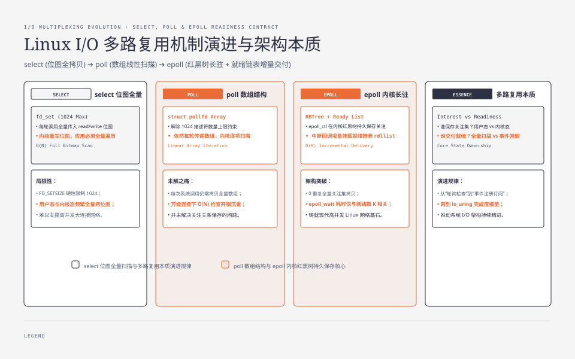
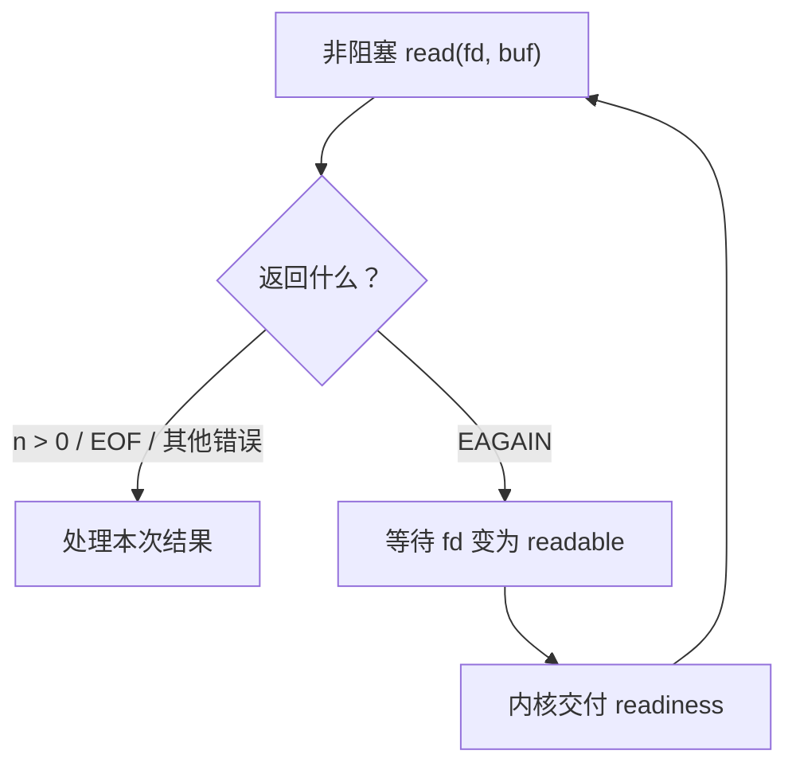
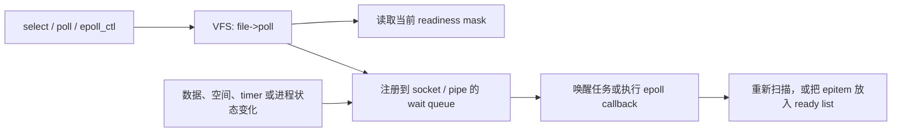
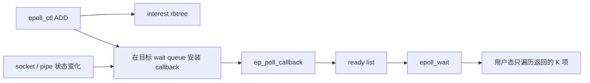
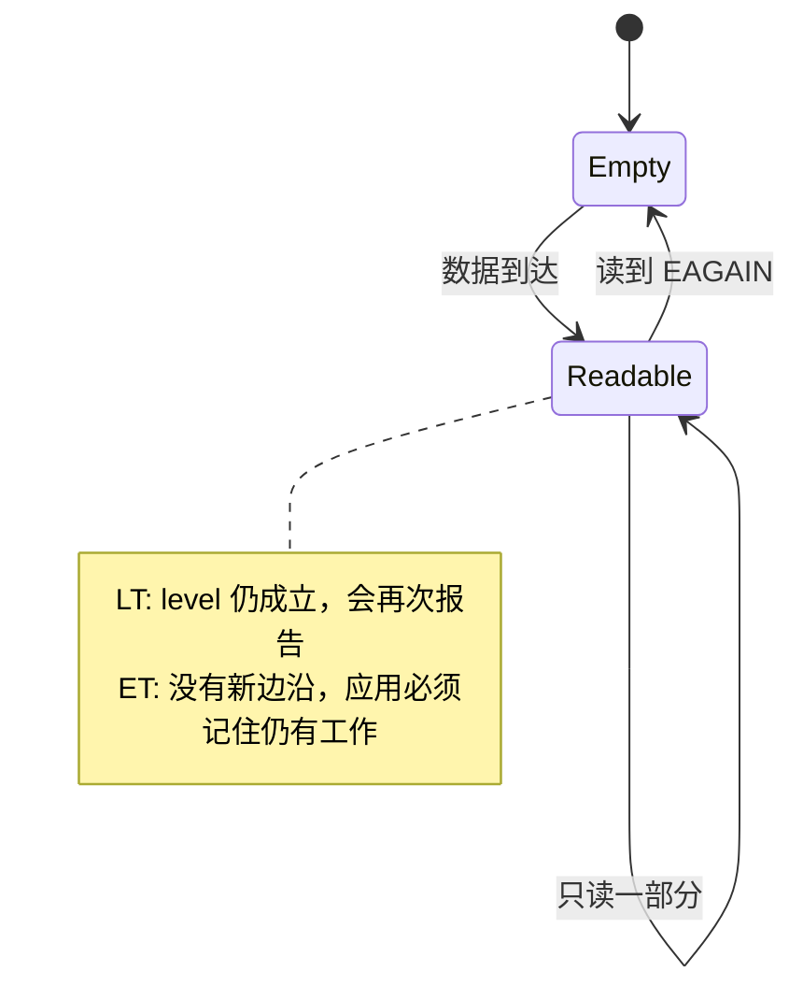
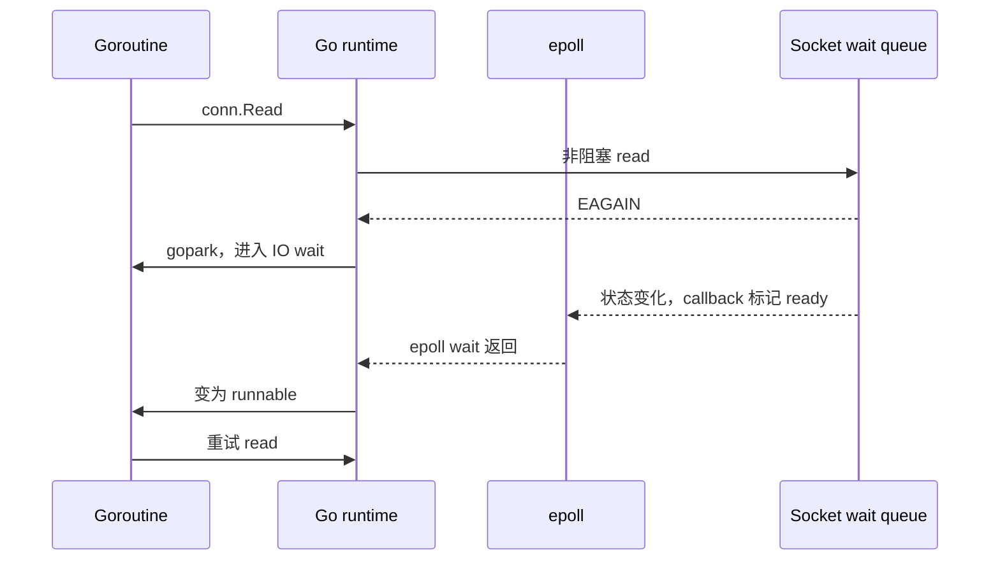

**TL;DR：** `select`、`poll`、`epoll` 交付的都不是一次完整 I/O，而是 readiness，也就是“现在可以尝试某类操作”。它们共享文件对象的 `poll` 回调与 wait queue 底座，真正的区别是关注集合保存多久、状态变化后怎样找到 ready fd：`select` 每轮传入并扫描位图，`poll` 每轮传入并扫描数组，`epoll` 则用 `epoll_ctl` 持久保存 interest，由唤醒回调增量维护 ready list。epoll 的结构优势取决于总关注量 `N`、就绪子集 `K` 与连接变化量 `Δ`，不是一句“`O(1)`”。近年的演进也没有只有“io_uring 替代 epoll”这一条线：`epoll_pwait2` 改进时间表达，Linux 6.9 的 busy polling 用 CPU 换尾延迟，`pidfd` 等对象扩大统一事件循环的范围，io_uring 则让 readiness 与 completion 开始长期共存。

“epoll 比 select 快，因为 epoll 是 `O(1)`”几乎解释不了真实系统。它没有告诉你线程无事件时睡在哪里，也没有告诉你 fd 变为 ready 后，内核怎样把它从上万个长期关注项中交付给用户态。

要真正比较三套 API，需要连续回答三个问题：

1. 应用关注哪些 fd，这个关注集合（interest set）保存在用户态还是内核，保存多久？
2. 当前没有任何 fd ready 时，任务挂在哪个 wait queue 上，谁负责唤醒？
3. 状态变化后，内核重新扫描全部候选，还是只把发生变化的对象放进就绪集合（ready set）？

所谓 I/O 多路复用，复用的是“等待多个 fd 的入口”：一个任务通过一次等待同时关注多个内核对象，等待接口返回 ready 子集，真正的 `read`、`write`、`accept` 仍由应用逐个执行。

`select`、`poll`、`epoll` 也不是一条依次调用的链，而是解决同一等待问题的三套接口。它们在 Linux 内核里共享文件对象的 `poll` 与 wait queue 合同，但保存 interest 和整理 ready 结果的方式不同。

这三个问题把 readiness 合同、Linux wait queue、`select/poll` 的每轮扫描、epoll 的 interest/ready 两类集合，以及后来的 busy polling 与 io_uring 连成一条主线。


---



## 一、先定义等待合同：readiness 只允许你尝试 I/O

事件循环处理非阻塞 fd 时，核心路径不是“先等到完整数据，再执行读取”，而是尝试、等待、再尝试：



这不是“调用 epoll 代替 read”。`read` 和等待接口承担的是两件不同的事：

- `read` 负责搬运字节，并返回字节数、EOF 或错误。
- `select`、`poll`、`epoll` 负责报告某类 I/O 当前是否 ready。
- readiness 到达后，应用仍然要再次调用 `read`。
- 如果另一个线程抢先读走了数据，或者状态在调度期间变化，第二次 `read` 仍可能返回 `EAGAIN`。

因此，readiness 更接近一张随时可能过期的通行证，不是对字节数的预留。

### readable 不等于“收到一条完整消息”

对不同对象，readable 的含义并不相同：

| 对象 | readable 通常表示 | 应用接下来必须确认什么 |
| --- | --- | --- |
| 已连接 TCP socket | 有字节可读，或读方向到达 EOF/错误 | `read/recv` 的返回值、协议缓冲区是否完整 |
| 监听 socket | accept queue 中可能有连接 | 循环 `accept4`，并处理 `EAGAIN` |
| pipe | 缓冲区有数据，或写端已经关闭 | 读取数据，直到 EOF 或 `EAGAIN` |
| `timerfd` | 一个或多个 timer expiration 待消费 | `read` 返回的累计过期次数 |
| `pidfd` | 所代表的进程已经退出 | `waitid` 等后续处理 |
| 非阻塞 connect 的 socket | 连接过程已经有结果 | 用 `getsockopt(SO_ERROR)` 判断成功或失败 |

TCP 是字节流。一次 `EPOLLIN` 可能只对应半个请求，也可能对应多个请求粘在同一批字节里。协议边界只能由应用层解析器维护。

readable 还包含 EOF。对端关闭写方向后，即使没有新业务数据，`read` 也能立即返回 0，所以“不会阻塞”依然成立。

### writable 也不是“任意大小都能一次写完”

writable 表示内核当前能接受至少一部分数据。一个 8 MB 响应仍可能短写，剩余部分要进入用户态输出缓冲区，等下一次 writable 再继续。

这也是为什么事件循环不能把 readiness 当作 completion。`EPOLLOUT` 没有替你完成 `send`，更没有替你管理剩余 buffer。

### `EAGAIN` 是状态机边界，不是网络故障

非阻塞 I/O 最重要的几种结果如下：

| 结果 | 含义 | 下一步 |
| --- | --- | --- |
| `n > 0` | 本次处理了 `n` 个字节 | 更新协议或输出缓冲区 |
| `n == 0` | 流的读方向到达 EOF | 处理 half-close 或关闭连接 |
| `EAGAIN/EWOULDBLOCK` | 此刻没有更多工作可立即完成 | 回到 readiness 等待 |
| `EINTR` | syscall 被信号打断 | 通常重试 syscall |
| 其他错误 | 连接或对象进入错误状态 | 记录原因并清理生命周期 |

把 `EAGAIN` 看成“本轮 drain 已结束”，后面的 `select`、`poll`、`epoll` 才会连成一条完整路径。


## 二、三套 API 的共同底座不是忙扫描，而是 wait queue

“`select` 每次扫描所有 fd”很容易让人误以为：线程睡眠期间，内核在循环读取每个 socket 的状态。Linux 并不是这样工作。

fd 只是进程文件描述符表中的一个整数索引。内核先把它解析为 `struct file`，也就是对 open file description 的引用，再通过这个对象的操作表进入 socket、pipe 或其他子系统。多个 fd 可以因为 `dup` 或 `fork` 指向同一个 open file description，这也是后文 close 与复用问题的根源。

Linux 的文件对象可以实现 `file_operations.poll`。socket、pipe、eventfd 等对象会在这个回调里做两件事：

1. 根据当前状态返回 readiness mask，例如 `EPOLLIN` 或 `EPOLLOUT`。
2. 如果当前不 ready，把等待者挂到对象对应的 wait queue。

以 `select` 或 `poll` 为例，一次没有立即命中事件的等待可以概念化为：

```text
遍历候选 fd
  -> 调用每个文件对象的 poll 回调
  -> 读取当前 readiness mask
  -> 在对象的 wait queue 上登记当前任务

没有任何 fd ready
  -> 当前任务睡眠

网卡收包 / pipe 写入 / timer 到期
  -> 对象状态改变
  -> wait queue 唤醒任务

任务醒来
  -> 再次遍历候选 fd
  -> 生成返回给用户态的 ready 结果
```

这段是概念化路径，不是逐行源码。对应的一手实现位于 Linux `fs/select.c`：`do_select`、`do_poll` 最终调用 `vfs_poll`；`poll_wait` 把等待项加入 wait queue；`poll_schedule_timeout` 才真正让任务睡眠。[Linux `fs/select.c`](https://github.com/torvalds/linux/blob/master/fs/select.c) 可以看到这几步如何连接。



三套 API 的关键差异，不是“有没有睡眠和唤醒”，而是**关注关系保存多久、唤醒后从哪里找到 ready fd**：

| 问题 | `select` | `poll` | `epoll` |
| --- | --- | --- | --- |
| 用户如何表达 interest | 三个位图 | `pollfd[]` 数组 | `epoll_ctl ADD/MOD/DEL` |
| interest 在内核保存多久 | 本次调用 | 本次调用 | 跨多次 `epoll_wait` 持续存在 |
| 第一次检查谁 | `0..nfds-1` 中置位的 fd | 数组中的每一项 | `epoll_ctl` 时检查，之后由回调跟踪 |
| 唤醒后怎样找 ready | 再扫位图候选 | 再扫数组 | 从 ready list 取事件 |
| 用户怎样取返回结果 | 再扫返回位图 | 再扫 `revents` | 遍历返回的 `K` 个事件 |

这张表就是从 `select` 演进到 `epoll` 的主轴。

## 三、`select`：位图让接口简单，也把 fd 范围带进每一次等待

`select` 接受三个 `fd_set`：

- `readfds`：关注可读。
- `writefds`：关注可写。
- `exceptfds`：关注 exceptional condition，常见对应 `POLLPRI`。
- `nfds`：三个集合中最大 fd 加 1，不是 fd 数量。

`fd_set` 通常实现为位图。fd 7 对应第 7 个 bit，所以查找和拷贝可以按机器字处理。这在 fd 少而且编号紧凑时很直接。

它的循环成本也由这个接口形状决定：

1. 应用保存一份 master 位图，因为 `select` 会原地把输入集合改成 ready 集合。
2. 每次调用都把位图交给内核。
3. 内核检查到 `nfds-1` 为止的候选 fd，并为本轮等待建立 wait queue 项。
4. 唤醒后，内核重新检查 readiness，生成返回位图。
5. 应用再用 `FD_ISSET` 扫描返回结果。

`select` 的成本更接近“最大 fd 范围”，不是 ready fd 的数量。只关注 fd 3 和 fd 1000，也必须让 `nfds` 至少等于 1001。

Linux 上还要区分 kernel 与 libc：内核系统调用可以根据 `nfds` 处理更大的 bitset，但 glibc 的 `fd_set` 是固定大小，`FD_SETSIZE` 为 1024；对大于 1023 的 fd 使用 `FD_SET` 属于未定义行为。[`select(2)` 手册](https://man7.org/linux/man-pages/man2/select.2.html) 已明确建议现代大规模应用改用 `poll` 或 `epoll`。

### `pselect` 修的是 signal 竞态，不是扫描成本

如果程序先检查一个 signal flag，再调用 `select`，信号可能恰好在两步之间到达，随后线程无限睡眠。`pselect` 把 signal mask 的临时切换和 fd 等待合成一个原子动作，并使用 `timespec` 表达 timeout。

它没有改变位图、`nfds` 或每轮扫描，因此不是“更快的 select”。

### 什么时候 `select` 仍然合理

当 fd 数量很少、必须覆盖广泛 POSIX 平台，或者代码只是一个诊断工具时，`select` 的可读性可能比扩展性更重要。

需要接受的边界也很清楚：1024 的 libc 位图限制、value-result 参数、按 fd 范围扫描，以及多线程 close 行为的可移植性问题。

## 四、`poll`：去掉位图和最大 fd 限制，却没有去掉每轮 `N` 项

`poll` 把 interest 改成数组：

```c
struct pollfd {
    int   fd;       /* 被观察的 fd */
    short events;   /* 输入：关注的事件 */
    short revents;  /* 输出：实际发生的事件 */
};
```

这一步解决了 `select` 的两个接口问题：

- 数组只放真正关注的 fd。fd 号是 10000，也不必扫描 `0..9999`。
- 没有 `FD_SETSIZE` 位图上限，实际边界来自 `nfds`、`RLIMIT_NOFILE` 和内存。

`fd < 0` 的项会被本轮忽略，适合临时禁用一个槽位。`POLLERR`、`POLLHUP`、`POLLNVAL` 由内核写入 `revents`，即使 `events` 没有订阅也可能出现。

但 `poll` 没有改变等待算法的生命周期：

1. 每次调用都把 `pollfd[]` 交给内核。
2. 内核逐项调用目标文件的 `poll` 回调，并建立本轮 wait queue 项。
3. 没有事件就睡眠；醒来后重新扫描数组。
4. 用户态再逐项检查 `revents`。

所以，如果 `N = 10000`、只有 `K = 3` 个 fd ready，内核与用户态仍然围绕 10000 个数组项工作。`poll` 优化的是“如何表达集合”，不是“如何只交付 ready 子集”。

`ppoll` 与 `pselect` 类似，增加 `timespec` timeout 和原子 signal mask 切换；它同样不改变 `N` 项扫描。

### `poll` 的现实位置

`poll` 很适合三类场景：

- 需要比 `select` 更自然的动态数组。
- fd 数量中等，扫描成本不是瓶颈。
- 需要 POSIX 可移植性，不愿把核心循环绑定到 Linux epoll。

如果 interest 集合小，`poll` 的简单数据结构可能比维护一个长期 epoll 实例更划算。API 更新、锁和生命周期从来不是免费的。

## 五、`epoll`：把 interest 的维护从每次 wait 前移到 `epoll_ctl`

epoll 把“管理关注集合”和“等待 ready 结果”拆成了两类操作。下面只展示接口形状，省略错误处理与连接状态对象的声明：

```c
int epfd = epoll_create1(EPOLL_CLOEXEC);

struct epoll_event event = {
    .events = EPOLLIN,
    .data.ptr = connection_state,
};
epoll_ctl(epfd, EPOLL_CTL_ADD, client_fd, &event);

struct epoll_event ready[128];
int n = epoll_wait(epfd, ready, 128, -1);
```

`epoll_ctl` 负责改变 interest list：

- `EPOLL_CTL_ADD`：注册 fd、事件 mask 和用户数据。
- `EPOLL_CTL_MOD`：修改 mask，或重新 arm `EPOLLONESHOT`。
- `EPOLL_CTL_DEL`：移除关注项。

`epoll_wait` 只负责从 ready list 取最多 `maxevents` 个事件。Linux 手册把 epoll 实例直接描述为 interest list 与 ready list 两部分。[`epoll(7)`](https://man7.org/linux/man-pages/man7/epoll.7.html)

### interest list 与 ready list 怎样连起来

当前 Linux 实现比“两张表”多一些并发细节，但主路径并不神秘：

1. `EPOLL_CTL_ADD` 创建一个 `epitem`，放入 epoll 实例的 interest 红黑树。
2. epoll 调用目标文件的 `poll` 回调，在它的 wait queue 上安装 `ep_poll_callback`。
3. 如果 fd 注册时已经 ready，`epitem` 会立即进入 ready list。
4. 之后 socket、pipe 等对象发生状态变化并唤醒 wait queue，callback 把对应 `epitem` 标记为 ready。
5. `epoll_wait` 从 ready list 取出事件，复制到用户态。



Linux `fs/eventpoll.c` 中的 `struct eventpoll` 仍包含 interest 红黑树 `rbr` 与 ready list `rdllist`。在 `epoll_wait` 正把事件复制到用户态时，新事件可能并发到达；内核还使用 `ovflist` 暂存这批事件，扫描结束后再合并，避免“复制窗口”丢通知。[Linux `fs/eventpoll.c`](https://github.com/torvalds/linux/blob/master/fs/eventpoll.c)

这就是 epoll 的结构优势：长期 interest 不必在每次 wait 时重新提交，ready 由对象唤醒路径增量维护。

### 为什么“epoll 是 `O(1)`”仍然是坏结论

设：

- `N`：interest 集合大小。
- `K`：某轮 ready 的数量。
- `Δ`：这一轮之间新增、删除或修改的 interest 数量。

可以用下面的成本形状建立直觉，但不要把它当成严格 benchmark 公式：

| 路径 | 每轮主要工作 |
| --- | --- |
| `select` | 复制/扫描位图候选，成本主要随 fd 范围增长；用户再扫返回位图 |
| `poll` | 复制/扫描 `N` 个 `pollfd`；用户再扫 `N` 个 `revents` |
| `epoll` | 为 `Δ` 次变更支付 `epoll_ctl`；唤醒路径维护 ready；wait 主要交付 `K` 项 |

epoll 仍然有这些成本：

- `epoll_ctl` 的 syscall、锁、红黑树更新和 wait queue 注册。
- 每个 interest 项占用内核内存。
- ready callback、ready list 锁与事件复制。
- `K` 很大时，处理 ready 事件本身就是 `O(K)`。
- 业务 handler、协议解析、内存分配和 cache miss 往往比等待 API 更贵。

因此，epoll 最有结构优势的场景是：`N` 很大、`K/N` 较低、interest 较稳定。若连接每轮都 ADD/DEL，或几乎所有 fd 都一直 ready，优势会缩小，甚至被管理成本覆盖。

### fd 数字不是稳定身份

epoll interest 的 key 是“fd 数字 + open file description”。`dup`、`fork` 与 close 会让生命周期比一个整数复杂；fd 号也可能很快被新连接复用。

工程上更稳妥的做法是把 `epoll_event.data.ptr` 指向带生命周期或 generation 的连接状态，并在关闭时先 `EPOLL_CTL_DEL`、标记对象失效，再延迟回收可能仍被当前事件 batch 引用的内存。Go runtime 也会用序列号过滤陈旧 fd 事件，原因正是这里的复用竞态。

## 六、LT、ET 与 ONESHOT：epoll 最难的不是快，而是不漏状态

epoll 默认是 level-triggered，也就是 LT。加上 `EPOLLET` 后是 edge-triggered，也就是 ET。

假设 pipe 中到达 2 KB，应用第一次只读 1 KB：

| 下一步 | LT | ET |
| --- | --- | --- |
| 缓冲区还剩 1 KB | fd 仍处于 readable level | fd 仍 readable，但没有重新跨过“不可读 → 可读”的边沿 |
| 再次 `epoll_wait` | 会继续报告 | 可能继续睡眠 |
| 正确策略 | 可以分批读，但仍要避免阻塞 | 非阻塞，并持续处理到 `EAGAIN` |



### ET 的正确结束条件是 `EAGAIN`

下面是读方向的伪代码，省略连接对象、buffer 扩容和协议解析细节：

```c
for (;;) {
    ssize_t n = recv(fd, buf, sizeof(buf), 0);

    if (n > 0) {
        consume_bytes(buf, n);
        continue;
    }
    if (n == 0) {
        mark_peer_write_closed();
        break;
    }
    if (errno == EINTR) {
        continue;
    }
    if (errno == EAGAIN || errno == EWOULDBLOCK) {
        break;  /* 本轮已经 drain 完 */
    }

    fail_connection(errno);
    break;
}
```

监听 socket 也要循环 `accept4` 到 `EAGAIN`。写方向则循环发送用户态输出缓冲区，短写后保留 offset，直到清空或返回 `EAGAIN`。

### 即使使用 LT，也建议 fd 保持非阻塞

readiness 是状态快照，不是锁。另一个 worker 可能先消费数据，Linux 也记录了少数“报告 readable 后读取仍可能阻塞”的情况。非阻塞 fd 能把这种竞态收敛回 `EAGAIN`，避免整个 event-loop 线程被意外挂住。

ET 强制你遵守这条纪律；LT 只是更宽容，不代表阻塞 syscall 突然安全。

### 四个最常见的事件循环错误

**1. 一直订阅 `EPOLLOUT`。** 空闲 TCP socket 通常长期可写。LT 下，如果没有待发送数据却保留 `EPOLLOUT`，`epoll_wait` 会反复立即返回。只有输出缓冲区非空时才添加写关注，清空后 `MOD` 移除。

**2. 看到 `EPOLLHUP` 就立刻 close。** HUP 可以和 `EPOLLIN` 同时出现，内核缓冲区里可能还有数据。先 drain 可读内容，再根据 `read == 0`、协议状态和 `EPOLLRDHUP` 处理 half-close。

**3. ET 读到业务帧完整就停。** “一个请求已经完整”不等于内核缓冲区已经 drain。剩余字节不会保证产生新 edge。要么继续读到 `EAGAIN`，要么把 fd 保留在用户态 ready queue 中继续处理。

**4. `EPOLLONESHOT` 处理完忘记 rearm。** ONESHOT 在一次事件交付后禁用该 interest，worker 必须用 `EPOLL_CTL_MOD` 重新 arm。它适合明确多 worker 下的处理权，不是 ET 的别名。

`EPOLLEXCLUSIVE` 解决的是另一种并发问题：多个 epoll 实例同时关注同一目标 fd 时，减少惊群唤醒。它从 Linux 4.5 起可用，只能在 `EPOLL_CTL_ADD` 时设置，并不替代连接级的 ONESHOT 状态管理。[`epoll_ctl(2)`](https://man7.org/linux/man-pages/man2/epoll_ctl.2.html)

### drain 到 `EAGAIN` 也可能造成饥饿

如果一个连接持续有大量数据，单个 handler 无限制 drain 会让其他 ready fd 长时间得不到处理。Linux epoll 手册建议维护用户态 ready list，并在 fd 上记录 ready 状态，轮转处理。

ET 下实施预算时要特别小心：如果因为“本轮最多处理 64 KB”而在 `EAGAIN` 之前停下，不能指望内核再发 edge。应用必须把这个 fd 留在自己的 ready queue，下一轮主动继续 drain。公平性从内核通知策略转成了用户态调度问题。

## 七、Go netpoll 怎样消费 epoll：把 ready fd 翻译成 runnable goroutine

到这里，`select/poll/epoll` 的主线已经完整。如果只关心三套 API 的原理，读到第六节已经足够。Go 不是这套机制的起点，也不会依次调用三套 API；本节只用它验证“语言 runtime 如何消费 epoll”。

下面是 [Go 1.27.0 `internal/poll.FD.Read`](https://github.com/golang/go/blob/go1.27.0/src/internal/poll/fd_unix.go) 的核心节选，省略了锁、零长度读和 EOF 包装：

```go
for {
	n, err := ignoringEINTRIO(syscall.Read, fd.Sysfd, p)
	if err != nil {
		n = 0
		if err == syscall.EAGAIN && fd.pd.pollable() {
			if err = fd.pd.waitRead(fd.isFile); err == nil {
				continue
			}
		}
	}
	err = fd.eofError(n, err)
	return n, err
}
```

它正是“尝试、等待、再尝试”：

1. `read` 有结果就直接返回，这是快路径。
2. `read` 返回 `EAGAIN`，`waitRead` 进入 runtime netpoll。
3. 当前 goroutine 被标记为 `IO wait`；等待的是 G，不必让承载它的 M 一直阻塞在 socket read 上。
4. Linux epoll 返回 readiness 后，runtime 把等待读或写的 G 变成 runnable。
5. G 再运行时回到循环顶部，重新执行 `read`。

Linux 后端在注册 fd 时使用 `EPOLLIN | EPOLLOUT | EPOLLRDHUP | EPOLLET`，并在 `netpoll` 中调用 `EpollWait`。这些细节可以直接在 [Go 1.27.0 `runtime/netpoll_epoll.go`](https://github.com/golang/go/blob/go1.27.0/src/runtime/netpoll_epoll.go) 核对。



Go runtime 还要处理 deadline、close 与 fd 复用。`pollDesc` 把读写等待者、deadline、closing 状态和 fd sequence 放在一起，否则 timeout 与网络事件同时发生时会丢唤醒，旧 fd 的晚到事件也可能误投给复用同一数字的新连接。

这些属于 runtime 如何消费 epoll，不是 epoll 本身的合同。对本文主线，记住两点就够了：

- Go 把阻塞式 API 建在非阻塞 syscall 与 readiness 上。
- epoll 只让 G 有资格重试 `read`，不会替 G 完成读取。

这条结论有平台和对象边界。macOS/BSD 的 Go runtime 使用 kqueue，Windows 使用 IOCP；普通文件、裸 syscall、阻塞 cgo 调用也不一定进入同一条 netpoll 路径。截至 2026-08-23，Go 1.27.0 已发布，标准 Linux runtime 仍使用 epoll，而不是默认把 `net.Conn` 切到 io_uring。[Go release history](https://go.dev/doc/devel/release)

## 八、用同一个实验观察三套 API，不拿微实验伪装性能结论

仓库里的三个最小 C 程序都做同一件事：

1. 创建两条 pipe。
2. 只向第二条 pipe 写入 `pipe-1-ready`。
3. 同时等待两个读端。
4. 断言只返回第二个读端。

对应源码：

- [`select_demo.c`](https://github.com/MoreConsequence/MoreConsequence.github.io/blob/main/experiments/select-poll-epoll/select_demo.c)
- [`poll_demo.c`](https://github.com/MoreConsequence/MoreConsequence.github.io/blob/main/experiments/select-poll-epoll/poll_demo.c)
- [`epoll_demo.c`](https://github.com/MoreConsequence/MoreConsequence.github.io/blob/main/experiments/select-poll-epoll/epoll_demo.c)

macOS 可以运行 POSIX 的两份程序：

```bash
cc -std=c11 -Wall -Wextra -Wpedantic \
  experiments/select-poll-epoll/select_demo.c -o /tmp/select_demo
cc -std=c11 -Wall -Wextra -Wpedantic \
  experiments/select-poll-epoll/poll_demo.c -o /tmp/poll_demo

/tmp/select_demo
/tmp/poll_demo
```

本机输出：

```text
select ready=1 fd=5 payload=pipe-1-ready
poll ready=1 fd=5 payload=pipe-1-ready
```

Linux 再编译并运行 epoll 版本：

```bash
cc -std=c11 -Wall -Wextra -Wpedantic \
  experiments/select-poll-epoll/epoll_demo.c -o /tmp/epoll_demo
/tmp/epoll_demo
```

记录下来的 Linux GCC 14 输出是：

```text
epoll ready=1 fd=5 payload=pipe-1-ready
```

这个实验只证明共同合同：三套 API 都能从两个 interest 中返回一个 readable fd。它没有测量 `N` 增长、就绪密度、syscall 次数、吞吐、CPU 或尾延迟，因此不能拿来宣称 epoll 比 poll 快多少。

## 九、近年的扩展：epoll 仍在进化，io_uring 开始改变交付合同

epoll 没有因为 io_uring 出现就停止演进。近年的变化大致分成四类：更精细的等待、低延迟主动轮询、更多 fd 类型，以及 readiness 与 completion 的混合。

### `epoll_pwait2`：timeout 更精细，readiness 没有改变

`epoll_wait` 的 timeout 单位是毫秒。Linux 5.11 增加 `epoll_pwait2`，改用 `timespec` 表达纳秒分辨率 timeout，并保留 signal mask 的原子切换能力。[`epoll_pwait2(2)`](https://man7.org/linux/man-pages/man2/epoll_pwait2.2.html)

它解决的是等待接口的时间表达，不是 I/O 模型：

- 返回的仍是 ready fd。
- 应用仍要调用 `read`、`write` 或 `accept`。
- 实际唤醒仍受时钟粒度和调度延迟影响，纳秒参数不等于纳秒级准时。

这是一个很好的判断练习：API 参数更精细，不代表交付合同从 readiness 变成 completion。

### Linux 6.9 的 epoll busy polling：用 CPU 和 IRQ 策略换延迟

Linux 6.9 与 glibc 2.40 增加 `EPIOCSPARAMS` / `EPIOCGPARAMS`。应用可以在单个 epoll fd 上配置：

```c
struct epoll_params {
    uint32_t busy_poll_usecs;
    uint16_t busy_poll_budget;
    uint8_t  prefer_busy_poll;
    uint8_t  __pad;
};
```

这让 `epoll_wait` 在睡眠前主动触发或参与 NAPI busy polling。目标不是改变 ready 语义，而是在低延迟网络场景里，尝试在设备中断到来前就发现数据。[`ioctl_eventpoll(2)`](https://man7.org/linux/man-pages/man2/ioctl_eventpoll.2.html)

代价很直接：

- busy poll 消耗 CPU，并可能增加能耗。
- `busy_poll_budget` 改变每轮最多处理的 packet 数量。
- `prefer_busy_poll` 还会影响 IRQ mitigation 策略。
- 内核文档要求应用合理组织 NAPI ID；把来自不同 RX queue 的连接随意塞进同一个 epoll 实例，可能得不到预期收益。
- 参数过大可能压制其他任务，过小又无法覆盖目标等待窗口。

这不是通用 Web 服务的默认优化。它更适合固定 CPU、明确 NIC queue、可测 p99/p999 与功耗的低延迟系统。[Linux NAPI 文档](https://docs.kernel.org/networking/napi.html) 给出了 epoll busy polling 与 IRQ suspension 的完整约束。

### fd 化让 epoll 从网络循环变成统一事件循环

epoll 的一个长期价值是：它观察的是 pollable file，而不只是 TCP socket。Linux 不断把更多内核对象包装成 fd：

| fd 类型 | 何时 readable | 能统一进什么流程 |
| --- | --- | --- |
| `timerfd` | timer 到期 | 定时任务、连接超时 |
| `signalfd` | 被 mask 的 signal 待消费 | 信号处理 |
| `eventfd` | 计数器非零 | 线程或 runtime 唤醒 |
| `inotify fd` | 文件系统事件到达 | 配置或目录监听 |
| `pidfd` | 目标进程退出 | supervisor、子进程生命周期 |

`pidfd_open` 从 Linux 5.3 起提供稳定的进程引用，并可被 `select`、`poll`、`epoll` 监控。它避开了 PID 数字复用的一部分竞态，也让“socket 数据、timer、signal、进程退出”进入同一套等待循环。[`pidfd_open(2)`](https://man7.org/linux/man-pages/man2/pidfd_open.2.html)

这条应用方向很值得单独研究：epoll 不只是高并发网络 API，它也是 Linux “把异步状态暴露为 fd”设计的汇合点。

### io_uring 有 readiness 路径，也有 completion 路径

把 epoll 与 io_uring 简化成“旧 API 对新 API”会错过最有意思的部分。io_uring 内部仍大量依赖 readiness，而且提供不止一种合同：

| 接口 | 应用提交什么 | CQE 告诉应用什么 | 之后还要自己 `recv` 吗 |
| --- | --- | --- | --- |
| epoll | interest | fd 现在 ready | 要 |
| `IORING_OP_POLL_ADD` | 一次 poll 条件 | readiness mask | 要 |
| `POLL_ADD_MULTI` | 可重复的 poll 条件 | 多个 readiness CQE | 要 |
| `IORING_OP_RECV` | fd、buffer、读取请求 | 实际读取字节数或错误 | 不要重复提交同一次 recv |
| multishot recv/accept/read | 可产生多次结果的请求 | 多个 completion CQE | 按 `IORING_CQE_F_MORE` 管理生命周期 |

`IORING_POLL_ADD_MULTI` 从 Linux 5.13 起允许一个 poll 请求产生多个 CQE。手册明确说明：初次命中是 level-triggered，后续 multishot completion 按 edge-triggered 方式交付。它把 readiness 放进 completion queue，但没有把 poll 条件本身变成数据传输。[`io_uring_enter(2)`](https://man7.org/linux/man-pages/man2/io_uring_enter.2.html)

另一方面，`IORING_FEAT_FAST_POLL` 从 Linux 5.7 起允许一个暂时不能完成的 read/write 请求在内核里等待 readiness，ready 后继续执行原请求，而不是把阻塞工作丢给异步 worker。这个路径可以理解为“内核内部完成 poll + read/write 的接力”。[`io_uring_setup(2)`](https://man7.org/linux/man-pages/man2/io_uring_setup.2.html)

Linux 6.15 又加入 `IORING_OP_EPOLL_WAIT`。它允许把一个现有 epoll 实例的等待作为 io_uring 请求提交，用于仍有 legacy epoll 组件的混合事件循环。这个设计本身就说明迁移通常不是一次性替换，而是 readiness 与 completion 长期共存。

io_uring 把成本移到了新的地方：SQ/CQ 容量、buffer 注册与回收、multishot 生命周期、取消竞态、请求排序、backpressure 和内核版本探测。没有控制这些变量之前，不能仅凭“少 syscall”推导应用一定更快。

## 十、如何选择：先看状态所有权，再看规模

| 场景 | 优先起点 | 选择理由 | 最主要的代价 |
| --- | --- | --- | --- |
| fd 很少，强调 POSIX 可移植 | `select` | 接口直观，依赖少 | `FD_SETSIZE`、value-result 位图、按 fd 范围扫描 |
| fd 数量中等，集合经常在数组中变化 | `poll` | 数据结构自然，没有 1024 限制 | 每轮复制和扫描 `N` 项 |
| Linux，大量长期连接，低就绪率 | LT epoll | interest 持久，wait 交付 ready 子集 | Linux 专有，生命周期与内核状态更复杂 |
| 已有严格非阻塞状态机，愿意自己管理公平性 | ET epoll | 减少 level 重复交付 | drain、用户态 ready queue、half-close 都可能写错 |
| 多 worker 争抢同一连接 | `EPOLLONESHOT` | 一次事件只交给一个处理周期 | 必须可靠 rearm |
| 多 epoll 实例关注同一监听对象 | `EPOLLEXCLUSIVE` | 降低惊群 | 适用条件和可组合 flag 受限 |
| 低延迟、NIC/NAPI 拓扑可控 | epoll busy polling | 用主动轮询压缩部分唤醒延迟 | CPU、能耗、IRQ 策略与部署复杂度 |
| 需要提交操作、批量 completion、multishot | io_uring | 请求与结果可批处理，能把 poll 接力留在内核 | buffer、取消、队列饱和和版本矩阵 |
| 使用成熟语言 runtime 或事件库 | 优先使用标准网络抽象 | 平台 poller、deadline 与调度已被封装 | 仍需理解普通文件、阻塞扩展和自定义 fd 的边界 |

对多数 Linux 服务，LT epoll 是比 ET 更稳妥的第一版。只有在 profile 表明重复通知是实际瓶颈，并且应用已经能证明 drain、fairness、backpressure 和 close 状态机正确时，ET 才是值得承担的复杂度。

多数业务服务不该手写 epoll。学习它的价值，是能判断语言 runtime 或事件库在哪些对象上可以复用 readiness，为什么某些阻塞调用仍会占住线程，以及抽象层在普通文件、扩展库和自定义 fd 边界之外无法替你兜底。

## 十一、接下来最值得调研的，不是再背 API，而是做五组对照

如果要把本文继续做深，建议按下面的顺序推进。每一项都有明确变量和可证伪结果。

| 调研问题 | 控制变量 | 观测指标 | 你最终应该能回答什么 |
| --- | --- | --- | --- |
| `select/poll` 的 wait queue 怎样注册和撤销 | 同一组 pipe/socket，只更换等待 API | `vfs_poll`、`poll_wait`、唤醒与 rescan 调用路径 | “扫描”发生在何时，睡眠期间内核是否忙轮询 |
| epoll 优势由 `N`、`K` 还是 churn 决定 | `N`、ready 比例 `K/N`、每轮 ADD/DEL 比例 | CPU、syscall、context switch、p50/p99、`epoll_ctl` 占比 | 哪个工作负载区间才值得从 poll 切到 epoll |
| LT/ET 状态机是否真的不丢事件 | 分片写入、短写、half-close、backpressure、并发 close、漏 rearm | 数据完整性、卡死、重复唤醒、用户态 ready queue 长度 | ET 的收益是否覆盖正确性和公平性成本 |
| epoll busy poll 是否值得 CPU | Linux 6.9+，固定 NIC queue/CPU；改变 usecs 与 budget | p50/p99/p999、CPU、功耗、IRQ/softirq、丢包 | 延迟改善来自哪里，空闲与满载时各付出什么 |
| epoll 与 io_uring 的合同差异 | LT epoll、`POLL_ADD_MULTI`、recv/accept multishot、混合 `IORING_OP_EPOLL_WAIT` | SQE/CQE 数、syscall、buffer churn、取消延迟、队列溢出 | readiness、completion 与混合迁移分别适合什么 |

第一组可以直接从 Linux `fs/select.c`、`fs/eventpoll.c` 和目标对象的 `poll` 回调开始，用 ftrace、perf 或 bpftrace 观察可用符号。不要把某个内核版本的函数名写死成长期合同，trace 点应随目标 kernel 源码核对。

第二组 benchmark 至少要覆盖三种就绪密度：

- `N` 大、`K` 很小，这是 epoll 的优势区。
- `K/N` 接近 100%，用来观察 ready 处理成本。
- interest 高 churn，用来显露 `epoll_ctl` 管理成本。

每组需要相同协议语义、相同非阻塞策略、预热、多轮重复与原始输出。只测“一万条空闲连接”或“一次 5 秒吞吐”都不足以画出边界。

还有一条偏应用、但很适合做成完整小项目的路线：用一个 epoll loop 同时管理 listener、`timerfd`、`signalfd`、`eventfd` 与 `pidfd`，实现一个可取消、可超时、能感知子进程退出的 supervisor。它能把“epoll 只是网络并发技巧”升级成“Linux 如何统一异步状态”的系统认识。

## 十二、结论：本质差异在于谁保存关注集合，谁整理就绪事件

从一次非阻塞 I/O 尝试出发，完整路径可以收束成下面一条因果链：


`select`、`poll`、`epoll` 共享 readiness 与 wait queue 底座。它们的演进不是从“阻塞”到“不阻塞”，而是从“每轮重新提交和寻找 interest”到“长期保存 interest，增量维护 ready”。

读任何 I/O 等待实现时，可以固定追问六件事：

1. 返回的是 readiness 还是 completion？
2. interest 集合由用户态还是内核保存，保存多久？
3. 没有事件时，任务挂在哪个 wait queue 上？
4. 状态变化后，谁负责把对象放进 ready 集合？
5. `EAGAIN`、EOF、HUP、短读短写与 close 如何进入同一状态机？
6. 性能结论覆盖了 `N`、`K/N`、churn、CPU 和尾延迟中的哪些变量？

能回答这六个问题，就不需要靠“epoll 是 `O(1)`”记忆 I/O 多路复用。你会知道它为什么在大量稳定、低就绪率的连接上有优势，也会知道 LT/ET、busy poll 与 io_uring 分别把复杂度移到了哪里。

## 参考资料

### Linux 接口与实现

- [`select(2)`](https://man7.org/linux/man-pages/man2/select.2.html)：readiness、`fd_set`、`nfds`、`FD_SETSIZE`、`pselect` 与伪 ready 边界。
- [`poll(2)`](https://man7.org/linux/man-pages/man2/poll.2.html)：`pollfd`、`events/revents`、`ppoll`。
- [`epoll(7)`](https://man7.org/linux/man-pages/man7/epoll.7.html)：interest/ready list、LT/ET、ONESHOT、starvation 与 fd 生命周期。
- [`epoll_ctl(2)`](https://man7.org/linux/man-pages/man2/epoll_ctl.2.html)：ADD/MOD/DEL、事件位、`EPOLLRDHUP`、`EPOLLEXCLUSIVE`。
- [`epoll_wait(2)`](https://man7.org/linux/man-pages/man2/epoll_wait.2.html)：ready batch、timeout 与 round-robin 交付。
- [`epoll_pwait2(2)`](https://man7.org/linux/man-pages/man2/epoll_pwait2.2.html)：Linux 5.11 的 `timespec` timeout。
- [`ioctl_eventpoll(2)`](https://man7.org/linux/man-pages/man2/ioctl_eventpoll.2.html)：Linux 6.9 的 `epoll_params`。
- [Linux `fs/select.c`](https://github.com/torvalds/linux/blob/master/fs/select.c)：`do_select`、`do_poll`、`poll_wait` 与睡眠/重扫。
- [Linux `fs/eventpoll.c`](https://github.com/torvalds/linux/blob/master/fs/eventpoll.c)：interest 红黑树、`rdllist`、`ovflist` 与 callback。
- [Linux VFS](https://docs.kernel.org/filesystems/vfs.html)：`file_operations.poll` 合同。
- [Linux NAPI](https://docs.kernel.org/networking/napi.html)：epoll busy polling、NAPI ID 与 IRQ mitigation。

### fd 化应用与 io_uring

- [`timerfd_create(2)`](https://man7.org/linux/man-pages/man2/timerfd_create.2.html)：把 timer expiration 暴露为 readable fd。
- [`signalfd(2)`](https://man7.org/linux/man-pages/man2/signalfd.2.html)：把 signal 交付并入 fd 等待。
- [`pidfd_open(2)`](https://man7.org/linux/man-pages/man2/pidfd_open.2.html)：Linux 5.3 的进程 fd 与 pollability。
- [`io_uring_setup(2)`](https://man7.org/linux/man-pages/man2/io_uring_setup.2.html)：`IORING_FEAT_FAST_POLL`。
- [`io_uring_enter(2)`](https://man7.org/linux/man-pages/man2/io_uring_enter.2.html)：poll multishot、网络操作与 `IORING_OP_EPOLL_WAIT`。
- [`io_uring_prep_epoll_wait(3)`](https://man7.org/linux/man-pages/man3/io_uring_prep_epoll_wait.3.html)：legacy epoll 与 io_uring 的混合迁移场景。

### 一个 runtime 实例：Go netpoll

- [Go 1.27 release history](https://go.dev/doc/devel/release)：本文核对的 Go 稳定版本与发布日期。
- [Go 1.27.0 `internal/poll/fd_unix.go`](https://github.com/golang/go/blob/go1.27.0/src/internal/poll/fd_unix.go)：`EAGAIN → waitRead → retry`。
- [Go 1.27.0 `runtime/netpoll.go`](https://github.com/golang/go/blob/go1.27.0/src/runtime/netpoll.go)：`pollDesc`、`gopark` 与 ready G。
- [Go 1.27.0 `runtime/netpoll_epoll.go`](https://github.com/golang/go/blob/go1.27.0/src/runtime/netpoll_epoll.go)：Linux epoll 注册、eventfd 唤醒与 `EpollWait`。
